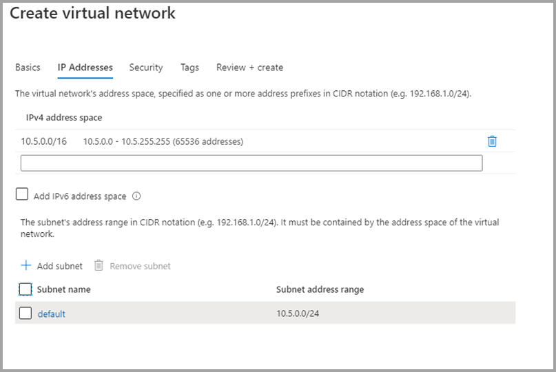

# <a name="private-links-for-accessing-power-bi"></a><span data-ttu-id="f76f8-103">ใช้ลิงก์ส่วนตัวสำหรับการเข้าใช้งาน Power BI</span><span class="sxs-lookup"><span data-stu-id="f76f8-103">Private links for accessing Power BI</span></span>

<span data-ttu-id="f76f8-104">Azure Networking มีคุณลักษณะ Azure Private Links ที่ช่วยให้ Power BI สามารถให้การเข้าถึงที่ปลอดภัยผ่านปลายทาง Azure Networking Private</span><span class="sxs-lookup"><span data-stu-id="f76f8-104">Azure networking provides the Azure Private Links feature that enables Power BI to provide secure access via Azure Networking Private endpoints.</span></span> <span data-ttu-id="f76f8-105">ด้วยการเชื่อมโยงส่วนตัว Azure และจุดสิ้นสุดส่วนตัว การรับส่งข้อมูลจะถูกส่งแบบส่วนตัวโดยใช้โครงสร้างพื้นฐานเครือข่ายหลักของ Microsoft และทำให้ข้อมูลไม่ได้เป็นการเคลื่อนย้ายผ่านอินเทอร์เน็ต</span><span class="sxs-lookup"><span data-stu-id="f76f8-105">With Azure Private Links and Private Endpoints, data traffic is sent privately using Microsoft's backbone network infrastructure, and thus the data doesn’t traverse the Internet.</span></span> 

<span data-ttu-id="f76f8-106">การเชื่อมโยงส่วนตัวให้แน่ใจว่าผู้ใช้ Power BI ใช้โครงสร้างเครือข่ายส่วนตัวของ Microsoft เมื่อไปยังแหล่งทรัพยากรในบริการของ Power BI</span><span class="sxs-lookup"><span data-stu-id="f76f8-106">Private links ensure that Power BI users use the Microsoft private network backbone when going to resources in the Power BI service.</span></span>

<span data-ttu-id="f76f8-107">คุณสามารถเรียนรู้เพิ่มเติมเกี่ยวกับ [การเชื่อมโยงส่วนตัวของ Azure](https://azure.microsoft.com/services/private-link/)</span><span class="sxs-lookup"><span data-stu-id="f76f8-107">You can learn more about [Azure Private Links](https://azure.microsoft.com/services/private-link/).</span></span>

## <a name="understanding-private-links"></a><span data-ttu-id="f76f8-108">การทำความเข้าใจการเชื่อมโยงส่วนตัว</span><span class="sxs-lookup"><span data-stu-id="f76f8-108">Understanding private links</span></span>

<span data-ttu-id="f76f8-109">การเชื่อมโยงส่วนตัวจะรับประกันว่าปริมาณการใช้งานจะ *ไปยัง* วัตถุ Power BI ขององค์กรของคุณ (เช่นรายงานหรือพื้นที่ทำงาน) จะเป็นไปตามเส้นทางเครือข่ายการเชื่อมโยงส่วนตัวขององค์กรของคุณเสมอ</span><span class="sxs-lookup"><span data-stu-id="f76f8-109">Private links guarantee that traffic going *into* your organization’s Power BI artifacts (such as reports, or workspaces) always follow your organization's configured private link network path.</span></span> <span data-ttu-id="f76f8-110">การรับส่งข้อมูลของผู้ใช้ไปยังวัตถุ Power BI ของคุณจะต้องมาจากลิงก์ส่วนตัวที่สร้างขึ้นและคุณสามารถกำหนดค่า Power BI เพื่อปฏิเสธคำขอทั้งหมดที่ไม่ได้มาจากเส้นทางเครือข่ายที่กำหนดไว้</span><span class="sxs-lookup"><span data-stu-id="f76f8-110">User traffic to your Power BI artifacts must come from the established private link, and you can configure Power BI to deny all requests that don’t come from the configured network path.</span></span> 

<span data-ttu-id="f76f8-111">การเชื่อมโยงส่วนตัว *ไม่* รับประกันว่าปริมาณการใช้งานจาก Power BI ไปยังแหล่งข้อมูลภายนอกของคุณไม่ว่าจะอยู่ในระบบคลาวด์หรือภายในองค์กรจะมีความปลอดภัย</span><span class="sxs-lookup"><span data-stu-id="f76f8-111">Private links *do not* guarantee that traffic from Power BI to your external data sources, whether in the cloud or on premises, is secured.</span></span> <span data-ttu-id="f76f8-112">คุณต้องกำหนดค่ากฎไฟร์วอลล์และเครือข่ายเสมือนเพื่อรักษาความปลอดภัยแหล่งข้อมูลของคุณเพิ่มเติม</span><span class="sxs-lookup"><span data-stu-id="f76f8-112">Rather, you must configure firewall rules and virtual networks that further secure your data sources.</span></span> 

### <a name="power-bi-and-private-links-integration"></a><span data-ttu-id="f76f8-113">การรวม Power BI และการเชื่อมโยงส่วนตัว</span><span class="sxs-lookup"><span data-stu-id="f76f8-113">Power BI and private links integration</span></span>

<span data-ttu-id="f76f8-114">จุดสิ้นสุดส่วนตัวของ Azure สำหรับ Power BI คืออินเทอร์เฟซเครือข่ายที่เชื่อมต่อคุณอย่างเป็นส่วนตัวและปลอดภัยไปยังบริการของ Power BI โดยใช้การเชื่อมโยงส่วนตัวของ Azure</span><span class="sxs-lookup"><span data-stu-id="f76f8-114">Azure Private Endpoint for Power BI is a network interface that connects you privately and securely to the Power BI service, powered by Azure Private Link.</span></span>   

<span data-ttu-id="f76f8-115">การรวมจุดสิ้นสุดส่วนตัวจะเปิดใช้งานแพลตฟอร์มที่เป็นบริการของบริการ (PaaS) ที่จะปรับใช้และเข้าถึงได้จากเครือข่ายเสมือนและภายในองค์กรของลูกค้าในขณะที่บริการยังคงทำงานอยู่ภายนอกเครือข่ายของลูกค้า</span><span class="sxs-lookup"><span data-stu-id="f76f8-115">Private Endpoints integration enables Platform as a Service (PaaS) services to be deployed and accessed privately from customer's virtual and on-premises networks, while the service is still running outside of customer’s network.</span></span> <span data-ttu-id="f76f8-116">จุดสิ้นสุดส่วนตัวเป็นเทคโนโลยีทางเดียวที่ช่วยให้ไคลเอ็นต์เริ่มต้นการเชื่อมต่อไปยังบริการที่ระบุแต่ไม่อนุญาตให้บริการเริ่มต้นการเชื่อมต่อไปยังเครือข่ายลูกค้า</span><span class="sxs-lookup"><span data-stu-id="f76f8-116">Private Endpoints is a single, directional technology that lets clients initiate connections to a given service, but it does not allow the service to initiate a connection into customer network.</span></span> <span data-ttu-id="f76f8-117">รูปแบบการรวมจุดสิ้นสุดส่วนตัวนี้มีการแยกการจัดการเนื่องจากบริการสามารถดำเนินการได้อย่างอิสระจากการกำหนดค่านโยบายเครือข่ายของลูกค้า</span><span class="sxs-lookup"><span data-stu-id="f76f8-117">This Private Endpoint integration pattern provides management isolation, since the service can operate independently of customer network policy configuration.</span></span> <span data-ttu-id="f76f8-118">สำหรับบริการแบบหลายผู้เช่า โมเดลจุดสิ้นสุดส่วนตัวนี้แสดงการระบุการเชื่อมโยงเพื่อป้องกันการเข้าถึงทรัพยากรของลูกค้าอื่น ๆ ที่โฮสต์ภายในบริการเดียวกัน</span><span class="sxs-lookup"><span data-stu-id="f76f8-118">For multi-tenant services, this Private Endpoint model provides link identifiers to prevent access to other customers' resources hosted within the same service.</span></span> <span data-ttu-id="f76f8-119">เมื่อใช้จุดสิ้นสุดส่วนตัวจะสามารถเข้าถึงได้เฉพาะชุดที่จำกัดของทรัพยากรบริการ PaaS อื่น ๆ จากบริการโดยใช้การรวม</span><span class="sxs-lookup"><span data-stu-id="f76f8-119">When using Private Endpoints, only a limited set of other PaaS service resources can be accessed from services using the integration.</span></span>  

<span data-ttu-id="f76f8-120">บริการของ Power BI ใช้จุดสิ้นสุดส่วนตัว และไม่ใช้จุดสิ้นสุดบริการ</span><span class="sxs-lookup"><span data-stu-id="f76f8-120">The Power BI service implements Private Endpoints, and not Service Endpoints.</span></span>  

<span data-ttu-id="f76f8-121">การใช้ลิงก์ส่วนตัวกับ Power BI ให้ประโยชน์ดังต่อไปนี้:</span><span class="sxs-lookup"><span data-stu-id="f76f8-121">Using Private Links with Power BI provide the following benefits:</span></span>

1. <span data-ttu-id="f76f8-122">การเชื่อมโยงส่วนตัวทำให้แน่ใจว่าปริมาณการใช้งานจะไหลผ่านแกนหลักสำคัญของ Azure ไปยังจุดสิ้นสุดส่วนตัวสำหรับแหล่งข้อมูล Azure cloud-based</span><span class="sxs-lookup"><span data-stu-id="f76f8-122">Private Links ensure that traffic will flow over the Azure backbone to a private endpoint for Azure cloud-based resources.</span></span> 

2. <span data-ttu-id="f76f8-123">การแยกปริมาณการใช้งานเครือข่ายจากโครงสร้างพื้นฐานที่ไม่ใช่ Azure เช่นการเข้าถึงภายในองค์กรจะต้องให้ลูกค้าใช้ ExpressRoute หรือกำหนดค่าเครือข่ายส่วนตัวเสมือน (VPN)</span><span class="sxs-lookup"><span data-stu-id="f76f8-123">Network traffic isolation from non-Azure based infrastructure, such as on-premises access, would require customers to have ExpressRoute or a Virtual Private Network (VPN) configured.</span></span>  

## <a name="using-secure-private-links-to-access-power-bi"></a><span data-ttu-id="f76f8-124">การใช้ลิงก์ส่วนตัวที่ปลอดภัยเพื่อเข้าถึง Power BI</span><span class="sxs-lookup"><span data-stu-id="f76f8-124">Using secure private links to access Power BI</span></span>

<span data-ttu-id="f76f8-125">ใน Power BI คุณสามารถกำหนดค่าและใช้จุดปลายทางที่ช่วยให้องค์กรของคุณสามารถเข้าใช้งาน Power BI แบบส่วนตัวได้</span><span class="sxs-lookup"><span data-stu-id="f76f8-125">In Power BI, you can configure and use an endpoint that enables your organization to access Power BI privately.</span></span> <span data-ttu-id="f76f8-126">ในการกำหนดค่าลิงก์ส่วนตัว คุณจะต้องเป็นผู้ดูแลระบบ Power BI และมีสิทธิ์ใน Azure เพื่อสร้างและกำหนดค่าทรัพยากร เช่น เครื่องเสมือน (VM) และเครือข่ายเสมือน (V-Net)</span><span class="sxs-lookup"><span data-stu-id="f76f8-126">To configure private links you must be a Power BI administrator, and have permissions in Azure to create and configure resources such as Virtual Machines (VMs) and Virtual Networks (V-Net).</span></span> 

<span data-ttu-id="f76f8-127">ขั้นตอนที่จะช่วยให้คุณสามารถเข้าใช้งาน Power BI ได้อย่างปลอดภัยจากลิงก์ส่วนตัว มีดังต่อไปนี้:</span><span class="sxs-lookup"><span data-stu-id="f76f8-127">The steps that enable you to securely access Power BI from private links are:</span></span>

1. [<span data-ttu-id="f76f8-128">เปิดใช้งานลิงก์ส่วนตัวสำหรับ Power BI</span><span class="sxs-lookup"><span data-stu-id="f76f8-128">Enable private links for Power BI</span></span>](#enable-private-links-for-power-bi)
2. [<span data-ttu-id="f76f8-129">สร้างทรัพยากร Power BI ในพอร์ทัล Azure</span><span class="sxs-lookup"><span data-stu-id="f76f8-129">Create a Power BI resource in the Azure portal</span></span>](#create-a-power-bi-resource-in-the-azure-portal)
3. [<span data-ttu-id="f76f8-130">สร้างเครือข่ายเสมือน</span><span class="sxs-lookup"><span data-stu-id="f76f8-130">Create a virtual network</span></span>](#create-a-virtual-network)
4. [<span data-ttu-id="f76f8-131">สร้างเครื่องเสมือน (VM)</span><span class="sxs-lookup"><span data-stu-id="f76f8-131">Create a virtual machine (VM)</span></span>](#create-a-virtual-machine-vm)
5. [<span data-ttu-id="f76f8-132">สร้างจุดปลายทางส่วนตัว</span><span class="sxs-lookup"><span data-stu-id="f76f8-132">Create a private endpoint</span></span>](#create-a-private-endpoint)
6. [<span data-ttu-id="f76f8-133">เชื่อมต่อเข้ากับ VM โดยใช้เดสก์ท็อประยะไกล (RDP)</span><span class="sxs-lookup"><span data-stu-id="f76f8-133">Connect to a VM using Remote Desktop (RDP)</span></span>](#connect-to-a-vm-using-remote-desktop-rdp)
7. [<span data-ttu-id="f76f8-134">เข้าใข้งาน Power BI แบบส่วนตัวจากเครื่องเสมือน</span><span class="sxs-lookup"><span data-stu-id="f76f8-134">Access Power BI privately from the virtual machine</span></span>](#access-power-bi-privately-from-the-vm)
8. [<span data-ttu-id="f76f8-135">ปิดการเข้าใช้งาน Power BI แบบสาธารณะ</span><span class="sxs-lookup"><span data-stu-id="f76f8-135">Disable public access for Power BI</span></span>](#disable-public-access-for-power-bi)

<span data-ttu-id="f76f8-136">ส่วนต่อไปนี้จะให้ข้อมูลเพิ่มเติมของแต่ละขั้นตอน</span><span class="sxs-lookup"><span data-stu-id="f76f8-136">The following sections provide additional information for each step.</span></span>

## <a name="enable-private-links-for-power-bi"></a><span data-ttu-id="f76f8-137">เปิดใช้งานลิงก์ส่วนตัวสำหรับ Power BI</span><span class="sxs-lookup"><span data-stu-id="f76f8-137">Enable private links for Power BI</span></span>

<span data-ttu-id="f76f8-138">หากต้องการเริ่มต้นใช้งาน ให้เข้าสู่ระบบ Power BI ที่ app.powerbi.com ในญานะผู้ดูแลระบบและไปที่พอร์ทัลผู้ดูแล</span><span class="sxs-lookup"><span data-stu-id="f76f8-138">To get started, log in into Power BI at app.powerbi.com as an administrator, and navigate to the Admin portal.</span></span> <span data-ttu-id="f76f8-139">เลือก **การตั้งค่าผู้เช่า** แล้วเลื่อนไปที่ **เครือข่ายขั้นสูง** จากนั้นสลับปุ่มตัวเลือกเพื่อเปิด **ลิงก์ Azure ส่วนตัว** ดังที่แสดงในรูปต่อไปนี้</span><span class="sxs-lookup"><span data-stu-id="f76f8-139">Select **Tenant settings** and scroll to the **Advanced Networking**, then toggle the radio button to turn on **Azure Private Link**, as shown in the following image.</span></span> 

<span data-ttu-id="f76f8-140">การกำหนดค่าลิงก์ส่วนตัวสำหรับผู้เช่าของคุณจะใช้เวลาประมาณ 15 นาที ซึ่งรวมถึงการกำหนดค่า FQDN ที่แยกต่างหากสำหรับผู้เช่าเพื่อการสื่อสารกับบริการ Power BI แบบส่วนตัว</span><span class="sxs-lookup"><span data-stu-id="f76f8-140">It takes approximately 15 minutes to configure a private link for your tenant, which includes configuring a separate FQDN for the tenant in order to communicate privately with Power BI services.</span></span>


<span data-ttu-id="f76f8-142">เมื่อดำเนินการเสร็จสิ้นแล้ว คุณสามารถไปยังขั้นตอนถัดไปได้</span><span class="sxs-lookup"><span data-stu-id="f76f8-142">Once completed, you can move on to the next step.</span></span>

## <a name="create-a-power-bi-resource-in-the-azure-portal"></a><span data-ttu-id="f76f8-143">สร้างทรัพยากร Power BI ในพอร์ทัล Azure</span><span class="sxs-lookup"><span data-stu-id="f76f8-143">Create a Power BI resource in the Azure portal</span></span>

<span data-ttu-id="f76f8-144">จากนั้น ลงชื่อเข้าใช้ [พอร์ทัล Azure](https://portal.azure.com) แล้วใช้ **เทมเพลต Azure** เพื่อสร้างทรัพยากร Power BI</span><span class="sxs-lookup"><span data-stu-id="f76f8-144">Next, sign into the [Azure portal](https://portal.azure.com) and create a Power BI resource, using an **Azure Template**.</span></span> <span data-ttu-id="f76f8-145">เปลี่ยนพารามิเตอร์ในตัวอย่างเทมเพลต ARM ที่แสดงในตารางต่อไปนี้เพื่อสร้างทรัพยากร Power BI</span><span class="sxs-lookup"><span data-stu-id="f76f8-145">Replace the parameters in the ARM template example, shown in the following table, to create a Power BI resource.</span></span>


|<span data-ttu-id="f76f8-146">**พารามิเตอร์**</span><span class="sxs-lookup"><span data-stu-id="f76f8-146">**Parameter**</span></span>  |<span data-ttu-id="f76f8-147">**ค่า**</span><span class="sxs-lookup"><span data-stu-id="f76f8-147">**Value**</span></span>  |
|---------|---------|
|```<resource-name>```    | <span data-ttu-id="f76f8-148">myPowerBIResource</span><span class="sxs-lookup"><span data-stu-id="f76f8-148">myPowerBIResource</span></span>         |
|```<tenant-object-id>```     | <span data-ttu-id="f76f8-149">52d40f65-ad6d-48c3-906f-1ccf598612d4</span><span class="sxs-lookup"><span data-stu-id="f76f8-149">52d40f65-ad6d-48c3-906f-1ccf598612d4</span></span>         |

<span data-ttu-id="f76f8-150">สร้างเทมเพลต ARM</span><span class="sxs-lookup"><span data-stu-id="f76f8-150">Create the ARM template</span></span> 

```
{
  "$schema": "http://schema.management.azure.com/schemas/2015-01-01/deploymentTemplate.json#",
  "contentVersion": "1.0.0.0",
  "parameters": {},
  "resources": [
      {
          "type":"Microsoft.PowerBI/privateLinkServicesForPowerBI",
          "apiVersion": "2020-06-01",
          "name" : "<resource-name>",
          "location": "global",
          "properties" : 
          {
               "tenantId": "<tenant-object-id>"
          }
      }
  ]
}
```

<span data-ttu-id="f76f8-151">ในกล่องโต้ตอบที่ปรากฏขึ้น เลือกกล่องทำเครื่องหมายเพื่อยอมรับข้อกำหนดและเงื่อนไข จากนั้นเลือก **ซื้อ**</span><span class="sxs-lookup"><span data-stu-id="f76f8-151">In the dialog that appears, select the checkbox to agree to the terms and conditions, and then select **Purchase**.</span></span>


## <a name="create-a-virtual-network"></a><span data-ttu-id="f76f8-153">สร้างเครือข่ายเสมือน</span><span class="sxs-lookup"><span data-stu-id="f76f8-153">Create a virtual network</span></span>

<span data-ttu-id="f76f8-154">ขั้นตอนถัดไปคือการสร้างเครือข่ายเสมือนและเครือข่ายย่อย</span><span class="sxs-lookup"><span data-stu-id="f76f8-154">The next step is to create a virtual network and subnet.</span></span> <span data-ttu-id="f76f8-155">เปลี่ยนพารามิเตอร์ตัวอย่างในตารางด้านล่างตามค่าที่คุณต้องการเพื่อสร้างเครือข่ายเสมือนและเครือข่ายย่อย</span><span class="sxs-lookup"><span data-stu-id="f76f8-155">Replace the sample parameters in the table below with your own to create a virtual network and subnet.</span></span>

| <span data-ttu-id="f76f8-156">พารามิเตอร์</span><span class="sxs-lookup"><span data-stu-id="f76f8-156">Parameter</span></span> |   <span data-ttu-id="f76f8-157">ค่า</span><span class="sxs-lookup"><span data-stu-id="f76f8-157">Value</span></span>| 
|---------|---------|
| ```<resource-group-name>```   | <span data-ttu-id="f76f8-158">myResourceGroup</span><span class="sxs-lookup"><span data-stu-id="f76f8-158">myResourceGroup</span></span> |
| ```<virtual-network-name>```  | <span data-ttu-id="f76f8-159">myVirtualNetwork</span><span class="sxs-lookup"><span data-stu-id="f76f8-159">myVirtualNetwork</span></span> |
| ```<region-name>```   | <span data-ttu-id="f76f8-160">สหรัฐอเมริกาตอนกลาง</span><span class="sxs-lookup"><span data-stu-id="f76f8-160">Central US</span></span>  |
| ```<IPv4-address-space>```    | <span data-ttu-id="f76f8-161">10.5.0.0/16</span><span class="sxs-lookup"><span data-stu-id="f76f8-161">10.5.0.0/16</span></span> |
| ```<subnet-name>```   | <span data-ttu-id="f76f8-162">mySubnet</span><span class="sxs-lookup"><span data-stu-id="f76f8-162">mySubnet</span></span> |
| ```<subnet-address-range>```  | <span data-ttu-id="f76f8-163">10.5.0.0/24</span><span class="sxs-lookup"><span data-stu-id="f76f8-163">10.5.0.0/24</span></span> |

1. <span data-ttu-id="f76f8-164">ที่ด้านซ้ายบนของหน้าจอ เลือก **สร้างทรัพยากร > เครือข่าย > เครือข่ายเสมือน** หรือทำการค้นหา **เครือข่ายเสมือน** ในกล่องค้นหา</span><span class="sxs-lookup"><span data-stu-id="f76f8-164">On the upper-left side of the screen, select **Create a resource > Networking > Virtual network** or search for **Virtual network** in the search box.</span></span>
2. <span data-ttu-id="f76f8-165">ใน **สร้างเครือข่ายเสมือน** ให้ป้อนหรือเลือกข้อมูลต่อไปนี้ในแท็บ **ข้อมูลพื้นฐาน**:</span><span class="sxs-lookup"><span data-stu-id="f76f8-165">In **Create virtual network** enter or select the following information in the **Basics** tab:</span></span>

    |<span data-ttu-id="f76f8-166">ตั้งค่า</span><span class="sxs-lookup"><span data-stu-id="f76f8-166">Settings</span></span> | <span data-ttu-id="f76f8-167">ค่า</span><span class="sxs-lookup"><span data-stu-id="f76f8-167">Value</span></span> |
    |-------------------|---------|
    |<span data-ttu-id="f76f8-168">**รายละเอียดโครงการ**</span><span class="sxs-lookup"><span data-stu-id="f76f8-168">**Project details**</span></span>|
    |<span data-ttu-id="f76f8-169">การสมัครใช้งาน</span><span class="sxs-lookup"><span data-stu-id="f76f8-169">Subscription</span></span> | <span data-ttu-id="f76f8-170">เลือกการสมัครใช้งาน Azure ของคุณ</span><span class="sxs-lookup"><span data-stu-id="f76f8-170">Select your Azure Subscription</span></span> |
    |<span data-ttu-id="f76f8-171">กลุ่มทรัพยากร</span><span class="sxs-lookup"><span data-stu-id="f76f8-171">Resource Group</span></span> |   <span data-ttu-id="f76f8-172">เลือก **สร้างใหม่** แลัวป้อน ```<resource-group-name>``` จากนั้นเลือก **ตกลง** หรือเลือก ```<resource-group-name>``` ที่มีอยู่ตามพารามิเตอร์</span><span class="sxs-lookup"><span data-stu-id="f76f8-172">Select **Create new**, enter ```<resource-group-name>```, then select **OK**, or select an existing ```<resource-group-name>``` based on parameters.</span></span> |
    |<span data-ttu-id="f76f8-173">**รายละเอียดอินสแตนซ์**</span><span class="sxs-lookup"><span data-stu-id="f76f8-173">**Instance details**</span></span> |
    | <span data-ttu-id="f76f8-174">ชื่อ</span><span class="sxs-lookup"><span data-stu-id="f76f8-174">Name</span></span>  | <span data-ttu-id="f76f8-175">ป้อน ```<virtual-network-name>```</span><span class="sxs-lookup"><span data-stu-id="f76f8-175">Enter ```<virtual-network-name>```</span></span> |
    |<span data-ttu-id="f76f8-176">Region</span><span class="sxs-lookup"><span data-stu-id="f76f8-176">Region</span></span> | <span data-ttu-id="f76f8-177">เลือก ```<region-name>```</span><span class="sxs-lookup"><span data-stu-id="f76f8-177">Select ```<region-name>```</span></span> |
    
    <span data-ttu-id="f76f8-178">รูปภาพต่อไปนี้คือภาพสาธิตของแท็บ **พื้นฐาน**</span><span class="sxs-lookup"><span data-stu-id="f76f8-178">The following image shows the **Basics** tab.</span></span>
    
    


3. <span data-ttu-id="f76f8-180">ถัดไป เลือกแท็บ **ที่อยู่ IP** หรือเลือก **ถัดไป: ปุ่มที่อยู่ IP**  ที่ด้านล่างของแบบฟอร์ม</span><span class="sxs-lookup"><span data-stu-id="f76f8-180">Next, select the **IP Addresses** tab or select the **Next: IP Addresses button** at the bottom of the form.</span></span> <span data-ttu-id="f76f8-181">ในแท็บ IP แอดเดรส ให้ป้อนข้อมูลต่อไปนี้:</span><span class="sxs-lookup"><span data-stu-id="f76f8-181">In the IP Addresses tab, enter the following information:</span></span>

    |<span data-ttu-id="f76f8-182">ตั้งค่า</span><span class="sxs-lookup"><span data-stu-id="f76f8-182">Settings</span></span> | <span data-ttu-id="f76f8-183">ค่า</span><span class="sxs-lookup"><span data-stu-id="f76f8-183">Value</span></span> |
    |-------------------|---------|
    |<span data-ttu-id="f76f8-184">พื้นที่ที่อยู่ IPv4</span><span class="sxs-lookup"><span data-stu-id="f76f8-184">IPv4 address space</span></span> |<span data-ttu-id="f76f8-185">ป้อน ```<IPv4-address-space>```</span><span class="sxs-lookup"><span data-stu-id="f76f8-185">Enter ```<IPv4-address-space>```</span></span> |
    
    
    

4. <span data-ttu-id="f76f8-187">ใน **ชื่อเครือข่ายย่อย** เลือกคำว่า *ค่าเริ่มต้น* และใน **แก้ไขเครือข่ายย่อย** ให้ป้อนข้อมูลต่อไปนี้:</span><span class="sxs-lookup"><span data-stu-id="f76f8-187">In **Subnet name** select the word *default*, and in **Edit subnet**, enter the following information:</span></span>

    |<span data-ttu-id="f76f8-188">ตั้งค่า</span><span class="sxs-lookup"><span data-stu-id="f76f8-188">Settings</span></span> | <span data-ttu-id="f76f8-189">ค่า</span><span class="sxs-lookup"><span data-stu-id="f76f8-189">Value</span></span> |
    |-------------------|---------|
    | <span data-ttu-id="f76f8-190">ชื่อเครือข่ายย่อย</span><span class="sxs-lookup"><span data-stu-id="f76f8-190">Subnet name</span></span> |<span data-ttu-id="f76f8-191">ป้อน ```<subnet-name>```</span><span class="sxs-lookup"><span data-stu-id="f76f8-191">Enter ```<subnet-name>```</span></span> |
    | <span data-ttu-id="f76f8-192">ป้อนช่วงที่อยู่เครือข่ายย่อย</span><span class="sxs-lookup"><span data-stu-id="f76f8-192">Subnet address range</span></span> | <span data-ttu-id="f76f8-193">ป้อน ```<subnet-address-range>```</span><span class="sxs-lookup"><span data-stu-id="f76f8-193">Enter ```<subnet-address-range>```</span></span> |
    
    
    

5. <span data-ttu-id="f76f8-195">จากนั้น เลือก **บันทึก** แล้วเลือกแท็บ **การตรวจสอบ + สร้าง** หรือเลือกปุ่ม **การตรวจสอบ + สร้าง**</span><span class="sxs-lookup"><span data-stu-id="f76f8-195">Then select **Save**, and then select the **Review + create** tab, or select the **Review + create** button.</span></span> 

6. <span data-ttu-id="f76f8-196">แล้ว เลือก **สร้าง**</span><span class="sxs-lookup"><span data-stu-id="f76f8-196">Then, select **Create**.</span></span>

<span data-ttu-id="f76f8-197">เมื่อคุณดำเนินขั้นตอนเหล่านี้เรียบร้อยแล้ว คุณจะสามารถสร้างเครื่องเสมือน (VM) ตามที่จะอธิบายในส่วนถัดไปได้</span><span class="sxs-lookup"><span data-stu-id="f76f8-197">Once you've completed these steps, you can create a virtual machine (VM), as described in the next section.</span></span>

## <a name="create-a-virtual-machine-vm"></a><span data-ttu-id="f76f8-198">สร้างเครื่องเสมือน (VM)</span><span class="sxs-lookup"><span data-stu-id="f76f8-198">Create a virtual machine (VM)</span></span>

<span data-ttu-id="f76f8-199">ขั้นตอนถัดไปคือการสร้างเครือข่ายเสมือนและเครือข่ายย่อย เพื่อให้เป็นโฮสต์ของเครื่องเสมือน (VM)</span><span class="sxs-lookup"><span data-stu-id="f76f8-199">The next step is to create virtual network, and the subnet to host the virtual machine (VM).</span></span>

1. <span data-ttu-id="f76f8-200">ที่ด้านซ้ายบนของหน้าจอพอร์ทัล Azure ของคุณ เลือก **สร้างทรัพยากร > คำนวณ > เครื่องเสมือน**</span><span class="sxs-lookup"><span data-stu-id="f76f8-200">On the upper-left side of the screen in your Azure portal, select **Create a resource > Compute > Virtual Machine**.</span></span>

2. <span data-ttu-id="f76f8-201">ใน **สร้างเครื่องเสมือน - พื้นฐาน** ให้ป้อนหรือเลือกข้อมูลต่อไปนี้ใน:</span><span class="sxs-lookup"><span data-stu-id="f76f8-201">In **Create a virtual machine - Basics** enter or select the following information:</span></span>

    |<span data-ttu-id="f76f8-202">ตั้งค่า</span><span class="sxs-lookup"><span data-stu-id="f76f8-202">Settings</span></span> | <span data-ttu-id="f76f8-203">ค่า</span><span class="sxs-lookup"><span data-stu-id="f76f8-203">Value</span></span> |
    |-------------------|---------|
    |<span data-ttu-id="f76f8-204">**รายละเอียดโครงการ**</span><span class="sxs-lookup"><span data-stu-id="f76f8-204">**Project details**</span></span>||
    |<span data-ttu-id="f76f8-205">การสมัครใช้งาน</span><span class="sxs-lookup"><span data-stu-id="f76f8-205">Subscription</span></span> | <span data-ttu-id="f76f8-206">เลือกการสมัครใช้งาน Azure ของคุณ</span><span class="sxs-lookup"><span data-stu-id="f76f8-206">Select your Azure Subscription</span></span> |
    |<span data-ttu-id="f76f8-207">กลุ่มทรัพยากร</span><span class="sxs-lookup"><span data-stu-id="f76f8-207">Resource Group</span></span> |   <span data-ttu-id="f76f8-208">เลือก **myResourceGroup** ที่คุณสร้างขึ้นในส่วนก่อนหน้า</span><span class="sxs-lookup"><span data-stu-id="f76f8-208">Select **myResourceGroup** which you created in the previous section.</span></span> |
    |<span data-ttu-id="f76f8-209">**รายละเอียดอินสแตนซ์**</span><span class="sxs-lookup"><span data-stu-id="f76f8-209">**Instance details**</span></span> ||
    |<span data-ttu-id="f76f8-210">ชื่อ</span><span class="sxs-lookup"><span data-stu-id="f76f8-210">Name</span></span> | <span data-ttu-id="f76f8-211">ป้อน **myVm**</span><span class="sxs-lookup"><span data-stu-id="f76f8-211">Enter **myVm**</span></span> |
    |<span data-ttu-id="f76f8-212">Region</span><span class="sxs-lookup"><span data-stu-id="f76f8-212">Region</span></span> | <span data-ttu-id="f76f8-213">เลือก **สหรัฐอเมริกาตอนกลาง**</span><span class="sxs-lookup"><span data-stu-id="f76f8-213">Select **Central US**</span></span> |
    |<span data-ttu-id="f76f8-214">ตัวเลือกที่มีให้เลือก</span><span class="sxs-lookup"><span data-stu-id="f76f8-214">Availability options</span></span>| <span data-ttu-id="f76f8-215">ปล่อยค่าเริ่มต้น **ไม่จำเป็นต้องมีการสำรองโครงสร้างพื้นฐาน** เอาไว้</span><span class="sxs-lookup"><span data-stu-id="f76f8-215">Leave the default **No infrastructure redundancy required**</span></span> |
    |<span data-ttu-id="f76f8-216">รูปภาพ</span><span class="sxs-lookup"><span data-stu-id="f76f8-216">Image</span></span> | <span data-ttu-id="f76f8-217">เลือก **Windows 10 Pro**</span><span class="sxs-lookup"><span data-stu-id="f76f8-217">Select **Windows 10 Pro**</span></span> |
    |<span data-ttu-id="f76f8-218">ขนาด</span><span class="sxs-lookup"><span data-stu-id="f76f8-218">Size</span></span> | <span data-ttu-id="f76f8-219">ปล่อยค่าเริ่มต้นไว้เป็น **Standard DS1 v2**</span><span class="sxs-lookup"><span data-stu-id="f76f8-219">Leave the default **Standard DS1 v2**</span></span> |
    |<span data-ttu-id="f76f8-220">บัญชีผู้ดูแลระบบ</span><span class="sxs-lookup"><span data-stu-id="f76f8-220">ADMINISTRATOR ACCOUNT</span></span> ||
    |<span data-ttu-id="f76f8-221">ชื่อผู้ใช้</span><span class="sxs-lookup"><span data-stu-id="f76f8-221">Username</span></span> |<span data-ttu-id="f76f8-222">ป้อนชื่อผู้ใช้ตามที่คุณต้องการ</span><span class="sxs-lookup"><span data-stu-id="f76f8-222">Enter a username of your choosing</span></span> |
    |<span data-ttu-id="f76f8-223">รหัสผ่าน</span><span class="sxs-lookup"><span data-stu-id="f76f8-223">Password</span></span> | <span data-ttu-id="f76f8-224">ป้อนรหัสผ่านที่คุณต้องการ</span><span class="sxs-lookup"><span data-stu-id="f76f8-224">Enter a password of your choosing.</span></span> <span data-ttu-id="f76f8-225">รหัสผ่านต้องมีความยาวอย่างน้อย 12 อักขระและตรงตาม[ข้อกำหนดความยากง่ายของรหัสผ่านที่กำหนดไว้](/azure/virtual-machines/windows/faq#what-are-the-password-requirements-when-creating-a-vm)</span><span class="sxs-lookup"><span data-stu-id="f76f8-225">The password must be at least 12 characters long and meet the [defined complexity requirements](/azure/virtual-machines/windows/faq#what-are-the-password-requirements-when-creating-a-vm)</span></span> |
    |<span data-ttu-id="f76f8-226">ยืนยันรหัสผ่าน</span><span class="sxs-lookup"><span data-stu-id="f76f8-226">Confirm Password</span></span> | <span data-ttu-id="f76f8-227">ป้อนรหัสผ่านใหม่อีกครั้ง</span><span class="sxs-lookup"><span data-stu-id="f76f8-227">Reenter password</span></span> |
    |<span data-ttu-id="f76f8-228">กฎของพอร์ตขาเข้า</span><span class="sxs-lookup"><span data-stu-id="f76f8-228">INBOUND PORT RULES</span></span> ||
    |<span data-ttu-id="f76f8-229">พอร์ตขาเข้าสาธารณะ</span><span class="sxs-lookup"><span data-stu-id="f76f8-229">Public inbound ports</span></span> | <span data-ttu-id="f76f8-230">ปล่อยค่าเริ่มต้นไว้เป็น **ไม่มี**</span><span class="sxs-lookup"><span data-stu-id="f76f8-230">Leave the default **None**</span></span> |
    |<span data-ttu-id="f76f8-231">ประหยัดเงิน</span><span class="sxs-lookup"><span data-stu-id="f76f8-231">SAVE MONEY</span></span> ||
    |<span data-ttu-id="f76f8-232">มีสิทธิ์การใช้งาน Windows อยู่แล้วใช่หรือไม่</span><span class="sxs-lookup"><span data-stu-id="f76f8-232">Already have a Windows license?</span></span> |  <span data-ttu-id="f76f8-233">ปล่อยค่าเริ่มต้นไว้เป็น **ไม่มี**</span><span class="sxs-lookup"><span data-stu-id="f76f8-233">Leave the default **No**</span></span> |

3. <span data-ttu-id="f76f8-234">จากนั้นเลือก **ถัดไป: ดิสก์**</span><span class="sxs-lookup"><span data-stu-id="f76f8-234">Then select **Next: Disks**</span></span>
4. <span data-ttu-id="f76f8-235">ใน **สร้างเครื่องเสมือน-ดิสก์** ให้ปล่อยค่าเริ่มต้นไว้เช่นเดิม แล้วเลือก **ถัดไป: เครือข่าย**</span><span class="sxs-lookup"><span data-stu-id="f76f8-235">In **Create a virtual machine - Disks**, leave the defaults and select **Next: Networking**.</span></span>
5. <span data-ttu-id="f76f8-236">ใน **สร้างเครื่องเสมือน - เครือข่าย** ให้ป้อนหรือเลือกข้อมูลต่อไปนี้:</span><span class="sxs-lookup"><span data-stu-id="f76f8-236">In **Create a virtual machine - Networking**, select the following information:</span></span>

    |<span data-ttu-id="f76f8-237">ตั้งค่า</span><span class="sxs-lookup"><span data-stu-id="f76f8-237">Settings</span></span> | <span data-ttu-id="f76f8-238">ค่า</span><span class="sxs-lookup"><span data-stu-id="f76f8-238">Value</span></span> |
    |-------------------|---------|
    |<span data-ttu-id="f76f8-239">เครือข่ายเสมือน</span><span class="sxs-lookup"><span data-stu-id="f76f8-239">Virtual network</span></span>|   <span data-ttu-id="f76f8-240">ปล่อยค่าเริ่มต้น **MyVirtualNetwork** เอาไว้</span><span class="sxs-lookup"><span data-stu-id="f76f8-240">Leave the default **MyVirtualNetwork**</span></span>|
    |<span data-ttu-id="f76f8-241">พื้นที่ที่อยู่</span><span class="sxs-lookup"><span data-stu-id="f76f8-241">Address space</span></span>| <span data-ttu-id="f76f8-242">ปล่อยให้ค่าเริ่มต้นเป็น **10.5.0.0/24**</span><span class="sxs-lookup"><span data-stu-id="f76f8-242">Leave the default **10.5.0.0/24**</span></span>|
    |<span data-ttu-id="f76f8-243">เครือข่ายย่อย</span><span class="sxs-lookup"><span data-stu-id="f76f8-243">Subnet</span></span> |<span data-ttu-id="f76f8-244">ปล่อยให้ค่าเริ่มต้นเป็น **mySubnet (10.5.0.0/24)**</span><span class="sxs-lookup"><span data-stu-id="f76f8-244">Leave the default **mySubnet (10.5.0.0/24)**</span></span>|
    |<span data-ttu-id="f76f8-245">IP สาธารณะ</span><span class="sxs-lookup"><span data-stu-id="f76f8-245">Public IP</span></span>| <span data-ttu-id="f76f8-246">ปล่อยค่าเริ่มต้นไว้เป็น **(new) myVm-ip**</span><span class="sxs-lookup"><span data-stu-id="f76f8-246">Leave the default **(new) myVm-ip**</span></span>|
    |<span data-ttu-id="f76f8-247">พอร์ตขาเข้าสาธารณะ</span><span class="sxs-lookup"><span data-stu-id="f76f8-247">Public inbound ports</span></span>|  <span data-ttu-id="f76f8-248">เลือก \*\* อนุญาตรายการที่เลือกไว้ \*\*</span><span class="sxs-lookup"><span data-stu-id="f76f8-248">Select \*\*Allow selected \*\*</span></span>|
    |<span data-ttu-id="f76f8-249">เลือกพอร์ตขาเข้าสาธารณะ</span><span class="sxs-lookup"><span data-stu-id="f76f8-249">Select inbound ports</span></span>|  <span data-ttu-id="f76f8-250">เลือก **RDP**</span><span class="sxs-lookup"><span data-stu-id="f76f8-250">Select **RDP**</span></span>|

6. <span data-ttu-id="f76f8-251">เลือก **ตรวจสอบ + สร้าง**</span><span class="sxs-lookup"><span data-stu-id="f76f8-251">Select **Review + create**.</span></span> <span data-ttu-id="f76f8-252">คุณจะไปที่หน้า **ตรวจสอบ + สร้าง** ที่ Azure จะทำการตรวจสอบการกำหนดค่าของคุณ</span><span class="sxs-lookup"><span data-stu-id="f76f8-252">You're taken to the **Review + create** page where Azure validates your configuration.</span></span>
7. <span data-ttu-id="f76f8-253">เมื่อคุณเห็นข้อความ **ผ่านการตรวจสอบแล้ว** ให้เลือก **สร้าง**</span><span class="sxs-lookup"><span data-stu-id="f76f8-253">When you see the **Validation passed** message, select **Create**.</span></span>


## <a name="create-a-private-endpoint"></a><span data-ttu-id="f76f8-254">สร้างจุดปลายทางส่วนตัว</span><span class="sxs-lookup"><span data-stu-id="f76f8-254">Create a private endpoint</span></span>

<span data-ttu-id="f76f8-255">ขั้นตอนถัดไปคือการสร้างจุดปลายทางส่วนตัวสำหรับ Power BI ที่ได้อธิบายไว้ในส่วนนี้</span><span class="sxs-lookup"><span data-stu-id="f76f8-255">The next step, which is described in this section, is to create a private endpoint for Power BI.</span></span>

1. <span data-ttu-id="f76f8-256">ทางด้านซ้ายบนของหน้าจอพอร์ทัล Azure **สร้างทรัพยากร > เครือข่าย > ศูนย์ลิงก์ส่วนตัว (ตัวอย่าง)**</span><span class="sxs-lookup"><span data-stu-id="f76f8-256">On the upper-left side of the Azure portal screen **Create a resource > Networking > Private Link Center (Preview)**.</span></span>
2. <span data-ttu-id="f76f8-257">ใน **ศูนย์ลิงก์ส่วนตัว-ภาพรวม** บนตัวเลือกเพื่อ **สร้างลิงก์ส่วนตัวไปที่การบริการ** เลือก **สร้างปลายทางส่วนตัว**</span><span class="sxs-lookup"><span data-stu-id="f76f8-257">In **Private Link Center - Overview**, on the option to **Build a private connection to a service**, select **Create private endpoint**.</span></span>
3. <span data-ttu-id="f76f8-258">ใน **สร้างปลายทางส่วนตัว (ตัวอย่าง) - พื้นฐาน** ให้ป้อนหรือเลือกข้อมูลต่อไปนี้:</span><span class="sxs-lookup"><span data-stu-id="f76f8-258">In **Create a private endpoint (Preview) - Basics** enter or select the following information:</span></span>

    |<span data-ttu-id="f76f8-259">ตั้งค่า</span><span class="sxs-lookup"><span data-stu-id="f76f8-259">Settings</span></span> | <span data-ttu-id="f76f8-260">ค่า</span><span class="sxs-lookup"><span data-stu-id="f76f8-260">Value</span></span> |
    |-------------------|---------|
    |<span data-ttu-id="f76f8-261">**รายละเอียดโครงการ**</span><span class="sxs-lookup"><span data-stu-id="f76f8-261">**Project details**</span></span> ||
    |<span data-ttu-id="f76f8-262">การสมัครใช้งาน</span><span class="sxs-lookup"><span data-stu-id="f76f8-262">Subscription</span></span>|  <span data-ttu-id="f76f8-263">เลือกการสมัครใช้งาน Azure ของคุณ</span><span class="sxs-lookup"><span data-stu-id="f76f8-263">Select your Azure Subscription</span></span>|
    |<span data-ttu-id="f76f8-264">กลุ่มทรัพยากร</span><span class="sxs-lookup"><span data-stu-id="f76f8-264">Resource Group</span></span>|    <span data-ttu-id="f76f8-265">เลือก **myResourceGroup**</span><span class="sxs-lookup"><span data-stu-id="f76f8-265">Select **myResourceGroup**.</span></span> <span data-ttu-id="f76f8-266">คุณได้สร้างรายการนี้ไว้ในส่วนก่อนหน้าแล้ว</span><span class="sxs-lookup"><span data-stu-id="f76f8-266">You created this in the previous section</span></span>|
    |<span data-ttu-id="f76f8-267">**รายละเอียดอินสแตนซ์**</span><span class="sxs-lookup"><span data-stu-id="f76f8-267">**Instance details**</span></span> ||
    |<span data-ttu-id="f76f8-268">ชื่อ</span><span class="sxs-lookup"><span data-stu-id="f76f8-268">Name</span></span>|  <span data-ttu-id="f76f8-269">ป้อน *myPrivateEndpoint*</span><span class="sxs-lookup"><span data-stu-id="f76f8-269">Enter *myPrivateEndpoint*.</span></span> <span data-ttu-id="f76f8-270">ถ้ามีการใช้ชื่อนี้ไปแล้ว ให้สร้างชื่ออื่นที่ไม่ซ้ำกัน</span><span class="sxs-lookup"><span data-stu-id="f76f8-270">If this name is taken, create a unique name</span></span>|
    |<span data-ttu-id="f76f8-271">Region</span><span class="sxs-lookup"><span data-stu-id="f76f8-271">Region</span></span>|    <span data-ttu-id="f76f8-272">เลือก **สหรัฐอเมริกาตอนกลาง**</span><span class="sxs-lookup"><span data-stu-id="f76f8-272">Select **Central US**</span></span>|
    
    <span data-ttu-id="f76f8-273">รูปภาพต่อไปนี้แสดงให้เห็นภาพหน้าต่าง **สร้างจุดปลายทางส่วนตัว - พื้นฐาน**</span><span class="sxs-lookup"><span data-stu-id="f76f8-273">The following image shows the **Create a private endpoint - Basics** window.</span></span>
    
    

4. <span data-ttu-id="f76f8-275">หลังจากที่กรอกข้อมูลเสร็จสมบูรณ์แล้ว ให้เลือก **ถัดไป: ทรัพยากร** และในหน้า **สร้างปลายทางส่วนตัว - พื้นฐาน** ให้ป้อนหรือเลือกข้อมูลต่อไปนี้:</span><span class="sxs-lookup"><span data-stu-id="f76f8-275">Once that information is complete, select **Next: Resource** and in the **Create a private endpoint - Resource** page, enter or select the following information:</span></span>

    |<span data-ttu-id="f76f8-276">ตั้งค่า</span><span class="sxs-lookup"><span data-stu-id="f76f8-276">Settings</span></span> | <span data-ttu-id="f76f8-277">ค่า</span><span class="sxs-lookup"><span data-stu-id="f76f8-277">Value</span></span> |
    |-------------------|---------|
    |<span data-ttu-id="f76f8-278">วิธีการเชื่อมต่อ</span><span class="sxs-lookup"><span data-stu-id="f76f8-278">Connection method</span></span>| <span data-ttu-id="f76f8-279">เลือกเชื่อมต่อกับทรัพยากร Azure ในไดเรกทอรีของฉัน</span><span class="sxs-lookup"><span data-stu-id="f76f8-279">Select connect to an Azure resource in my directory</span></span>|
    |<span data-ttu-id="f76f8-280">การสมัครใช้งาน</span><span class="sxs-lookup"><span data-stu-id="f76f8-280">Subscription</span></span>|  <span data-ttu-id="f76f8-281">เลือกการสมัครใช้งานของคุณ</span><span class="sxs-lookup"><span data-stu-id="f76f8-281">Select your subscription</span></span>|
    |<span data-ttu-id="f76f8-282">ชนิดของทรัพยากร</span><span class="sxs-lookup"><span data-stu-id="f76f8-282">Resource type</span></span>| <span data-ttu-id="f76f8-283">เลือก **Microsoft.PowerBI/privateLinkServicesForPowerBI**</span><span class="sxs-lookup"><span data-stu-id="f76f8-283">Select **Microsoft.PowerBI/privateLinkServicesForPowerBI**</span></span> |
    |<span data-ttu-id="f76f8-284">ทรัพยากร</span><span class="sxs-lookup"><span data-stu-id="f76f8-284">Resource</span></span>|  <span data-ttu-id="f76f8-285">myPowerBIResource</span><span class="sxs-lookup"><span data-stu-id="f76f8-285">myPowerBIResource</span></span>|
    |<span data-ttu-id="f76f8-286">ทรัพยากรย่อยเป้าหมาย</span><span class="sxs-lookup"><span data-stu-id="f76f8-286">Target sub-resource</span></span>|   <span data-ttu-id="f76f8-287">ผู้เช่า</span><span class="sxs-lookup"><span data-stu-id="f76f8-287">Tenant</span></span>|
    
    <span data-ttu-id="f76f8-288">รูปภาพต่อไปนี้แสดงให้เห็นภาพหน้าต่าง **สร้างจุดปลายทางส่วนตัว - ทรัพยากร**</span><span class="sxs-lookup"><span data-stu-id="f76f8-288">The following image shows the **Create a private endpoint - Resource** window.</span></span>
    
    

5. <span data-ttu-id="f76f8-290">หลังจากที่กรอกข้อมูลเรียบร้อยแล้ว ให้เลือก **ถัดไป: การกำหนดค่า** และในหน้า **สร้างปลายทางส่วนตัว (ตัวอย่าง) - การกำหนดค่า** ให้ป้อนหรือเลือกข้อมูลต่อไปนี้:</span><span class="sxs-lookup"><span data-stu-id="f76f8-290">Once that information is properly input, select **Next: Configuration** and in the **Create a private endpoint (Preview) - Configuration** and enter or select the following information:</span></span>

    |<span data-ttu-id="f76f8-291">ตั้งค่า</span><span class="sxs-lookup"><span data-stu-id="f76f8-291">Settings</span></span> | <span data-ttu-id="f76f8-292">ค่า</span><span class="sxs-lookup"><span data-stu-id="f76f8-292">Value</span></span> |
    |-------------------|---------|
    |<span data-ttu-id="f76f8-293">**เครือข่าย**</span><span class="sxs-lookup"><span data-stu-id="f76f8-293">**NETWORKING**</span></span> ||
    |<span data-ttu-id="f76f8-294">เครือข่ายเสมือน</span><span class="sxs-lookup"><span data-stu-id="f76f8-294">Virtual network</span></span>|   <span data-ttu-id="f76f8-295">เลือก *myVirtualNetwork*</span><span class="sxs-lookup"><span data-stu-id="f76f8-295">Select *myVirtualNetwork*</span></span> |
    |<span data-ttu-id="f76f8-296">เครือข่ายย่อย</span><span class="sxs-lookup"><span data-stu-id="f76f8-296">Subnet</span></span> |<span data-ttu-id="f76f8-297">เลือก *mySubnet*</span><span class="sxs-lookup"><span data-stu-id="f76f8-297">Select *mySubnet*</span></span> |
    |<span data-ttu-id="f76f8-298">**การผสานรวม DNS ส่วนตัว**</span><span class="sxs-lookup"><span data-stu-id="f76f8-298">**PRIVATE DNS INTEGRATION**</span></span> ||
    |<span data-ttu-id="f76f8-299">ผสานรวมเข้ากับพื้นที่ DNS ส่วนตัว</span><span class="sxs-lookup"><span data-stu-id="f76f8-299">Integrate with private DNS zone</span></span>|   <span data-ttu-id="f76f8-300">เลือก **ใช่**</span><span class="sxs-lookup"><span data-stu-id="f76f8-300">Select **Yes**</span></span> |
    |<span data-ttu-id="f76f8-301">พื้นที่ DNS ส่วนตัว</span><span class="sxs-lookup"><span data-stu-id="f76f8-301">Private DNS Zone</span></span>   |<span data-ttu-id="f76f8-302">เลือก</span><span class="sxs-lookup"><span data-stu-id="f76f8-302">Select</span></span> <br> <span data-ttu-id="f76f8-303">*(New)privatelink.analysis.windows.net*</span><span class="sxs-lookup"><span data-stu-id="f76f8-303">*(New)privatelink.analysis.windows.net*</span></span> <br> <span data-ttu-id="f76f8-304">*(New)privatelink.pbidedicated.windows.net*</span><span class="sxs-lookup"><span data-stu-id="f76f8-304">*(New)privatelink.pbidedicated.windows.net*</span></span> <br> <span data-ttu-id="f76f8-305">*(New)privatelink.tip1.powerquery.microsoft.com*</span><span class="sxs-lookup"><span data-stu-id="f76f8-305">*(New)privatelink.tip1.powerquery.microsoft.com*</span></span> |
    
    <span data-ttu-id="f76f8-306">รูปภาพต่อไปนี้แสดงให้เห็นภาพหน้าต่าง **สร้างจุดปลายทางส่วนตัว - การกำหนดค่า**</span><span class="sxs-lookup"><span data-stu-id="f76f8-306">The following image shows the **Create a private endpoint - Configuration** window.</span></span>
    
    
    
    <span data-ttu-id="f76f8-308">จากนั้นเลือก **ตรวจสอบ + สร้าง** ที่แสดงหน้า **ตรวจสอบ + สร้าง** ซึ่ง Azure จะทำการตรวจสอบการกำหนดค่าของคุณ</span><span class="sxs-lookup"><span data-stu-id="f76f8-308">Next select **Review + create**, which displays the **Review + create** page where Azure validates your configuration.</span></span> <span data-ttu-id="f76f8-309">เมื่อคุณเห็นข้อความ **ผ่านการตรวจสอบแล้ว** ให้เลือก **สร้าง**</span><span class="sxs-lookup"><span data-stu-id="f76f8-309">When you see the **Validation passed** message, select **Create**.</span></span>

## <a name="connect-to-a-vm-using-remote-desktop-rdp"></a><span data-ttu-id="f76f8-310">เชื่อมต่อเข้ากับ VM โดยใช้เดสก์ท็อประยะไกล (RDP)</span><span class="sxs-lookup"><span data-stu-id="f76f8-310">Connect to a VM using Remote Desktop (RDP)</span></span>

<span data-ttu-id="f76f8-311">หลังจากที่คุณได้สร้างเครื่องเสมือนของคุณแล้ว ซึ่งมีชื่อว่า **myVM** ให้เชื่อมต่อเครื่องเสมือนนั้นผ่านอินเทอร์เน็ตโดยใช้ขั้นตอนต่อไปนี้:</span><span class="sxs-lookup"><span data-stu-id="f76f8-311">Once you've created your virtual machine, called **myVM**, connected to it from the Internet using the following steps:</span></span>

1. <span data-ttu-id="f76f8-312">ในแถบการค้นหาของพอร์ทัล ให้ป้อนคำว่า *myVm*</span><span class="sxs-lookup"><span data-stu-id="f76f8-312">In the portal's search bar, enter *myVm*.</span></span>
2. <span data-ttu-id="f76f8-313">เลือกปุ่ม **เชื่อมต่อ**</span><span class="sxs-lookup"><span data-stu-id="f76f8-313">Select the **Connect** button.</span></span> <span data-ttu-id="f76f8-314">เมื่อคุณเลือกปุ่ม **เชื่อมต่อ** หน้า **เชื่อมต่อกับเครื่องเสมือน** จะเปิดขึ้นมา</span><span class="sxs-lookup"><span data-stu-id="f76f8-314">Once you select the **Connect** button, **Connect to virtual machine** opens.</span></span>
3. <span data-ttu-id="f76f8-315">เลือก **ดาวน์โหลดไฟล์ RDP**</span><span class="sxs-lookup"><span data-stu-id="f76f8-315">Select **Download RDP File**.</span></span> <span data-ttu-id="f76f8-316">Azure สร้างไฟล์โพรโทคอลการใช้เดสก์ท็อประยะไกล (.rdp) แล้วดาวน์โหลดไปไว้ที่เครื่องคอมพิวเตอร์ของคุณ</span><span class="sxs-lookup"><span data-stu-id="f76f8-316">Azure creates a Remote Desktop Protocol (.rdp) file and downloads it to your computer.</span></span>
4. <span data-ttu-id="f76f8-317">เปิดไฟล์ .rdp ที่ดาวน์โหลดมา</span><span class="sxs-lookup"><span data-stu-id="f76f8-317">Open the downloaded .rdp file.</span></span>
5. <span data-ttu-id="f76f8-318">หากมีกล่องโต้ตอบแสดงขึ้นมา ให้เลือก **เชื่อมต่อ**</span><span class="sxs-lookup"><span data-stu-id="f76f8-318">If prompted, select **Connect**.</span></span>
6. <span data-ttu-id="f76f8-319">ป้อนชื่อผู้ใช้และรหัสผ่านที่คุณกำหนดไว้เมื่อทำการสร้าง VM ในขั้นตอนก่อนหน้า</span><span class="sxs-lookup"><span data-stu-id="f76f8-319">Enter the username and password you specified when creating the VM in the previous step.</span></span>
7. <span data-ttu-id="f76f8-320">เลือก **ตกลง**</span><span class="sxs-lookup"><span data-stu-id="f76f8-320">Select **OK**.</span></span>
8. <span data-ttu-id="f76f8-321">คุณอาจได้รับการแจ้งเตือนเกี่ยวกับใบรับรองในระหว่างกระบวนการลงชื่อเข้าใช้ได้</span><span class="sxs-lookup"><span data-stu-id="f76f8-321">You may receive a certificate warning during the sign-in process.</span></span> <span data-ttu-id="f76f8-322">ถ้าคุณได้รับการแจ้งเตือนเกี่ยวกับใบรับรอง ให้เลือก **ใช่** หรือ **ดำเนินการต่อ**</span><span class="sxs-lookup"><span data-stu-id="f76f8-322">If you receive a certificate warning, select **Yes** or **Continue**.</span></span>

## <a name="access-power-bi-privately-from-the-vm"></a><span data-ttu-id="f76f8-323">เข้าใข้งาน Power BI แบบส่วนตัวจากเครื่องเสมือน</span><span class="sxs-lookup"><span data-stu-id="f76f8-323">Access Power BI privately from the VM</span></span>

<span data-ttu-id="f76f8-324">ขั้นตอนถัดไปคือการเข้าใช้งาน Power BI แบบส่วนตัวจากเครื่องเสมือนที่คุณได้สร้างไว้ในขั้นตอนก่อนหน้า โดยใช้ขั้นตอนต่อไปนี้:</span><span class="sxs-lookup"><span data-stu-id="f76f8-324">The next step is to access Power BI privately, from the virtual machine you created in the previous step, using the following steps:</span></span> 

1. <span data-ttu-id="f76f8-325">ในเดสก์ท็อประยะไกลของ myVM ให้เปิด PowerShell</span><span class="sxs-lookup"><span data-stu-id="f76f8-325">In the Remote Desktop of myVM, open PowerShell.</span></span>
2. <span data-ttu-id="f76f8-326">ป้อน nslookup 52d40f65ad6d48c3906f1ccf598612d4-api.privatelink.analysis.windows.net.</span><span class="sxs-lookup"><span data-stu-id="f76f8-326">Enter nslookup 52d40f65ad6d48c3906f1ccf598612d4-api.privatelink.analysis.windows.net.</span></span>
3. <span data-ttu-id="f76f8-327">คุณจะได้รับข้อความที่คล้ายกับตัวอย่างนี้:</span><span class="sxs-lookup"><span data-stu-id="f76f8-327">You'll receive a message similar to this:</span></span>

    ```
    Server:  UnKnown
    Address:  168.63.129.16
    
    Non-authoritative answer:
    Name:    52d40f65ad6d48c3906f1ccf598612d4-api.privatelink.analysis.windows.net
    Address:  10.5.0.4
    ```

4. <span data-ttu-id="f76f8-328">เปิดเบราว์เซอร์แล้วไปที่ app.powerbi.com เพื่อเข้าใช้งาน Power BI แบบส่วนตัว</span><span class="sxs-lookup"><span data-stu-id="f76f8-328">Open the browser and go to app.powerbi.com to access Power BI privately.</span></span>

## <a name="disable-public-access-for-power-bi"></a><span data-ttu-id="f76f8-329">ปิดการเข้าใช้งาน Power BI แบบสาธารณะ</span><span class="sxs-lookup"><span data-stu-id="f76f8-329">Disable public access for Power BI</span></span>

<span data-ttu-id="f76f8-330">และขั้นตอนสุดท้ายคือ คุณต้องปิดการเข้าใช้งาน Power BI แบบสาธารณะ</span><span class="sxs-lookup"><span data-stu-id="f76f8-330">Lastly, you need to disable public access for Power BI.</span></span> 

<span data-ttu-id="f76f8-331">เข้าสู่ระบบ app.powerbi.com ในฐานะผู้ดูแลระบบ แล้วไปที่ **พอร์ทัลผู้ดูแล**</span><span class="sxs-lookup"><span data-stu-id="f76f8-331">Log in into the app.powerbi.com as an administrator, and navigate to the **Admin portal**.</span></span> <span data-ttu-id="f76f8-332">เลือก **การตั้งค่าผู้เช่า** แล้วเลื่อนไปที่ส่วน **เครือข่ายขั้นสูง**</span><span class="sxs-lookup"><span data-stu-id="f76f8-332">Select **Tenant settings** and scroll to the **Advanced networking** section.</span></span> <span data-ttu-id="f76f8-333">เปิดปุ่มในส่วนของ **บล็อกการเข้าถึงอินเทอร์เน็ตสาธารณะ** ดังที่แสดงในรูปต่อไปนี้</span><span class="sxs-lookup"><span data-stu-id="f76f8-333">Enable the toggle button in the **Block Public Internet Access** section, as shown in the following image.</span></span> <span data-ttu-id="f76f8-334">ซึ่งจะใช้เวลาประมาณ 15 นาทีในการปิดใช้งานการเข้าถึง Power BI ขององค์กรของคุณจากอินเทอร์เน็ตสาธารณะ</span><span class="sxs-lookup"><span data-stu-id="f76f8-334">It takes approximately 15 minutes for the system to disable your organization's access to Power BI from the public Internet.</span></span>

<span data-ttu-id="f76f8-335">เพียงเท่านี้ก็เรียบร้อย โดยหลังจากที่คุณได้ปฏิบัติตามขั้นตอนเหล่านี้แล้ว Power BI สำหรับองค์กรของคุณจะสามารถเข้าถึงได้จากลิงก์ส่วนตัวเท่านั้น และไม่สามารถเข้าถึงได้จากอินเทอร์เน็ตสาธารณะ</span><span class="sxs-lookup"><span data-stu-id="f76f8-335">And that's it - after following these steps, Power BI for your organizations is only accessible from private links, and not accessible from the public Internet.</span></span> 

## <a name="considerations-and-limitations"></a><span data-ttu-id="f76f8-336">ข้อควรพิจารณาและข้อจำกัด</span><span class="sxs-lookup"><span data-stu-id="f76f8-336">Considerations and limitations</span></span>

<span data-ttu-id="f76f8-337">ทว่า มีข้อควรพิจารณาบางประการที่คุณควรคำนึงถึงเมื่อทำงานกับลิงก์ส่วนตัวใน Power BI:</span><span class="sxs-lookup"><span data-stu-id="f76f8-337">There are a few considerations to keep in mind while working with private links in Power BI:</span></span>

* <span data-ttu-id="f76f8-338">การใช้รูปภาพหรือธีมภายนอกใด ๆ ไม่พร้อมใช้งานเมื่อใช้สภาพแวดล้อมการเชื่อมโยงส่วนตัว</span><span class="sxs-lookup"><span data-stu-id="f76f8-338">Any use of external images or themes are not available when using a private link environment.</span></span>
* <span data-ttu-id="f76f8-339">หากปิดใช้งานการเข้าถึงอินเทอร์เน็ต และหากชุดข้อมูลหรือกระแสข้อมูลกำลังเชื่อมต่อกับชุดข้อมูลหรือกระแสข้อมูล Power BI เป็นแหล่งข้อมูล การเชื่อมต่อจะล้มเหลว</span><span class="sxs-lookup"><span data-stu-id="f76f8-339">If Internet access is disabled, and if the dataset or dataflow is connecting to a Power BI dataset or dataflow as a data source, the connection will fail.</span></span>
* <span data-ttu-id="f76f8-340">เมตริกการใช้งานจะ *ไม่* ทำงานเมื่อเปิดใช้งานการเชื่อมโยงส่วนตัว</span><span class="sxs-lookup"><span data-stu-id="f76f8-340">Usage metrics do *not* work when Private Links is enabled.</span></span>
* <span data-ttu-id="f76f8-341">ระบบไม่รองรับการเผยแพร่ไปยังเว็บ (และแสดงเป็นสีเทา) เมื่อคุณเปิดใช้งาน **บล็อกการเข้าถึงอินเทอร์เน็ตสาธารณะ** ใน Power BI</span><span class="sxs-lookup"><span data-stu-id="f76f8-341">Publish to Web is not supported (and grayed out) when you enable **Block Public Internet access** in Power BI.</span></span>


## <a name="next-steps"></a><span data-ttu-id="f76f8-342">ขั้นตอนถัดไป</span><span class="sxs-lookup"><span data-stu-id="f76f8-342">Next steps</span></span>

- [<span data-ttu-id="f76f8-343">การดูแล Power BI ในองค์กรของคุณ</span><span class="sxs-lookup"><span data-stu-id="f76f8-343">Administering Power BI in your Organization</span></span>](service-admin-administering-power-bi-in-your-organization.md)  
- [<span data-ttu-id="f76f8-344">ทำความเข้าใจเกี่ยวกับบทบาทผู้ดูแลระบบ Power BI</span><span class="sxs-lookup"><span data-stu-id="f76f8-344">Understanding the Power BI admin role</span></span>](service-admin-role.md)  
- [<span data-ttu-id="f76f8-345">ตรวจสอบ Power BI ในองค์กรของคุณ</span><span class="sxs-lookup"><span data-stu-id="f76f8-345">Auditing Power BI in your organization</span></span>](service-admin-auditing.md)  

<span data-ttu-id="f76f8-346">มีคำถามเพิ่มเติมหรือไม่</span><span class="sxs-lookup"><span data-stu-id="f76f8-346">More questions?</span></span> [<span data-ttu-id="f76f8-347">ลองถามชุมชน Power BI</span><span class="sxs-lookup"><span data-stu-id="f76f8-347">Try asking the Power BI Community</span></span>](https://community.powerbi.com/)
