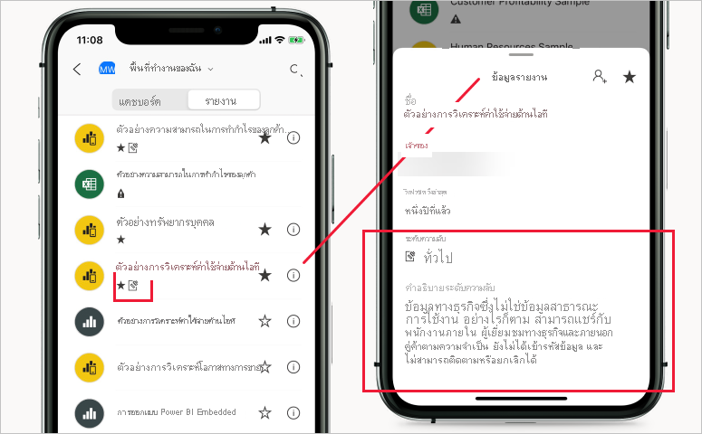

# ป้ายชื่อระดับความลับใน Power BI

บทความนี้อธิบายถึงฟังก์ชันการทำงานของ ป้ายชื่อระดับความลับ Microsoft Information Protection ใน Power BI

สำหรับข้อมูลเพิ่มเติมเกี่ยวกับการเปิดใช้งานป้ายชื่อระดับความลับในผู้เช่าของคุณ รวมถึงข้อกำหนดและข้อกำหนดเบื้องต้นในการมอบสิทธิ์ โปรดดู [การเปิดใช้งานป้ายชื่อระดับความลับของข้อมูลใน Power BI](service-security-enable-data-sensitivity-labels.md)

สำหรับข้อมูลเกี่ยวกับวิธีใช้ป้ายชื่อระดับความลับกับเนื้อหาและไฟล์ Power BI ของคุณ โปรดดูที่ [วิธีใช้ป้ายชื่อระดับความลับใน Power BI](./service-security-apply-data-sensitivity-labels.md)

>[!NOTE]
>ขณะนี้การสนับสนุนป้ายชื่อระดับความลับใน Power BI Desktop อยู่ในการแสดงตัวอย่าง

## บทนำ

ป้ายชื่อระดับความลับ Microsoft Information Protection ช่วยให้ผู้ใช้ของคุณสามารถจัดประเภทเนื้อหาที่สำคัญใน Power BI ได้โดยไม่สูญเสียผลผลิตหรือความสามารถในการทำงานร่วมกัน สามารถนำไปใช้ทั้งใน Power BI Desktop (ดูตัวอย่าง) และบริการของ Power BI ทำให้สามารถปกป้องข้อมูลที่ละเอียดอ่อนของคุณได้ตั้งแต่วินาทีแรกที่คุณเริ่มพัฒนาเนื้อหาของคุณไปจนถึงเมื่อมีการเข้าถึงจาก Excel ผ่านการเชื่อมต่อสด ป้ายชื่อระดับความลับจะยังคงอยู่เมื่อคุณย้ายเนื้อหาไปมาระหว่างเดสก์ท็อปและบริการในรูปแบบของไฟล์. pbix

ในบริการ Power BI สามารถใช้ป้ายชื่อระดับความลับกับชุดข้อมูล รายงาน แดชบอร์ดและกระแสข้อมูลได้ เมื่อข้อมูลที่ติดป้ายออกไปจาก Power BI แล้ว ไม่ว่าจะผ่านการส่งออกไปยังไฟล์ Excel, PowerPoint, PDF หรือ. pbix หรือผ่านสถานการณ์การส่งออกอื่น ๆ ที่สนับสนุน เช่น วิเคราะห์ใน Excel หรือ PivotTables การเชื่อมต่อสดใน Excel Power BI จะใช้ป้ายชื่อไฟล์ที่ส่งออกโดยอัตโนมัติ และป้องกันตามการตั้งค่าการเข้ารหัสไฟล์ของป้ายชื่อ ด้วยวิธีนี้ข้อมูลที่สำคัญของคุณจะยังคงได้รับการป้องกันแม้ว่าจะออกจาก Power BI ก็ตาม

นอกจากนี้ยังสามารถใช้ป้ายชื่อระดับความลับกับไฟล์. pbix ใน Power BI Desktop ได้เพื่อให้ข้อมูลและเนื้อหาของคุณปลอดภัยเมื่อแชร์ภายนอก Power BI (ตัวอย่างเช่น เพื่อให้เฉพาะผู้ใช้ภายในองค์กรของคุณเท่านั้นที่สามารถเปิดไฟล์. pbix ที่เป็นความลับได้ ได้รับการแชร์หรือแนบมาในอีเมล) ก่อนที่จะมีการเผยแพร่ไปยังบริการ Power BI ดู [จำกัดการเข้าถึงเนื้อหาโดยใช้ป้ายชื่อระดับความลับเพื่อใช้การเข้ารหัสลับ](/microsoft-365/compliance/encryption-sensitivity-labels) สำหรับรายละเอียดเพิ่มเติม

คุณจะสามารถมองเห็นป้ายชื่อระดับความลับที่อยู่ในรายงาน แดชบอร์ด ชุดข้อมูล และกระแสข้อมูลได้จากหลายตำแหน่งใน Power BI service คุณจะสามารถมองเห็นป้ายชื่อระดับความลับบนรายงานและแดชบอร์ดได้ในแอป Power BI iOS และ Android และในวิชวลแบบฝังตัวอีกด้วย ในเดสก์ท็อปคุณสามารถดูป้ายชื่อระดับความลับในแถบสถานะ

[รายงานเมตริกการป้องกัน](service-security-data-protection-metrics-report.md) พร้อมใช้งานในพอร์ทัลผู้ดูแลระบบ Power BI ซึ่งช่วยให้ผู้ดูแล Power BI สามารถมองเห็นข้อมูลที่มีความอ่อนไหวในผู้เช่า Power BI ได้อย่างเต็มที่ นอกจากนี้ บันทึกการตรวจสอบ Power BI ยังประกอบด้วยข้อมูลป้ายชื่อระดับความลับเกี่ยวกับกิจกรรม เช่น การนำไปใช้ การเอาออก และการเปลี่ยนป้ายชื่อ ตลอดจนเกี่ยวกับกิจกรรม เช่น การดูรายงาน แดชบอร์ด ฯลฯ ช่วยให้ Power BI และผู้ดูแลระบบความปลอดภัยสามารถมองเห็นการใช้ข้อมูลที่มีความอ่อนไหวเพื่อจุดประสงค์ในการติดตามและตรวจสอบ และแจ้งเตือนความปลอดภัย

## ข้อควรพิจารณาที่สำคัญ

ในบริการของ Power BI การติดป้ายชื่อระดับความลับ **ไม่** ส่งผลกระทบต่อการเข้าถึงเนื้อหา การเข้าถึงเนื้อหาในบริการได้รับการจัดการโดยการอนุญาตของ Power BI เท่านั้น ในขณะที่ป้ายชื่อมองเห็นได้ การตั้งค่าการเข้ารหัสลับใดก็ตามที่เกี่ยวข้อง (กำหนดค่าแล้วใน [ศูนย์ความปลอดภัยของ Microsoft 365](https://security.microsoft.com/) หรือ[ศูนย์การปฏิบัติตามกฎระเบียบของ Microsoft 365](https://compliance.microsoft.com/)) จะไม่ถูกนำไปใช้ ซึ่งจะถูกนำไปใช้กับข้อมูลที่ออกจากบริการผ่านเส้นทางการส่งออกที่สนับสนุน เช่น ส่งออกไปยัง Excel, PowerPoint หรือ PDF และดาวน์โหลดเป็น .pbix

ใน Power BI Desktop (ดูตัวอย่าง) ป้ายชื่อระดับความลับที่มีการตั้งค่าการเข้ารหัสจะ **ทำ** ส่งผลต่อการเข้าถึงเนื้อหา หากผู้ใช้มี [สิทธิ์](#power-bi-desktop-preview) ไม่เพียงพอตามการตั้งค่าการเข้ารหัสขอป้ายชื่อระดับความลับในไฟล์ .pbix ผู้ใช้จะไม่สามารถเปิดไฟล์ได้ นอกจากนี้ในเดสก์ท็อป เมื่อคุณบันทึกงานป้ายชื่อระดับความลับใด ๆ ที่คุณเพิ่มและการตั้งค่าการเข้ารหัสที่เกี่ยวข้องจะถูกนำไปใช้กับไฟล์ .pbix ที่บันทึกไว้

ป้ายระดับความลับและการเข้ารหัสไฟล์จะ **ใช้ไม่ได้** สำหรับเส้นทางการส่งออกที่ไม่ได้รับการสนับสนุน ผู้ดูแลระบบ Power BI สามารถบล็อกการส่งออกจากเส้นทางการส่งออกที่ไม่สนับสนุน

>[!NOTE]
> ผู้ใช้ที่ได้รับสิทธิการเข้าถึงรายงานจะ ได้รับอนุญาตให้เข้าถึงชุดข้อมูลเบื้องต้นทั้งหมด เว้นแต่ว่า [การรักษาความปลอดภัยระดับแถว (RLS)](./service-admin-rls.md) จำกัดการเข้าถึงของพวกเขา ผู้เขียนรายงานสามารถจัดประเภทและรายงานป้ายชื่อโดยใช้ ป้ายชื่อระดับความลับ หากป้ายชื่อระดับความลับมีการตั้งค่าการป้องกัน Power BI จะใช้การตั้งค่าการป้องกันเหล่านี้เมื่อข้อมูลรายงานออกจาก Power BI ผ่านเส้นทางการส่งออกที่สนับสนุน เช่น ส่งออกไปยัง Excel, PowerPoint หรือ PDF ดาวน์โหลดเป็น .pbix และ **บันทึก** (เดสก์ท็อป). เฉพาะผู้ใช้ที่ได้รับอนุญาตเท่านั้นที่สามารถเปิดไฟล์ที่มีการป้องกันได้

### เส้นทางการส่งออกที่ได้รับการสนับสนุน
การใช้ป้ายชื่อระดับความลับและการป้องกันที่เกี่ยวข้องกับข้อมูลที่ออกจากบริการ Power BI ได้รับการสนับสนุนสำหรับเส้นทางการส่งออกต่อไปนี้:
* ส่งออกไปยัง ไฟล์ Excel, PDF (เฉพาะบริการ) และ PowerPoint
* Analyze ใน Excel จาก Power BI service ซึ่งจะสั่งให้ทำการดาวน์โหลดไฟล์ Excel ที่มีการเชื่อมต่อแบบสดไปยังชุดข้อมูล Power BI
* PivotTable ใน Excel ที่มีการเชื่อมต่อสดไปยังชุดข้อมูล Power BI สำหรับผู้ใช้ที่มี M365 E3 และสูงกว่า
* ดาวน์โหลดไปยัง .pbix (บริการ)

>[!NOTE]
>เมื่อใช้ **ดาวน์โหลด .pbix** ในบริการ Power BI ถ้ารายงานที่ดาวน์โหลดและชุดข้อมูลมีป้ายชื่อต่างกัน ป้ายชื่อที่เข้มงวดมากขึ้นจะถูกนำไปใช้กับไฟล์ .pbix 

## ป้ายชื่อระดับความลับทำงานใน Power BI ได้อย่างไร

เมื่อคุณใช้ป้ายชื่อระดับความลับกับเนื้อหาและไฟล์ Power BI จะคล้ายกับการใช้แท็กบนทรัพยากรนั้นที่มีประโยชน์ดังต่อไปนี้:
* **แบบปรับแต่งได้** - คุณสามารถสร้างหมวดหมู่สำหรับเนื้อหาที่ละเอียดอ่อนในระดับที่แตกต่างกันในองค์กรของคุณ เช่น ส่วนบุคคล สาธารณะ ทั่วไป เป็นความลับ และเป็นความลับสูง
* **ข้อความชัดเจน** - เนื่องจากป้ายชื่อเป็นข้อความที่ชัดเจน จึงเป็นเรื่องง่ายสำหรับผู้ใช้ที่จะเข้าใจวิธีการปฏิบัติต่อเนื้อหาตามแนวทางของป้ายชื่อระดับความลับ
* **ถาวร** - หลังจากใช้ป้ายชื่อระดับความลับกับเนื้อหาแล้วจะมาพร้อมกับเนื้อหานั้นเมื่อส่งออกไปยังไฟล์ Excel, PowerPoint และ PDF ดาวน์โหลดเป็น .pbix หรือบันทึก (ในเดสก์ท็อป) และกลายเป็นพื้นฐานสำหรับ การใช้และบังคับใช้นโยบาย

นี่คือตัวอย่างแบบย่อเพื่อแสดงวิธีการทำงานของป้ายชื่อระดับความลับใน Power BI รูปภาพด้านล่างแสดงให้เห็นว่ามีการนำป้ายชื่อระดับความลับไปใช้กับรายงานในบริการ Power BI อย่างไร จากนั้นมีการส่งออกข้อมูลจากรายงานไปยังไฟล์ Excel อย่างไร และท้ายที่สุดป้ายชื่อระดับความลับและการป้องกันยังคงอยู่ในไฟล์ที่ส่งออกอย่างไร

ป้ายบอกระดับความลับที่คุณนำไปใช้กับเนื้อหาจะยังคงอยู่และจะติดตามไปกับเนื้อหาที่ใช้และแชร์กันทั่วทั้ง Power BI คุณสามารถใช้การติดป้ายเพื่อสร้างรายงานการใช้งานและดูข้อมูลกิจกรรมสำหรับเนื้อหาที่ละเอียดอ่อนของคุณ

## ป้ายชื่อระดับความลับใน Power BI Desktop (ดูตัวอย่าง)

ยังสามารถใช้ป้ายชื่อระดับความลับใน Power BI Desktop สิ่งนี้ทำให้สามารถปกป้องข้อมูลของคุณตั้งแต่วินาทีแรกที่คุณเริ่มพัฒนาเนื้อหาของคุณ เมื่อคุณบันทึกงานของคุณในเดสก์ท็อปป้ายชื่อระดับความลับที่คุณใช้พร้อมกับการตั้งค่าการเข้ารหัสลับที่เกี่ยวข้องจะถูกนำไปใช้กับไฟล์ .pbix ที่เป็นผลลัพธ์ หากป้ายกำกับมีการตั้งค่าการเข้ารหัสลับ ไฟล์จะได้รับการป้องกันไม่ว่าจะไปที่ใดและไม่ว่าจะถูกส่งไปอย่างไร เฉพาะผู้ที่มี [สิทธิ์ RMS ที่จำเป็น](#power-bi-desktop-preview) เท่านั้นที่จะเปิดได้

>[!NOTE]
>* ในรุ่นตัวอย่างนี้อาจมีข้อจำกัดบางประการ ดู [ข้อจำกัด](#limitations)
>* เพื่อให้สามารถใช้ป้ายชื่อระดับความลับใน Power BI Desktop ได้ ก่อนอื่นคุณต้องเปิดใช้งาน[คุณลักษณะการแสดงตัวอย่างการป้องกันข้อมูล](service-security-apply-data-sensitivity-labels.md#apply-sensitivity-labels-in-power-bi-desktop-preview) จากนั้นจึงรีสตาร์ทโปรแกรม หากโปรแกรมขัดข้องหลังจากรีสตาร์ท อาจเป็นเพราะเครื่องของคุณไม่มีเวอร์ชันไลบรารีรันไทม์ Visual C ++ แบบแจกจ่ายต่อได้ที่จำเป็น หากคุณพบการขัดข้องดังกล่าว ให้ไปที่ [หน้าดาวน์โหลด Microsoft Visual C ++ 2015 Redistributable Update 3](https://www.microsoft.com/download/details.aspx?id=53587) เพื่อดูคำแนะนำเกี่ยวกับวิธีดาวน์โหลดและติดตั้งอัปเดต หลังจากติดตั้งอัปเดตแล้ว ให้ลองเปิดใช้งานเดสก์ท็อปอีกครั้ง

หากคุณใช้ป้ายชื่อระดับความลับในเดสก์ท็อป เมื่อคุณเผยแพร่งานของคุณไปยังบริการหรือเมื่อคุณอัปโหลดไฟล์ .pbix ของงานนั้นไปยังบริการ ป้ายกำกับจะเดินทางพร้อมข้อมูลไปยังบริการ ในบริการ ป้ายกำกับจะถูกนำไปใช้กับทั้งชุดข้อมูลและรายงานที่คุณได้รับกับไฟล์ หากชุดข้อมูลและรายงานมีป้ายชื่อระดับความลับอยู่แล้ว ป้ายกำกับเหล่านั้นจะถูกเขียนทับโดยป้ายกำกับที่มาจากเดสก์ท็อป
 
หากคุณอัปโหลดไฟล์ .pbix ที่ไม่เคยเผยแพร่ไปยังบริการมาก่อน และมีชื่อเดียวกันกับรายงานหรือชุดข้อมูลที่มีอยู่แล้วในบริการ การอัปโหลดจะสำเร็จก็ต่อเมื่อผู้อัปโหลดมีสิทธิ์ RMS ที่จำเป็นในการเปลี่ยนแปลงป้ายกำกับ

เช่นเดียวกันในทางตรงกันข้าม - เมื่อคุณดาวน์โหลดเป็น .pbix ในบริการแล้วโหลด .pbix ลงในเดสก์ท็อป ป้ายกำกับที่อยู่ในบริการจะถูกนำไปใช้กับไฟล์ .pbix ที่ดาวน์โหลดมาและจากนั้นจะโหลดลงในเดสก์ท็อป หากรายงานและชุดข้อมูลในบริการมีป้ายกำกับต่างกัน ยิ่งมีข้อจำกัดมากขึ้นสำหรับไฟล์ .pbix ที่ดาวน์โหลดมา

เมื่อคุณใช้ป้ายกำกับในเดสก์ท็อปป้ายนั้นจะปรากฏในแถบสถานะ

[เรียนรู้วิธีใช้ป้ายชื่อระดับความลับกับเนื้อหาและไฟล์ของ Power BI](./service-security-apply-data-sensitivity-labels.md)

## การสืบทอดป้ายชื่อระดับความลับเมื่อสร้างเนื้อหาใหม่

เมื่อมีการสร้างรายงานและแดชบอร์ดใหม่ในบริการ Power BI พวกเขาจะสืบทอดป้ายชื่อระดับความลับที่เคยใช้กับชุดข้อมูลหรือรายงานหลักโดยอัตโนมัติ ตัวอย่างเช่น รายงานใหม่ที่สร้างขึ้นจากด้านบนของชุดข้อมูลที่มีป้ายชื่อระดับความลับ "ความลับสูงสุด" จะได้รับป้ายชื่อ "ความลับสูงสุด" โดยอัตโนมัติเช่นกัน

รูปต่อไปนี้แสดงให้เห็นว่าป้ายชื่อระดับความลับของชุดข้อมูลจะถูกนำไปใช้โดยอัตโนมัติในรายงานใหม่ที่สร้างขึ้นด้านบนของชุดข้อมูล

>[!NOTE]
>หากไม่สามารถใช้ป้ายชื่อระดับความลับกับรายงานหรือแดชบอร์ดใหม่ได้ไม่ว่าจะด้วยเหตุผลใดก็ตาม Power BI **จะไม่** บล็อกการสร้างรายการใหม่

## ป้ายชื่อระดับความลับและการป้องกันบนข้อมูลที่ส่งออก

เมื่อข้อมูลถูกส่งออกจาก Power BI ไปยัง Excel ไฟล์ PDF (เฉพาะบริการ) หรือไฟล์ PowerPoint Power BI จะใช้ป้ายชื่อระดับความลับบนไฟล์ที่ส่งออกโดยอัตโนมัติและปกป้องข้อมูลตามการตั้งค่าการเข้ารหัสลับของไฟล์ของป้ายกำกับ ด้วยวิธีนี้ ข้อมูลที่มีความอ่อนไหวของคุณจะยังคงได้รับการปกป้อง ไม่ว่าจะอยู่ที่ไหนก็ตาม

ผู้ใช้ที่ส่งออกไฟล์จาก Power BI มีสิทธิ์ในการเข้าถึงและการแก้ไขไฟล์นั้นตามการตั้งค่าป้ายชื่อระดับความลับ พวกเขาไม่ได้รับสิทธิ์ความเป็นเจ้าของไปยังไฟล์

>[!NOTE]
>เมื่อใช้ **ดาวน์โหลด .pbix** ในบริการ Power BI ถ้ารายงานที่ดาวน์โหลดและชุดข้อมูลมีป้ายชื่อต่างกัน ป้ายชื่อที่เข้มงวดมากขึ้นจะถูกนำไปใช้กับไฟล์ .pbix 

จะไม่มีการใช้ป้ายชื่อระดับความลับและการป้องกันเมื่อข้อมูลถูกส่งออกไปยัง .csv ไฟล์หรือเส้นทางการส่งออกอื่น ๆ ที่ไม่รองรับ

การใช้ป้ายชื่อระดับความลับและการป้องกันกับไฟล์ที่ส่งออกจะไม่เพิ่มเครื่องหมายเนื้อหาไปยังไฟล์ อย่างไรก็ตาม ถ้ามีการกำหนดค่าป้ายชื่อเพื่อใช้เครื่องหมายเนื้อหา ดังนั้นเครื่องหมายเนื้อหาดังกล่าวจะถูกนำไปใช้โดยอัตโนมัติโดยไคลเอ็นต์การติดป้ายแบบรวมของ Azure Information Protection เมื่อเปิดไฟล์ในแอป Office desktop การทำเครื่องหมายเนื้อหาจะไม่ถูกนำไปใช้โดยอัตโนมัติเมื่อคุณใช้การติดป้ายชื่อที่มีอยู่ภายในสำหรับเดสก์ท็อป อุปกรณ์เคลื่อนที่ หรือเว็บแอป โปรดดู [เมื่อแอป Office ใช้การทำเครื่องหมายเนื้อหาและการเข้ารหัสลับ](/microsoft-365/compliance/sensitivity-labels-office-apps#when-office-apps-apply-content-marking-and-encryption) สำหรับรายละเอียดเพิ่มเติม

การส่งออกล้มเหลวถ้าไม่สามารถนำป้ายชื่อไปใช้ได้เมื่อมีการส่งออกข้อมูลไปยังไฟล์ หากต้องการตรวจสอบว่าการส่งออกล้มเหลวเนื่องจากไม่สามารถใช้ป้ายชื่อได้ ให้คลิกที่ชื่อรายงานหรือแดชบอร์ดที่กึ่งกลางของแถบชื่อเรื่องและดูว่า "ไม่สามารถโหลดป้ายชื่อระดับความลับได้" ในดร็อปดาวน์ข้อมูลที่เปิดขึ้น ซึ่งอาจเกิดขึ้นได้เนื่องมาจากปัญหาระบบชั่วคราว หรือถ้าป้ายชื่อที่ใช้ได้รับการยกเลิกการเผยแพร่หรือถูกลบโดยผู้ดูแลระบบความปลอดภัย

## การรับทอดป้ายชื่อระดับความลับในการวิเคราะห์ใน Excel

เมื่อคุณสร้าง PivotTable ใน Excel ด้วยการเชื่อมต่อแบบสดไปยังชุดข้อมูล Power BI (คุณสามารถทำสิ่งนี้ได้จาก Power BI ผ่าน [การวิเคราะห์ใน Excel](../collaborate-share/service-analyze-in-excel.md) หรือจาก [Excel](https://support.microsoft.com/office/create-a-pivottable-from-power-bi-datasets-31444a04-9c38-4dd7-9a45-22848c666884?ui=en-US&rs=en-US&ad=US)) ป้ายชื่อระดับความลับของชุดข้อมูลจะได้ถูกรับทอดและนำไปใช้กับไฟล์ Excel ของคุณพร้อมกับการป้องกันต่าง ๆ ที่เกี่ยวข้อง ถ้าป้ายชื่อบนชุดข้อมูลมีการเปลี่ยนแปลงในภายหลังในการจำกัดที่มากขึ้น ป้ายชื่อที่ใช้ในไฟล์ Excel ที่เชื่อมโยงจะอัปเดตโดยอัตโนมัติเมื่อรีเฟรชข้อมูล

 
ป้ายชื่อระดับความลับใน Excel ที่ตั้งค่าด้วยตนเองจะไม่ถูกเขียนทับอัตโนมัติโดยป้ายชื่อระดับความลับของชุดข้อมูล แต่แบนเนอร์จะแจ้งให้คุณทราบว่าชุดข้อมูลที่มีป้ายชื่อระดับความลับและแนะนำให้คุณใช้งาน

>[!NOTE]
>ถ้าหากป้ายชื่อระดับความลับของชุดข้อมูลถูกจำกัดน้อยกว่าป้ายชื่อระดับความลับของไฟล์ Excel ซึ่งไม่มีการรับทอดป้ายชื่อหรือการอัปเดตที่เกิดขึ้นแต่อย่างใด ไฟล์ Excel ไม่เคยรับทอดป้ายชื่อระดับความลับที่ถูกจำกัดน้อยลง

## การคงอยู่ของป้ายชื่อระดับความลับในรายงานและแดชบอร์ดแบบฝังตัว

คุณสามารถฝังรายงาน Power BI แดชบอร์ด และวิชวลในแอปพลิเคชันทางธุรกิจ เช่น Microsoft Teams และ SharePoint หรือในเว็บไซต์ขององค์กรได้ เมื่อคุณฝังวิชวล รายงาน หรือแดชบอร์ดที่มีการใช้ป้ายชื่อระดับความลับอยู่ ป้ายชื่อระดับความลับจะปรากฏในมุมมองแบบฝังตัว และป้ายชื่อและการป้องกันจะยังคงอยู่เมื่อมีการส่งออกข้อมูลไปยัง Excel

สนับสนุนสถานการณ์การฝังต่อไปนี้:
* [ฝังตัวสำหรับองค์กรของคุณ](../developer/embedded/embed-sample-for-your-organization.md)
* แอป Microsoft 365 (เช่น [Teams](../collaborate-share/service-embed-report-microsoft-teams.md) และ [SharePoint](../collaborate-share/service-embed-report-spo.md))
* [การฝัง URL ที่ปลอดภัย](../collaborate-share/service-embed-secure.md) (การฝังจากบริการ Power BI) 

## ป้ายชื่อระดับความลับในแอป Power BI สำหรับอุปกรณ์เคลื่อนที่

คุณสามารถดูป้ายชื่อระดับความลับได้บนรายงานและแดชบอร์ดในแอป Power BI สำหรับอุปกรณ์เคลื่อนที่ ไอคอนใกล้กับชื่อรายงานหรือแดชบอร์ดบ่งบอกว่ามีป้ายชื่อระดับความลับและประเภทของป้ายชื่อ และคำอธิบายสามารถพบได้ในกล่องรายงานหรือกล่องข้อมูลของแดชบอร์ด

## รองรับระบบคลาวด์
ป้ายชื่อระดับความลับยังรองรับเฉพาะผู้เช่าในระบบคลาวด์ส่วนกลาง (สาธารณะ) เท่านั้น และไม่รองรับสำหรับผู้เช่าในระบบคลาวด์ เช่น ระบบคลาวด์ของชาติ

## การอนุญาตใช้งานและสิ่งที่ต้องการ

ดู [ การอนุญาตใช้งานและสิ่งที่ต้องการ](service-security-enable-data-sensitivity-labels.md#licensing-and-requirements)

## การสร้างและการจัดการป้ายชื่อระดับความลับ

ป้ายชื่อระดับความลับจะถูกสร้างขึ้นและจัดการใน [ศูนย์ความปลอดภัยของ Microsoft 365](https://security.microsoft.com/) หรือ [ศูนย์การปฏิบัติตามข้อบังคับ Microsoft 365](https://compliance.microsoft.com/)

เมื่อต้องการเข้าถึงป้ายชื่อระดับความลับในศูนย์ใดศูนย์หนึ่งเหล่านี้ให้ไปที่ **การจัดประเภท > ป้ายชื่อระดับความลับ** ป้ายชื่อระดับความลับเหล่านี้สามารถใช้ได้กับบริการหลายอย่างของ Microsoft เช่น Azure Information Protection, แอป Office และบริการ Office 365

>[!Important]
> หากองค์กรของคุณใช้ป้ายชื่อระดับความลับของ Azure Information Protection คุณจะต้อง[ย้าย](/azure/information-protection/configure-policy-migrate-labels)ป้ายชื่อไปยังหนึ่งในบริการที่ระบุไว้ก่อนหน้านี้เพื่อให้สามารถใช้ป้ายชื่อใน Power BI ได้

## ข้อจำกัด

### ทั่วไป

* ไม่แนะนำให้อนุญาตให้ผู้ใช้สามารถใช้ป้ายชื่อเรื่องหลักใน Power BI (ป้ายหนึ่งจะถือว่าเป็นป้ายชื่อเรื่องหลักได้ก็ต่อเมื่อมีป้ายชื่อเรื่องรอง) หากมีการใช้ป้ายชื่อหลักกับเนื้อหา การส่งออกข้อมูลจากเนื้อหานั้นไปยังไฟล์ (Excel, PowerPoint และ PDF) จะล้มเหลว ดู [ป้ายชื่อย่อย (การจัดกลุ่มป้ายชื่อ)](/microsoft-365/compliance/sensitivity-labels#sublabels-grouping-labels)

* ไม่รองรับป้ายชื่อระดับความลับของข้อมูลสำหรับแอปเทมเพลต ป้ายชื่อระดับความลับที่ตั้งค่าโดยผู้สร้างแอปเทมเพลตจะถูกลบออกเเมื่อมีการแยกและติดตั้งแอป และป้ายชื่อระดับความลับที่เพิ่มไปยังอาร์ทิแฟกต์ในแอปเทมเพลตที่ติดตั้งโดยผู้บริโภคแอปสูญหายไป (ตั้งค่าใหม่เป็นไม่มีอะไร) เมื่อมีการอัปเดตแอป

* ในบริการ Power BI หากชุดข้อมูลมีป้ายกำกับที่ถูกลบออกจากศูนย์การจัดการป้ายกำกับ คุณจะไม่สามารถส่งออกหรือดาวน์โหลดข้อมูลได้ ในการวิเคราะห์ใน Excel จะมีการแจ้งเตือนและข้อมูลจะถูกส่งออกไปยังไฟล์ .odc โดยไม่มีป้ายชื่อระดับความลับ ในเดสก์ท็อป ถ้าไฟล์ .pbix มีป้ายชื่อที่ไม่ถูกต้องคุณจะไม่สามารถบันทึกไฟล์ได้

* Power BI ไม่รองรับป้ายชื่อระดับความลับของประเภทการป้องกัน [Do Not Forward](/microsoft-365/compliance/encryption-sensitivity-labels#let-users-assign-permissions), [ผู้ใช้กำหนดเอง](/microsoft-365/compliance/encryption-sensitivity-labels#let-users-assign-permissions) และ [HYOK](/azure/information-protection/configure-adrms-restrictions) ประเภทการป้องกันแบบ Do Not Forward และผู้ใช้กำหนดเองหมายถึงป้ายชื่อที่กำหนดใน[ศูนย์ความปลอดภัยของ Microsoft 365](https://security.microsoft.com/) หรือ[ศูนย์ควบคุมการปฏิบัติตามข้อบังคับของ Microsoft 365](https://compliance.microsoft.com/)

### บริการ power BI

* ป้ายชื่อระดับความลับสามารถใช้ได้เฉพาะบนแดชบอร์ด รายงาน ชุดข้อมูล และกระแสข้อมูลเท่านั้น ในปัจจุบัน ป้ายชื่อระดับความลับยังไม่สามารถใช้ได้สำหรับ [รายงานที่มีการแบ่งหน้า](../paginated-reports/report-builder-power-bi.md) และสมุดงาน

* ป้ายชื่อระดับความลับบนแอสเซท Power BI สามารถมองเห็นได้ในรายการพื้นที่ทำงาน สายข้อมูล รายการโปรด ล่าสุด และมุมมองแอป ในขณะนี้ป้ายชื่อจะไม่สามารถมองเห็นได้ในมุมมอง "แบ่งปันแล้วกับฉัน" อย่างไรก็ตาม โปรดทราบว่าป้ายชื่อที่ใช้กับแอสเซท Power BI แม้ว่าจะไม่สามารถมองเห็นได้ จะยังคงอยู่ในข้อมูลที่ส่งออกไปเป็นไฟล์ Excel, PowerPoint และ PDF เสมอ

### Power BI Desktop (ตัวอย่าง)

* ไฟล์ .pbix ที่ได้รับการปกป้องจะสามารถเปิด และ/หรือ เผยแพร่โดยผู้ใช้ที่เป็นเจ้าของ RMS ของไฟล์เท่านั้น (ผู้ใช้ที่ใช้ป้ายกำกับกับไฟล์เดิม) หรือผู้ที่มี [**การควบคุมทั้งหมด** และ/หรือ **ส่งออก** สิทธิ์การใช้งาน](/microsoft-365/compliance/encryption-sensitivity-labels) สิทธิ์การใช้งานสำหรับป้ายกำกับที่เกี่ยวข้อง เจ้าของ RMS มีการควบคุมทั้งหมดและไม่สามารถล็อกได้ [ดูรายละเอียดเพิ่มเติม](/azure/information-protection/configure-usage-rights#rights-management-issuer-and-rights-management-owner)

* หากป้ายกำกับที่ใช้กับไฟล์ .pbix ไม่ได้รับการเผยแพร่ให้กับผู้ใช้ในศูนย์ความปลอดภัยของ Microsoft 365 หรือศูนย์ปฏิบัติตามข้อกำหนดของ Microsoft 365 ผู้ใช้จะไม่สามารถบันทึกไฟล์ในเดสก์ท็อปได้

* ผู้ใช้ Power BI Desktop อาจประสบปัญหาในการบันทึกงานเมื่อขาดการเชื่อมต่ออินเทอร์เน็ต เช่น หลังจากการออฟไลน์ หากไม่มีการเชื่อมต่ออินเทอร์เน็ต การดำเนินการบางอย่างที่เกี่ยวข้องกับป้ายชื่อระดับความลับและการจัดการสิทธิ์อาจไม่สมบูรณ์อย่างถูกต้อง ในกรณีดังกล่าวขอแนะนำให้กลับไปออนไลน์และลองบันทึกอีกครั้ง

* หากคุณสร้างโมเดลขนาดใหญ่และไฟล์ .pbix ที่ได้รับการป้องกันมีขนาดใหญ่มาก (มากกว่า 2GB) อาจเกิดปัญหาเมื่อคุณพยายามบันทึกหรือเปิด ในการหลีกเลี่ยงปัญหานี้ ให้พิจารณาลบการป้องกันออกจากไฟล์ .pbix และนำไปใช้ใหม่หลังจากที่ไฟล์ได้รับการเผยแพร่ไปยังบริการ Power BI

    โดยทั่วไปเมื่อคุณป้องกันไฟล์ที่มีป้ายชื่อระดับความลับที่ใช้การเข้ารหัสลับ ควรใช้วิธีการเข้ารหัสลับแบบอื่นเช่นกัน เช่น การเข้ารหัสไฟล์เพจ การเข้ารหัส NTFS บิตล็อกเกอร์ แอนติมัลแวร์ เป็นต้น

* ไฟล์ชั่วคราวไม่ได้รับการเข้ารหัส

* **รับข้อมูล** สามารถอัปโหลดไฟล์ที่มีการป้องกันได้เฉพาะในกรณีที่อยู่ภายในเครื่องเท่านั้น ไม่สามารถอัปโหลดไฟล์ที่ได้รับการป้องกันจากบริการออนไลน์ เช่น SharePoint Online หรือ OneDrive for Business สำหรับไฟล์ที่ได้รับการป้องกัน คุณสามารถอัปโหลดจากอุปกรณ์ภายในเครื่องของคุณ หรือนำป้ายกำกับของไฟล์ออกก่อนใน Power BI Desktop แล้วอัปโหลดผ่านบริการออนไลน์อย่างใดอย่างหนึ่ง

* **ส่งออกเป็น PDF** ไม่สนับสนุนป้ายชื่อระดับความลับ หากคุณส่งออกไฟล์ที่มีป้ายชื่อระดับความลับเป็น PDF แล้ว PDF จะไม่ได้รับป้ายกำกับและจะไม่มีการป้องกันใด ๆ

* การป้องกันข้อมูลใน Power BI Desktop ไม่สนับสนุน **B2B** และ **สถานการณ์แบบหลายผู้เช่า**

* ถ้าคุณเขียนทับชุดข้อมูลที่มีป้ายชื่อหรือรายงานในบริการด้วยไฟล์ .pbix ป้ายชื่อในบริการจะถูกเก็บไว้

## ขั้นตอนถัดไป

บทความนี้แสดงภาพรวมของการป้องกันข้อมูลใน Power BI บทความต่อไปนี้แสดงรายละเอียดเพิ่มเติมเกี่ยวกับการป้องกันข้อมูลใน Power BI 

* [เปิดใช้งานป้ายชื่อระดับความลับใน Power BI](service-security-enable-data-sensitivity-labels.md)
* [วิธีการใช้ป้ายชื่อระดับความลับใน Power BI](service-security-apply-data-sensitivity-labels.md)
* [ใช้ตัวควบคุม Microsoft Cloud App Security ใน Power BI](service-security-using-microsoft-cloud-app-security-controls.md)
* [รายงานเมตริกการป้องกัน](service-security-data-protection-metrics-report.md)