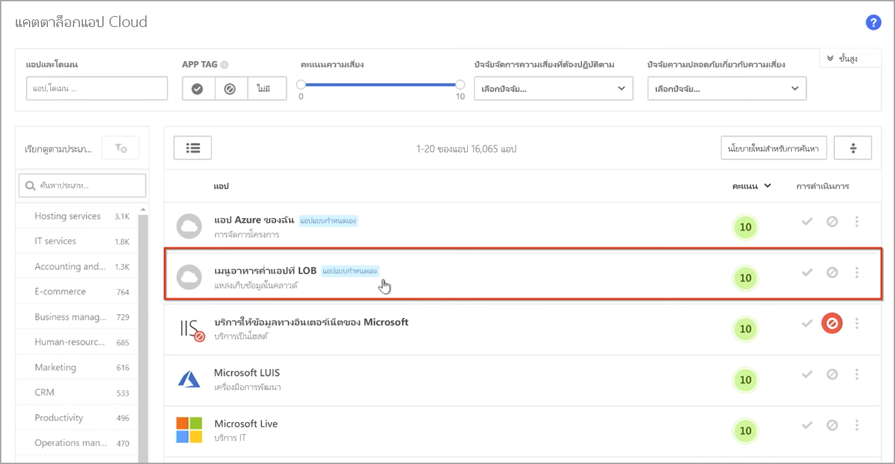
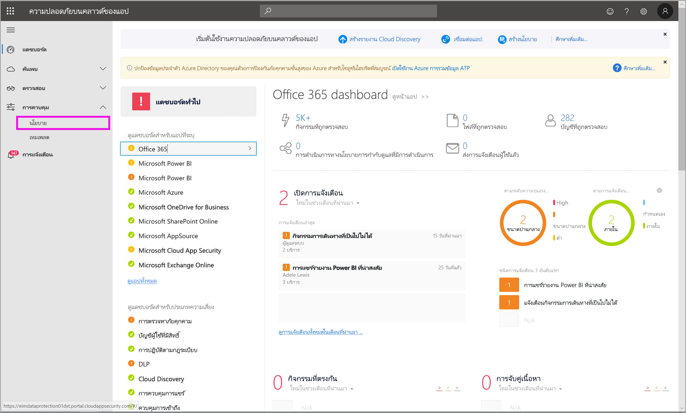
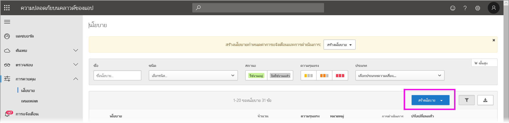
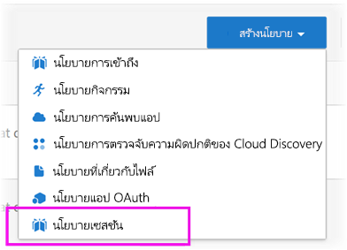
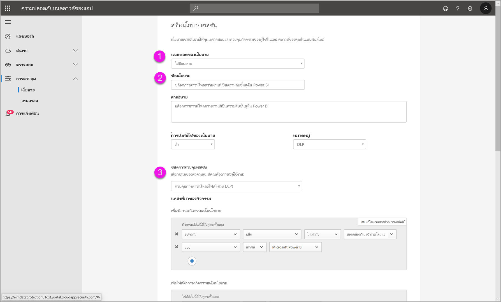
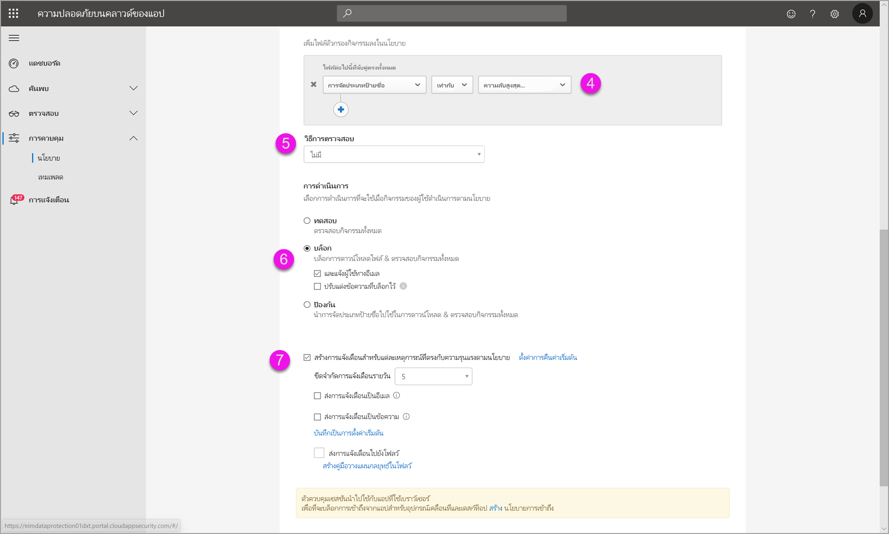
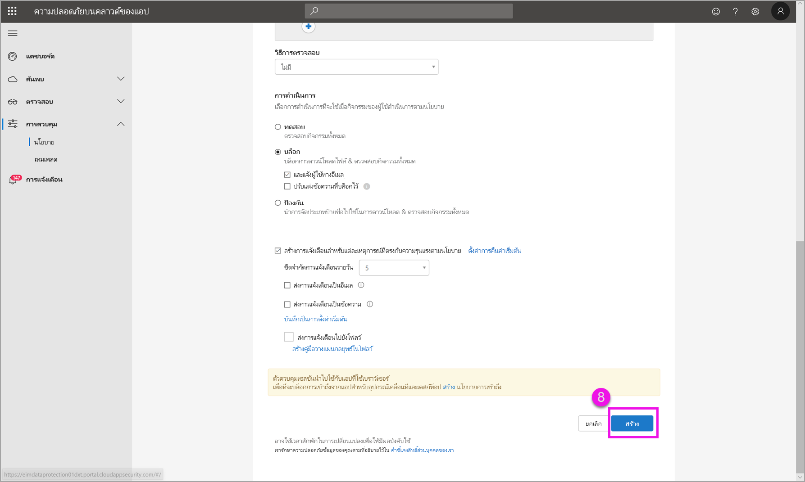

# ใช้ตัวควบคุม Microsoft Cloud App Security ใน Power BIUsing Microsoft Cloud App Security controls in Power BI

ด้วยการใช้ Cloud App Security กับ Power BI คุณสามารถช่วยปกป้องรายงาน ข้อมูล และบริการของ Power BI มิให้รั่วไหลโดยไม่ได้ตั้งใจหรือมิให้ถูกละเมิดUsing Cloud App Security with Power BI, you can help protect your Power BI reports, data, and services from unintended leaks or breaches. ด้วย Cloud App Security คุณสามารถสร้างนโยบายการเข้าถึงตามเงื่อนไขสำหรับข้อมูลขององค์กรโดยใช้ตัวควบคุมเซสชันแบบเรียลไทม์ใน Azure Active Directory (Azure AD) ซึ่งช่วยให้มั่นใจได้ว่าการวิเคราะห์ Power BI ของคุณมีความปลอดภัยWith Cloud App Security, you create conditional access policies for your organization’s data, using real-time session controls in Azure Active Directory (Azure AD), that help to ensure your Power BI analytics are secure. หลังจากที่มีการกำหนดนโยบายเหล่านี้ ผู้ดูแลระบบสามารถตรวจสอบการเข้าถึงและกิจกรรมของผู้ใช้ ทำการวิเคราะห์ความเสี่ยงแบบเรียลไทม์ และตั้งค่าตัวควบคุมเฉพาะป้ายชื่อได้Once these policies have been set, administrators can monitor user access and activity, perform real-time risk analysis, and set label-specific controls. 

คุณสามารถกำหนดค่า Cloud App Security สำหรับแอปและบริการทุกประเภท ไม่ใช่เพียงแค่ Power BI เท่านั้นYou can configure Cloud App Security for all sorts of apps and services, not only Power BI. คุณจะต้องกำหนดค่า Cloud App Security ในการทำงานกับ Power BI เพื่อใช้ประโยชน์จากการคุ้มครอง Cloud App Security สำหรับข้อมูล Power BI และการวิเคราะห์ของคุณYou’ll need to configure Cloud App Security to work with Power BI to benefit from Cloud App Security protections for your Power BI data and analytics. สำหรับข้อมูลเพิ่มเติมเกี่ยวกับ Cloud App Security รวมถึงภาพรวมของวิธีการทำงาน แดชบอร์ด และคะแนนความเสี่ยงของแอป ให้ดูเอกสารประกอบ [Cloud App Security](/cloud-app-security/)For more information about Cloud App Security, including an overview of how it works, the dashboard, and app risk scores, see the [Cloud App Security](/cloud-app-security/) documentation.

## ใช้ Cloud App Security กับ Power BIUsing Cloud App Security with Power BI

ในการใช้ Cloud App Security กับ Power BI คุณต้องใช้และกำหนดค่าบริการการรักษาความปลอดภัยของ Microsoft ที่เกี่ยวข้อง ซึ่งบางรายการถูกตั้งค่าไว้นอก Power BITo use Cloud App Security with Power BI, you must use and configure relevant Microsoft security services, some of which are set outside Power BI.

### การให้สิทธิการใช้งาน Cloud App SecurityCloud App Security licensing

เพื่อให้มี Cloud App Security ในผู้เช่าของคุณ คุณต้องมี[สิทธิการใช้งาน](https://query.prod.cms.rt.microsoft.com/cms/api/am/binary/RE2NXYO)ต่อไปนี้:In order to have Cloud App Security in your tenant, you must have one of the following [licenses](https://query.prod.cms.rt.microsoft.com/cms/api/am/binary/RE2NXYO):
* Microsoft Cloud App Security: ให้ความจุ Cloud App Security สำหรับแอปที่สนับสนุนทั้งหมด ส่วนหนึ่งของ EMS E5 และ Microsoft 365 E5 suitesMicrosoft Cloud App Security: Provides Cloud App Security capabilities for all supported apps, part of the EMS E5 and Microsoft 365 E5 suites.
* Office 365 Cloud App Security: มีความสามารถของ Cloud App Security สำหรับ Office 365 เท่านั้น ส่วนหนึ่งของชุดโปรแกรม Office 365 E5Office 365 Cloud App Security: Provides Cloud App Security capabilities only for Office 365, part of the Office 365 E5 suite.
* Azure Active Directory Premium P1 เพื่อใช้ประโยชน์จากความสามารถของ Cloud App Security หลักAzure Active Directory Premium P1, in order to benefit from the major Cloud App Security capabilities.

หัวข้อต่อไปนี้อธิบายขั้นตอนสำหรับการใช้ Cloud App Security ใน Power BIThe sections below describe the steps for using Cloud App Security in Power BI.

### กำหนดนโยบายสำหรับเซสชันใน Azure AD (จำเป็น)Set session policies in Azure AD (required)
ขั้นตอนที่จำเป็นในการตั้งค่าตัวควบคุมเซสชันจะเสร็จสมบูรณ์ในพอร์ทัล Azure AD และ Cloud App SecurityThe steps necessary to set session controls are completed in the Azure AD and Cloud App Security portals. ในพอร์ทัล Azure AD คุณสามารถสร้างนโยบายการเข้าถึงแบบมีเงื่อนไขสำหรับ Power BI และเซสชันเส้นทางที่ใช้ใน Power BI ผ่านทางบริการของ Cloud App SecurityIn the Azure AD portal, you create a conditional access policy for Power BI, and route sessions used in Power BI through the Cloud App Security service. 

Cloud App Security ทำงานโดยใช้สถาปัตยกรรมพร็อกซีแบบย้อนกลับ และรวมเข้ากับการเข้าถึงแบบมีเงื่อนไขของ Azure AD เพื่อตรวจสอบกิจกรรมผู้ใช้ Power BI แบบเรียลไทม์Cloud App Security operates using a reverse-proxy architecture, and is integrated with Azure AD conditional access to monitor Power BI user activity in real-time. ขั้นตอนต่อไปนี้มีไว้เพื่อช่วยให้คุณเข้าใจกระบวนการ และมีคำแนะนำโดยละเอียดทีละขั้นตอนในเนื้อหาที่เชื่อมโยงในแต่ละขั้นตอนต่อไปนี้The following steps are provided here to help you understand the process, and detailed step-by-step instructions are provided in the linked content in each of the following steps. นอกจากนี้ คุณยังสามารถอ่านบทความ [Cloud App Security](/cloud-app-security/proxy-deployment-aad) ที่อธิบายถึงกระบวนการทั้งหมดได้You can also read this [Cloud App Security article](/cloud-app-security/proxy-deployment-aad) that describes the process in whole.

1.  [สร้างนโยบายการทดสอบการเข้าถึงแบบมีเงื่อนไขของ Azure ADCreate an Azure AD conditional access test policy](/cloud-app-security/proxy-deployment-aad#add-azure-ad)
2.  [ลงชื่อเข้าใช้แต่ละแอปโดยผู้ใช้ที่ระบุไว้ในนโยบายSign into each app using a user scoped to the policy](/cloud-app-security/proxy-deployment-aad#sign-in-scoped)
3.  [ตรวจสอบว่าแอปจะได้รับการกำหนดค่าให้ใช้ตัวควบคุมการเข้าถึงและเซสชันหรือไม่Verify the apps are configured to use access and session controls](/cloud-app-security/proxy-deployment-aad#portal)
4.  [ทดสอบการใช้งานTest the deployment](/cloud-app-security/proxy-deployment-aad#step-4-test-the-deployment)

กระบวนการสำหรับการตั้งค่านโยบายเซสชันมีการอธิบายรายละเอียดไว้ในบทความ[นโยบายเซสชัน](/cloud-app-security/session-policy-aad)The process for setting session policies is described in detail in the [Session policies](/cloud-app-security/session-policy-aad) article. 

### ตั้งค่านโยบายการตรวจจับความผิดปกติเพื่อตรวจสอบกิจกรรม Power BI (แนะนำ)Set anomaly detection policies to monitor Power BI activities (recommended)
คุณสามารถกำหนดนโยบายการตรวจจับความผิดปกติของ Power BI ที่สามารถกำหนดขอบเขตได้อย่างอิสระ เพื่อที่จะปรับใช้เฉพาะกับผู้ใช้และกลุ่มที่คุณต้องการรวมและไม่รวมในนโยบายเท่านั้นYou can define anomaly Power BI detection policies that can be independently scoped, so that they apply to only the users and groups you want to include and exclude in the policy. [เรียนรู้เพิ่มเติม](/cloud-app-security/anomaly-detection-policy#scope-anomaly-detection-policies)[Learn more](/cloud-app-security/anomaly-detection-policy#scope-anomaly-detection-policies).

Cloud App Security ยังมีฟังก์ชันการตรวจจับภายในแบบเฉพาะสองแบบสำหรับ Power BICloud App Security also has two dedicated, built-in detections for Power BI. [ดูส่วนในภายหลังในเอกสารนี้สำหรับรายละเอียด](#built-in-cloud-app-security-detections-for-power-bi).[See the section later on in this document for detail](#built-in-cloud-app-security-detections-for-power-bi).

### ใช้ป้ายชื่อระดับความลับ Microsoft Information Protection (แนะนำ)Use Microsoft Information Protection sensitivity labels (recommended)

ป้ายชื่อระดับความลับช่วยให้คุณสามารถจัดประเภทและช่วยปกป้องเนื้อหาที่สำคัญได้ เพื่อให้บุคลากรในองค์กรของคุณสามารถทำงานร่วมกับคู่ค้าภายนอกองค์กรของคุณได้ แต่ยังคงระมัดระวังและตระหนักถึงเนื้อหาและข้อมูลที่เป็นความลับSensitivity labels enable you to classify and help protect sensitive content, so that people in your organization can collaborate with partners outside your organization, yet still be careful and aware of sensitive content and data. 

คุณสามารถอ่านบทความเกี่ยวกับ[ป้ายชื่อระดับความลับใน Power BI](service-security-sensitivity-label-overview.md) ซึ่งจะมีรายละเอียดเกี่ยวกับกระบวนการของการใช้ป้ายชื่อระดับความลับสำหรับ Power BI.You can read the article on [sensitivity labels in Power BI](service-security-sensitivity-label-overview.md), which goes into detail about the process of using sensitivity labels for Power BI. ดูด้านล่างสำหรับ[ตัวอย่างของนโยบาย Power BI ตามป้ายชื่อระดับความลับ](#example).See below for an [example of a Power BI policy based on sensitivity labels](#example).

## ฟังก์ชันการตรวจจับที่มีอยู่ภายใน Cloud App Security สำหรับ Power BIBuilt-in Cloud App Security detections for Power BI

ฟังก์ชันการตรวจจับของ Cloud App Security ช่วยให้ผู้ดูแลระบบสามารถตรวจสอบกิจกรรมที่เฉพาะเจาะจงของแอปที่ตรวจสอบได้Cloud App Security detections enable administrators to monitor specific activities of a monitored app. สำหรับ Power BI ขณะนี้มีฟังก์ชันการตรวจจับภายในแบบเฉพาะของ Cloud App Security อยู่สองแบบ:For Power BI, there are currently two dedicated, built-in Cloud App Security detections: 

* **การแชร์ที่น่าสงสัย** – ตรวจจับเมื่อผู้ใช้แชร์รายงานที่มีความสำคัญกับอีเมลที่ไม่คุ้นเคย (ภายนอกไปยังองค์กร)**Suspicious share** – detects when a user shares a sensitive report with an unfamiliar (external to the organization) email. รายงานที่สำคัญคือรายงานที่มีป้ายชื่อระดับความลับ ซึ่งตั้งค่าเป็น **สำหรับใช้ภายในเท่านั้น** หรือสูงกว่าA sensitive report is a report whose sensitivity label is set to **INTERNAL-ONLY** or higher. 

* **การแชร์รายงานจำนวนมาก** – ตรวจพบเมื่อผู้ใช้แชร์รายงานจำนวนมากในเซสชันเดียว**Mass share of reports** – detects when a user shares a massive number of reports in a single session.

การตั้งค่าสำหรับการตรวจจับเหล่านี้จะได้รับการกำหนดค่าในพอร์ทัล Cloud App SecuritySettings for these detections are configured in the Cloud App Security portal. [เรียนรู้เพิ่มเติม](/cloud-app-security/anomaly-detection-policy#unusual-activities-by-user)[Learn more](/cloud-app-security/anomaly-detection-policy#unusual-activities-by-user). 

## บทบาทผู้ดูแลระบบ Power BI ใน Cloud App SecurityPower BI admin role in Cloud App Security

บทบาทใหม่ถูกสร้างขึ้นสำหรับผู้ดูแลระบบ Power BI เมื่อใช้ Cloud App Security กับ Power BIA new role is created for Power BI admins when using Cloud App Security with Power BI. เมื่อคุณเข้าสู่ระบบในฐานะผู้ดูแลระบบ Power BI ไปยัง [พอร์ทัล Cloud App Security](https://portal.cloudappsecurity.com/) คุณมีสิทธิ์การเข้าถึงแบบจำกัดในข้อมูลที่เกี่ยวข้องกับ Power BI การแจ้งเตือน ผู้ใช้ที่มีความเสี่ยง บันทึกกิจกรรม และข้อมูลอื่น ๆWhen you log in as a Power BI admin to the [Cloud App Security portal](https://portal.cloudappsecurity.com/), you have limited access to Power-BI-relevant data, alerts, users at risk, activity logs, and other information.

## ข้อควรพิจารณาและข้อจำกัดConsiderations and limitations 
การใช้ Cloud App Security กับ Power BI ได้รับการออกแบบมาเพื่อช่วยรักษาความปลอดภัยเนื้อหาและข้อมูลขององค์กรของคุณด้วยฟังก์ชันการตรวจจับที่ตรวจสอบเซสชันของผู้ใช้และกิจกรรมของพวกเขาUsing Cloud App Security with Power BI is designed to help secure your organization’s content and data, with detections that monitor user sessions and their activities. เมื่อใช้ Cloud App Security กับ Power BI มีข้อจำกัดและข้อพิจารณาบางอย่างที่คุณควรจำไว้:When using Cloud App Security with Power BI, there are a few considerations and limitations you should keep in mind:

* Cloud App Security สามารถใช้งานได้เฉพาะบนไฟล์ Excel, PowerPoint และ PDF เท่านั้นCloud App Security can only operate on Excel, PowerPoint, and PDF files.
* ถ้าคุณต้องการใช้ความสามารถของป้ายชื่อระดับความลับในนโยบายเซสชันของคุณสำหรับ Power BI คุณจำเป็นต้องมีสิทธิ์การใช้งานของ Azure Information Protection Premium P1 หรือ Premium P2If you want to use sensitivity labels capabilities in your session policies for Power BI, you need to have an Azure Information Protection Premium P1 or Premium P2 license. สามารถซื้อ Microsoft Azure Information Protection แบบสแตนด์อโลนหรือผ่านหนึ่งในชุดโปรแกรมสิทธิ์การใช้งานของ Microsoft ได้Microsoft Azure Information Protection can be purchased either standalone or through one of the Microsoft licensing suites. ดู [การกำหนดราคา Azure Information Protection](https://azure.microsoft.com/pricing/details/information-protection/) สำหรับรายละเอียดSee [Azure Information Protection pricing](https://azure.microsoft.com/pricing/details/information-protection/) for detail. นอกจากนี้ ป้ายชื่อระดับความลับจะต้องถูกนำไปใช้กับสินทรัพย์ Power BI ของคุณIn addition, sensitivity labels must have been applied on your Power BI assets.
* การควบคุมเซสชันนั้นพร้อมใช้งานสำหรับเบราว์เซอร์ใด ๆ ในแพลตฟอร์มหลักบนระบบปฏิบัติการใด ๆSession control is available for any browser on any major platform on any operating system. เราแนะนำให้ใช้ Internet Explorer 11, Microsoft Edge (ล่าสุด), Google Chrome (ล่าสุด), Mozilla Firefox (ล่าสุด) หรือ Apple Safari (ล่าสุด)We recommend using Internet Explorer 11, Microsoft Edge (latest), Google Chrome (latest), Mozilla Firefox (latest), or Apple Safari (latest). การเรียกใช้ API สาธารณะของ Power BI และเซสชันที่ไม่ใช่เบราว์เซอร์อื่น ๆ ไม่ได้รับการสนับสนุน เนื่องจากเป็นส่วนหนึ่งของตัวควบคุมเซสชันของ Cloud App SecurityPower BI public API calls and other non-browser-based sessions aren't supported as part of Cloud App Security session control. [ดูรายละเอียดเพิ่มเติม](/cloud-app-security/proxy-intro-aad#supported-apps-and-clients)[See more detail](/cloud-app-security/proxy-intro-aad#supported-apps-and-clients).

> [!CAUTION]
> * ในนโยบายเซสชันในส่วน "การดำเนินการ" ความสามารถในการ "ป้องกัน" จะใช้ได้เฉพาะในกรณีที่ไม่มีป้ายชื่ออยู่ในรายการเท่านั้นIn the session policy, in the “Action” part, the “protect” capability will only work if no label exists on the item. ถ้ามีป้ายชื่ออยู่แล้ว การดำเนินการ "ป้องกัน" จะไม่ถูกนำไปใช้ คุณไม่สามารถแทนที่ป้ายชื่อที่มีอยู่ที่มีการนำไปใช้กับรายการใน Power BI แล้วIf a label already exists, the “protect” action won't apply; you can’t override an existing label that has already been applied to an item in Power BI.

## ตัวอย่าง:Example

ตัวอย่างต่อไปนี้แสดงวิธีการสร้างนโยบายเซสชันใหม่โดยใช้ Cloud App Security กับ Power BIThe following example shows you how to create a new session policy using Cloud App Security with Power BI.

ก่อนอื่น ให้สร้างนโยบายเซสชันใหม่First, create a new session policy. เลือก **นโยบาย** จากเมนูด้านซ้ายในพอร์ทัล **Cloud App Security**Select **Policies** from the left menu in the **Cloud App Security** portal.

ในหน้าต่างที่ปรากฏขึ้น เลือกเมนูดรอปดาวน์ **สร้างนโยบาย**In the window that appears, select the **Create policy** drop-down.

จากรายการของตัวเลือกในเมนูดรอปดาวน์ ให้เลือก **นโยบายเซสชัน**.From the list of options in the drop-down, select **Session policy**.

ในหน้าต่างที่ปรากฏขึ้น ให้สร้างนโยบายเซสชันIn the window that appears, create the session policy. ขั้นตอนที่เป็นตัวเลขจะอธิบายการตั้งค่าสำหรับภาพต่อไปนี้The numbered steps describe settings for the following image.

  1. ในเมนูดรอปดาวน์ **แม่แบบนโยบาย** ให้เลือก *ไม่มีแม่แบบ*.In the **Policy template** drop-down, choose *No template*.
  2. สำหรับกล่อง **ชื่อนโยบาย** ใส่ชื่อที่เกี่ยวข้องสำหรับนโยบายเซสชันของคุณFor the **Policy name** box, provide a relevant name for your session policy.
  3. สำหรับ **ชนิดการควบคุมเซสชัน** ให้เลือก *ไฟล์ตัวควบคุมที่ ดาวน์โหลดไว้ (ด้วย DLP)* .For **Session control type**, select *Control file downloaded (with DLP)*.

      สำหรับส่วน **แหล่งที่มาของกิจกรรม** ให้เลือกนโยบายการบล็อกที่เกี่ยวข้องFor the **Activity source** section, choose relevant blocking policies. เราขอแนะนำให้บล็อกอุปกรณ์ที่ไม่มีการจัดการและไม่สอดคล้องกันWe recommend blocking unmanaged and non-compliant devices. เลือกบล็อกการดาวน์โหลดเมื่อเซสชันอยู่ใน Power BIChoose to block downloads when the session is in Power BI.

        

        เมื่อคุณเลื่อนลง คุณจะเห็นตัวเลือกเพิ่มเติมWhen you scroll down you see more options. รูปภาพต่อไปนี้แสดงตัวเลือกเหล่านั้นพร้อมด้วยตัวอย่างเพิ่มเติมThe following image shows those options, with additional examples. 

  4. เลือก *ป้ายชื่อการรักษาความลับ* เป็น *ความลับสูงสุด* หรือระดับความลับที่เหมาะสมที่สุดสำหรับองค์กรของคุณChoose *Confidentiality label* as *highly confidential* or whatever best fits your organization.
  5. เปลี่ยน **วิธีการตรวจสอบ** เป็น *ไม่มี*.Change the **Inspection method** to *none*.
  6. เลือกตัวเลือก **บล็อก** ที่เหมาะกับความต้องการของคุณChoose the **Block** option that fits your needs.
  7. ตรวจสอบให้แน่ใจว่าคุณได้สร้างการแจ้งเตือนสำหรับการดำเนินการดังกล่าวMake sure you create an alert for such an action.

        

        

  8. สุดท้าย ตรวจสอบให้แน่ใจว่าคุณเลือกปุ่ม **สร้าง** เพื่อสร้างนโยบายเซสชันFinally make sure you select the **Create** button to create the session policy.

        

## ขั้นตอนถัดไปNext steps
บทความนี้อธิบายวิธีการที่ Cloud App Security สามารถให้ข้อมูลและการป้องกันเนื้อหาสำหรับ Power BIThis article described how Cloud App Security can provide data and content protections for Power BI. นอกจากนี้ คุณอาจสนใจบทความต่อไปนี้ซึ่งอธิบายการคุ้มครองข้อมูลสำหรับ Power BI และเนื้อหาการสนับสนุนสำหรับบริการ Azure ที่เปิดใช้งานYou might also be interested in the following articles, which describe Data Protection for Power BI and supporting content for the Azure services that enable it.

* [ภาพรวมของป้ายชื่อระดับความลับใน Power BIOverview of sensitivity labels in Power BI](service-security-sensitivity-label-overview.md)
* [เปิดใช้งานป้ายชื่อระดับความลับใน Power BIEnable sensitivity labels in Power BI](service-security-enable-data-sensitivity-labels.md)
* [วิธีการใช้ป้ายชื่อระดับความลับใน Power BIHow to apply sensitivity labels in Power BI](service-security-apply-data-sensitivity-labels.md)

นอกจากนี้คุณอาจสนใจในบทความเกี่ยวกับ Azure และการรักษาความปลอดภัยต่อไปนี้:You might also be interested in the following Azure and security articles:

* [ปกป้องแอปด้วยการควบคุมการเข้าถึงแอปแบบมีเงื่อนไข Microsoft Cloud App SecurityProtect apps with Microsoft Cloud App Security Conditional Access App Control](/cloud-app-security/proxy-intro-aad)
* [ปรับใช้การควบคุมการเข้าถึงแอปแบบมีเงื่อนไขสำหรับแอปที่แนะนำDeploy Conditional Access App Control for featured apps](/cloud-app-security/proxy-deployment-aad)
* [นโยบายเซสชันSession policies](/cloud-app-security/session-policy-aad)
* [ภาพรวมของป้ายชื่อระดับความลับOverview of sensitivity labels](/microsoft-365/compliance/sensitivity-labels)
* [รายงานเมตริกการป้องกันข้อมูลData protection metrics report](service-security-data-protection-metrics-report.md)