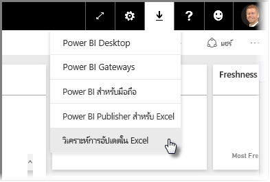
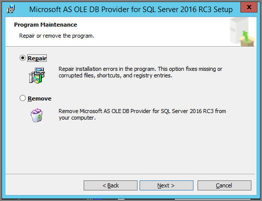

# การแก้ไขปัญหาการวิเคราะห์ใน ExcelTroubleshooting Analyze in Excel

อาจมีบางครั้งที่เมื่อคุณใช้การวิเคราะห์ใน Excel คุณได้รับผลลัพธ์ที่ไม่คาดคิดหรือลักษณะการทำงานไม่ทำงานตามที่คุณคาดไว้There may be times when using Analyze in Excel that you get an unexpected result, or the feature doesn't work as you expected. หน้านี้มีโซลูชันสำหรับปัญหาทั่วไปเมื่อใช้การวิเคราะห์ใน ExcelThis page provides solutions for common issues when using Analyze in Excel.

> [!NOTE]
> มีอีกหน้าที่มีไว้สำหรับการอธิบายและการเปิดใช้งาน[การวิเคราะห์ใน Excel](service-analyze-in-excel.md) โดยเฉพาะThere's a separate page dedicated to describing and enabling [Analyze in Excel](service-analyze-in-excel.md).
> 
> ถ้าคุณพบกับสถานการณ์สมมติที่ไม่ได้แสดงอยู่ในรายการด้านล่างนี้และทำให้เกิดปัญหากับคุณ คุณสามารถขอความช่วยเหลือพิ่่มเติมได้ใน[เว็บไซต์ชุมชน](https://community.powerbi.com/) หรือคุณสามารถสร้าง[ตั๋วสนับสนุน](https://powerbi.microsoft.com/support/)ได้If you encounter a scenario that is not listed below, and it is causing you issues, you can ask for further assistance on the [community site](https://community.powerbi.com/), or you can create a [support ticket](https://powerbi.microsoft.com/support/).
> 
> 

บทความนี้ประกอบด้วยส่วนการแก้ไขปัญหาต่อไปนี้:This article contains the following troubleshooting sections:

* อัปเดต Excel ไลบรารีสำหรับผู้ให้บริการ OLE DBUpdate Excel libraries for the OLE DB provider
* การกำหนดว่าคุณจำเป็นต้องอัปเดต Excel ไลบรารีของคุณหรือไม่Determining whether you need to update your Excel libraries
* ข้อผิดพลาดการไม่สามารถเชื่อมต่อได้Connection cannot be made error
* ข้อผิดพลาดการห้ามใช้งานForbidden error
* แบบจำลองไม่มีข้อมูลNo data models
* ข้อผิดพลาดโทเค็นหมดอายุToken expired error
* ไม่สามารถเข้าถึงบริการการวิเคราะห์ภายในองค์กรได้Unable to access on-premises Analysis services
* ไม่สามารถลากสิ่งใดไปยังพื้นที่ค่า PivotTable ได้ (ไม่มีหน่วยวัด)Can't drag anything to the PivotTable Values area (no measures)

## อัปเดต Excel ไลบรารีสำหรับผู้ให้บริการ OLE DBUpdate Excel libraries for the OLE DB provider
ในการใช้ **การวิเคราะห์ใน Excel** คอมพิวเตอร์ของคุณต้องติดตั้งผู้ให้บริการ AS OLE DB ปัจจุบันก่อนTo use **Analyze in Excel**, your computer must have a current AS OLE DB provider installed. [โพสต์ในชุมชน](https://community.powerbi.com/t5/Service/Analyze-in-Excel-Initialization-of-the-data-source-failed/m-p/30837#M8081)นี้เป็นแหล่งข้อมูลที่ยอดเยี่ยมในการตรวจสอบการติดตั้งผู้ให้บริการ OLE DB ของคุณหรือดาวน์โหลดเวอร์ชันล่าสุดThis [community post](https://community.powerbi.com/t5/Service/Analyze-in-Excel-Initialization-of-the-data-source-failed/m-p/30837#M8081) is a great source to verify your installation of the OLE DB provider, or to download a recent version.

ไลบรารี Excel จำเป็นต้องตรงกับเวอร์ชันของ Windows ในแง่ของระดับบิตThe Excel libraries need to match your version of Windows in terms of its bit-level. ถ้าคุณได้ติดตั้ง Windows เวอร์ชัน 64 บิต คุณจำเป็นต้องติดตั้งผู้ให้บริการ OLE DB 64-บิตIf you have 64-bit Windows installed, you need to install the 64-bit OLE DB provider.

เมื่อต้องการดาวน์โหลดไลบรารี Excel ล่าสุด โปรดไปที่ Power BI และเลือก **ลูกศรลง** ที่มุมบนขวาของบริการ Power BI แล้วเลือก **อัปเดตการวิเคราะห์ใน Excel**To download the latest Excel libraries, visit Power BI and select the **down arrow** in the upper right corner of the Power BI service, then select **Analyze in Excel updates**.

ในกล่องโต้ตอบที่ปรากฏขึ้น เลือก **ดาวน์โหลด (ตัวอย่าง)**In the dialog that appears, select **Download (preview)**.

## การกำหนดว่าคุณจำเป็นต้องอัปเดต Excel ไลบรารีของคุณหรือไม่Determining whether you need to update your Excel libraries
คุณสามารถดาวน์โหลดเวอร์ชันล่าสุดของไลบรารีผู้ให้บริการ Excel OLE DB ได้จากลิงก์ในส่วนก่อนหน้านี้You can download the most recent version of the Excel OLE DB provider libraries from the links in the previous section. เมื่อคุณดาวน์โหลดไลบรารี OLD DB ที่เหมาะสมแล้วและระบบเริ่มการติดตั้ง จะมีการตรวจสอบเทียบกับเวอร์ชันที่ติดตั้งปัจจุบันของคุณOnce you download the appropriate OLD DB provider library and begin installation, checks are performed against your current installed version.

ถ้าไลบรารีลูกค้าสำหรับผู้ให้บริการ Excel OLE DB ของคุณมีข้อมูลล่าสุด คุณจะเห็นกล่องโต้ตอบที่มีลักษณะดังต่อไปนี้:If your Excel OLE DB provider client libraries are up to date, you'll be presented with a dialog that looks like the following:

อีกวิธีหนึ่งคือ ถ้าคุณกำลังติดตั้งเวอร์ชันที่ใหม่กว่าเวอร์ชันบนคอมพิวเตอร์ของคุณ กล่องโต้ตอบต่อไปนี้ปรากฏขึ้น:Alternatively, if the new version you are installing is newer than the version on your computer, the following dialog appears:

ถ้าคุณเห็นกล่องโต้ตอบที่ปรากฏขึ้นให้คุณอัปเกรด คุณควรทำการติดตั้งต่อไปเพื่อให้ได้เวอร์ชันล่าสุดของผู้ให้บริการ OLE DB ติดตั้งในคอมพิวเตอร์ของคุณIf you see the dialog prompting you to upgrade, you should continue with the installation to get the most recent version of the OLE DB provider installed in your computer.

## ข้อผิดพลาดการไม่สามารถเชื่อมต่อได้Connection cannot be made error
สาเหตุหลักของข้อผิดพลาด *การไม่สามารถเชื่อมต่อได้* คือ ไลบรารีลูกค้าของผู้ให้บริการ OLE DB บนคอมพิวเตอร์ของคุณไม่เป็นปัจจุบันThe primary cause for a *connection cannot be made* error is that your computer's OLE DB provider client libraries are not current. สำหรับข้อมูลเกี่ยวกับวิธีการตรวจสอบการอัปเดตที่ถูกต้อง และสำหรับการดาวน์โหลดลิงก์ ดู **อัปเดตไลบรารี Excel สำหรับผู้ให้บริการ OLE DB** ที่มีอยู่ก่อนหน้านี้ในบทความนี้For information about how to determine the correct update, and for download links, see **Update Excel libraries for the OLE DB provider** earlier in this article.

## ข้อผิดพลาดการห้ามใช้งานForbidden error
ผู้ใช้บางรายมีบัญชี Power BI มากกว่าหนึ่งบัญชี และเมื่อ Excel พยายามเชื่อมต่อกับ Power BI โดยใช้ข้อมูลประจำตัวที่มีอยู่ Excel อาจใช้ข้อมูลประจำตัวที่ไม่สามารถเข้าถึงชุดข้อมูลหรือรายงานที่คุณต้องการเข้าถึงได้Some users have more than one Power BI account, and when Excel attempts to connect to Power BI using existing credentials, it may use credentials that do not have access to the dataset or report you want to access.

เมื่อเหตุการณ์นี้เกิดขึ้น คุณอาจได้รับข้อผิดพลาดที่ชื่อว่า **ห้ามใช้งาน** ซึ่งหมายความว่า คุณอาจมีการลงชื่อเข้าใช้ Power BI ด้วยข้อมูลประจำตัวที่ไม่มีสิทธิ์สำหรับชุดข้อมูลดังกล่าวได้When this occurs, you may  receive an error titled **Forbidden**, which means you may be signed into Power BI with credentials that do not have permissions to the dataset. หลังจากพบข้อผิดพลาด **ห้ามใช้งาน** เมื่อได้รับข้อความปรากฏให้ใส่ข้อมูลประจำตัวของคุณ ใช้ข้อมูลประจำตัวที่มีสิทธิ์ในการเข้าถึงชุดข้อมูลที่คุณกำลังพยายามเข้าใช้งานAfter encountering the **forbidden** error, when prompted to enter your credentials, use the credentials that have permission to access the dataset you're trying to use.

ถ้าคุณยังคงพบข้อผิดพลาดดังกล่าวอยู่ ลงชื่อเข้าใช้ Power BI ด้วยบัญชีผู้ใช้ที่มีสิทธิ์ และตรวจสอบว่า คุณสามารถดู และเข้าถึงชุดข้อมูลใน Power BI ที่คุณกำลังพยายามเข้าถึงใน Excel ได้หรือไม่If you still run into errors, log into Power BI with the account that has permission, and verify that you can view and access the dataset in Power BI that you're attempting to access in Excel.

## แบบจำลองไม่มีข้อมูลNo data models
ถ้าคุณพบข้อผิดพลาดที่ระบุว่า **ไม่พบแบบจำลองคิวบ์ OLAP** ดังนั้น ชุดข้อมูลที่คุณกำลังพยายามเข้าถึงไม่มีแบบจำลองข้อมูล ดังนั้นจึงไม่สามารถทำการวิเคราะห์ใน Excel ได้If you encounter an error that states **Can't find OLAP cube model**, then the dataset you're trying to access has no data model, and therefore cannot be analyzed in Excel.

## ข้อผิดพลาดโทเค็นหมดอายุToken expired error
ถ้าคุณได้รับข้อผิดพลาด **โทเค็นหมดอายุ** นั่นหมายความว่า คุณไม่ได้ใช้คุณลักษณะ **การวิเคราะห์ใน Excel** บนคอมพิวเตอร์เครื่องที่คุณกำลังใช้อยู่If you receive a **token expired** error, it means you haven't recently used the **Analyze in Excel** feature on the computer you're using. เพียงแค่ใส่ข้อมูลประจำตัวของคุณอีกครั้งหรือเปิดไฟล์อีกครั้ง ข้อผิดพลาดควรหายไปSimply re-enter your credentials, or reopen the file, and the error should go away.

## ไม่สามารถเข้าถึงบริการการวิเคราะห์ภายในองค์กรได้Unable to access on-premises Analysis Services
ถ้าคุณกำลังพยายามเข้าถึงชุดข้อมูลที่มีการเชื่อมต่อกับข้อมูล Analysis Services ภายในองค์กร คุณอาจได้รับข้อความข้อผิดพลาดหนึ่งIf you're trying to access a dataset that has connections to on-premises Analysis Services data, you may receive an error message. **การวิเคราะห์ใน Excel** สนับสนุนการเชื่อมต่อกับชุดข้อมูลและรายงาน **Analysis Services** ภายในองค์กรด้วยสตริงการเชื่อมต่อ ตราบใดที่คอมพิวเตอร์ของคุณอยู่บนโดเมนเดียวกันกับเซิร์ฟเวอร์ **Analysis Services** และบัญชีของคุณมีสิทธิ์เข้าใช้งานเซิร์ฟเวอร์ **Analysis Services** นั้นได้**Analyze in Excel** does support connecting to datasets and reports on on-premises **Analysis Services** with a connection string, as long as your computer is on the same domain as the **Analysis Services** server, and your account has access to that **Analysis Services** server.

## ไม่สามารถลากสิ่งใดไปยังพื้นที่ค่า PivotTable ได้ (ไม่มีหน่วยวัด)Can't drag anything to the PivotTable Values area (no measures)
เมื่อ **วิเคราะห์ใน Excel** เชื่อมต่อกับแบบจำลอง OLAP ภายนอกแล้ว (ซึ่งเป็นวิธีการที่ Excel เชื่อมต่อกับ Power BI) *PivotTable* ต้องการกำหนด **หน่วยวัด** ในแบบจำลองภายนอก เนื่องจากการคำนวณทั้งหมดได้ดำเนินการบนเซิร์ฟเวอร์When **Analyze in Excel** connects to an external OLAP model (which is how Excel connects to Power BI), the *PivotTable* requires **measures** to be defined in the external model, since all calculations are performed on the server. ซึ่งจะแตกต่างกับเมื่อคุณทำงานกับแหล่งข้อมูลภายในเครื่อง (เช่น ตารางใน Excel หรือเมื่อคุณทำงานกับชุดข้อมูลใน **Power BI Desktop** หรือ **บริการ Power BI**) ซึ่งเป็นกรณีที่แบบจำลองแบบตารางพร้อมใช้งานภายในเครื่อง และ [คุณสามารถใช้หน่วยวัดได้](https://support.microsoft.com/en-us/office/measures-in-power-pivot-86484821-a324-4da3-803b-82fd2e5033f4) โดยเป็นหน่วยวัดที่สร้างขึ้นแบบไดนามิกและไม่ได้จัดเก็บไว้ในแบบจำลองข้อมูลThis is different than when you work with a local data source (such as tables in Excel, or when you're working with datasets in **Power BI Desktop** or the **Power BI service**), in which case the tabular model is available locally, and [you can use implicit measures](https://support.microsoft.com/en-us/office/measures-in-power-pivot-86484821-a324-4da3-803b-82fd2e5033f4), which are measures that are generated dynamically and are not stored in the data model. ในกรณีเหล่านี้ ลักษณะการทำงานใน Excel จะแตกต่างจากลักษณะการทำงานใน **Power BI Desktop** หรือ **บริการ Power BI**: อาจมีคอลัมน์ในข้อมูลดังกล่าวที่สามารถใช้เป็นหน่วยวัดใน Power BI ได้แต่ไม่สามารถใช้เป็นค่า (หน่วยวัด) ใน Excel ได้In these cases, the behavior in Excel is different from the behavior in **Power BI Desktop** or the **Power BI service**: there may be columns in the data that can be treated as measures in Power BI, but can't be used as values (measures) in Excel.

เมื่อต้องการแก้ปัญหานี้ คุณมีสองสามตัวเลือก:To address this issue, you have a few options:

1. สร้าง [หน่วยวัดในแบบจำลองข้อมูลของคุณใน **Power BI Desktop**](../transform-model/desktop-tutorial-create-measures.md) จากนั้นเผยแพร่แบบจำลองข้อมูลไปยัง **บริการ Power BI** และเข้าใช้งานชุดข้อมูลที่เผยแพร่ชุดนั้นจาก ExcelCreate [measures in your data model in **Power BI Desktop**](../transform-model/desktop-tutorial-create-measures.md), then publish the data model to the **Power BI service** and access that published dataset from Excel.
2. สร้าง[หน่วยวัดในแบบจำลองข้อมูลของคุณจาก Excel PowerPivot](https://support.office.com/article/Create-a-Measure-in-Power-Pivot-d3cc1495-b4e5-48e7-ba98-163022a71198)Create [measures in your data model from Excel PowerPivot](https://support.office.com/article/Create-a-Measure-in-Power-Pivot-d3cc1495-b4e5-48e7-ba98-163022a71198).
3. ถ้าคุณนำเข้าข้อมูลจากสมุดงาน Excel ที่มีตารางเท่านั้น (และไม่มีแบบจำลองข้อมูล) คุณสามารถ[เพิ่มตารางลงในแบบจำลองข้อมูลได้](https://support.office.com/article/Add-worksheet-data-to-a-Data-Model-using-a-linked-table-d3665fc3-99b0-479d-ba09-a37640f5be42) จากนั้นทำตามขั้นตอนในตัวเลือกที่ 2 ที่อยู่ด้านบนเพื่อสร้างหน่วยวัดในแบบจำลองข้อมูลของคุณIf you imported data from an Excel workbook that had only tables (and no data model), then you can [add the tables to the data model](https://support.office.com/article/Add-worksheet-data-to-a-Data-Model-using-a-linked-table-d3665fc3-99b0-479d-ba09-a37640f5be42), then follow the steps in option 2, directly above, to create measures in your data model.

เมื่อกำหนดหน่วยวัดของคุณในแบบจำลองในบริการ Power BI แล้ว คุณจะสามารถใช้งานได้ในพื้นที่ **ค่า** ใน Pivottable ของ Excel ได้Once your measures are defined in the model in the Power BI service, you'll be able to use them in the **Values** area in Excel PivotTables.

## ขั้นตอนถัดไปNext steps
[วิเคราะห์ใน ExcelAnalyze in Excel](service-analyze-in-excel.md)

[บทช่วยสอน: สร้างหน่วยวัดของคุณเองใน Power BI Desktop Tutorial: Create your own measures in Power BI Desktop](../transform-model/desktop-tutorial-create-measures.md)

[หน่วยวัดใน PowerPivotMeasures in PowerPivot](https://support.microsoft.com/en-us/office/measures-in-power-pivot-86484821-a324-4da3-803b-82fd2e5033f4)

[สร้างหน่วยวัดใน PowerPivotCreate a Measure in PowerPivot](https://support.office.com/article/Create-a-Measure-in-Power-Pivot-d3cc1495-b4e5-48e7-ba98-163022a71198)

[เพิ่มข้อมูลในแผ่นงานไปยังแบบจำลองข้อมูลโดยใช้ตารางที่เชื่อมโยงAdd worksheet data to a Data Model using a linked table](https://support.office.com/article/Add-worksheet-data-to-a-Data-Model-using-a-linked-table-d3665fc3-99b0-479d-ba09-a37640f5be42)
