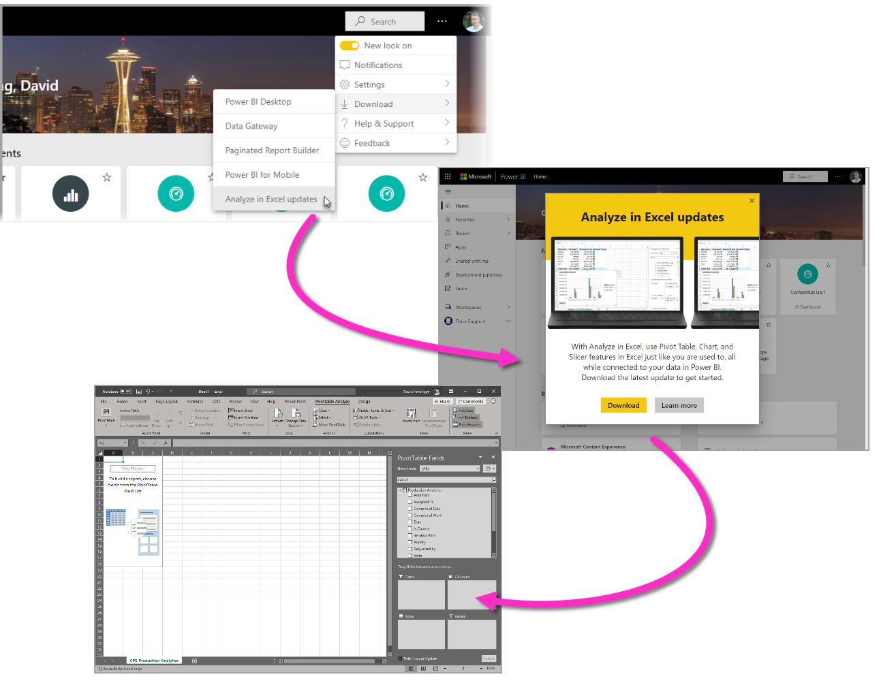
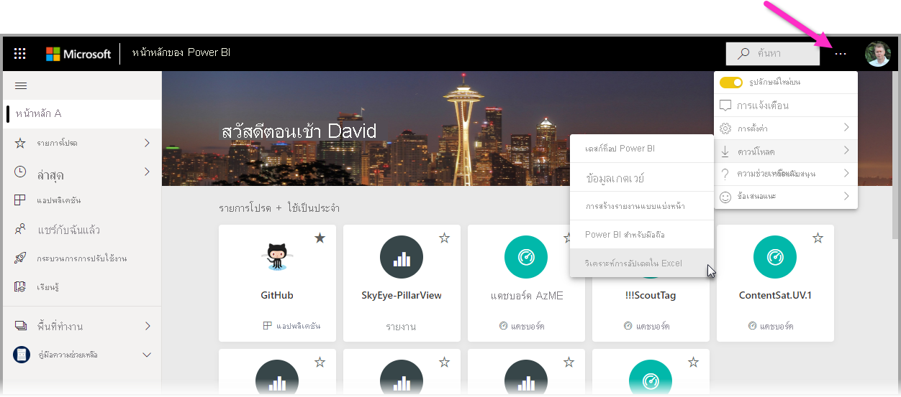
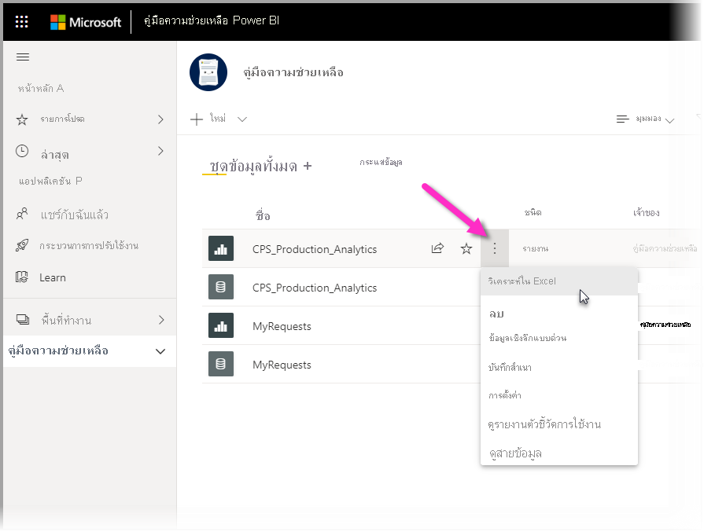
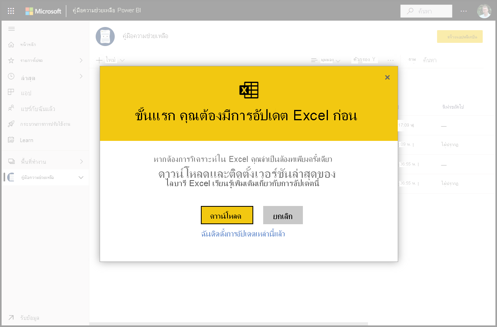
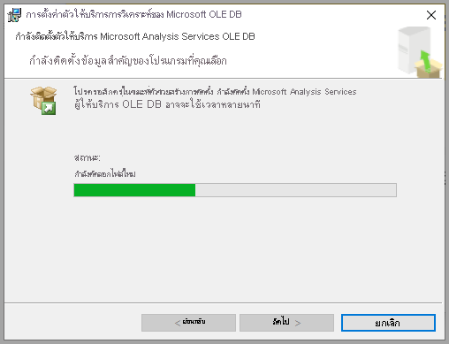
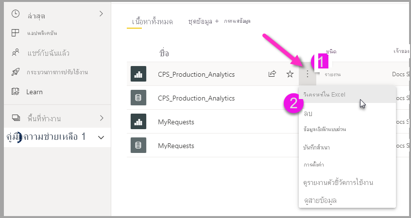
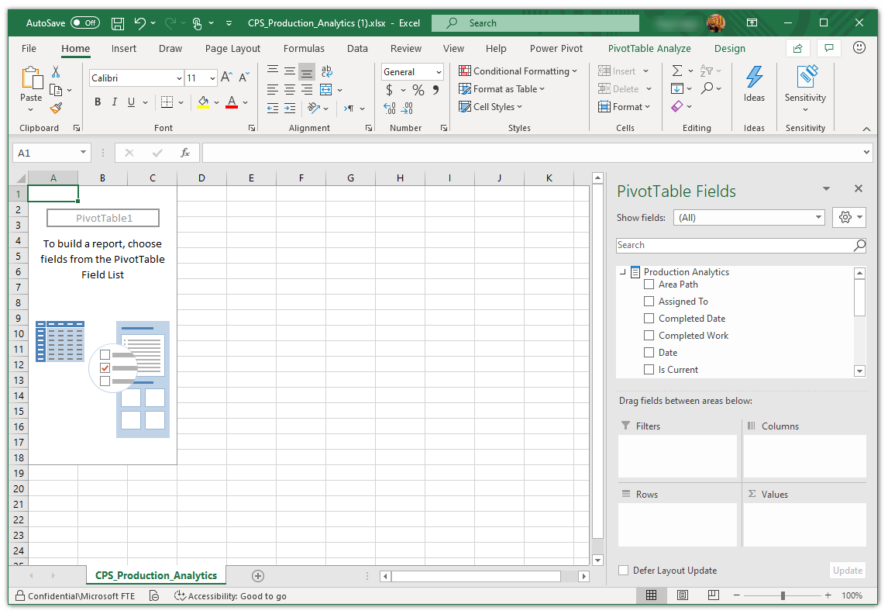
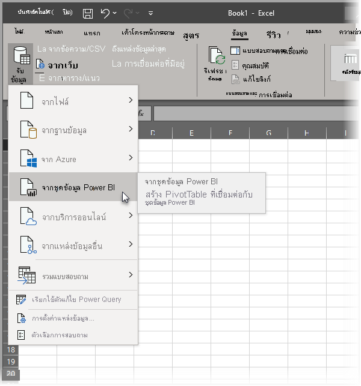

# วิเคราะห์ใน ExcelAnalyze in Excel
ด้วย **วิเคราะห์ใน Excel** คุณสามารถนำชุดข้อมูล Power BI เข้าสู่ Excel และจากนั้นดูและโต้ตอบกับชุดข้อมูลเหล่านั้นได้โดยใช้ PivotTables แผนภูมิ แบ่งส่วนข้อมูล และคุณลักษณะอื่นๆ ของ ExcelWith **Analyze in Excel**, you can bring Power BI datasets into Excel, and then view and interact with them using PivotTables, charts, slicers, and other Excel features. เมื่อต้องการใช้ **วิเคราะห์ใน Excel** ก่อนอื่นคุณต้องดาวน์โหลดคุณลักษณะจาก Power BI ทำการติดตั้ง และจากนั้นจึงเลือกชุดข้อมูลอย่างน้อยหนึ่งชุดเพื่อใช้ใน ExcelTo use **Analyze in Excel** you must first download the feature from Power BI, install it, and then select one or more datasets to use in Excel. 

บทความนี้แสดงวิธีการติดตั้งและใช้การวิเคราะห์ใน Excel อธิบายข้อจำกัด จากนั้นจึงทำตามขั้นตอนถัดไปThis article shows you how to install and use Analyze in Excel, describes its limitations, then provides some next steps. ต่อไปนี้เป็นสิ่งที่คุณจะได้เรียนรู้:Here's what you'll learn:

* [ติดตั้งการวิเคราะห์ใน ExcelInstall Analyze in Excel](#install-analyze-in-excel)
* [เชื่อมต่อกับ Power BIConnect to Power BI data](#connect-to-power-bi-data)
* [ใช้ Excel ในการวิเคราะห์ข้อมูลUse Excel to analyze the data](#use-excel-to-analyze-the-data)
* [การบันทึกและการแชร์เวิร์กบุ๊กของคุณSaving and sharing your workbook](#saving-and-sharing-your-new-workbook)
* [ข้อกำหนดRequirements](#requirements)

มาสิ เริ่มกระบวนการติดตั้งกันเลยLet's jump in, and get the installation process started.

## ติดตั้งการวิเคราะห์ใน ExcelInstall Analyze in Excel

คุณต้องติดตั้ง **วิเคราะห์ใน Excel** จากลิงก์ที่ให้ไว้ในบริการของ Power BIYou must install **Analyze in Excel** from links provided in the Power BI service. Power BI ตรวจพบเวอร์ชันของ Excel ที่คุณมีในคอมพิวเตอร์ของคุณ และดาวน์โหลดเวอร์ชันที่เหมาะสม (32-bit หรือ 64-bit) โดยอัตโนมัติPower BI detects the version of Excel you have on your computer, and automatically downloads the appropriate version (32-bit or 64-bit). บริการ Power BI ทำงานในเบราว์เซอร์The Power BI service runs in a browser. คุณสามารถลงชื่อเข้าใช้ Power BI โดยใช้ลิงก์ต่อไปนี้:You can sign in to the Power BI using the following link:

* [ลงชื่อเข้าใช้ Power BISign in to Power BI](https://app.powerbi.com)

หลังจากที่คุณลงชื่อเข้าใช้และบริการของ Power BI ทำงานอยู่ในเบราว์เซอร์ของคุณแล้ว ให้เลือกรายการ **ตัวเลือกเพิ่มเติม**  (...) ที่มุมบนขวาแล้วเลือก **ดาวน์โหลด > อัปเดตการวิเคราะห์ใน Excel**Once you've signed in and the Power BI service is running in your browser, select the **More options** item (the ...) in the upper-right corner and then select **Download > Analyze in Excel updates**. รายการเมนูนี้นำไปใช้กับการติดตั้งการอัปเดตของการวิเคราะห์ใน Excel ใหม่This menu item applies to new installations of updates of Analyze in Excel.

อีกวิธีหนึ่งคือคุณสามารถนำทางในบริการของ Power BI ไปยังชุดข้อมูลที่คุณต้องการวิเคราะห์ และเลือกรายการ **ตัวเลือกเพิ่มเติม** สำหรับชุดข้อมูล รายงาน หรือรายการ Power BI อื่นๆAlternatively, you can navigate in the Power BI service to a dataset you want to analyze, and select the **More options** item for a dataset, report, or other Power BI item. จากเมนูที่ปรากฏขึ้น เลือกตัวเลือก **วิเคราะห์ใน Excel** ดังที่แสดงในรูปต่อไปนี้From the menu that appears, select the **Analyze in Excel** option, as shown in the following image.

ไม่ว่าจะด้วยวิธีใด Power BI จะตรวจสอบว่าคุณมีการวิเคราะห์ใน Excel ติดตั้งอยู่หรือไม่ และหากไม่ คุณจะได้รับพร้อมท์เพื่อดาวน์โหลดEither way, Power BI detects whether you have Analyze in Excel installed, and if not, you're prompted to download. 

เมื่อคุณเลือกดาวน์โหลด Power BI จะตรวจสอบเวอร์ชันของ Excel ที่คุณได้ติดตั้ง และดาวน์โหลดเวอร์ชันที่เหมาะสมของตัวติดตั้งการวิเคราะห์ใน ExcelWhen you select download, Power BI detects the version of Excel you have installed and downloads the appropriate version of the Analyze in Excel installer. คุณจะเห็นสถานะการดาวน์โหลดที่ด้านล่างของเบราว์เซอร์ของคุณ หรือที่ใดก็ตามที่เบราว์เซอร์ของคุณแสดงความคืบหน้าการดาวน์โหลดYou see a download status in the bottom of your browser, or wherever your browser displays download progress. 

เมื่อการดาวน์โหลดเสร็จสมบูรณ์ ให้เรียกใช้ตัวติดตั้ง (.msi) เพื่อติดตั้งการวิเคราะห์ใน ExcelWhen the download completes, run the installer (.msi) to install Analyze in Excel. ชื่อของกระบวนการติดตั้งแตกต่างจากการวิเคราะห์ใน Excel โดยชื่อจะเป็น **Microsoft Analysis Services OLE DB Provide** ดังที่แสดงในรูปต่อไปนี้ หรืออาจเป็นชื่ออื่นที่คล้ายกันThe name of the installation process is different from Analyze in Excel; the name will be **Microsoft Analysis Services OLE DB Provider** as shown in the following image, or something similar.

เมื่อเสร็จสมบูรณ์แล้ว คุณก็พร้อมที่จะเลือกรายงานในบริการของ Power BI (หรือองค์ประกอบข้อมูล Power BI อื่นๆ เช่นชุดข้อมูล) จากนั้นทำการวิเคราะห์ใน ExcelOnce it completes, you're ready to select a report in the Power BI service (or other Power BI data element, like a dataset), and then analyze it in Excel.

## เชื่อมต่อกับข้อมูล Power BIConnect to Power BI data

ในบริการของ Power BI ให้ไปที่ชุดข้อมูลหรือรายงานที่คุณต้องการวิเคราะห์ใน Excel จากนั้นให้ดำเนินการต่อไปนี้:In the Power BI service, navigate to the dataset or report you want to analyze in Excel, and then:

1. เลือกเมนู **ตัวเลือกเพิ่มเติม**Select the **More options** menu.

1. เลือก **วิเคราะห์ใน Excel** จากรายการเมนูที่ปรากฏขึ้นSelect **Analyze in Excel** from the menu items that appear.

    รูปภาพต่อไปนี้แสดงการเลือกรายงานThe following image shows selecting a report.

    
    
    >[!NOTE]
    >โปรดทราบว่าหากคุณเลือกวิเคราะห์ใน Excel จากเมนูรายงาน ระบบจะใส่ชุดข้อมูลพื้นฐานของรายงานลงใน ExcelRemember that if you select Analyze in Excel from a Report menu, it is the report's underlying dataset that is brought into Excel.

    จากนั้นบริการของ Power BI จะสร้างไฟล์ Excel ของชุดข้อมูลซึ่งออกแบบ (และจัดโครงสร้าง) เพื่อใช้กับ **วิเคราะห์ใน Excel** และเริ่มต้นกระบวนการดาวน์โหลดในเบราว์เซอร์ของคุณThe Power BI service then creates an Excel file of the dataset that's designed (and structured) for use with **Analyze in Excel**, and begins a download process in your browser.
    
    

    ชื่อไฟล์ตรงกับชุดข้อมูล (หรือรายงาน หรือแหล่งข้อมูลอื่นๆ) จากที่ได้รับมาThe file name matches the dataset (or report, or other data source) from which it was derived. ดังนั้น หากรายงานมีชื่อว่า *รายงานรายไตรมาส* ไฟล์ที่ดาวน์โหลดก็จะมีชื่อเป็น **รายงานรายไตรมาส.xlsx**So if the report was called *Quarterly Report*, then the downloaded file would be **Quarterly Report.xlsx**.

    >[!Note]
    >วิเคราะห์ใน Excel ตอนนี้ดาวน์โหลดไฟล์ Excel แทนที่จะเป็นไฟล์ ODCAnalyze in Excel now downloads an Excel file instead of an ODC file. ซึ่งเป็นการเปิดใช้งานการป้องกันข้อมูลบนข้อมูลที่ส่งออกจาก Power BIThis enables data protection on data exported from Power BI. ไฟล์ Excel ที่ดาวน์โหลดมาจะสืบทอดป้ายชื่อระดับความลับของชุดข้อมูลที่เลือกสำหรับการวิเคราะห์ใน ExcelThe downloaded Excel file inherits the sensitivity label of the dataset chosen for Analyze in Excel.

3. เริ่มใช้งานไฟล์ ExcelLaunch the Excel file.

    >[!NOTE]
    >เมื่อคุณเปิดไฟล์ครั้งแรก คุณอาจต้อง **เปิดใช้งานการแก้ไข** จากนั้น **เปิดใช้งานเนื้อหา** ทั้งนี้ขึ้นอยู่กับการตั้งค่า [มุมมองที่มีการป้องกัน](https://support.microsoft.com/en-gb/office/what-is-protected-view-d6f09ac7-e6b9-4495-8e43-2bbcdbcb6653?ui=en-us&rs=en-gb&ad=gb)และ [เอกสารที่น่าเชื่อถือ](https://support.microsoft.com/en-us/office/trusted-documents-cf872bd8-47ec-4c02-baa5-1fdba1a11b53)ของคุณThe first time you open the file, you may have to **Enable Editing** and then **Enable Content**, depending on your [Protected view](https://support.microsoft.com/en-gb/office/what-is-protected-view-d6f09ac7-e6b9-4495-8e43-2bbcdbcb6653?ui=en-us&rs=en-gb&ad=gb) and [Trusted document](https://support.microsoft.com/en-us/office/trusted-documents-cf872bd8-47ec-4c02-baa5-1fdba1a11b53) settings.
    >
    >
    >
    >

เมื่อใช้ Excel ในการวิเคราะห์ Power BI โดยใช้ PivotTable จะช่วยให้ Power BI ส่งต่อค่าของป้ายระดับความลับไปยัง ExcelWhen using Excel to analyze Power BI using a PivotTable, Power BI extends sensitivity label inheritance to Excel. ป้ายบอกระดับความลับที่ใช้ในชุดข้อมูล Power BI จะถูกนำไปใช้กับไฟล์ Excel โดยอัตโนมัติเมื่อคุณสร้าง PivotTable ใน ExcelA sensitivity label applied on a Power BI dataset is automatically applied to the Excel file when you create a PivotTable in Excel. 

ถ้าในเวลาต่อมาป้ายชื่อบนชุดข้อมูลมีการเปลี่ยนแปลงให้มีความรัดกุมมากขึ้น ป้ายชื่อที่ใช้ในไฟล์ Excel จะอัปเดตโดยอัตโนมัติเมื่อรีเฟรชข้อมูลใน ExcelIf the label on the dataset subsequently changes to be more restrictive, the label applied to the Excel file is automatically updated upon data refresh in Excel. ถ้าชุดข้อมูลได้รับการเปลี่ยนแปลงให้มีความรัดกุมน้อยลง จะไม่มีการส่งต่อป้ายชื่อหรือการอัปเดตIf the dataset changes to become less restrictive, no label inheritance or update occurs.

ป้ายระดับความลับใน Excel ที่ตั้งไว้ด้วยตนเองจะไม่ถูกเขียนทับโดยป้ายระดับความลับของชุดข้อมูลโดยอัตโนมัติSensitivity labels in Excel that were manually set are not automatically overwritten by the dataset's label. ถ้าไฟล์ Excel มีป้ายระดับความลับที่ตั้งด้วยตัวเอง จะมีเคล็ดลับนโยบายปรากฏขึ้น โดยจะมีคำแนะนำให้อัปเกรดป้ายIf an Excel file has a manually set sensitivity label, a policy tip will appear with a recommendation to upgrade the label. 

สำหรับข้อมูลเพิ่มเติม โปรดดู [วิธีการปรับใช้ป้ายบอกระดับความลับใน Power BI](../admin/service-security-apply-data-sensitivity-labels.md)For more information, see [how to apply sensitivity labels in Power BI](../admin/service-security-apply-data-sensitivity-labels.md).

## ใช้ Excel ในการวิเคราะห์ข้อมูลUse Excel to analyze the data

เมื่อคุณเปิดใช้งานการแก้ไขและเนื้อหาแล้ว Excel จะแสดงให้คุณเห็นรายการ **PivotTable** และ **เขตข้อมูล** ที่ว่างเปล่าจากชุดข้อมูล Power BI ซึ่งพร้อมที่จะวิเคราะห์Once you've enabled editing and content, Excel presents you with an empty **PivotTable** and **Fields** list from the Power BI dataset, ready to be analyzed.

ไฟล์ Excel มีสตริงการเชื่อมต่อ MSOLAP ที่เชื่อมต่อกับชุดข้อมูลของคุณใน Power BIThe Excel file has an MSOLAP connection string that connects to your dataset in Power BI. เมื่อคุณวิเคราะห์หรือทำงานกับข้อมูลดังกล่าว Excel ร้องขอชุดข้อมูลใน Power BI และส่งกลับผลลัพธ์ไปยัง ExcelWhen you analyze or work with the data, Excel queries that dataset in Power BI and returns the results to Excel. ถ้าชุดข้อมูลนั้นเชื่อมต่อกับแหล่งข้อมูลสดโดยใช้ DirectQuery, Power BI ร้องขอแหล่งข้อมูลและส่งผลลัพธ์ไปยัง ExcelIf that dataset connects to a live data source using DirectQuery, Power BI queries the data source and returns the result to Excel.

ด้วยการเชื่อมต่อกับข้อมูลใน Power BI นั้น คุณสามารถสร้าง Pivottable แผนภูมิ และวิเคราะห์ชุดข้อมูลในทำนองเดียวกับที่คุณจะดำเนินการกับชุดข้อมูลภายในเครื่องใน ExcelWith that connection to the data in Power BI now established, you can create PivotTables, charts, and analyze that dataset just as you would work with a local dataset in Excel.

**วิเคราะห์ใน Excel** มีประโยชน์โดยเฉพาะอย่างยิ่งสำหรับชุดข้อมูลและรายงานที่เชื่อมต่อกับแหล่งข้อมูลดังต่อไปนี้:**Analyze in Excel** is especially useful for datasets and reports that connect to the following data sources:

* ฐานข้อมูล *แบบตารางบริการการวิเคราะห์* หรือ *แบบหลายมิติ**Analysis Services Tabular* or *Multidimensional* databases
* ไฟล์หรือสมุดงาน Excel ใน Power BI Desktop  ที่มีแบบจำลองข้อมูลซึ่งมีหน่วยวัดแบบจำลองที่สร้างขึ้นโดยใช้นิพจน์การวิเคราะห์ข้อมูล (DAX)Power BI Desktop files or Excel workbooks with data models that have model measures created using Data Analysis Expressions (DAX).

> [!IMPORTANT]
> การใช้ **วิเคราะห์ใน Excel** จะแสดงข้อมูลในระดับรายละเอียดทั้งหมดให้กับผู้ใช้ทุกคนที่มีสิทธิ์ในการเข้าถึงชุดข้อมูลUsing **Analyze in Excel** exposes all detail-level data to any users with permission to the dataset.

มีหลายสิ่งที่ต้องพิจารณาเมื่อคุณเริ่มใช้การวิเคราะห์ใน Excel ซึ่งอาจต้องมีขั้นตอนเพิ่มเติมหนึ่งหรือสองขั้นตอนในการจัดการThere are a handful of things to consider when you begin using Analyze in Excel, which might require an extra step or two to reconcile. ความเป็นไปได้เหล่านี้จะอธิบายไว้ในส่วนต่อไปนี้These possibilities are described in the following sections. 

### ลงชื่อเข้าใช้ไปยัง Power BISign in to Power BI
แม้ว่าคุณลงชื่อเข้าใช้ Power BI แล้วในเบราว์เซอร์ของคุณ ครั้งแรกที่คุณเปิดไฟล์ Excel ใหม่ใน Excel คุณอาจถูกขอให้ลงชื่อเข้าใช้ Power BI ด้วยบัญชี Power BI ของคุณAlthough you’re signed in to Power BI in your browser, the first time you open a new Excel file in Excel you may be asked to sign in to Power BI with your Power BI account. ซึ่งขั้นตอนนี้รับรองความถูกต้องการเชื่อมต่อจาก Excel ไปยัง Power BIThis authenticates the connection from Excel to Power BI.

### ผู้ใช้ที่มีบัญชี Power BI หลายบัญชีUsers with multiple Power BI accounts
ผู้ใช้บางรายมีบัญชี Power BI หลายบัญชีSome users have multiple Power BI accounts. หากคุณเป็นคนหนึ่ง คุณอาจลงชื่อเข้าใช้ Power BI ด้วยบัญชีเดียว แต่บัญชีอื่นๆ ของคุณมีการเข้าถึงชุดข้อมูลที่ใช้ในการวิเคราะห์ใน ExcelIf that's you, you might be signed in to Power BI with one account, but your other account has access to the dataset being used in Analyze in Excel. ในกรณีนั้น คุณอาจได้รับการแจ้งข้อผิดพลาด **ห้ามใช้งาน** หรือเข้าสู่ระบบไม่สำเร็จขณะพยายามเข้าถึงชุดข้อมูลที่กำลังใช้ในเวิร์กบุ๊กการวิเคราะห์ใน ExcelIn that case, you might see a **Forbidden** error, or a sign-in failure when attempting to access a dataset that's being used in an Analyze in Excel workbook.

หากเกิดขึ้นเช่นนั้น คุณจะมีโอกาสในการลงชื่อเข้าใช้ในอีกครั้งหนึ่ง ซึ่งคุณสามารถลงชื่อเข้าใช้ด้วยบัญชี Power BI ที่มีสิทธิ์เข้าถึงชุดข้อมูลที่กำลังเข้าถึงโดยการวิเคราะห์ใน Excel ได้If that happens, you'll be provided an opportunity to sign in again, at which time you can sign in with the Power BI account that has access to the dataset being accessed by Analyze in Excel. คุณยังสามารถเลือกชื่อของคุณในแถบเครื่องมือด้านบนสุดใน Excel ซึ่งระบุบัญชีที่คุณกำลังลงชื่อเข้าใช้ด้วยในปัจจุบันYou can also select your name in the top ribbon in Excel, which identifies which account is currently signed in. ลงชื่อออกจากระบบและลงชื่อเข้าใช้อีกครั้งด้วยบัญชีอื่นSign out and sign back in with the other account.

## การบันทึกและการแชร์เวิร์กบุ๊กใหม่ของคุณSaving and sharing your new workbook

คุณสามารถ **บันทึก** เวิร์กบุ๊ก Excel ที่คุณสร้างขึ้นด้วยชุดข้อมูล Power BI ได้เช่นเดียวกับเวิร์กบุ๊กอื่นYou can **Save** the Excel workbook you create with the Power BI dataset, just like any other workbook. อย่างไรก็ตาม คุณไม่สามารถเผยแพร่ หรือนำเข้าเวิร์กบุ๊กกลับไปยัง Power BI ได้ เนื่องจากคุณสามารถเผยแพร่หรือนำเข้าสมุดงานไปยัง Power BI ที่มีข้อมูลในตาราง หรือที่มีแบบจำลองข้อมูลได้เท่านั้นHowever, you cannot publish or import the workbook back into Power BI, because you can only publish or import workbooks into Power BI that have data in tables, or that have a data model. เนื่องจากสมุดงานใหม่มีการเชื่อมต่อกับชุดข้อมูลใน Power BI การเผยแพร่หรือนำเข้าไปยัง Power BI จะวนกลับไปกลับมา!Since the new workbook simply has a connection to the dataset in Power BI, publishing or importing it into Power BI would be going in circles!

เมื่อบันทึกสมุดงานของคุณแล้ว คุณสามารถแชร์กับผู้ใช้ Power BI อื่นในองค์กรของคุณได้Once your workbook is saved, you can share it with other Power BI users in your organization. 

เมื่อผู้ใช้ที่คุณแชร์เวิร์กบุ๊กของคุณด้วยเปิดเวิร์กบุ๊กนั้นขึ้น พวกเขาจะเห็น Pivottable และข้อมูลของคุณตามที่ปรากฏเมื่อคุณบันทึกเวิร์กบุ๊กของคุณครั้งสุดท้าย ซึ่งอาจไม่ใช่ข้อมูลเวอร์ชันล่าสุดWhen a user with whom you’ve shared your workbook opens it, they’ll see your PivotTables and data as they appeared when the workbook was last saved, which may not be the latest version of the data. เพื่อให้ได้ข้อมูลล่าสุด ผู้ใช้ต้องใช้ปุ่ม **รีเฟรช** บน Ribbon **ข้อมูล**To get the latest data, users must use the **Refresh** button on the **Data** ribbon. และเนื่องจากเวิร์กบุ๊กกำลังเชื่อมต่อไปยังชุดข้อมูลใน Power BI ผู้ใช้ที่พยายามรีเฟรชเวิร์กบุ๊กต้องลงชื่อเข้าใช้ใน Power BI และติดตั้งการอัปเดต Excel ครั้งแรกที่พวกเขาพยายามที่จะอัปเดตโดยใช้วิธีการนี้And since the workbook is connecting to a dataset in Power BI, users attempting to refresh the workbook must sign in to Power BI and install the Excel updates the first time they attempt to update using this method.

เนื่องจากผู้ใช้ต้องรีเฟรชชุดข้อมูลนั้น และการรีเฟรชสำหรับการเชื่อมต่อภายนอกไม่รองรับอยู่ใน Excel Online ขอแนะนำให้ผู้ใช้เปิดเวิร์กบุ๊กใน Excel เวอร์ชันเดสก์ท็อปบนคอมพิวเตอร์ของผู้ใช้งานSince users need to refresh the dataset, and refresh for external connections is not supported in Excel Online, it’s recommended that users open the workbook in the desktop version of Excel on their computer.

> [!NOTE]
> ผู้ดูแลระบบสำหรับผู้เช่า Power BI สามารถใช้ *พอร์ทัลผู้ดูแลระบบของ Power BI* เพื่อปิดใช้งาน **วิเคราะห์ใน Excel** ที่มีชุดข้อมูลภายในองค์กรที่ถูกติดตั้งในฐานข้อมูล Analysis Services (AS) ได้Administrators for Power BI tenants can use the *Power BI Admin Portal* to disable the use of **Analyze in Excel** with on-premises datasets housed in Analysis Services (AS) databases. เมื่อตัวเลือกนั้นถูกปิดใช้งาน **วิเคราะห์ใน Excel** ถูกปิดใช้งานสำหรับฐานข้อมูล AS แต่ยังคงพร้อมใช้งานสำหรับการใช้กับชุดข้อมูลอื่นWhen that option is disabled, **Analyze in Excel** is disabled for AS databases, but continues to be available for use with other datasets.

## วิธีอื่นในการเข้าถึงชุดข้อมูล Power BI จาก ExcelOther ways to access Power BI datasets from Excel
ผู้ใช้ที่มี Office SKU เฉพาะยังสามารถเชื่อมต่อกับชุดข้อมูล Power BI จากภายใน Excel ได้โดยใช้คุณลักษณะ **รับข้อมูล** ใน ExcelUsers with specific Office SKUs can also connect to Power BI datasets from within Excel by using the **Get Data** feature in Excel. ถ้า SKU ของคุณไม่รองรับคุณลักษณะนี้ ตัวเลือกเมนู **รับข้อมูล** จะไม่ปรากฏขึ้นIf your SKU does not support this feature, the **Get Data** menu option does not appear.

จากเมนูแถบเครื่องมือ **ข้อมูล** เลือก  **รับข้อมูล > จากชุดข้อมูล Power BI** ดังที่แสดงในรูปต่อไปนี้From the **Data** ribbon menu, select **Get Data > From Power BI dataset** as shown in the following image.

บานหน้าต่างจะปรากฏขึ้นซึ่งคุณสามารถเรียกดูชุดข้อมูลที่คุณมีสิทธิ์เข้าถึง และดูว่าชุดข้อมูลได้รับการรับรองหรือได้รับการเลื่อนระดับหรือไม่ อีกทั้งพิจารณาว่ามีการใช้ป้ายชื่อการป้องกันข้อมูลกับชุดข้อมูลเหล่านั้นหรือไม่A pane appears, in which you can browse datasets to which you have access, see if datasets are certified or promoted, and determine whether data protection labels have been applied to those datasets. 

สำหรับข้อมูลเพิ่มเติมเกี่ยวกับการรับข้อมูลลงใน Excel ด้วยวิธีนี้ ดู [สร้าง PivotTable จากชุดข้อมูล Power BI](https://support.office.com/article/31444a04-9c38-4dd7-9a45-22848c666884) ในเอกสารประกอบของ ExcelFor more information about getting data into Excel in this way, see [Create a PivotTable from Power BI datasets](https://support.office.com/article/31444a04-9c38-4dd7-9a45-22848c666884) in the Excel documentation.

คุณยังสามารถเข้าถึง **ตารางที่แนะนำ** ใน Excel ได้ ในแกลเลอรี **ชนิดข้อมูล**You can also access **featured tables** in Excel, in the **Data Types** gallery. หากต้องการเรียนรู้เพิ่มเติมเกี่ยวกับตารางที่แนะนำและวิธีการเข้าถึงตารางเหล่านั้น ดู [เข้าถึงตารางที่แนะนำ Power BI ใน Excel (ตัวอย่าง)](service-excel-featured-tables.md)To learn more about featured tables, and how to access them, see [Access Power BI featured tables in Excel (preview)](service-excel-featured-tables.md).

## ข้อกำหนดRequirements
มีสองสามข้อกำหนดสำหรับการใช้ **วิเคราะห์ใน Excel**:There are a few requirements for using **Analyze in Excel**:

* **วิเคราะห์ใน Excel** สนับสนุนสำหรับ Microsoft Excel 2010 SP1 และเวอร์ชั่นที่ใหม่กว่า**Analyze in Excel** is supported for Microsoft Excel 2010 SP1 and later.

* Pivottable ของ Excel ไม่สนับสนุนการรวมที่ลากแล้วปล่อยสำหรับเขตข้อมูลตัวเลขExcel PivotTables do not support drag-and-drop aggregation of numeric fields. ชุดข้อมูลของคุณใน Power BI *ต้องมีหน่วยวัดที่กำหนดไว้ล่วงหน้า*Your dataset in Power BI *must have pre-defined measures*. อ่านเกี่ยวกับ [การสร้างหน่วยวัด](../transform-model/desktop-measures.md)Read about [creating measures](../transform-model/desktop-measures.md).
* บางองค์กรอาจมี Group Policy (นโยบายของทั้งองค์กร) ที่ป้องกันการติดตั้งอัปเดต **วิเคราะห์ใน Excel** ที่จำเป็นไปยัง ExcelSome organizations may have Group Policy rules that prevent installing the required **Analyze in Excel** updates to Excel. ถ้าคุณไม่สามารถติดตั้งการอัปเดตได้ โปรดตรวจสอบกับผู้ดูแลระบบของคุณIf you’re unable to install the updates, check with your administrator.
* **วิเคราะห์ใน Excel** ต้องการให้ชุดข้อมูลใน Power BI Premium หรือที่ว่าผู้ใช้มีใบอนุญาต Power BI Pro**Analyze in Excel** requires that the dataset be in Power BI Premium or that the user have a Power BI Pro license. เมื่อต้องการเรียนรู้เพิ่มเติมเกี่ยวกับความแตกต่างในฟังก์ชันการทำงานระหว่างสิทธิ์ในการใช้ Power BI แบบต่างๆ ดูที่ _การเปรียบเทียบคุณลักษณะ Power BI_[ตามราคา](https://powerbi.microsoft.com/pricing/)To learn more about the differences in functionality between license types, take a look at the _Power BI features comparison_ section of [Power BI pricing](https://powerbi.microsoft.com/pricing/).
* ผู้ใช้สามารถเชื่อมต่อกับชุดข้อมูลผ่าน Analyze ใน Excel หากพวกเขามีสิทธิสำหรับชุดข้อมูลพื้นฐานUsers can connect to datasets through Analyze in Excel if they have permission for the underlying dataset.  ผู้ใช้สามารถมีสิทธินี้ได้หลายแนวทาง เช่น การมีบทบาทสมาชิกในพื้นที่ทำงานที่มีชุดข้อมูล มีรายงานหรือแดชบอร์ดที่แชร์กับพวกเขาที่ใช้ชุดข้อมูลดังกล่าว หรือมีสิทธิในการสร้างสำหรับชุดข้อมูลในพื้นที่ทำงานหรือแอปที่มีชุดข้อมูลA user could have this permission in several ways, such as having the Member role in the workspace containing the dataset, having a report or dashboard shared to them that uses the dataset, or having Build permission for the dataset, in either a workspace or an app that contains the dataset. อ่านเพิ่มเติมเกี่ยวกับ[สิทธิในการสร้าง](../connect-data/service-datasets-build-permissions.md)สำหรับชุดข้อมูลRead more about [Build permission](../connect-data/service-datasets-build-permissions.md) for datasets.
* ผู้ใช้ที่เป็นผู้เยี่ยมชมไม่สามารถใช้ **วิเคราะห์ใน Excel** สำหรับชุดข้อมูลที่ส่งจาก (มีที่มาจาก) ผู้เช่ารายอื่นGuest users cannot use **Analyze in Excel** for datasets sent from (originating from) another tenant. 
* **Analyze ใน Excel** เป็นคุณลักษณะบริการของ Power BI และไม่พร้อมใช้งานในเซิร์ฟเวอร์รายงาน Power BI หรือ Power BI Embedded**Analyze in Excel** is a Power BI service feature, and is not available in Power BI Report Server or Power BI Embedded. 
* **Analyze ใน Excel** รองรับเฉพาะในคอมพิวเตอร์ที่ติดตั้ง Microsoft Windows**Analyze in Excel** is only supported on computers running Microsoft Windows.

สำหรับผู้ใช้ที่ต้องการถอนการติดตั้งคุณลักษณะ **วิเคราะห์ใน Excel** คุณสามารถทำได้โดยใช้การตั้งค่าระบบ **เพิ่มหรือลบโปรแกรม** ในคอมพิวเตอร์ Windows ของคุณFor users who need to uninstall the **Analyze in Excel** feature, you can do so using the **Add or remove programs** system setting on your Windows computer.

## การแก้ไขปัญหาTroubleshooting
อาจมีบางครั้งที่เมื่อคุณใช้การวิเคราะห์ใน Excel คุณได้รับผลลัพธ์ที่ไม่คาดคิดหรือลักษณะการทำงานไม่ทำงานตามที่คุณคาดไว้There may be times when using Analyze in Excel that you get an unexpected result, or the feature doesn't work as you expected. [หน้านี้เสนอโซลูชันสำหรับปัญหาทั่วไปเมื่อใช้การวิเคราะห์ใน Excel](desktop-troubleshooting-analyze-in-excel.md)[This page provides solutions for common issues when using Analyze in Excel](desktop-troubleshooting-analyze-in-excel.md).

## ขั้นตอนถัดไปNext steps

คุณอาจสนใจบทความต่อไปนี้:You might also be interested in the following articles:

* [ใช้ตัวเจาะเข้าถึงรายละเอียดข้ามรายงานใน Power BI DesktopUse cross-report drillthrough in Power BI Desktop](../create-reports/desktop-cross-report-drill-through.md)
* [การใช้ตัวแบ่งส่วนข้อมูล Power BI DesktopUsing slicers Power BI Desktop](../visuals/power-bi-visualization-slicers.md)
* [การแก้ไขปัญหาการวิเคราะห์ใน ExcelTroubleshooting Analyze in Excel](desktop-troubleshooting-analyze-in-excel.md)
* [เข้าถึงตารางที่แนะนำของ Power BI ใน Excel (ตัวอย่าง)](service-excel-featured-tables.md)[Access Power BI featured tables in Excel (preview)](service-excel-featured-tables.md).
* [วิธีการใช้ป้ายชื่อระดับความลับใน Power BIHow to apply sensitivity labels in Power BI](../admin/service-security-apply-data-sensitivity-labels.md)
