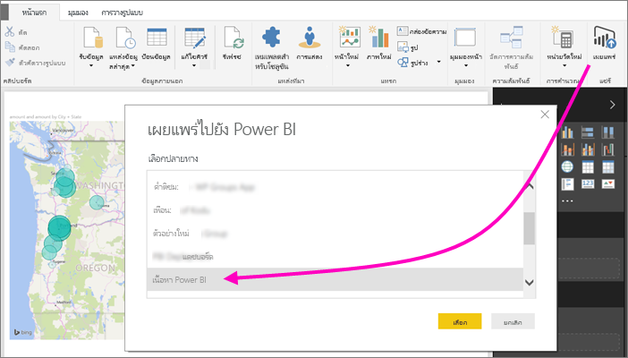
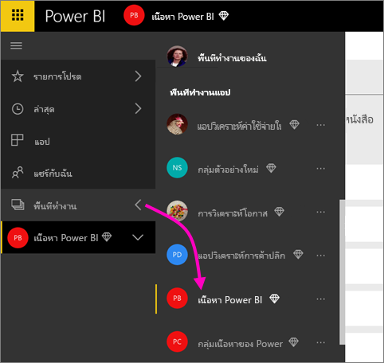
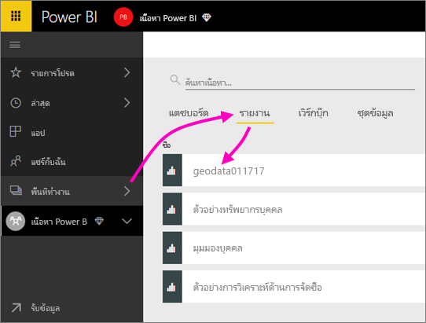
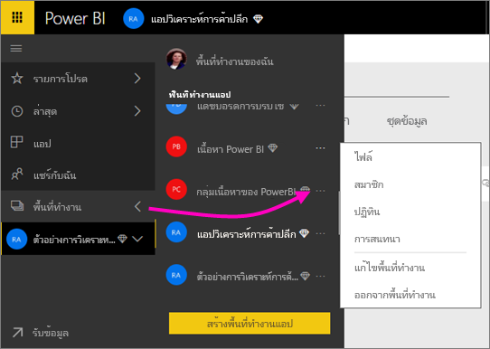
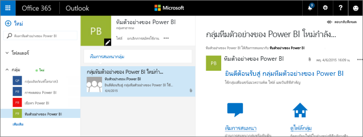
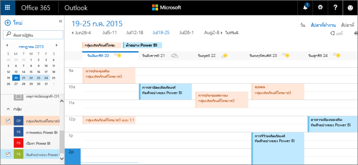

# ร่วมมือทำงานในพื้นที่ทำงานดั้งเดิมCollaborate in a classic workspace
พื้นที่ทำงาน Power BI คือตำแหน่งที่ยอดเยี่ยมเพื่อทำงานร่วมกับเพื่อนร่วมงานของคุณบนแดชบอร์ด รายงาน และชุดข้อมูลเพื่อสร้าง *แอป*Power BI workspaces are great places to collaborate with your colleagues on dashboards, reports, and datasets to create *apps*. บทความนี้เกี่ยวกับพื้นที่ทำงานดั้งเดิมแบบ *ดั้งเดิม*This article is about the original, *classic* workspaces.  

ทำงานร่วมกันไม่ได้จบด้วยพื้นที่ทำงานใน Power BICollaboration doesn’t end with workspaces in Power BI. เมื่อคุณสร้างพื้นที่ทำงานแบบดั้งเดิมหนึ่งรายการใน Power BI คุณจะสร้าง Microsoft 365 Group ในพื้นหลังโดยอัตโนมัติWhen you create one of the classic workspaces in Power BI, you're automatically creating a Microsoft 365 group in the background. Microsoft 365 จะเสนอบริการของกลุ่มอื่น ๆ เช่น การแชร์ไฟล์บน OneDrive for Business, การสนทนาใน Exchange, ปฏิทินและงานที่แชร์ และอื่น ๆMicrosoft 365 offers other group services, such as sharing files on OneDrive for Business, conversations in Exchange, shared calendar and tasks, and so on. อ่านเพิ่มเติมเกี่ยวกับ[กลุ่มใน Microsoft 365](https://support.office.com/article/Create-a-group-in-Office-365-7124dc4c-1de9-40d4-b096-e8add19209e9)Read more about [groups in Microsoft 365](https://support.office.com/article/Create-a-group-in-Office-365-7124dc4c-1de9-40d4-b096-e8add19209e9).

> [!NOTE]
> ประสบการณ์พื้นที่ทำงานใหม่จะเปลี่ยนความสัมพันธ์ระหว่างพื้นที่ทำงาน Power BI และ Microsoft 365 GroupThe new workspace experience changes the relationship between Power BI workspaces and Microsoft 365 groups. เมื่อคุณสร้างพื้นที่ทำงานแบบใหม่หนึ่งรายการใน Power BI คุณจะไม่สร้าง Microsoft 365 Group ในพื้นหลังโดยอัตโนมัติอีกต่อไปWhen you create one of the new workspaces in Power BI, you no longer automatically create a Microsoft 365 group in the background. สำหรับข้อมูลเพิ่มเติม ดู [สร้างพื้นที่ทำงานใหม่ใน Power BI](service-create-the-new-workspaces.md)For more information, see [Create the new workspaces in Power BI](service-create-the-new-workspaces.md).

คุณต้องมี[สิทธิ์การใช้งาน Power BI Pro](../fundamentals/service-features-license-type.md) เพื่อสร้างพื้นที่ทำงานYou need a [Power BI Pro license](../fundamentals/service-features-license-type.md) to create a workspace.

## ทำงานร่วมกันบนไฟล์ Power BI Desktop ในพื้นที่ทำงานCollaborate on Power BI Desktop files in a workspace
หลังจากที่คุณสร้างไฟล์ Power BI Desktop คุณสามารถเผยแพร่ไปยังพื้นที่ทำงาน เพื่อให้ทุกคนในพื้นที่ทำงานของคุณจะสามารถทำงานร่วมกันได้After you create a Power BI Desktop file, you can publish it to a workspace so everyone in the workspace can collaborate on it.

1. ใน Power BI Desktop ให้เลือก **เผยแพร่** บนริบบอน **หน้าแรก** จากนั้นเลือกพื้นที่ทำงานในกล่อง **เลือกปลายทาง**In Power BI Desktop, select **Publish** on the **Home** ribbon, then select the workspace in the **Select a destination** box.
   
    
2. ใน Power BI service เลือกลูกศรที่อยู่ถัดจาก **พื้นที่ทำงาน** > เลือกพื้นที่ทำงานIn the Power BI service, select the arrow next to **Workspaces** > select the workspace.
   
    
3. เลือกแท็บ **รายงาน** จากนั้นเลือกรายงานของคุณSelect the **Reports** tab, then choose your report.
   
    
   
    จากที่นี่ มันเหมือนกับรายงานอื่นๆ ใน Power BIFrom here, it's like any other report in Power BI. คุณและผู้อื่นในพื้นที่ทำงานสามารถปรับเปลี่ยนรายงาน และบันทึกไทล์ไปยังแดชบอร์ดที่คุณเลือกได้You and others in the workspace can modify the report and save tiles to a dashboard of your choosing.

## ทำงานร่วมกันใน Microsoft 365Collaborate in Microsoft 365
การทำงานร่วมกันใน Microsoft 365 เริ่มต้นจากพื้นที่ทำงานแบบดั้งเดิมใน Power BICollaborating in Microsoft 365 starts from the classic workspace in Power BI.

1. ในบริการของ Power BI เลือกลูกศรอยู่ถัดจาก **พื้นที่ทำงาน** > เลือก **ตัวเลือกเพิ่มเติม** (... ) ถัดจากชื่อพื้นที่ทำงานของคุณIn the Power BI service, select the arrow next to **Workspaces** > select **More options** (...) next to your workspace name. 
   
   
2. จากเมนูนี้ คุณสามารถทำงานร่วมกันกับกลุ่มของคุณในสองสามวิธีFrom this menu, you can collaborate with your group in a few ways: 
   
   * มี[กลุ่มการสนทนาใน Microsoft 365](#have-a-group-conversation-in-microsoft-365)Have a [group conversation in Microsoft 365](#have-a-group-conversation-in-microsoft-365).
   * [กำหนดเหตุการณ์](#schedule-an-event-on-the-group-workspace-calendar)บนปฏิทินของพื้นที่ทำงานของกลุ่ม[Schedule an event](#schedule-an-event-on-the-group-workspace-calendar) on the group workspace calendar.
   
   ครั้งแรกที่คุณไปยังพื้นที่ทำงานของกลุ่มคุณใน Microsoft 365 ซึ่งอาจใช้เวลาสักครู่The first time you go to your group workspace in Microsoft 365, it may take some time. รอ 15 ถึง 30 นาที จากนั้นรีเฟรชเบราว์เซอร์ของคุณGive it 15 to 30 minutes, then refresh your browser.

## มีกลุ่มการสนทนาใน Microsoft 365Have a group conversation in Microsoft 365
1. เลือก **ตัวเลือกเพิ่มเติม** (...) ที่อยู่ถัดจากชื่อพื้นที่ทำงานของคุณ\> **การสนทนา**Select **More options** (...) next to your workspace name \> **Conversations**. 
   
    
   
   เว็บไซต์อีเมลและการสนทนาสำหรับพื้นที่ทำงานของกลุ่มคุณเปิดขึ้นใน Outlook for Microsoft 365The email and conversation site for your group workspace opens in Outlook for Microsoft 365.
   
   
2. อ่านเพิ่มเติมเกี่ยวกับ[กลุ่มการสนทนาใน Outlook for Microsoft 365](https://support.office.com/Article/Have-a-group-conversation-a0482e24-a769-4e39-a5ba-a7c56e828b22)Read more about [group conversations in Outlook for Microsoft 365](https://support.office.com/Article/Have-a-group-conversation-a0482e24-a769-4e39-a5ba-a7c56e828b22).

## กำหนดเหตุการณ์บนปฏิทินของพื้นที่ทำงานของกลุ่มSchedule an event on the group workspace calendar
1. เลือก **ตัวเลือกเพิ่มเติม** (...) ที่อยู่ถัดจากชื่อพื้นที่ทำงาน\> **ปฏิทิน**Select **More options** (...) next to the workspace name \> **Calendar**. 
   
   
   
   ปฏิทินสำหรับพื้นที่ทำงานของกลุ่มคุณจะเปิดขึ้นใน Outlook for Microsoft 365The calendar for your group workspace opens in Outlook for Microsoft 365.
   
   
2. อ่านเพิ่มเติมเกี่ยวกับ[กลุ่มปฏิทินใน Outlook ใน Microsoft 365](https://support.office.com/Article/Add-edit-and-subscribe-to-group-events-0cf1ad68-1034-4306-b367-d75e9818376a)Read more about [group calendars in Outlook in Microsoft 365](https://support.office.com/Article/Add-edit-and-subscribe-to-group-events-0cf1ad68-1034-4306-b367-d75e9818376a).

## จัดการพื้นที่ทำงานแบบดั้งเดิมManage a classic workspace
ถ้าคุณเป็นเจ้าของหรือผู้ดูแลระบบของพื้นที่ทำงาน คุณสามารถเพิ่มหรือลบสมาชิกในพื้นที่ทำงานได้If you’re an owner or administrator for a workspace, you can also add or remove workspace members. อ่านเพิ่มเติมเกี่ยวกับ [การจัดการพื้นที่ทำงานของ Power BI](service-manage-app-workspace-in-power-bi-and-office-365.md)Read more about [managing a Power BI workspace](service-manage-app-workspace-in-power-bi-and-office-365.md).

## ขั้นตอนถัดไปNext steps
* [เผยแพร่แอปใน Power BI](service-create-distribute-apps.md)[Publish apps in Power BI](service-create-distribute-apps.md).
* มีคำถามเพิ่มเติมหรือไม่More questions? [ลองไปที่ชุมชน Power BI](https://community.powerbi.com/)[Try the Power BI Community](https://community.powerbi.com/).
* มีคำติชมหรือไม่Feedback? เยี่ยมชม[แนวคิด Power BI](https://ideas.powerbi.com/forums/265200-power-bi)Visit [Power BI Ideas](https://ideas.powerbi.com/forums/265200-power-bi).
