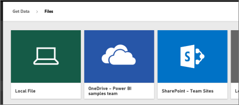
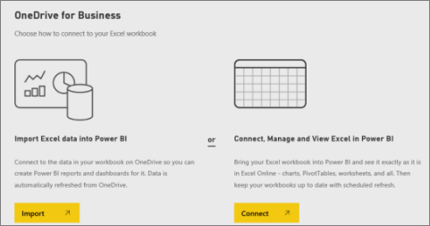
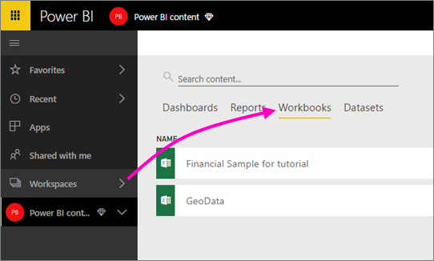

# เชื่อมต่อไปยังไฟล์ที่จัดเก็บไว้ใน OneDrive สำหรับพื้นที่ทำงานของ Power BI ของคุณConnect to files stored in OneDrive for your Power BI workspace
เมื่อคุณ [สร้างพื้นที่ทำงานใน Power BI](service-create-workspaces.md) คุณยังได้สร้าง Microsoft 365 Group ด้วยการเชื่อมโยงกับ OneDrive for BusinessWhen you [create a workspace in Power BI](service-create-workspaces.md), you're also creating a Microsoft 365 group, with an associated OneDrive for Business. บทความนี้อธิบายวิธีการจัดเก็บและอัปเดต Excel, CSV และไฟล์ Power BI Desktop ของคุณบน OneDrive for BusinessThis article explains how to store and update your Excel, CSV, and Power BI Desktop files on that OneDrive for Business. การอัปเดตเหล่านั้นมีผลในรายงาน Power BI และแดชบอร์ดที่ยึดตามไฟล์เหล่านั้นโดยอัตโนมัติThose updates are automatically reflected in the Power BI reports and dashboards based on the files.

> [!NOTE]
> ประสบการณ์พื้นที่ทำงานใหม่จะเปลี่ยนความสัมพันธ์ระหว่างพื้นที่ทำงาน Power BI และ Microsoft 365 GroupThe new workspace experience changes the relationship between Power BI workspaces and Microsoft 365 groups. คุณจะไม่สามารถสร้าง Microsoft 365 Group โดยอัตโนมัติทุกครั้งที่คุณสร้างพื้นที่ทำงานใหม่You don't automatically create a Microsoft 365 group every time you create one of the new workspaces. อ่านเกี่ยวกับ [สร้างพื้นที่ทำงานใหม่](service-create-the-new-workspaces.md)Read about [creating the new workspaces](service-create-the-new-workspaces.md)

การเพิ่มไฟล์ลงในพื้นที่ทำงานของคุณเป็นกระบวนการแบบสองขั้นตอน:Adding files to your workspace is a two-step process: 

1. ก่อนอื่น คุณ[อัปโหลดไฟล์ไปยัง OneDrive for Business](#1-upload-files-to-the-onedrive-for-business-for-your-workspace)สำหรับพื้นที่ทำงานของคุณFirst you [upload files to the OneDrive for Business](#1-upload-files-to-the-onedrive-for-business-for-your-workspace) for your workspace.
2. แล้วคุณ[เชื่อมต่อกับไฟล์เหล่านั้นจาก Power BI](#2-import-excel-files-as-datasets-or-as-excel-online-workbooks)Then you [connect to those files from Power BI](#2-import-excel-files-as-datasets-or-as-excel-online-workbooks).

> [!NOTE]
> พื้นที่ทำงานใช้ได้กับสิทธิ์การใช้งาน [Power BI Pro](../fundamentals/service-features-license-type.md) เท่านั้นWorkspaces are only available with a [Power BI Pro](../fundamentals/service-features-license-type.md) license.
> 

## 1 อัปโหลดไฟล์ไปยัง OneDrive for Business สำหรับพื้นที่ทำงานของคุณ1 Upload files to the OneDrive for Business for your workspace
1. ใน Power BI service เลือกลูกศรอยู่ถัดจากพื้นที่ทำงาน > เลือกจุดไข่ปลา ( **...** ) ถัดจากชื่อพื้นที่ทำงานของคุณIn the Power BI service, select the arrow next to Workspaces > select the ellipsis (**…**) next to your workspace name. 
   
   
2. เลือก **ไฟล์** เพื่อเปิด OneDrive for Business สำหรับพื้นที่ทำงานบน Microsoft 365Select **Files** to open the OneDrive for Business for your workspace on Microsoft 365.
   
   > [!NOTE]
   > ถ้าคุณไม่เห็น **ไฟล์** บนเมนูพื้นที่ทำงาน ให้เลือก **สมาชิก** เพื่อเปิด OneDrive for Business สำหรับพื้นที่ทำงานIf you don't see **Files** on the workspace menu, select **Members** to open the OneDrive for Business for your workspace. ที่นั่น เลือก **ไฟล์**There, select **Files**. Microsoft 365 ตั้งค่าตำแหน่งที่เก็บข้อมูล OneDrive สำหรับไฟล์พื้นที่ทำงานของกลุ่มของแอปของคุณMicrosoft 365 sets up a OneDrive storage location for your app's group workspace files. กระบวนการนี้อาจใช้เวลาสักครู่This process may take some time.
   > 
   > 
3. ที่นี่ คุณสามารถอัปโหลดไฟล์ไปยัง OneDrive for Business สำหรับพื้นที่ทำงานของคุณHere, you can upload your files to the OneDrive for Business for your workspace. เลือก **อัปโหลด** และนำทางไปยังไฟล์ของคุณSelect **Upload**, and navigate to your files.
   
   

## 2 นำเข้าไฟล์ Excel ในฐานะชุดข้อมูลหรือในฐานะสมุดงาน Excel Online2 Import Excel files as datasets or as Excel Online workbooks
เมื่อไฟล์ของคุณอยู่ใน OneDrive for Business สำหรับพื้นที่ทำงาน คุณมีตัวเลือกดังนี้Now that your files are in the OneDrive for Business for your workspace, you have a choice. คุณสามารถ:You can: 

* [นำเข้าข้อมูลจากเวิร์กบุ๊ก Excel เป็นชุดข้อมูล](../connect-data/service-get-data-from-files.md)[Import the data from the Excel workbook as a dataset](../connect-data/service-get-data-from-files.md). จากนั้นใช้ข้อมูลเพื่อสร้างรายงานและแดชบอร์ดที่คุณสามารถดูในเว็บเบราว์เซอร์ และบนอุปกรณ์มือถือThen use the data to build reports and dashboards you can view in a web browser and on mobile devices.
* หรือ[เชื่อมต่อกับเวิร์กบุ๊ก Excel เต็มใน Power BI](../connect-data/service-excel-workbook-files.md)และแสดงไว้เหมือนกับที่จะปรากฏขึ้นใน Excel OnlineOr [connect to a whole Excel workbook in Power BI](../connect-data/service-excel-workbook-files.md) and display it exactly as it appears in Excel Online.

### นำเข้า หรือเชื่อมต่อกับไฟล์ในพื้นที่ทำงานของคุณImport or connect to the files in your workspace
1. ใน Power BI ให้สลับไปยังพื้นที่ทำงาน ดังนั้นชื่อพื้นที่ทำงานจะอยู่ที่มุมบนซ้ายIn Power BI, switch to the workspace, so the workspace name is in the top-left corner. 
2. เลือก **รับข้อมูล** ที่ด้านล่างของบานหน้าต่างนำทางSelect **Get Data** at the bottom of the nav pane. 
   
   
3. ในกล่อง **ไฟล์** เลือก **รับ**In the **Files** box, select **Get**.
   
   
4. เลือก **OneDrive** - *ชื่อพื้นที่ทำงานของคุณ*Select **OneDrive** - *Your Workspace Name*.
   
    
5. เลือกไฟล์คุณต้อง > **เชื่อมต่อ**Select the file you want > **Connect**.
   
    ในจุดนี้คุณตัดสินใจว่า จะ[นำเข้าข้อมูลจากสมุดงาน Excel](../connect-data/service-get-data-from-files.md)หรือ[เชื่อมต่อไปยังเวิร์กบุ๊ก Excel ทั้งหมด](../connect-data/service-excel-workbook-files.md)At this point, you decide whether to [import the data from the Excel workbook](../connect-data/service-get-data-from-files.md), or [connect to the whole Excel workbooks](../connect-data/service-excel-workbook-files.md).
6. เลือก **นำเข้า** หรือ **เชื่อมต่อ**Select **Import** or **Connect**.
   
    
7. ถ้าคุณเลือก **นำเข้า** แล้วเวิร์กบุ๊กปรากฏขึ้นบนแท็บ **ชุดข้อมูล**If you select **Import**, then the workbook appears on the **Datasets** tab. 
   
    
   
    ถ้าคุณเลือก **เชื่อมต่อ** แล้วเวิร์กบุ๊กอยู่บนแท็บ **สมุดงาน**If you select **Connect**, then the workbook is on the **Workbooks** tab.
   
    

## ขั้นตอนถัดไปNext steps
* [สร้างแอปและพื้นที่ทำงานใน Power BICreate apps and workspaces in Power BI](../collaborate-share/service-create-distribute-apps.md)
* [นำเข้าข้อมูลจากเวิร์กบุ๊ก ExcelImport data from Excel workbooks](../connect-data/service-get-data-from-files.md)
* [Connect to whole Excel workbooks](../connect-data/service-excel-workbook-files.md[Connect to whole Excel workbooks](../connect-data/service-excel-workbook-files.md
* มีคำถามเพิ่มเติมหรือไม่More questions? [ลองไปที่ชุมชน Power BITry the Power BI Community](https://community.powerbi.com/)
* มีคำติชมหรือไม่Feedback? เยี่ยมชม[แนวคิด Power BI](https://ideas.powerbi.com/forums/265200-power-bi)Visit [Power BI Ideas](https://ideas.powerbi.com/forums/265200-power-bi)
