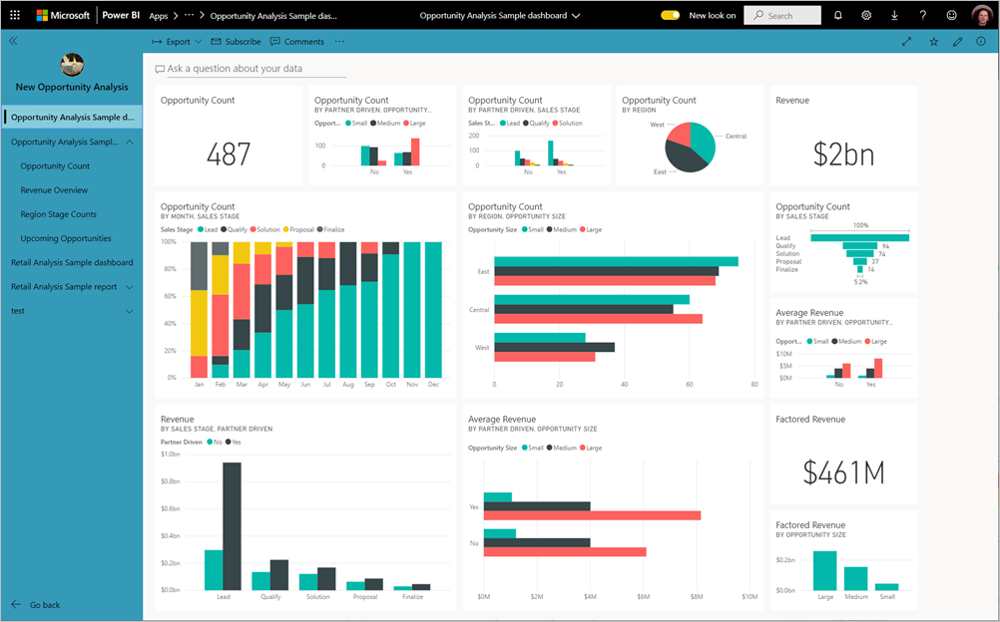
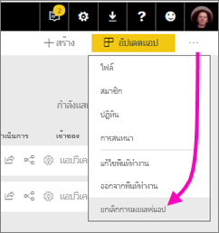

# เผยแพร่แอปใน Power BIPublish an app in Power BI

ใน Power BI คุณสามารถสร้างเนื้อหาที่รวมเป็นแพคเกจอย่างเป็นทางการ จากนั้นแจกจ่ายให้กับผู้รับที่กว้างขวางเป็น *แอป* ได้In Power BI, you can create official packaged content, then distribute it to a broad audience as an *app*. คุณสร้างแอปใน *พื้นที่ทำงาน* ที่ซึ่งคุณสามารถทำงานร่วมกันบนเนื้อหาของ Power BI กับเพื่อนร่วมงานของคุณYou create apps in *workspaces*, where you can collaborate on Power BI content with your colleagues. จากนั้น คุณสามารถเผยแพร่แอปที่เสร็จแล้วไปยังกลุ่มบุคคลขนาดใหญ่ต่างๆ ในองค์กรของคุณThen you can publish the finished apps to large groups of people in your organization. 

ผู้ใช้ทางธุรกิจของคุณจำเป็นต้องมีหลายแดชบอร์ดและรายงาน Power BI เพื่อการบริหารธุรกิจของตนYour business users often need multiple Power BI dashboards and reports to run their business. ด้วยแอป Power BI คุณสามารถสร้างคอลเลกชันของแดชบอร์ดและรายงาน และเผยแพร่คอลเล็กชันเหล่านี้เป็นแอปเหล่านี้ไปยังองค์กรของคุณ หรือไปยังบุคคลหรือกลุ่มที่เฉพาะเจาะจงได้With Power BI apps, you can create collections of dashboards and reports and publish these collections as apps to your whole organization or to specific people or groups. หากคุณเป็นผู้สร้างรายงานหรือผู้ดูแลระบบ แอปจะช่วยให้คุณจัดการสิทธิ์บนคอลเลกชันเหล่านี้ได้ง่ายขึ้นFor you as a report creator or admin, apps make it easier to manage permissions on these collections.

ผู้ใช้ทางธุรกิจจะได้รับแอปของคุณในสองสามวิธีที่แตกต่างกันBusiness users get your apps in a few different ways:

- พวกเขาสามารถค้นหาและติดตั้งแอปจาก Microsoft AppSource ได้They can find and install your app from Microsoft AppSource.
- คุณสามารถส่งลิงก์โดยตรงให้กับพวกเขาได้You can send them a direct link.
- คุณสามารถติดตั้งแอปโดยอัตโนมัติในบัญชี Power BI ของเพื่อนร่วมงานของคุณถ้าผู้ดูแลระบบ Power BI ของคุณให้สิทธิ์คุณYou can install it automatically in your coworkers' Power BI accounts if your Power BI administrator gives you permission.
- Power BI จะไม่ส่งอีเมลไปยังผู้ใช้ภายในเมื่อคุณเผยแพร่หรืออัปเดตแอปPower BI does not send any email to internal users when you distribute or update an app. ถ้าคุณเผยแพร่ไปยังผู้ใช้ภายนอก ผู้ใช้เหล่านั้นจะได้รับอีเมลที่มีลิงก์โดยตรงIf you distribute it to external users, those users receive an email with a direct link. 

คุณสามารถสร้างแอปที่มีการนำทางภายในตัว เพื่อให้ผู้ใช้ของคุณสามารถค้นหาวิธีการใช้เนื้อหาของคุณได้อย่างง่ายดายYou can create the app with its own built-in navigation, so your users can easily find their way around your content. พวกเขาไม่สามารถปรับเปลี่ยนเนื้อหาของแอปได้They can't modify the contents of the app. พวกเขาสามารถโต้ตอบกับเนื้อหาของแอปในบริการ Power BI หรือในแอปสำหรับอุปกรณ์เคลื่อนที่- – ด้วยการกรอง เน้น และเรียงลำดับข้อมูลด้วยตนเองThey can interact with it either in the Power BI service, or one of the mobile apps -– filtering, highlighting, and sorting the data themselves. พวกเขาจะได้รับอัปเดตโดยอัตโนมัติ และคุณสามารถควบคุมความถี่ในการรีเฟรชข้อมูลได้They get updates automatically and you can control how frequently the data refreshes. คุณยังสามารถให้สิทธิ์การสร้างเพื่อเชื่อมต่อกับชุดข้อมูลพื้นฐานและสร้างสำเนาของรายงานในแอปได้You can also give them Build permission to connect to the underlying datasets, and to create copies of the reports in the app. อ่านเพิ่มเติมเกี่ยวกับ[สิทธิในการสร้าง](../connect-data/service-datasets-build-permissions.md)Read more about the [Build permission](../connect-data/service-datasets-build-permissions.md).

## สิทธิ์การใช้งานสำหรับแอปฯLicenses for apps
คุณต้องมีสิทธิการใช้งาน Power BI Pro เพื่อสร้างหรืออัปเดตแอปTo create or update an app, you need a Power BI Pro license. สำหรับ *ผู้ใช้แอป* มีสองตัวเลือกFor app *consumers*, there are two options.

* **ตัวเลือก 1** พื้นที่ใช้งานสำหรับแอปนี้ *ไม่* อยู่ใน Power BI ความจุระดับพรีเมียม: ผู้ใช้ทางธุรกิจทุกคนต้องมีใบอนุญาต Power BI Pro เพื่อดูแอปของคุณ**Option 1** The workspace for this app is *not* in a Power BI Premium capacity: All business users need Power BI Pro licenses to view your app. 
* **ตัวเลือก 2** พื้นที่ใช้งานสำหรับแอปนี้ *อยู่* ใน Power BI ความจุระดับพรีเมียม: ผู้ใช้ทางธุรกิจที่ไม่มีใบอนุญาต Power BI Pro ในองค์กรของคุณสามารถดูเนื้อหาแอปได้**Option 2** The workspace for this app *is* in a Power BI Premium capacity: Business users without Power BI Pro licenses in your organization can view app content. อย่างไรก็ตาม พวกเขาไม่สามารถทำสำเนารายงาน หรือสร้างรายงานที่ยึดตามชุดข้อมูลพื้นฐานได้However, they can't copy the reports, or create reports based on the underlying datasets. อ่าน[Power BI Premium คืออะไร](../admin/service-premium-what-is.md)สำหรับรายละเอียดRead [What is Power BI Premium?](../admin/service-premium-what-is.md) for details.

## เผยแพร่แอปฯของคุณPublish your app
เมื่อแดชบอร์ดและรายงานในพื้นที่ทำงานของคุณพร้อม คุณสามารถเลือกแดชบอร์ดและรายงานที่คุณต้องการเผยแพร่ แล้วเผยแพร่สิ่งดังกล่าวในฐานะเป็นแอปหนึ่งWhen the dashboards and reports in your workspace are ready, you choose which dashboards and reports you want to publish, then you publish them as an app. 

1. ในมุมมองรายการพื้นที่ทำงาน ตัดสินใจเลือกแดชบอร์ดและรายงานที่คุณต้องการให้ **รวมอยู่ในแอป**In the workspace list view, decide which dashboards and reports you want  **Included in app**.

    

    ถ้าคุณเลือกที่จะไม่รวมรายงานที่มีแดชบอร์ดที่เกี่ยวข้อง คุณจะเห็นคำเตือนถัดจากรายงานIf you choose not to include a report that has a related dashboard, you see a warning next to the report. คุณยังสามารถเผยแพร่แอปนั้นได้ แต่แดชบอร์ดที่เกี่ยวข้องจะไม่มีไทล์จากรายงานนั้นYou can still publish the app, but the related dashboard won't have the tiles from that report.

    

2. เลือกปุ่ม **เผยแพร่แอป** ที่มุมบนขวาเพื่อเริ่มกระบวนการของการสร้างและเผยแพร่แอปจากพื้นที่ทำงานนั้นSelect the **Publish app** button in the upper right to start the process of creating and publishing an app from the workspace.
   
    

3. บน **การตั้งค่า** กรอกข้อมูลชื่อและคำอธิบายเพื่อช่วยให้ผู้คนค้นพบแอปOn **Setup**, fill in the name and description to help people find the app. คุณสามารถตั้งค่าสีธีมเพื่อปรับแต่งYou can set a theme color to personalize it. คุณยังสามารถเพิ่มลิงก์ไปยังไซต์ฝ่ายสนับสนุนYou can also add a link to a support site.
   
    

4. บน **การนำทาง** คุณเลือกเนื้อหาเผยแพร่เป็นส่วนหนึ่งของแอปOn **Navigation**, you select the content to be published as part of the app. จากนั้นคุณสามารถเพิ่มการนำทางของแอปเพื่อจัดระเบียบเนื้อหาในส่วนต่าง ๆThen you add app navigation, to organize the content in sections. ดู[ออกแบบประสบการณ์การนำทางสำหรับแอปของคุณ](#design-the-navigation-experience)ในบทความนี้สำหรับรายละเอียดSee [Design the navigation experience for your app](#design-the-navigation-experience) in this article for details.
   
    

5. บน **สิทธิ** ตัดสินใจว่าใครสามารถเข้าถึงแอป และสิ่งที่พวกเขาสามารถทำได้ในแอปOn **Permissions**, decide who has access to the app, and what they can do with it. 

    - ใน[พื้นที่ทำงานแบบคลาสสิก](service-create-workspaces.md): ทุกคนในองค์กรของคุณ บุคคลที่เฉพาะเจาะจง หรือกลุ่มความปลอดภัยของ Azure Active Directory (Azure AD)In [classic workspaces](service-create-workspaces.md): everyone in your organization, specific people, or Azure Active Directory (Azure AD) security groups.
    - ใน[พื้นที่ทำงานประสบการณ์ใหม่](service-create-the-new-workspaces.md): บุคคลที่เฉพาะเจาะจง กลุ่มความปลอดภัย Azure AD และรายการการแจกจ่าย และ Microsoft 365 GroupIn the [new experience workspaces](service-create-the-new-workspaces.md): specific people, Azure AD security groups and distribution lists, and Microsoft 365 Groups. ผู้ใช้พื้นที่ทำงานทั้งหมดจะมีสิทธิ์การเข้าถึงแอปสำหรับพื้นที่ทำงานโดยอัตโนมัติAll workspace users are automatically given access to the app for the workspace.
    - คุณสามารถอนุญาตให้ผู้ใช้แอปเชื่อมต่อกับชุดข้อมูลเบื้องต้นของแอปโดยให้สิทธิ์การสร้างแก่พวกเขาYou can allow app users to connect to the app's underlying datasets by giving them Build permission. พวกเขาจะเห็นชุดข้อมูลเหล่านี้เมื่อพวกเขากำลังค้นหาชุดข้อมูลที่แชร์อยู่They'll see these datasets when they're searching for shared datasets. อ่านเพิ่มเติมเกี่ยวกับ [การอนุญาตให้ผู้ใช้เชื่อมต่อกับชุดข้อมูลของแอป](#allow-users-to-connect-to-datasets) ในบทความนี้Read more about [allowing users to connect to the app's datasets](#allow-users-to-connect-to-datasets), in this article.
    - ผู้ใช้ที่มีสิทธิ์การสร้างสามารถมีสิทธิ์ในการทำสำเนารายงานจากแอปนี้ไปยังพื้นที่ทำงานอื่นด้วยUsers with Build permission can also have permission to copy reports from this app to another workspace. อ่านเพิ่มเติมเกี่ยวกับ [การอนุญาตให้ผู้ใช้ทำสำเนารายงานในแอป](#allow-users-to-copy-reports) ในบทความนี้Read more about [allowing users to copy reports in the app](#allow-users-to-copy-reports), in this article.
    
    >[!IMPORTANT]
    >ถ้าแอปของคุณใช้ชุดข้อมูลจากพื้นที่ทำงานอื่น ถือเป็นความรับผิดชอบของคุณในการตรวจสอบให้แน่ใจว่า ผู้ใช้แอปทั้งหมดมีสิทธิ์เข้าถึงชุดข้อมูลเบื้องต้นได้If your app relies on datasets from other workspaces, it is your responsibility to ensure all app users have access to the underlying datasets.
    >หากแอปหรือรายงานอยู่ในพื้นที่ทำงานเดียวกันกับชุดข้อมูล ตรวจสอบให้แน่ใจว่าคุณได้เพิ่มรายงานที่เกี่ยวข้องกับชุดข้อมูลไปยังแอปด้วยIf the app or report are in the same workspace as the dataset, make sure you add the report associated with the  dataset to the app as well.

6. คุณสามารถติดตั้งแอปโดยอัตโนมัติสำหรับผู้รับ ถ้าผู้ดูแลระบบ Power BI ของคุณเปิดใช้งานการตั้งค่านี้สำหรับคุณในพอร์ทัลผู้ดูแลระบบ Power BIYou can install the app automatically for the recipients, if your Power BI admin has enabled this setting for you in the Power BI Admin Portal. อ่านเพิ่มเติมเกี่ยวกับ[การติดตั้งแอปโดยอัตโนมัติ](#automatically-install-apps-for-end-users)ในบทความนี้Read more about [automatically installing an app](#automatically-install-apps-for-end-users) in this article.

    

7. เมื่อคุณเลือก **เผยแพร่แอป** คุณจะเห็นข้อความยืนยันว่าแอปพร้อมสำหรับการเผยแพร่แล้วWhen you select **Publish app**, you see a message confirming it's ready to publish. ในกล่องโต้ตอบ **แชร์แอปนี้** คุณสามารถคัดลอก URL ที่เป็นลิงก์โดยตรงกับแอปนี้ได้In the **Share this app** dialog box, you can copy the URL that's a direct link to this app.
   
    

คุณสามารถส่งลิงก์โดยตรงไปยังผู้ที่คุณต้องการแชร์ด้วย หรือพวกเขาสามารถค้นหาแอปของคุณจากแท็บ Apps โดยไปที่ **ดาวน์โหลด และสำรวจแอปเพิ่มเติมจาก AppSource**You can send that direct link to the people you've shared it with, or they can find your app on the Apps tab by going to **Download and explore more apps from AppSource**. อ่านเพิ่มเติมเกี่ยวกับการ[ประสบการณ์การใช้งานแอปฯสำหรับผู้ใช้ทางธุรกิจ](../consumer/end-user-apps.md)Read more about the [app experience for business users](../consumer/end-user-apps.md).

## เปลี่ยนแอปฯที่คุณเผยแพร่Change your published app
หลังจากที่คุณเผยแพร่แอปฯ คุณอาจต้องการเปลี่ยนแปลงหรือปรับปรุงแอปฯนั้นAfter you publish your app, you may want to change or update it. การอัปเดตเป็นเรื่องง่ายถ้าคุณเป็นผู้ดูแลระบบหรือเป็นสมาชิกในพื้นที่ทำงานใหม่It's easy to update it if you're an admin or member in the new workspace. 

1. เปิดพื้นที่ทำงานที่สอดคล้องกับแอปฯดังกล่าวOpen the workspace that corresponds to the app. 
   
    

2. ทำการเปลี่ยนแปลงที่คุณต้องการในแดชบอร์ดหรือรายงานMake any changes you want to the dashboards or reports.
 
    พื้นที่ทำงานป็นพื้นที่ที่คุณจัดเตรียมข้อมูล ดังนั้นการเปลี่ยนแปลงของคุณจะไม่อยู่ในแอปจนกว่าคุณเผยแพร่อีกครั้งThe workspace is your staging area, so your changes aren't live in the app until you publish again. ซึ่งนี่ช่วยให้คุณทำการเปลี่ยนแปลงได้โดยไม่กระทบต่อแอปฯที่เผยแพร่แล้วThis lets you make changes without affecting the published apps.  
 
    > [!IMPORTANT]
    > หากคุณลบรายงานและอัปเดตแอปแม้ว่าคุณจะเพิ่มรายงานกลับไปที่แอป ผู้ใช้แอปของคุณจะไม่สามารถแก้ไข/ปรับปรุงตามคำสั่งทั้งหมดได้เช่น บุ๊กมาร์ก ความคิดเห็น ฯลฯIf you remove a report and update the app, even if you add the report back to the app, your app consumers lose all customizations such as bookmarks, comments, etc.  
 
3. ย้อนกลับไปยังรายการพื้นที่ทำงานของเนื้อหาและเลือก **อัปเดตแอป** ในมุมบนขวาGo back to the workspace list of contents and select **Update app** in the upper-right corner.
   
1. อัปเดต **ตั้งค่า** **การนำทาง** และ **สิทธิ** ถ้าคุณจำเป็นต้องทำ จากนั้นเลือก **อัปเดตแอป**Update **Setup**, **Navigation**, and **Permissions**, if you need to, then select **Update app**.
   
บุคคลที่คุณได้เผยแพร่แอปฯด้วยนั้นจะเห็นแอปฯเวอร์ชั่นที่อัปเดตโดยอัตโนมัติThe people you've published the app to automatically see the updated version of the app. 

## ออกแบบประสบการณ์การนำทางDesign the navigation experience
ตัวเลือก **ตัวสร้างการนำทางใหม่** ช่วยให้คุณสามารถสร้างการนำทางแบบกำหนดเองสำหรับแอปของคุณThe **New navigation builder** option allows you to build a custom navigation for your app. การนำทางแบบกำหนดเองทำให้ง่ายขึ้นสำหรับผู้ใช้ในการค้นหาและใช้เนื้อหาในแอปThe custom navigation makes it easier for your users to find and use content in the app. แอปที่มีอยู่มีการปิดใช้งานตัวเลือกนี้และแอปใหม่จะถูกเปิดใช้งานโดยค่าเริ่มต้นExisting apps have this option turned off and new apps default to the option being on.

เมื่อปิดตัวเลือกอยู่ คุณสามารถเลือก **หน้าเริ่มต้นของแอป** เพื่อเป็น **เนื้อหาที่เฉพาะเจาะจง** เช่น แดชบอร์ดหรือรายงาน หรือเลือก **ไม่มี** เพื่อแสดงรายการพื้นฐานของเนื้อหาสำหรับผู้ใช้When the option is off, you can select the **App landing page** to be either **Specific content**, for example a dashboard or report, or select **None** to show a basic list of content to the user.

เมื่อคุณเปิดใช้งาน **ตัวสร้างการนำทางใหม่** คุณสามารถออกแบบการนำทางแบบกำหนดเองได้When you turn on **New navigation builder**, you can design a custom navigation. ตามค่าเริ่มต้น รายงาน แดชบอร์ด และสมุดงาน Excel ทั้งหมดที่คุณใส่ไว้ในแอปจะแสดงรายการเป็นรายการแบบแฟลตBy default all the reports, dashboards, and Excel workbooks you included in your app are listed as a flat list. 

คุณสามารถแก้ไข/ปรับปรุงการนำทางแอปเพิ่มเติมได้โดย:You can further customize the app navigation by:

* การจัดเรียงรายการใหม่โดยใช้ลูกศรขึ้น/ลงReordering the items using the up / down arrows. 
* การเปลี่ยนชื่อรายการใน **รายละเอียดรายงาน** **รายละเอียดแดชบอร์ด** และ **รายละเอียดสมุดงาน**Renaming items in the **Report details**, **Dashboard details**, and **Workbook details**.
* การซ่อนรายการบางอย่างจากการนำทางHiding certain items from the navigation.
* การใช้ตัวเลือก **ใหม่** เพื่อเพิ่ม **หัวข้อ** ในกลุ่มเนื้อหาที่เกี่ยวข้องUsing the **New** option to add **sections** to group related content.
* การใช้ตัวเลือก **ใหม่** เพื่อเพิ่ม **ลิงก์** ไปยังทรัพยากรภายนอกสำหรับบานหน้าต่างนำทางUsing the **New** option to add a **link** to an external resource to the nav pane. 

เมื่อคุณเพิ่ม **ลิงก์** ใน **รายละเอียดลิงก์** คุณสามารถเลือกที่จะเปิดลิงก์When you add a **link**, in **Link details** you can choose where the link opens. ตามค่าเริ่มต้น ลิงก์จะเปิดใน **แท็บปัจจุบัน** แต่คุณสามารถเลือก **แท็บใหม่** หรือ **พื้นที่เนื้อหา**By default links open in the **Current tab**, but you can select **New tab**, or **Content area**. 

### ข้อควรพิจารณาสำหรับการใช้ตัวเลือกตัวสร้างการนำทางใหม่Considerations for using the new navigation builder option
ต่อไปนี้เป็นข้อมูลทั่วไปที่ควรทราบเมื่อใช้ตัวสร้างการนำทางใหม่:Here are general things to keep in mind when using the new navigation builder:

* หน้ารายงานจะแสดงในพื้นที่การนำทางแอปเป็นส่วนที่ขยายได้Report pages are shown in the app navigation area as an expandable section. เมื่อรายงานมีหน้าที่มองเห็นได้จำนวนหนึ่งหน้า ระบบจะแสดงเฉพาะชื่อรายงานเท่านั้นWhen a report has one visible page, only the report name is shown. การคลิกที่ชื่อรายงานในการนำทาง จะเปิดหน้าแรกของรายงานClicking the report name in the navigation opens the first page of the report. 

    > [!NOTE]
    > รายงานของคุณอาจมีหน้าที่มองเห็นได้เพียงหน้าเดียว เนื่องจากคุณได้ตั้งค่าการนำทางไปยังหน้าที่เหลือ โดยใช้ปุ่มหรือการดำเนินการเข้าถึงรายละเอียดYour report might have only one visible page because you've set up navigation to the rest of the pages with buttons or drillthrough actions.

* หากคุณปิดตัวสร้างการนำทางใหม่ แล้วเผยแพร่หรืออัปเดตแอปของคุณ การแก้ไข/ปรับปรุงตามคำสั่งที่คุณกำหนดไว้จะหายไปIf you turn off the new navigation builder and then publish or update your app, you lose the customizations you've made. ตัวอย่างเช่น หัวข้อ การจัดลำดับ ลิงก์ และชื่อที่กำหนดเองสำหรับรายการการนำทางจะหายไปทั้งหมดFor example, sections, ordering, links, and custom names for navigation items are all lost.
* ตัวเลือกที่ไม่ใช้ตัวสร้างแอปจะพร้อมใช้งานThe option to not use the app builder is available.

เมื่อต้องการเพิ่มลิงก์ในการนำทางแอปและการเลือกตัวเลือกพื้นที่เนื้อหา:When adding links to your app navigation and selecting the Content area option:
* ให้แน่ใจว่าสามารถฝังลิงก์ได้Ensure the link can be embedded. บริการบางอย่างจะบล็อกการฝังเนื้อหาของตนในไซต์ของบริษัทอื่นเช่น Power BISome services block the embedding of their content in third-party sites like Power BI.
* การฝังเนื้อหาบริการของ Power BI เช่น รายงานหรือแดชบอร์ดในพื้นที่ทำงานอื่น ๆ ไม่ได้รับการสนับสนุนEmbedding Power BI service content like reports or dashboards in other workspaces isn't supported. 
* ฝังเนื้อหาเซิร์ฟเวอร์รายงาน Power BI ผ่านเนื้อหา URL แบบฝังอันเดิมจากการปรับใช้งานภายในองค์กรEmbed Power BI Report Server content through its native embed URL content from an on premises deployment. ใช้ขั้นตอนใน[การสร้าง URL ของเซิร์ฟเวอร์รายงาน Power BI](../report-server/quickstart-embed.md#create-the-power-bi-report-url) เพื่อรับ URLUse the steps in [creating the Power BI Report Server URL](../report-server/quickstart-embed.md#create-the-power-bi-report-url) to get the URL. โปรดทราบว่ามีการใช้กฎการตรวจสอบความถูกต้องตามปกติ ดังนั้นการดูเนื้อหาต้องใช้การเชื่อมต่อ VPN กับเซิร์ฟเวอร์ภายในองค์กรBe aware that regular authentication rules apply, so viewing the content requires a VPN connection to the on-premises server. 
* คำเตือนด้านความปลอดภัยจะปรากฏที่ด้านบนของเนื้อหาแบบฝังตัวเพื่อระบุว่าเนื้อหาไม่ได้อยู่ใน Power BIA security warning is shown at the top of the embedded content to indicate the content isn't in Power BI.

## ติดตั้งแอปฯโดยอัตโนมัติสำหรับผู้ใช้ปลายทางAutomatically install apps for end users
ถ้าผู้ดูแลระบบมอบสิทธิให้คุณ คุณสามารถติดตั้งแอปโดยอัตโนมัติ *ซึ่งเป็นการส่ง* แอปไปยังผู้ใช้ปลายทางIf an admin gives you permissions, you can install apps automatically, *pushing* them to end users. ฟังก์ชันพุชนี้ทำให้ง่ายต่อการแจกจ่ายแอปเหมาะสมไปยังบุคคลหรือกลุ่มที่เหมาะสมThis push functionality makes it easier to distribute the right apps to the right people or groups. แอปของคุณจะปรากฏขึ้นโดยอัตโนมัติในรายการเนื้อหาแอปของผู้ใช้ปลายทางYour app appears automatically in your end users' Apps content list. พวกเขาไม่จำเป็นต้องค้นหาแอปจาก Microsoft AppSource หรือทำตามลิงก์การติดตั้งThey don't have to find it from Microsoft AppSource or follow an installation link. ดูวิธีที่ผู้ดูแลระบบเปิดใช้งาน[การส่งแอปไปยังผู้ใช้ปลายทาง](../admin/service-admin-portal.md#push-apps-to-end-users)ในบทความพอร์ทัลผู้ดูแลระบบของ Power BISee how admins enable [pushing apps to end users](../admin/service-admin-portal.md#push-apps-to-end-users) in the Power BI admin portal article.

### วิธีการส่งแอปไปยังผู้ใช้ปลายทางโดยอัตโนมัติHow to push an app automatically to end users
เมื่อผู้ดูแลระบบได้กำหนดให้สิทธิ์ใช้งานแก่คุณ คุณมีทางเลือกใหม่ที่จะ **ติดตั้งแอปโดยอัตโนมัติ**Once the admin has assigned you permissions, you have a new option to **install the app automatically**. เมื่อคุณทำเครื่องหมายที่กล่อง และเลือก **เผยแพร่แอป** (หรือ **อัปเดตแอป**), แอปจะถูกส่งไปยังผู้ใช้ทั้งหมด หรือกลุ่มที่กำหนดไว้ในหัวข้อ **สิทธิใช้งาน** ของแอปบนแท็บ **เข้าถึง**When you check the box and select **Publish app** (or **Update app**), the app is pushed to all users or groups defined in the **Permissions** section of the app on the **Access** tab.

### วิธีที่ผู้ใช้รับแอปซึ่งคุณส่งไปให้พวกเขาHow users get the apps that you push to them
หลังจากที่คุณส่งแอปไปแล้ว แอปดังกล่าวจะแสดงอยู่ในรายการแอปโดยอัตโนมัติAfter you push an app, it shows up in their Apps list automatically. ด้วยวิธีนี้ คุณสามารถดูแลจัดการแอปที่ผู้ใช้หรือบทบาทของงานในองค์กรของคุณจำเป็นต้องมีIn this way, you can curate the apps that specific users or job roles in your organization need to have at their fingertips.

### ข้อควรพิจารณาสำหรับการติดตั้งแอปฯโดยอัตโนมัติConsiderations for automatically installing apps
นี่คือสิ่งที่ควรทราบเมื่อส่งแอปให้กับผู้ใช้ปลายทาง:Here are things to keep in mind when pushing apps to end users:

* การติดตั้งแอปฯโดยอัตโนมัติสำหรับผู้ใช้อาจต้องใช้เวลาInstalling an app automatically to users can take time. แอปส่วนใหญ่จะติดตั้งทันทีสำหรับผู้ใช้ แต่การส่งแอปอาจใช้เวลาMost apps install immediately for users, but pushing apps can take time.  ซึ่งขึ้นอยู่กับจำนวนของรายการในแอปฯและจำนวนของบุคคลที่สามารถเข้าถึงได้It depends on the number of items in the app and the number of people given access. เราขอแนะนำให้ส่งแอปฯในช่วงนอกเวลาใช้งานและส่งแอปฯให้มีระยะเวลาห่างก่อนใช้งานมากพอสมควรWe recommend pushing apps during off hours with plenty of time before users need them. ตรวจสอบกับผู้ใช้หลายรายก่อนที่จะสื่อสารเกี่ยวกับความพร้อมใช้งานแอปฯไปยังผู้ใช้จำนวนมากVerify with several users before sending broad communication about the apps' availability.

* รีเฟรชเบราว์เซอร์Refresh the browser. ก่อนที่จะเห็นแอปฯที่ส่งไปในรายการ Apps ผู้ใช้อาจจำเป็นต้องรีเฟรช หรือปิดและเปิดเบราว์เซอร์ของตนอีกครั้งBefore seeing the pushed app in the Apps list, the user may need to refresh, or close and reopen their browser.

* หากผู้ใช้ไม่เห็นแอปในรายการแอปโดยทันที ผู้ใช้ควรรีเฟรช หรือปิดและเปิดเบราว์เซอร์ของตนอีกครั้งIf users don't immediately see the app in the Apps list, they should refresh or close and reopen their browser.

* พยายามอย่าส่งแอปฯมากเกินไปTry not to overwhelm users. ระมัดระวังไม่ให้มีการส่งแอปมากเกินไป เพื่อให้ผู้ใช้ของคุณรู้สึกว่าแอปที่ติดตั้งไว้ล่วงหน้าจะมีประโยชน์กับพวกเขาBe careful not to push too many apps so your users perceive the pre-installed apps are useful to them. เป็นเรื่องดีที่คุณควรควบคุมว่าใครสามารถส่งแอปฯ ให้กับผู้ใช้ปลายทางได้ เพื่อให้เหมาะสมกับกำหนดเวลาIt's best to control who can push apps to end users to coordinate timing. กำหนดผู้ติดต่อสำหรับการรับแอปในองค์กรของคุณที่ส่งไปยังผู้ใช้ปลายทางได้Establish a point of contact for getting apps in your organization pushed to end users.

* ผู้ใช้ที่เป็นผู้เยี่ยมชมที่ไม่ยอมรับคำเชิญจะไม่ได้รับแอปที่ติดตั้งโดยอัตโนมัติสำหรับพวกเขาGuest users who haven't accepted an invite don't get apps automatically installed for them.  

## อนุญาตให้ผู้ใช้สามารถเชื่อมต่อกับชุดข้อมูลAllow users to connect to datasets

เมื่อคุณเลือกตัวเลือก **อนุญาตให้ผู้ใช้เชื่อมต่อกับชุดข้อมูลพื้นฐานของแอป** คุณจะให้ *สิทธิ์การสร้าง* ชุดข้อมูลเหล่านั้นกับผู้ใช้แอปWhen you check the option to **Allow users to connect to the app's underlying datasets**, you're giving app users *Build permission* on those datasets. ด้วยสิทธิ์นี้ พวกเขาสามารถดำเนินการสำคัญหลายอย่างได้:With this permission, they can do several key actions:

- [ใช้ชุดข้อมูลของแอป](../connect-data/service-datasets-across-workspaces.md)เพื่อเป็นข้อมูลพื้นฐานสำหรับรายงานของพวกเขา[Use the app datasets](../connect-data/service-datasets-across-workspaces.md) as the basis for their reports.
- ค้นหาชุดข้อมูลเหล่านี้ใน Power BI Desktop และในประสบการณ์รับข้อมูลในบริการของ Power BISearch for these datasets in Power BI Desktop and in the get-data experience in the Power BI service.
- สร้างรายงานและแดชบอร์ดที่ยึดตามชุดข้อมูลเหล่านี้Create reports and dashboards based on these datasets.

เมื่อคุณล้างตัวเลือกนี้ ผู้ใช้ใหม่ที่คุณเพิ่มในแอปจะไม่ได้รับสิทธิ์การสร้างWhen you clear this option, new users you add to the app don't get Build permission. อย่างไรก็ตาม สำหรับผู้ใช้แอปที่มีอยู่ สิทธิ์ในชุดข้อมูลพื้นฐานจะไม่เปลี่ยนแปลงHowever, for existing app users, permissions on the underlying datasets don't change. คุณสามารถลบสิทธิ์ในการสร้างออกจากผู้ใช้แอปที่ไม่ควรได้รับด้วยตัวคุณเองได้You can remove Build permission manually from app users who should no longer have it. อ่านเพิ่มเติมเกี่ยวกับ[สิทธิในการสร้าง](../connect-data/service-datasets-build-permissions.md)Read more about the [Build permission](../connect-data/service-datasets-build-permissions.md).

## อนุญาตให้ผู้ใช้ทำสำเนารายงานAllow users to copy reports

เมื่อคุณเลือกตัวเลือก **อนุญาตให้ผู้ใช้ทำสำเนารายงานในแอปนี้** หมายความว่าผู้ใช้ของคุณสามารถบันทึกรายงานใดก็ตามในแอปไปยังพื้นที่ทำงานของฉัน หรือพื้นที่ทำงานอื่นWhen you check the option to **Allow users to make a copy of the reports in this app**, your users can save any of the reports in the app to their My Workspace or another workspace. เมื่อต้องการทำสำเนา ผู้ใช้ต้องมีสิทธิ์การใช้งานระดับ Pro แม้ว่ารายงานต้นฉบับจะอยู่ในพื้นที่ทำงานในความจุพรีเมียมก็ตามTo make a copy, users need a Pro license, even if the original report is in a workspace in a Premium capacity. พวกเขาสามารถกำหนดรายงานตามความต้องการเฉพาะของตนได้They can then customize the reports to their unique needs. คุณจะต้องเลือกตัวเลือก **อนุญาตให้ผู้ใช้ทุกคนเชื่อมต่อกับชุดข้อมูลพื้นฐานของแอปโดยใช้สิทธิ์การสร้าง** ก่อนYou have to select the **Allow all users to connect to the app's underlying datasets using Build permission** option first. ด้วยการเลือกตัวเลือกเหล่านี้ คุณกำลังเปิดใช้งานความสามารถ [ทำสำเนารายงานใหม่จากพื้นที่ทำงานอื่น](../connect-data/service-datasets-copy-reports.md)By selecting these options, you're enabling the new [copy reports from other workspaces](../connect-data/service-datasets-copy-reports.md) capability.

## ยกเลิกการเผยแพร่แอปฯUnpublish an app
สมาชิกของพื้นที่ทำงานสามารถยกเลิกการเผยแพร่แอปได้Any member of a workspace can unpublish the app.

>[!IMPORTANT]
>เมื่อคุณยกเลิกการประกาศแอป ผู้ใช้แอปจะสูญเสียการเลือกกำหนดเองของพวกเขาWhen you unpublish an app, app users lose their customizations. ที่คั่นหน้าส่วนบุคคล ข้อคิดเห็น หรือการสมัครใช้งานใดๆ ที่เกี่ยวข้องกับเนื้อหาในแอปจะสูญหายThey lose any personal bookmarks, comments, or subscriptions associated with content in the app. โปรดยกเลิกการประกาศแอปหากต้องการลบออกเท่านั้นOnly unpublish an app if you need to remove it.
> 

* ในพื้นที่ทำงาน เลือกจุดไข่ปลา ( **...** ) ที่มุมขวาบน > **ยกเลิกการเผยแพร่แอปฯ**In a workspace, select the ellipsis (**...**) in the upper-right corner > **Unpublish app**.
  
    

การดำเนินการนี้จะถอนการติดตั้งแอปฯสำหรับทุกคนที่คุณได้เผยแพร่ไป และบุคคลเหล่านี้จะไม่สามารถเข้าถึงแอปฯได้อีกต่อไปThis action uninstalls the app for everyone you've published it to, and they no longer have access to it. ขั้นตอนนี้จะไม่ลบพื้นที่ทำงานหรือเนื้อหาIt doesn't delete the workspace or its contents.

## ดูแอปที่เผยแพร่View your published app

เมื่อผู้ใช้แอปเปิดแอปของคุณ พวกเขาเห็นการนำทางที่คุณสร้างขึ้น แทนบานหน้าต่างนำทางของ Power BI มาตรฐานWhen your app consumers open your app, they see the navigation you created, instead of the standard Power BI nav pane. การนำทางของแอปจะแสดงรายการรายงานและแดชบอร์ดในส่วนที่คุณกำหนดไว้The app navigation lists the reports and dashboards in the sections you've defined. นอกจากนี้ยังแสดงรายการแต่ละหน้าในแต่ละรายงานแทนที่ชื่อรายงานIt also lists the individual pages in each report, rather that just the report name. คุณสามารถขยายและยุบการนำทางด้านซ้ายได้โดยใช้ลูกศรในแถบเมนูYou can expand and collapse the left navigation by using the arrows in the menu bar.

ในโหมดเต็มหน้าจอ คุณสามารถแสดงหรือซ่อนการนำทางได้โดยการเลือกตัวเลือกที่มุมIn full-screen mode, you can show or hide the navigation by selecting the option in the corner.

## ข้อควรพิจารณาและข้อจำกัดConsiderations and Limitations
สิ่งที่ควรจดจำเกี่ยวกับการเผยแพร่แอป:Things to keep in mind about publishing apps:

* หน้าสิทธิ์ไม่เปลี่ยนแปลงสิทธิ์ในชุดข้อมูลในพื้นที่ทำงานอื่นๆThe permissions page doesn't change permission on datasets in other workspaces. คุณจะเห็นคำเตือนที่แจ้งให้คุณทราบ เพื่อให้สิทธิ์การเข้าถึงชุดข้อมูลเหล่านั้นได้อย่างอิสระYou do see a warning reminding you to grant access to those datasets independently. แนวทางปฏิบัติที่ดีที่สุดคือ การติดต่อเจ้าของชุดข้อมูลก่อนที่จะเริ่มสร้างแอปของคุณ เพื่อให้แน่ใจว่ามีการตั้งค่าให้ผู้ใช้แอปของคุณทุกคนสามารถเข้าถึงชุดข้อมูลเหล่านั้นได้A best practice is to contact the dataset owner before starting to build your app to ensure it is OK to give all your app users access those datasets. 
* คุณมีผู้ใช้หรือกลุ่มได้สูงสุด 100 รายการในรายชื่อสำหรับเข้าใช้งานแอปนี้You can have at most 100 users or groups in the access list for the app. ทั้งนี้คุณสามารถให้สิทธิ์ใช้งานแอปนี้แก่ผู้ใช้มากกว่า 100 รายHowever, you can give more than 100 users access to the app. ทำได้โดยใช้กลุ่มผู้ใช้หนึ่งกลุ่มขึ้นไปที่มีผู้ใช้ทั้งหมดที่ต้องการTo do so, use one or more user groups that contain all the desired users.
* สำหรับประสบการณ์ใหม่สำหรับพื้นที่ทำงาน หากผู้ใช้ที่ถูกเพิ่มไปยังรายการสิทธิ์ใช้งานแอปมีสิทธิ์ใช้งานแอปอยู่แล้วผ่านพื้นที่ทำงานดังกล่าว ผู้ใช้จะไม่ปรากฏขึ้นในรายการใช้งานแอปนี้ในส่วนนี้For the new workspace experience, if the user added to the app access list already has access to the app through the workspace, they will not be shown in the access list for the app.  
* เมื่อใช้รูปลักษณ์ใหม่สำหรับบริการของ Power BI URL ไซต์การสนับสนุนจะแสดงอยู่ในการ์ดข้อมูลรายการWhen using the new look for the Power BI service, the support site URL is shown in the item information card. อ่านข้อมูลเพิ่มเติมเกี่ยวกับ [‘รูปลักษณ์ใหม่’ ใน Power BI](../consumer/service-new-look.md)Read more about the ['new look' in Power BI](../consumer/service-new-look.md).
* แอปมีตัวเลือกในการอนุญาตให้ผู้ใช้แชร์แอปและชุดข้อมูลเบื้องต้นของแอปได้โดยใช้สิทธิ์การแชร์Apps have an option to allow users to share the app and the app's underlying datasets by using the share permission. สำหรับแอปใหม่ ตัวเลือกนี้จะปิดใช้งานในค่าเริ่มต้นFor new apps, this option is off by default. เราขอแนะนำให้ปิดตัวเลือกนี้สำหรับแอปที่คุณใช้งานอยู่ และให้อัปเดตสิทธิ์เกี่ยวกับชุดข้อมูลเบื้องต้นWe recommend turning this option off for your existing apps and updating permission on the underlying datasets. ตัวเลือกดังกล่าวจะถูกเปิดใช้งานสำหรับแอปที่มีอยู่ เนื่องจากแอปต่าง ๆ จะถูกออกแบบในตอนเริ่มต้นให้ใช้แทนที่ชุดเนื้อหา ซึ่งมีลักษณะการทำงานแบบนี้The option was enabled for existing apps because apps were initially designed to replace content packs, which had this behavior.
* แอปสามารถมีแดชบอร์ดได้สูงสุด 200 รายการApps can have a maximum of 200 dashboards. 

## ขั้นตอนถัดไปNext steps
* [สร้างพื้นที่ทำงานCreate a workspace](service-create-workspaces.md)
* [ติดตั้งและใช้แอปฯใน Power BIInstall and use apps in Power BI](../consumer/end-user-apps.md)
* [แอปฯ Power BI สำหรับบริการภายนอกPower BI apps for external services](../connect-data/service-connect-to-services.md)
* [พอร์ทัลผู้ดูแล Power BIPower BI Admin Portal](../admin/service-admin-portal.md)
* มีคำถามหรือไม่Questions? [ลองถามชุมชน Power BITry asking the Power BI Community](https://community.powerbi.com/)
