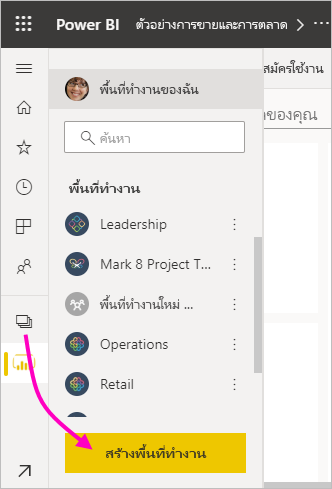

# สร้างพื้นที่ทำงานใหม่ใน Power BICreate the new workspaces in Power BI

บทความนี้อธิบายถึงวิธีการสร้าง *พื้นที่ทำงานใหม่* หนึ่งพื้นที่แทนที่จะเป็นพื้นที่ทำงาน *แบบคลาสสิก*This article explains how to create one of the *new workspaces* instead of a *classic* workspace. พื้นที่ทำงานทั้งสองประเภทคือสถานที่ที่จะร่วมงานกับเพื่อนร่วมงานBoth kinds of workspaces are places to collaborate with colleagues. ในพื้นที่เหล่านั้น คุณสามารถสร้างคอลเลกชันของแดชบอร์ด รายงาน และรายงานที่มีการแบ่งหน้าIn them, you create collections of dashboards, reports, and paginated reports. ถ้าคุณต้องการ คุณยังสามารถรวมคอลเลกชันนั้นลงใน *แอป* และแจกจ่ายไปยังผู้ชมที่กว้างขึ้นได้If you want, you can also bundle that collection into an *app* and distribute it to a broader audience. สำหรับพื้นหลังเพิ่มเติม ดูบทความ [พื้นที่ทำงานใหม่](service-new-workspaces.md)For more background, see the [new workspaces](service-new-workspaces.md) article.

พร้อมที่จะโยกย้ายจากพื้นที่ทำงานแบบคลาสสิกของคุณหรือยังReady to migrate your classic workspace? ดู [อัปเกรดพื้นที่ทำงานแบบคลาสสิกเป็นพื้นที่งานใหม่ใน Power BI](service-upgrade-workspaces.md) สำหรับรายละเอียดSee [Upgrade classic workspaces to the new workspaces in Power BI](service-upgrade-workspaces.md) for details.

> [!NOTE]
> เมื่อต้องการบังคับใช้การรักษาความปลอดภัยระดับแถว (RLS) สำหรับผู้ใช้ Power BI Pro ที่เรียกดูเนื้อหาในพื้นที่ทำงาน ให้มอบหมายบทบาทผู้ชมให้แก่ผู้ใช้To enforce row-level security (RLS) for Power BI Pro users browsing content in a workspace, assign the users the Viewer Role. ดู[บทบาทในพื้นที่ทำงานใหม่](service-new-workspaces.md#roles-in-the-new-workspaces)สำหรับคำอธิบายเรื่องบทบาทที่แตกต่างกันSee [Roles in the new workspaces](service-new-workspaces.md#roles-in-the-new-workspaces) for an explanation of the different roles.

## สร้างพื้นที่ทำงานใหม่หนึ่งพื้นที่Create one of the new workspaces

1. เริ่มต้นโดยการสร้างพื้นที่ทำงานStart by creating the workspace. เลือก **พื้นที่ทำงาน** > **สร้างพื้นที่ทำงาน**Select **Workspaces** > **Create workspace**.
   
     

2. คุณกำลังสร้างพื้นที่ทำงานที่อัปเกรดโดยอัตโนมัติ เว้นแต่ว่าคุณจะเลือกที่จะ **แปลงกลับเป็นแบบดั้งเดิม**You're automatically creating an upgraded workspace, unless you opt to **Revert to classic**.
   
     
     
     ถ้าคุณเลือก **แปลงกลับเป็นแบบคลาสสิก** คุณจะสร้าง [พื้นที่ทำงานโดยยึดตาม Microsoft 365 Group](service-create-workspaces.md)If you select **Revert to classic**, you [create a classic workspace](service-create-workspaces.md) based on a Microsoft 365 group.

2. ตั้งชื่อพื้นที่ทำงานที่ไม่ซ้ำกันGive the workspace a unique name. ถ้าไม่มีชื่อ แก้ไขโดยให้ชื่อที่ไม่ซ้ำกันIf the name isn't available, edit it to come up with a unique name.
   
     แอปที่คุณสร้างจากพื้นที่ทำงานจะมีชื่อและไอคอนเดียวกันกับพื้นที่ทำงานThe app you create from the workspace will have the same name and icon as the workspace.
   
1. ต่อไปนี้คือรายการที่เป็นตัวเลือกบางอย่างที่คุณสามารถตั้งค่าสำหรับพื้นที่ทำงานของคุณ:Here are some optional items you can set for your workspace:

    - อัปโหลด **รูปพื้นที่ทำงาน**Upload a **Workspace image**. ไฟล์สามารถเป็นรูปแบบ .png หรือ .jpg ได้Files can be .png or .jpg format. ขนาดไฟล์จะต้องน้อยกว่า 45 KBFile size has to be less than 45 KB. 
    - [ระบุ OneDrive ของพื้นที่ทำงาน](#set-a-workspace-onedrive) เพื่อใช้ตำแหน่งพื้นที่จัดเก็บไฟล์ Microsoft 365 Group[Specify a Workspace OneDrive](#set-a-workspace-onedrive) to use a Microsoft 365 group file storage location.    
    - [เพิ่มรายชื่อผู้ติดต่อ](#create-a-contact-list)[Add a Contact list](#create-a-contact-list). ตามค่าเริ่มต้น ผู้ดูแลระบบพื้นที่ทำงานเป็นผู้ติดต่อBy default, the workspace admins are the contacts. 
    - [อนุญาตให้ผู้สนับสนุนอัปเดตแอป](#allow-contributors-to-update-the-app)สำหรับพื้นที่ทำงาน[Allow contributors to update the app](#allow-contributors-to-update-the-app) for the workspace
    - หากต้องการกำหนดพื้นที่ทำงานสำหรับ **ความจุเฉพาะ** บนแท็บ **พรีเมียม** เลือก **ความจุเฉพาะ**To assign the workspace to a **Dedicated capacity**, on the **Premium** tab select **Dedicated capacity**.

        

1. เลือก **บันทึก**Select **Save**.

    Power BI จะสร้างพื้นที่ทำงาน และเปิดพื้นที่ทำงานนั้นPower BI creates the workspace and opens it. ซึ่งคุณจะเห็นในรายการของพื้นที่ทำงานที่คุณเป็นสมาชิกYou see it in the list of workspaces you’re a member of. 

## ให้สิทธิ์การเข้าถึงพื้นที่ทำงานของคุณGive access to your workspace

ทุกคนที่มีบทบาทเป็นผู้ดูแลระบบในพื้นที่ทำงานสามารถให้สิทธิ์ผู้อื่นในการเข้าถึงพื้นที่ทำงานได้โดยการเพิ่มบุคคลดังกล่าวไปยังบทบาทอื่น ๆAnyone who has an admin role in a workspace can give others access to the workspace by adding them to the different roles. ผู้สร้างพื้นที่ทำงานจะเป็นผู้ดูแลระบบโดยอัตโนมัติWorkspace creators are automatically admins. ดูคำอธิบายเรื่องบทบาทต่าง ๆ ได้ที่[บทบาทในพื้นที่ทำงานใหม่](service-new-workspaces.md#roles-in-the-new-workspaces)See [Roles in the new workspaces](service-new-workspaces.md#roles-in-the-new-workspaces) for an explanation of the roles.

1. เนื่องจากคุณเป็นผู้ดูแลระบบในรายการเนื้อหาของพื้นที่ทำงาน คุณจะเห็น **การเข้าถึง**Because you're an admin, on the workspace content list page, you see **Access**.

    

1. เพิ่มกลุ่มความปลอดภัย รายการการแจกจ่าย Microsoft 365 Group หรือบุคคลลงในพื้นที่ทำงานเหล่านี้เป็นผู้ชม สมาชิก ผู้สนับสนุน หรือผู้ดูแลระบบAdd security groups, distribution lists, Microsoft 365 groups, or individuals to these workspaces as admins, members, contributors, or viewers. 

    

9. เลือก **เพิ่ม** > **ปิด**Select **Add** > **Close**.

## ตั้งค่า OneDrive ของพื้นที่ทำงานSet a workspace OneDrive

คุณลักษณะ OneDrive ของพื้นที่ทำงานช่วยให้คุณสามารถกำหนดค่า Microsoft 365 Group ที่มีที่จัดเก็บไฟล์ SharePoint Document Library พร้อมใช้งานสำหรับผู้ใช้พื้นที่ทำงานThe Workspace OneDrive feature allows you to configure a Microsoft 365 group whose SharePoint Document Library file storage is available to workspace users. คุณสร้างกลุ่มภายนอก Power BI ก่อนYou create the group outside of Power BI first. 

Power BI ไม่ซิงค์สิทธิ์ของผู้ใช้หรือกลุ่มที่มีการกำหนดค่าให้มีสิทธิ์การเข้าถึงพื้นที่ทำงานด้วยการเป็นสมาชิกของ Microsoft 365 GroupPower BI doesn't synchronize permissions of users or groups who are configured to have workspace access with the Microsoft 365 group membership. แนวทางปฏิบัติที่ดีที่สุดคือการให้ [สิทธิ์การเข้าถึงพื้นที่ทำงาน ](#give-access-to-your-workspace)กับ Microsoft 365 Group เดียวกันซึ่งมีที่เก็บข้อมูลไฟล์ที่คุณกำหนดค่าในการตั้งค่า Microsoft 365 Group นี้The best practice is to give [access to the workspace](#give-access-to-your-workspace) to the same Microsoft 365 group whose file storage you configure in this setting Microsoft 365 group. จากนั้นจัดการการเข้าถึงพื้นที่ทำงานโดยการจัดการสมาชิกของ Microsoft 365 GroupThen manage workspace access by managing membership of the Microsoft 365 group. 

1. เข้าถึงการตั้งค่า **พื้นที่ทำงาน OneDrive** ใหม่ในหนึ่งในสองวิธี:Access the new **Workspace OneDrive** setting in one of two ways:

    ในบานหน้าต่าง **สร้างพื้นที่ทำงาน** เมื่อคุณสร้างในครั้งแรกIn the **Create a workspace** pane when you first create it.

    ในบานหน้าต่างการนำทาง เลือกลูกศรถัดจาก **พื้นที่ทำงาน** เลือก **ตัวเลือกเพิ่มเติม** (...) ถัดจากชื่อพื้นที่ทำงานของคุณ > **การตั้งค่าพื้นที่ทำงาน**In the nav pane, select the arrow next to **Workspaces**, select **More options** (...) next to the workspace name > **Workspace settings**. บานหน้าต่าง **การตั้งค่า** จะเปิดขึ้นThe **Settings** pane opens.

    

2. ภายใต้ **ขั้นสูง** > **พื้นที่ทำงาน OneDrive** พิมพ์ชื่อของ Microsoft 365 Group ที่คุณสร้างก่อนหน้านี้Under **Advanced** > **Workspace OneDrive**, type the name of the Microsoft 365 group that you created earlier. พิมพ์เพียงชื่อไม่ใช่ URLType just the name, not the URL. Power BI จะเลือก OneDrive สำหรับกลุ่มโดยอัตโนมัติPower BI automatically picks up the OneDrive for the group.

    

3. เลือก **บันทึก**Select **Save**.

### เข้าถึงตำแหน่งที่ตั้งพื้นที่ทำงาน OneDriveAccess the workspace OneDrive location

หลังจากที่คุณกำหนดค่าตำแหน่งที่ตั้ง OneDrive แล้ว คุณจะได้รับในลักษณะเดียวกับที่คุณได้รับแหล่งข้อมูลอื่น ๆ ในบริการของ Power BIAfter you've configured the OneDrive location, you get to it in the same way you get to other data sources in the Power BI service.

1. ในบานหน้าต่างนำทาง ให้เลือก **รับข้อมูล** จากนั้นไปที่กล่อง **ไฟล์** แล้วเลือก **รับ**In the nav pane, select **Get Data**, then in the **Files** box select **Get**.

    

1.  รายการ **OneDrive – Business** คือ OneDrive สำหรับธุรกิจส่วนตัวของคุณเองThe **OneDrive – Business** entry is your own personal OneDrive for Business. OneDrive ที่สองคือรายการที่คุณเพิ่มThe second OneDrive is the one you added.

    

## สร้างรายชื่อผู้ติดต่อCreate a contact list

คุณสามารถระบุได้ว่าจะให้ผู้ใช้รายใดได้รับการแจ้งเตือนเกี่ยวกับปัญหาที่เกิดขึ้นในพื้นที่ทำงานYou can specify which users receive notification about issues occurring in the workspace. ตามค่าเริ่มต้นผู้ใช้หรือกลุ่มใด ๆ ที่ระบุเป็นผู้ดูแลระบบพื้นที่ทำงานได้รับการแจ้งเตือน แต่คุณสามารถเพิ่มบุคคลอื่นลงใน *รายชื่อผู้ติดต่อ* ได้By default, any user or group specified as a workspace admin is notified, but you can add others to the *contact list*. ผู้ใช้หรือกลุ่มต่าง ๆ ในรายการที่ติดต่อจะระบุอยู่ในอินเทอร์เฟซผู้ใช้ (UI) เพื่อให้ความช่วยเหลือเกี่ยวกับพื้นที่ทำงานแก่ผู้ใช้Users or groups in the contact list are listed in the user interface (UI) to help users get help related to the workspace.

1. เข้าถึงการตั้งค่า **รายชื่อผู้ติดต่อ** ใหม่ด้วยหนึ่งในสองวิธี:Access the new **Contact list** setting in one of two ways:

    ในบานหน้าต่าง **สร้างพื้นที่ทำงาน** เมื่อคุณสร้างในครั้งแรกIn the **Create a workspace** pane when you first create it.

    ในบานหน้าต่างการนำทาง เลือกลูกศรถัดจาก **พื้นที่ทำงาน** เลือก **ตัวเลือกเพิ่มเติม** (...) ถัดจากชื่อพื้นที่ทำงานของคุณ > **การตั้งค่าพื้นที่ทำงาน**In the nav pane, select the arrow next to **Workspaces**, select **More options** (...) next to the workspace name > **Workspace settings**. บานหน้าต่าง **การตั้งค่า** จะเปิดขึ้นThe **Settings** pane opens.

    

2. ภายในเมนู **ขั้นสูง**, **รายชื่อผู้ติดต่อ**, ยอมรับค่าเริ่มต้น, **ผู้ดูแลระบบพื้นที่ทำงาน** หรือเพิ่มรายชื่อ **กลุ่มหรือผู้ใช้ที่เฉพาะเจาะจง** ของคุณเองUnder **Advanced**, **Contact list**, accept the default, **Workspace admins**, or add your own list of **Specific users or groups**. 

    

3. เลือก **บันทึก**Select **Save**.

## อนุญาตให้ผู้สนับสนุนอัปเดตแอปได้Allow contributors to update the app

**อนุญาตให้ผู้สนับสนุนในการอัปเดตแอปสำหรับพื้นที่ทำงานนี้** การตั้งค่าอนุญาตให้ผู้ดูแลระบบพื้นที่ทำงานเพื่อมอบสิทธิ์ให้กับผู้ใช้ในบทบาทการสนับสนุนสามารถอัปเดตแอปสำหรับพื้นที่ทำงานThe **Allow contributors to update the app for this workspace** setting allows workspace Admins to delegate to users in the Contributor role the ability to update the app for the workspace. ตามค่าเริ่มต้น เฉพาะผู้ดูแลระบบพื้นที่ทำงานและสมาชิกเท่านั้นที่สามารถเผยแพร่และอัปเดตแอปสำหรับพื้นที่ทำงานได้By default, only workspace Admins and Members can publish and update the app for the workspace. 

1. หากต้องการเข้าถึงการตั้งค่านี้ ในบานหน้าต่างการนำทาง ให้เลือกลูกศรถัดจาก **พื้นที่ทำงาน** เลือก **ตัวเลือกเพิ่มเติม** (...) ถัดจากชื่อพื้นที่ทำงานของคุณ > **การตั้งค่าพื้นที่ทำงาน**To access this setting, in the nav pane, select the arrow next to **Workspaces**, select **More options** (...) next to the workspace name > **Workspace settings**. บานหน้าต่าง **การตั้งค่า** จะเปิดขึ้นThe **Settings** pane opens.

    

2. ภายในเมนู **ขั้นสูง** ให้ขยาย **การตั้งค่าการรักษาความปลอดภัย**Under **Advanced**, expand **Security settings**. เลือก **อนุญาตให้ผู้สนับสนุนอัปเดตแอปสำหรับพื้นที่ทำงานนี้**Select **Allow contributors to update the app for this workspace**. 

เมื่อเปิดใช้งาน ผู้สนับสนุนสามารถ:When enabled, contributors can:
* อัปเดตข้อมูลเมตาดาต้าของแอปเช่น ชื่อ ไอคอน คำอธิบาย ไซต์ที่รองรับ และสีUpdate app metadata like name, icon, description, support site, and color
* เพิ่มหรือลบรายการที่รวมอยู่ในแอป เช่น การเพิ่มรายงานหรือชุดข้อมูลAdd or remove items included in the app, like adding reports or datasets
* เปลี่ยนการนำทางแอปหรือรายการเริ่มต้นที่แอปจะเปิดขึ้นChange the app navigation or default item the app opens on

แต่ผู้สนับสนุนไม่สามารถ:However, contributors can't:
* เผยแพร่แอปในครั้งแรกPublish the app for the first time
* เปลี่ยนผู้ที่มีสิทธิ์ไปยังแอปChange who has permission to the app

## แอปในพื้นที่ทำงานใหม่Apps in the new workspaces

คุณสามารถสร้างและใช้ *แอป* เพื่อเป็นประสบการณ์การใช้งานพื้นที่ทำงานใหม่ แทนที่จะเป็นชุดเนื้อหาYou can create and consume *apps* the new workspace experiences, instead of content packs. แอปคือคอลเลกชันของแดชบอร์ด รายงาน และชุดข้อมูลที่เชื่อมต่อกับบริการของบุคคลที่สามและข้อมูลองค์กรApps are collections of dashboards, reports, and datasets that connect to third-party services and organizational data. แอปจะทำให้ง่ายต่อการรับข้อมูลจากบริการต่าง ๆ เช่น Microsoft Dynamics CRM, Salesforce และ Google AnalyticsApps make it easy to get data from the services such as Microsoft Dynamics CRM, Salesforce, and Google Analytics.

ในการใช้งานของพื้นที่ทำงานใหม่ คุณไม่สามารถสร้าง หรือใช้ชุดเนื้อหาระดับองค์กรIn the new workspace experience, you can't create or consume organizational content packs. ถามทีมภายในของคุณเพื่อจัดหาแอปสำหรับชุดเนื้อหาใด ๆ ที่คุณกำลังใช้อยู่ในขณะนี้Ask your internal teams to provide apps for any content packs you’re currently using. 

### แจกจ่ายแอปDistribute an app

ถ้าคุณต้องการแจกจ่ายเนื้อหาอย่างเป็นทางการไปยังผู้ชมจำนวนมากในองค์กรของคุณ คุณสามารถเผยแพร่ *แอป* จากพื้นที่ทำงานของคุณได้If you want to distribute official content to a large audience in your organization, you can publish an *app* from your workspace.  เมื่อเนื้อหาของคุณพร้อมแล้ว คุณสามารถเลือกแดชบอร์ดและรายงานที่คุณต้องการเผยแพร่ และเผยแพร่เป็นแอปได้When your content is ready, you choose which dashboards and reports you want to publish, and publish them as an app. คุณสามารถสร้างแอปหนึ่งจากแต่ละพื้นที่ทำงานYou can create one app from each workspace.

อ่านเกี่ยวกับ[วิธีการเผยแพร่แอปจากพื้นที่ทำงานใหม่](service-create-distribute-apps.md)Read about how to [publish an app from the new workspaces](service-create-distribute-apps.md).

## ขั้นตอนถัดไปNext steps
* อ่านเกี่ยวกับ[การจัดระเบียบงานในการใช้งานพื้นที่ทำงานใหม่ใน Power BI](service-new-workspaces.md)Read about [organizing work in the new workspaces experience in Power BI](service-new-workspaces.md)
* [สร้างพื้นที่ทำงานแบบดั้งเดิมCreate classic workspaces](service-create-workspaces.md)
* [เผยแพร่แอปจากพื้นที่ทำงานใหม่ใน Power BI Publish an app from the new workspaces in Power BI](service-create-distribute-apps.md)
* มีคำถามหรือไม่Questions? [ลองถามชุมชน Power BITry asking the Power BI Community](https://community.powerbi.com/)
