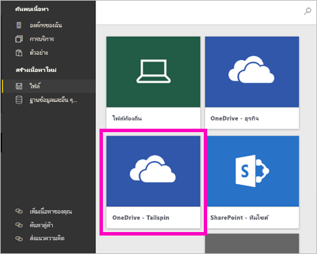

# สร้างพื้นที่ทำงานใหม่ใน Power BI

บทความนี้อธิบายถึงวิธีการสร้าง *พื้นที่ทำงานใหม่* หนึ่งพื้นที่แทนที่จะเป็นพื้นที่ทำงาน *แบบคลาสสิก* พื้นที่ทำงานทั้งสองประเภทคือสถานที่ที่จะร่วมงานกับเพื่อนร่วมงาน ในพื้นที่เหล่านั้น คุณสามารถสร้างคอลเลกชันของแดชบอร์ด รายงาน และรายงานที่มีการแบ่งหน้า ถ้าคุณต้องการ คุณยังสามารถรวมคอลเลกชันนั้นลงใน *แอป* และแจกจ่ายไปยังผู้ชมที่กว้างขึ้นได้ สำหรับพื้นหลังเพิ่มเติม ดูบทความ [พื้นที่ทำงานใหม่](service-new-workspaces.md)

พร้อมที่จะโยกย้ายจากพื้นที่ทำงานแบบคลาสสิกของคุณหรือยัง ดู [อัปเกรดพื้นที่ทำงานแบบคลาสสิกเป็นพื้นที่งานใหม่ใน Power BI](service-upgrade-workspaces.md) สำหรับรายละเอียด

> [!NOTE]
> กำลังมองหาเนื้อหาเกี่ยวกับการสร้างชุดเนื้อหาใช่หรือไม่ พวกเขากำลังถูกยกเลิกการใช้งาน ตอนนี้เป็นเวลาที่เหมาะสมในการอัปเกรดชุดเนื้อหาของคุณไปยังแอป ดูส่วนแผนงานการอัปเกรดพื้นที่ทำงานของบล็อกโพสต์นี้ [การประกาศผู้ดูแลระบบ Power BI สามารถอัปเกรดพื้นที่ทำงานแบบคลาสสิก](https://powerbi.microsoft.com/blog/announcing-power-bi-admins-can-upgrade-classic-workspaces-and-roadmap-update/) สำหรับไทม์ไลน์
> 

## สร้างพื้นที่ทำงานใหม่หนึ่งพื้นที่

1. เริ่มต้นโดยการสร้างพื้นที่ทำงาน เลือก **พื้นที่ทำงาน** > **สร้างพื้นที่ทำงาน**
   
     

2. คุณกำลังสร้างพื้นที่ทำงานที่อัปเกรดโดยอัตโนมัติ เว้นแต่ว่าคุณจะเลือกที่จะ **แปลงกลับเป็นแบบดั้งเดิม**
   
     
     
     ถ้าคุณเลือก **แปลงกลับเป็นแบบคลาสสิก** คุณจะสร้าง [พื้นที่ทำงานโดยยึดตาม Microsoft 365 Group](service-create-workspaces.md)

2. ตั้งชื่อพื้นที่ทำงานที่ไม่ซ้ำกัน ถ้าไม่มีชื่อ แก้ไขโดยให้ชื่อที่ไม่ซ้ำกัน
   
     แอปที่คุณสร้างจากพื้นที่ทำงานจะมีชื่อและไอคอนเดียวกันกับพื้นที่ทำงาน
   
1. ต่อไปนี้คือรายการที่เป็นตัวเลือกบางอย่างที่คุณสามารถตั้งค่าสำหรับพื้นที่ทำงานของคุณ:

    - อัปโหลด **รูปพื้นที่ทำงาน** ไฟล์สามารถเป็นรูปแบบ .png หรือ .jpg ได้ ขนาดไฟล์จะต้องน้อยกว่า 45 KB 
    - [ระบุ OneDrive ของพื้นที่ทำงาน](#set-a-workspace-onedrive) เพื่อใช้ตำแหน่งพื้นที่จัดเก็บไฟล์ Microsoft 365 Group    
    - [เพิ่มรายชื่อผู้ติดต่อ](#create-a-contact-list) ตามค่าเริ่มต้น ผู้ดูแลระบบพื้นที่ทำงานเป็นผู้ติดต่อ 
    - [อนุญาตให้ผู้สนับสนุนอัปเดตแอป](#allow-contributors-to-update-the-app)สำหรับพื้นที่ทำงาน
    - หากต้องการกำหนดพื้นที่ทำงานสำหรับ **ความจุเฉพาะ** บนแท็บ **พรีเมียม** เลือก **ความจุเฉพาะ**

        

1. เลือก **บันทึก**

    Power BI จะสร้างพื้นที่ทำงาน และเปิดพื้นที่ทำงานนั้น ซึ่งคุณจะเห็นในรายการของพื้นที่ทำงานที่คุณเป็นสมาชิก 

## ให้สิทธิ์การเข้าถึงพื้นที่ทำงานของคุณ

ทุกคนที่มีบทบาทเป็นผู้ดูแลระบบในพื้นที่ทำงานสามารถให้สิทธิ์ผู้อื่นในการเข้าถึงพื้นที่ทำงานได้โดยการเพิ่มบุคคลดังกล่าวไปยังบทบาทอื่น ๆ ผู้สร้างพื้นที่ทำงานจะเป็นผู้ดูแลระบบโดยอัตโนมัติ ดูคำอธิบายเรื่องบทบาทต่าง ๆ ได้ที่[บทบาทในพื้นที่ทำงานใหม่](service-new-workspaces.md#roles-in-the-new-workspaces)

> [!NOTE]
> เมื่อต้องการบังคับใช้การรักษาความปลอดภัยระดับแถว (RLS) สำหรับผู้ใช้ Power BI Pro ที่เรียกดูเนื้อหาในพื้นที่ทำงาน ให้มอบหมายบทบาทผู้ชมให้แก่ผู้ใช้ ดู[บทบาทในพื้นที่ทำงานใหม่](service-new-workspaces.md#roles-in-the-new-workspaces)สำหรับคำอธิบายเรื่องบทบาทที่แตกต่างกัน

1. เนื่องจากคุณเป็นผู้ดูแลระบบในรายการเนื้อหาของพื้นที่ทำงาน คุณจะเห็น **การเข้าถึง**

    

1. เพิ่มกลุ่มความปลอดภัย รายการการแจกจ่าย Microsoft 365 Group หรือบุคคลลงในพื้นที่ทำงานเหล่านี้เป็นผู้ชม สมาชิก ผู้สนับสนุน หรือผู้ดูแลระบบ 

    

9. เลือก **เพิ่ม** > **ปิด**

## ตั้งค่า OneDrive ของพื้นที่ทำงาน

คุณลักษณะ OneDrive ของพื้นที่ทำงานช่วยให้คุณสามารถกำหนดค่า Microsoft 365 Group ที่มีที่จัดเก็บไฟล์ SharePoint Document Library พร้อมใช้งานสำหรับผู้ใช้พื้นที่ทำงาน คุณสร้างกลุ่มภายนอก Power BI ก่อน 

Power BI ไม่ซิงค์สิทธิ์ของผู้ใช้หรือกลุ่มที่มีการกำหนดค่าให้มีสิทธิ์การเข้าถึงพื้นที่ทำงานด้วยการเป็นสมาชิกของ Microsoft 365 Group แนวทางปฏิบัติที่ดีที่สุดคือการให้ [สิทธิ์การเข้าถึงพื้นที่ทำงาน ](#give-access-to-your-workspace)กับ Microsoft 365 Group เดียวกันซึ่งมีที่เก็บข้อมูลไฟล์ที่คุณกำหนดค่าในการตั้งค่า Microsoft 365 Group นี้ จากนั้นจัดการการเข้าถึงพื้นที่ทำงานโดยการจัดการสมาชิกของ Microsoft 365 Group 

1. เข้าถึงการตั้งค่า **พื้นที่ทำงาน OneDrive** ใหม่ในหนึ่งในสองวิธี:

    ในบานหน้าต่าง **สร้างพื้นที่ทำงาน** เมื่อคุณสร้างในครั้งแรก

    ในบานหน้าต่างการนำทาง เลือกลูกศรถัดจาก **พื้นที่ทำงาน** เลือก **ตัวเลือกเพิ่มเติม** (...) ถัดจากชื่อพื้นที่ทำงานของคุณ > **การตั้งค่าพื้นที่ทำงาน** บานหน้าต่าง **การตั้งค่า** จะเปิดขึ้น

    

2. ภายใต้ **ขั้นสูง** > **พื้นที่ทำงาน OneDrive** พิมพ์ชื่อของ Microsoft 365 Group ที่คุณสร้างก่อนหน้านี้ พิมพ์เพียงชื่อไม่ใช่ URL Power BI จะเลือก OneDrive สำหรับกลุ่มโดยอัตโนมัติ

    

3. เลือก **บันทึก**

### เข้าถึงตำแหน่งที่ตั้งพื้นที่ทำงาน OneDrive

หลังจากที่คุณกำหนดค่าตำแหน่งที่ตั้ง OneDrive แล้ว คุณจะได้รับในลักษณะเดียวกับที่คุณได้รับแหล่งข้อมูลอื่น ๆ ในบริการของ Power BI

1. ในบานหน้าต่างนำทาง ให้เลือก **รับข้อมูล** จากนั้นไปที่กล่อง **ไฟล์** แล้วเลือก **รับ**

    

1.  รายการ **OneDrive – Business** คือ OneDrive สำหรับธุรกิจส่วนตัวของคุณเอง OneDrive ที่สองคือรายการที่คุณเพิ่ม

    

## สร้างรายชื่อผู้ติดต่อ

คุณสามารถระบุได้ว่าจะให้ผู้ใช้รายใดได้รับการแจ้งเตือนเกี่ยวกับปัญหาที่เกิดขึ้นในพื้นที่ทำงาน ตามค่าเริ่มต้นผู้ใช้หรือกลุ่มใด ๆ ที่ระบุเป็นผู้ดูแลระบบพื้นที่ทำงานได้รับการแจ้งเตือน แต่คุณสามารถเพิ่มบุคคลอื่นลงใน *รายชื่อผู้ติดต่อ* ได้ ผู้ใช้หรือกลุ่มต่าง ๆ ในรายการที่ติดต่อจะระบุอยู่ในอินเทอร์เฟซผู้ใช้ (UI) เพื่อให้ความช่วยเหลือเกี่ยวกับพื้นที่ทำงานแก่ผู้ใช้

1. เข้าถึงการตั้งค่า **รายชื่อผู้ติดต่อ** ใหม่ด้วยหนึ่งในสองวิธี:

    ในบานหน้าต่าง **สร้างพื้นที่ทำงาน** เมื่อคุณสร้างในครั้งแรก

    ในบานหน้าต่างการนำทาง เลือกลูกศรถัดจาก **พื้นที่ทำงาน** เลือก **ตัวเลือกเพิ่มเติม** (...) ถัดจากชื่อพื้นที่ทำงานของคุณ > **การตั้งค่าพื้นที่ทำงาน** บานหน้าต่าง **การตั้งค่า** จะเปิดขึ้น

    

2. ภายในเมนู **ขั้นสูง**, **รายชื่อผู้ติดต่อ**, ยอมรับค่าเริ่มต้น, **ผู้ดูแลระบบพื้นที่ทำงาน** หรือเพิ่มรายชื่อ **กลุ่มหรือผู้ใช้ที่เฉพาะเจาะจง** ของคุณเอง 

    

3. เลือก **บันทึก**

## อนุญาตให้ผู้สนับสนุนอัปเดตแอปได้

**อนุญาตให้ผู้สนับสนุนในการอัปเดตแอปสำหรับพื้นที่ทำงานนี้** การตั้งค่าอนุญาตให้ผู้ดูแลระบบพื้นที่ทำงานเพื่อมอบสิทธิ์ให้กับผู้ใช้ในบทบาทการสนับสนุนสามารถอัปเดตแอปสำหรับพื้นที่ทำงาน ตามค่าเริ่มต้น เฉพาะผู้ดูแลระบบพื้นที่ทำงานและสมาชิกเท่านั้นที่สามารถเผยแพร่และอัปเดตแอปสำหรับพื้นที่ทำงานได้ 

1. หากต้องการเข้าถึงการตั้งค่านี้ ในบานหน้าต่างการนำทาง ให้เลือกลูกศรถัดจาก **พื้นที่ทำงาน** เลือก **ตัวเลือกเพิ่มเติม** (...) ถัดจากชื่อพื้นที่ทำงานของคุณ > **การตั้งค่าพื้นที่ทำงาน** บานหน้าต่าง **การตั้งค่า** จะเปิดขึ้น

    

2. ภายในเมนู **ขั้นสูง** ให้ขยาย **การตั้งค่าการรักษาความปลอดภัย** เลือก **อนุญาตให้ผู้สนับสนุนอัปเดตแอปสำหรับพื้นที่ทำงานนี้** 

เมื่อเปิดใช้งาน ผู้สนับสนุนสามารถ:
* อัปเดตข้อมูลเมตาดาต้าของแอปเช่น ชื่อ ไอคอน คำอธิบาย ไซต์ที่รองรับ และสี
* เพิ่มหรือลบรายการที่รวมอยู่ในแอป เช่น การเพิ่มรายงานหรือชุดข้อมูล
* เปลี่ยนการนำทางแอปหรือรายการเริ่มต้นที่แอปจะเปิดขึ้น

แต่ผู้สนับสนุนไม่สามารถ:
* เผยแพร่แอปในครั้งแรก
* เปลี่ยนผู้ที่มีสิทธิ์ไปยังแอป

## แอปในพื้นที่ทำงานใหม่

คุณสามารถสร้างและใช้ *แอป* เพื่อเป็นประสบการณ์การใช้งานพื้นที่ทำงานใหม่ แทนที่จะเป็นชุดเนื้อหา แอปคือคอลเลกชันของแดชบอร์ด รายงาน และชุดข้อมูลที่เชื่อมต่อกับบริการของบุคคลที่สามและข้อมูลองค์กร แอปจะทำให้ง่ายต่อการรับข้อมูลจากบริการต่าง ๆ เช่น Microsoft Dynamics CRM, Salesforce และ Google Analytics

ในการใช้งานของพื้นที่ทำงานใหม่ คุณไม่สามารถสร้าง หรือใช้ชุดเนื้อหาระดับองค์กร ถามทีมภายในของคุณเพื่อจัดหาแอปสำหรับชุดเนื้อหาใด ๆ ที่คุณกำลังใช้อยู่ในขณะนี้ 

### แจกจ่ายแอป

ถ้าคุณต้องการแจกจ่ายเนื้อหาอย่างเป็นทางการไปยังผู้ชมจำนวนมากในองค์กรของคุณ คุณสามารถเผยแพร่ *แอป* จากพื้นที่ทำงานของคุณได้  เมื่อเนื้อหาของคุณพร้อมแล้ว คุณสามารถเลือกแดชบอร์ดและรายงานที่คุณต้องการเผยแพร่ และเผยแพร่เป็นแอปได้ คุณสามารถสร้างแอปหนึ่งจากแต่ละพื้นที่ทำงาน

อ่านเกี่ยวกับ[วิธีการเผยแพร่แอปจากพื้นที่ทำงานใหม่](service-create-distribute-apps.md)

## ขั้นตอนถัดไป
* อ่านเกี่ยวกับ[การจัดระเบียบงานในการใช้งานพื้นที่ทำงานใหม่ใน Power BI](service-new-workspaces.md)
* [สร้างพื้นที่ทำงานแบบดั้งเดิม](service-create-workspaces.md)
* [เผยแพร่แอปจากพื้นที่ทำงานใหม่ใน Power BI ](service-create-distribute-apps.md)
* มีคำถามหรือไม่ [ลองถามชุมชน Power BI](https://community.powerbi.com/)
