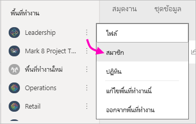
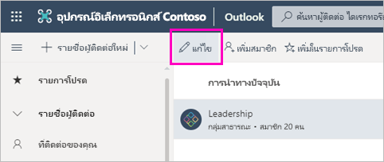
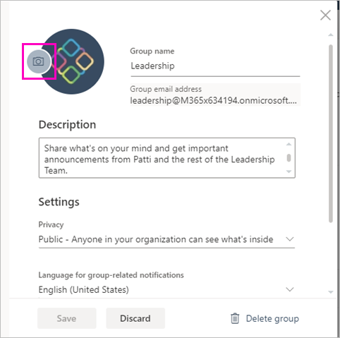
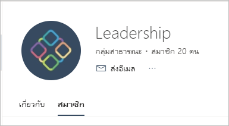

# สร้างพื้นที่ทำงานแบบคลาสสิกใน Power BI

ใน Power BI คุณสามารถสร้าง *พื้นที่ทำงาน* ซึ่งเป็นสถานที่ทำงานร่วมกับเพื่อนร่วมงานเพื่อสร้าง และปรับปรุงคอลเลกชันของแดชบอร์ด รายงาน และรายงานที่มีการแบ่งหน้าได้ Power BI มีพื้นที่ทำงานดั้งเดิมหรือ *คลาสสิก* และพื้นที่ทำงานใหม่ บทความนี้เกี่ยวกับการสร้างพื้นที่ทำงานแบบคลาสสิก

**คุณทราบหรือไม่** Power BI มีประสบการณ์ในพื้นที่ทำงานใหม่ซึ่งตอนนี้เป็นค่าเริ่มต้น อ่าน [จัดระเบียบงานในพื้นที่ทำงานใหม่ ](service-new-workspaces.md) สำหรับรายละเอียดเกี่ยวกับพื้นที่ทำงานใหม่ พร้อมที่จะโยกย้ายจากพื้นที่ทำงานแบบคลาสสิกของคุณหรือยัง ดู [อัปเกรดพื้นที่ทำงานแบบคลาสสิกเป็นพื้นที่งานใหม่ใน Power BI](service-upgrade-workspaces.md) สำหรับรายละเอียด

เมื่อคุณสร้างพื้นที่ทำงานแบบคลาสสิก คุณกำลังสร้าง Microsoft 365 Group พื้นฐานที่เกี่ยวข้อง การดูแลระบบพื้นที่ทำงานทั้งหมดอยู่ใน Microsoft 365 คุณสามารถเพิ่มผู้ร่วมงานไปยังพื้นที่ทำงานเหล่านี้ได้ในฐานะเป็นสมาชิกหรือเป็นผู้ดูแลระบบ ในพื้นที่ทำงาน คุณสามารถทำงานร่วมกันทั้งหมดบนแดชบอร์ด รายงาน และบทความอื่นๆ ที่คุณวางแผนที่จะเผยแพร่ไปยังผู้ชมจำนวนมาก ทุกคนที่คุณเพิ่มลงในพื้นที่ทำงานต้องมีสิทธิ์การใช้งาน Power BI Pro

## วิดีโอ: แอปและพื้นที่ทำงาน
<iframe width="640" height="360" src="https://www.youtube.com/embed/Ey5pyrr7Lk8?showinfo=0" frameborder="0" allowfullscreen></iframe>

## สร้างพื้นที่ทำงานแบบคลาสสิกโดยอาศัย Microsoft 365 Group

เมื่อคุณสร้างพื้นที่ทำงาน ก็จะต้องสร้างบน Microsoft 365 Group

[!INCLUDE [powerbi-service-create-app-workspace](../includes/powerbi-service-create-app-workspace.md)]

เมื่อคุณเริ่มสร้างพื้นที่ทำงานเป็นครั้งแรก คุณอาจต้องรอเป็นเวลาหนึ่งชั่วโมงหรือมากกว่า เพื่อให้พื้นที่ทำงานเผยแพร่ไปยัง Microsoft 365

### เพิ่มรูปภาพลงในพื้นที่ทำงาน Microsoft 365 ของคุณ (เป็นตัวเลือก)
ตามค่าเริ่มต้น Power BI สร้างวงกลมสีขนาดเล็กสำหรับแอปฯของคุณด้วยชื่อย่อของแอปฯ แต่คุณอาจต้องการกำหนดด้วยตนเองด้วยรูปภาพหนึ่ง ในการเพิ่มรูปภาพ คุณจำเป็นต้องมีสิทธิ์การใช้งาน Exchange Online

1. เลือก **พื้นที่ทำงาน** เลือก **ตัวเลือกเพิ่มเติม** (...) ที่อยู่ถัดจากชื่อของพื้นที่ทำงาน จากนั้นเลือก **สมาชิก** 
   
     
   
    บัญชี Microsoft 365 Outlook สำหรับพื้นที่ทำงานเปิดขึ้นในหน้าต่างเบราว์เซอร์ใหม่
2. เลือกดินสอ **แก้ไข**
   
     
3. เลือกไอคอนกล้องถ่ายรูปอีกครั้งและค้นหารูปภาพที่คุณต้องการใช้
   
     

     รูปภาพสามารถเป็นไฟล์ .png, .jpg หรือ .bmp ได้ ขนาดไฟล์สามารถมีขนาดใหญ่ได้สูงสุดถึง 3 เมกะไบต์ 

4. เลือก **ตกลง** จากนั้นจึงเลือก **บันทึก**
   
    รูปภาพแทนที่วงกลมสีในหน้าต่าง Microsoft 365 Outlook
   
     
   
    ในไม่กี่นาที ภาพจะปรากฏในแอปฯใน Power BI ด้วยเหมือนกัน

## เพิ่มเนื้อหาไปยังพื้นที่ทำงานของคุณ

หลังจากที่คุณสร้างพื้นที่ทำงาน ก็ถึงเวลาที่จะต้องเพิ่มเนื้อหา ซึ่งเหมือนกับการเพิ่มเนื้อหาไปยังพื้นที่ทำงานของฉัน เว้นแต่ว่าบุคคลอื่นในพื้นที่ทำงานสามารถดู และทำงานบนแอปนั้นได้ ความแตกต่างอย่างมากเมื่อคุณทำเสร็จแล้วคือ คุณสามารถเผยแพร่เนื้อหาในฐานะเป็นแอปฯ เมื่อคุณดูเนื้อหาในรายการเนื้อหาของพื้นที่ทำงาน ชื่อพื้นที่ทำงานจะถูกแสดงในฐานะเป็นเจ้าของ

### เชื่อมต่อกับบริการของบุคคลที่สามในพื้นที่ทำงาน

แอปสามารถใช้บริการที่เป็นบุคคลที่สามที่ Power BI สนับสนุน จึงง่ายสำหรับคุณที่จะได้รับข้อมูลจากบริการที่คุณใช้ เช่น Microsoft Dynamics CRM, Salesforce หรือ Google Analytics คุณสามารถเผยแพร่แอประดับองค์กรเพื่อให้ข้อมูลแก่ผู้ใช้ที่ต้องการข้อมูลนั้น

ในพื้นที่ทำงานแบบคลาสสิก คุณยังสามารถเชื่อมต่อด้วยการใช้ชุดเนื้อหาองค์กร และแอปของบุคคลสาม เช่น Microsoft Dynamics CRM, Salesforce หรือ Google Analytics เรากำลังเลิกใช้งานชุดเนื้อหาระดับองค์กรแล้ว ตอนนี้ คือเวลาดีที่จะอัปเกรดชุดเนื้อหาของคุณไปยังแอป ถ้าคุณยังไม่ได้เริ่มต้น ดูส่วนแผนงานการอัปเกรดพื้นที่ทำงานของบล็อกโพสต์นี้ [การประกาศผู้ดูแลระบบ Power BI สามารถอัปเกรดพื้นที่ทำงานแบบคลาสสิก](https://powerbi.microsoft.com/blog/announcing-power-bi-admins-can-upgrade-classic-workspaces-and-roadmap-update/) สำหรับไทม์ไลน์

## แจกจ่ายแอป

ถ้าคุณต้องการแจกจ่ายเนื้อหาอย่างเป็นทางการไปยังผู้ชมจำนวนมากภายในองค์กรของคุณ คุณสามารถเผยแพร่แอปจากพื้นที่ทำงานของคุณได้  เมื่อเนื้อหาพร้อมแล้ว คุณสามารถเลือกได้ว่าแดชบอร์ดและรายงานใดที่คุณต้องการจะเผยแพร่ จากนั้นเผยแพร่ในฐานะเป็น *แอป* คุณสามารถสร้างแอปหนึ่งจากแต่ละพื้นที่ทำงาน

รายการแอปในหน้าต่างนำทางจะแสดงแอปทั้งหมดที่คุณติดตั้ง เพื่อนร่วมงานของคุณสามารถรับแอปของคุณด้วยสองสามวิธีที่แตกต่างกัน 
- พวกเขาสามารถค้นหาและติดตั้งแอปจาก Microsoft AppSource ได้
- คุณสามารถส่งลิงก์โดยตรงให้กับพวกเขาได้ 
- คุณสามารถติดตั้งแอปโดยอัตโนมัติในบัญชี Power BI ของเพื่อนร่วมงานของคุณถ้าผู้ดูแลระบบ Power BI ของคุณให้สิทธิ์คุณ 

ผู้ใช้จะเห็นเนื้อหาของแอปที่อัปเดตโดยอัตโนมัติหลังจากที่คุณเผยแพร่การอัปเดตจากพื้นที่ทำงานของคุณ คุณสามารถควบคุมความถี่ในการรีเฟรชข้อมูลได้โดยการตั้งค่ากำหนดเวลาการรีเฟรชในชุดข้อมูลที่ใช้โดยเนื้อหาแอปในพื้นที่ทำงานของคุณ ดู[เผยแพร่แอปจากพื้นที่ทำงานใหม่ใน Power BI ](service-create-distribute-apps.md)สำหรับรายละเอียด

## คำถามที่พบบ่อยเกี่ยวกับแอป Power BI แบบคลาสสิก

### แอปฯต่าง ๆ แตกต่างจากชุดเนื้อหาองค์กรอย่างไร?
แอปเป็นวิวัฒนาการของชุดเนื้อหาองค์กร ที่กำลังจะถูกเลิกใช้งาน ตอนนี้ คือเวลาดีที่จะอัปเกรดชุดเนื้อหาของคุณไปยังแอป ถ้าคุณยังไม่ได้เริ่มต้น ดูส่วนแผนงานการอัปเกรดพื้นที่ทำงานของบล็อกโพสต์นี้ [การประกาศผู้ดูแลระบบ Power BI สามารถอัปเกรดพื้นที่ทำงานแบบคลาสสิก](https://powerbi.microsoft.com/blog/announcing-power-bi-admins-can-upgrade-classic-workspaces-and-roadmap-update/) สำหรับไทม์ไลน์ 

* หลังจากที่ผู้ใช้ธุรกิจติดตั้งชุดเนื้อหาแล้ว ชุดเนื้อหานั้นจะสูญเสียข้อมูลประจำตัวที่จัดกลุ่ม ซึ่งเป็นเพียงรายการของแดชบอร์ดและรายงานที่ค่อย ๆ มาพร้อมกับแดชบอร์ดและรายงานอื่น ๆ อีกนัยหนึ่ง แอปฯยังคงรักษาการจัดกลุ่มและข้อมูลประจำตัวของตนไว้ได้หลังจากติดตั้ง การจัดกลุ่มนี้ทำให้ง่ายสำหรับผู้ใช้ทางธุรกิจในการนำทางไปยังแอปอย่างต่อเนื่องเมื่อเวลาผ่านไป
* คุณสามารถสร้างหลายชุดเนื้อหาจากพื้นที่ทำงานใด ๆ ได้ แต่จะเป็นแอปฯที่มีความสัมพันธ์ 1:1 กับพื้นที่ทำงานของแอปฯ 
* คุณไม่สามารถใช้หรือสร้างชุดเนื้อหาในพื้นที่ทำงานใหม่

ดู [ความแตกต่างของพื้นที่ทำงานใหม่และแบบคลาสสิก](service-new-workspaces.md#new-and-classic-workspace-differences) เพื่อเปรียบเทียบทั้งสองแบบ 

## ขั้นตอนถัดไป
* [ติดตั้งและใช้แอปฯใน Power BI](service-create-distribute-apps.md)
- [สร้างพื้นที่ทำงานใหม่](service-create-the-new-workspaces.md)
* มีคำถามหรือไม่ [ลองถามชุมชน Power BI](https://community.powerbi.com/)
