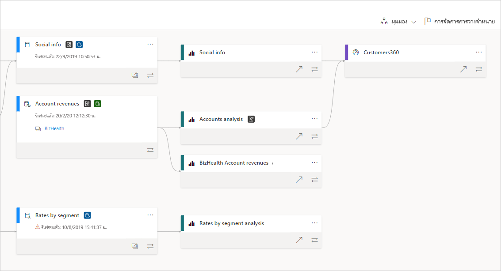
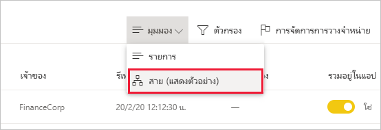
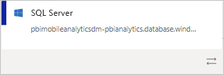
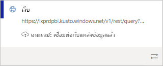
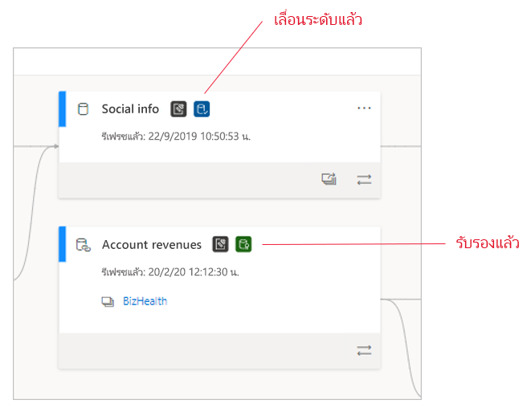
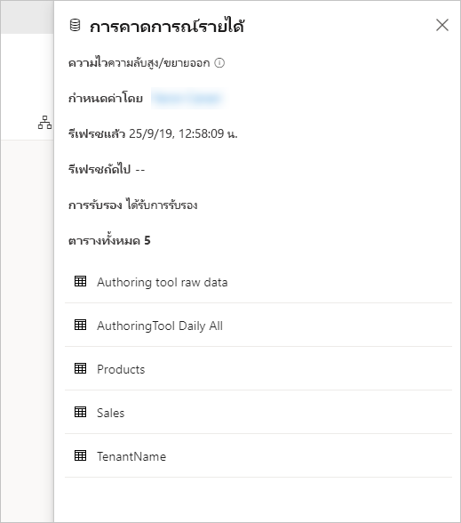
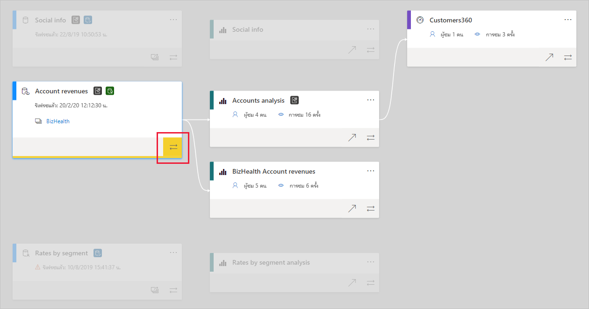

# การติดตามการใช้งานข้อมูลData lineage
ในโครงการระบบธุรกิจอัจฉริยะที่ทันสมัย (BI) การทำความเข้าใจการไหลของข้อมูลจากแหล่งข้อมูลไปยังจุดหมายปลายทางเป็นความท้าทายIn modern business intelligence (BI) projects, understanding the flow of data from the data source to its destination can be a challenge. ความท้าทายจะยิ่งเพิ่มมากขึ้นหากคุณสร้างโครงการวิเคราะห์ขั้นสูงซึ่งครอบคุลมแหล่งข้อมูล สิ่งประดิษฐ์ และการอ้างอิงจำนวนมากThe challenge is even bigger if you have built advanced analytical projects spanning multiple data sources, artifacts, and dependencies. คำถามเช่น "จะเกิดอะไรขึ้นหากฉันเปลี่ยนแปลงข้อมูลนี้"Questions like "What happens if I change this data?" หรือ "เพราะเหตุใดรายงานนี้จึงไม่มีข้อมูลล่าสุด"or "Why isn't this report up to date?" เป็นคำถามที่ตอบยากcan be hard to answer. จึงอาจจำเป็นต้องมีทีมผู้เชี่ยวชาญหรือการตรวจสอบอย่างลึกซึ้งเพื่อทำความเข้าใจThey may require a team of experts or deep investigation to understand. เราออกแบบมุมมองสายข้อมูลเพื่อช่วยเหลือคุณในการตอบคำถามเหล่านี้We designed a data lineage view to help you answer these questions.

 
Power BI มีสิ่งประดิษฐ์หลายชนิด เช่น แดชบอร์ด รายงาน ชุดข้อมูล และกระแสข้อมูลPower BI has several artifact types, such as dashboards, reports, datasets, and dataflows. ชุดข้อมูลและกระแสข้อมูลจำนวนมากเชื่อมต่อกับแหล่งข้อมูลภายนอก เช่น SQL Server และยังเชื่อมต่อกับชุดข้อมูลภายนอกในพื้นที่ทำงานอื่น ๆMany datasets and dataflows connect to external data sources such as SQL Server, and to external datasets in other workspaces. เมื่อชุดข้อมูลอยู่ภายนอกพื้นที่ทำงานที่คุณเป็นเจ้าของ ชุดข้อมูลนั้นอาจอยู่ในพื้นที่ทำงานที่บุคคลในฝ่ายไอทีหรือนักวิเคราะห์รายอื่นเป็นเจ้าของWhen a dataset is external to a workspace you own, it may be in a workspace owned by someone in IT or another analyst. ในท้ายที่สุด แหล่งข้อมูลภายนอกและชุดข้อมูลนั้นทำให้การค้นหาว่าข้อมูลมาจากที่ใดเป็นเรื่องยากขึ้นExternal data sources and datasets make it harder to know where the data is coming from, ultimately. สำหรับโครงการที่มีความซับซ้อนและโครงการที่เรียบง่ายกว่า เราขอแนะนำมุมมองสายข้อมูลFor complex projects and for simpler ones, we introduce lineage view.

ในมุมมองสายข้อมูล คุณจะเห็นความสัมพันธ์ของสายการเชื่อมโยงระหว่างสิ่งประดิษฐ์ทั้งหมดในพื้นที่ทำงาน และการอ้างอิงภายนอกทั้งหมดIn lineage view, you see the lineage relationships between all the artifacts in a workspace, and all its external dependencies. ซึ่งแสดงการเชื่อมต่อระหว่างสิ่งประดิษฐ์ในพื้นที่ทำงานทั้งหมด รวมถึงการเชื่อมต่อไปยังกระแสข้อมูล ทั้งต้นทางและปลายทางIt shows connections between all workspace artifacts, including connections to dataflows, both upstream and downstream.    

<iframe width="560" height="315" src="https://www.youtube.com/embed/rUj06dqB98g" frameborder="0" allowfullscreen></iframe>

## ดูมุมมองสายข้อมูลExplore lineage view

พื้นที่ทำงานทั้งหมด ไม่ว่าจะเป็นแบบใหม่หรือแบบดั้งเดิม ก็จะมีมุมมองสายข้อมูลโดยอัตโนมัติEvery workspace, whether new or classic, automatically has a lineage view. อย่างน้อยคุณต้องมีบทบาทผู้สนับสนุนในพื้นที่ทำงานเพื่อดูมุมมองดังกล่าวYou need at least a Contributor role in the workspace to view it. ดูรายละเอียดที่หัวข้อ [สิทธิ์](#permissions) ในบทความนี้See [Permissions](#permissions) in this article for details.

* หากต้องการเข้าถึงมุมมองสายข้อมูล ให้ไปที่มุมมองรายการพื้นที่ทำงานTo access lineage view, go to the workspace list view. แตะลูกศรที่อยู่ถัดจาก **มุมมองรายการ** และเลือก **มุมมองสายข้อมูล**Tap the arrow next to **List view** and select **Lineage view**.

   

ในมุมมองนี้ คุณจะเห็นสิ่งประดิษฐ์ในพื้นที่ทำงานทั้งหมดและวิธีการที่ข้อมูลส่งจากจุดหนึ่งไปยังอีกจุดหนึ่งIn this view, you see all the workspace artifacts and how the data flows from one artifact to another.

**แหล่งข้อมูล****Data sources**

คุณจะเห็นแหล่งข้อมูลจากชุดข้อมูลและกระแสข้อมูลที่ได้รับข้อมูลYou see the data sources from which the datasets and dataflows get their data. บนการ์ดแหล่งข้อมูล คุณจะเห็นข้อมูลเพิ่มเติมที่สามารถช่วยระบุแหล่งที่มาได้On the data source cards, you see more information that can help identify the source. ตัวอย่างเช่น สำหรับเซิร์ฟเวอร์ Azure SQL คุณจะเห็นชื่อฐานข้อมูลFor example, for Azure SQL server you also see the database name.

 
**เกตเวย์****Gateways**

หากมีการเชื่อมต่อแหล่งข้อมูลผ่านเกตเวย์ภายในองค์กร ระบบจะเพิ่มข้อมูลเกตเวย์ไปยังการ์ดแหล่งข้อมูลIf a data source is connected via an on-premises gateway, the gateway information is added to the data source card. หากคุณมีสิทธิ์ในฐานะผู้ดูแลระบบเกตเวย์หรือเป็นผู้ใช้แหล่งข้อมูล คุณจะเห็นข้อมูลเพิ่มเติม เช่น ชื่อเกตเวย์If you have permissions, either as a gateway admin or as a data source user, you see more information, such as the gateway name.

**ชุดข้อมูลและกระแสข้อมูล****Datasets and dataflows**
 
บนชุดข้อมูลและกระแสข้อมูล คุณจะเห็นเวลารีเฟรชครั้งล่าสุด เช่นเดียวกับถ้าชุดข้อมูลหรือกระแสข้อมูล ได้รับการรับรองหรือเลื่อนขั้นOn datasets and dataflows, you see the last refresh time, as well as if the dataset or dataflow is certified or promoted.

 
หากรายงานในพื้นที่ทำงานถูกสร้างขึ้นบนชุดข้อมูลหรือกระแสข้อมูลในพื้นที่ทำงานอื่น คุณจะเห็นชื่อพื้นที่ทำงานต้นทางบนการ์ดของชุดข้อมูลและกระแสข้อมูลนั้นๆIf a report in the workspace is built on a dataset or a dataflow that is located in another workspace, you see the source workspace name on the card of that dataset or dataflow. เลือกชื่อพื้นที่ทำงานต้นทางเพื่อไปยังพื้นที่ทำงานนั้นๆSelect the name of the source workspace to go to that workspace.

* สำหรับสิ่งประดิษฐ์ใดๆ ก็ตาม ให้เลือก **ตัวเลือกเพิ่มเติม** (... ) เพื่อดูเมนูตัวเลือกFor any artifact, select **More options (...)** to view the options menu. ซึ่งมีการดำเนินการเหมือนกันทั้งหมดที่สามารถใช้งานได้ในมุมมองรายการIt features all the same actions that are available in list view.

หากต้องการดูเมตาดาต้าเพิ่มเติมเกี่ยวกับสิ่งสิ่งประดิษฐ์ใดๆ ให้เลือกการ์ดสิ่งประดิษฐ์To see more metadata on any artifact, select the artifact card itself. ข้อมูลเพิ่มเติมเกี่ยวกับชุดข้อมูลจะแสดงในบานหน้าต่างด้านข้างAdditional information about the artifact is displayed in a side pane. ในภาพด้านล่าง บานหน้าต่างด้านข้างจะแสดงเมตาดาต้าของชุดข้อมูลที่เลือกIn the image below, the side pane displays the metadata of a selected dataset.

 
## แสดงสายข้อมูลสำหรับสิ่งประดิษฐ์ใด ๆShow lineage for any artifact 

สมมติว่าคุณต้องการดูสายข้อมูลสำหรับสิ่งประดิษฐ์เฉพาะSay you want to see the lineage for a specific artifact.

* ให้เลือกลูกศรคู่ซึ่งอยู่ที่ด้านล่างของสิ่งประดิษฐ์Select the double arrows under the artifact.

   

   Power BI ไฮไลท์สิ่งประดิษฐ์ทั้งหมดที่เกี่ยวข้องกับสิ่งประดิษฐ์นั้น และลดความสว่างของส่วนที่เหลือPower BI highlights all the artifacts related to that artifact, and dims the rest. 

## การนำทางและการแสดงผลเต็มหน้าจอNavigation and full screen 

มุมมองสายข้อมูลเป็นพื้นที่ทำงานแบบโต้ตอบLineage view is an interactive canvas. คุณสามารถใช้เมาส์และทัชแพดเพื่อนำทางในพื้นที่ทำงาน และย่อหรือขยายYou can use the mouse and touchpad to navigate in the canvas, as well as to zoom in or out.

* เมื่อต้องการย่อและขยาย ให้ใช้เมนูที่มุมขวาล่าง หรือใช้เมาส์หรือทัชแพดของคุณTo zoom in and out, use either the menu in the bottom-right corner or your mouse or touchpad.
* หากต้องการเพิ่มพื้นที่ให้มากขึ้นสำหรับกราฟ ให้ใช้ตัวเลือกการแสดงผลเต็มหน้าจอที่มุมขวาล่างTo have more room for the graph itself, use the full screen option at the bottom-right corner. 

    

## สิทธิ์Permissions

* คุณต้องมีสิทธิ์การใช้งาน Power BI Pro เพื่อดูมุมมองสายข้อมูลYou need a Power BI Pro license to see lineage view.
* มุมมองสายข้อมูลพร้อมใช้งานสำหรับผู้ใช้ที่มีสิทธิ์ในการเข้าถึงพื้นที่ทำงานเท่านั้นLineage view is available only to users with access to the workspace.
* ผู้ใช้ต้องมีบทบาทผู้ดูแลระบบ สมาชิก หรือบทบาทผู้สนับสนุนในพื้นที่ทำงานUsers must have an Admin, Member, or Contributor role in the workspace. ผู้ใช้ที่มีบทบาทผู้ชมไม่สามารถสลับไปยังมุมมองสายข้อมูลได้Users with a Viewer role can't switch to lineage view.

## ข้อควรพิจารณาและข้อจำกัดConsiderations and limitations

- มุมมองสายข้อมูลไม่สามารถใช้งานได้บน Internet ExplorerLineage view isn't available on Internet Explorer. ดูรายละเอียดที่ [เบราว์เซอร์ที่สนับสนุนสำหรับ Power BI](../fundamentals/power-bi-browsers.md)See [Supported browsers for Power BI](../fundamentals/power-bi-browsers.md) for details.

## ขั้นตอนถัดไปNext steps

* [บทนำชุดข้อมูลทั้งพื้นที่ทำงาน (ตัวอย่าง)Intro to datasets across workspaces (preview)](../connect-data/service-datasets-across-workspaces.md)
* [การวิเคราะห์ผลกระทบของชุดข้อมูลDataset impact analysis](service-dataset-impact-analysis.md)
