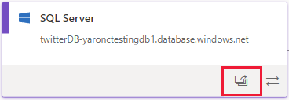
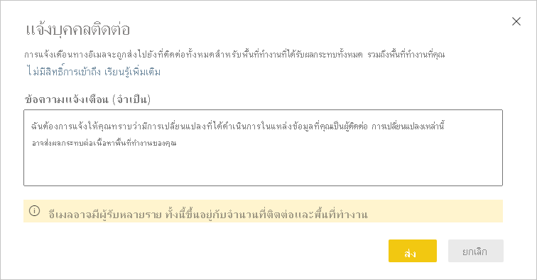

# การวิเคราะห์ผลกระทบของแหล่งข้อมูลData source impact analysis

การวิเคราะห์ผลกระทบของแหล่งข้อมูลช่วยให้คุณเห็นตำแหน่งที่มีการใช้แหล่งข้อมูลของคุณจากทั่วทั้งองค์กรData source impact analysis helps you see where your data source is being used throughout your organization. ซึ่งจะเป็นประโยชน์เมื่อมีการใช้แหล่งข้อมูลแบบออฟไลน์ชั่วคราวหรือถาวร และคุณต้องการทราบเกี่ยวกับบุคคลที่ได้รับผลกระทบThis can be useful when the data source is temporarily or permanently taken offline, and you want to get an idea about who is impacted. การดำเนินการนี้จะแสดงให้เห็นถึงจำนวนพื้นที่ทำงาน กระแสข้อมูล และชุดข้อมูลที่ใช้แหล่งข้อมูล และมอบการนำทางที่ง่ายดายไปยังพื้นที่ทำงานที่มีกระแสข้อมูลและชุดข้อมูลที่ได้รับผลกระทบเพื่อให้คุณสามารถตรวจสอบเพิ่มเติมได้It shows you how many workspaces, dataflows, and datasets use the data source, and provides easy navigation to the workspaces where the affected dataflows and datasets are located so that you can investigate further.

การวิเคราะห์ผลกระทบของแหล่งข้อมูลยังช่วยให้คุณสามารถระบุการสร้างข้อมูลซ้ำในผู้เช่าได้ เช่น เมื่อผู้ใช้หลายรายสร้างแบบจำลองที่คล้ายคลึงกันที่ด้านบนของแหล่งข้อมูลเดียวกันData source impact analysis can also help you spot data duplication in the tenant, such as when a number of different users build similar models on top of the same data source. การวิเคราะห์ผลกระทบของแหล่งข้อมูลสนับสนุนเป้าหมายในการมี “แหล่งความจริงหนึ่งเดียว” ด้วยการช่วยให้คุณค้นพบชุดข้อมูลและกระแสข้อมูลที่ซ้ำซ้อนดังกล่าวBy helping you discover such redundant datasets and dataflows, data source impact analysis supports the goal of having "a single source of truth".

## ดำเนินการวิเคราะห์ผลกระทบของแหล่งข้อมูลPerform data source impact analysis

วิธีดำเนินการวิเคราะห์ผลกระทบของแหล่งข้อมูล:To perform data source impact analysis:

1. ไปยังพื้นที่ทำงานที่มีแหล่งข้อมูลที่คุณสนใจ และเปิด[มุมมองสายข้อมูล](service-data-lineage.md)Go to the workspace that contains the data source you're interested in and open [lineage view](service-data-lineage.md).
1. ค้นหาการ์ดของแหล่งข้อมูล และคลิกที่ไอคอนการวิเคราะห์ผลกระทบFind the data source's card and click the impact analysis icon.

    
 
บานหน้าต่างข้างการวิเคราะห์ผลกระทบจะเปิดออกThe impact analysis side panel opens.

 
* **ชนิดแหล่งข้อมูล**: ระบุชนิดแหล่งข้อมูล**Data source type**: Indicates the data source type
* **เส้นทางไปยังแหล่งข้อมูล**: เส้นทางไปยังแหล่งข้อมูลตามที่กำหนดไว้ใน Power BI Desktop**Path to data source**: Path to the data source as defined in Power BI Desktop. ตัวอย่างเช่น ในรูปภาพด้านบน เส้นทางไปยังแหล่งข้อมูลของฐานข้อมูล SQL server คือสตริงการเชื่อมต่อ "twitterDB-yaronctestingdb1.database.windows.net" ตามที่กำหนดไว้ใน Power BI Desktop (แสดงที่ด้านล่าง)For example, in the image above, the path to the SQL server database data source is the connection string "twitterDB-yaronctestingdb1.database.windows.net", as defined in Power BI Desktop (shown below). ซึ่งประกอบด้วยชื่อฐานข้อมูล "twitterDB" และชื่อเซิร์ฟเวอร์ "yaronctestingdb1.database.windows.net"It consists of the database name "twitterDB" and the server name "yaronctestingdb1.database.windows.net".

    
 
* **สรุปผลกระทบ**: แสดงจำนวนของพื้นที่ทำงาน กระแสข้อมูล และชุดข้อมูลที่อาจได้รับผลกระทบ**Impact summary**: Shows you the number of potentially impacted workspaces, dataflows, and datasets. การนับจำนวนนี้รวมถึงพื้นที่ทำงานที่คุณไม่มีสิทธิ์เข้าถึงด้วยThis count includes workspaces you don't have access to.
* **การแบ่งการใช้งาน**: แสดงให้คุณเห็นชื่อของกระแสข้อมูลและชุดข้อมูลที่ได้รับผลกระทบสำหรับแต่ละพื้นที่ทำงาน**Usage breakdown**: Shows you, for each workspace, the names of the impacted dataflows and datasets. หากต้องการสำรวจผลกระทบเพิ่มเติมในพื้นที่ทำงานเฉพาะ ให้คลิกที่ชื่อพื้นที่ทำงานเพื่อเปิดพื้นที่ทำงานTo further explore the impact on a particular workspace, click the workspace name to open the workspace. เมื่ออยู่ในพื้นที่ทำงานที่ได้รับผลกระทบ ให้ใช้[การวิเคราะห์ผลกระทบของชุดข้อมูล](service-dataset-impact-analysis.md) เพื่อดูรายละเอียดการใช้งานเกี่ยวกับรายงานและแดชบอร์ดที่เชื่อมต่อOnce in the affected workspace, use [dataset impact analysis](service-dataset-impact-analysis.md) to see the usage details about connected reports and dashboards.

## แจ้งบุคคลติดต่อNotify contacts

หากคุณได้ทำการเปลี่ยนแปลงแหล่งข้อมูลหรือกำลังคิดที่จะทำการเปลี่ยนแปลงคุณอาจต้องการติดต่อผู้ใช้ที่เกี่ยวข้องเพื่อแจ้งให้ทราบIf you've made a change to a data source or are thinking about making a change, you might want to contact the relevant users to tell them about it. เมื่อคุณแจ้งผู้ติดต่ออีเมลจะถูกส่งไปยัง [รายชื่อผู้ติดต่อ](service-create-the-new-workspaces.md#create-a-contact-list) ของพื้นที่ทำงานที่ได้รับผลกระทบทั้งหมด (ในกรณีของพื้นที่ทำงานแบบคลาสสิกอีเมลจะถูกส่งไปยังผู้ดูแลระบบพื้นที่ทำงาน)When you notify contacts, an email is sent to the [contact lists](service-create-the-new-workspaces.md#create-a-contact-list) of all the impacted workspaces (in case of classic workspaces, the email is sent to the workspace administrators). ชื่อของคุณจะปรากฏบนอีเมล ดังนั้น บุคคลติดต่อจะสามารถค้นหาคุณได้และตอบกลับในเธรดอีเมลใหม่Your name appears on the email so the contacts can find you and reply back in a new email thread. 

1. คลิก **แจ้งบุคคลติดต่อ** ในบานหน้าต่างด้านข่างการวิเคราะห์ผลกระทบClick **Notify contacts** in the impact analysis side pane. กล่องโต้ตอบแจ้งบุคคลติดต่อจะปรากฏขึ้นThe notify contacts dialog will appear.

   

1. ในกล่องข้อความ ให้ระบุรายละเอียดบางอย่างเกี่ยวกับการเปลี่ยนแปลงIn the text box, provide some detail about the change.
1. เมื่อข้อความพร้อม ให้คลิก **ส่ง**When the message is ready, click **Send**.

## ความเป็นส่วนตัวPrivacy

ในบานหน้าต่างด้านข้างการวิเคราะห์ผลกระทบ คุณจะเห็นเฉพาะชื่อจริงสำหรับพื้นที่ทำงาน ชุดข้อมูล และกระแสข้อมูลที่คุณสามารถเข้าถึงได้In the impact analysis side pane, you only see real names for workspaces, datasets, and dataflows that you have access to. หน่วยข้อมูลที่คุณไม่มีสิทธิ์ในการเข้าถึงจะแสดงเป็นการเข้าถึงแบบจำกัดItems that you don't have access to are listed as Limited access. เนื่องจากชื่อหน่วยข้อมูลบางรายการอาจมีข้อมูลส่วนบุคคลอยู่ด้วยThis is because some item names may contain personal information.
จำนวนสรุปผลกระทบ รวมถึงกระแสข้อมูลและชุดข้อมูลที่ได้รับผลกระทบทั้งหมด แม้ว่าจะอยู่ในพื้นที่ทำงานที่คุณไม่มีสิทธิ์เข้าถึงก็ตามThe impact summary counts include all impacted dataflows and datasets, even those that reside in workspaces you don't have access to.

## ข้อจำกัดLimitations

รายงานแบบแบ่งหน้ายังไม่รองรับการวิเคราะห์ผลกระทบของแหล่งข้อมูล ดังนั้นคุณจะไม่เห็นว่าแหล่งข้อมูลมีผลกระทบโดยตรงใด ๆ กับรายงานชนิดนี้ในผู้เช่าหรือไม่Data source impact analysis is not yet supported for paginated reports, so you will not see if the data source has any direct impact on these kinds of reports in the tenant.

## ขั้นตอนถัดไปNext steps

* [การวิเคราะห์ผลกระทบของชุดข้อมูลDataset impact analysis](service-dataset-impact-analysis.md)
* [สายข้อมูลData lineage](service-data-lineage.md)