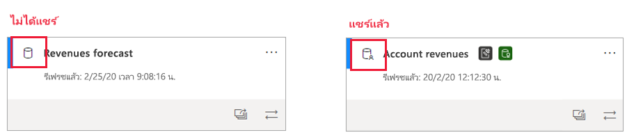
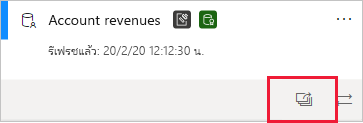
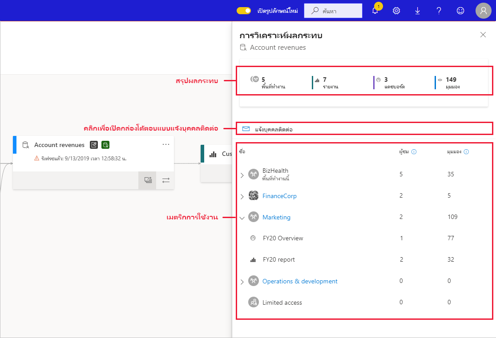
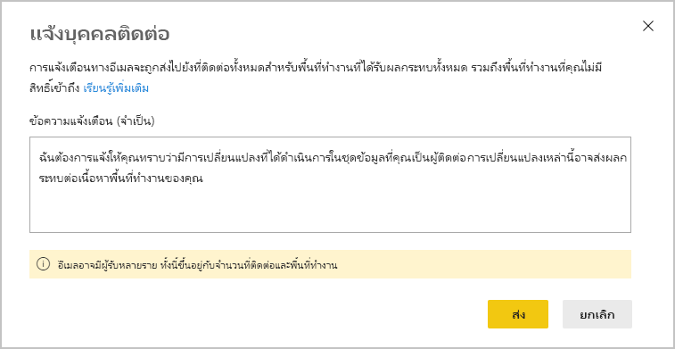
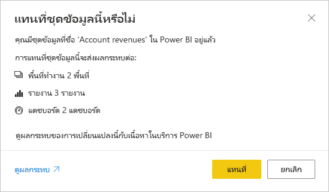

# การวิเคราะห์ผลกระทบของชุดข้อมูลDataset impact analysis

เมื่อคุณทำการเปลี่ยนแปลงชุดข้อมูลหรือกำลังพิจารณาทำการเปลี่ยนแปลง สิ่งสำคัญคือต้องสามารถประเมินผลกระทบที่การเปลี่ยนแปลงเหล่านั้นจะมีในรายงานและแดชบอร์ดที่อยู่ในเวลาที่ขึ้นอยู่กับชุดข้อมูลนั้นWhen you make changes to a dataset, or are considering making changes, it is important to be able to assess the impact those changes will have on downstream reports and dashboards that depend on that dataset. **การวิเคราะห์ผลกระทบของชุดข้อมูล** ให้ข้อมูลที่ช่วยให้คุณสามารถทำการประเมินนี้ได้**Dataset impact analysis** provides you with information that can help you make this assessment.
* การดำเนินการนี้จะแสดงให้เห็นถึงจำนวนพื้นที่ทำงาน รายงาน และแดชบอร์ดของคุณที่อาจได้รับผลกระทบ และมอบการนำทางอย่างง่ายไปยังพื้นที่ทำงานที่มีรายงานและแดชบอร์ดที่ได้รับผลกระทบเพื่อให้คุณสามารถตรวจสอบเพิ่มเติมได้It shows you how many workspaces, reports, and dashboards might be affected by your change, and provides easy navigation to the workspaces where the affected reports and dashboards are located so that you can investigate further.
* การดำเนินการนี้จะแสดงให้คุณเห็นถึงจำนวนผู้เยี่ยมชม และจำนวนการเข้าชมที่มีในรายการที่อาจได้รับผลกระทบIt shows you how many unique visitors and the number of views there are on the potentially affected items. การดำเนินการนี้จะช่วยให้คุณพิจารณาผลกระทบโดยรวมของการเปลี่ยนแปลงสำหรับรายการปลายทางThis helps you determine the overall impact of the change for the downstream item. ตัวอย่างเช่น อาจเป็นเรื่องสำคัญที่ต้องตรวจสอบผลกระทบจากการเปลี่ยนแปลงในรายงานที่มีผู้ชม 20,000 ราย มากกว่าการตรวจสอบผลกระทบจากการเปลี่ยนแปลงในรายงานที่มีผู้ชมสามรายFor instance, it is probably more important to investigate the effect of a change on a report that has 20,000 unique viewers than it is to investigate the effect of the change on a report that has three viewers.
* โดยถือเป็นวิธีการที่ง่ายดายในการแจ้งให้ผู้คนที่เกี่ยวข้องทราบเกี่ยวกับการเปลี่ยนแปลงที่คุณได้ทำ หรือกำลังคิดว่าจะทำIt provides an easy way of notifying the relevant people about a change you made or are thinking about making.

การวิเคราะห์ผลกระทบของชุดข้อมูลจะถูกเปิดใช้งานได้อย่างง่ายดายจากภายใน [มุมมองการติดตามการใช้งานข้อมูล](service-data-lineage.md)Dataset impact analysis is easily launched from within [data lineage view](service-data-lineage.md).

## การระบุชุดข้อมูลที่แชร์Identifying shared datasets

คุณสามารถดำเนินการวิเคราะห์ผลกระทบของชุดข้อมูลได้ทั้งบนชุดข้อมูลที่แชร์และไม่ได้แชร์You can perform dataset impact analysis on both shared and unshared datasets. อย่างไรก็ตาม จะเป็นประโยชน์อย่างยิ่งสำหรับชุดข้อมูลที่แชร์ในพื้นที่ทำงาน ซึ่งมีความซับซ้อนมากขึ้นเมื่อต้องการรับรูปภาพที่ชัดเจนของการขึ้นต่อกันที่ปลายทาง มากกว่าชุดข้อมูลที่ไม่ได้แชร์ ทั้งนี้ การขึ้นต่อกันทั้งหมดนี้จะตั้งอยู่ในพื้นที่ทำงานเดียวกันกับชุดข้อมูลของตนเองHowever, it is particularly useful for datasets which are shared across workspaces, where it is much more complicated to get a clear picture of downstream dependencies than it is with unshared datasets, all of whose dependencies are located in the same workspace as the dataset itself.

ในมุมมองการติดตามการใช้งาน คุณจะสามารถบอกได้ถึงความแตกต่างระหว่างชุดข้อมูลที่แชร์และไม่ได้แชร์ จากไอคอนที่ปรากฏในมุมบนซ้ายมือของการ์ดของชุดข้อมูลIn lineage view, you can tell the difference between shared datasets and unshared datasets by the icon that appears in the upper left-hand corner of the dataset's card.

## ดำเนินการวิเคราะห์ผลกระทบของชุดข้อมูลPerform dataset impact analysis

คุณสามารถดำเนินการวิเคราะห์ผลกระทบเกี่ยวกับชุดข้อมูลใด ๆ ในพื้นที่ทำงาน ไม่ว่าจะมีการแชร์หรือไม่ก็ตามYou can perform impact analysis on any dataset in the workspace, whether it is shared or not. คุณไม่สามารถดำเนินการวิเคราะห์ผลกระทบบนชุดข้อมูลภายนอกที่แสดงในมุมมองการติดตามการใช้งาน แต่ในความเป็นจริง ตั้งอยู่ในพื้นที่ทำงานอื่นYou cannot perform impact analysis on external datasets that are displayed in lineage view but are in fact located in another workspace. เมื่อต้องการทำการวิเคราะห์ผลกระทบบนชุดข้อมูลภายนอก คุณต้องนำทางไปยังพื้นที่ทำงานต้นทางTo perform impact analysis on an external dataset, you need to navigate to the source workspace.

เมื่อต้องการทำการวิเคราะห์ผลกระทบของชุดข้อมูล ให้คลิกที่ปุ่มการวิเคราะห์ผลกระทบบนการ์ดชุดข้อมูลTo perform dataset impact analysis, click the impact analysis button on the dataset card.

บานหน้าต่างข้างการวิเคราะห์ผลกระทบจะเปิดออกThe impact analysis side panel opens.

* **สรุปผลกระทบ** แสดงจำนวนพื้นที่ทำงาน รายงาน และแดชบอร์ดที่อาจได้รับผลกระทบ รวมถึงจำนวนมุมมองทั้งหมดสำหรับรายงานปลายทางและแดชบอร์ดทั้งหมดที่เชื่อมต่อกับชุดข้อมูลThe **impact summary** shows you the number of potentially impacted workspaces, reports, and dashboards, as well as the total number of views for all the downstream reports and dashboards that are connected to the dataset.
* ลิงก์ **แจ้งบุคคลผู้ติดต่อ** จะเปิดกล่องโต้ตอบที่คุณสามารถสร้างและส่งข้อความเกี่ยวกับการเปลี่ยนแปลงชุดข้อมูลใด ๆ ที่คุณทำต่อรายชื่อติดต่อของพื้นที่ทำงานที่ได้รับผลกระทบThe **notify contacts** link opens a dialog where you can create and send a message about any dataset changes you make to the contact lists of the affected workspaces. 
* **การแจกแจงการใช้งาน** ที่แสดงให้คุณเห็นถึงพื้นที่ทำงานแต่ละรายการ จำนวนมุมมองทั้งหมดสำหรับรายงานและแดชบอร์ดที่อาจได้รับผลกระทบ และสำหรับรายงานและแดชบอร์ดแต่ละรายการ จำนวนผู้ชุมทั้งหมดและมุมมองที่The **usage breakdown** that shows you, for each workspace, the total number of views for the potentially impacted reports and dashboards it contains, and for each report and dashboard, the total number of viewers and views, where
   * ผู้ชม: จำนวนผู้ใช้ที่ไม่ซ้ำกันที่ดูรายงานหรือมุมมองหนึ่งๆViewers: The number of distinct users that viewed a report or dashboard.
   * มุมมอง: จำนวนมุมมองสำหรับรายงานหรือแดชบอร์ดViews: The number of views for a report or dashboard

เมตริกการใช้งานจะสัมพันธ์กับ 30 วันล่าสุด โดยไม่นับรวมวันปัจจุบันThe usage metrics relate to the last 30 days, excluding the current day. จำนวนจะหมายรวมถึงการใช้งานผ่านแอปต่าง ๆ ที่เกี่ยวข้องThe count includes usage coming via related apps. เมตริกจะช่วยให้คุณเข้าใจการใช้งานชุดข้อมูลในทุกผู้เช่า รวมถึงประเมินผลกระทบที่อาจเกิดจากการเปลี่ยนแปลงของชุดข้อมูลของคุณThe metrics help you understand dataset use across the tenant, as well as assess the impact any changes to your dataset may have.

## แจ้งบุคคลติดต่อNotify contacts

หากคุณทำการเปลี่ยนแปลงกับชุดข้อมูล หรือกำลังคิดที่จะทำการเปลี่ยนแปลง คุณอาจต้องการติดต่อผู้ใช้ที่เกี่ยวข้อง เพื่อแจ้งให้พวกเขาทราบIf you've made a change to a dataset or are thinking about making a change, you might want to contact the relevant users to tell them about it. เมื่อคุณแจ้งบุคคลติดต่อ ระบบจะส่งอีเมลไปยัง [รายชื่อบุคคลติดต่อ](../collaborate-share/service-create-the-new-workspaces.md#create-a-contact-list) ของพื้นที่ทำงานทั้งหมดที่ได้รับผลกระทบWhen you notify contacts, an email is sent to the [contact lists](../collaborate-share/service-create-the-new-workspaces.md#create-a-contact-list) of all the impacted workspaces. ชื่อของคุณจะปรากฏบนอีเมล ดังนั้น บุคคลติดต่อจะสามารถค้นหาคุณได้และตอบกลับในเธรดอีเมลใหม่Your name appears on the email so the contacts can find you and reply back in a new email thread. 

1. คลิก **แจ้งบุคคลติดต่อ** ในบานหน้าต่างด้านข่างการวิเคราะห์ผลกระทบClick **Notify contacts** in the impact analysis side pane. กล่องโต้ตอบแจ้งบุคคลติดต่อจะปรากฏขึ้นThe notify contacts dialog will appear.

   

1. ในกล่องข้อความ ให้ระบุรายละเอียดบางอย่างเกี่ยวกับการเปลี่ยนแปลงIn the text box, provide some detail about the change.
1. เมื่อข้อความพร้อม ให้คลิก **ส่ง**When the message is ready, click **Send**.

> [!NOTE]
> แจ้งบุคคลติดต่อจะไม่สามารถใช้งานได้ หากชุดข้อมูลที่คุณกำลังทำการวิเคราะห์ผลกระทบอยู่ในพื้นที่ทำงานแบบคลาสสิกNotify contacts is not available if the dataset you are performing impact analysis on is located in a classic workspace.

## ความเป็นส่วนตัวPrivacy

เพื่อดำเนินการวิเคราะห์ผลกระทบในชุดข้อมูล คุณจำเป็นต้องเขียนสิทธิ์ให้ชุดข้อมูลดังกล่าวIn order to perform impact analysis on a dataset, you must have write permissions to it. ในบานหน้าต่างด้านข้างการวิเคราะห์ผลกระทบ คุณจะเห็นเฉพาะชื่อจริงสำหรับพื้นที่ทำงาน รายงาน และแดชบอร์ดที่คุณสามารถเข้าถึงได้In the impact analysis side pane, you only see real names for workspaces, reports, and dashboards that you have access to. หน่วยข้อมูลที่คุณไม่สามารถเข้าถึงได้ จะแสดงแบบ **การเข้าถึงแบบจำกัด**Items that you don't have access to are listed as **Limited access**. เนื่องจากชื่อหน่วยข้อมูลบางรายการอาจมีข้อมูลส่วนบุคคลอยู่ด้วยThis is because some item names may contain personal information.

แม้ว่าคุณจะไม่สามารถเข้าถึงพื้นที่ทำงานบางอย่างได้ แต่คุณจะยังคงมองเห็นเมตริกการใช้งานสรุปสำหรับพื้นที่ทำงานดังกล่าว และข้อความแจ้งบุคคลติดต่อของคุณจะเข้าถึงรายชื่อบุคคลติดต่อของพื้นที่ทำงานดังกล่าวEven if you don't have access to some workspaces, you will still see summarized usage metrics for those workspaces, and your notify contacts messages will reach the contact lists of those workspaces.

## การวิเคราะห์ผลกระทบจาก Power BI DesktopImpact analysis from Power BI Desktop

เมื่อคุณทำการเปลี่ยนแปลงกับชุดข้อมูลใน Power BI Desktop แล้วเผยแพร่อีกครั้งไปยังบริการ Power BI ข้อความจะแสดงจำนวนพื้นที่ทำงาน รายงาน และแดชบอร์ดที่อาจได้รับผลกระทบจากการเปลี่ยนแปลงนั้น และขอให้คุณยืนยันว่า คุณต้องการแทนที่ชุดข้อมูลที่เผยแพร่ในปัจจุบันด้วยรายการที่คุณปรับเปลี่ยนWhen you make a change to a dataset in Power BI Desktop and then republish it to the Power BI service, a message shows you how many workspaces, reports, and dashboards are potentially impacted by the change, and asks you to confirm that you want to replace the currently published dataset with the one you modified. นอกจากนี้ ข้อความยังประกอบด้วยลิงก์ไปยังการวิเคราะห์ผลกระทบของชุดข้อมูลแบบเต็มรูปแบบในบริการ Power BI ที่คุณจะสามารถมองเห็นข้อมูลเพิ่มเติม และดำเนินการเพื่อบรรเทาความเสี่ยงจากการเปลี่ยนแปลงของคุณThe message also provides a link to the full dataset impact analysis in the Power BI service, where you can see more information and take action to mitigate the risks of your change.

> [!NOTE]
> ข้อมูลที่แสดงในข้อความจะระบุถึงผลกระทบที่อาจเกิดขึ้น โดยไม่จำเป็นต้องระบุว่ามีสิ่งใดเสียหายบ้างThe information shown in the message only indicates potential impact - it does not necessarily indicate that anything has broken. ในบางครั้ง การเปลี่ยนแปลงของชุดข้อมูลจะไม่ส่งผลเสียต่อแดชบอร์ดและรายงานปลายทาง แต่คุณจะได้รับข้อความนี้ทีมอบความชัดเจนให้แก่คุณเกี่ยวกับผลกระทบที่อาจเกิดขึ้นOftentimes dataset changes have no adverse effect on their downstream reports and dashboards - still, you'll get this message that gives you clarity concerning potential impact.
>
>ในข้อความดังกล่าว จำนวนพื้นที่ทำงานจะปรากฏก็ต่อเมื่อมีพื้นที่ทำงานมากกว่าหนึ่งรายการที่มีแดชบอร์ดและรายงานที่ได้รับผลกระทบIn the message, the number of workspaces is only shown if more than one workspace contains impacted reports and dashboards.

## ข้อจำกัดLimitations

* ขณะนี้ เมตริกการใช้งานจะไม่ได้รับการสนับสนุนสำหรับพื้นที่ทำงานส่วนบุคคลและแบบคลาสสิกUsage metrics are currently not supported for classic and personal workspaces.

## ขั้นตอนถัดไปNext steps

* [บทนำชุดข้อมูลทั้งพื้นที่ทำงาน (ตัวอย่าง)Intro to datasets across workspaces (preview)](../connect-data/service-datasets-across-workspaces.md)
* [สายข้อมูลData lineage](service-data-lineage.md)

