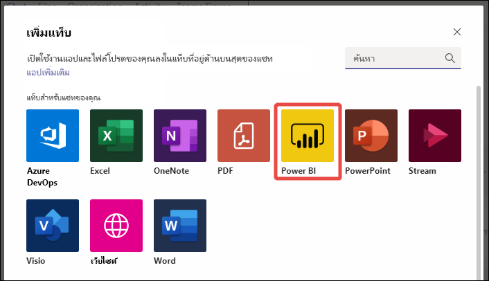
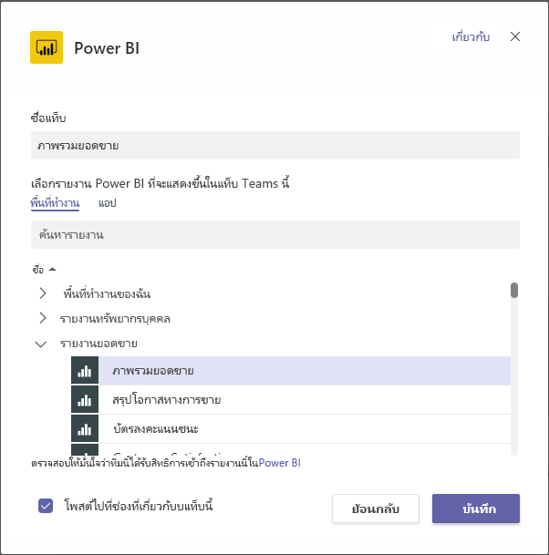

# ฝังเนื้อหา Power BI ใน Microsoft TeamsEmbed Power BI content in Microsoft Teams

คุณสามารถฝังรายงาน Power BI แบบโต้ตอบในช่องทางการสื่อสารและการสนทนาของ Microsoft Teams ได้อย่างง่ายดายYou can easily embed interactive Power BI reports in Microsoft Teams channels and chats. 

## ข้อกำหนดRequirements

หากต้องการใช้แท็บ **Power BI** ใน Microsoft Teams ให้ตรวจสอบองค์ประกอบต่าง ๆ เหล่านี้:To use the **Power BI** tab in Microsoft Teams, ensure these elements:

- Microsoft Teams มีแท็บ **Power BI**Microsoft Teams has the **Power BI** tab.
- หากต้องการเพิ่มรายงานใน Microsoft Teams ด้วยแท็บ **Power BI** อย่างน้อยคุณต้องมีบทบาทผู้ชมในพื้นที่ทำงานที่โฮสต์รายงานTo add a report in Microsoft Teams with the **Power BI** tab, you have at least a Viewer role in the workspace that hosts the report. ดู[บทบาทในพื้นที่ทำงานใหม่](service-new-workspaces.md#roles-in-the-new-workspaces)สำหรับข้อมูลเกี่ยวกับบทบาทที่แตกต่างกันFor information about the different roles, see [Roles in the new workspaces](service-new-workspaces.md#roles-in-the-new-workspaces).
- หากต้องการดูรายงานในแท็บ **Power BI** ใน Microsoft Teams ผู้ใช้ต้องมีสิทธิ์ในการดูรายงานTo see the report in the **Power BI** tab in Microsoft Teams, users must have permission to view the report.
- ผู้ใช้จะต้องเป็นผู้ใช้  Microsoft Teams ที่มีสิทธิ์เข้าถึงช่องและการสนทนาUsers must be Microsoft Teams users with access to channels and chats.

ดู[การทำงานร่วมกันใน Microsoft Teams ด้วย Power BI](service-embed-report-microsoft-teams.md) สำหรับเบื้องหลังเกี่ยวกับวิธีที่ระบบ Power Bi และ Microsoft Teams ทำงานร่วมกัน รวมถึงข้อกำหนดต่าง ๆSee [Collaborate in Microsoft Teams with Power BI](service-embed-report-microsoft-teams.md) for background on how Power BI and Microsoft Teams work together, including other requirements.

## ฝังรายงานใน Microsoft TeamsEmbed a report in Microsoft Teams

ทำตามขั้นตอนเหล่านี้เพื่อฝังรายงานของคุณลงในแชนเนลหรือแชทของ Microsoft TeamsFollow these steps to embed your report in a Microsoft Teams channel or chat.

1. เปิดแชนเนลหรือแชทใน Microsoft Teams และเลือกไอคอน **+**Open a channel or chat in Microsoft Teams, and select the **+** icon.

    

1. เลือกแท็บ **Power BI**Select the **Power BI** tab.

    

1. ใช้ตัวเลือกที่ให้มาเพื่อเลือกรายงานจากพื้นที่ทำงานหรือแอป Power BIUse the provided options to select a report from a workspace or a Power BI app.

    

1. ชื่อแท็บจะอัปเดตโดยอัตโนมัติเพื่อให้ตรงกับชื่อของชื่อรายงาน แต่คุณสามารถเปลี่ยนได้The tab name updates automatically to match the name of the report name, but you can change it.

1. เลือก **บันทึก**Select **Save**.

### รายงานที่คุณสามารถฝังบนแท็บ Power BI ได้Reports you can embed on the Power BI tab

คุณสามารถฝังรายงานประเภทต่อไปนี้ได้บนแท็บ **Power BI**:You can embed the following types of reports on the **Power BI** tab:

- รายงานแบบโต้ตอบและรายงานที่มีการแบ่งหน้าInteractive and paginated reports.
- รายงานใน **พื้นที่ทำงานของฉัน** ประสบการณ์พื้นที่ทำงานใหม่ และพื้นที่ทำงานแบบคลาสสิกReports in **My workspace**, new workspace experiences, and classic workspaces.
- รายงานในแอป Power BIReports in Power BI apps.

## เริ่มการสนทนาStart a conversation

เมื่อคุณเพิ่มแท็บรายงาน Power BI ไปยัง Microsoft Teams จากนั้น Microsoft Teams จะสร้างแท็บการสนทนาสำหรับรายงานโดยอัตโนมัติWhen you add a Power BI report tab to Microsoft Teams, Microsoft Teams automatically creates a tab conversation for the report.

- เลือกไอคอน **แสดงแท็บการสนทนา** ในมุมบนขวาSelect the **Show tab conversation** icon in the upper-right corner.

    

    ข้อคิดเห็นแรกคือการเชื่อมโยงไปยังรายงานThe first comment is a link to the report. ทุกคนในช่องของ Microsoft Teams สามารถดูและพูดคุยเกี่ยวกับรายงานในการสนทนาได้Everyone in that Microsoft Teams channel can see and discuss the report in the conversation.

    

## ปัญหาและขีดจำกัดที่ทราบแล้วKnown issues and limitations

- ใน Microsoft Teams เมื่อคุณส่งออกข้อมูลจากวิชวลในรายงาน Power BI ข้อมูลนั้นจะถูกบันทึกไว้ในโฟลเดอร์ ดาวน์โหลด โดยอัตโนมัติIn Microsoft Teams, when you export data from a visual in a Power BI report, it's automatically saved to your Downloads folder. ซึ่งเป็นไฟล์ Excel ที่ชื่อว่า "data (*n*).xlsx" โดยที่ *n* หมายถึงจำนวนครั้งที่คุณส่งออกข้อมูลไปยังโฟลเดอร์เดียวกันนี้It's an Excel file called "data (*n*).xlsx" where *n* is the number of times you've exported data to the same folder.
- คุณไม่สามารถฝังแดชบอร์ด Power BI ลงในแท็บ **Power BI** สำหรับ Microsoft Teams ได้You can't embed Power BI dashboards in the **Power BI** tab for Microsoft Teams.
- ไม่รองรับ [ตัวกรอง URL](service-url-filters.md) ที่มีแท็บ **Power BI** สำหรับ Microsoft Teams[URL filters](service-url-filters.md) aren't supported with the **Power BI** tab for Microsoft Teams.
- ในระบบคลาวด์ภายในประเทศ แท็บ **Power BI** ใหม่ไม่พร้อมใช้งานIn national clouds, the new **Power BI** tab isn't available. รุ่นที่เก่ากว่าอาจพร้อมใช้งานที่ไม่รองรับพื้นที่ทำงานใหม่ พื้นที่ทำงานที่เคยทำ หรือรายงานในแอป Power BIAn older version might be available that doesn't support the new workspace experience or reports in Power BI apps.
- หลังจากที่คุณบันทึกแท็บแล้ว คุณไม่สามารถเปลี่ยนชื่อแท็บผ่านการตั้งค่าแท็บได้After you save the tab, you don't change the tab name through the tab settings. ใช้ตัวเลือก **เปลี่ยนชื่อ** เพื่อดำเนินการเปลี่ยนชื่อUse the **Rename** option to change it.
- ดูปัญหาอื่น ๆ ที่หัวข้อ[ปัญหาที่ทราบแล้วและข้อจำกัดต่าง ๆ](service-collaborate-microsoft-teams.md#known-issues-and-limitations) ในบทความ “ทำงานร่วมกันใน Microsoft Teams"See the [Known issues and limitations](service-collaborate-microsoft-teams.md#known-issues-and-limitations) section of the "Collaborate in Microsoft Teams" article for other issues.

## ขั้นตอนถัดไปNext steps

- [ทำงานร่วมกันใน Microsoft Teams ด้วย Power BICollaborate in Microsoft Teams with Power BI](service-collaborate-microsoft-teams.md)

มีคำถามเพิ่มเติมหรือไม่More questions? [ลองถามชุมชน Power BI](https://community.powerbi.com/)[Try asking the Power BI Community](https://community.powerbi.com/).
