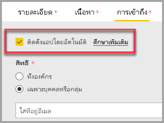

# ฝังส่วนเว็บรายงานใน SharePoint OnlineEmbed a report web part in SharePoint Online

ด้วย web part ของรายงาน Power BI ใหม่สำหรับ SharePoint Online คุณสามารถฝังรายงาน Power BI แบบโต้ตอบได้อย่างง่ายดายในหน้า SharePoint OnlineWith the new Power BI report web part for SharePoint Online, you can easily embed interactive Power BI reports in SharePoint Online pages.

เมื่อใช้ตัวเลือกใหม่ **ฝังใน SharePoint Online** รายงานแบบฝังจะคำนึงถึงการอนุญาตรายการทั้งหมดและความปลอดภัยของข้อมูลผ่าน [การรักษาความปลอดภัยระดับแถว (RLS)](../admin/service-admin-rls.md) เพื่อให้คุณสามารถสร้างพอร์ทัลภายในที่ปลอดภัยได้อย่างง่ายดายWhen using the new **Embed in SharePoint Online** option, the embedded reports respect all item permissions and data security through [row-level security (RLS)](../admin/service-admin-rls.md), so you can easily create secure internal portals.

## ข้อกำหนดRequirements

สำหรับรายงาน **ที่ฝังใน SharePoint Online** เพื่อทำงาน ต้องมี:For **Embed in SharePoint Online** reports to work, the following is required:

* สิทธิการใช้งาน Power BI Pro หรือความจุ [Power BI Premium (EM หรือ P SKU)](../admin/service-premium-what-is.md) พร้อมสิทธิการใช้งาน Power BIA Power BI Pro license or a [Power BI Premium capacity (EM or P SKU)](../admin/service-premium-what-is.md) with a Power BI license.
* Power BI web part สำหรับ SharePoint Online จำเป็นต้องใช้[หน้าที่ทันสมัย](https://support.office.com/article/Allow-or-prevent-creation-of-modern-site-pages-by-end-users-c41d9cc8-c5c0-46b4-8b87-ea66abc6e63b)The Power BI web part for SharePoint Online requires [Modern Pages](https://support.office.com/article/Allow-or-prevent-creation-of-modern-site-pages-by-end-users-c41d9cc8-c5c0-46b4-8b87-ea66abc6e63b).
* ในการใช้รายงานแบบฝัง ผู้ใช้ต้องลงชื่อเข้าใช้ในบริการของ Power BI เพื่อเปิดใช้สิทธิ์การใช้งาน Power BI ของพวกเขาTo consume an embedded report, users must sign in to Power BI service to activate their Power BI license.

> [!Note]
> สำหรับองค์กรในระบบคลาวด์ Power BI National ไม่มีสิทธิ์การใช้งานฟรีFor organizations in Power BI National clouds, there's no free license. ในสภาพแวดล้อมนี้ ผู้ใช้ทั้งหมดที่ต้องการเข้าถึงรายงานแบบฝังตัวใน Sharepoint ต้องมีสิทธิ์การใช้งาน Power BI ProIn this environment, all users who want access to the embedded report in Sharepoint need to have a Power BI Pro license.

## ฝังรายงานของคุณEmbed your report
ในการฝังรายงานของคุณลงใน SharePoint Online คุณจะต้องได้รับ URL ของรายงานและใช้กับ Web Part ของ Power BI ของ SharePoint OnlineTo embed your report into SharePoint Online, you need to get the report URL and use it with SharePoint Online's Power BI web part.

### รับ URL ของรายงานGet a report URL

1. เปิดรายงานใน Power BIOpen a report in the Power BI service.

2. บนเมนู **แชร์** ให้เลือก **ฝังรายงาน** > **SharePoint Online**On the **Share** menu, select **Embed report** > **SharePoint Online**.

    

3. คัดลอก URL ของรายงานจากกล่องโต้ตอบCopy the report URL from the dialog.

    

### เพิ่มรายงาน Power BI ลงในหน้า SharePoint OnlineAdd the Power BI report to a SharePoint Online page

1. เปิดหน้าเป้าหมายใน SharePoint Online และเลือก **แก้ไข**Open the target page in SharePoint Online and select **Edit**.

    

    หรือสร้างไซต์ที่ทันสมัยใหม่โดยการเลือก **+ ใหม่** ภายใน SharePoint OnlineOr, in Sharepoint Online, select **+ New**  to create a new modern site page.

    

2. เลือกรายงานดรอปดาวน์ **+** แล้วเลือก Web Part ของ **Power BI**Select the **+** dropdown and then select the **Power BI** web part.

    

3. เลือก **เพิ่มรายงาน**Select **Add report**.

      

4. วาง URL ของรายงานที่คัดลอกก่อนหน้านี้ไว้ที่บานหน้าต่าง **ลิงก์รายงาน Power BI**Paste the previously-copied report URL into the **Power BI report link** pane. รายงานโหลดโดยอัตโนมัติThe report loads automatically.

    

5. เลือก **เผยแพร่** เพื่อทำการเปลี่ยนแปลงการมองเห็นให้ผู้ใช้ SharePoint Online ของคุณSelect **Publish** to make the change visible to your SharePoint Online users.

    

## อนุญาตการเข้าถึงรายงานGrant access to reports

การฝังรายงานใน SharePoint Online ไม่ให้สิทธิผู้ใช้ในการดูรายงานโดยอัตโนมัติ คุณต้องตั้งค่าสิทธิการดูใน Power BIEmbedding a report in SharePoint Online doesn't automatically give users permission to view the report - you need to set view permissions in Power BI.

> [!IMPORTANT]
> ให้ตรวจสอบให้แน่ใจว่าว่าใครสามารถดูรายงานภายใน Power BI service และอนุญาตให้เข้าถึงสิ่งที่ไม่ได้อยู่ในรายการMake sure to review who can see the report within the Power BI service and grant access to those not listed.

มีสองวิธีที่ให้สิทธิการเข้าถึงรายงานใน Power BIThere are two ways to provide report access in Power BI. วิธีแรก ถ้าคุณกำลังใช้ Microsoft 365 Group เพื่อสร้างไซต์ทีม SharePoint Online ของคุณ แสดงว่าคุณได้สร้างรายการผู้ใช้ในฐานะสมาชิกของ **พื้นที่ทำงานภายในบริการของ Power BI** และ **หน้า SharePoint**The first way, if you're using a Microsoft 365 Group to build your SharePoint Online team site, is to list the user as a member of the **workspace within the Power BI service** and the **SharePoint page**. สำหรับข้อมูลเพิ่มเติม ดูวิธีการ[จัดการพื้นที่ทำงาน](service-manage-app-workspace-in-power-bi-and-office-365.md)For more information, see how to [manage a workspace](service-manage-app-workspace-in-power-bi-and-office-365.md).

วิธีสองคือการฝังรายงานภายในแอป และแชร์โดยตรงกับผู้ใช้:The second way is to embed a report within an app and share it directly with users:  

1. ผู้เขียนซึ่งต้องเป็นผู้ใช้ระดับ Pro จะสร้างรายงานในพื้นที่ทำงานThe author, who must be a Pro user, creates a report in a workspace. หากต้องการแชร์กับ *ผู้ใช้ฟรีของ Power BI* ให้ตั้งค่าพื้นที่ทำงานเป็น *พื้นที่ทำงานแบบพรีเมียม*To share with *Power BI free users*, the workspace needs to be set as a *Premium workspace*.

2. ผู้เขียนจะเผยแพร่แอป จากนั้นจะติดตั้งแอปThe author publishes the app and installs it. ผู้เขียนต้องติดตั้งแอปเพื่อให้แอปเข้าถึง URL ของรายงานที่ใช้สำหรับการฝังใน SharePoint OnlineThe author must install the app so it has access to the report URL that is used for embedding in SharePoint Online.

3. ในขั้นนี้ ผู้ใช้ทั้งหมดจำเป็นต้องติดตั้งแอปเช่นเดียวกันNow all end users need to install the app too. คุณยังสามารถใช้คุณลักษณะ **ติดตั้งแอปโดยอัตโนมัติ** ซึ่งสามารถเปิดใช้งานได้ใน [พอร์ทัลผู้ดูแลระบบ Power BI](../admin/service-admin-portal.md) เพื่อให้แอปติดตั้งล่วงหน้าสำหรับผู้ใช้ปลายทางYou can also use the **Install app automatically** feature, which you can enable in the [Power BI admin portal](../admin/service-admin-portal.md), to have the app pre-installed for end users.

   

4. ผู้เขียนเปิดแอปและไปยังรายงานThe author opens the app and goes to the report.

5. ผู้เขียนคัดลอก URL ของรายงานแบบฝังตัวจากรายงานที่แอปติดตั้งThe author copies the embed report URL from the report the app installed. อย่าใช้ URL ของรายงานต้นฉบับจากพื้นที่ทำงานDon't use the original report URL from the workspace.

6. สร้างไซต์ทีมใหม่ใน SharePoint OnlineCreate a new team site in SharePoint Online.

7. เพิ่ม URL ของรายงานที่คัดลอกก่อนนี้ใน Web Part ของ Power BIAdd the previously-copied report URL to the Power BI web part.

8. เพิ่มผู้ใช้ปลายทางและ/หรือกลุ่มทั้งหมดที่จะใช้ข้อมูลบนหน้า SharePoint Online และในแอป Power BI ที่คุณสร้างขึ้นAdd all end users and/or groups who are going to consume the data on the SharePoint Online page and in the Power BI app you created.

    > [!NOTE]
    > **ผู้ใช้หรือกลุ่มจำเป็นต้องเข้าถึงทั้งหน้า SharePoint Online และรายงานในแอป Power BI เพื่อดูรายงานบนหน้า SharePoint****Users or groups need access to both the SharePoint Online page and the report in the Power BI app to see the report on the SharePoint page.**

ในตอนนี้ ผู้ใช้ปลายทางสามารถไปยังไซต์ทีมใน SharePoint Online และดูรายงานบนหน้าได้แล้วNow the end user can go to the team site in SharePoint Online and view the reports on the page.

## การรับรองตัวตนแบบหลายปัจจัยMulti-factor authentication

ถ้าสภาพแวดล้อม Power BI ของคุณทำให้คุณต้องลงชื่อเข้าใช้ด้วยการใช้การรับรองความถูกต้องแบบหลายปัจจัย คุณอาจถูกขอให้ลงชื่อเข้าใช้ด้วยอุปกรณ์ความปลอดภัยเพื่อยืนยันข้อมูลประจำตัวของคุณIf your Power BI environment requires you to sign in using multi-factor authentication, you may be asked to sign in with a security device to verify your identity. ซึ่งเกิดขึ้นถ้าคุณไม่ได้ไม่ลงชื่อเข้าใช้ SharePoint Online โดยใช้การรับรองความถูกต้องแบบหลายปัจจัยแต่สภาพแวดล้อม Power BI ของคุณ กำหนดให้อุปกรณ์ความปลอดภัยตรวจสอบบัญชีผู้ใช้This occurs if you did not sign in to SharePoint Online using multi-factor authentication, but your Power BI environment requires a security device to validate an account.

> [!NOTE]
> Power BI ยังไม่สนับสนุนการรับรองความถูกต้องโดยใช้หลายปัจจัยด้วย Azure Active Directory 2.0 - ผู้ใช้จะเห็นข้อความแสดงข้อผิดพลาดPower BI does not yet support multi-factor authentication with Azure Active Directory 2.0 - users will see an error message. ถ้าผู้ใช้ลงชื่อเข้าใช้ SharePoint Online อีกครั้งโดยใช้อุปกรณ์ความปลอดภัยของพวกเขา พวกเขาอาจสามารถดูรายงานได้If the user signs in again to SharePoint Online using their security device, they may be able to view the report.

## ตั้งค่า web partWeb part settings

ด้านล่างคือการตั้งค่าที่คุณสามารถปรับเปลี่ยนสำหรับ Web Part ของ Power BI สำหรับ SharePoint OnlineBelow are the settings you can adjust for the Power BI web part for SharePoint Online.

| คุณสมบัติProperty | คำอธิบายDescription |
| --- | --- |
| ชื่อหน้าPage name |ตั้งค่าหน้าเริ่มต้นของ Web PartSets the web part's default page. เลือกค่าจากรายการแบบดรอปดาวน์Select a value from the drop-down. ถ้าไม่มีการแสดงหน้า รายงานของคุณมีหน้าหนึ่ง หรือ URL ที่คุณวางมีชื่อหน้าIf no pages are displayed, either your report has one page, or the URL you pasted contains a page name. ลบส่วนของรายงานจาก URL เมื่อต้องเลือกหน้าใดหน้าหนึ่งRemove the report section from the URL to select a specific page. |
| แสดงDisplay |ปรับวิธีการจัดรายงานให้พอดีกับหน้า SharePoint OnlineAdjusts how the report fits within the SharePoint Online page. |
| แสดงบานหน้าต่างนำทางShow Nav Pane |แสดงหรือซ่อนบานหน้าหน้าต่างนำทางShows or hides the page nav pane. |
| แสดงบานหน้าต่างตัวกรองShow Filter Pane |แสดงหรือซ่อนบานหน้าต่างตัวกรองShows or hides the filter pane. |

## รายงานที่โหลดไม่ได้Reports that do not load

หากรายงานของคุณอาจไม่โหลดภายใน Web Part ของ Power BI คุณอาจแสดงข้อความแสดงข้อผิดพลาดต่อไปนี้If your report does not load within the Power BI web part, you may see the following message:

มีเหตุผลโดยทั่วไปสำหรับข้อความนี้สองตัวThere are two common reasons for this message.

1. คุณไม่มีสิทธิเข้าถึงรายงานYou do not have report access.
2. รายงานถูกลบThe report was deleted.

ติดต่อกับเจ้าของหน้า SharePoint Online เพื่อช่วยแก้ไขปัญหาได้Contact the SharePoint Online page owner to help resolve the issue.

## สิทธิ์การใช้งานLicensing

การที่ผู้ใช้ดูรายงานใน SharePoint ต้องมี **ใบอนุญาตใช้งาน Power BI Pro** หรือไม่เช่นนั้นเนื้อหาต้องอยู่ในพื้นที่ทำงานที่อยู่ใน **[ความจุพรีเมียมของ Power BI (EM หรือ P SKU)](../admin/service-admin-premium-purchase.md)**Users viewing a report in SharePoint need either a **Power BI Pro license** or the content needs to be in a workspace that's in a **[Power BI Premium capacity (EM or P SKU)](../admin/service-admin-premium-purchase.md)**.

## ปัญหาและขีดจำกัดที่ทราบแล้วKnown issues and limitations

* ข้อผิดพลาด: "เกิดข้อผิดพลาด โปรดลองออกจากระบบ และย้อนกลับมา แล้วเข้ามาเยี่ยมชมหน้านี้อีกครั้งError: "An error occurred, please try logging out and back in and then revisiting this page. ID สหสัมพันธ์: ไม่ได้กำหนด http สถานะการตอบสนอง: 400 รหัสผิดพลาดของเซิร์ฟเวอร์ 10001 ข้อความ: รีเฟรชโทเค็นหายไปCorrelation ID: undefined, http response status: 400, server error code 10001, message: Missing refresh token"
  
  ถ้าคุณได้รับข้อผิดพลาดนี้ โปรดทำตามขั้นตอนการแก้ปัญหาขั้นตอนใดขั้นตอนหนึ่งด้านล่างIf you receive this error, try one of the troubleshooting steps below.
  
  1. ลงชื่อออกจาก SharePoint และลงชื่อกลับเข้าใช้Sign out of SharePoint and sign back in. ตรวจสอบให้แน่ใจว่าปิดหน้าต่างเบราว์เซอร์ทั้งหมดก่อนที่ลงชื่อกลับเข้าใช้Be sure to close all browser windows before signing back in.

  2. ถ้าบัญชีผู้ใช้ของคุณจำเป็นต้องใช้การรับรองความถูกต้องโดยใช้หลายปัจจัย (MFA) ให้ลงชื่อเข้าใช้ SharePoint โดยใช้อุปกรณ์ MFA (แอปโทรศัพท์ สมาร์ทการ์ด และอื่น ๆ)If your user account requires multi-factor authentication (MFA), then sign in to SharePoint using your MFA device (phone app, smart card, etc.).
  
  3. บัญชีผู้ใช้ Azure B2B Guest ไม่ได้รับการสนับสนุนAzure B2B Guest users accounts are not supported. ผู้ใช้เห็นโลโก้ Power BI ที่แสดงส่วนที่กำลังโหลด แต่ไม่ได้แสดงรายงานUsers see the Power BI logo that shows the part is loading, but it doesn't show the report.

* Power BI ไม่รองรับภาษาเดียวกับที่ SharePoint Online รองรับPower BI does not support the same localized languages that SharePoint Online does. ผลที่ได้คือคุณอาจไม่เห็นการแปลที่เหมาะสมภายในรายงานแบบฝังตัวAs a result, you may not see proper localization within the embedded report.

* คุณอาจพบปัญหาถ้าใช้ Internet Explorer 10You may encounter issues if using Internet Explorer 10. <!--You can look at the [browsers support for Power BI](../fundamentals/power-bi-browsers.md) and for [Microsoft 365](https://products.office.com/office-system-requirements#Browsers-section). -->

* Web part Power BI จะไม่พร้อมใช้งานสำหรับ [ระบบคลาวด์แห่งชาติ](https://powerbi.microsoft.com/clouds/)The Power BI web part is not available for [national clouds](https://powerbi.microsoft.com/clouds/).

* SharePoint Server แบบคลาสสิกไม่ได้รับการสนับสนุนด้วย web part นี้The classic SharePoint Server is not supported with this web part.

* [ตัวกรอง URL](service-url-filters.md) จะไม่ได้รับการสนับสนุนด้วย SPO web part[URL filters](service-url-filters.md) are not supported with the SPO web part.

## ขั้นตอนถัดไปNext steps

* [อนุญาตหรือป้องกันไม่ให้สร้างไซต์แบบสมัยใหม่โดยผู้ใช้ปลายทางAllow or prevent creation of modern site pages by end users](https://support.office.com/article/Allow-or-prevent-creation-of-modern-site-pages-by-end-users-c41d9cc8-c5c0-46b4-8b87-ea66abc6e63b)  
* [สร้างและกระจายแอปฯใน Power BICreate and distribute an app in Power BI](service-create-distribute-apps.md)  
* [แชร์แดชบอร์ดกับเพื่อนร่วมงานและคนอื่นๆShare a dashboard with colleagues and others](service-share-dashboards.md)  
* [Power BI Premium คืออะไร?What is Power BI Premium?](../admin/service-premium-what-is.md)
* [ฝังรายงานในพอร์ทัลความปลอดภัยหรือเว็บไซต์Embed report in a secure portal or website](service-embed-secure.md)

มีคำถามเพิ่มเติมหรือไม่More questions? [ลองถามชุมชน Power BITry asking the Power BI Community](https://community.powerbi.com/)
