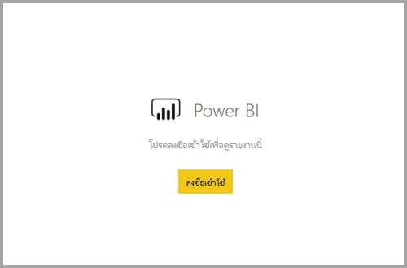

# <a name="embed-a-report-in-a-secure-portal-or-website"></a><span data-ttu-id="ef77a-103">ฝังรายงานในพอร์ทัลความปลอดภัยหรือเว็บไซต์</span><span class="sxs-lookup"><span data-stu-id="ef77a-103">Embed a report in a secure portal or website</span></span>

<span data-ttu-id="ef77a-104">ด้วยตัวเลือก **ฝังตัว** ใหม่สำหรับรายงาน Power BI คุณสามารถฝังรายงานได้อย่างง่ายดายและปลอดภัยในเว็บพอร์ทัลภายใน</span><span class="sxs-lookup"><span data-stu-id="ef77a-104">With the new **Embed** option for Power BI reports, you can easily and securely embed reports in internal web portals.</span></span> <span data-ttu-id="ef77a-105">พอร์ทัลเหล่านี้สามารถอยู่ **บนคลาวด์** หรือ **ที่โฮสต์ในองค์กร** เช่น SharePoint 2019 ก็ได้</span><span class="sxs-lookup"><span data-stu-id="ef77a-105">These portals can be **cloud-based** or **hosted on-premises**, such as SharePoint 2019.</span></span> <span data-ttu-id="ef77a-106">รายงานแบบฝังจะคำนึงถึงการอนุญาตรายการทั้งหมดและความปลอดภัยของข้อมูลผ่าน[การรักษาความปลอดภัยระดับแถว (RLS)](../admin/service-admin-rls.md)</span><span class="sxs-lookup"><span data-stu-id="ef77a-106">Embedded reports respect all item permissions and data security through [row-level security (RLS)](../admin/service-admin-rls.md).</span></span> <span data-ttu-id="ef77a-107">ฟีเจอร์นี้ถูกออกแบบมาเพื่อให้ไม่มีโค้ดที่ฝังลงในพอร์ทัลใดก็ตามที่ยอมรับ URL หรือ iFrame</span><span class="sxs-lookup"><span data-stu-id="ef77a-107">They provide no-code embedding into any portal that accepts a URL or iFrame.</span></span> 

<span data-ttu-id="ef77a-108">ตัวเลือก **ฝังตัว** รองรับ [ตัวกรอง URL](service-url-filters.md) และการตั้งค่า URL</span><span class="sxs-lookup"><span data-stu-id="ef77a-108">The **Embed** option supports [URL filters](service-url-filters.md) and URL settings.</span></span> <span data-ttu-id="ef77a-109">ซึ่งช่วยให้คุณสามารถบูรณาการร่วมกับพอร์ทัลโดยใช้วิธีการที่เขียนโค้ดน้อยมากซึ่งต้องการเพียงความรู้พื้นฐาน HTML และ JavaScript เท่านั้น</span><span class="sxs-lookup"><span data-stu-id="ef77a-109">It allows you to integrate with portals using a low-code approach requiring only basic HTML and JavaScript knowledge.</span></span>

## <a name="how-to-embed-power-bi-reports-into-portals"></a><span data-ttu-id="ef77a-110">วิธีการฝังรายงาน Power BI ลงในพอร์ทัล</span><span class="sxs-lookup"><span data-stu-id="ef77a-110">How to embed Power BI reports into portals</span></span>

1. <span data-ttu-id="ef77a-111">เปิดรายงานใน Power BI</span><span class="sxs-lookup"><span data-stu-id="ef77a-111">Open a report in the Power BI service.</span></span>

2. <span data-ttu-id="ef77a-112">บนเมนู **แชร์** ให้เลือก **ฝังรายงาน** >  **เว็บไซต์หรือพอร์ทัล**</span><span class="sxs-lookup"><span data-stu-id="ef77a-112">On the **Share** menu, select **Embed report** >  **Website or portal**.</span></span>

    

2. <span data-ttu-id="ef77a-114">ในกล่องโต้ตอบ **รักษาความปลอดภัยโค้ดแบบฝังตัว** ให้เลือก **ลิงก์ที่คุณสามารถใช้เพื่อฝังเนื้อหานี้** หรือ **HTML ที่คุณสามารถวางลงในบล็อกหรือเว็บไซต์** ของคุณใน iFrame ได้</span><span class="sxs-lookup"><span data-stu-id="ef77a-114">In the **Secure embed code** dialog, select the **link you can use to embed this content**, or the **HTML you can paste into your blog or website** in an iFrame.</span></span>

    

3. <span data-ttu-id="ef77a-116">ไม่ว่าผู้ใช้จะเปิด URL รายงานโดยตรงหรือฝังอยู่ในเว็บพอร์ทัล การเข้าถึงรายงานต้องมีการรับรองความถูกต้อง</span><span class="sxs-lookup"><span data-stu-id="ef77a-116">Whether a user opens a report URL directly, or one embedded in a web portal, report access requires authentication.</span></span> <span data-ttu-id="ef77a-117">หน้าจอต่อไปนี้จะปรากฏขึ้นหากผู้ใช้ไม่ได้ลงชื่อเข้าใช้ Power BI ในเซสชันเบราว์เซอร์</span><span class="sxs-lookup"><span data-stu-id="ef77a-117">The following screen appears if a user has not signed-in to Power BI in their browser session.</span></span> <span data-ttu-id="ef77a-118">เมื่อพวกเขาเลือก **ลงชื่อเข้าใช้** หน้าต่างเบราว์เซอร์หรือแท็บใหม่อาจเปิดขึ้น</span><span class="sxs-lookup"><span data-stu-id="ef77a-118">When they select **Sign-In**, a new browser window or tab could open.</span></span> <span data-ttu-id="ef77a-119">ให้พวกเขาตรวจสอบตัวบล็อกป๊อปอัปหากไม่ได้รับพร้อมท์แจ้งให้ลงชื่อเข้าใช้</span><span class="sxs-lookup"><span data-stu-id="ef77a-119">Have them check for pop-up blockers if they don't get prompted to sign in.</span></span>

    

4. <span data-ttu-id="ef77a-121">หลังจากผู้ใช้ลงชื่อเข้าใช้ รายงานจะเปิดขึ้น แสดงข้อมูลและอนุญาตให้ใช้งานการนำทางระหว่างหน้าและการตั้งค่าตัวกรอง</span><span class="sxs-lookup"><span data-stu-id="ef77a-121">After the user has signed in, the report opens, showing the data and allowing page navigation and filter setting.</span></span> <span data-ttu-id="ef77a-122">เฉพาะผู้ใช้ที่มีสิทธิ์ดูเท่านั้นที่สามารถดูรายงานใน Power BI</span><span class="sxs-lookup"><span data-stu-id="ef77a-122">Only users who have view permission can see the report in Power BI.</span></span> <span data-ttu-id="ef77a-123">กฎ[การรักษาความปลอดภัยระดับแถว (RLS)](../admin/service-admin-rls.md) ทั้งหมดจะถูกนำไปใช้เช่นกัน</span><span class="sxs-lookup"><span data-stu-id="ef77a-123">All [row-level security (RLS)](../admin/service-admin-rls.md) rules are also applied.</span></span> <span data-ttu-id="ef77a-124">สุดท้ายนี้ ผู้ใช้จะต้องมีงสิทธิ์อย่างถูกต้อง – ไม่ว่าพวกเขาต้องการให้สิทธิ์การใช้งาน Power BI Pro หรือรายงานต้องอยู่ในพื้นที่ทำงานที่อยู่ในความจุ Power BI Premium ก็ตาม</span><span class="sxs-lookup"><span data-stu-id="ef77a-124">Lastly, the user needs to be correctly licensed – either they need a Power BI Pro license, or the report must be in a workspace that is in a Power BI Premium capacity.</span></span> <span data-ttu-id="ef77a-125">ผู้ใช้ต้องลงชื่อเข้าใช้ทุกครั้งที่เปิดหน้าต่างเบราว์เซอร์ใหม่</span><span class="sxs-lookup"><span data-stu-id="ef77a-125">The user needs to sign in each time they open a new browser window.</span></span> <span data-ttu-id="ef77a-126">อย่างไรก็ตามเมื่อลงชื่อเข้าใช้แล้ว รายงานอื่นจะโหลดขึ้นโดยอัตโนมัติ</span><span class="sxs-lookup"><span data-stu-id="ef77a-126">However, once signed in, other reports load automatically.</span></span>

    

5. <span data-ttu-id="ef77a-128">เมื่อใช้ iFrame คุณอาจต้องแก้ไข **ความสูง** และ **ความกว้าง** เพื่อปรับให้พอดีกับหน้าเว็บพอร์ทัลของคุณ</span><span class="sxs-lookup"><span data-stu-id="ef77a-128">When using an iFrame, you may need to edit the **height** and **width** to have it fit in your portal's web page.</span></span>

    

## <a name="granting-report-access"></a><span data-ttu-id="ef77a-130">ให้สิทธิ์การเข้าถึงรายงาน</span><span class="sxs-lookup"><span data-stu-id="ef77a-130">Granting report access</span></span>

<span data-ttu-id="ef77a-131">ตัวเลือก **ฝังตัว** ตัวไม่อนุญาตให้ผู้ใช้ดูรายงานโดยอัตโนมัติ</span><span class="sxs-lookup"><span data-stu-id="ef77a-131">The **Embed** option doesn't automatically permit users to view the report.</span></span> <span data-ttu-id="ef77a-132">คุณสามารถตั้งค่าสิทธิ์ในการดูได้ในบริการของ Power BI</span><span class="sxs-lookup"><span data-stu-id="ef77a-132">View permissions are set in the Power BI service.</span></span>

<span data-ttu-id="ef77a-133">ในบริการของ Power BI คุณสามารถแชร์รายงานแบบฝังกับผู้ใช้ที่ต้องการการเข้าถึง</span><span class="sxs-lookup"><span data-stu-id="ef77a-133">In the Power BI service, you can share embedded reports with users requiring access.</span></span> <span data-ttu-id="ef77a-134">หากคุณกำลังใช้ Microsoft 365 Group คุณสามารถแสดงรายชื่อผู้ใช้ในฐานะสมาชิกของพื้นที่ทำงานได้</span><span class="sxs-lookup"><span data-stu-id="ef77a-134">If you're using a Microsoft 365 Group, you can list the user as a workspace member.</span></span> <span data-ttu-id="ef77a-135">สำหรับข้อมูลเพิ่มเติม โปรดดูวิธีการ [จัดการพื้นที่ทำงานใน Power BI และ Microsoft 365](service-manage-app-workspace-in-power-bi-and-office-365.md)</span><span class="sxs-lookup"><span data-stu-id="ef77a-135">For more information, see how to [manage your workspace in Power BI and Microsoft 365](service-manage-app-workspace-in-power-bi-and-office-365.md).</span></span>

## <a name="licensing"></a><span data-ttu-id="ef77a-136">สิทธิ์การใช้งาน</span><span class="sxs-lookup"><span data-stu-id="ef77a-136">Licensing</span></span>

<span data-ttu-id="ef77a-137">หากต้องการดูรายงานแบบฝังตัว ผู้ใช้จำเป็นต้องมีสิทธิการใช้งาน Power BI Pro หรือไม่เช่นนั้นเนื้อหาต้องอยู่ในพื้นที่ทำงานที่อยู่ใน [ความจุพรีเมียมของ Power BI (EM หรือ P SKU)](../admin/service-admin-premium-purchase.md)</span><span class="sxs-lookup"><span data-stu-id="ef77a-137">To view the embedded report, users need either a Power BI Pro license or the content needs to be in a workspace that's in a [Power BI Premium capacity (EM or P SKU)](../admin/service-admin-premium-purchase.md).</span></span>

## <a name="customize-your-embed-experience-using-url-settings"></a><span data-ttu-id="ef77a-138">กำหนดการใช้งานการฝังตัวของคุณโดยใช้การตั้งค่า URL</span><span class="sxs-lookup"><span data-stu-id="ef77a-138">Customize your embed experience using URL settings</span></span>

<span data-ttu-id="ef77a-139">คุณสามารถปรับแต่งประสบการณ์ผู้ใช้โดยใช้การตั้งค่าการป้อนข้อมูลของ URL แบบฝังตัวได้</span><span class="sxs-lookup"><span data-stu-id="ef77a-139">You can customize the user experience using the embed URL's input settings.</span></span> <span data-ttu-id="ef77a-140">ใน iFrame ที่ให้มาคุณสามารถอัปเดตการตั้งค่า **src** ของ URL ได้</span><span class="sxs-lookup"><span data-stu-id="ef77a-140">In the provided iFrame, you can update the URL's  **src** settings.</span></span>

| <span data-ttu-id="ef77a-141">คุณสมบัติ</span><span class="sxs-lookup"><span data-stu-id="ef77a-141">Property</span></span>  | <span data-ttu-id="ef77a-142">คำอธิบาย</span><span class="sxs-lookup"><span data-stu-id="ef77a-142">Description</span></span>  |
|-----------|--------------|
| <span data-ttu-id="ef77a-143">pageName</span><span class="sxs-lookup"><span data-stu-id="ef77a-143">pageName</span></span>  | <span data-ttu-id="ef77a-144">คุณสามารถใช้พารามิเตอร์ของสตริงคิวรี **pageName** เพื่อตั้งค่าหน้ารายงานที่จะเปิดได้</span><span class="sxs-lookup"><span data-stu-id="ef77a-144">You can use the **pageName** query string parameter to set which report page to open.</span></span> <span data-ttu-id="ef77a-145">ค่คุณสามารถค้นหาค่านี้ได้ที่ส่วนท้าย URL รายงานเมื่อดูรายงานในบริการของ Power BI ดังที่แสดงด้านล่าง</span><span class="sxs-lookup"><span data-stu-id="ef77a-145">You can find this value at the report URL's end when viewing a report in the Power BI service, as shown below.</span></span> |
| <span data-ttu-id="ef77a-146">ตัวกรอง URL</span><span class="sxs-lookup"><span data-stu-id="ef77a-146">URL Filters</span></span>  | <span data-ttu-id="ef77a-147">คุณสามารถใช้[ตัวกรอง URL](service-url-filters.md)ใน URL แบบฝังที่คุณได้รับจาก UI ของ Power BI เพื่อกรองเนื้อหาการฝัง</span><span class="sxs-lookup"><span data-stu-id="ef77a-147">You can use [URL Filters](service-url-filters.md) in the embed URL you received from the Power BI UI to filter the embed content.</span></span> <span data-ttu-id="ef77a-148">วิธีนี้คุณสามารถสร้างการรวมรหัสแบบต่ำด้วยการใช้งาน HTML และ JavaScript ขั้นพื้นฐานเท่านั้น</span><span class="sxs-lookup"><span data-stu-id="ef77a-148">This way you can build low-code integrations with only basic HTML and JavaScript experience.</span></span>  |

## <a name="set-which-page-opens-for-an-embedded-report"></a><span data-ttu-id="ef77a-149">ตั้งค่าเพจที่จะเปิดขึ้นสำหรับรายงานแบบฝังตัว</span><span class="sxs-lookup"><span data-stu-id="ef77a-149">Set which page opens for an embedded report</span></span> 

<span data-ttu-id="ef77a-150">คุณสามารถค้นหาค่า **pageName** ที่ส่วนท้ายของ URL ของรายงานเมื่อดูรายงานในบริการ Power BI</span><span class="sxs-lookup"><span data-stu-id="ef77a-150">You can find the **pageName** value at the report URL's end  when viewing a report in the Power BI service.</span></span>

1. <span data-ttu-id="ef77a-151">เปิดรายงานจากบริการ Power BI ในเว็บเบราว์เซอร์ของคุณ และจากนั้น คัดลอก URL จากแถบที่อยู่</span><span class="sxs-lookup"><span data-stu-id="ef77a-151">Open the report from the Power BI service in your web browser, and then copy the address bar URL.</span></span>

    

2. <span data-ttu-id="ef77a-153">ผนวกการตั้งค่า **pageName** เป็น URL</span><span class="sxs-lookup"><span data-stu-id="ef77a-153">Append the **pageName** setting to the URL.</span></span>

    

## <a name="filter-report-content-using-url-filters"></a><span data-ttu-id="ef77a-155">กรองเนื้อหารายงานโดยใช้ตัวกรอง URL</span><span class="sxs-lookup"><span data-stu-id="ef77a-155">Filter report content using URL filters</span></span> 

<span data-ttu-id="ef77a-156">คุณสามารถใช้ [ตัวกรอง URL](service-url-filters.md) เพื่อให้มุมมองรายงานที่แตกต่างกัน</span><span class="sxs-lookup"><span data-stu-id="ef77a-156">You can use [URL Filters](service-url-filters.md) to provide different report views.</span></span> <span data-ttu-id="ef77a-157">ตัวอย่างเช่น URL ด้านล่างจะกรองรายงานเพื่อแสดงข้อมูลสำหรับอุตสาหกรรมพลังงาน</span><span class="sxs-lookup"><span data-stu-id="ef77a-157">For example, the URL below filters the report to show data for the Energy industry.</span></span>

<span data-ttu-id="ef77a-158">ใช้ชุดของ **pageName** และ [ตัวกรอง URL](service-url-filters.md)จะทำให้มีประสิทธิภาพมากขึ้น</span><span class="sxs-lookup"><span data-stu-id="ef77a-158">Using the combination of **pageName** and [URL Filters](service-url-filters.md) can be powerful.</span></span> <span data-ttu-id="ef77a-159">คุณสามารถสร้างประสบการณ์การใช้งานที่ใช้ HTML และ JavaScript พื้นฐานได้</span><span class="sxs-lookup"><span data-stu-id="ef77a-159">You can build experiences using basic HTML and JavaScript.</span></span>

<span data-ttu-id="ef77a-160">ตัวอย่างเช่น นี่คือปุ่มที่คุณสามารถเพิ่มไปยังหน้า HTML:</span><span class="sxs-lookup"><span data-stu-id="ef77a-160">For example, here's a button you can add to an HTML page:</span></span>

```html
<button class="textLarge" onclick='show("ReportSection", "Energy");' style="display: inline-block;">Show Energy</button>
```

<span data-ttu-id="ef77a-161">เมื่อเลือกแล้วปุ่มจะเรียกใช้ฟังก์ชันเพื่ออัปเดต iFrame ที่มี URL ที่อัปเดตแล้ว ซึ่งรวมถึงตัวกรองสำหรับอุตสาหกรรมพลังงาน</span><span class="sxs-lookup"><span data-stu-id="ef77a-161">When selected, the button calls a function to update the iFrame with an updated URL, which includes the Energy industry filter.</span></span>

```javascript
function show(pageName, filterValue)

{

var newUrl = baseUrl + "&pageName=" + pageName;

if(null != filterValue && "" != filterValue)

{

newUrl += "&$filter=Industries/Industry eq '" + filterValue + "'";

}

//Assumes there's an iFrame on the page with id="iFrame"

var report = document.getElementById("iFrame")

report.src = newUrl;

}
```


<span data-ttu-id="ef77a-163">คุณสามารถเพิ่มปุ่มได้มากเท่าที่คุณต้องการเพื่อสร้างประสบการณ์แบบกำหนดเองด้วยการใช้รหัสต่ำ</span><span class="sxs-lookup"><span data-stu-id="ef77a-163">You can add as many buttons as you'd like to create a low-code custom experience.</span></span> 

## <a name="considerations-and-limitations"></a><span data-ttu-id="ef77a-164">ข้อควรพิจารณาและข้อจำกัด</span><span class="sxs-lookup"><span data-stu-id="ef77a-164">Considerations and limitations</span></span>

* <span data-ttu-id="ef77a-165">สนับสนุนรายงานที่มีการแบ่งหน้าพร้อมสถานการณ์การฝังที่ปลอดภัย และยังสนับสนุนรายงานที่มีการแบ่งหน้าพร้อมพารามิเตอร์ URL ด้วย</span><span class="sxs-lookup"><span data-stu-id="ef77a-165">Paginated reports are supported with secure embed scenarios, and paginated reports with URL parameters are also supported.</span></span> <span data-ttu-id="ef77a-166">อ่านเพิ่มเติมเกี่ยวกับ [การส่งผ่านพารามิเตอร์รายงานใน URL สำหรับรายงานที่มีการแบ่งหน้า](../paginated-reports/report-builder-url-pass-parameters.md)</span><span class="sxs-lookup"><span data-stu-id="ef77a-166">Read more about [passing report parameters in a URL for a paginated report](../paginated-reports/report-builder-url-pass-parameters.md).</span></span>

* <span data-ttu-id="ef77a-167">ฝังการรักษาความปลอดภัยสำหรับรายงานที่เผยแพร่ไปยังบริการ Power BI</span><span class="sxs-lookup"><span data-stu-id="ef77a-167">Secure embed works for reports published to the Power BI service.</span></span>

* <span data-ttu-id="ef77a-168">ผู้ใช้ต้องลงชื่อเข้าใช้เพื่อดูรายงานทุกครั้งที่เปิดหน้าต่างเบราว์เซอร์ใหม่</span><span class="sxs-lookup"><span data-stu-id="ef77a-168">The user needs to sign in to view the report whenever they open a new browser window.</span></span>

* <span data-ttu-id="ef77a-169">เบราว์เซอร์บางตัวต้องการให้คุณรีเฟรชหน้าเว็บหลังจากลงชื่อเข้าใช้โดยเฉพาะเมื่อใช้โหมด InPrivate หรือไม่ระบุตัวตน</span><span class="sxs-lookup"><span data-stu-id="ef77a-169">Some browsers require you to refresh the page after sign-in, especially when using  InPrivate or Incognito modes.</span></span>

* <span data-ttu-id="ef77a-170">คุณอาจพบปัญหาหากใช้เบราว์เซอร์รุ่นที่ไม่สนับสนุน</span><span class="sxs-lookup"><span data-stu-id="ef77a-170">You may encounter issues if using unsupported browser versions.</span></span> <span data-ttu-id="ef77a-171">Power BI รองรับ [เบราว์เซอร์ต่อไปนี้](../fundamentals/power-bi-browsers.md)</span><span class="sxs-lookup"><span data-stu-id="ef77a-171">Power BI supports [the following list of browsers](../fundamentals/power-bi-browsers.md).</span></span>

* <span data-ttu-id="ef77a-172">เซิร์ฟเวอร์ SharePoint แบบคลาสสิกไม่ได้รับการสนับสนุน เนื่องจากจำเป็นต้องมี Internet Explorer เวอร์ชันเก่ากว่า 11 หรือเปิดใช้งานโหมดมุมมองที่เข้ากันได้</span><span class="sxs-lookup"><span data-stu-id="ef77a-172">The classic SharePoint Server isn't supported, as it requires Internet Explorer versions earlier than 11, or enabling the compatibility view mode.</span></span>

* <span data-ttu-id="ef77a-173">เพื่อให้ได้รับประสบการณ์การลงชื่อเข้าใช้เพียงครั้งเดียว ให้ใช้ [ตัวเลือกฝังใน SharePoint Online](service-embed-report-spo.md) หรือสร้างการบูรณาการแบบกำหนดเองโดยวิธีการฝังตัวแบบ [ผู้ใช้เป็นเจ้าของข้อมูล](../developer/embedded/embed-sample-for-your-organization.md)</span><span class="sxs-lookup"><span data-stu-id="ef77a-173">To achieve a single sign-on experience, use the [Embed in SharePoint Online option](service-embed-report-spo.md), or build a custom integration using the [user owns data](../developer/embedded/embed-sample-for-your-organization.md) embedding method.</span></span> 

* <span data-ttu-id="ef77a-174">ความสามารถในการรับรองความถูกต้องโดยอัตโนมัติที่มาพร้อมกับการ **ฝัง** ตัวเลือกที่ไม่ทำงานกับ Power BI JavaScript API</span><span class="sxs-lookup"><span data-stu-id="ef77a-174">The automatic authentication capability provided with the **Embed** option doesn't work with the Power BI JavaScript API.</span></span> <span data-ttu-id="ef77a-175">สำหรับ Power BI JavaScript API ให้ใช้วิธีการฝังตัวแบบ [ผู้ใช้เป็นเจ้าของข้อมูล](../developer/embedded/embed-sample-for-your-organization.md)</span><span class="sxs-lookup"><span data-stu-id="ef77a-175">For the Power BI JavaScript API, use the [user owns data](../developer/embedded/embed-sample-for-your-organization.md) embedding method.</span></span> 

* <span data-ttu-id="ef77a-176">อายุการใช้งานโทเค็นการรับรองความถูกต้องจะถูกควบคุมตามการตั้งค่า AAD ของคุณ</span><span class="sxs-lookup"><span data-stu-id="ef77a-176">The authentication token lifetime is controlled based on your AAD settings.</span></span> <span data-ttu-id="ef77a-177">เมื่อโทเค็นการรับรองความถูกต้องหมดอายุ ผู้ใช้จะต้องรีเฟรชเบราว์เซอร์เพื่อรับโทเค็นการรับรองความถูกต้องที่อัปเดตแล้ว</span><span class="sxs-lookup"><span data-stu-id="ef77a-177">When the authentication token expires, the user will need to refresh their browser to get an updated authentication token.</span></span> <span data-ttu-id="ef77a-178">อายุการใช้งานเริ่มต้นคือหนึ่งชั่วโมง แต่อาจมีความยาวน้อยกว่าหรือนานกว่าในองค์กรของคุณ</span><span class="sxs-lookup"><span data-stu-id="ef77a-178">The default lifetime is one hour, but it could be shorter or longer in your organization.</span></span>  <span data-ttu-id="ef77a-179">ไม่มีความสามารถในการรีเฟรชโทเค็นในสถานการณ์นี้โดยอัตโนมัติ</span><span class="sxs-lookup"><span data-stu-id="ef77a-179">There is no ability to automatically refresh the token in this scenario.</span></span>

## <a name="next-steps"></a><span data-ttu-id="ef77a-180">ขั้นตอนถัดไป</span><span class="sxs-lookup"><span data-stu-id="ef77a-180">Next steps</span></span>

* [<span data-ttu-id="ef77a-181">วิธีการแชร์งานของคุณใน Power BI</span><span class="sxs-lookup"><span data-stu-id="ef77a-181">Ways to share your work in Power BI</span></span>](service-how-to-collaborate-distribute-dashboards-reports.md)

* [<span data-ttu-id="ef77a-182">กรองรายงานโดยใช้พารามิเตอร์ของสตริงคิวรีใน URL</span><span class="sxs-lookup"><span data-stu-id="ef77a-182">Filter a report using query string parameters in the URL</span></span>](service-url-filters.md)

* [<span data-ttu-id="ef77a-183">ฝังด้วยส่วนเว็บรายงานใน SharePoint Online</span><span class="sxs-lookup"><span data-stu-id="ef77a-183">Embed with report web part in SharePoint Online</span></span>](service-embed-report-spo.md)

* [<span data-ttu-id="ef77a-184">เผยแพร่บนเว็บจาก Power BI</span><span class="sxs-lookup"><span data-stu-id="ef77a-184">Publish to Web from Power BI</span></span>](service-publish-to-web.md)
