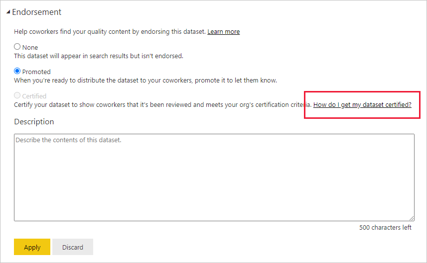

# รับรองเนื้อหาของคุณEndorse your content

Power BI เสนอวิธีการสองวิธีที่คุณสามารถใช้รับรองเนื้อหาคุณภาพสูงที่มีคุณค่าของคุณเพื่อเพิ่มการมองเห็นได้: **การเลื่อนระดับ** และ **ใบรับรอง**Power BI provides two ways you can endorse your valuable, high-quality content to increase its visibility: **promotion** and **certification**.

* **การเลื่อนระดับ**: การเลื่อนระดับ คือวิธีการเน้นเนื้อหาที่คุณคิดว่า มีคุณค่าและคุ้มค่าสำหรับผู้อื่นในการใช้งาน**Promotion**: Promotion is a way to highlight content you think is valuable and worthwhile for others to use. สำหรับวิธีการนี้ จะช่วยรองรับเครือข่ายการใช้งานและการเผยแพร่เนื้อหาภายในองค์กรIt encourages the collaborative use and spread of content within an organization.

    เจ้าของเนื้อหาใด ๆ รวมทั้งสมาชิกใดที่มีสิทธิ์เขียนบนพื้นที่ทำงานทีเนื้อหานั้นตั้งอยู่ จะสามารถเลื่อนระดับข้อมูลได้ เมื่อพวกเขาคิดว่าเนื้อหานั้นดีเพียงพอที่จะแชร์Any content owner, as well as any member with write permissions on the workspace where the content is located, can promote the content when they think it's good enough for sharing.

* **การออกใบรับรอง**: ใบรับรอง หมายถึง เนื้อหาตรงกับมาตรฐานคุณภาพขององค์กร และถือได้ว่าเป็นเนื้อหาที่เชื่อถือได้และมีสิทธิ์ที่พร้อมสำหรับการใช้งานทั่วทั้งองค์กร**Certification**: Certification means that the content meets the organization's quality standards and can be regarded as reliable, authoritative, and ready for use across the organization.

    เฉพาะ[ผู้ตรวจสอบที่ได้รับอนุญาต (กำหนดโดยผู้ดูแลระบบ Power BI) เท่านั้น](../admin/service-admin-setup-certification.md)ที่สามารถรับรองเนื้อหาได้Only [authorized reviewers (defined by the Power BI administrator)](../admin/service-admin-setup-certification.md) can certify content. เจ้าของเนื้อหาที่ต้องการดูเนื้อหาที่ผ่านการรับรองและไม่ได้รับอนุญาตให้รับรองความถูกต้องจำเป็นต้องปฏิบัติตามแนวทางขององค์กรเกี่ยวกับการรับการรับรองเนื้อหาContent owners who wish to see their content certified and are not authorized to certify it themselves need to follow their organization's guidelines about getting their content certified.

ในขณะนี้ คุณสามารถรับรองความถูกต้องได้Currently it is possible to endorse
* ชุดข้อมูลDatasets
* กระแสข้อมูล (ตัวอย่าง)Dataflows (preview)
* รายงาน (ตัวอย่าง)Reports (preview)
* แอป (ตัวอย่าง)Apps (preview)

บทความนี้อธิบายวิธีการ[เลื่อนระดับเนื้อหา](#promote-content) วิธีการ[รับรองเนื้อหา](#certify-content) ถ้าคุณเป็นผู้ตรวจสอบที่ได้รับอนุญาต และวิธีการ[ร้องขใบรับรอง](#request-content-certification) ถ้าคุณไม่ได้เป็นผู้ตรวจสอบที่ได้รับอนุญาตThis article describes how to [promote content](#promote-content), how to [certify content](#certify-content) if you're an authorized reviewer, and how to [request certification](#request-content-certification) if you're not.

ดูที่ [การรับรอง: การเลื่อนระดับและการรับรองเนื้อหา Power BI](service-endorsement-overview.md) เพื่อเรียนรู้เพิ่มเติมเกี่ยวกับการรับรองSee [Endorsement: Promoting and certifying Power BI content](service-endorsement-overview.md) to learn more about endorsement.

## เลื่อนระดับเนื้อหาPromote content

เมื่อต้องการเลื่อนระดับเนื้อหา คุณจะต้องมีสิทธิ์ในการเขียนในพื้นที่ทำงานที่มีเนื้อหาที่คุณต้องการเลื่อนระดับตั้งอยู่To promote content, you must have write permissions the workspace where the content you want to promote is located.

>[!NOTE]
>สำหรับวัตถุประสงค์ของภาพประกอบ กล่องโต้ตอบการรับรองความถูกต้องสำหรับชุดข้อมูลจะแสดงอยู่ด้านล่างFor the purposes of illustration, the endorsement dialog for datasets is shown below. กล่องโต้ตอบสำหรับชนิดเนื้อหาอื่น ๆ จะคล้ายคลึงอย่างมากกับกับตัวเลือกบนปุ่มวิทยุที่ตรงกันThe dialogs for the other content types are almost identical, with the same radio button options. 

1. ไปที [่การตั้งค่า](#how-to-get-to-content-settings) ของเนื้อหาที่คุณต้องการเลื่อนระดับGo to the [settings](#how-to-get-to-content-settings) of the content you want to promote.

1. ขยายส่วนการรับรอง และเลือก **เลื่อนระดับแล้ว**Expand the endorsement section and select **Promoted**. ถ้าคุณกำลังเลื่อนระดับชุดข้อมูล ให้ใส่คำอธิบายโดยสังเขปของชุดข้อมูลIf you're promoting a dataset, provide a brief description of the dataset.

    

1. เลือก **นำไปใช้**Select **Apply**.

## รับรองเนื้อหาCertify content

การรับรองเนื้อหาเป็นหน้าที่ความรับผิดชอบใหญ่ และเฉพาะผู้ใช้ที่ได้รับอนุญาตเท่านั้นที่สามารถรับรองเนื้อหาได้Content certification is a big responsibility, and only authorized users can certify content. ผู้ใช้อื่นสามารถ[ร้องขอการรับรองความถูกต้องของเนื้อหา](#request-content-certification)ได้Other users can [request content certification](#request-content-certification). ในส่วนนี้จะอธิบายวิธีการรับรองความถูกต้องของเนื้อหาThis section describes how to certify content.

>[!NOTE]
>สำหรับวัตถุประสงค์ของภาพประกอบ กล่องโต้ตอบการรับรองความถูกต้องสำหรับชุดข้อมูลจะแสดงอยู่ด้านล่างFor the purposes of illustration, the endorsement dialog for datasets is shown below. กล่องโต้ตอบสำหรับชนิดเนื้อหาอื่น ๆ จะคล้ายคลึงอย่างมากกับกับตัวเลือกบนปุ่มวิทยุที่ตรงกันThe dialogs for the other content types are almost identical, with the same radio button options. 

1. รับสิทธิ์การเขียนบนพื้นที่ทำงานที่มีเนื้อหาที่คุณต้องการรับรองอยู่Get write permissions on the workspace where the content you want to certify is located. คุณสามารถร้องขอสิทธิ์เหล่านี้จากเจ้าของเนื้อหา หรือจากทุกคนที่มีสิทธิ์ระดับผู้ดูแลระบบในพื้นที่ทำงานYou can request these permissions from the content owner or from anyone with admin permissions on the workspace.

1. ตรวจทานเนื้อหาอย่างละเอียด และพิจารณาว่าเป็นไปตามมาตรฐานใบรับรองขององค์กรของคุณหรือไม่Carefully review the content and determine whether it meets your organization's certification standards.

1. ถ้าคุณตัดสินใจที่จะรับรองเนื้อหา ไปยังพื้นที่ทำงานที่มีอยู่แล้ว เปิด [การตั้งค่า](#how-to-get-to-content-settings) ของเนื้อหาที่คุณต้องการรับรองIf you decide to certify the content, go to the workspace where it resides, and then open the [settings](#how-to-get-to-content-settings) of the content you want to certify.

1. ขยายส่วนการรับรอง และเลือก **รับรองแล้ว**Expand the endorsement section and select **Certified**. 

    

1. เลือก **นำไปใช้**Select **Apply**.

## ร้องขอใบรับรองเนื้อหาRequest content certification

หากคุณต้องการรับรองเนื้อหาของคุณ แต่ไม่ได้รับอนุญาตให้ดำเนินการดังกล่าว ให้ทำตามขั้นตอนด้านล่างIf you would like to certify your content but are not authorized to do so, follow the steps below.

>[!NOTE]
>สำหรับวัตถุประสงค์ของภาพประกอบ กล่องโต้ตอบการรับรองความถูกต้องสำหรับชุดข้อมูลจะแสดงอยู่ด้านล่างFor the purposes of illustration, the endorsement dialog for datasets is shown below. กล่องโต้ตอบสำหรับชนิดเนื้อหาอื่น ๆ จะคล้ายคลึงอย่างมากกับกับตัวเลือกบนปุ่มวิทยุที่ตรงกันThe dialogs for the other content types are almost identical, with the same radio button options. 

1. ไปยังพื้นที่ทำงานที่เนื้อหาที่คุณต้องการได้รับการรับรองอยู่ จากนั้นเปิด [การตั้งค่า](#how-to-get-to-content-settings) ของเนื้อหานั้นGo to the workspace where the content you want to be certified is located, and then open the [settings](#how-to-get-to-content-settings) of that content.

1. ขยายส่วนการรับรองExpand the endorsement section. ปุ่ม **รับรองแล้ว** จะกลายเป็นสีเทา เนื่องจากคุณไม่ได้รับอนุญาตให้รับรองเนื้อหาThe **Certified** button is greyed out since you are not authorized to certify content. คลิกลิงก์เกี่ยวกับวิธีการที่ทำให้เนื้อหาของคุณผ่านการรับรองClick the link about how to get your content certified.

    
    
    >[!NOTE]
    >ถ้าคุณคลิกที่ลิงก์ด้านบน แต่ได้เปลี่ยนเส้นทางกลับไปยังบันทึกย่อนี้ นั่นหมายความว่า ผู้ดูแลระบบ Power BI ของคุณไม่ได้สร้างข้อมูลใด ๆ ที่พร้อมใช้งานIf you clicked the link above but got redirected back to this note, it means that your Power BI admin has not made any information available. ในกรณีนี ้โปรดติดต่อผู้ดูแลระบบ Power BI โดยตรงIn this case, contact the Power BI admin directly.

## วิธีการเข้าถึงการตั้งค่าเนื้อหาHow to get to content settings

กล่องโต้ตอบการรับรอง สามารถเข้าถึงได้ผ่านการตั้งค่าเนื้อหาที่คุณต้องการรับรองThe Endorsement dialog is accessed through the settings of the content you want to endorse. ทำตามคำแนะนำด้านล่าง เพื่อไปยังการตั้งค่าสำหรับแต่ละชนิดเนื้อหาFollow the instructions below to get to the settings for each content type.

* **ชุดข้อมูล**: ในมุมมองรายการ ให้โฮเวอร์เหนือชุดข้อมูลที่คุณต้องการรับรอง คลิก **ตัวเลือกเพิ่มเติม (...)** จากนั้นเลือก **การตั้งค่า** จากเมนูที่ปรากฏขึ้น**Datasets**: In list view, hover over the dataset you want to endorse, click **More options (...)**, and then choose **Settings** from the menu that appears.
* **กระแสข้อมูล** (พรีวิว): ในมุมมองรายการ ให้โฮเวอร์เหนือกระแสข้อมูลที่คุณต้องการรับรอง คลิก **ตัวเลือกเพิ่มเติม (...)** จากนั้นเลือก **การตั้งค่า** จากเมนูที่ปรากฏขึ้น**Dataflows** (preview): In list view, hover over the dataflow you want to endorse, click **More options (...)**, and then choose **Settings** from the menu that appears.

* **รายงาน** (พรีวิว): ในมุมมองรายการ ให้โฮเวอร์เหนือรายงานที่คุณต้องการรับรอง คลิก **ตัวเลือกเพิ่มเติม (...)** จากนั้นเลือก **การตั้งค่า** จากเมนูที่ปรากฏขึ้น**Reports** (preview): In list view, hover over the report you want to endorse, click **More options (...)**, and then choose **Settings** from the menu that appears. อีกวิธีหนึ่งคือ ถ้ารายงานเปิดอยู ่เลือก **ไฟล์ > การตั้งค่า**Alternatively, if the report is open, choose **File > Settings**.

* **แอป** (พรีวิว): ไปยังพื้นที่ทำงานของแอป คลิก **ตัวเลือกเพิ่มเติม (...)** บนแถบเมนูและเลือก **รับรองแอปนี้****Apps** (preview): Go to the app workspace, click **More options (...)** on the menu bar, and choose **Endorse this app**.

    

## ขั้นตอนถัดไปNext steps

* [อ่านเพิ่มเติมเกี่ยวกับการรับรองเนื้อหาRead more about content endorsement](service-endorsement-overview.md)
* [เปิดใช้งานใบรับรองเนื้อหา](../admin/service-admin-setup-certification.md) (ผู้ดูแลระบบ Power BI)[Enable content certification](../admin/service-admin-setup-certification.md) (Power BI admins)
* มีคำถามหรือไม่?Questions? [ลองถามชุมชน Power BITry asking the Power BI Community](https://community.powerbi.com/)
