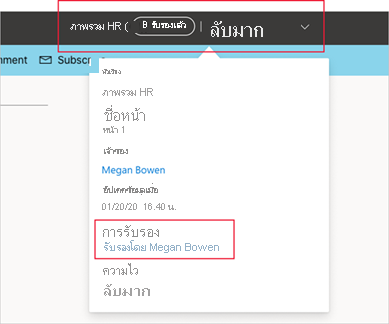
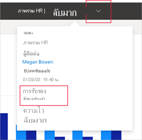

# การรับรอง - การส่งเสริมและรับรองเนื้อหา Power BI

## ภาพรวมการรับรอง

องค์กรมักจะมีเนื้อหา Power BI จำนวนมากที่พร้อมใช้งานสำหรับการแบ่งปันและนำมาใช้ใหม่โดยผู้ใช้ Power BI และการระบุความน่าเชื่อถือเนื้อหาที่มีสิทธิ์อาจเป็นเรื่องยาก การรับรองความถูกต้องเป็นวิธีที่จะทำให้ผู้ใช้สามารถค้นหาเนื้อหาที่มีคุณภาพสูงที่พวกเขาต้องการได้ง่ายขึ้น เนื้อหาที่ได้รับการรับรองจะมีป้ายชื่ออย่างชัดเจนทั้งใน Power BI และในสถานที่อื่น ๆ ที่ผู้ใช้ค้นหาเนื้อหา Power BI (เช่น Excel) นอกจากนี้ยังมีการจัดลำดับความสำคัญในการค้นหาบางอย่างและคุณสามารถเรียงลำดับได้ในบางรายการ

มีการรับรองสองชนิด: **การเลื่อนระดับ** และ **ใบรับรอง**

* **การเลื่อนระดับ**: การเลื่อนระดับ ช่วยให้ผู้ใช้สามารถเน้นย้ำข้อมูลที่พวกเขาคิดว่ามีคุณค่า และคุ้มค่าเพียงพอที่ผู้อื่นจะใช้งาน สำหรับวิธีการนี้ จะช่วยรองรับเครือข่ายการทำงานร่วมกันของข้อมูลภายในองค์กร

    เจ้าของข้อมูลใด ๆ หรือสมาชิกใดที่มีสิทธิ์เขียนบนพื้นที่ทำงานทีข้อมูลนั้นตั้งอยู่ จะสามารถเลื่อนระดับข้อมูลได้อย่างง่ายดาย เมื่อพวกเขาคิดว่าข้อมูลนั้นดีเพียงพอที่จะแชร์

    [เรียนรู้วิธีเลื่อนระดับเนื้อหาของคุณ](service-endorse-content.md#promote-content)

* **การออกใบรับรอง**: ใบรับรองหมายความว่าเนื้อหาตรงกับมาตรฐานคุณภาพขององค์กรและถือได้ว่าเป็นเนื้อหาที่เชื่อถือได้และมีสิทธิ์ที่พร้อมสำหรับการใช้งานทั่วทั้งองค์กร

    [กลุ่มผู้ตรวจสอบที่ได้รับเลือกเท่านั้น (กำหนดโดยผู้ดูแลระบบของ Power BI)](../admin/service-admin-setup-certification.md) จะได้รับอนุญาตให้รับรองเนื้อหา เจ้าของเนื้อหาที่ต้องการดูเนื้อหาที่ผ่านการรับรองและไม่ได้รับอนุญาตให้รับรองความถูกต้องจำเป็นต้องปฏิบัติตามแนวทางขององค์กรเกี่ยวกับการรับการรับรองเนื้อหา

    เรียนรู้วิธีการ[รับรองเนื้อหา](service-endorse-content.md#certify-content)หรือ[ขอการรับรอง](service-endorse-content.md#request-content-certification)

    **การรับรองจะพร้อมใช้งานเมื่อมีการ[เปิดใช้งานโดยผู้ดูแลระบบ Power BI และกำหนดค่า](../admin/service-admin-setup-certification.md)สำหรับองค์กรของคุณ**

รูปภาพด้านล่างแสดงให้เห็นว่าเนื้อหาที่ได้รับการรับรอง (เลื่อนระดับและผ่านการรับรอง) จะถูกระบุอย่างชัดเจนเมื่อคุณค้นหาชุดข้อมูลเพื่อสร้างรายงาน

## ชนิดเนื้อหาที่สามารถรับรองได้
ปัจจุบัน Power BI สนับสนุนการรับรองสำหรับ:
* ชุดข้อมูล
* กระแสข้อมูล (ตัวอย่าง)
* รายงาน (ตัวอย่าง)
* แอป (ตัวอย่าง)

## การระบุเนื้อหาที่รับรองแล้ว

เนื้อหาที่ได้รับการรับรองจะมีป้ายและไอคอนในรายการ การ์ด และตำแหน่งที่ตั้งอื่น ๆ ทั้งใน Power BI และในสถานที่ เช่น Excel ที่สามารถค้นหาเนื้อหา Power BI ได้ ป้ายและไอคอนต่อไปนี้ระบุเนื้อหาที่รับรอง

|ป้าย|ไอคอน|
|---------|---------|
|||
|||
|||

นอกจากนี้ถ้าคุณอยู่ในรายงานหรือแอปคุณสามารถดูสถานะการรับรองความถูกต้องผ่านส่วนหัวได้
* ใบรับรองจะแสดงทั้งในส่วนหัวและในส่วนหัวของรายการแบบหล่นลงซึ่งคุณสามารถดูว่าใครทำการรับรอง

    

* การเลื่อนระดับจะระบุไว้ในส่วนหัวแบบหล่นลงเท่านั้น
 
    

## การตัดสินใจว่าจะรับรองความถูกต้องของแอปหรือรายงาน

การรับรองความถูกต้องจะใช้สำหรับรายการเนื้อหา (แอป รายงาน ชุดข้อมูลและกระแสข้อมูล) ที่คุณต้องการให้ผู้คนค้นหา ใช้และอาจแชร์ร่วมกันอีกครั้ง

เมื่อคุณกำลังแชร์ข้อมูลกับผู้ชมจำนวนมากแนวทางปฏิบัติที่ดีที่สุดของ Power BI คือการแชร์ข้อมูลดังกล่าวผ่านแอป หากคุณทำตามแนวทางปฏิบัติที่ดีที่สุดนี้ คุณต้องการให้ผู้อื่นสามารถค้นหาแอปนั้นได้อย่างง่ายดาย ในกรณีดังกล่าว คุณควรรับรองความถูกต้องของแอป 

ถ้าคุณยังคงพบว่ามีประโยชน์ในการแชร์รายงานโดยตรง อย่างไรก็ตามจากนั้นให้รับรองรายงานเอง 

ไม่ว่าคุณกำลังแชร์รายงานหรือแอป ถ้าชุดข้อมูลพื้นฐานนั้นสมบูรณ์และพร้อมที่จะใช้งานร่วมกันเป็นความคิดที่ดีในการรับรองความถูกต้องของชุดข้อมูลเช่นกัน นำไปใช้กับกระแสข้อมูล  

## ขั้นตอนถัดไป

* [การเลื่อนขั้นหรือรับรองเนื้อหา Power BI](service-endorse-content.md)
* [เปิดใช้งานการรับรองสำหรับองค์กรของคุณ](../admin/service-admin-setup-certification.md) (ผู้ดูแลระบบ Power BI)
* มีคำถามหรือไม่? [ลองถามชุมชน Power BI](https://community.powerbi.com/)