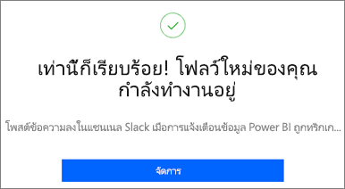
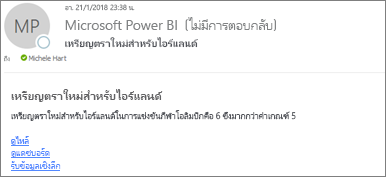
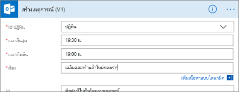
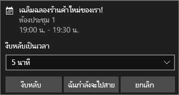

# รวมการแจ้งเตือนข้อมูล Power BI ด้วย Power AutomateIntegrate Power BI data alerts with Power Automate

ใช้ [Power Automate](/power-automate/getting-started) เพื่อรวม Power BI เข้ากับแอปและบริการที่คุณชื่นชอบUse [Power Automate](/power-automate/getting-started) to integrate Power BI with your favorite apps and services. ด้วย Power Automate คุณสามารถสร้างเวิร์กโฟลว์อัตโนมัติเพื่อรับการแจ้งเตือน ซิงโครไนซ์ไฟล์ รวบรวมข้อมูล และอื่น ๆ อีกมากมายได้With Power Automate, you create automated workflows to get notifications, synchronize files, collect data, and more. ในบทความนี้ คุณจะสร้างอีเมลจากการแจ้งเตือนข้อมูล Power BI โดยอัตโนมัติIn this article, you automate generating an email from a Power BI data alert.

## สิ่งที่จำเป็นต้องมีPrerequisites
บทความนี้จะแสดงวิธีการสร้างโฟลว์ที่แตกต่างกันสองโฟลว์ โฟลว์แรกจากเทมเพลต และอีกโฟลว์หนึ่งสร้างใหม่ตั้งแต่เริ่มต้นThis article shows how to create two different flows: one from a template and one from scratch. เพื่อทำตาม [สร้างการแจ้งเตือนข้อมูลใน Power BI](../create-reports/service-set-data-alerts.md) และ [ลงทะเบียนเพื่อใช้งาน Power Automate](https://flow.microsoft.com/#home-signup)To follow along, [create a data alert in Power BI](../create-reports/service-set-data-alerts.md), and [sign up for Power Automate](https://flow.microsoft.com/#home-signup). ฟรี!It's free!

## สร้างโฟลว์จากเทมเพลตCreate a flow from a template
ในงานนี้ เราจะใช้เทมเพลตเพื่อสร้างโฟลว์อย่างง่ายที่จะถูกทริกเกอร์ โดยการแจ้งเตือนข้อมูล Power BI (การแจ้งเตือน)In this task, we use a template to create a simple flow that is triggered by a Power BI data alert (notification).

1. ลงชื่อเข้าใช้ Power Automate (flow.microsoft.com)Sign in to Power Automate (flow.microsoft.com).
2. เลือก **เทมเพลต** ค้นหา **Power BI** > **ส่งอีเมลถึงผู้ชมทุกคน เมื่อการแจ้งเตือนข้อมูล Power BI ถูกทริกเกอร์**Select **Templates**, search for **Power BI** > **Send an e-mail to any audience when a Power BI data alert is triggered**.
   
    :::image type="content" source="media/service-flow-integration/power-automate-templates.png" alt-text="สกรีนช็อตของเทมเพลต Power Automate ส่งอีเมลถึงผู้ชมทุกคนเมื่อการแจ้งเตือนข้อมูล Power BI ถูกทริกเกอร์":::

### สร้างโฟลว์Build the flow
เทมเพลตนี้มีหนึ่งทริกเกอร์ การแจ้งเตือนข้อมูล Power BI และหนึ่งการดำเนินการเพื่อส่งอีเมลThis template has one trigger, a Power BI data alert, and one action, to send an email. เมื่อคุณเลือกเขตข้อมูล โฟลว์ Power Automate จะแสดงเนื้อหาแบบไดนามิกที่คุณสามารถรวมไว้ได้As you select a field, Power Automate displays dynamic content that you can include.  ในตัวอย่างนี้ เราจะรวมค่าไทล์และ URL ไทล์ในเนื้อหาข้อความIn this example, we include the tile value and the tile URL in the message body.

1. เลือก **ดำเนินต่อ**Select **Continue**.

    :::image type="content" source="media/service-flow-integration/power-automate-power-bi-mail.png" alt-text="สกรีนช็อตของ Power Automate, Power BI ไปยังอีเมล":::

1. ในกล่อง **ID การแจ้งเตือน** ให้เลือกการแจ้งเตือนข้อมูล Power BIIn the **Alert ID** box, select a Power BI data alert. เมื่อต้องการเรียนรู้วิธีการสร้างการแจ้งเตือน ให้ดู[การแจ้งเตือนข้อมูลใน Power BI](../create-reports/service-set-data-alerts.md)To learn how to create an alert, see [Data alerts in Power BI](../create-reports/service-set-data-alerts.md).
   
    :::image type="content" source="media/service-flow-integration/power-automate-select-alert-id.png" alt-text="สกรีนช็อตของเลือกการแจ้งเตือนในกล่อง ID การแจ้งเตือน":::
2. ใส่อีเมลแอดเดรสที่ถูกต้องอย่างน้อยหนึ่งรายการEnter one or more valid email addresses.

3. Power Automate สร้าง **หัวข้อ** และ **เนื้อความ** สำหรับคุณโดยอัตโนมัติซึ่งคุณสามารถใช้หรือปรับเปลี่ยนได้Power Automate automatically generates a **Subject** and **Body** for you, which you can keep or modify. ข้อความเนื้อหาใช้ HTML สำหรับการจัดรูปแบบThe body text uses HTML for formatting.

    :::image type="content" source="media/service-flow-integration/power-automate-autogenerated-email.png" alt-text="สกรีนช็อตของข้อความอีเมลที่สร้างโดยอัตโนมัติของ Power Automate":::

1. เมื่อคุณปรับเปลี่ยนข้อความเรียบร้อยแล้ว ให้เลือก **ขั้นตอนถัดไป** หรือ **บันทึก**When you're done with the message, select **Next step** or **Save**.  ขั้นตอนถูกสร้างขึ้นและถูกประเมินThe flow is created and evaluated.  ขั้นตอน Power Automate จะแจ้งให้คุณทราบหากพบข้อผิดพลาดPower Automate lets you know if it finds errors.
2. ถ้าพบข้อผิดพลาด ให้เลือก **แก้ไขโฟลว์** เมื่อต้องการแก้ไขปัญหาเหล่านั้น ถ้าไม่ ให้เลือก **เสร็จแล้ว** เพื่อเรียกใช้โฟลว์ใหม่If errors are found, select **Edit flow** to fix them, otherwise, select **Done** to run the new flow.
   
   
5. เมื่อการแจ้งเตือนข้อมูลถูกทริกเกอร์ Power Automate จะส่งอีเมลไปยังที่อยู่คุณระบุไว้When the data alert is triggered, Power Automate sends an email to the addresses you indicated.  
   
   

## สร้างโฟลว์ตั้งแต่เริ่มต้นCreate a flow from scratch
ในงานนี้ เราจะสร้างโฟลว์ง่ายๆ ตั้งแต่เริ่มต้น ซึ่งจะถูกทริกเกอร์โดยการแจ้งเตือนข้อมูล Power BI (การแจ้งเตือน)In this task, we create a simple flow from scratch that is triggered by a Power BI data alert (notification).

1. ลงชื่อเข้าใช้ Power Automate (flow.microsoft.com)Sign in to Power Automate (flow.microsoft.com).
2. เลือก **สร้าง** > **โฟลว์อัตโนมัติ**Select **Create** > **Automated flow**.

    :::image type="content" source="media/service-flow-integration/power-automate-create-automated-flow.png" alt-text="สกรีนช็อตของ Power Automate > สร้างโฟลว์อัตโนมัติ":::   
3. ใน **สร้างโฟลว์อัตโนมัติ** ให้ตั้งชื่อโฟลว์ของคุณIn **Build an automated flow**, give your flow a name.
1. ใน **เลือกทริกเกอร์ของโฟลว์ของคุณ** ให้ค้นหา **Power BI**In the **Choose your flow's trigger**, search for **Power BI**.
1. เลือก  **Power BI - เมื่อการแจ้งเตือนการขับเคลื่อนข้อมูลได้รับการทริกเกอร์** > **สร้าง**Select **Power BI - When a data driven alert is triggered** > **Create**.

    :::image type="content" source="media/service-flow-integration/power-automate-build-automated-flow.png" alt-text="สกรีนช็อตของการสร้างโฟลว์อัตโนมัติ":::

### สร้างโฟลว์ของคุณBuild your flow
1. ในกล่อง **ID การแจ้งเตือน** ให้เลือกชื่อของการแจ้งเตือนของคุณIn the **Alert ID** box, select the name of your alert. เมื่อต้องการเรียนรู้วิธีการสร้างการแจ้งเตือน ให้ดู[การแจ้งเตือนข้อมูลใน Power BI](../create-reports/service-set-data-alerts.md)To learn how to create an alert, see [Data alerts in Power BI](../create-reports/service-set-data-alerts.md).

    :::image type="content" source="media/service-flow-integration/power-automate-select-alert-id-scratch.png" alt-text="สกรีนช็อตของการเลือกชื่อของการแจ้งเตือน":::   

2. เลือก **ขั้นตอนใหม่**Select **New step**.
   
3. ใน **เลือกการดำเนินการ** ค้นหา **Outlook** > **สร้างกิจกรรม**In **Choose an action**, search for **Outlook** > **Create event**.

    :::image type="content" source="media/service-flow-integration/power-automate-choose-action-create-event.png" alt-text="สกรีนช็อตของการเลือกการดำเนินการ > สร้างเหตุการณ์":::   
4. กรอกเขตข้อมูลในช่องเหตุการณ์Fill in the event fields. เมื่อคุณเลือกเขตข้อมูล โฟลว์ Power Automate จะแสดงเนื้อหาแบบไดนามิกที่คุณสามารถรวมไว้ได้As you select a field, Power Automate displays dynamic content that you can include.
   
   
5. ให้เลือก **สร้างโฟลว์** เมื่อทำเสร็จแล้วSelect **Create flow** when done.  Power Automate จะบันทึกและประเมินโฟลว์Power Automate saves and evaluates the flow. ถ้าไม่ มีข้อผิดพลาด ให้เลือก **เสร็จสิ้น** เพื่อเรียกใช้โฟลว์นี้If there are no errors, select **Done** to run this flow.  ขั้นตอนใหม่ถูกเพิ่มลงในหน้า **โฟลว์ของฉัน**The new flow is added to your **My flows** page.
   
   
6. เมื่อโฟลว์ถูกทริกเกอร์ โดยการแจ้งเตือนข้อมูล Power BI คุณจะได้รับการแจ้งเตือนเหตุการณ์บน Outlook ที่คล้ายกันWhen the flow is triggered by your Power BI data alert, you'll receive an Outlook event notification similar to this one.
   
    

## ขั้นตอนถัดไปNext steps
* [เริ่มต้นใช้งาน Power AutomateGet started with Power Automate](/power-automate/getting-started/)
* [ส่งออกและส่งอีเมลรายงาน Power BI ด้วย Power AutomateExport and email a Power BI report with Power Automate](service-automate-power-bi-report-export.md)
* มีคำถามเพิ่มเติมหรือไม่More questions? [ลองไปที่ชุมชน Power BITry the Power BI Community](https://community.powerbi.com/)
