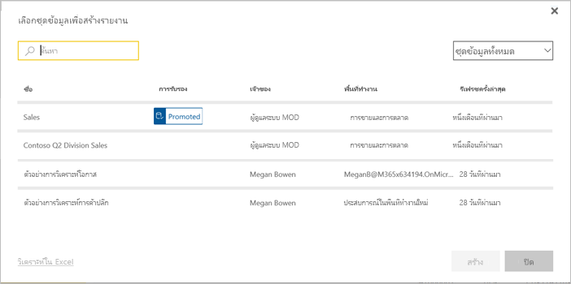

# วิธีในการทำงานร่วมกันและแชร์ใน Power BIWays to collaborate and share in Power BI

คุณได้สร้างแดชบอร์ดและรายงานแล้วYou've created dashboards and reports. บางทีคุณอาจต้องการทำงานกับเพื่อนร่วมงานของคุณด้วยMaybe you want to collaborate on them with your coworkers. หรือบางทีคุณพร้อมที่จะเผยแพร่ข้อมูลเหล่านั้นให้กว้างขวางยิ่งขึ้นOr maybe you're ready to distribute them more widely. วิธีที่ดีที่สุดในการร่วมงานและแชร์คืออะไรWhat's the best way to collaborate and share them? ในบทความนี้ เราจะเปรียบเทียบตัวเลือกของคุณIn this article, we compare your options.

*แอปในบริการของ Power BI**Apps in the Power BI service*

**ทำงานร่วมกัน****Collaborate**

- [ทํางานร่วมกับเพื่อนร่วมงานใน *พื้นที่ทำงาน*](#collaborate-in-a-workspace) เพื่อสร้างรายงานและแดชบอร์ดที่มีความหมาย[Collaborate with coworkers in *workspaces*](#collaborate-in-a-workspace) to create meaningful reports and dashboards.
- [ทำงานร่วมกันใน *Microsoft Teams*](#collaborate-in-microsoft-teams)[Collaborate in *Microsoft Teams*](#collaborate-in-microsoft-teams).

**เผยแพร่หรือแชร์แดชบอร์ดและรายงาน****Distribute or share dashboards and reports**

- [*แชร์แดชบอร์ดหรือรายงาน*](#share-dashboards-and-reports)จากพื้นที่ทํางานของฉันหรือพื้นที่ทํางานอื่นของคุณ[*Share dashboards or reports*](#share-dashboards-and-reports) from your My Workspace or another workspace.
- ใส่คําอธิบายประกอบและ [แชร์จาก *แอปมือถือ Power BI*](#annotate-and-share-from-the-power-bi-mobile-apps)Annotate and [share from the Power BI *mobile apps*](#annotate-and-share-from-the-power-bi-mobile-apps).
- รวมแดชบอร์ดและรายงานในพื้นที่ทํางานลงใน *แอป* และ [กระจายแอปของคุณ](#distribute-insights-in-an-app)ไปยังกลุ่มขนาดใหญ่หรือทั้งองค์กรของคุณBundle dashboards and reports in workspaces into *apps* and [distribute your apps](#distribute-insights-in-an-app) to a larger group or your whole organization.
- [ฝังรายงาน](#embed-reports-in-secure-portals-or-public-web-sites)ใน *พอร์ทัลที่ปลอดภัย* หรือ *เว็บไซต์สาธารณะ*[Embed reports](#embed-reports-in-secure-portals-or-public-web-sites) in *secure portals* or *public web sites*.
- [พิมพ์รายงาน](#print-or-save-as-pdf-or-other-static-file)[Print reports](#print-or-save-as-pdf-or-other-static-file).
- [สร้าง *แอปเทมเพลต*](#create-and-deploy-template-apps)ที่คุณสามารถแจกจ่ายให้กับผู้ใช้ Power BI ภายนอกผ่านทาง Microsoft AppSource[Create a *template app*](#create-and-deploy-template-apps) that you can distribute to external Power BI users, via Microsoft AppSource.
 
**แชร์ข้อมูล****Share data**

- [สร้าง *ชุดข้อมูลที่แชร์แล้ว*](#share-a-dataset) ซึ่งเพื่อนร่วมงานของคุณสามารถใช้เป็นเกณฑ์สำหรับรายงานของตัวเองในพื้นที่ทำงานของพวกเขาเองได้[Create *shared datasets*](#share-a-dataset) that coworkers can use as the basis for their own reports, in their own workspaces.
- [สร้าง *กระแสข้อมูล*](#create-dataflows)เป็นวิธีในการแชร์แหล่งข้อมูลทั่วไปร่วมกัน[Create *dataflows*](#create-dataflows) as a way to share a common data source.

ไม่ว่าคุณจะเลือกตัวเลือกไหนเพื่อแชร์เนื้อหาของคุณ คุณต้องมี[สิทธิ์การใช้งาน Power BI Pro](../fundamentals/service-features-license-type.md) หรือเนื้อหาจำเป็นต้องอยู่ใน[ความจุพรีเมียม](../admin/service-premium-what-is.md)No matter which option you choose, to share your content you need a [Power BI Pro license](../fundamentals/service-features-license-type.md), or the content needs to be in a [Premium capacity](../admin/service-premium-what-is.md). ข้อกำหนดสิทธิ์การใช้งานสำหรับผู้ร่วมงานที่จะดูเนื้อหาของคุณ จะแตกต่างกันไป ขึ้นอยู่กับตัวเลือกที่คุณเลือกLicense requirements vary for the colleagues who view your content, depending on the option you choose. ส่วนต่อไปนี้คือรายละเอียดThe following sections spell out details. 

## ทำงานร่วมกันในพื้นที่ทำงานCollaborate in a workspace

เมื่อทีมทำงานร่วมกัน พวกเขาจำเป็นต้องเข้าถึงเอกสารเดียวกันเพื่อให้พวกเขาสามารถทำงานร่วมกันได้อย่างง่ายดายWhen teams work together, they need access to the same documents so they can collaborate easily. ในพื้นที่ทำงานของ Power BI ทีมจะแบ่งปันความเป็นเจ้าของและการจัดการแดชบอร์ด รายงาน ชุดข้อมูลและสมุดงานIn Power BI workspaces, teams share the ownership and management of their dashboards, reports, datasets, and workbooks. ในบางครั้งผู้ใช้ Power BI จะจัดระเบียบพื้นที่ทำงานของพวกเขาตามโครงสร้างองค์กร หรือพวกเขาสร้างพื้นที่ทำงานสำหรับโครงการเฉพาะSometimes Power BI users organize their workspaces based on organizational structures, or they create them for specific projects. องค์กรอื่นๆ ยังคงใช้หลายพื้นที่ทำงานเพื่อจัดเก็บรายงานหรือแดชบอร์ดเวอร์ชั่นอื่นที่พวกเขาใช้Still other organizations use several workspaces to store different versions of reports or dashboards they use. 

พื้นที่ทำงานให้บทบาทที่กำหนดว่าเพื่อนร่วมงานของคุณมีสิทธิ์ใดWorkspaces provide roles that determine what permissions your coworkers have. ใช้บทบาทเหล่านั้นเพื่อกำหนดว่าใครสามารถจัดการพื้นที่ทำงาน แก้ไขหรือแจกจ่ายเนื้อหา หรือเพียงแค่ดูเนื้อหาเท่านั้นUse those roles to determine who can manage the workspace, edit or distribute content, or just view content. อ่านเพิ่มเติมเกี่ยวกับ[บทบาทในพื้นที่ทำงานใหม่](service-new-workspaces.md#roles-in-the-new-workspaces)Read more about [roles in the new workspaces](service-new-workspaces.md#roles-in-the-new-workspaces).

พื้นที่ทำงานดีกว่าสำหรับการทำงานร่วมกันมากกว่าพื้นที่ทำงานของฉัน เนื่องจากอนุญาตให้มีการเป็นเจ้าของเนื้อหาร่วมกันWorkspaces are better for collaboration than My Workspace, because they allow co-ownership of content. คุณและทีมของคุณทั้งหมดสามารถอับเดตหรือ หรือให้ผู้อื่นเข้าถึงได้ง่ายYou and your entire team can easily make updates or give others access. พื้นที่ทำงานของฉันถูกใช้ โดยบุคคลต่างๆ เพียงครั้งเดียวหรือเพื่อเนื้อหาส่วนบุคคลMy Workspace is best used by individuals for one-off or personal content.

ตอนนี้จินตนาการว่าคุณมีแดชบอร์ดที่เสร็จแล้วที่คุณต้องการแบ่งปันกับเพื่อนร่วมงานของคุณNow, imagine you have a finished dashboard you need to share with your colleagues. วิธีที่ดีที่สุดในการให้พวกเขาสามารถเข้าถึงแดชบอร์ดคืออะไร?What's the best way to give them access to the dashboard? คำตอบขึ้นอยู่กับหลายปัจจัยThe answer depends on a number of factors. 

- หากเพื่อนร่วมงานต้องการทำให้แดชบอร์ดเป็นปัจจุบัน หรือต้องการเข้าถึงเนื้อหาทั้งหมดในพื้นที่ทำงานให้เพิ่มพวกเขาไปยังพื้นที่ทำงานในฐานะสมาชิกหรือผู้ร่วมให้ข้อมูลIf colleagues need to keep the dashboard up to date, or need access to all the content in the workspace, add them to the workspace as Members or Contributors. 
- หากเพื่อนร่วมงานต้องการเพียงดูเนื้อหาในพื้นที่ทำงานให้เพิ่มพวกเขาเป็นผู้ชมIf colleagues just need to view the content in the workspace, add them as Viewers.
- หากเพื่อนร่วมงานต้องการเห็นแดชบอร์ดนั้นและไม่ได้ดูเนื้อหาทั้งหมดในพื้นที่ทำงาน คุณสามารถแชร์แดชบอร์ดกับพวกเขาได้โดยตรงIf colleagues just need to see that dashboard and not all the content in the workspace, you can share the dashboard with them directly.
- หากแดชบอร์ดเป็นส่วนหนึ่งของชุดแดชบอร์ดและรายงานที่คุณต้องเผยแพร่ให้เพื่อนร่วมงานหลายคน การเผยแพร่ *แอป* น่าจะเป็นตัวเลือกที่ดีที่สุดIf the dashboard is part of a set of dashboards and reports that you need to distribute to many colleagues, then publishing an *app* is likely the best choice.

อ่านเกี่ยวกับวิธีการ [สร้างพื้นที่ทำงานใหม่](service-create-the-new-workspaces.md)Read about how to [create the new workspaces](service-create-the-new-workspaces.md). 

## ทำงานร่วมกันใน  Microsoft TeamsCollaborate in Microsoft Teams

เพิ่มการทำงานร่วมกันซึ่งขับเคลื่อนด้วยข้อมูลในองค์กรของคุณโดยการฝังรายงาน Power BI และรายงาน Power BI ที่ระบุหมายเลขหน้าใน Microsoft TeamsIncrease data-driven collaboration in your organization by embedding your Power BI reports and Power BI paginated reports in Microsoft Teams. บริการของ Power BI มีปุ่ม **แชทใน Teams** สำหรับรายงานThe Power BI service has a **Chat in Teams** button for reports. คุณสามารถเพิ่มแท็บ Power BI แยกต่างหากสำหรับรายงานแต่ละรายการ และกำหนดชื่อรายงานหรือชื่ออื่น ๆ ให้แต่ละแท็บYou can add separate Power BI tabs for each individual report, and give each tab the name of the report, or any other name. 

เมื่อคุณเพิ่มแท็บรายงาน Power BI ไปยัง Microsoft Teams ทีมงานจะสร้างแท็บการสนทนาสำหรับรายงานโดยอัตโนมัติWhen you add a Power BI report tab to Microsoft Teams, Teams automatically creates a tab conversation for the report. ทุกคนในช่องของ Microsoft Teams นั้นสามารถดูและพูดคุยเกี่ยวกับรายงานในการสนทนาได้Everyone in that Microsoft Teams channel can see and discuss the report in the conversation. 

:::image type="content" source="media/service-how-to-collaborate-distribute-dashboards-reports/power-bi-teams-conversation-tab.png" alt-text="แท็บการสนทนาของ Microsoft Teams":::

อ่านเพิ่มเติมเกี่ยวกับ [การทำงานร่วมกันใน Microsoft Teams ด้วย Power BI](service-collaborate-microsoft-teams.md)Read more about [collaborating in Microsoft Teams with Power BI](service-collaborate-microsoft-teams.md).

## แชร์แดชบอร์ดและรายงานShare dashboards and reports

สมมติว่ารายงานใน Power BI Desktop ของคุณพร้อมแล้ว และคุณต้องการให้บุคคลอื่นสามารถเข้าถึงได้Let's say your report in Power BI Desktop is ready, and you want other people to have access to it. วิธีหนึ่งคือการ *แชร์* ให้พวกเขาในบริการของ Power BIOne way to get it to them is to *share* it in the Power BI service. คุณเผยแพร่ไปยังพื้นที่ทำงานของฉันหรือพื้นที่ทำงานอื่นYou publish it to your own My Workspace or another workspace. บางทีคุณอาจสร้างแดชบอร์ดเพื่อไปพร้อมกันและคุณก็พร้อมแล้วMaybe you create a dashboard to go with it, and you're ready.

คุณต้องสิทธิ์การใช้งาน Power BI Pro เพื่อแชร์เนื้อหาของคุณYou need a Power BI Pro license to share your content. คนที่คุณแชร์ด้วยทำได้เช่นกัน หรือเนื้อหาต้องอยู่ในพื้นที่ทำงานใน [ความจุแบบพรีเมียม](../admin/service-premium-what-is.md)The people you share it with do too, or the content needs to be in a workspace in a [Premium capacity](../admin/service-premium-what-is.md). เมื่อคุณแชร์แดชบอร์ดหรือรายงาน ผู้รับสามารถดู และโต้ตอบกับข้อมูลได้When you share a dashboard or report, recipients can view it and interact with it. ถ้าคุณให้สิทธิ์แก่พวกเขา พวกเขาสามารถแก้ไขได้ ทำสำเนาและแชร์กับเพื่อนร่วมงานของพวกเขาได้ด้วยIf you give them permission, they can edit it, make a copy of it, and share it with their coworkers. พวกเขาจะเห็นข้อมูลเดียวกันกับที่คุณเห็นในแดชบอร์ดหรือรายงานThey see the same data that you see in the dashboard or report. พวกเขามีสิทธิ์เข้าถึงข้อมูลทั้งหมดในชุดข้อมูลเบื้องต้น เว้นแต่จะมีการใช้ [การรักษาความปลอดภัยระดับแถว (RLS)](../admin/service-admin-rls.md)They have access to all the data in the underlying dataset, unless [row-level security (RLS)](../admin/service-admin-rls.md) is applied.

คุณสามารถแชร์ให้กับบุคคลภายนอกองค์กรได้ด้วยYou can share with people outside your organization, too. พวกเขาสามารถดู และโต้ตอบกับแดชบอร์ด หรือรายงานได้ แต่ไม่สามารถแชร์ได้They can view and interact with the dashboard or report too, but can't share it. 

อ่านเกี่ยวกับวิธี [การแชร์แดชบอร์ดและรายงาน](service-share-dashboards.md) จากบริการของ Power BIRead about how to [share dashboards and reports](service-share-dashboards.md) from the Power BI service. หรืออ่านเกี่ยวกับการเพิ่มตัวกรองในลิงก์และ [แชร์มุมมองที่กรองแล้วของรายงานของคุณ](service-share-reports.md)Or read about adding a filter to a link and [share a filtered view of your report](service-share-reports.md).

## ใส่คำอธิบายประกอบ และแชร์จากแอป Power BI สำหรับอุปกรณ์เคลื่อนที่Annotate and share from the Power BI mobile apps

ในแอป Power BI สำหรับอุปกรณ์เคลื่อนที่ สำหรับ iOS และ Android คุณสามารถใส่คำอธิบายประกอบไทล์ รายงาน หรือ วิชวล แล้วแชร์ให้กับใครก็ได้ผ่านทางอีเมลIn the Power BI mobile apps for iOS and Android devices, you can annotate a tile, report, or visual and then share it with anyone via email.

คุณกำลังแชร์สแนปช็อตของไทล์ รายงานหรือวิชวลYou're sharing a snapshot of the tile, report, or visual. ผู้รับของคุณเห็นเหมือนกับเวลาที่คุณส่งเมลYour recipients see it exactly as it was when you sent the mail. เมลยังมีลิงก์ไปยังแดชบอร์ดหรือรายงานThe mail also contains a link to the dashboard or report. หากพวกเขามีสิทธิ์การใช้งาน Power BI Pro หรือเนื้อหาที่อยู่ใน [ความจุแบบพรีเมียม](../admin/service-premium-what-is.md) และคุณได้แชร์เนื้อหากับพวกเขาแล้ว พวกเขาก็สามารถเปิดดูได้If they have a Power BI Pro license or the content is in a [Premium capacity](../admin/service-premium-what-is.md), and you've shared the content with them already, they can open it. คุณสามารถส่งสแนปช็อตของไทล์ให้กับใครก็ได้ ไม่เพียงแต่ผู้ร่วมงานในโดเมนอีเมลเดียวกันเท่านั้นYou can send snapshots of tiles to anyone, not just coworkers in the same email domain.

อ่านเพิ่มเติมเกี่ยวกับ[การใส่คำอธิบายประกอบ และการแชร์ไทล์ รายงาน และวิชวล](../consumer/mobile/mobile-annotate-and-share-a-tile-from-the-mobile-apps.md)จากแอปมือถือ iOS และ AndroidRead more about [annotating and sharing tiles, reports, and visuals](../consumer/mobile/mobile-annotate-and-share-a-tile-from-the-mobile-apps.md) from the iOS and Android mobile apps.

คุณยังสามารถ[แชร์สแนปช็อตของไทล์](../consumer/mobile/mobile-windows-10-phone-app-get-started.md) จากแอป Power BI สำหรับอุปกรณ์ของ Windows 10 ได้ แต่ไม่สามารถใส่คำอธิบายประกอบได้You can also [share a snapshot of a tile](../consumer/mobile/mobile-windows-10-phone-app-get-started.md) from the Power BI app for Windows 10 devices, but not annotate it.

## แจกจ่ายข้อมูลเชิงลึกในแอปDistribute insights in an app

สมมุติว่า คุณต้องการแจกจ่ายแดชบอร์ดของคุณให้กับผู้ชมในองค์กรของคุณSay you want to distribute your dashboard to a broad audience in your organization. คุณและเพื่อนร่วมงานของคุณได้สร้าง *พื้นที่ทำงาน* จากนั้นจึงได้สร้างและกำหนดแดชบอร์ด รายงาน และชุดข้อมูลในพื้นที่ทำงานYou and your coworkers have created a *workspace*, then created and refined dashboards, reports, and datasets in the workspace. ตอนนี้คุณเลือกแดชบอร์ดและรายงานและเผยแพร่เป็น *แอป* ไม่ว่าจะเป็นกลุ่มหรือกับทั้งองค์กรของคุณNow you select the dashboards and reports and publish them as an *app*, either to a group or to your whole organization.

สามารถค้นหาและติดตั้งแอปได้ง่าย ๆ ในบริการของ Power BI ([https://app.powerbi.com](https://app.powerbi.com))Apps are easy to find and install in the Power BI service ([https://app.powerbi.com](https://app.powerbi.com)). คุณสามารถส่งลิงก์โดยตรงไปยังแอป ให้กับผู้ใช้ทางธุรกิจ หรือพวกเขาสามารถค้นหาได้ใน AppSourceYou can send your business users a direct link to the app, or they can search for it in AppSource. ถ้าผู้ดูแลระบบ Power BI ของคุณ ให้สิทธิ์แก่คุณ คุณสามารถติดตั้งแอปลงในบัญชีผู้ใช้ Power BI ของเพื่อนร่วมงานคุณโดยอัตโนมัติIf your Power BI administrator gives you permissions, you can install an app automatically in your coworkers' Power BI accounts. อ่านเกี่ยวกับวิธีการ [เผยแพร่แอป](service-create-distribute-apps.md)Read about how to [publish an app](service-create-distribute-apps.md).

หลังจากติดตั้งแอปแล้วพวกเขาสามารถดูได้ในเบราว์เซอร์หรืออุปกรณ์มือถือของพวกเขาAfter they install the app, they can view it in their browser or mobile device.

สำหรับผู้ใช้ของคุณในการดูแอปของพวกเขา พวกเขาต้องการสิทธิ์ใช้งาน Power BI Pro ด้วยหรือจำเป็นต้องจัดเก็บแอปในความจุแบบพรีเมียมของ Power BIFor your users to view your app, they need a Power BI Pro license, too, or the app needs to be stored in a Power BI Premium capacity. อ่าน[Power BI Premium คืออะไร](../admin/service-premium-what-is.md)สำหรับรายละเอียดRead [What is Power BI Premium?](../admin/service-premium-what-is.md) for details.

คุณสามารถเผยแพร่แอปไปยังบุคคลภายนอกองค์กรของคุณได้เช่นกันYou can publish apps to people outside your organization, too. พวกเขาสามารถดูและโต้ตอบกับเนื้อหาแอป แต่ไม่สามารถแชร์แอปกับผู้อื่นได้They can view and interact with the app content, but can't share it with others. ตอนนี้ คุณสามารถสร้าง *แอปเทมเพลม* และปรับใช้กับลูกค้า Power BI ใดๆ ก็ได้Now you can create *template apps* and deploy them to any Power BI customer.

## ฝังรายงานในพอร์ทัลที่ปลอดภัยหรือเว็บไซต์สาธารณะEmbed reports in secure portals or public web sites

### ฝังในพอร์ทัลที่ปลอดภัยEmbed in secure portals

คุณสามารถฝังรายงาน Power BI ในพอร์ทัลหรือเว็บไซต์ที่ผู้ใช้ของคุณควรจะเห็นได้You can embed Power BI reports in portals or web sites where your users expect to see them.  
ด้วยการ **ฝังใน SharePoint Online** และตัวเลือก **แบบฝัง** ในบริการ Power BI ช่วยให้คุณสามารถฝังรายงานสำหรับผู้ใช้ภายในของคุณได้อย่างปลอดภัยWith the **Embed in SharePoint Online** and the **Embed** option in the Power BI service, you can securely embed reports for your internal users. ไม่ว่าคุณจะเลือกตัวเลือกใดก็ตาม Power BI จะบังคับใช้สิทธิ์และการรักษาความปลอดภัยของข้อมูลทั้งหมดก่อนที่ผู้ใช้จะเห็นเนื้อหาWhichever option you choose, Power BI enforces all permissions and data security before users see content. ผู้ที่ดูรายงานนั้นจำเป็นต้องมีใบอนุญาตที่เหมาะสมThe person viewing the report needs the appropriate license.  

- **ฝังใน SharePoint Online** ทำงานกับ Power BI web part สำหรับ SharePoint Online**Embed in SharePoint Online** works with the Power BI web part for SharePoint Online. ซึ่งจะมอบประสบการณ์การลงชื่อเข้าระบบครั้งเดียวโดยมีการควบคุมวิธีการฝังรายงานIt provides a single sign-on experience with control over how the report is embedded. อ่านเพิ่มเติมเกี่ยวกับ [การฝังใน SharePoint Online](service-embed-report-spo.md)Read more about [Embedding in SharePoint Online](service-embed-report-spo.md).
- **การฝัง** ทำงานร่วมกับพอร์ทัลหรือเว็บไซต์ใดก็ได้ที่รองรับเนื้อหาการฝังโดยใช้ URL หรือ iFrame**Embed** works with any portal or web site that supports embedding content using a URL or an iFrame. อ่านเพิ่มเติมเกี่ยวกับตัวเลือก [การฝัง](service-embed-secure.md)Read more about the [Embed](service-embed-secure.md) option.

### เผยแพร่ไปยังเว็บไซต์สาธารณะPublish to public web sites

**ด้วยการเผยแพร่ไปยังเว็บ** คุณสามารถเผยแพร่รายงาน Power BI ไปยังอินเทอร์เน็ตทั้งหมดได้โดยการฝังตัวการแสดงภาพลงในบล็อกโพสต์ เว็บไซต์ โซเชียลมีเดีย และการสื่อสารทางออนไลน์อื่น ๆ**Publish to web** allows you to publish Power BI reports to the whole Internet by embedding visualizations in blog posts, web sites, social media, and other online communications. ทุกคนบนอินเทอร์เน็ตสามารถดูรายงานของคุณได้ และคุณไม่สามารถควบคุมได้ว่าใครบ้างที่จะเห็นสิ่งที่คุณเผยแพร่Anyone on the Internet can view your reports, and you have no control over who sees what you've published. พวกเขาไม่จำเป็นต้องมีใบอนุญาต Power BIThey don't need a Power BI license. การเผยแพร่ไปยังเว็บ มีเฉพาะรายงานที่คุณสามารถแก้ไขได้เท่านั้นPublishing to the web is available only for reports that you can edit. คุณไม่สามารถเผยแพร่รายงานไปยังเว็บ ถ้ารายงานถูกแชร์มาให้คุณ หรือ ถ้ารายงานอยู่ในแอปYou can't publish reports to the web if they're shared with you or if they're in an app. อ่านเกี่ยวกับวิธีการ [เผยแพร่ไปยังเว็บ](service-publish-to-web.md)Read about how to [publish to the web](service-publish-to-web.md).

>[!Warning]
>ใช้[เผยแพร่ไปยังเว็บ](service-publish-to-web.md)เท่านั้นเมื่อต้องแชร์เนื้อหาต่อสาธารณะ ไม่ใช่เพื่อการแชร์ภายในUse [Publish to web](service-publish-to-web.md) only to share content publicly, not for internal sharing.

## พิมพ์ หรือบันทึกเป็น PDF หรือไฟล์แบบคงที่อื่น ๆPrint or save as PDF or other static file

จากบริการ Power BI คุณสามารถพิมพ์บันทึกเป็น PDF หรือบันทึกเป็นรูปแบบไฟล์คงที่อื่นๆ หรือรายการใดๆ เหล่านี้:From the Power BI service, you can print, save as PDF, or save as other static file format, any of these items:

- แดชบอร์ดทั้งหมดAn entire dashboard
- ไทล์ของแดชบอร์ดA dashboard tile
- หน้ารายงานA report page
- รายงานที่มีการแบ่งหน้าA paginated report
- การแสดงภาพจากบริการของ Power BIA visualization from the Power BI service. 

คุณสามารถพิมพ์รายงาน Power BI ได้ครั้งละหนึ่งหน้าเท่านั้นYou can only print Power BI reports one page at a time. คุณไม่สามารถพิมพ์รายงานทั้งหมดในครั้งเดียวYou can't print the entire report at once. อ่านเกี่ยวกับวิธีการ [พิมพ์หรือบันทึกรายงานหรือแดชบอร์ดเป็นไฟล์แบบคงที่](../consumer/end-user-print.md)Read about how to [print or save a report or dashboard as a static file](../consumer/end-user-print.md).

รายงานที่มีการแบ่งหน้าในทางกลับกันคือรายงานที่ออกแบบมาเพื่อการพิมพ์Paginated reports, on the other hand, are designed to be printed. อ่าน [การเปรียบเทียบของรายงาน Power BI และรายงานที่มีการแบ่งหน้า](../paginated-reports/paginated-reports-report-builder-power-bi.md#compare-power-bi-reports-and-paginated-reports) สำหรับรายละเอียดRead a [comparison of Power BI reports and paginated reports](../paginated-reports/paginated-reports-report-builder-power-bi.md#compare-power-bi-reports-and-paginated-reports) for details. 

## สร้างและปรับใช้แอปเทมเพลตCreate and deploy template apps

*แอปเทมเพลต* ได้รับการออกแบบมาเพื่อเผยแพร่สู่สาธารณะ ส่วนใหญ่ใน Microsoft AppSource*Template apps* are designed to be distributed publicly, often in Microsoft AppSource. คุณสร้างแอป และมีการเข้ารหัสเพียงเล็กน้อยหรือไม่มีเลย คุณสามารถปรับใช้กับลูกค้า Power BI ได้You build an app, and with little or no coding, you can deploy it to any Power BI customer. ลูกค้าของคุณเชื่อมต่อกับข้อมูลของตนเอง และสร้างอินสแตนซ์ของบัญชีของตนเองYour customers connect to their own data and instantiate their own accounts. อ่านเพิ่มเติมเกี่ยวกับ[แอปเทมเพลตของ Power BI](../connect-data/service-template-apps-overview.md)Read more about [Power BI template apps](../connect-data/service-template-apps-overview.md).

## แชร์ชุดข้อมูลShare a dataset

ต้องยอมรับว่า บางคนมีทักษะมากกว่าในการสร้างรูปแบบข้อมูลคุณภาพสูง ออกแบบมาอย่างดีในรายงานของตนLet's face it, some people are more skilled at creating high-quality, well-designed data models in their reports. คุณอาจจะเป็นบุคคลนั้นก็ได้Maybe you're that person. ทั้งองค์กรของคุณสามารถใช้ประโยชน์จากการใช้รูปแบบข้อมูลที่ออกแบบมาอย่างดีเดียวกันYour whole organization can benefit from using the same well-designed data models. *ชุดข้อมูลที่แชร์* จะเติมบทบาทนั้น*Shared datasets* fill that role. เมื่อคุณสร้างรายงานด้วยรูปแบบข้อมูลที่ทุกคนควรใช้ คุณสามารถบันทึกรายงานดังกล่าวไปยังบริการของ Power BI และให้สิทธิ์การใช้กับบุคคลเหมาะสมWhen you create a report with a data model that everyone should use, you can save that report to the Power BI service and give the right people permission to use it. จากนั้น พวกเขาสามารถสร้างรายงานของตนบนชุดข้อมูลของคุณได้Then they can build their reports on your dataset. ด้วยวิธีดังกล่าว ทุกคนจะยึดรายงานของตนด้วยข้อมูลเดียวกัน และมองเห็น "ความจริง" ในทิศทางเดียวกันThat way, everyone is basing their reports on the same data, and seeing the same "version of the truth."

อ่านเพิ่มเติมเกี่ยวกับ[การสร้างและการใช้ชุดข้อมูลที่แชร์](../connect-data/service-datasets-across-workspaces.md)Read more about [creating and using shared datasets](../connect-data/service-datasets-across-workspaces.md).

## สร้างกระแสข้อมูลCreate dataflows

*กระแสข้อมูล* เป็นวิธีการบริการตนเองเพื่อรวมข้อมูลจากแหล่งข้อมูลที่แตกต่างกันและเตรียมสำหรับการสร้างแบบจำลอง*Dataflows* are a self-service way to unify data from disparate sources and prepare it for modeling. นักวิเคราะห์สร้างกระแสข้อมูลเพื่อนำเข้า แปลง รวมและทำให้ข้อมูลใหญ่ขึ้นAnalysts create dataflows to ingest, transform, integrate, and enrich big data. พวกเขาสร้างและจัดการกระแสข้อมูลในพื้นที่ทำงานในบริการของ Power BIThey create and manage dataflows in workspaces in the Power BI service. อ่านเกี่ยวกับ [บริการเตรียมข้อมูลด้วยตัวเองโดยใช้กระแสข้อมูล](../transform-model/dataflows/dataflows-introduction-self-service.md)Read about [self-service data prep with dataflows](../transform-model/dataflows/dataflows-introduction-self-service.md).

## ข้อควรพิจารณาและข้อจำกัดConsiderations and limitations

- คุณไม่สามารถแชร์รายงานจากเซิร์ฟเวอร์รายงานของ Power BI ได้You can't share reports from Power BI Report Server. แต่คุณสามารถสร้าง [การสมัครใช้งาน สำหรับตัวคุณเองหรือผู้อื่น](/sql/reporting-services/working-with-subscriptions-web-portal) ได้Instead, you can create [subscriptions for yourself or others](/sql/reporting-services/working-with-subscriptions-web-portal).

## ขั้นตอนถัดไปNext steps

- [แชร์แดชบอร์ดกับเพื่อนร่วมงานและผู้อื่นShare dashboards with coworkers and others](service-share-dashboards.md)
- [สร้างและเผยแพร่แอปใน Power BICreate and publish an app in Power BI](service-create-distribute-apps.md)
- [ฝังรายงานในพอร์ทัลความปลอดภัยหรือเว็บไซต์Embed report in a secure portal or web site](service-embed-secure.md)

มีคำติชมหรือไม่?Have feedback? ไปที่[ไซต์ชุมชน Power BI](https://community.powerbi.com/) พร้อมกับคำแนะนำของคุณGo to the [Power BI Community site](https://community.powerbi.com/) with your suggestions.

มีคำถามเพิ่มเติมหรือไม่More questions? [ลองไปที่ชุมชน Power BITry the Power BI Community](https://community.powerbi.com/)