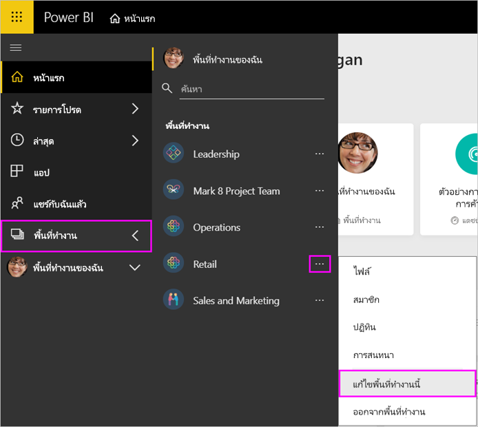

# จัดการพื้นที่ทำงานของคุณใน Power BI และ Microsoft 365Manage your workspace in Power BI and Microsoft 365

ในฐานะผู้สร้างหรือผู้ดูแลระบบของ[พื้นที่ทำงานใน Power BI](service-create-distribute-apps.md)หรือใน Microsoft 365 คุณสามารถจัดการลักษณะบางส่วนของพื้นที่ทำงานใน Power BIAs creator or admin of a [workspace in Power BI](service-create-distribute-apps.md) or in Microsoft 365, you manage some aspects of the workspace in Power BI. ลักษณะอื่น ๆ ที่คุณจัดการใน Microsoft 365Other aspects you manage in Microsoft 365.

> [!NOTE]
> ประสบการณ์พื้นที่ทำงานใหม่จะเปลี่ยนความสัมพันธ์ระหว่างพื้นที่ทำงาน Power BI และ Microsoft 365 GroupThe new workspace experience changes the relationship between Power BI workspaces and Microsoft 365 groups. คุณจะไม่สามารถสร้าง Microsoft 365 Group โดยอัตโนมัติทุกครั้งที่คุณสร้างพื้นที่ทำงานใหม่You aren't automatically creating a Microsoft 365 group every time you create one of the new workspaces. อ่านเกี่ยวกับ [สร้างพื้นที่ทำงานใหม่](service-create-the-new-workspaces.md)Read about [creating the new workspaces](service-create-the-new-workspaces.md).

ใน **Power BI** คุณสามารถ:In **Power BI** you can:

* เพิ่มหรือลบสมาชิกพื้นที่ทำงาน รวมถึงการทำให้สมาชิกพื้นที่ทำงานเป็นผู้ดูแลระบบAdd or remove workspace members, including making a workspace member an admin.
* แก้ไขชื่อพื้นที่ทำงานEdit the workspace name.
* ลบพื้นที่ทำงาน ซึ่งจะลบ Microsoft 365 Group ออกด้วยDelete the workspace, which also deletes the Microsoft 365 group.

ใน **Microsoft 365** คุณสามารถ:In **Microsoft 365** you can:

* เพิ่มหรือลบสมาชิกกลุ่มพื้นที่ทำงาน รวมถึงการทำให้สมาชิกเป็นเจ้าของAdd or remove your workspace's group members, including making a member an owner.
* แก้ไขชื่อกลุ่ม รูปภาพ คำอธิบาย และการตั้งค่าอื่นๆEdit the group name, image, description, and other settings.
* ดูที่อยู่อีเมลของกลุ่มSee the group email address.
* ลบกลุ่มDelete the group.

คุณจำเป็นต้องมี[สิทธิ์การใช้งาน Power BI Pro](../fundamentals/service-features-license-type.md) ในการเป็นผู้ดูแลระบบหรือสมาชิกของพื้นที่ทำงานYou need a [Power BI Pro license](../fundamentals/service-features-license-type.md) to be an admin or member of a workspace. ผู้ใช้แอปของคุณต้องมีสิทธิ์ใช้งาน Power BI Pro เช่นกัน ยกเว้นว่าพื้นที่ทำงานของคุณจะอยู่ในความจุ Power BI PremiumYour app users need a Power BI Pro license, too, unless your workspace is in a Power BI Premium capacity. อ่าน[Power BI Premium คืออะไร](../admin/service-premium-what-is.md)สำหรับรายละเอียดRead [What is Power BI Premium?](../admin/service-premium-what-is.md) for details.

## แก้ไขพื้นที่ทำงานใน Power BIEdit your workspace in Power BI

1. ในบริการของ Power BI เลือกลูกศรที่อยู่ถัดจาก **พื้นที่ทำงาน** > เลือก **ตัวเลือกเพิ่มเติม** (...) ถัดจากชื่อพื้นที่ทำงานของคุณ > **แก้ไขพื้นที่ทำงานนี้**In the Power BI service, select the arrow next to **Workspaces** > select **More options** (...) next to your workspace name > **Edit this workspace**.

   

   > [!NOTE]
   > คุณเห็นเฉพาะ **แก้ไขพื้นที่ทำงานนี้** ถ้าคุณเป็นผู้ดูแลระบบพื้นที่ทำงานYou only see **Edit this workspace** if you’re a workspace admin.

1. ที่นี่คุณสามารถเปลี่ยนชื่อพื้นที่ทำงาน เพิ่ม หรือลบสมาชิกออก หรือลบพื้นที่ทำงานได้Here you can rename the workspace, add or remove members, or delete the workspace.

   

1. เลือก **บันทึก** หรือ **ยกเลิก**Select **Save** or **Cancel**.

## แก้ไขคุณสมบัติพื้นที่ทำงาน Power BI ใน Microsoft 365Edit Power BI workspace properties in Microsoft 365

คุณยังสามารถแก้ไขลักษณะของพื้นที่ทำงานได้โดยตรงใน Outlook for Microsoft 365You can also edit aspects of a workspace directly in Outlook for Microsoft 365.

### แก้ไขสมาชิกของกลุ่มพื้นที่ทำงานEdit the members of the workspace group

1. ในบริการของ Power BI เลือกลูกศรอยู่ถัดจาก **พื้นที่ทำงาน** > เลือก **ตัวเลือกเพิ่มเติม** (... ) ถัดจากชื่อพื้นที่ทำงานของคุณ > **สมาชิก**In the Power BI service, select the arrow next to **Workspaces** > select **More options** (...) next to your workspace name > **Members**.

   

   การดำเนินการนี้จะเปิดมุมมอง Outlook for Microsoft 365 Group ของพื้นที่ทำงานThis opens the Outlook for Microsoft 365 group view of your workspace. คุณอาจจำเป็นต้องลงชื่อเข้าใช้บัญชีขององค์กรของคุณYou may need to sign in to your corporate account.

1. เลือกบทบาทถัดจากชื่อเพื่อนร่วมทีมเพื่อให้บุคคลนั้นเป็น **สมาชิก** หรือ **เจ้าของ**Select the role next to a teammate's name to make the person a **Member** or an **Owner**. เลือก **X** เพื่อลบบุคคลออกจากกลุ่มSelect the **X** to remove the person from the group.

   

### เพิ่มรูปภาพ และตั้งค่าคุณสมบัติพื้นที่ทำงานอื่นๆAdd an image and set other workspace properties

เมื่อคุณเผยแพร่แอปของคุณจากพื้นที่ทำงาน รูปภาพที่คุณเพิ่มที่นี่จะเป็นรูปภาพสำหรับแอปของคุณWhen you distribute your app from the workspace, the image you add here is the image for your app. ดูหัวข้อ [เพิ่มรูปภาพในพื้นที่ทำงาน Microsoft 365](service-create-workspaces.md#add-an-image-to-your-microsoft-365-workspace-optional) ในบทความ **สร้างพื้นที่ทำงานใหม่**See [Add an image to your Microsoft 365 workspace](service-create-workspaces.md#add-an-image-to-your-microsoft-365-workspace-optional) in the **Create the new workspaces** article.

1. ในมุมมอง Outlook for Microsoft 365 ของพื้นที่ทำงาน ให้ไปที่แท็บ **เกี่ยวกับ** แล้วเลือก **แก้ไข**In the Outlook for Microsoft 365 view of your workspace, go to the **About** tab and select **Edit**.

    
1. คุณสามารถแก้ไขชื่อ คำอธิบาย และภาษาสำหรับการแจ้งเตือนที่เกี่ยวข้องกับกลุ่มได้You can edit the name, description, and language for group-related notifications. คุณยังสามารถเพิ่มรูปภาพ และตั้งค่าคุณสมบัติอื่นได้ ที่นี่You can also add an image, and set other properties here.

   

1. เลือก **บันทึก** หรือ **ละทิ้ง**Select **Save** or **Discard**.

## ขั้นตอนถัดไปNext steps

* [เผยแพร่แอปใน Power BIPublish an app in Power BI](service-create-distribute-apps.md)

* มีคำถามเพิ่มเติมหรือไม่More questions? [ลองไปที่ชุมชน Power BITry the Power BI Community](https://community.powerbi.com/)
