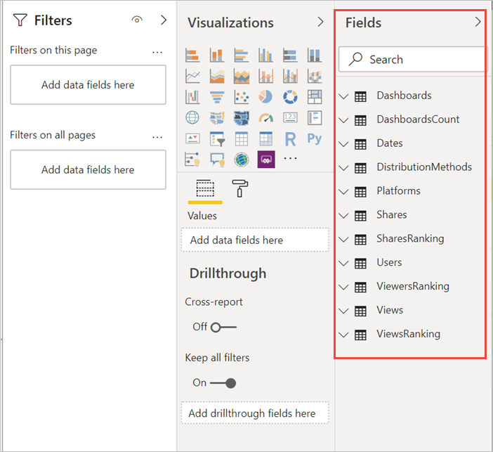
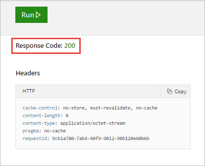

# ตรวจสอบเมตริกการใช้งานในประสบการณ์พื้นที่ทำงานใหม่ (ตัวอย่าง)

การทราบว่ามีการใช้เนื้อหาของคุณอย่างไรช่วยคุณในการแสดงผลกระทบและจัดลำดับความสำคัญความพยายามของคุณ เมตริกการใช้งานของคุณอาจแสดงให้เห็นว่ามีการใช้งานรายงานฉบับหนึ่งของคุณทุกวันโดยกลุ่มองค์กรขนาดใหญ่ ซึ่งอาจแสดงให้เห็นว่าไม่มีใครกำลังดูแดชบอร์ดที่คุณสร้างขึ้นเลย คำติชมประเภทนี้มีประโยชน์มากสำหรับเป็นแนวทางในการทำงานของคุณ

หากคุณสร้างรายงานในพื้นที่ทำงานที่ทันสมัย คุณสามารถเข้าถึงรายงานเมตริกการใช้งานที่ปรับปรุงแล้วได้ ซึ่งช่วยให้คุณสามารถค้นหาจากทั่วทั้งองกรณ์ของคุณได้ว่าใครที่กำลังใช้รายงานเหล่านั้น และพวกเขาใช้รายงานเหล่านั้นอย่างไร คุณยังสามารถระบุปัญหาด้านประสิทธิภาพการทำงานระดับสูงได้ รายงานการใช้งานที่ได้รับการปรับปรุงแล้วในประสบการณ์การใช้พื้นที่ทำงานที่ทันสมัยจะแทนที่รายงานเมตริกการทำงานที่มีอยู่ใน [การตรวจสอบเมตริกการใช้งานสำหรับแดชบอร์ดและรายงานของ Power BI ](service-usage-metrics.md)

> [!NOTE]
> คุณสามารถเรียกใช้รายงานเมตริกการใช้งานในบริการของ Power BI เท่านั้น อย่างไรก็ตาม หากคุณบันทึกการใช้เมตริกรายงานหรือปักหมุดไปยังแดชบอร์ด คุณสามารถเปิดและโต้ตอบกับรายงานนั้นบนอุปกรณ์เคลื่อนที่ได้

## ข้อกำหนดเบื้องต้น

- คุณต้องมีสิทธิการใช้งาน Power BI Pro เพื่อเรียกใช้และเข้าถึงข้อมูลเมตริกการใช้งาน อย่างไรก็ตาม คุณลักษณะเมตริกการใช้งานรวบรวมข้อมูลการใช้งานจากผู้ใช้ทั้งหมด ไม่ว่าผู้ใช้งานนั้นมีสิทธิการใช้งานเป็นแบบใด
- เมื่อต้องการเข้าถึงเมตริกการใช้งานที่ปรับปรุงแล้วสำหรับรายงาน รายงานต้องอยู่ในพื้นที่ทำงานที่ทันสมัยและคุณต้องมีสิทธิ์ในการแก้ไขรายงานนั้น
- ผู้ดูแลระบบ Power BI ของคุณต้องเปิดใช้งานเมตริกการใช้งานสำหรับผู้สร้างเนื้อหา ผู้ดูแลระบบ Power BI ของคุณยังอาจเก็บรวบรวมข้อมูลต่อผู้ใช้ในเมตริกการใช้งาน อ่านเกี่ยวกับวิธีการ[เปิดใช้งานตัวเลือกเหล่านี้ในพอร์ทัลผู้ดูแลระบบ](../admin/service-admin-portal.md#control-usage-metrics)

## สร้างและดูรายงานเมตริกการใช้งานที่ได้รับการปรับปรุง

เฉพาะผู้ใช้ที่มีสิทธิ์ของผู้ดูแลระบบ สมาชิก หรือผู้มีส่วนร่วมเท่านั้นที่สามารถดูรายงานเมตริกการใช้งานที่ได้รับการปรับปรุงแล้วได้ สิทธิ์ของผู้ชมไม่เพียงพอ หากอย่างน้อย คุณเป็นผู้มีส่วนร่วมในพื้นที่ทำงานที่ทันสมัยซึ่งมีรายงานของคุณคุณอยู่ คุณสามารถใช้ขั้นตอนต่อไปนี้เพื่อแสดงเมตริกการใช้งานที่ได้รับการปรับปรุง:

1. เปิดพื้นที่ทำงานที่มีรายงานที่คุณต้องการทำการวิเคราะห์โดยใช้เมตริกการใช้งาน
2. จากรายการเนื้อหาพื้นที่ทำงาน ให้เปิดเมนูบริบทของรายงานและเลือก **ดูรายงานเมตริกการใช้งาน** อีกวิธีหนึ่งคือเปิดรายงาน จากนั้นเปิดเมนูบริบทบนแถบคำสั่ง จากนั้นเลือก **เมตริกการใช้งาน**

    

1. ในครั้งแรกที่คุณทำเช่นนี้ Power BI จะสร้างรายงานเมตริกการใช้งานและแจ้งให้คุณทราบเมื่อพร้อม

    

1. เมื่อต้องการดูผลลัพธ์ เลือก **ดูเมตริกการใช้งาน**
2. หากนี่เป็นครั้งแรกที่คุณทำเช่นนี้ Power BI อาจเปิดรายงานเมตริกการใช้งานเดิมขึ้นมา หากต้องการแสดงรายงานเมตริกการใช้งานที่ปรับปรุงแล้ว ไปยังมุมบนขวา แล้วสลับโหมดรายงานการใช้งานใหม่เป็น **เปิด**

    

    > [!NOTE]
    > คุณสามารถดูได้เฉพาะการสลับรายงานการใช้งานใหม่ถ้ารายงานของคุณอยู่ในพื้นที่ทำงานที่ทันสมัย พื้นที่ทำงานแบบดั้งเดิมไม่มีรายงานเมตริกการใช้ที่ได้รับการปรับปรุงแล้ว

## เกี่ยวกับรายงานเมตริกการใช้งานที่ปรับปรุงแล้ว

เมื่อคุณแสดงรายงานเมตริกการใช้งานที่ปรับปรุงแล้ว Power BI จะสร้างรายงานที่สร้างไว้ล่วงหน้า ซึ่งประกอบด้วยเมตริกการใช้งานสำหรับเนื้อหานั้นในช่วง 30 วันที่ผ่านมา รายงานมีลักษณะคล้ายกับรายงาน Power BI ที่คุณคุ้นเคยอยู่แล้ว คุณสามารถแบ่งส่วนข้อมูลได้โดยยึดตามวิธีการที่ผู้ใช้ของคุณได้รับสิทธิ์การเข้าถึง ไม่ว่าพวกเขาเข้าถึงผ่านทางเว็บหรือแอปมือถือ หรืออื่น ๆ ในขณะที่รายงานของคุณค่อย ๆ พัฒนาขึ้น รายงานเมตริกการใช้งานก็จะพัฒนาขึ้นด้วยเช่นกัน ซึ่งจะอัปเดตข้อมูลใหม่ทุกวัน

> [!NOTE]
> รายงานเมตริกการใช้งานจะไม่แสดงขึ้นในรายการล่าสุด พื้นที่ทำงาน รายการโปรด หรือรายการเนื้อหาอื่นๆ ไม่สามารถเพิ่มรายงานเมตริกการใช้งานลงในแอปได้ ถ้าคุณปักหมุดไทล์จากรายงานเมตริกการใช้งานไปยังแดชบอร์ด จะไม่สามารถเพิ่มแดชบอร์ดลงในแอปได้

### ชุดข้อมูลรายงานเมตริกการใช้งาน

เมื่อคุณเปิดใช้รายงานเมตริกการใช้งานที่ปรับปรุงแล้วเป็นครั้งแรก Power BI จะสร้างชุดข้อมูลรายงานเมตริกการใช้งานโดยอัตโนมัติ รายงานเมตริกการใช้งานที่ปรับปรุงแล้วขึ้นอยูกับชุดข้อมูลนั้น Power BI จะรีเฟรชชุดข้อมูลนี้ทุกวัน ถึงแม้คุณจะไม่สามารถเปลี่ยนกำหนดเวลาการรีเฟรชได้ คุณยังสามารถอัปเดตข้อมูลประจำตัวที่ Power BI ใช้เพื่อรีเฟรชข้อมูลเมตริกการใช้งานได้ คุณอาจจำเป็นต้องดำเนินการรีเฟรชตามกำหนดเวลาต่อ หากข้อมูลประจำตัวหมดอายุ หรือหากคุณลบผู้ใช้ที่เปิดใช้รายงานเมตริกการใช้งานเป็นครั้งแรกออกจากพื้นที่ทำงานที่มีชุดข้อมูลอยู่

> [!NOTE]
> ขณะที่ยังอยู่ในตัวอย่าง ชุดข้อมูลเมตริกการใช้งานอาจมีการเปลี่ยนแปลงเล็กน้อยซึ่งมีผลต่อรายงานที่กำหนดเอง  

### หน้ารายงานเมตริกการใช้งาน

รายงานเมตริกการใช้งานที่ได้รับการปรับปรุงแล้วประกอบด้วยหน้ารายงานต่อไปนี้:

- **การใช้งานรายงาน** ให้ข้อมูลเกี่ยวกับการเข้าชมรายงานและผู้เข้าชมรายงาน เช่น จำนวนคนที่ดูรายงานแบ่งตามวันที่
- **ประสิทธิภาพการทำงานของรายงาน** แสดงเวลาการเปิดรายงานทั่วไป แบ่งย่อยตามวิธีการใช้และชนิดของเบราว์เซอร์
- **คำถามที่ถามบ่อย** ให้คำตอบสำหรับคำถามที่พบบ่อย เช่น "ผู้ชม" คืออะไร และ "การเข้าชม" คืออะไร

### มีการรายงานเมตริกใด?

| **หน้า** | **การวัด** | **คำอธิบาย** |
| --- | --- | --- |
| การใช้รายงาน | การดูรายงาน/การเปิดรายงาน | จะมีการบันทึกการดูรายงานทุกครั้งที่มีคนเปิดรายงานและแสดงถึงการเข้าถึงหน้ารายงานที่ไม่ซ้ำกัน ซึ่งจะตอบคำถามที่ว่า “มีการเข้าถึงรายงานบ่อยแค่ไหน” คำนิยามของการดูรายงานนี้แตกต่างจากรายงานเมตริกการใช้งานก่อนหน้านี้ การเปลี่ยนหน้ารายงานจะไม่ถือเป็นยอดการดูเพิ่มเติม แต่การเปลี่ยนหน้ารายงานจะนับรวมสำหรับเมตริกถัดไปแทน การดูหน้ารายงาน กิจกรรมเช่นการแชร์และการปักหมุดจะไม่ได้รับการพิจารณาในเมตริกการใช้งานอีกต่อไป |
| การใช้รายงาน | การดูหน้ารายงาน | มีการบันทึกการดูหน้ารายงานทุกครั้งที่มีคนดูหน้ารายงาน โดยแสดงยอดการดูทั้งหมดของทุกหน้า ซึ่งจะตอบคำถามที่ว่า “มีการเข้าถึงหน้ารายงานบ่อยแค่ไหน” ดังนั้นการเปลี่ยนหน้ารายงานจึงนับรวมสำหรับการดูหน้ารายงาน ดูรายละเอียดสำคัญที่[ข้อควรพิจารณาและข้อจำกัด](#considerations-and-limitations) |
| การใช้รายงาน | ผู้เข้าชมที่ไม่ซ้ำกัน | ผู้เข้าชม คือ ผู้ที่เปิดรายงานอย่างน้อยหนึ่งครั้งในช่วงเวลาหนึ่ง (ขึ้นอยู่กับบัญชีผู้ใช้ AAD) |
| การใช้รายงาน | แนวโน้มการเข้าชม | แนวโน้มการเข้าชมจะแสดงการเปลี่ยนแปลงของจำนวนการเข้าชมเมื่อเวลาผ่านไป โดยจะเปรียบเทียบครึ่งแรกของช่วงเวลาที่เลือกกับอีกครึ่งหนึ่ง |
| การใช้รายงาน | ตัวแบ่งส่วนข้อมูล | คุณสามารถเปลี่ยนช่วงเวลาบนหน้าการใช้งานรายงานได้ เช่น การคำนวณแนวโน้มรายสัปดาห์หรือรายปักษ์ ในมุมล่างซ้ายของหน้าการใช้งานรายงาน คุณสามารถกำหนดวันที่แรกเริ่มและล่าสุดสำหรับข้อมูลการใช้งานที่พร้อมใช้งานสำหรับรายงานที่เลือกไว้ได้ |
| การใช้รายงาน | อันดับ | อันดับจะแสดงความนิยมของรายงานเมื่อเปรียบเทียบกับรายงานอื่นๆ ทั้งหมดในองค์กร โดยอิงตามจำนวนการเข้าชม อันดับ 1 หมายความว่ารายงานมีการเข้าชมมากที่สุดจากรายงานทั้งหมดในองค์กร   |
| การใช้รายงาน | การเข้าชมรายงานต่อวัน | จำนวนครั้งในการดูรายงานทั้งหมดต่อวัน นับที่ระดับรายงาน โดยไม่พิจารณาการดูหน้ารายงาน |
| การใช้รายงาน | ผู้เข้าชมรายงานต่อวัน | จำนวนของผู้ใช้ทั้งหมดที่ดูรายงาน (โดยยึดตามบัญชีผู้ใช้ AAD) |
| การใช้รายงาน | วิธีการแจกจ่าย | วิธีที่ผู้ใช้เข้าถึงรายงาน เช่น เป็นสมาชิกของพื้นที่ทํางาน มีรายงานที่แชร์กับพวกเขา หรือติดตั้งแอป |
| การใช้รายงาน | ตัวแบ่งส่วนข้อมูลแพลตฟอร์ม | ถ้ามีการเข้าถึงรายงานผ่านทางบริการ Power BI (powerbi.com) Power BI Embedded หรืออุปกรณ์เคลื่อนที่ |
| การใช้รายงาน | ผู้ใช้ที่มีการเข้าชม | แสดงรายการของผู้ใช้ที่เปิดรายงานโดยเรียงลำดับตามจำนวนการเข้าชม |
| การใช้รายงาน | หน้า | ถ้ารายงานมีมากกว่า 1 หน้า แบ่งส่วนรายงานแยกตามหน้าที่มีการดู "Blank" หมายความว่ามีการเพิ่มหน้ารายงานภายใน 24 ชั่วโมงหลังจากที่หน้าใหม่ปรากฏในรายการตัวแบ่งส่วนข้อมูล หรือมีการลบหน้ารายงานออกแล้ว "Blank" จับประเภทของสถานการณ์เหล่านี้ |
| ประสิทธิภาพการทำงานของรายงาน | เวลาเปิดทั่วไป | เวลาเปิดรายงานทั่วไปจะสอดคล้องกับเปอร์เซ็นไทล์ที่ 50 ของเวลาที่ใช้ในการเปิดรายงาน ในอีกนัยหนึ่งคือเวลาที่อยู่ต่ำกว่า 50% ของการดำเนินการเปิดรายงานเสร็จสมบูรณ์ หน้าประสิทธิภาพการทำงานของรายงานยังแบ่งย่อย เวลาการเปิดรายงานทั่วไป ตามวิธีการใช้และชนิดของเบราว์เซอร์ ในปัจจุบัน เราวัดประสิทธิภาพการทำงานสำหรับการโหลดรายงานครั้งแรกและการดูหน้าแรก การวัดจะเริ่มต้นเมื่อมีการร้องขอรายงานและสิ้นสุดเมื่อวิชวลสุดท้ายเสร็จสมบูรณ์ การโต้ตอบกับรายงาน เช่น การแบ่งส่วนข้อมูล การกรอง หรือการเปลี่ยนหน้าจะไม่รวมอยู่ในการวัดประสิทธิภาพการทำงาน  |
| ประสิทธิภาพการทำงานของรายงาน | แนวโน้มเวลาเปิด | แนวโน้มเวลาเปิดจะแสดงการเปลี่ยนแปลงประสิทธิภาพการทำงานของการเปิดรายงานเมื่อเวลาผ่านไป ซึ่งจะเปรียบเทียบเวลาเปิดสำหรับรายงานของครึ่งแรกของช่วงเวลาที่เลือกกับเวลาเปิดของอีกครึ่งหนึ่ง |
| ประสิทธิภาพการทำงานของรายงาน | ตัวแบ่งส่วนข้อมูล | คุณสามารถเปลี่ยนช่วงเวลาบนหน้าประสิทธิภาพการทำงานของรายงานได้ เช่น การคำนวณแนวโน้มรายสัปดาห์หรือรายปักษ์ ในมุมล่างซ้ายของหน้าประสิทธิภาพการทำงานของรายงาน คุณสามารถกำหนดวันที่แรกเริ่มและล่าสุดสำหรับข้อมูลการใช้งานที่พร้อมใช้งานสำหรับรายงานที่เลือกไว้ได้ |
| ประสิทธิภาพการทำงานของรายงาน | ประสิทธิภาพการทำงานประจำวัน | ประสิทธิภาพการทำงานสำหรับ 10% 50% และ 90% ของการดำเนินการเปิดรายงานที่คำนวณสำหรับแต่ละวัน |
| ประสิทธิภาพการทำงานของรายงาน | ประสิทธิภาพการทำงานในเจ็ดวัน | ประสิทธิภาพการทำงาน 10%, 50% และ 90% ของการดำเนินการในการเปิดรายงานที่คำนวณสำหรับแต่ละวันในช่วงเจ็ดวันที่ผ่านมา |
| ประสิทธิภาพการทำงานของรายงาน | วิธีการใช้งาน | วิธีที่ผู้ใช้เปิดรายงาน เช่น ผ่านทางบริการ Power BI (powerbi.com) Power BI Embedded หรืออุปกรณ์เคลื่อนที่ |
| ประสิทธิภาพการทำงานของรายงาน | เบราว์เซอร์ | เบราว์เซอร์ที่ผู้ใช้ใช้เปิดรายงาน เช่น Firefox Edge และ Chrome |

### ตัวอย่างการทำงานของการวัดยอดการดูและผู้ชม

สมมติว่าเรามีรายงานสี่ฉบับซึ่งเข้าถึงได้โดยผู้ใช้สามรายดังต่อไปนี้:

| **ชื่อรายงาน** | **รูปแบบการใช้งาน** |
| --- | --- |
| รายงาน KPI | <ul><li>ผู้ใช้ A เปิดรายงานหน้า 1 |
| รายงาน HR | <ul><li>ผู้ใช้ A เปิดรายงานหน้า 1 จากนั้นจึงดูหน้า 2, หน้า 3 และหน้า 4 จากนั้นพวกเขาก็ดูหน้า 1 อีกครั้ง |
| รายงานทางการเงิน | <ul><li>ผู้ใช้ A เปิดรายงานหน้า 1 จากนั้นจึงดูหน้า 2</li><li>ผู้ใช้ B เปิดรายงานหน้า 1</li><li>ผู้ใช้ C เปิดรายงานหน้า 1 จากนั้นจึงดูหน้า 3</li></ul> |
| รายงานยอดขาย | <ul><li>ผู้ใช้ A เปิดรายงานหน้า 1 จากนั้นจึงดูหน้า 2</li><li>ผู้ใช้ C เปิดรายงานหน้า 2 (เช่น ผ่านบุ๊กมาร์ก)</li><li>ต่อมาในวันนี้ ผู้ใช้ C เปิดรายงานหน้า 1 </li></ul> |

สมมติว่าการวัดและส่งข้อมูลทางไกลของไคลเอ็นต์ทั้งหมดมาถึง Power BI ผลการวัดที่ได้คือ:

| **ชื่อรายงาน** | **การดูรายงาน** | **การดูหน้ารายงาน** | **ผู้ชม** |
| --- | --- | --- | --- |
| รายงาน KPI | 1 | 1 | 1 |
| รายงาน HR | 1 | 5 | 1 | 
| รายงานทางการเงิน | 3 | 5 | 3 |
| รายงานยอดขาย | 3 | 4 | 2 |

## อัปเดตข้อมูลประจำตัวรายงานเมตริกการใช้งาน

ใช้ขั้นตอนต่อไปนี้ในการใช้ชุดข้อมูลรายงานเมตริกการใช้งานและอัปเดตข้อมูลประจำตัว

1. เปิดพื้นที่ทำงานที่มีรายงานที่คุณต้องการอัปเดตชุดข้อมูลรายงานเมตริกการใช้งาน
2. ในแถบส่วนหัวสีดำที่ด้านบน ให้เลือกไอคอน **การตั้งค่า** จากนั้นเลือก **การตั้งค่า**

    

3. สลับไปที่แท็บ **ชุดข้อมูล**

1. เลือกชุดข้อมูลรายงานเมตริกการใช้งาน 

    
    
    ถ้าคุณไม่ใช่เจ้าของชุดข้อมูลปัจจุบัน คุณต้องเข้าใช้สถานะความเป็นเจ้าของก่อนที่คุณจะอัปเดตข้อมูลประจำตัวของแหล่งข้อมูลได้ 
    
5. เลือกปุ่ม **เข้าใช้** จากนั้นในกล่องโต้ตอบ **เข้าใช้การตั้งค่าชุดข้อมูล** เลือก **เข้าใช้** อีกครั้ง

1. ภายใต้ **ข้อมูลประจำตัวของแหล่งข้อมูล** ให้เลือก **แก้ไขข้อมูลประจำตัว**

    

2. ในกล่องโต้ตอบ **กำหนดค่ารายงานเมตริกการใช้งาน** เลือก **ลงชื่อเข้าใช้**

    

1. ทำตามลำดับการลงชื่อเข้าใช้ให้เสร็จสมบูรณ์และบันทึกการแจ้งเตือนว่าแหล่งข้อมูลได้รับการอัปเดตเรียบร้อยแล้ว

    > [!NOTE]
    > ชุดข้อมูลรายงานเมตริกการใช้งานมีข้อมูลการใช้งานสำหรับ 30 วันที่ผ่านมา ซึ่งอาจใช้เวลาสูงสุด 24 ชั่วโมงสำหรับการนำเข้าข้อมูลการใช้งานใหม่ คุณไม่สามารถทริกเกอร์การรีเฟรชด้วยตนเองได้โดยใช้อินเทอร์เฟซผู้ใช้ของ Power BI

## ปิดการใช้งานรายงานเมตริกการใช้งาน

รายงานเมตริกการใช้งานเป็นคุณลักษณะที่ผู้ดูแลระบบ Power BI หรือส่วนกลางสามารถเปิดหรือปิดได้ ผู้ดูแลระบบสามารถควบคุมระดับแยกย่อยที่ผู้ใช้มีสิทธิ์เข้าถึงเมตริกการใช้งาน ระดับแยกย่อยเหล่านี้มีอยู่แล้วโดยเป็นค่าเริ่มต้นสำหรับผู้ใช้ทั้งหมดในองค์กร ดู[ควบคุมเมตริกการใช้งาน](../admin/service-admin-portal.md#control-usage-metrics)ในบทความพอร์ทัลของผู้ดูแลระบบสำหรับรายละเอียดเกี่ยวกับการตั้งค่าเหล่านี้

> [!NOTE]
> เฉพาะผู้ดูแลระบบสำหรับผู้เช่า Power BI เท่านั้นที่สามารถดูพอร์ทัลผู้ดูแลระบบ และแก้ไขการตั้งค่า

## แยกข้อมูลผู้ใช้ออกจากรายงานเมตริกการใช้งาน

ตามค่าเริ่มต้น ข้อมูลต่อผู้ใช้จะเปิดใช้งานสําหรับเมตริกการใช้งาน ข้อมูลเนื้อหาบัญชีผู้บริโภครวมอยู่ในรายงานการวัด หากผู้ดูแลระบบไม่ต้องการเปิดเผยข้อมูลนี้กับผู้ใช้บางรายหรือทุกราย พวกเขาสามารถแยกข้อมูลผู้ใช้ออกจากรายงานการใช้งานของคุณได้ ในการตั้งค่าผู้เช่าพอร์ทัลผู้ดูแลระบบ Power BI พวกเขาสามารถปิดใช้งานข้อมูลต่อผู้ใช้ในเมตริกการใช้งานสำหรับกลุ่มความปลอดภัยที่ระบุหรือสำหรับทั้งองค์กรได้

1. บนแท็บ **การตั้งค่าผู้เช่า** ในพอร์ทัลผู้ดูแล ภายใต้ **การตรวจสอบและการตั้งค่าการใช้งาน** ขยาย **ข้อมูลต่อผู้ใช้ในเมตริกสำหรับผู้สร้างเนื้อหา** และเลือก **ปิดการใช้งาน**

2. ตัดสินใจว่าจะ **ลบข้อมูลต่อผู้ใช้ที่มีอยู่ทั้งหมดในเนื้อหาเมตริกการใช้งานปัจจุบันหรือไม่** เลือก **นำไปใช้**

    

ถ้าข้อมูลผู้ใช้ถูกแยกออกไปแล้ว รายงานการใช้จะอ้างอิงถึงผู้ใช้ว่า ไม่มีชื่อ

เมื่อปิดการใช้งานเมตริกการใช้งานสำหรับทั้งองค์กร ผู้ดูแลระบบสามารถใช้ตัวเลือกลบเนื้อหาเมตริกการใช้งานที่มีอยู่ทั้งหมด เพื่อลบรายงานและไทล์แดชบอร์ดที่มีอยู่ทั้งหมดที่สร้างขึ้นโดยใช้รายงานเมตริกการใช้งาน ตัวเลือกนี้จะลบการเข้าถึงข้อมูลเมตริกการใช้งานทั้งหมดสำหรับผู้ใช้ทั้งหมดในองค์กรที่อาจใช้งานอยู่แล้ว การลบเนื้อหาเมตริกการใช้งานที่มีอยู่เป็นการกระทำที่ไม่สามารถเรียกกลับคืนได้

> [!NOTE]
> เฉพาะผู้ดูแลระบบสำหรับผู้เช่า Power BI เท่านั้นที่สามารถดูพอร์ทัลผู้ดูแลระบบและกำหนดค่าข้อมูลต่อผู้ใช้ในเมตริกการใช้งานสำหรับการตั้งค่าผู้สร้างเนื้อหาได้

## กำหนดลักษณะรายงานเมตริกการใช้งาน

หากต้องการเจาะลึกข้อมูลรายงาน หรือต้องการสร้างรายงานของคุณเองกับชุดข้อมูลพื้นฐาน คุณมีหลายทางเลือก:

- **[สร้างสำเนาของรายงาน](#create-a-copy-of-the-usage-report) ในบริการของ Power BI**   ใช้ **บันทึกสำเนา** เพื่อสร้างอินสแตนซ์ของรายงานเมตริกการใช้งานที่แยกต่างหาก ซึ่งคุณสามารถปรับแต่งเพื่อให้ตรงตามความต้องการเฉพาะของคุณ
- **[เชื่อมต่อกับชุดข้อมูล](#create-a-new-usage-report-in-power-bi-desktop) ด้วยรายงานใหม่**   สำหรับทุกพื้นที่ทำงาน ชุดข้อมูลมีชื่อว่า "รายงานเมตริกการใช้งาน" ตามที่อธิบายไว้ในส่วนก่อนหน้านี้ [ชุดข้อมูลรายงานเมตริกการใช้งาน](#usage-metrics-report-dataset) คุณสามารถใช้ Power BI Desktop เพื่อสร้างรายงานเมตริกการใช้งานแบบกำหนดเองที่ยึดตามชุดข้อมูลพื้นฐาน
- **[ใช้การวิเคราะห์ใน Excel](#analyze-usage-data-in-excel)**   คุณยังสามารถวิเคราะห์ข้อมูลการใช้งาน Power BI ใน PivotTable, แผนภูมิ และคุณลักษณะตัวแบ่งส่วนข้อมูลใน Microsoft Excel ได้อีกด้วย อ่านเพิ่มเติมเกี่ยวกับคุณลักษณะ [การวิเคราะห์ใน Excel](service-analyze-in-excel.md)

### สร้างสำเนาของรายงานการใช้งาน

เมื่อคุณสร้างสำเนาของรายงานการใช้งานแบบอ่านอย่างเดียวที่สร้างไว้ล่วงหน้า Power BI จะสร้างอินสแตนซ์ของรายงานที่แก้ไขได้ ในการมองครั้งแรก จะเห็นว่ามีลักษณะเหมือนกัน อย่างไรก็ตาม ตอนนี้คุณสามารถเปิดรายงานในมุมมองการแก้ไข เพิ่มภาพ ตัวกรอง และหน้าปรับเปลี่ยนใหม่ หรือลบแสดงภาพที่มีอยู่ และอื่น ๆ อีกมาก Power BI จะบันทึกรายงานใหม่ในพื้นที่ทำงานปัจจุบัน

1. ในรายงานเมตริกการใช้งานใหม่ เลือกเมนู **ตัวเลือกเพิ่มเติม** (...) จากนั้นเลือก **บันทึกสำเนา**

    

2. ในกล่องโต้ตอบ **บันทึกรายงานของคุณ** ใส่ชื่อ จากนั้นเลือก **บันทึก**

    Power BI จะสร้างรายงาน Power BI ที่สามารถแก้ไขได้ โดยจะบันทึกไว้ในพื้นที่ทำงานปัจจุบัน อีกทั้งยังเปิดสำเนารายงานเช่นเดียวกัน 

3. เลือกเมนู **ตัวเลือกเพิ่มเติม** (...) จากนั้นเลือก **แก้ไข** เพื่อสลับไปยังมุมมองการแก้ไข 

    ตัวอย่างเช่น คุณสามารถเปลี่ยนตัวกรอง เพิ่มหน้าใหม่ และสร้างการแสดงภาพแบบใหม่  จัดรูปแบบตัวอักษร สี และอื่นๆ

1. รายงานใหม่จะถูกบันทึกในแท็บรายงานในพื้นที่ทำงานปัจจุบัน และเพิ่มลงในรายการเนื้อหาล่าสุด

    
    
> [!NOTE]
> เมื่อคุณบันทึกสำเนาของรายงานเมตริกการใช้งานจะถือว่าเหมือนกับรายงาน Power BI ปกติ จะสามารถเข้าถึงผู้ใช้ทั้งหมดที่มีสิทธิ์ในการดูในพื้นที่ทำงานรวมถึงผู้ใช้ในบทบาทผู้ชม

### สร้างรายงานการใช้งานใหม่ใน Power BI Desktop

คุณสามารถสร้างรายงานการใช้งานใหม่ใน Power BI Desktop ได้ โดยยึดตามชุดข้อมูลรายงานเมตริกการใช้งาน หากต้องการสร้างการเชื่อมต่อไปยังชุดข้อมูลรายงานเมตริกการใช้งานและสร้างรายงานของคุณเอง คุณจะต้องลงชื่อเข้าใช้บริการของ Power BI ใน Power BI Desktop 

1. เปิด Power BI Desktop

2. ถ้าคุณยังไม่ได้ลงชื่อเข้าใช้ในบริการของ Power BI บนเมนู  **ไฟล์** ให้เลือก **ลงชื่อเข้าใช้**

1. หากต้องการเชื่อมต่อกับชุดข้อมูลรายงานเมตริกการใช้งาน บน ribbon **หน้าแรก** เลือก **รับข้อมูล**

4. ในบานหน้าต่างด้านซ้าย เลือก **Power Platform** จากนั้นเลือก **ชุดข้อมูล Power BI** > **เชื่อมต่อ**

    

1. เลื่อนไปยังชุดข้อมูลที่ต้องการหรือพิมพ์ *รายงานเมตริกการใช้งาน* ในกล่องค้นหา 

6. ยืนยันในคอลัมน์พื้นที่ทำงานว่าคุณได้เลือกชุดข้อมูลที่ถูกต้องจากนั้นเลือก **สร้าง** 

    

7. ตรวจสอบรายการเขตข้อมูลใน Power BI Desktop ซึ่งช่วยให้คุณเข้าถึงตาราง คอลัมน์ และหน่วยวัดในชุดข้อมูลที่เลือก

    

1. ในตอนนี้คุณสามารถสร้างและแชร์รายงานการใช้งานแบบกำหนดเองทั้งหมดจากชุดข้อมูลรายงานเมตริกการใช้เดียวกัน

### วิเคราะห์ข้อมูลการใช้งานใน Excel

เมื่อคุณเชื่อมต่อกับข้อมูลการใช้งานใน Excel คุณสามารถสร้าง PivotTables ที่ใช้หน่วยวัดที่กำหนดไว้ล่วงหน้าได้ โปรดทราบว่า Pivottable ของ Excel ไม่สนับสนุนการรวมที่ลากแล้วปล่อยของเขตข้อมูลแบบตัวเลข เมื่อเชื่อมต่อกับชุดข้อมูลของ Power BI

1. ก่อนอื่น ถ้าคุณยังไม่ได้ดำเนินการนี้ [สร้างสำเนาของรายงานเมตริกการใช้งาน](#create-a-copy-of-the-usage-report) 

2. เปิดรายงานเมตริกการใช้งานใหม่ เลือกเมนู **ตัวเลือกเพิ่มเติม** (...) จากนั้นเลือก **วิเคราะห์ใน Excel**

    

1. ถ้าคุณเห็นกล่องโต้ตอบ **อันดับแรก คุณต้องมีการอัปเดต Excel** เลือก **ดาวน์โหลด** และติดตั้งการอัปเดตล่าสุดสำหรับการเชื่อมต่อ Power BI มิฉะนั้น ให้เลือก **ฉันได้ติดตั้งการอัปเดตเหล่านี้แล้ว**

    

    > [!NOTE]
    > บางองค์กรอาจมีกฎนโยบายกลุ่ม ที่ป้องกันการติดตั้งอัปเดตการวิเคราะห์ใน Excel ที่จำเป็นไปยัง Excel ถ้าคุณไม่สามารถติดตั้งการอัปเดตได้ โปรดตรวจสอบกับผู้ดูแลระบบของคุณ

1. ในกล่องโต้ตอบเบราว์เซอร์ที่ให้คุณระบุสิ่งที่คุณต้องการกระทำกับไฟล์ .odc ของรายงานเมตริกการใช้งาน ให้เลือก **เปิด**

    

1. Power BI เปิดใช้งาน Excel ตรวจสอบชื่อไฟล์และเส้นทางสำหรับไฟล์ .odc จากนั้นเลือก **เปิดใช้งาน**

    

1. ในตอนนี้ Excel ได้เปิดแล้วและคุณมี PivotTable ว่างเปล่าอยู่ คุณสามารถลากเขตข้อมูลไปยังแถว คอลัมน์ ตัวกรอง และกล่องค่าได้ และทำการสร้างมุมมองแบบกำหนดเองลงในข้อมูลการใช้งานของคุณได้

    

## เมตริกการใช้งานในระบบคลาวด์ของชาติ

Power BI มีอยู่ในระบบคลาวด์ของชาติแยกต่างหาก ระบบคลาวด์เหล่านี้มีการรักษาความปลอดภัย ความเป็นส่วนตัว การปฏิบัติตามข้อกำหนด และความโปร่งใสระดับเดียวกับ Power BI เวอร์ชันสากล รวมกับรูปแบบเฉพาะสำหรับข้อบังคับท้องถิ่นเกี่ยวกับการให้บริการ ที่เก็บข้อมูล การเข้าถึง และการควบคุม เมตริกการใช้งานที่ทันสมัยพร้อมใช้งานในระบบคลาวด์ของชาติต่อไปนี้: 

- US Government Community Cloud
- ชุมชนภาครัฐของสหรัฐอเมริกา Cloud High
- กระทรวงกลาโหมสหรัฐอเมริกา
- จีน

สำหรับข้อมูลเพิ่มเติม ให้ดู [ระบบคลาวด์ของชาติ](https://powerbi.microsoft.com/clouds/)

## ข้อควรพิจารณาและข้อจำกัด

เป็นสิ่งสำคัญที่ต้องทำความเข้าใจว่าความแตกต่างสามารถเกิดขึ้นได้ เมื่อเปรียบเทียบรายงานเมตริกการใช้งานกับรายงานที่มีก่อนหน้านี้ โดยเฉพาะอย่างยิ่งมุมมองเมตริกรายงานขณะนี้จะขึ้นอยู่กับข้อมูลกิจกรรมที่รวบรวมจากบริการ Power BI รายงานเมตริกการใช้งานเวอร์ชันก่อนหน้านี้ขึ้นอยู่กับการวัดและส่งข้อมูลทางไกลของไคลเอ็นต์เท่านั้น ซึ่งไม่ตรงกับเมตริกการใช้งานที่รวบรวมจากการบริการเสมอไป นอกจากนี้ รายงานเมตริกการใช้งานที่ปรับปรุงแล้วยังใช้คำนิยามที่แตกต่างกันสำหรับ "การดูรายงาน" การดูรายงานคือกิจกรรมการเปิดรายงาน ตามที่บันทึกในการบริการแต่ละครั้งที่มีคนเปิดรายงาน การเปลี่ยนหน้ารายงานจะไม่ถือเป็นยอดการดูเพิ่มเติม ในตอนนี้เราได้รวมการวัดยอดการดูหน้ารายงานแล้ว ซึ่งจะนับเฉพาะการดูทุกหน้า

> [!NOTE]
> เนื่องจากรายงานเมตริกการใช้งานที่ปรับปรุงแล้วนั้นขึ้นอยู่กับข้อมูลกิจกรรมที่รวบรวมจากบริการ Power BI ในตอนนี้การวัดยอดการดูรายงานจึงตรงกับจำนวนรวมของกิจกรรมในบันทึกการตรวจสอบและบันทึกกิจกรรม การนับจำนวนกิจกรรมขาดหรือเกินเนื่องจากการเชื่อมต่อเครือข่ายที่ไม่เสถียร ตัวบล็อกโฆษณา หรือปัญหาด้านไคลเอ็นต์อื่น ๆ จะไม่บิดเบือนจำนวนผู้ชมและจำนวนการเข้าชมอีกต่อไป อย่างไรก็ตาม การดูหน้ารายงานยังขึ้นอยู่กับการวัดและส่งข้อมูลทางไกลของไคลเอ็นต์ และอาจได้รับผลกระทบ

นอกเหนือจากความแตกต่างข้างต้นระหว่างรายงานเมตริกการใช้งานก่อนหน้าและที่ปรับปรุงแล้วนั้น ให้สังเกตข้อจำกัดต่อไปนี้สำหรับการเผยแพร่ตัวอย่าง:

- เมตริกการใช้งานแดชบอร์ดยังคงขึ้นอยู่กับรายงานเมตริกการใช้งานเวอร์ชันก่อนหน้านี้ และยังไม่มีในเมตริกการใช้งานที่ทันสมัย
- รายงานเมตริกการใช้งานที่ปรับปรุงแล้วจะใช้ได้สำหรับรายงานในพื้นที่ทำงานที่ทันสมัยเท่านั้น รายงานในพื้นที่ทำงานแบบดั้งเดิมสนับสนุนเฉพาะเวอร์ชันก่อนหน้านี้ของรายงานเมตริกการใช้เท่านั้น
- ข้อมูลประสิทธิภาพการทำงานและการวัดการดูหน้ารายงานขึ้นอยู่กับไคลเอ็นต์/อุปกรณ์ที่ส่งข้อมูลไปยัง Power BI ทั้งนี้ขึ้นอยู่กับเวลาแฝงของเครือข่าย ตัวปิดกั้นโฆษณา ไฟร์วอลล์ และกฎเครือข่ายที่กำหนดโดยองค์กรของคุณ ข้อมูลนี้อาจไม่มีทางเข้าถึง Power BI ได้เลย ดังนั้นข้อมูลประสิทธิภาพการทำงานและการดูหน้ารายงานอาจไม่รวมยอดการดูทั้งหมดหรือผู้ใช้ทั้งหมด
- การดูบางประเภทไม่ได้รวมอยู่ในการวัดประสิทธิภาพการทำงาน ตัวอย่างเช่น เมื่อผู้ใช้เลือกลิงก์ไปยังรายงานในข้อความอีเมล การดูรายงานจะนับเป็นการใช้รายงาน แต่ไม่มีกิจกรรมในการวัดประสิทธิภาพการทํางาน
- เมตริกประสิทธิภาพการทำงานของรายงานไม่พร้อมใช้งานสำหรับรายงานแบบแบ่งหน้า แท็บหน้าบนหน้าการใช้งานรายงาน เช่นเดียวกับแผนภูมิบนหน้าประสิทธิภาพการทำงานของรายงานจะไม่แสดงข้อมูลสำหรับชนิดของรายงานเหล่านี้
- การมาสก์ผู้ใช้ไม่ทำงานตามที่คาดไว้เมื่อใช้กลุ่มที่ซ้อนกัน ถ้าองค์กรของคุณได้ปิดการใช้งานข้อมูลต่อผู้ใช้ในเมตริกการใช้งานสำหรับผู้สร้างเนื้อหาในการตั้งค่าผู้เช่าพอร์ทัลผู้ดูแลระบบของ Power BI จะมีการมาสก์เฉพาะสมาชิกในระดับบนสุดเท่านั้น สมาชิกของกลุ่มย่อยจะยังคงมองเห็นได้
- การเริ่มต้นทำงานของชุดข้อมูลรายงานเมตริกการใช้งานอาจใช้เวลาสองถึงสามนาที ส่งผลให้มีการแสดงรายงานเมตริกการใช้งานที่ว่างเปล่าเนื่องจากอินเทอร์เฟซผู้ใช้ Power BI ไม่รอให้การรีเฟรชเสร็จสิ้น ตรวจสอบประวัติการรีเฟรชในการตั้งค่าชุดข้อมูลรายงานเมตริกการใช้งานเพื่อยืนยันว่าการดำเนินการรีเฟรชเสร็จสมบูรณ์แล้ว
- การเริ่มต้นทำงานของชุดข้อมูลรายงานเมตริกการใช้งานอาจล้มเหลวเนื่องจากพบการหมดเวลาในระหว่างการรีเฟรช ดูส่วนการแก้ไขปัญหาด้านล่างเพื่อแก้ไขปัญหานี้
- การแชร์ถูกปิดใช้งานสำหรับรายงานเมตริกการใช้งาน เพื่อให้ผู้ใช้สามารถอ่านรายงานก่อนอื่นคุณต้องให้สิทธิ์การเข้าถึงพื้นที่ทำงานแก่พวกเขา
- ในบางสถานการณ์ คุณอาจสังเกตเห็นว่าข้อมูลประสิทธิภาพการทำงานหายไป เหตุการณ์นี้สามารถเกิดขึ้นได้ หากผู้ใช้เปิดรายงานและโต้ตอบกับรายงานก่อนที่จะโหลดรายงานเสร็จสมบูรณ์ หรือหากเกิดข้อผิดพลาดในระหว่างการโหลดรายงาน 
- หากองค์กรของคุณใช้[ลิงก์ส่วนตัว](../admin/service-security-private-links.md) รายงานเมตริกการใช้งานที่ทันสมัยจะมีข้อมูลบางส่วน (เฉพาะมุมมองรายงานเท่านั้น) ข้อจำกัดในปัจจุบันเมื่อถ่ายโอนข้อมูลไคลเอนต์ผ่านลิงก์ส่วนตัวทำให้เราไม่สามารถเก็บข้อมูลมุมมองหน้ารายงานและข้อมูลประสิทธิภาพผ่านลิงก์ส่วนตัวได้ 

## คำถามที่ถามบ่อย

นอกเหนือจากข้อควรพิจารณาและข้อจำกัดต่างๆ ข้างต้นแล้ว คำถามและคำตอบเกี่ยวกับเมตริกการใช้งานต่อไปนี้อาจเป็นประโยชน์สำหรับผู้ใช้และผู้ดูแลระบบ:

**คำถาม:** เพราะเหตุใดฉันจึงเห็นยอดการดูหน้ารายงานน้อยกว่ายอดการดูรายงาน ทั้งสองอย่างนี้ไม่เหมือนกันใช่หรือไม่ 
**คำตอบ:** การดูรายงานขึ้นอยู่กับการวัดและส่งข้อมูลทางไกลของเซิร์ฟเวอร์ที่สร้างขึ้นเมื่อเปิดรายงานเป็นครั้งแรก เมื่อเปิดรายงาน ระบบได้โหลดคำนิยามหน้าลงในอุปกรณ์ของผู้ใช้แล้ว การดูหน้ารายงานขึ้นอยู่กับข้อมูลการใช้งานจากอุปกรณ์ผู้ใช้ที่เข้าถึง Power BI ในบางครั้งการดำเนินการนี้อาจถูกบล็อก ตามที่อธิบายไว้ใน[ข้อควรพิจารณาและขีดจำกัด](#considerations-and-limitations)

**คำถาม:** ฉันไม่สามารถเรียกใช้เมตริกการใช้งานบนรายงานได้
**คำตอบ:** คุณสามารถดูเมตริกการใช้งานสำหรับรายงานที่คุณเป็นเจ้าของหรือมีสิทธิ์ในการแก้ไขเท่านั้น

**คำถาม:** ทำไมฉันจึงไม่เห็นรายงานการใช้งานใหม่บนตัวสลับในมุมบนขวาของรายงานเมตริกการใช้งานที่มีอยู่ของฉัน
**คำตอบ:** รายงานเมตริกการใช้งานที่ปรับปรุงแล้วจะใช้ได้สำหรับรายงานในพื้นที่ทำงานที่ทันสมัยเท่านั้น

**คำถาม:** รายงานจะครอบคลุมอยู่ช่วงระยะเวลาเท่าใด
**คำตอบ:** รายงานการใช้งานจะขึ้นอยู่กับข้อมูลกิจกรรมสำหรับ 30 วันที่ผ่านมา โดยไม่รวมกิจกรรมของวันนั้นๆ คุณสามารถจำกัดช่วงเวลาโดยใช้ตัวแบ่งส่วนข้อมูลวันที่ในหน้าการใช้งานรายงาน เช่น เพื่อวิเคราะห์ข้อมูลของสัปดาห์ที่ผ่านมาเท่านั้น

**คำถาม:** ฉันจะเห็นข้อมูลกิจกรรมล่าสุดเมื่อใด
**คำตอบ:** รายงานการใช้งานจะมีข้อมูลกิจกรรมจนถึงวันที่เสร็จสมบูรณ์ล่าสุดโดยยึดตามโซนเวลา UTC ข้อมูลที่แสดงในรายงานจะขึ้นอยู่กับเวลาการรีเฟรชสำหรับชุดข้อมูลเช่นกัน Power BI รีเฟรชชุดข้อมูลหนึ่งครั้งต่อวัน

**คำถาม:** ข้อมูลเหมือนไม่อัปเดต
**คำตอบ:** โปรดทราบว่าอาจใช้เวลาถึง 24 ชั่วโมงสำหรับข้อมูลกิจกรรมใหม่ที่จะปรากฏในรายงานการใช้งาน

**คำถาม:** แหล่งข้อมูลสำหรับข้อมูลการใช้คืออะไร
**คำตอบ:** ชุดข้อมูลรายงานเมตริกการใช้งานจะนำเข้าข้อมูลจากที่เก็บเมทริกซ์การใช้งานภายใน Power BI โดยใช้ตัวเชื่อมต่อข้อมูลเมตริกการใช้งานแบบกำหนดเอง คุณสามารถอัปเดตข้อมูลประจำตัวสำหรับตัวเชื่อมต่อข้อมูลเมตริกการใช้งานบนหน้าการตั้งค่าชุดข้อมูลรายงานเมตริกการใช้งานได้

**คำถาม:** ฉันจะเชื่อมต่อไปยังข้อมูลได้อย่างไร หรือเปลี่ยนรายงานเริ่มต้นได้อย่างไร
**คำตอบ:** คุณสามารถสร้างสำเนาของรายงานการใช้งานแบบอ่านอย่างเดียวที่สร้างไว้ล่วงหน้าได้ สำเนารายงานจะเชื่อมต่อกับชุดข้อมูลรายงานเมตริกการใช้งานเดียวกันและช่วยให้คุณสามารถแก้ไขรายละเอียดรายงานได้

**คำถาม:** "ผู้เข้าชม" คืออะไร และ "การเข้าชม" คืออะไร
**คำตอบ:** ผู้เข้าชม คือ ผู้ที่เปิดรายงานอย่างน้อยหนึ่งครั้งในช่วงเวลาหนึ่ง การเข้าชม คือ เหตุการณ์เปิดรายงาน การเข้าชมรายงานจะถูกบันทึกในแต่ละครั้งที่มีคนเปิดรายงาน
โปรดทราบว่าคำนิยามของการเข้าชมจะแตกต่างจากรายงานเมตริกการใช้งานก่อนหน้านี้ การเปลี่ยนหน้ารายงานจะไม่ถือว่าเป็นการเข้าชมเพิ่มเติมอีกต่อไป

**คำถาม:**  "แนวโน้มการเข้าชม" คำนวณอย่างไร
**คำตอบ:** แนวโน้มการเข้าชมจะแสดงการเปลี่ยนแปลงของจำนวนการเข้าชมเมื่อเวลาผ่านไป โดยจะเปรียบเทียบครึ่งแรกของช่วงเวลาที่เลือกกับอีกครึ่งหนึ่ง คุณสามารถเปลี่ยนช่วงเวลาโดยใช้ตัวแบ่งส่วนข้อมูลวันที่บนหน้าการใช้งานรายงานได้ เช่น การคำนวณแนวโน้มรายสัปดาห์หรือรายปักษ์

**คำถาม:** "การแจกจ่าย" และ "แพลตฟอร์ม" หมายถึงอะไร
**คำตอบ:** การแจกจ่ายจะแสดงให้เห็นว่าผู้เข้าชมได้รับการเข้าถึงรายงานอย่างไร: ใช้ร่วมกันโดยตรง ผ่านการเข้าถึงพื้นที่ทำงาน หรือผ่านแอป
แพลตฟอร์มจะระบุเทคโนโลยีที่ผู้เข้าชมใช้ในการเปิดรายงาน: ผ่าน PowerBI.com อุปกรณ์เคลื่อนที่ หรือ Embedded

**คำถาม:** การจัดอันดับรายงานทำงานอย่างไร
**คำตอบ:** อันดับจะแสดงความนิยมของรายงานเมื่อเปรียบเทียบกับรายงานอื่นๆ ทั้งหมดในองค์กร โดยอิงตามจำนวนการเข้าชม อันดับ 1 หมายความว่ารายงานมีการเข้าชมมากที่สุดจากรายงานทั้งหมดในองค์กร

**คำถาม:** "ผู้ใช้ที่ไม่มีชื่อ" คืออะไร
**คำตอบ:** องค์กรของคุณสามารถตัดสินใจที่จะแยกข้อมูลผู้ใช้ออกจากรายงานการใช้งานของคุณ ถ้าข้อมูลผู้ใช้ถูกแยกออกไปแล้ว รายงานการใช้จะอ้างอิงถึงผู้ใช้ว่า ไม่มีชื่อ

**คำถาม:** "เวลาเปิดรายงานทั่วไป" คืออะไร
**คำตอบ:** เวลาเปิดรายงานทั่วไปจะสอดคล้องกับเปอร์เซ็นไทล์ที่ 50 ของเวลาที่ใช้ในการเปิดรายงาน ในอีกนัยหนึ่งคือเวลาที่อยู่ต่ำกว่า 50% ของการดำเนินการเปิดรายงานเสร็จสมบูรณ์ หน้าประสิทธิภาพการทำงานของรายงานยังแบ่งย่อย เวลาการเปิดรายงานทั่วไป ตามวิธีการใช้และชนิดของเบราว์เซอร์

**คำถาม:** "แนวโน้มเวลาเปิด" คำนวณอย่างไร
**คำตอบ:** แนวโน้มเวลาเปิดจะแสดงการเปลี่ยนแปลงประสิทธิภาพการทำงานของการเปิดรายงานเมื่อเวลาผ่านไป ซึ่งจะเปรียบเทียบเวลาเปิดสำหรับรายงานของครึ่งแรกของช่วงเวลาที่เลือกกับเวลาเปิดของอีกครึ่งหนึ่ง คุณสามารถเปลี่ยนช่วงเวลาโดยใช้ตัวแบ่งส่วนข้อมูลวันที่บนหน้าประสิทธิภาพการทำงานของรายงานได้ เช่น การคำนวณแนวโน้มรายสัปดาห์หรือรายปักษ์

**คำถาม:**  มีรายงานสี่รายงานในเวอร์ชันก่อนหน้าของรายงานเมตริกการใช้งาน แต่เวอร์ชันที่ปรับปรุงแล้วจะแสดงเพียงสามรายงานเท่านั้น
**คำตอบ:**  รายงานเมตริกการใช้งานที่ปรับปรุงแล้วจะรวมเฉพาะรายงานที่ถูกเปิดในช่วง 30 วันที่ผ่านมา ในขณะที่เวอร์ชันก่อนหน้าจะครอบคลุมช่วง 90 วันที่ผ่านมา ถ้ารายงานไม่ได้รวมอยู่ในรายงานเมตริกการใช้งานที่ปรับปรุงแล้ว แสดงว่าอาจไม่มีการใช้งานมามากกว่า 30 วัน

## การแก้ไขปัญหา: ลบชุดข้อมูล

ถ้าคุณสงสัยในเรื่องความสอดคล้องของข้อมูลหรือปัญหาการรีเฟรช อาจสมเหตุสมผลที่จะลบชุดข้อมูลรายงานเมตริกการใช้งานที่มีอยู่ออก จากนั้นเรียกใช้เมตริกการใช้งานการเข้าชมอีกครั้งเพื่อสร้างชุดข้อมูลใหม่ด้วยรายงานเมตริกการใช้งานที่ปรับปรุงแล้วที่เกี่ยวข้อง ทำตามขั้นตอนเหล่านี้

### ลบชุดข้อมูล

1. เปิดพื้นที่ทำงานที่มีรายงานที่คุณต้องการรีเซ็ตชุดข้อมูลรายงานเมตริกการใช้งาน

2. ในแถบส่วนหัวสีดำที่ด้านบน ให้เลือกไอคอน **การตั้งค่า** จากนั้นเลือก **การตั้งค่า**

    

3. สลับไปยังแท็บ **ชุดข้อมูล** และเลือกชุดข้อมูลรายงานเมตริกการใช้งาน 

    

5. คัดลอก ID พื้นที่ทำงานและชุดข้อมูลจาก URL ที่แสดงอยู่ในแถบที่อยู่ของเบราว์เซอร์ของคุณ

    

1. ในเบราว์เซอร์ของคุณ ให้ไปที่ [https://docs.microsoft.com/rest/api/power-bi/datasets/deletedatasetingroup](/rest/api/power-bi/datasets/deletedatasetingroup) และเลือกปุ่ม **ลองใช้**

    

1. ลงชื่อเข้าใช้ไปยัง Power BI วาง ID พื้นที่ทำงานลงในกล่องข้อความ **groupId** และ ID ชุดข้อมูลลงในกล่องข้อความ **datasetId** จากนั้นเลือก **ใช้งาน** 

    

1. ภายใต้ปุ่ม **ใช้งาน** ให้ยืนยันว่าบริการได้ส่งกลับรหัสการตอบกลับของ **200** รหัสดังกล่าวระบุว่าชุดข้อมูลและรายงานเมตริกการใช้งานที่เกี่ยวข้องได้ถูกลบออกเรียบร้อยแล้ว

    

### สร้างรายงานเมตริกการใช้งานใหม่

1. กลับไปในบริการของ Power BI คุณจะเห็นว่าชุดข้อมูลหายไป

    

2. ถ้าคุณยังคงเห็นรายงานเมตริกการใช้งานในรายการของรายงาน ให้รีเฟรชบราว์เซอร์ของคุณ

3. [สร้างรายงานเมตริกการใช้งานใหม่](#create--view-an-improved-usage-metrics-report)

## ขั้นตอนถัดไป

[การดูแล Power BI ในพอร์ทัลผู้ดูแลระบบ](../admin/service-admin-portal.md)

มีคำถามเพิ่มเติมหรือไม่ [ลองไปที่ชุมชน Power BI](https://community.powerbi.com/)
