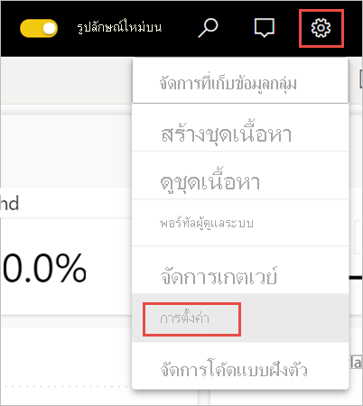
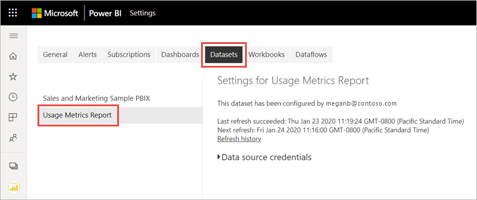

# ตรวจสอบเมตริกการใช้งานในประสบการณ์พื้นที่ทำงานใหม่ (ตัวอย่าง)Monitor usage metrics in the new workspace experience (preview)

การทราบว่ามีการใช้เนื้อหาของคุณอย่างไรช่วยคุณในการแสดงผลกระทบและจัดลำดับความสำคัญความพยายามของคุณKnowing how your content is being used helps you demonstrate your impact and prioritize your efforts. เมตริกการใช้งานของคุณอาจแสดงให้เห็นว่ามีการใช้งานรายงานฉบับหนึ่งของคุณทุกวันโดยกลุ่มองค์กรขนาดใหญ่Your usage metrics may show that one of your reports is used daily by a huge segment of the organization. ซึ่งอาจแสดงให้เห็นว่าไม่มีใครกำลังดูแดชบอร์ดที่คุณสร้างขึ้นเลยIt may show that nobody is viewing a dashboard you created at all. คำติชมประเภทนี้มีประโยชน์มากสำหรับเป็นแนวทางในการทำงานของคุณThis type of feedback is invaluable in guiding your work efforts.

หากคุณสร้างรายงานในพื้นที่ทำงานที่ทันสมัย คุณสามารถเข้าถึงรายงานเมตริกการใช้งานที่ปรับปรุงแล้วได้If you create reports in modern workspaces, you have access to improved usage metrics reports. ซึ่งช่วยให้คุณสามารถค้นหาจากทั่วทั้งองกรณ์ของคุณได้ว่าใครที่กำลังใช้รายงานเหล่านั้น และพวกเขาใช้รายงานเหล่านั้นอย่างไรThey enable you to discover who's using those reports throughout your organization, and and how they're using them. คุณยังสามารถระบุปัญหาด้านประสิทธิภาพการทำงานระดับสูงได้You can also identify high-level performance issues. รายงานการใช้งานที่ได้รับการปรับปรุงแล้วในประสบการณ์การใช้พื้นที่ทำงานที่ทันสมัยจะแทนที่รายงานเมตริกการทำงานที่มีอยู่ใน [การตรวจสอบเมตริกการใช้งานสำหรับแดชบอร์ดและรายงานของ Power BI ](service-usage-metrics.md)The improved usage reports in the modern Workspace experience replace the existing usage metrics reports documented in [Monitor usage metrics for Power BI dashboards and reports](service-usage-metrics.md).

> [!NOTE]
> คุณสามารถเรียกใช้รายงานเมตริกการใช้งานในบริการของ Power BI เท่านั้นYou can only run usage metrics reports in the Power BI service. อย่างไรก็ตาม หากคุณบันทึกการใช้เมตริกรายงานหรือปักหมุดไปยังแดชบอร์ด คุณสามารถเปิดและโต้ตอบกับรายงานนั้นบนอุปกรณ์เคลื่อนที่ได้However, if you save a usage metrics report or pin it to a dashboard, you can open and interact with that report on mobile devices.

## ข้อกำหนดเบื้องต้นPrerequisites

- คุณต้องมีสิทธิการใช้งาน Power BI Pro เพื่อเรียกใช้และเข้าถึงข้อมูลเมตริกการใช้งานYou need a Power BI Pro license to run and access the usage metrics data. อย่างไรก็ตาม คุณลักษณะเมตริกการใช้งานรวบรวมข้อมูลการใช้งานจากผู้ใช้ทั้งหมด ไม่ว่าผู้ใช้งานนั้นมีสิทธิการใช้งานเป็นแบบใดHowever, the usage metrics feature captures usage information from all users, regardless of the license they're assigned.
- เมื่อต้องการเข้าถึงเมตริกการใช้งานที่ปรับปรุงแล้วสำหรับรายงาน รายงานต้องอยู่ในพื้นที่ทำงานที่ทันสมัยและคุณต้องมีสิทธิ์ในการแก้ไขรายงานนั้นTo access improved usage metrics for a report, the report must reside in a modern workspace and you must have edit access to that report.
- ผู้ดูแลระบบ Power BI ของคุณต้องเปิดใช้งานเมตริกการใช้งานสำหรับผู้สร้างเนื้อหาYour Power BI admin must have enabled usage metrics for content creators. ผู้ดูแลระบบ Power BI ของคุณยังอาจเก็บรวบรวมข้อมูลต่อผู้ใช้ในเมตริกการใช้งานYour Power BI admin may have also enabled collecting per-user data in usage metrics. อ่านเกี่ยวกับวิธีการ[เปิดใช้งานตัวเลือกเหล่านี้ในพอร์ทัลผู้ดูแลระบบ](../admin/service-admin-portal.md#control-usage-metrics)Read about how to [enable these options in the admin portal](../admin/service-admin-portal.md#control-usage-metrics).

## สร้างและดูรายงานเมตริกการใช้งานที่ได้รับการปรับปรุงCreate & view an improved usage metrics report

เฉพาะผู้ใช้ที่มีสิทธิ์ของผู้ดูแลระบบ สมาชิก หรือผู้มีส่วนร่วมเท่านั้นที่สามารถดูรายงานเมตริกการใช้งานที่ได้รับการปรับปรุงแล้วได้Only users with admin, member, or contributor permissions can view the improved usage metrics report. สิทธิ์ของผู้ชมไม่เพียงพอViewer permissions aren't sufficient. หากอย่างน้อย คุณเป็นผู้มีส่วนร่วมในพื้นที่ทำงานที่ทันสมัยซึ่งมีรายงานของคุณคุณอยู่ คุณสามารถใช้ขั้นตอนต่อไปนี้เพื่อแสดงเมตริกการใช้งานที่ได้รับการปรับปรุง:If you are at least a contributor on a modern workspace in which your report resides, you can use the following procedure to display the improved usage metrics:

1. เปิดพื้นที่ทำงานที่มีรายงานที่คุณต้องการทำการวิเคราะห์โดยใช้เมตริกการใช้งานOpen the workspace that contains the report for which you want to analyze the usage metrics.
2. จากรายการเนื้อหาพื้นที่ทำงาน ให้เปิดเมนูบริบทของรายงานและเลือก **ดูรายงานเมตริกการใช้งาน**From either the workspace content list, open the context menu of the report and select **View usage metrics report**. อีกวิธีหนึ่งคือเปิดรายงาน จากนั้นเปิดเมนูบริบทบนแถบคำสั่ง จากนั้นเลือก **เมตริกการใช้งาน**Alternatively, open the report, then open the context menu on the command bar, and then select **Usage metrics**.

    

1. ในครั้งแรกที่คุณทำเช่นนี้ Power BI จะสร้างรายงานเมตริกการใช้งานและแจ้งให้คุณทราบเมื่อพร้อมThe first time you do this, Power BI creates the usage metrics report and lets you know when it's ready.

    

1. เมื่อต้องการดูผลลัพธ์ เลือก **ดูเมตริกการใช้งาน**To see the results, select **View usage metrics**.
2. หากนี่เป็นครั้งแรกที่คุณทำเช่นนี้ Power BI อาจเปิดรายงานเมตริกการใช้งานเดิมขึ้นมาIf this is the first time you do this, Power BI might open the old usage metrics report. หากต้องการแสดงรายงานเมตริกการใช้งานที่ปรับปรุงแล้ว ไปยังมุมบนขวา แล้วสลับโหมดรายงานการใช้งานใหม่เป็น **เปิด**To display the improved usage metrics report, in the upper right corner, toggle the New usage report off switch to **On**.

    

    > [!NOTE]
    > คุณสามารถดูได้เฉพาะการสลับรายงานการใช้งานใหม่ถ้ารายงานของคุณอยู่ในพื้นที่ทำงานที่ทันสมัยYou can only see the New usage report switch if your report resides in a modern workspace. พื้นที่ทำงานแบบดั้งเดิมไม่มีรายงานเมตริกการใช้ที่ได้รับการปรับปรุงแล้วLegacy workspaces do not offer improved usage metrics reports.

## เกี่ยวกับรายงานเมตริกการใช้งานที่ปรับปรุงแล้วAbout the improved usage metrics report

เมื่อคุณแสดงรายงานเมตริกการใช้งานที่ปรับปรุงแล้ว Power BI จะสร้างรายงานที่สร้างไว้ล่วงหน้าWhen you display this improved usage metrics report, Power BI generates a pre-built report. ซึ่งประกอบด้วยเมตริกการใช้งานสำหรับเนื้อหานั้นในช่วง 30 วันที่ผ่านมาIt contains usage metrics for that content for the last 30 days. รายงานมีลักษณะคล้ายกับรายงาน Power BI ที่คุณคุ้นเคยอยู่แล้วThe report looks similar to the Power BI reports you're already familiar with. คุณสามารถแบ่งส่วนข้อมูลได้โดยยึดตามวิธีการที่ผู้ใช้ของคุณได้รับสิทธิ์การเข้าถึง ไม่ว่าพวกเขาเข้าถึงผ่านทางเว็บหรือแอปมือถือ หรืออื่น ๆYou can slice based on how your end users received access, whether they accessed via the web or mobile app, and so on. ในขณะที่รายงานของคุณค่อย ๆ พัฒนาขึ้น รายงานเมตริกการใช้งานก็จะพัฒนาขึ้นด้วยเช่นกันAs your reports evolve, so too will the usage metrics report. ซึ่งจะอัปเดตข้อมูลใหม่ทุกวันIt updates every day with new data.

> [!NOTE]
> รายงานเมตริกการใช้งานจะไม่แสดงขึ้นในรายการล่าสุด พื้นที่ทำงาน รายการโปรด หรือรายการเนื้อหาอื่นๆUsage metrics reports don't show up in Recent, Workspaces, Favorites, or other content lists. ไม่สามารถเพิ่มรายงานเมตริกการใช้งานลงในแอปได้They can't be added to an app. ถ้าคุณปักหมุดไทล์จากรายงานเมตริกการใช้งานไปยังแดชบอร์ด จะไม่สามารถเพิ่มแดชบอร์ดลงในแอปได้If you pin a tile from a usage metrics report to a dashboard, you can't add that dashboard to an app.

### ชุดข้อมูลรายงานเมตริกการใช้งานUsage metrics report dataset

เมื่อคุณเปิดใช้รายงานเมตริกการใช้งานที่ปรับปรุงแล้วเป็นครั้งแรก Power BI จะสร้างชุดข้อมูลรายงานเมตริกการใช้งานโดยอัตโนมัติWhen you first launch the improved usage metrics report, Power BI automatically creates a Usage Metrics Report dataset. รายงานเมตริกการใช้งานที่ปรับปรุงแล้วขึ้นอยูกับชุดข้อมูลนั้นThe improved usage metrics report relies on that dataset. Power BI จะรีเฟรชชุดข้อมูลนี้ทุกวันPower BI then refreshes this dataset daily. ถึงแม้คุณจะไม่สามารถเปลี่ยนกำหนดเวลาการรีเฟรชได้ คุณยังสามารถอัปเดตข้อมูลประจำตัวที่ Power BI ใช้เพื่อรีเฟรชข้อมูลเมตริกการใช้งานได้While you can't change the refresh schedule, you can update the credentials that Power BI uses to refresh the usage metrics data. คุณอาจจำเป็นต้องดำเนินการรีเฟรชตามกำหนดเวลาต่อ หากข้อมูลประจำตัวหมดอายุ หรือหากคุณลบผู้ใช้ที่เปิดใช้รายงานเมตริกการใช้งานเป็นครั้งแรกออกจากพื้นที่ทำงานที่มีชุดข้อมูลอยู่You may need to resume scheduled refresh if the credentials expired, or if you removed the user who first launched the usage metrics report from the workspace where the dataset resides.

> [!NOTE]
> ขณะที่ยังอยู่ในตัวอย่าง ชุดข้อมูลเมตริกการใช้งานอาจมีการเปลี่ยนแปลงเล็กน้อยซึ่งมีผลต่อรายงานที่กำหนดเองWhile still in preview, the usage metrics dataset may have minor changes which affect custom reports.  

### หน้ารายงานเมตริกการใช้งานUsage metrics report pages

รายงานเมตริกการใช้งานที่ได้รับการปรับปรุงแล้วประกอบด้วยหน้ารายงานต่อไปนี้:The improved usage metrics report includes the following report pages:

- **การใช้งานรายงาน** ให้ข้อมูลเกี่ยวกับการเข้าชมรายงานและผู้เข้าชมรายงาน เช่น จำนวนคนที่ดูรายงานแบ่งตามวันที่**Report usage**    Provides information about report views and report viewers, such as how many users viewed the report by date.
- **ประสิทธิภาพการทำงานของรายงาน** แสดงเวลาการเปิดรายงานทั่วไป แบ่งย่อยตามวิธีการใช้และชนิดของเบราว์เซอร์**Report performance**    Shows the typical report opening times broken down by consumption method and browser types.
- **คำถามที่ถามบ่อย** ให้คำตอบสำหรับคำถามที่พบบ่อย เช่น "ผู้ชม" คืออะไร และ "การเข้าชม" คืออะไร**FAQ**     Provides answers to frequently asked questions, such as What is a "Viewer" and what is a "View"?

### มีการรายงานเมตริกใด?Which metrics are reported?

| **หน้า****Page** | **การวัด****Metric** | **คำอธิบาย****Description** |
| --- | --- | --- |
| การใช้รายงานReport usage | การดูรายงาน/การเปิดรายงานReport views/Report opens | จะมีการบันทึกการดูรายงานทุกครั้งที่มีคนเปิดรายงานและแสดงถึงการเข้าถึงหน้ารายงานที่ไม่ซ้ำกันA Report View is recorded each time someone opens a report and represents unique landings on the report. ซึ่งจะตอบคำถามที่ว่า “มีการเข้าถึงรายงานบ่อยแค่ไหน”It answers the question, "How often is the report accessed?" คำนิยามของการดูรายงานนี้แตกต่างจากรายงานเมตริกการใช้งานก่อนหน้านี้This definition of a Report View differs from previous usage metrics reports. การเปลี่ยนหน้ารายงานจะไม่ถือเป็นยอดการดูเพิ่มเติมChanging report pages is no longer considered an additional Report View. แต่การเปลี่ยนหน้ารายงานจะนับรวมสำหรับเมตริกถัดไปแทน การดูหน้ารายงานInstead, changing report pages counts for the next metric, Report Page Views. กิจกรรมเช่นการแชร์และการปักหมุดจะไม่ได้รับการพิจารณาในเมตริกการใช้งานอีกต่อไปActivities such as sharing and pinning are no longer considered in usage metrics. |
| การใช้รายงานReport usage | การดูหน้ารายงานReport Page views | มีการบันทึกการดูหน้ารายงานทุกครั้งที่มีคนดูหน้ารายงานA Report Page View is recorded every time someone views a report page. โดยแสดงยอดการดูทั้งหมดของทุกหน้าIt represents total views across any pages. ซึ่งจะตอบคำถามที่ว่า “มีการเข้าถึงหน้ารายงานบ่อยแค่ไหน”It answers the question, "How often are report pages accessed?" ดังนั้นการเปลี่ยนหน้ารายงานจึงนับรวมสำหรับการดูหน้ารายงานSo changing report pages counts for Report Page Views. ดูรายละเอียดสำคัญที่[ข้อควรพิจารณาและข้อจำกัด](#considerations-and-limitations)See [Considerations and Limitations](#considerations-and-limitations) for important details. |
| การใช้รายงานReport usage | ผู้เข้าชมที่ไม่ซ้ำกันUnique viewers | ผู้เข้าชม คือ ผู้ที่เปิดรายงานอย่างน้อยหนึ่งครั้งในช่วงเวลาหนึ่ง (ขึ้นอยู่กับบัญชีผู้ใช้ AAD)A viewer is someone who opened the report at least once during the time period (based on the AAD user account). |
| การใช้รายงานReport usage | แนวโน้มการเข้าชมView trend | แนวโน้มการเข้าชมจะแสดงการเปลี่ยนแปลงของจำนวนการเข้าชมเมื่อเวลาผ่านไปThe view trend reflects view count changes over time. โดยจะเปรียบเทียบครึ่งแรกของช่วงเวลาที่เลือกกับอีกครึ่งหนึ่งIt compares the first half of the selected time period with the second half. |
| การใช้รายงานReport usage | ตัวแบ่งส่วนข้อมูลDate slicer | คุณสามารถเปลี่ยนช่วงเวลาบนหน้าการใช้งานรายงานได้ เช่น การคำนวณแนวโน้มรายสัปดาห์หรือรายปักษ์You can change the time period on the Report usage page, such as to calculate week-over-week or biweekly trends. ในมุมล่างซ้ายของหน้าการใช้งานรายงาน คุณสามารถกำหนดวันที่แรกเริ่มและล่าสุดสำหรับข้อมูลการใช้งานที่พร้อมใช้งานสำหรับรายงานที่เลือกไว้ได้In the lower left corner of the Report usage page, you can determine the earliest and latest date for which usage data is available for the selected report. |
| การใช้รายงานReport usage | อันดับRank | อันดับจะแสดงความนิยมของรายงานเมื่อเปรียบเทียบกับรายงานอื่นๆ ทั้งหมดในองค์กร โดยอิงตามจำนวนการเข้าชมBased on view count, the rank shows the popularity of a report in comparison to all other reports in the organization. อันดับ 1 หมายความว่ารายงานมีการเข้าชมมากที่สุดจากรายงานทั้งหมดในองค์กรA rank of 1 would mean the report has the most views of all reports in the organization.   |
| การใช้รายงานReport usage | การเข้าชมรายงานต่อวันReport views per day | จำนวนครั้งในการดูรายงานทั้งหมดต่อวันTotal number of Report Views per day. นับที่ระดับรายงาน โดยไม่พิจารณาการดูหน้ารายงานCounted at report level, does not consider Report Page Views. |
| การใช้รายงานReport usage | ผู้เข้าชมรายงานต่อวันReport viewers per day | จำนวนของผู้ใช้ทั้งหมดที่ดูรายงาน (โดยยึดตามบัญชีผู้ใช้ AAD)Total number of different users who viewed the report (based on the AAD user account). |
| การใช้รายงานReport usage | วิธีการแจกจ่ายDistribution method | วิธีที่ผู้ใช้เข้าถึงรายงาน เช่น เป็นสมาชิกของพื้นที่ทํางาน มีรายงานที่แชร์กับพวกเขา หรือติดตั้งแอปHow users got access to the report, such as being members of a workspace, having the report shared with them, or installing an app. |
| การใช้รายงานReport usage | ตัวแบ่งส่วนข้อมูลแพลตฟอร์มPlatform slicer | ถ้ามีการเข้าถึงรายงานผ่านทางบริการ Power BI (powerbi.com) Power BI Embedded หรืออุปกรณ์เคลื่อนที่If the report was accessed via the Power BI service (powerbi.com), Power BI Embedded, or a mobile device. |
| การใช้รายงานReport usage | ผู้ใช้ที่มีการเข้าชมUsers with report views | แสดงรายการของผู้ใช้ที่เปิดรายงานโดยเรียงลำดับตามจำนวนการเข้าชมShows the list of users who opened the report sorted by view count. |
| การใช้รายงานReport usage | หน้าPages | ถ้ารายงานมีมากกว่า 1 หน้า แบ่งส่วนรายงานแยกตามหน้าที่มีการดูIf the report has more than 1 page, slice the report by the page(s) that was viewed. "Blank" หมายความว่ามีการเพิ่มหน้ารายงานภายใน 24 ชั่วโมงหลังจากที่หน้าใหม่ปรากฏในรายการตัวแบ่งส่วนข้อมูล หรือมีการลบหน้ารายงานออกแล้ว"Blank" means either a report page was added within 24 hours of the new page appearing in the slicer list, or report pages have been deleted. "Blank" จับประเภทของสถานการณ์เหล่านี้"Blank" captures these types of situations. |
| ประสิทธิภาพการทำงานของรายงานReport performance | เวลาเปิดทั่วไปTypical opening time | เวลาเปิดรายงานทั่วไปจะสอดคล้องกับเปอร์เซ็นไทล์ที่ 50 ของเวลาที่ใช้ในการเปิดรายงานThe typical report opening time corresponds to the 50th percentile of the time it takes to open the report. ในอีกนัยหนึ่งคือเวลาที่อยู่ต่ำกว่า 50% ของการดำเนินการเปิดรายงานเสร็จสมบูรณ์In other words, it is the time below which 50% of the open-report actions are completed. หน้าประสิทธิภาพการทำงานของรายงานยังแบ่งย่อย เวลาการเปิดรายงานทั่วไป ตามวิธีการใช้และชนิดของเบราว์เซอร์The Report performance page also breaks down the typical report opening time by consumption method and browser type. ในปัจจุบัน เราวัดประสิทธิภาพการทำงานสำหรับการโหลดรายงานครั้งแรกและการดูหน้าแรกAt present, we measure the performance for the initial report load and first page viewed. การวัดจะเริ่มต้นเมื่อมีการร้องขอรายงานและสิ้นสุดเมื่อวิชวลสุดท้ายเสร็จสมบูรณ์The measurement starts when the report is requested and ends when the last visual completes rendering. การโต้ตอบกับรายงาน เช่น การแบ่งส่วนข้อมูล การกรอง หรือการเปลี่ยนหน้าจะไม่รวมอยู่ในการวัดประสิทธิภาพการทำงานReport interactions such as slicing, filtering, or changing pages are not included in performance metrics.  |
| ประสิทธิภาพการทำงานของรายงานReport performance | แนวโน้มเวลาเปิดOpening time trend | แนวโน้มเวลาเปิดจะแสดงการเปลี่ยนแปลงประสิทธิภาพการทำงานของการเปิดรายงานเมื่อเวลาผ่านไปThe opening time trend reflects open-report performance changes over time. ซึ่งจะเปรียบเทียบเวลาเปิดสำหรับรายงานของครึ่งแรกของช่วงเวลาที่เลือกกับเวลาเปิดของอีกครึ่งหนึ่งIt compares the opening times for the report of the first half of the selected time period with the opening times of the second half. |
| ประสิทธิภาพการทำงานของรายงานReport performance | ตัวแบ่งส่วนข้อมูลDate slicer | คุณสามารถเปลี่ยนช่วงเวลาบนหน้าประสิทธิภาพการทำงานของรายงานได้ เช่น การคำนวณแนวโน้มรายสัปดาห์หรือรายปักษ์You can change the time period on the Report performance page, such as to calculate week-over-week or biweekly trends. ในมุมล่างซ้ายของหน้าประสิทธิภาพการทำงานของรายงาน คุณสามารถกำหนดวันที่แรกเริ่มและล่าสุดสำหรับข้อมูลการใช้งานที่พร้อมใช้งานสำหรับรายงานที่เลือกไว้ได้In the lower left corner of the Report performance page, you can determine the earliest and latest date for which usage data is available for the selected report. |
| ประสิทธิภาพการทำงานของรายงานReport performance | ประสิทธิภาพการทำงานประจำวันDaily performance | ประสิทธิภาพการทำงานสำหรับ 10% 50% และ 90% ของการดำเนินการเปิดรายงานที่คำนวณสำหรับแต่ละวันThe performance for 10%, 50%, and 90% of the open report actions calculated for each individual day. |
| ประสิทธิภาพการทำงานของรายงานReport performance | ประสิทธิภาพการทำงานในเจ็ดวันseven-day performance | ประสิทธิภาพการทำงาน 10%, 50% และ 90% ของการดำเนินการในการเปิดรายงานที่คำนวณสำหรับแต่ละวันในช่วงเจ็ดวันที่ผ่านมาThe performance for 10%, 50%, and 90% of the open report actions calculated across the past seven days for each date. |
| ประสิทธิภาพการทำงานของรายงานReport performance | วิธีการใช้งานConsumption method | วิธีที่ผู้ใช้เปิดรายงาน เช่น ผ่านทางบริการ Power BI (powerbi.com) Power BI Embedded หรืออุปกรณ์เคลื่อนที่How users opened the report, such as via the Power BI service (powerbi.com), Power BI Embedded, or a mobile device. |
| ประสิทธิภาพการทำงานของรายงานReport performance | เบราว์เซอร์Browsers | เบราว์เซอร์ที่ผู้ใช้ใช้เปิดรายงาน เช่น Firefox Edge และ ChromeWhat browser the users used to open the report, such as Firefox, Edge, and Chrome. |

### ตัวอย่างการทำงานของการวัดยอดการดูและผู้ชมWorked example of View and Viewer metrics

สมมติว่าเรามีรายงานสี่ฉบับซึ่งเข้าถึงได้โดยผู้ใช้สามรายดังต่อไปนี้:Suppose we have four reports that are accessed by three users as follows:

| **ชื่อรายงาน****Report Name** | **รูปแบบการใช้งาน****Usage Pattern** |
| --- | --- |
| รายงาน KPIKPI Report | <ul><li>ผู้ใช้ A เปิดรายงานหน้า 1User A opens the report on page 1. |
| รายงาน HRHR Report | <ul><li>ผู้ใช้ A เปิดรายงานหน้า 1 จากนั้นจึงดูหน้า 2, หน้า 3 และหน้า 4User A opens the report on page 1, then views page 2, page 3, and page 4. จากนั้นพวกเขาก็ดูหน้า 1 อีกครั้งThen they view page 1 again. |
| รายงานทางการเงินFinance Report | <ul><li>ผู้ใช้ A เปิดรายงานหน้า 1 จากนั้นจึงดูหน้า 2User A opens the report on page 1, then views page 2.</li><li>ผู้ใช้ B เปิดรายงานหน้า 1User B opens the report on page 1.</li><li>ผู้ใช้ C เปิดรายงานหน้า 1 จากนั้นจึงดูหน้า 3User C opens the report on page 1, then views page 3.</li></ul> |
| รายงานยอดขายSales Report | <ul><li>ผู้ใช้ A เปิดรายงานหน้า 1 จากนั้นจึงดูหน้า 2User A opens the report on page 1, then views page 2</li><li>ผู้ใช้ C เปิดรายงานหน้า 2 (เช่น ผ่านบุ๊กมาร์ก)User C opens the report on page 2 (e.g. via bookmark)</li><li>ต่อมาในวันนี้ ผู้ใช้ C เปิดรายงานหน้า 1Later in the day, User C opens the report on page 1 </li></ul> |

สมมติว่าการวัดและส่งข้อมูลทางไกลของไคลเอ็นต์ทั้งหมดมาถึง Power BI ผลการวัดที่ได้คือ:Assuming all client telemetry reaches Power BI, the resulting metrics would be:

| **ชื่อรายงาน****Report Name** | **การดูรายงาน****Report Views** | **การดูหน้ารายงาน****Report Page Views** | **ผู้ชม****Viewers** |
| --- | --- | --- | --- |
| รายงาน KPIKPI Report | 11 | 11 | 11 |
| รายงาน HRHR Report | 11 | 55 | 11 | 
| รายงานทางการเงินFinance Report | 33 | 55 | 33 |
| รายงานยอดขายSales Report | 33 | 44 | 22 |

## อัปเดตข้อมูลประจำตัวรายงานเมตริกการใช้งานUpdate usage metrics report credentials

ใช้ขั้นตอนต่อไปนี้ในการใช้ชุดข้อมูลรายงานเมตริกการใช้งานและอัปเดตข้อมูลประจำตัวUse the following procedure to take over a Usage Metrics Report dataset and update the credentials.

1. เปิดพื้นที่ทำงานที่มีรายงานที่คุณต้องการอัปเดตชุดข้อมูลรายงานเมตริกการใช้งานOpen the workspace that contains the report for which you want to update the Usage Metrics Report dataset.
2. ในแถบส่วนหัวสีดำที่ด้านบน ให้เลือกไอคอน **การตั้งค่า** จากนั้นเลือก **การตั้งค่า**In the black header bar at the top, select the **Settings** icon, then select **Settings**.

    

3. สลับไปที่แท็บ **ชุดข้อมูล**Switch to the **Datasets** tab.

1. เลือกชุดข้อมูลรายงานเมตริกการใช้งานSelect the Usage Metrics Report dataset. 

    
    
    ถ้าคุณไม่ใช่เจ้าของชุดข้อมูลปัจจุบัน คุณต้องเข้าใช้สถานะความเป็นเจ้าของก่อนที่คุณจะอัปเดตข้อมูลประจำตัวของแหล่งข้อมูลได้If you aren't the current dataset owner, you must take over ownership before you can update the data source credentials. 
    
5. เลือกปุ่ม **เข้าใช้** จากนั้นในกล่องโต้ตอบ **เข้าใช้การตั้งค่าชุดข้อมูล** เลือก **เข้าใช้** อีกครั้งSelect the **Take over** button, then in the **Take over dataset settings** dialog box, select **Take over** again.

1. ภายใต้ **ข้อมูลประจำตัวของแหล่งข้อมูล** ให้เลือก **แก้ไขข้อมูลประจำตัว**Under **Data source credentials**, select **Edit credentials**.

    

2. ในกล่องโต้ตอบ **กำหนดค่ารายงานเมตริกการใช้งาน** เลือก **ลงชื่อเข้าใช้**In the **Configure Usage Metrics Report** dialog box, select **Sign in**.

    

1. ทำตามลำดับการลงชื่อเข้าใช้ให้เสร็จสมบูรณ์และบันทึกการแจ้งเตือนว่าแหล่งข้อมูลได้รับการอัปเดตเรียบร้อยแล้วComplete the sign-in sequence and note the notification that the data source was updated successfully.

    > [!NOTE]
    > ชุดข้อมูลรายงานเมตริกการใช้งานมีข้อมูลการใช้งานสำหรับ 30 วันที่ผ่านมาThe Usage Metrics Report dataset contains usage data for the last 30 days. ซึ่งอาจใช้เวลาสูงสุด 24 ชั่วโมงสำหรับการนำเข้าข้อมูลการใช้งานใหม่It can take up to 24 hours for new usage data to be imported. คุณไม่สามารถทริกเกอร์การรีเฟรชด้วยตนเองได้โดยใช้อินเทอร์เฟซผู้ใช้ของ Power BIYou can't trigger a manual refresh by using the Power BI user interface.

## ปิดการใช้งานรายงานเมตริกการใช้งานDisable usage metrics reports

รายงานเมตริกการใช้งานเป็นคุณลักษณะที่ผู้ดูแลระบบ Power BI หรือส่วนกลางสามารถเปิดหรือปิดได้Usage metrics reports are a feature that the Power BI or global administrator can turn on or off. ผู้ดูแลระบบสามารถควบคุมระดับแยกย่อยที่ผู้ใช้มีสิทธิ์เข้าถึงเมตริกการใช้งาน ระดับแยกย่อยเหล่านี้มีอยู่แล้วโดยเป็นค่าเริ่มต้นสำหรับผู้ใช้ทั้งหมดในองค์กรAdministrators have granular control over which users have access to usage metrics; they are On by default for all users in the organization. ดู[ควบคุมเมตริกการใช้งาน](../admin/service-admin-portal.md#control-usage-metrics)ในบทความพอร์ทัลของผู้ดูแลระบบสำหรับรายละเอียดเกี่ยวกับการตั้งค่าเหล่านี้See [Control usage metrics](../admin/service-admin-portal.md#control-usage-metrics) in the Admin portal article for details on these settings.

> [!NOTE]
> เฉพาะผู้ดูแลระบบสำหรับผู้เช่า Power BI เท่านั้นที่สามารถดูพอร์ทัลผู้ดูแลระบบ และแก้ไขการตั้งค่าOnly admins for the Power BI tenant can see the Admin portal and edit settings.

## แยกข้อมูลผู้ใช้ออกจากรายงานเมตริกการใช้งานExclude user information from usage metrics reports

ตามค่าเริ่มต้น ข้อมูลต่อผู้ใช้จะเปิดใช้งานสําหรับเมตริกการใช้งานBy default, per-user data is enabled for usage metrics. ข้อมูลเนื้อหาบัญชีผู้บริโภครวมอยู่ในรายงานการวัดContent consumer account information is included in the metrics report. หากผู้ดูแลระบบไม่ต้องการเปิดเผยข้อมูลนี้กับผู้ใช้บางรายหรือทุกราย พวกเขาสามารถแยกข้อมูลผู้ใช้ออกจากรายงานการใช้งานของคุณได้If admins don't want to expose this information for some or all users, they can exclude user information from your usage report. ในการตั้งค่าผู้เช่าพอร์ทัลผู้ดูแลระบบ Power BI พวกเขาสามารถปิดใช้งานข้อมูลต่อผู้ใช้ในเมตริกการใช้งานสำหรับกลุ่มความปลอดภัยที่ระบุหรือสำหรับทั้งองค์กรได้In the Power BI admin portal tenant settings, they can disable per-user data in usage metrics for specified security groups or for the entire organization.

1. บนแท็บ **การตั้งค่าผู้เช่า** ในพอร์ทัลผู้ดูแล ภายใต้ **การตรวจสอบและการตั้งค่าการใช้งาน** ขยาย **ข้อมูลต่อผู้ใช้ในเมตริกสำหรับผู้สร้างเนื้อหา** และเลือก **ปิดการใช้งาน**On the **Tenant settings** tab in the admin portal, under **Audit and usage settings**, expand **Per-user data in metrics for content creators** and select **Disabled**.

2. ตัดสินใจว่าจะ **ลบข้อมูลต่อผู้ใช้ที่มีอยู่ทั้งหมดในเนื้อหาเมตริกการใช้งานปัจจุบันหรือไม่**Decide whether to **Delete all existing per-user data in current usage metrics content**. เลือก **นำไปใช้**Select **Apply**.

    

ถ้าข้อมูลผู้ใช้ถูกแยกออกไปแล้ว รายงานการใช้จะอ้างอิงถึงผู้ใช้ว่า ไม่มีชื่อIf user information is excluded, the usage report refers to users as Unnamed.

เมื่อปิดการใช้งานเมตริกการใช้งานสำหรับทั้งองค์กร ผู้ดูแลระบบสามารถใช้ตัวเลือกลบเนื้อหาเมตริกการใช้งานที่มีอยู่ทั้งหมด เพื่อลบรายงานและไทล์แดชบอร์ดที่มีอยู่ทั้งหมดที่สร้างขึ้นโดยใช้รายงานเมตริกการใช้งานWhen disabling usage metrics for their entire organization, admins can use the Delete all existing usage metrics content option to delete all existing reports and dashboard tiles that were built using the usage metrics reports. ตัวเลือกนี้จะลบการเข้าถึงข้อมูลเมตริกการใช้งานทั้งหมดสำหรับผู้ใช้ทั้งหมดในองค์กรที่อาจใช้งานอยู่แล้วThis option removes all access to usage metrics data for all users in the organization who may already be using it. การลบเนื้อหาเมตริกการใช้งานที่มีอยู่เป็นการกระทำที่ไม่สามารถเรียกกลับคืนได้Deleting existing usage metrics content is irreversible.

> [!NOTE]
> เฉพาะผู้ดูแลระบบสำหรับผู้เช่า Power BI เท่านั้นที่สามารถดูพอร์ทัลผู้ดูแลระบบและกำหนดค่าข้อมูลต่อผู้ใช้ในเมตริกการใช้งานสำหรับการตั้งค่าผู้สร้างเนื้อหาได้Only admins for the Power BI tenant can see the Admin portal and configure the Per-user data in usage metrics for content creators setting.

## กำหนดลักษณะรายงานเมตริกการใช้งานCustomize the usage metrics report

หากต้องการเจาะลึกข้อมูลรายงาน หรือต้องการสร้างรายงานของคุณเองกับชุดข้อมูลพื้นฐาน คุณมีหลายทางเลือก:To dig into the report data, or to build your own reports against the underlying dataset, you have several options:

- **[สร้างสำเนาของรายงาน](#create-a-copy-of-the-usage-report) ในบริการของ Power BI****[Make a copy of the report](#create-a-copy-of-the-usage-report) in the Power BI service.**   ใช้ **บันทึกสำเนา** เพื่อสร้างอินสแตนซ์ของรายงานเมตริกการใช้งานที่แยกต่างหาก ซึ่งคุณสามารถปรับแต่งเพื่อให้ตรงตามความต้องการเฉพาะของคุณUse **Save a copy** to create a separate instance of the usage metrics report, which you can customize to meet your specific needs.
- **[เชื่อมต่อกับชุดข้อมูล](#create-a-new-usage-report-in-power-bi-desktop) ด้วยรายงานใหม่****[Connect to the dataset](#create-a-new-usage-report-in-power-bi-desktop) with a new report.**   สำหรับทุกพื้นที่ทำงาน ชุดข้อมูลมีชื่อว่า "รายงานเมตริกการใช้งาน" ตามที่อธิบายไว้ในส่วนก่อนหน้านี้ [ชุดข้อมูลรายงานเมตริกการใช้งาน](#usage-metrics-report-dataset)For every workspace, the dataset has the name "Usage Metrics Report," as explained earlier in the section [Usage metrics report dataset](#usage-metrics-report-dataset). คุณสามารถใช้ Power BI Desktop เพื่อสร้างรายงานเมตริกการใช้งานแบบกำหนดเองที่ยึดตามชุดข้อมูลพื้นฐานYou can use Power BI Desktop to build custom usage metrics reports based on the underlying dataset.
- **[ใช้การวิเคราะห์ใน Excel](#analyze-usage-data-in-excel)****[Use Analyze in Excel](#analyze-usage-data-in-excel).**   คุณยังสามารถวิเคราะห์ข้อมูลการใช้งาน Power BI ใน PivotTable, แผนภูมิ และคุณลักษณะตัวแบ่งส่วนข้อมูลใน Microsoft Excel ได้อีกด้วยYou can also analyze the Power BI usage data in PivotTables, charts, and slicer features in Microsoft Excel. อ่านเพิ่มเติมเกี่ยวกับคุณลักษณะ [การวิเคราะห์ใน Excel](service-analyze-in-excel.md)Read more about the [Analyze in Excel](service-analyze-in-excel.md) feature.

### สร้างสำเนาของรายงานการใช้งานCreate a copy of the usage report

เมื่อคุณสร้างสำเนาของรายงานการใช้งานแบบอ่านอย่างเดียวที่สร้างไว้ล่วงหน้า Power BI จะสร้างอินสแตนซ์ของรายงานที่แก้ไขได้When you create a copy of the read-only, pre-built usage report, Power BI creates an editable instance of the report. ในการมองครั้งแรก จะเห็นว่ามีลักษณะเหมือนกันAt first glance, it looks the same. อย่างไรก็ตาม ตอนนี้คุณสามารถเปิดรายงานในมุมมองการแก้ไข เพิ่มภาพ ตัวกรอง และหน้าปรับเปลี่ยนใหม่ หรือลบแสดงภาพที่มีอยู่ และอื่น ๆ อีกมากHowever, you can now open the report in Editing view, add new visualizations, filters, and pages, modify or delete existing visualizations, and so on. Power BI จะบันทึกรายงานใหม่ในพื้นที่ทำงานปัจจุบันPower BI saves the new report in the current workspace.

1. ในรายงานเมตริกการใช้งานใหม่ เลือกเมนู **ตัวเลือกเพิ่มเติม** (...) จากนั้นเลือก **บันทึกสำเนา**In the new usage metrics report, select the **More options** menu (...), then select **Save a copy**.

    

2. ในกล่องโต้ตอบ **บันทึกรายงานของคุณ** ใส่ชื่อ จากนั้นเลือก **บันทึก**In the **Save your report** dialog box, enter a name, then select **Save**.

    Power BI จะสร้างรายงาน Power BI ที่สามารถแก้ไขได้ โดยจะบันทึกไว้ในพื้นที่ทำงานปัจจุบัน อีกทั้งยังเปิดสำเนารายงานเช่นเดียวกันPower BI creates an editable Power BI report, saved in the current workspace, and opens the report copy. 

3. เลือกเมนู **ตัวเลือกเพิ่มเติม** (...) จากนั้นเลือก **แก้ไข** เพื่อสลับไปยังมุมมองการแก้ไขSelect the **More options** menu (…), then select **Edit** to switch into Editing view. 

    ตัวอย่างเช่น คุณสามารถเปลี่ยนตัวกรอง เพิ่มหน้าใหม่ และสร้างการแสดงภาพแบบใหม่  จัดรูปแบบตัวอักษร สี และอื่นๆFor example, you can change filters, add new pages, and build new visualizations, format the fonts and colors, etc.

1. รายงานใหม่จะถูกบันทึกในแท็บรายงานในพื้นที่ทำงานปัจจุบัน และเพิ่มลงในรายการเนื้อหาล่าสุดThe new report is saved to the Reports tab in the current workspace and added to the Recent content list.

    
    
> [!NOTE]
> เมื่อคุณบันทึกสำเนาของรายงานเมตริกการใช้งานจะถือว่าเหมือนกับรายงาน Power BI ปกติWhen you save a copy of the usage metrics report it's treated like a regular Power BI report. จะสามารถเข้าถึงผู้ใช้ทั้งหมดที่มีสิทธิ์ในการดูในพื้นที่ทำงานรวมถึงผู้ใช้ในบทบาทผู้ชมIt will be accessible to all users who have viewing permissions in the workspace, including users in the Viewer role.

### สร้างรายงานการใช้งานใหม่ใน Power BI DesktopCreate a new usage report in Power BI Desktop

คุณสามารถสร้างรายงานการใช้งานใหม่ใน Power BI Desktop ได้ โดยยึดตามชุดข้อมูลรายงานเมตริกการใช้งานYou can create a new usage report in Power BI Desktop, based on the Usage Metrics Report dataset. หากต้องการสร้างการเชื่อมต่อไปยังชุดข้อมูลรายงานเมตริกการใช้งานและสร้างรายงานของคุณเอง คุณจะต้องลงชื่อเข้าใช้บริการของ Power BI ใน Power BI DesktopTo establish a connection to the Usage Metrics Report dataset and create your own report, you have to be signed in to the Power BI service in Power BI Desktop. 

1. เปิด Power BI DesktopOpen Power BI Desktop.

2. ถ้าคุณยังไม่ได้ลงชื่อเข้าใช้ในบริการของ Power BI บนเมนู  **ไฟล์** ให้เลือก **ลงชื่อเข้าใช้**If you aren't signed in to the Power BI service, on the **File** menu select **Sign in**.

1. หากต้องการเชื่อมต่อกับชุดข้อมูลรายงานเมตริกการใช้งาน บน ribbon **หน้าแรก** เลือก **รับข้อมูล**To connect to the Usage Metrics Report dataset, on the **Home** ribbon select **Get Data**.

4. ในบานหน้าต่างด้านซ้าย เลือก **Power Platform** จากนั้นเลือก **ชุดข้อมูล Power BI** > **เชื่อมต่อ**In the left pane, select **Power Platform**, then select **Power BI datasets** > **Connect**.

    

1. เลื่อนไปยังชุดข้อมูลที่ต้องการหรือพิมพ์ *รายงานเมตริกการใช้งาน* ในกล่องค้นหาScroll to the desired dataset or type *Usage Metrics Report* in the search box. 

6. ยืนยันในคอลัมน์พื้นที่ทำงานว่าคุณได้เลือกชุดข้อมูลที่ถูกต้องจากนั้นเลือก **สร้าง**Verify in the Workspace column that you are selecting the correct dataset, then select **Create**. 

    

7. ตรวจสอบรายการเขตข้อมูลใน Power BI Desktop ซึ่งช่วยให้คุณเข้าถึงตาราง คอลัมน์ และหน่วยวัดในชุดข้อมูลที่เลือกCheck the Fields list in Power BI Desktop, which gives you access to the tables, columns, and measures in the selected dataset.

    

1. ในตอนนี้คุณสามารถสร้างและแชร์รายงานการใช้งานแบบกำหนดเองทั้งหมดจากชุดข้อมูลรายงานเมตริกการใช้เดียวกันNow you can create and share custom usage reports, all from the same Usage Metrics Report dataset.

### วิเคราะห์ข้อมูลการใช้งานใน ExcelAnalyze usage data in Excel

เมื่อคุณเชื่อมต่อกับข้อมูลการใช้งานใน Excel คุณสามารถสร้าง PivotTables ที่ใช้หน่วยวัดที่กำหนดไว้ล่วงหน้าได้When you connect to the usage data in Excel, you can create PivotTables that use the pre-defined measures. โปรดทราบว่า Pivottable ของ Excel ไม่สนับสนุนการรวมที่ลากแล้วปล่อยของเขตข้อมูลแบบตัวเลข เมื่อเชื่อมต่อกับชุดข้อมูลของ Power BINote that Excel PivotTables do not support drag-and-drop aggregation of numeric fields when connecting to a Power BI dataset.

1. ก่อนอื่น ถ้าคุณยังไม่ได้ดำเนินการนี้ [สร้างสำเนาของรายงานเมตริกการใช้งาน](#create-a-copy-of-the-usage-report)First, if you haven't done so already, [create a copy of the usage metrics report](#create-a-copy-of-the-usage-report). 

2. เปิดรายงานเมตริกการใช้งานใหม่ เลือกเมนู **ตัวเลือกเพิ่มเติม** (...) จากนั้นเลือก **วิเคราะห์ใน Excel**Open the new usage metrics report, select the **More options** menu (…), and select **Analyze in Excel**.

    

1. ถ้าคุณเห็นกล่องโต้ตอบ **อันดับแรก คุณต้องมีการอัปเดต Excel** เลือก **ดาวน์โหลด** และติดตั้งการอัปเดตล่าสุดสำหรับการเชื่อมต่อ Power BIIf you see the **First, you need some Excel updates** dialog box, select **Download** and install the latest updates for Power BI connectivity. มิฉะนั้น ให้เลือก **ฉันได้ติดตั้งการอัปเดตเหล่านี้แล้ว**Otherwise, select **I've already installed these updates**.

    

    > [!NOTE]
    > บางองค์กรอาจมีกฎนโยบายกลุ่ม ที่ป้องกันการติดตั้งอัปเดตการวิเคราะห์ใน Excel ที่จำเป็นไปยัง ExcelSome organizations may have Group Policy rules that prevent installing the required Analyze in Excel updates to Excel. ถ้าคุณไม่สามารถติดตั้งการอัปเดตได้ โปรดตรวจสอบกับผู้ดูแลระบบของคุณIf you can't install the updates, check with your administrator.

1. ในกล่องโต้ตอบเบราว์เซอร์ที่ให้คุณระบุสิ่งที่คุณต้องการกระทำกับไฟล์ .odc ของรายงานเมตริกการใช้งาน ให้เลือก **เปิด**In the browser dialog asking what you want to do with the Usage Metrics report.odc file, select **Open**.

    

1. Power BI เปิดใช้งาน ExcelPower BI launches Excel. ตรวจสอบชื่อไฟล์และเส้นทางสำหรับไฟล์ .odc จากนั้นเลือก **เปิดใช้งาน**Verify the file name and path for the .odc file, then select **Enable**.

    

1. ในตอนนี้ Excel ได้เปิดแล้วและคุณมี PivotTable ว่างเปล่าอยู่ คุณสามารถลากเขตข้อมูลไปยังแถว คอลัมน์ ตัวกรอง และกล่องค่าได้ และทำการสร้างมุมมองแบบกำหนดเองลงในข้อมูลการใช้งานของคุณได้Now that Excel has opened and you have an empty PivotTable, you can drag fields onto the Rows, Columns, Filters, and Values boxes and create custom views into your usage data.

    

## เมตริกการใช้งานในระบบคลาวด์ของชาติUsage metrics in national clouds

Power BI มีอยู่ในระบบคลาวด์ของชาติแยกต่างหากPower BI is available in separate national clouds. ระบบคลาวด์เหล่านี้มีการรักษาความปลอดภัย ความเป็นส่วนตัว การปฏิบัติตามข้อกำหนด และความโปร่งใสระดับเดียวกับ Power BI เวอร์ชันสากล รวมกับรูปแบบเฉพาะสำหรับข้อบังคับท้องถิ่นเกี่ยวกับการให้บริการ ที่เก็บข้อมูล การเข้าถึง และการควบคุมThese clouds offer the same levels of security, privacy, compliance, and transparency as the global version of Power BI, combined with a unique model for local regulations on service delivery, data residency, access, and control. เมตริกการใช้งานที่ทันสมัยพร้อมใช้งานในระบบคลาวด์ของชาติต่อไปนี้:Modern usage metrics are currently available in following national clouds: 

- US Government Community CloudUS Government Community Cloud
- ชุมชนภาครัฐของสหรัฐอเมริกา Cloud HighUS Government Community Cloud High
- กระทรวงกลาโหมสหรัฐอเมริกาUS Department of Defense
- จีนChina

สำหรับข้อมูลเพิ่มเติม ให้ดู [ระบบคลาวด์ของชาติ](https://powerbi.microsoft.com/clouds/)For more information, see [national clouds](https://powerbi.microsoft.com/clouds/).

## ข้อควรพิจารณาและข้อจำกัดConsiderations and limitations

เป็นสิ่งสำคัญที่ต้องทำความเข้าใจว่าความแตกต่างสามารถเกิดขึ้นได้ เมื่อเปรียบเทียบรายงานเมตริกการใช้งานกับรายงานที่มีก่อนหน้านี้It's important to understand that differences can occur when comparing the improved usage metrics report with its predecessor. โดยเฉพาะอย่างยิ่งมุมมองเมตริกรายงานขณะนี้จะขึ้นอยู่กับข้อมูลกิจกรรมที่รวบรวมจากบริการ Power BIParticularly Report View metrics are now based on activity data collected from the Power BI service. รายงานเมตริกการใช้งานเวอร์ชันก่อนหน้านี้ขึ้นอยู่กับการวัดและส่งข้อมูลทางไกลของไคลเอ็นต์เท่านั้น ซึ่งไม่ตรงกับเมตริกการใช้งานที่รวบรวมจากการบริการเสมอไปPrevious versions of the usage metrics report relied only on client telemetry, which doesn't always match usage metrics collected from the service. นอกจากนี้ รายงานเมตริกการใช้งานที่ปรับปรุงแล้วยังใช้คำนิยามที่แตกต่างกันสำหรับ "การดูรายงาน"Moreover, the improved usage metrics report uses a different definition for a "Report View." การดูรายงานคือกิจกรรมการเปิดรายงาน ตามที่บันทึกในการบริการแต่ละครั้งที่มีคนเปิดรายงานA Report View is an open-report event, as recorded in the service each time someone opens a report. การเปลี่ยนหน้ารายงานจะไม่ถือเป็นยอดการดูเพิ่มเติมChanging report pages is no longer considered an additional Report View. ในตอนนี้เราได้รวมการวัดยอดการดูหน้ารายงานแล้ว ซึ่งจะนับเฉพาะการดูทุกหน้าWe now include a Report Page View metric, which specifically counts every page view.

> [!NOTE]
> เนื่องจากรายงานเมตริกการใช้งานที่ปรับปรุงแล้วนั้นขึ้นอยู่กับข้อมูลกิจกรรมที่รวบรวมจากบริการ Power BI ในตอนนี้การวัดยอดการดูรายงานจึงตรงกับจำนวนรวมของกิจกรรมในบันทึกการตรวจสอบและบันทึกกิจกรรมBecause the improved usage metrics report relies on activity data collected from the Power BI service, the Report View metrics now match the aggregate counts of activities in audit logs and activity logs. การนับจำนวนกิจกรรมขาดหรือเกินเนื่องจากการเชื่อมต่อเครือข่ายที่ไม่เสถียร ตัวบล็อกโฆษณา หรือปัญหาด้านไคลเอ็นต์อื่น ๆ จะไม่บิดเบือนจำนวนผู้ชมและจำนวนการเข้าชมอีกต่อไปUnder- and overcounting of activities due to inconsistent network connections, ad blockers, or other client-side issues no longer skew the Viewer and Report View counts. อย่างไรก็ตาม การดูหน้ารายงานยังขึ้นอยู่กับการวัดและส่งข้อมูลทางไกลของไคลเอ็นต์ และอาจได้รับผลกระทบHowever, Report Page Views still rely on client telemetry and can be affected.

นอกเหนือจากความแตกต่างข้างต้นระหว่างรายงานเมตริกการใช้งานก่อนหน้าและที่ปรับปรุงแล้วนั้น ให้สังเกตข้อจำกัดต่อไปนี้สำหรับการเผยแพร่ตัวอย่าง:In addition to the above differences between previous and improved usage metrics reports, note the following limitations for the preview release:

- เมตริกการใช้งานแดชบอร์ดยังคงขึ้นอยู่กับรายงานเมตริกการใช้งานเวอร์ชันก่อนหน้านี้ และยังไม่มีในเมตริกการใช้งานที่ทันสมัยDashboard usage metrics still rely on the previous version of the usage metrics reports and are not yet available in modern usage metrics.
- รายงานเมตริกการใช้งานที่ปรับปรุงแล้วจะใช้ได้สำหรับรายงานในพื้นที่ทำงานที่ทันสมัยเท่านั้นImproved usage metrics reports are only available for reports in modern workspaces. รายงานในพื้นที่ทำงานแบบดั้งเดิมสนับสนุนเฉพาะเวอร์ชันก่อนหน้านี้ของรายงานเมตริกการใช้เท่านั้นReports in legacy workspaces only support the previous version of the usage metrics reports.
- ข้อมูลประสิทธิภาพการทำงานและการวัดการดูหน้ารายงานขึ้นอยู่กับไคลเอ็นต์/อุปกรณ์ที่ส่งข้อมูลไปยัง Power BIPerformance data and Report Page View metrics rely on the client/device sending data to Power BI. ทั้งนี้ขึ้นอยู่กับเวลาแฝงของเครือข่าย ตัวปิดกั้นโฆษณา ไฟร์วอลล์ และกฎเครือข่ายที่กำหนดโดยองค์กรของคุณ ข้อมูลนี้อาจไม่มีทางเข้าถึง Power BI ได้เลยDepending on network latency, ad blockers, firewalls, and network rules set by your organization, this data may never reach Power BI. ดังนั้นข้อมูลประสิทธิภาพการทำงานและการดูหน้ารายงานอาจไม่รวมยอดการดูทั้งหมดหรือผู้ใช้ทั้งหมดTherefore, the performance and Report Page View data may not include all views or all users.
- การดูบางประเภทไม่ได้รวมอยู่ในการวัดประสิทธิภาพการทำงานCertain types of views aren't included in performance measurements. ตัวอย่างเช่น เมื่อผู้ใช้เลือกลิงก์ไปยังรายงานในข้อความอีเมล การดูรายงานจะนับเป็นการใช้รายงาน แต่ไม่มีกิจกรรมในการวัดประสิทธิภาพการทํางานFor example, when a user selects a link to a report in an email message, the Report View is accounted for in the report usage but there is no event in the performance metrics.
- เมตริกประสิทธิภาพการทำงานของรายงานไม่พร้อมใช้งานสำหรับรายงานแบบแบ่งหน้าReport performance metrics aren't available for Paginated Reports. แท็บหน้าบนหน้าการใช้งานรายงาน เช่นเดียวกับแผนภูมิบนหน้าประสิทธิภาพการทำงานของรายงานจะไม่แสดงข้อมูลสำหรับชนิดของรายงานเหล่านี้The Pages tab on the Report usage page as well as the charts on the Report performance page don't show data for these types of reports.
- การมาสก์ผู้ใช้ไม่ทำงานตามที่คาดไว้เมื่อใช้กลุ่มที่ซ้อนกันUser masking isn't working as expected when using nested groups. ถ้าองค์กรของคุณได้ปิดการใช้งานข้อมูลต่อผู้ใช้ในเมตริกการใช้งานสำหรับผู้สร้างเนื้อหาในการตั้งค่าผู้เช่าพอร์ทัลผู้ดูแลระบบของ Power BI จะมีการมาสก์เฉพาะสมาชิกในระดับบนสุดเท่านั้นIf your organization has disabled Per-user data in usage metrics for content creators in the Power BI admin portal tenant settings, only the members on the top level are being masked. สมาชิกของกลุ่มย่อยจะยังคงมองเห็นได้Members of subgroups are still visible.
- การเริ่มต้นทำงานของชุดข้อมูลรายงานเมตริกการใช้งานอาจใช้เวลาสองถึงสามนาที ส่งผลให้มีการแสดงรายงานเมตริกการใช้งานที่ว่างเปล่าเนื่องจากอินเทอร์เฟซผู้ใช้ Power BI ไม่รอให้การรีเฟรชเสร็จสิ้นInitializing the Usage Metrics Report dataset might take a few minutes, resulting in showing a blank usage metrics report because the Power BI user interface does not wait for the refresh to finish. ตรวจสอบประวัติการรีเฟรชในการตั้งค่าชุดข้อมูลรายงานเมตริกการใช้งานเพื่อยืนยันว่าการดำเนินการรีเฟรชเสร็จสมบูรณ์แล้วCheck the refresh history in the Usage Metrics Report dataset settings to verify that the refresh operation succeeded.
- การเริ่มต้นทำงานของชุดข้อมูลรายงานเมตริกการใช้งานอาจล้มเหลวเนื่องจากพบการหมดเวลาในระหว่างการรีเฟรชInitializing the Usage Metrics Report dataset might fail due to a timeout encountered during refresh. ดูส่วนการแก้ไขปัญหาด้านล่างเพื่อแก้ไขปัญหานี้Refer to the Troubleshooting section below to resolve this issue.
- การแชร์ถูกปิดใช้งานสำหรับรายงานเมตริกการใช้งานSharing is disabled for the usage metrics report. เพื่อให้ผู้ใช้สามารถอ่านรายงานก่อนอื่นคุณต้องให้สิทธิ์การเข้าถึงพื้นที่ทำงานแก่พวกเขาTo give people read access to the report, you first need to give them access to the workspace.
- ในบางสถานการณ์ คุณอาจสังเกตเห็นว่าข้อมูลประสิทธิภาพการทำงานหายไปIn some scenarios, you may notice the performance data is missing. เหตุการณ์นี้สามารถเกิดขึ้นได้ หากผู้ใช้เปิดรายงานและโต้ตอบกับรายงานก่อนที่จะโหลดรายงานเสร็จสมบูรณ์ หรือหากเกิดข้อผิดพลาดในระหว่างการโหลดรายงานThis can occur if a user opens a report and interacts with the report before it has completed loading or if an error occurred during the report load. 

## คำถามที่ถามบ่อยFrequently asked questions

นอกเหนือจากข้อควรพิจารณาและข้อจำกัดต่างๆ ข้างต้นแล้ว คำถามและคำตอบเกี่ยวกับเมตริกการใช้งานต่อไปนี้อาจเป็นประโยชน์สำหรับผู้ใช้และผู้ดูแลระบบ:In addition to the above considerations and limitations, the following questions and answers about usage metrics might be helpful for users and administrators:

**คำถาม:** เพราะเหตุใดฉันจึงเห็นยอดการดูหน้ารายงานน้อยกว่ายอดการดูรายงาน ทั้งสองอย่างนี้ไม่เหมือนกันใช่หรือไม่**Q:** Why do I see fewer Report Page Views than Report Views, shouldn't they be at least the same? 
**คำตอบ:** การดูรายงานขึ้นอยู่กับการวัดและส่งข้อมูลทางไกลของเซิร์ฟเวอร์ที่สร้างขึ้นเมื่อเปิดรายงานเป็นครั้งแรก**A:** Report Views rely on server telemetry that is generated when the report is first opened. เมื่อเปิดรายงาน ระบบได้โหลดคำนิยามหน้าลงในอุปกรณ์ของผู้ใช้แล้วOnce a report is open, its page definitions are already loaded onto the users device. การดูหน้ารายงานขึ้นอยู่กับข้อมูลการใช้งานจากอุปกรณ์ผู้ใช้ที่เข้าถึง Power BIReport Page Views rely on usage information from the users device reaching Power BI. ในบางครั้งการดำเนินการนี้อาจถูกบล็อก ตามที่อธิบายไว้ใน[ข้อควรพิจารณาและขีดจำกัด](#considerations-and-limitations)This can sometimes be blocked, as described in [Considerations and Limitations](#considerations-and-limitations).

**คำถาม:** ฉันไม่สามารถเรียกใช้เมตริกการใช้งานบนรายงานได้**Q:** I can't run usage metrics on a report.
**คำตอบ:** คุณสามารถดูเมตริกการใช้งานสำหรับรายงานที่คุณเป็นเจ้าของหรือมีสิทธิ์ในการแก้ไขเท่านั้น**A:** You can only see usage metrics for reports you own or have permissions to edit.

**คำถาม:** ทำไมฉันจึงไม่เห็นรายงานการใช้งานใหม่บนตัวสลับในมุมบนขวาของรายงานเมตริกการใช้งานที่มีอยู่ของฉัน**Q:** Why can't I see the New usage report on toggle in the upper right corner of my existing usage metrics report?
**คำตอบ:** รายงานเมตริกการใช้งานที่ปรับปรุงแล้วจะใช้ได้สำหรับรายงานในพื้นที่ทำงานที่ทันสมัยเท่านั้น**A:** The improved usage metrics report is only available for reports in modern workspaces.

**คำถาม:** รายงานจะครอบคลุมอยู่ช่วงระยะเวลาเท่าใด**Q:** What time period is covered by the report?
**คำตอบ:** รายงานการใช้งานจะขึ้นอยู่กับข้อมูลกิจกรรมสำหรับ 30 วันที่ผ่านมา โดยไม่รวมกิจกรรมของวันนั้นๆ**A:** The usage report is based on activity data for the last 30 days, excluding activities of the current day. คุณสามารถจำกัดช่วงเวลาโดยใช้ตัวแบ่งส่วนข้อมูลวันที่ในหน้าการใช้งานรายงาน เช่น เพื่อวิเคราะห์ข้อมูลของสัปดาห์ที่ผ่านมาเท่านั้นYou can narrow the time period by using the Date slicer on the Report usage page, such as to analyze only last week's data.

**คำถาม:** ฉันจะเห็นข้อมูลกิจกรรมล่าสุดเมื่อใด**Q:** When will I see the most recent activity data?
**คำตอบ:** รายงานการใช้งานจะมีข้อมูลกิจกรรมจนถึงวันที่เสร็จสมบูรณ์ล่าสุดโดยยึดตามโซนเวลา UTC**A:** The usage report includes activity data up until the last complete day based on the UTC time zone. ข้อมูลที่แสดงในรายงานจะขึ้นอยู่กับเวลาการรีเฟรชสำหรับชุดข้อมูลเช่นกันThe data shown in the report is also dependent on the refresh time for the dataset. Power BI รีเฟรชชุดข้อมูลหนึ่งครั้งต่อวันPower BI refreshes the dataset once per day.

**คำถาม:** ข้อมูลเหมือนไม่อัปเดต**Q:** The data doesn't seem up to date.
**คำตอบ:** โปรดทราบว่าอาจใช้เวลาถึง 24 ชั่วโมงสำหรับข้อมูลกิจกรรมใหม่ที่จะปรากฏในรายงานการใช้งาน**A:** Note that it might take up to 24 hours for new activity data to appear in the usage report.

**คำถาม:** แหล่งข้อมูลสำหรับข้อมูลการใช้คืออะไร**Q:** What is the data source for the usage data?
**คำตอบ:** ชุดข้อมูลรายงานเมตริกการใช้งานจะนำเข้าข้อมูลจากที่เก็บเมทริกซ์การใช้งานภายใน Power BI โดยใช้ตัวเชื่อมต่อข้อมูลเมตริกการใช้งานแบบกำหนดเอง**A:** The Usage Metrics Report dataset imports data from a Power BI-internal usage metrics store by using a custom Usage Metrics Data Connector. คุณสามารถอัปเดตข้อมูลประจำตัวสำหรับตัวเชื่อมต่อข้อมูลเมตริกการใช้งานบนหน้าการตั้งค่าชุดข้อมูลรายงานเมตริกการใช้งานได้You can update the credentials for the Usage Metrics Data Connector on the Usage Metrics Report dataset settings page.

**คำถาม:** ฉันจะเชื่อมต่อไปยังข้อมูลได้อย่างไร**Q:** How can I connect to the data? หรือเปลี่ยนรายงานเริ่มต้นได้อย่างไรOr change the default report?
**คำตอบ:** คุณสามารถสร้างสำเนาของรายงานการใช้งานแบบอ่านอย่างเดียวที่สร้างไว้ล่วงหน้าได้**A:** You can create a copy of the read-only, pre-built usage report. สำเนารายงานจะเชื่อมต่อกับชุดข้อมูลรายงานเมตริกการใช้งานเดียวกันและช่วยให้คุณสามารถแก้ไขรายละเอียดรายงานได้The report copy connects to the same Usage Metrics Report dataset and enables you to edit the report details.

**คำถาม:** "ผู้เข้าชม" คืออะไร และ "การเข้าชม" คืออะไร**Q:** What is a "Viewer" and what is a "View"?
**คำตอบ:** ผู้เข้าชม คือ ผู้ที่เปิดรายงานอย่างน้อยหนึ่งครั้งในช่วงเวลาหนึ่ง**A:** A viewer is someone who opened the report at least once during the time period. การเข้าชม คือ เหตุการณ์เปิดรายงานA view is an open-report event. การเข้าชมรายงานจะถูกบันทึกในแต่ละครั้งที่มีคนเปิดรายงานA report view is recorded each time someone opens a report.
โปรดทราบว่าคำนิยามของการเข้าชมจะแตกต่างจากรายงานเมตริกการใช้งานก่อนหน้านี้Note that the definition of a view differs from previous usage metrics reports. การเปลี่ยนหน้ารายงานจะไม่ถือว่าเป็นการเข้าชมเพิ่มเติมอีกต่อไปChanging report pages is no longer considered an additional view.

**คำถาม:**  "แนวโน้มการเข้าชม" คำนวณอย่างไร**Q:** How is the "View trend" calculated?
**คำตอบ:** แนวโน้มการเข้าชมจะแสดงการเปลี่ยนแปลงของจำนวนการเข้าชมเมื่อเวลาผ่านไป**A:** The view trend reflects view count changes over time. โดยจะเปรียบเทียบครึ่งแรกของช่วงเวลาที่เลือกกับอีกครึ่งหนึ่งIt compares the first half of the selected time period with the second half. คุณสามารถเปลี่ยนช่วงเวลาโดยใช้ตัวแบ่งส่วนข้อมูลวันที่บนหน้าการใช้งานรายงานได้ เช่น การคำนวณแนวโน้มรายสัปดาห์หรือรายปักษ์You can change the time period by using the Date slicer on the Report usage page, such as to calculate week-over-week or biweekly trends.

**คำถาม:** "การแจกจ่าย" และ "แพลตฟอร์ม" หมายถึงอะไร**Q:** What do "Distribution" and "Platform" mean?
**คำตอบ:** การแจกจ่ายจะแสดงให้เห็นว่าผู้เข้าชมได้รับการเข้าถึงรายงานอย่างไร: ใช้ร่วมกันโดยตรง ผ่านการเข้าถึงพื้นที่ทำงาน หรือผ่านแอป**A:** Distribution shows how the viewers obtained access to a report: shared directly, through workspace access, or through an app.
แพลตฟอร์มจะระบุเทคโนโลยีที่ผู้เข้าชมใช้ในการเปิดรายงาน: ผ่าน PowerBI.com อุปกรณ์เคลื่อนที่ หรือ EmbeddedThe Platform indicates the technology a viewer used to open a report: via PowerBI.com, Mobile, or Embedded.

**คำถาม:** การจัดอันดับรายงานทำงานอย่างไร**Q:** How does report ranking work?
**คำตอบ:** อันดับจะแสดงความนิยมของรายงานเมื่อเปรียบเทียบกับรายงานอื่นๆ ทั้งหมดในองค์กร โดยอิงตามจำนวนการเข้าชม**A:** Based on view count, the rank shows the popularity of a report in comparison to all other reports in the organization. อันดับ 1 หมายความว่ารายงานมีการเข้าชมมากที่สุดจากรายงานทั้งหมดในองค์กรA rank of 1 would mean the report has the most views of all reports in the organization.

**คำถาม:** "ผู้ใช้ที่ไม่มีชื่อ" คืออะไร**Q:** What are "Unnamed Users"?
**คำตอบ:** องค์กรของคุณสามารถตัดสินใจที่จะแยกข้อมูลผู้ใช้ออกจากรายงานการใช้งานของคุณ**A:** Your organization can decide to exclude user information from your usage report. ถ้าข้อมูลผู้ใช้ถูกแยกออกไปแล้ว รายงานการใช้จะอ้างอิงถึงผู้ใช้ว่า ไม่มีชื่อIf excluded, the usage report refers to users as Unnamed.

**คำถาม:** "เวลาเปิดรายงานทั่วไป" คืออะไร**Q:** What is the "Typical report opening time"?
**คำตอบ:** เวลาเปิดรายงานทั่วไปจะสอดคล้องกับเปอร์เซ็นไทล์ที่ 50 ของเวลาที่ใช้ในการเปิดรายงาน**A:** The typical report opening time corresponds to the 50th percentile of the time it takes to open the report. ในอีกนัยหนึ่งคือเวลาที่อยู่ต่ำกว่า 50% ของการดำเนินการเปิดรายงานเสร็จสมบูรณ์In other words, it is the time below which 50% of the open-report actions are completed. หน้าประสิทธิภาพการทำงานของรายงานยังแบ่งย่อย เวลาการเปิดรายงานทั่วไป ตามวิธีการใช้และชนิดของเบราว์เซอร์The Report performance page also breaks down the typical report opening time by consumption method, and browser type.

**คำถาม:** "แนวโน้มเวลาเปิด" คำนวณอย่างไร**Q:** How is the "Opening time trend" calculated?
**คำตอบ:** แนวโน้มเวลาเปิดจะแสดงการเปลี่ยนแปลงประสิทธิภาพการทำงานของการเปิดรายงานเมื่อเวลาผ่านไป**A:** The opening time trend reflects open-report performance changes over time. ซึ่งจะเปรียบเทียบเวลาเปิดสำหรับรายงานของครึ่งแรกของช่วงเวลาที่เลือกกับเวลาเปิดของอีกครึ่งหนึ่งIt compares the opening times for the report of the first half of the selected time period with the opening times of the second half. คุณสามารถเปลี่ยนช่วงเวลาโดยใช้ตัวแบ่งส่วนข้อมูลวันที่บนหน้าประสิทธิภาพการทำงานของรายงานได้ เช่น การคำนวณแนวโน้มรายสัปดาห์หรือรายปักษ์You can change the time period by using the Date slicer on the Report performance page, such as to calculate week-over-week or biweekly trends.

**คำถาม:**  มีรายงานสี่รายงานในเวอร์ชันก่อนหน้าของรายงานเมตริกการใช้งาน แต่เวอร์ชันที่ปรับปรุงแล้วจะแสดงเพียงสามรายงานเท่านั้น**Q:**  There are four reports in the previous version of the usage metrics report, but the improved version only displays three.
**คำตอบ:**  รายงานเมตริกการใช้งานที่ปรับปรุงแล้วจะรวมเฉพาะรายงานที่ถูกเปิดในช่วง 30 วันที่ผ่านมา ในขณะที่เวอร์ชันก่อนหน้าจะครอบคลุมช่วง 90 วันที่ผ่านมา**A:**  The improved usage metrics report only includes reports that have been opened in the past 30 days, while the previous version covers the past 90 days. ถ้ารายงานไม่ได้รวมอยู่ในรายงานเมตริกการใช้งานที่ปรับปรุงแล้ว แสดงว่าอาจไม่มีการใช้งานมามากกว่า 30 วันIf a report isn't included in the improved usage metrics report, it likely hasn't been used in more than 30 days.

## การแก้ไขปัญหา: ลบชุดข้อมูลTroubleshoot: Delete the dataset

ถ้าคุณสงสัยในเรื่องความสอดคล้องของข้อมูลหรือปัญหาการรีเฟรช อาจสมเหตุสมผลที่จะลบชุดข้อมูลรายงานเมตริกการใช้งานที่มีอยู่ออกIf you suspect data consistency or refresh issues, it might make sense to delete the existing Usage Metrics Report dataset. จากนั้นเรียกใช้เมตริกการใช้งานการเข้าชมอีกครั้งเพื่อสร้างชุดข้อมูลใหม่ด้วยรายงานเมตริกการใช้งานที่ปรับปรุงแล้วที่เกี่ยวข้องThen you can run View Usage Metrics again to generate a new dataset with its associated improved usage metrics reports. ทำตามขั้นตอนเหล่านี้Follow these steps.

### ลบชุดข้อมูลDelete the dataset

1. เปิดพื้นที่ทำงานที่มีรายงานที่คุณต้องการรีเซ็ตชุดข้อมูลรายงานเมตริกการใช้งานOpen the workspace that contains the report for which you want to reset the Usage Metrics Report dataset.

2. ในแถบส่วนหัวสีดำที่ด้านบน ให้เลือกไอคอน **การตั้งค่า** จากนั้นเลือก **การตั้งค่า**In the black header bar at the top, select the **Settings** icon, then select **Settings**.

    

3. สลับไปยังแท็บ **ชุดข้อมูล** และเลือกชุดข้อมูลรายงานเมตริกการใช้งานSwitch to the **Datasets** tab, and select the Usage Metrics Report dataset. 

    

5. คัดลอก ID พื้นที่ทำงานและชุดข้อมูลจาก URL ที่แสดงอยู่ในแถบที่อยู่ของเบราว์เซอร์ของคุณCopy the workspace and dataset IDs from the URL displayed in the address bar of your browser.

    

1. ในเบราว์เซอร์ของคุณ ให้ไปที่ [https://docs.microsoft.com/rest/api/power-bi/datasets/deletedatasetingroup](/rest/api/power-bi/datasets/deletedatasetingroup) และเลือกปุ่ม **ลองใช้**In your browser, go to [https://docs.microsoft.com/rest/api/power-bi/datasets/deletedatasetingroup](/rest/api/power-bi/datasets/deletedatasetingroup), and select the **Try It** button.

    

1. ลงชื่อเข้าใช้ไปยัง Power BI วาง ID พื้นที่ทำงานลงในกล่องข้อความ **groupId** และ ID ชุดข้อมูลลงในกล่องข้อความ **datasetId** จากนั้นเลือก **ใช้งาน**Sign in to Power BI, paste the Workspace ID in the **groupId** text box and the dataset ID into the **datasetId** text box, and then select **Run**. 

    

1. ภายใต้ปุ่ม **ใช้งาน** ให้ยืนยันว่าบริการได้ส่งกลับรหัสการตอบกลับของ **200**Under the **Run** button, verify that the service returns a Response Code of **200**. รหัสดังกล่าวระบุว่าชุดข้อมูลและรายงานเมตริกการใช้งานที่เกี่ยวข้องได้ถูกลบออกเรียบร้อยแล้วThat code indicates that the dataset and its associated usage metrics reports have been deleted successfully.

    

### สร้างรายงานเมตริกการใช้งานใหม่Create a fresh usage metrics report

1. กลับไปในบริการของ Power BI คุณจะเห็นว่าชุดข้อมูลหายไปBack in the Power BI service, you see the dataset is gone.

    

2. ถ้าคุณยังคงเห็นรายงานเมตริกการใช้งานในรายการของรายงาน ให้รีเฟรชบราว์เซอร์ของคุณIf you still see the Usage Metrics report in the Reports list, refresh your browser.

3. [สร้างรายงานเมตริกการใช้งานใหม่](#create--view-an-improved-usage-metrics-report)[Create a fresh usage metrics report](#create--view-an-improved-usage-metrics-report).

## ขั้นตอนถัดไปNext steps

[การดูแล Power BI ในพอร์ทัลผู้ดูแลระบบAdministering Power BI in the admin portal](../admin/service-admin-portal.md)

มีคำถามเพิ่มเติมหรือไม่More questions? [ลองไปที่ชุมชน Power BITry the Power BI Community](https://community.powerbi.com/)
