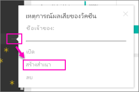

# ชุดเนื้อหาระดับองค์กร: คัดลอก รีเฟรช และเข้าถึงOrganizational content packs: Copy, refresh, and get access

เมื่อมีชุดเนื้อหาระดับองค์กรการเผยแพร่ ผู้รับทั้งหมดดูแดชบอร์ รายงาน เวิร์กบุ๊ก Excel ชุดข้อมูล และข้อมูล (ยกเว้นแหล่งข้อมูลของ SQL Server Analysis Services (SSAS))เดียวกันWhen an organizational content pack is published, all recipients see the same dashboard, reports, Excel workbooks, datasets, and data (unless it's a SQL Server Analysis Services (SSAS) data source).  [ผู้สร้างชุดเนื้อหาเท่านั้นที่สามารถแก้ไข และประกาศ](service-organizational-content-pack-manage-update-delete.md)ชุดเนื้อหาได้[Only the content pack creator can edit and republish](service-organizational-content-pack-manage-update-delete.md) the content pack.  อย่างไรก็ตาม ผู้รับทั้งหมดสามารถบันทึกสำเนาของชุดเนื้อหาที่สามารถ live ควบคู่ไปกับต้นฉบับHowever, all recipients can save a copy of the content pack that can live alongside the original.

กำลังสร้างชุดเนื้อหาที่จะแตกต่างจากการแชร์แดชบอร์ดหรือการทำงานร่วมกันบนชุดเนื้อหาเหล่านั้นในกลุ่มCreating content packs is different from sharing dashboards or collaborating on them in a group. อ่าน[ฉันควรทำงานร่วมกันและแชร์แดชบอร์ดและรายงานอย่างไร](service-how-to-collaborate-distribute-dashboards-reports.md) เพื่อตัดสินใจเลือกตัวเลือกที่ดีที่สุดสำหรับสถานการณ์ของคุณRead [How should I collaborate on and share dashboards and reports?](service-how-to-collaborate-distribute-dashboards-reports.md) to decide on the best option for your situation.

> [!NOTE]
> คุณไม่สามารถสร้างหรือติดตั้งชุดเนื้อหาขององค์กรในประสบการณ์ในพื้นที่ทำงานใหม่ได้You can't create or install organizational content packs in the new workspace experiences. ตอนนี้ คือเวลาดีที่จะอัปเกรดชุดเนื้อหาของคุณไปยังแอป ถ้าคุณยังไม่ได้เริ่มต้นNow is a good time to upgrade your content packs to apps, if you haven't started yet. เรียนรู้[เพิ่มเติมเกี่ยวกับการใช้งานพื้นที่ทำงานใหม่](service-create-the-new-workspaces.md)Learn [more about the new workspace experience](service-create-the-new-workspaces.md).
>

## สร้างสำเนาของข้อแพ็คเนื้อหาขององค์กรCreate a copy of an organizational content pack
สร้างสำเนาของคุณเองของชุดเนื้อหา ที่ผู้อื่นไม่สามารถมองเห็นCreate your own copy of the content pack, not visible to others.

1. เลือก **ตัวเลือกเพิ่มเติม** (...) ที่อยู่ถัดจากแดชบอร์ดชุดเนื้อหา > ทำสำเนาSelect **More options** (...) next to the content pack dashboard > Make a copy.

    
2. เลือก **บันทึก**Select **Save**.  

ในตอนนี้คุณมีสำเนาที่คุณสามารถเปลี่ยนได้Now you have a copy that you can change. บุคคลอื่นจะเห็นการเปลี่ยนแปลงที่คุณทำNobody else will see changes you make.

> [!NOTE]
> ก่อนหน้านี้ แต่ละครั้งที่คุณติดตั้งชุดเนื้อหาหรือสร้างสำเนา หนึ่งชุดข้อมูลใหม่จะปรากฏในรายการเนื้อหาพื้นที่ทำงานPreviously, each time you installed a content pack or created a copy one, a new dataset would appear in the workspace content list. การอัปเดตล่าสุดประยุกต์ประสบการณ์การใช้งานเพื่อแสดงเพียงหนึ่งรายการโดยใช้ไอคอนอ้างอิงชุดข้อมูลใหม่:A recent update simplified the experience to show just one item using the new referenced dataset icon:
>
> 
>

## ความช่วยเหลือHelp!  ฉันไม่สามารถเข้าถึงชุดเนื้อหาได้I can no longer access the content pack
ซึ่งสามารถเกิดขึ้นได้จากสาเหตุหลายประการThis can happen for several reasons:

* **เปลี่ยนแปลงการเป็นสมาชิก**:  ชุดเนื้อหาถูกเผยแพร่ไปยังกลุ่มการกระจายอีเมล กลุ่มความปลอดภัย และ [กลุ่ม Power BI ที่อ้างอิงจาก Microsoft 365](https://support.office.com/article/Create-a-group-in-Office-365-7124dc4c-1de9-40d4-b096-e8add19209e9)**Membership changes**:  Content packs are published to email distribution groups, security groups, and [Power BI groups based on Microsoft 365](https://support.office.com/article/Create-a-group-in-Office-365-7124dc4c-1de9-40d4-b096-e8add19209e9).  ถ้าคุณจะถูกลบออกจากกลุ่ม คุณจะไม่สามารถเข้าถึงชุดเนื้อหาได้If you are removed from the group, you will no longer have access to the content pack.
* **เปลี่ยนแปลงการเผยแพร่** ผู้สร้างแพคเนื้อหาเปลี่ยนแปลงการเผยแพร่**Distribution changes**: The content pack creator changes the distribution. ตัวอย่างเช่น ถ้าชุดเนื้อหานี้ถูกเผยแพร่ครั้งแรกทั่วทั้งองค์กร แต่ผู้สร้างเผยแพร่อีกครั้งให้กับผู้ชมที่มีขนาดเล็กกว่า คุณอาจไม่ถูกรวมอยู่ด้วยFor example, if the content pack was originally published to the entire organization but the creator republished it to a smaller audience, you may no longer be included.
* **เปลี่ยนแปลงการตั้งค่าความปลอดภัย**: ถ้าแดชบอร์ดและรายงานที่เชื่อมต่อกับแหล่งข้อมูล SSAS ภายในองค์กร และการเปลี่ยนแปลงการตั้งค่าความปลอดภัย อาจสามารถเพิกถอนสิทธิ์ของคุณในเซิร์ฟเวอร์ได้**Security settings changes**: If the dashboard and reports connect to on-premises SSAS data sources and changes are made to the security settings, your permissions to that server may be revoked.

## รีเฟรชชุดเนื้อหาระดับองค์กรทำอย่างไรHow are organizational content packs refreshed?
เมื่อมีการสร้างชุดเนื้อหา การตั้งค่าการรีเฟรชจะถูกสืบทอดกับชุดข้อมูลWhen the content pack is created, the refresh settings are inherited with the dataset.  เมื่อคุณสร้างสำเนาชุดเนื้อหา เวอร์ชันใหม่ยังมีลิงก์ไปยังชุดข้อมูลต้นฉบับและกำหนดการการรีเฟรชWhen you create a copy of the content pack, the new version retains its link to the original dataset and its refresh schedule.

ดู[จัดการ ปรับปรุง และลบชุดเนื้อหาระดับองค์กร](service-organizational-content-pack-manage-update-delete.md)See [Manage, update, and delete organizational content packs](service-organizational-content-pack-manage-update-delete.md).

## ขั้นตอนถัดไปNext steps
* [แนะนำชุดเนื้อหาองค์กรIntroduction to organizational content packs](service-organizational-content-pack-introduction.md)
* [สร้างกลุ่มใน Power BICreate a group in Power BI](service-create-distribute-apps.md)
* มีคำถามเพิ่มเติมหรือไม่More questions? [ลองไปที่ชุมชน Power BITry the Power BI Community](https://community.powerbi.com/)
