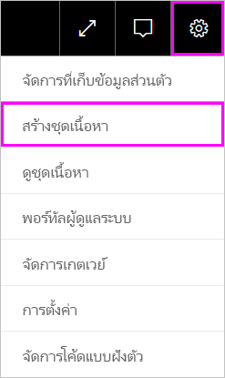
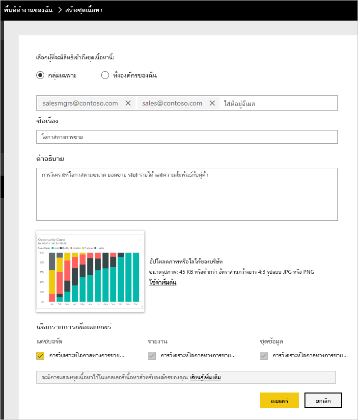
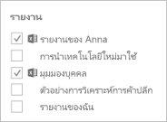
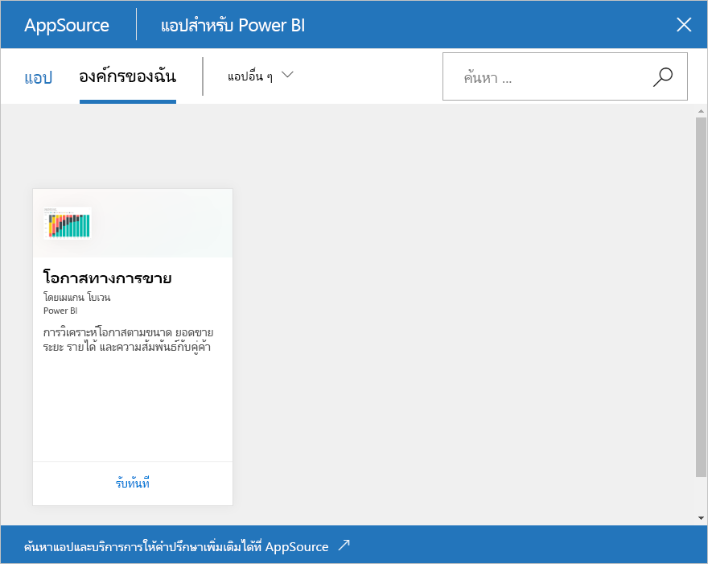

# บทช่วยสอน: สร้าง และเผยแพร่ชุดเนื้อหาองค์กร Power BITutorial: Create and publish a Power BI organizational content pack

ในบทเรียนนี้ คุณสร้างชุดเนื้อหาองค์กร จำกัดการเข้าถึงกลุ่มเฉพาะและเผยแพร่ลงในไลบรารีของชุดเนื้อหาขององค์กรของคุณใน Power BIIn this tutorial, you create an organizational content pack, give access to a specific group, and publish it to your organization's content pack library on Power BI.

กำลังสร้างชุดเนื้อหาที่จะแตกต่างจากการแชร์แดชบอร์ดหรือการทำงานร่วมกันบนชุดเนื้อหาเหล่านั้นในกลุ่มCreating content packs is different from sharing dashboards or collaborating on them in a group. อ่าน[วิธีการแชร์งานของคุณใน Power BI ](service-how-to-collaborate-distribute-dashboards-reports.md)เพื่อตัดสินใจเลือกตัวเลือกที่ดีที่สุดสำหรับสถานการณ์ของคุณRead [Ways to share your work in Power BI](service-how-to-collaborate-distribute-dashboards-reports.md) to decide on the best option for your situation.

สร้างแพ็คเนื้อหาขององค์กรต้องมี[บัญชี Power BI Pro](https://powerbi.microsoft.com/pricing)สำหรับคุณและเพื่อนร่วมงานของคุณCreating an organizational content pack requires a [Power BI Pro account](https://powerbi.microsoft.com/pricing) for you and your colleagues.

> [!NOTE]
> คุณไม่สามารถสร้างหรือติดตั้งชุดเนื้อหาขององค์กรในประสบการณ์ในพื้นที่ทำงานใหม่ได้You can't create or install organizational content packs in the new workspace experiences. ตอนนี้เป็นเวลาที่เหมาะสมในการอัปเกรดชุดเนื้อหาของคุณไปยังแอป ถ้าคุณยังไม่ได้เริ่มต้นIf you haven't started yet, Now is a good time to upgrade your content packs to apps. เรียนรู้[เพิ่มเติมเกี่ยวกับการใช้งานพื้นที่ทำงานใหม่](service-create-the-new-workspaces.md)Learn [more about the new workspace experience](service-create-the-new-workspaces.md).

## สร้างและเผยแพร่ชุดเนื้อหาCreate and publish a content pack

สมมติว่า คุณเป็นผู้จัดการเผยแพร่ของ Contoso และคุณกำลังเตรียมตัววางชายผลิตภัณฑ์ใหม่Imagine you're the Release Manager at Contoso and you're getting ready for a new product launch.  คุณได้สร้างแดชบอร์ดที่มีรายงานที่คุณต้องการแชร์You've created a dashboard with reports that you'd like to share. พนักงานอื่น ๆ ที่จัดการการเปิดใช้งานอาจพบว่ามีประโยชน์Other employees managing the launch may find them useful. คุณต้องการวิธีที่การแพคแดชบอร์ดและรายงานให้เป็นโซลูชันสำหรับเพื่อนร่วมงานของคุณจะได้ใช้You want a way to package up the dashboard and reports as a solution for your colleagues to use.

คุณต้องการทำตามหรือไม่Want to follow along? ใน [บริการของ Power BI](https://powerbi.com) ไปที่ **พื้นที่ทำงานของฉัน**In the [Power BI service](https://powerbi.com), go to your **My Workspace**. จากนั้นไปที่ **รับข้อมูล** > **ตัวอย่าง** >  **ตัวอย่างการวิเคราะห์โอกาส** > **เชื่อมต่อ** เพื่อรับสำเนาของคุณเองThen go to **Get Data** > **Samples** > **Opportunity Analysis Sample** > **Connect** to get your own copy.

1. ในบานหน้าต่างนำทาง ให้เลือก **พื้นที่ทำงาน** > **พื้นที่ทำงานของฉัน**In the nav pane, select **Workspaces** > **My workspaces**.

1. จากบานหน้าต่างนำทางด้านบน ให้เลือกไอคอนรูปเฟือง From the top nav pane, select the cog icon  > **สร้างชุดเนื้อหา** > **Create content pack**.

   

1. ในหน้าต่าง **สร้างชุดเนื้อหา** ให้ใส่ข้อมูลต่อไปนี้In the **Create content pack** window, enter the following information.  

   โปรดทราบว่าไลบรารีชุดเนื้อหาขององค์กรของคุณอาจเติมข้อมูลได้อย่างรวดเร็วKeep in mind that your organization's content pack library might fill up quickly. ไลบรารีสามารถมีชุดเนื้อหาหลายร้อยชุดที่เผยแพรสำหรับองค์กรหรือกลุ่มThe library could end up with hundreds of content packs published for the organization or for groups. ใส่ใจกับการตั้งชื่อที่สื่อความหมายเนื้อหาของคุณ เพิ่มคำอธิบายที่ดีและเพื่อเลือกผู้ชมที่ใช่Take time to give your content pack a meaningful name, add a good description, and select the right audience.  ใช้คำที่จะทำให้ชุดเนื้อหาของคุณสามารถค้นหาได้ง่ายผ่านเครื่องมือค้นหาUse words that makes your content pack easy to find via search. ซึ่งทำให้ง่ายต่อการค้นหาในอนาคตIt makes it easier to find in the future.

      

    1. เลือก **กลุ่มเฉพาะ**Select **Specific Groups**.

    1. ใส่อยู่อีเมลแบบเต็มสำหรับบุคคล [กลุ่ม Microsoft 365](https://support.office.com/article/Create-a-group-in-Office-365-7124dc4c-1de9-40d4-b096-e8add19209e9) กลุ่มการกระจาย หรือกลุ่มความปลอดภัยEnter the full email addresses for individuals, [Microsoft 365 groups](https://support.office.com/article/Create-a-group-in-Office-365-7124dc4c-1de9-40d4-b096-e8add19209e9), distribution groups, or security groups. ตัวอย่างเช่น: salesmgrs@contoso.comsales@contoso.comFor example: salesmgrs@contoso.com; sales@contoso.com

        สำหรับบทเรียนนี้ ลองใช้อีเมลหรือกลุ่มที่อยู่อีเมลของคุณFor this tutorial, try using your group's email address.

    1. ชื่อชุดเนื้อหา *โอกาสทางการขาย*Name the content pack *Sales Opportunities*.

        > [!TIP]
        > พิจารณารวมถึงชื่อของแดชบอร์ดในชื่อของชุดเนื้อหานี้Consider including the name of the dashboard in the name of the content pack. ด้วยวิธี เพื่อนร่วมงานของคุณจะค้นหาแดชบอร์ดได้ง่ายยิ่งขึ้นหลังจากที่พวกเขาเชื่อมต่อกับชุดเนื้อหาของคุณThat way, your colleagues can find the dashboard more easily after they connect to your content pack.

    1. แนะนำ: เพิ่มคำอธิบายRecommended: Add a description. ซึ่งช่วยให้เพื่อนร่วมงานค้นหาชุดเนื้อหาเพิ่มเติมได้อย่างง่ายดายตามที่พวกเขาต้องการIt helps coworkers more easily find the content packs that they need. นอกเหนือจากคำอธิบาย ให้เพิ่มคำสำคัญที่เพื่อนร่วมงานของคุณอาจใช้เพื่อค้นหาชุดเนื้อหานี้Besides a description, add keywords your coworkers might use to search for this content pack. รวมถึงข้อมูลที่ติดต่อในกรณีที่เพื่อนร่วมงานของคุณมีคำถาม หรือต้องการความช่วยเหลือInclude contact information in case your coworkers have a question or need help.

    1. อัปโหลดรูปภาพหรือโลโก้เพื่อช่วยให้สมาชิกกลุ่มสามารถค้นหาชุดเนื้อหาได้ง่ายขึ้นUpload an image or logo to make it easier for group members to find the content pack.

        คุณสามารถสแกนรูปภาพได้รวดเร็วกว่าการสแกนข้อความIt's faster to scan for an image than to scan for text. สกรีนช็อตจะแสดงรูปภาพของไทล์แผนภูมิคอลัมน์ **จำนวนโอกาส**The screenshot shows an image of the **Opportunity Count** column chart tile.

    1. เลือกแดชบอร์ด **ตัวอย่างการวิเคราะห์โอกาส** เพื่อเพิ่มลงในชุดเนื้อหาSelect the **Opportunity Analysis Sample** dashboard to add it to the content pack.

        Power BI เพิ่มรายงานที่เกี่ยวข้องกับชุดข้อมูลโดยอัตโนมัติPower BI automatically adds the associated report and dataset. คุณสามารถเพิ่มบุคคลอื่นได้ ถ้าคุณต้องการYou can add others, if you want.

       > [!NOTE]
       > Power BI จะระบุเฉพาะแดชบอร์ด รายงาน ชุดข้อมูล และสมุดงานที่คุณสามารถแก้ไขได้เท่านั้นPower BI only lists the dashboards, reports, datasets, and workbooks that you can edit. ดังนั้นแอปจะไม่แสดงผลใด ๆ ที่ใช้ร่วมกันกับคุณThus, the app doesn't display any that were shared with you.

   1. ถ้าคุณมีสมุดงาน Excel คุณเห็นค่าเหล่านั้นภายใต้ **รายงาน** ที่มีไอคอน ExcelIf you have Excel workbooks, you see them under **Reports**, with an Excel icon. คุณสามารถเพิ่มลงในชุดเนื้อหา เช่นกันYou can add them to the content pack, too.

      

      > [!NOTE]
      > ถ้าสมาชิกของกลุ่มไม่สามารถดูสมุดงาน Excel ได้ คุณอาจจำเป็นต้อง[แชร์เวิร์กบุ๊กกับบุคคลเหล่านั้นใน OneDrive for Business](https://support.office.com/article/Share-documents-or-folders-in-Office-365-1fe37332-0f9a-4719-970e-d2578da4941c)If members of the group can't view the Excel workbook, you may need to [share the workbook with them in OneDrive for Business](https://support.office.com/article/Share-documents-or-folders-in-Office-365-1fe37332-0f9a-4719-970e-d2578da4941c).

1. เลือก **เผยแพร่** เมื่อต้องเพิ่มชุดเนื้อหาลงในไลบรารีแพ็คเนื้อหาขององค์กรของกลุ่มSelect **Publish** to add the content pack to the group's organizational content pack library.  

   คุณเห็นข้อความสำเร็จเมื่อการเผยแพร่เรียบร้อยแล้วYou see a success message when it publishes successfully.

1. เมื่อสมาชิกของกลุ่มของคุณไปที่ **รับข้อมูล** > **ชุดเนื้อหาขององค์กร** พวกเขาจะเห็นชุดเนื้อหาของคุณWhen members of your group go to **Get Data** > **Organizational Content Packs**, they see your content pack.

   

   > [!TIP]
   > URL ที่ปรากฏในเบราว์เซอร์ของคุณคือที่อยู่ที่ไม่ซ้ำกันสำหรับชุดเนื้อหานี้The URL displayed in your browser is an unique address for this content pack.  ต้องการบอกเพื่อนร่วมงานของคุณเกี่ยวกับชุดเนื้อหาใหม่นี้หรือไม่Want to tell your coworkers about this new content pack?  วาง URL ลงในอีเมลPaste the URL into an email.

1. เมื่อสมาชิกของกลุ่มของคุณเลือก **เชื่อมต่อ** พวกเขาสามารถ [ดูและทำงานกับชุดเนื้อหาของคุณ](service-organizational-content-pack-copy-refresh-access.md)When your group members select **Connect**, they can [view and work with your content pack](service-organizational-content-pack-copy-refresh-access.md).

## ขั้นตอนถัดไปNext steps

* [บทนำชุดเนื้อหาองค์กรใน Power BI](service-organizational-content-pack-introduction.md)[Intro to organizational content packs in Power BI](service-organizational-content-pack-introduction.md).

* [จัดการ อัปเดต และลบชุดเนื้อหาองค์กร](service-organizational-content-pack-manage-update-delete.md)[Manage, update, and delete organizational content packs](service-organizational-content-pack-manage-update-delete.md).

* [เผยแพร่แอปใน Power BI](service-create-distribute-apps.md)[Publish an app in Power BI](service-create-distribute-apps.md).

* [อะไรคือ OneDrive สำหรับธุรกิจWhat is OneDrive for Business?](https://support.office.com/article/What-is-OneDrive-for-Business-187f90af-056f-47c0-9656-cc0ddca7fdc2)

* มีคำถามเพิ่มเติมหรือไม่More questions? [ลองไปที่ชุมชน Power BITry the Power BI Community](https://community.powerbi.com/)
