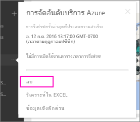

# ลบการเชื่อมต่อของคุณกับชุดเนื้อหา Power BI ขององค์กร

> [!NOTE]
> เรากำลังเลิกใช้งานชุดเนื้อหาระดับองค์กรแล้ว ตอนนี้ คือเวลาดีที่จะอัปเกรดชุดเนื้อหาของคุณไปยังแอป ถ้าคุณยังไม่ได้เริ่มต้น ดูส่วนแผนงานการอัปเกรดพื้นที่ทำงานของบล็อกโพสต์นี้ [การประกาศผู้ดูแลระบบ Power BI สามารถอัปเกรดพื้นที่ทำงานแบบคลาสสิก](https://powerbi.microsoft.com/blog/announcing-power-bi-admins-can-upgrade-classic-workspaces-and-roadmap-update/) สำหรับไทม์ไลน์
> 

เพื่อนร่วมงานสร้างชุดเนื้อหาหนึ่งขึ้น คุณพบชุดเนื้อหานั้นใน AppSource และเพิ่มลงในพื้นที่ทำงาน Power BI ของคุณ ตอนนี้คุณไม่ต้องการชุดเนื้อหานั้นอีกต่อไป  คุณจะลบชุดเนื้อหานั้นได้อย่างไร?

ในการลบชุดเนื้อหาหนึ่ง คุณจะลบชุดข้อมูลของชุดเนื้อหานั้น  

* ในบานหน้าต่างนำทาง ให้เลือกจุดไข่ปลาทางด้านขวาของชุดข้อมูล แล้วเลือก **ลบ\>ใช่**  
  
  

นอกจากนี้ การลบชุดข้อมูลยังเป็นการลบรายงานและแดชบอร์ดทั้งหมดที่เกี่ยวข้อง อย่างไรก็ตาม การลบการเชื่อมต่อชุดเนื้อหานี้ไม่ได้ลบชุดเนื้อหาจาก AppSource ขององค์กรของคุณ  คุณสามารถกลับไปยัง AppSource และเพิ่มชุดเนื้อหานี้กลับไปยังพื้นที่ทำงานของคุณได้เสมอ คุณสามารถ[ลบชุดเนื้อหาจาก AppSource](service-organizational-content-pack-manage-update-delete.md)ได้ ถ้าคุณเป็นผู้สร้างชุดเนื้อหานั้น

## ขั้นตอนถัดไป
* [บทนำเกี่ยวกับชุดเนื้อหาองค์กร](service-organizational-content-pack-introduction.md) 
* [สร้างและกระจายแอปฯใน Power BI](service-create-distribute-apps.md) 
* [แนวคิดพื้นฐานสำหรับนักออกแบบในบริการของ Power BI](../fundamentals/service-basic-concepts.md)  
* มีคำถามเพิ่มเติมหรือไม่ [ลองไปที่ชุมชน Power BI](https://community.powerbi.com/)
