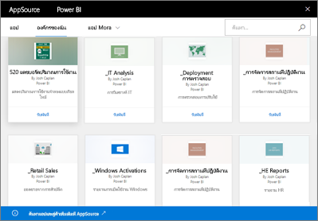

# บทนำชุดเนื้อหาองค์กรใน Power BIIntro to organizational content packs in Power BI
> [!NOTE]
> คุณไม่สามารถสร้างชุดเนื้อหาขององค์กร หรือติดตั้งชุดเนื้อหาดังกล่าวในประสบการณ์ในพื้นที่ทำงานใหม่You can't create organizational content packs or install them in the new workspace experiences. ตอนนี้ คือเวลาดีที่จะอัปเกรดชุดเนื้อหาของคุณไปยังแอป ถ้าคุณยังไม่ได้เริ่มต้นNow is a good time to upgrade your content packs to apps, if you haven't started yet. เรียนรู้[เพิ่มเติมเกี่ยวกับการใช้งานพื้นที่ทำงานใหม่](service-create-the-new-workspaces.md)Learn [more about the new workspace experience](service-create-the-new-workspaces.md).
> 

คุณกระจายรายงานไปยังเพื่อนร่วมงานของคุณผ่านทางอีเมลเป็นประจำหรือไม่?Do you regularly distribute reports by email to your team? ลองวิธีนี้แทน: รวมชุดแดชบอร์ด รายงาน เวิร์กบุ๊ก Excel และชุดข้อมูลของคุณ และเผยแพร่ไปยังทีมของคุณเป็น *ชุดเนื้อหาองค์กร*Try this instead: Package up your dashboards, reports, Excel workbooks, and datasets and publish them to your team as an *organizational content pack*. ชุดเนื้อหาที่คุณสร้างจะทำให้เพื่อนร่วมงานของคุณพบ &#151; ได้ง่าย เนื่องจากทั้งหมดอยู่ใน AppSourceContent packs you create are easy for your team to find &#151; they are all in AppSource. เนื่องจากเป็นส่วนหนึ่งของ Power BI เพื่อนร่วมงานของคุณจะใช้ประโยชน์จากคุณลักษณะทั้งหมดของ Power BI รวมถึงการสำรวจข้อมูลแบบโต้ตอบ ภาพใหม่ การถามตอบ การรวมกับแหล่งข้อมูลอื่น การรีเฟรชข้อมูล และอื่น ๆBecause they're part of Power BI, they leverage all the features of Power BI, including interactive data exploration, new visuals, Q&A, integration with other data sources, data refresh, and more.

การสร้างชุดเนื้อหาจะแตกต่างจากการแชร์แดชบอร์ดหรือการทำงานร่วมกันบนชุดเนื้อหาเหล่านั้นในพื้นที่ทำงานCreating content packs is different from sharing dashboards or collaborating on them in a workspace. อ่าน[ฉันควรทำงานร่วมกันและแชร์แดชบอร์ดและรายงานอย่างไร](service-how-to-collaborate-distribute-dashboards-reports.md) เพื่อตัดสินใจเลือกตัวเลือกที่ดีที่สุดสำหรับสถานการณ์ของคุณRead [How should I collaborate on and share dashboards and reports?](service-how-to-collaborate-distribute-dashboards-reports.md) to decide on the best option for your situation. 

ใน AppSource คุณสามารถเรียกดูหรือค้นหาชุดเนื้อหาที่เผยแพร่ไปยังทั่วทั้งองค์กร ไปยังกลุ่มการกระจาย หรือกลุ่มรักษาความปลอดภัย และไปยัง[กลุ่ม Microsoft 365 ที่คุณเป็นสมาชิก](https://support.office.com/article/Create-a-group-in-Office-365-7124dc4c-1de9-40d4-b096-e8add19209e9) ได้In AppSource, you can browse or search for content packs published to the entire organization, to distribution or security groups, and to [Microsoft 365 groups you belong to](https://support.office.com/article/Create-a-group-in-Office-365-7124dc4c-1de9-40d4-b096-e8add19209e9). ถ้าคุณไม่ได้เป็นสมาชิกของกลุ่มใดกลุ่มหนึ่ง คุณจะไม่เห็นชุดเนื้อหาที่แชร์กับกลุ่มนั้น ๆIf you aren't a member of a specific group, you won't see content packs shared with that group. สมาชิกทั้งหมดของกลุ่มมีการเข้าถึงแบบอ่านอย่างเดียวสำหรับข้อมูลชุดเนื้อหา รายงาน เวิร์กบุ๊ก และแดชบอร์ด (ยกเว้นว่าเป็นแหล่งข้อมูลของ SQL Server Analysis Services (SSAS) ซึ่งเป็นในกรณีที่คุณมีสิทธิ์การใช้งานที่สืบทอดจากแหล่งข้อมูล)All members of the group have the same read-only access to the content pack data, reports, workbooks, and dashboards (unless it's a SQL Server Analysis Services (SSAS) data source, in which case your privileges are inherited with the data source).

แดชบอร์ด รายงาน และเวิร์กบุ๊ก Excel เป็นแบบอ่านอย่างเดียว แต่คุณสามารถคัดลอกและใช้แดชบอร์ดและรายงานเป็นจุดเริ่มต้นสำหรับการสร้างชุดเนื้อหาเวอร์ชันส่วนบุคคลของคุณเองได้The dashboards, reports, and Excel workbooks are read-only, but you can copy and use the dashboards and reports as a starting point for creating your own personalized version of the content pack.

> [!NOTE]
> ชุดเนื้อหาองค์กรจะใช้งานได้เฉพาะเมื่อคุณและเพื่อนร่วมงานของคุณมี[สิทธิ์การใช้งาน Power BI Pro](../fundamentals/service-features-license-type.md)Organizational content packs are only available when you and your colleagues have [Power BI Pro licenses](../fundamentals/service-features-license-type.md).
> 
> 

## AppSource *คืออะไร?*What is *AppSource*?
การเผยแพร่ชุดเนื้อหาองค์กรที่เพิ่มไปยัง AppSourcePublishing an organizational content pack adds it to AppSource.  ขั้นตอนนี้ทำให้ที่เก็บเป็นศูนย์กลางสำหรับสมาชิกต่าง ๆ เพื่อเรียกดูและค้นหาแดชบอร์ด รายงาน และชุดข้อมูลที่เผยแพร่สำหรับพวกเขาได้This centralized repository makes it easy for members to browse and discover dashboards, reports, and datasets published for them.  

* การดู AppSource เลือก **รับข้อมูล** > **องค์กรของฉัน** > **รับ**To view AppSource, select **Get Data** > **My Organization** > **Get**.

## วงจรชีวิตของชุดเนื้อหาองค์กรThe life cycle of an organizational content pack
ผู้ใช้ Power BI Pro สามารถสร้าง เผยแพร่ และเข้าใช้งานชุดเนื้อหาองค์กรได้Any Power BI Pro user can create, publish, and access organizational content packs. เฉพาะผู้สร้างชุดเนื้อหาเท่านั้นที่สามารถปรับเปลี่ยนเวิร์กบุ๊กและชุดข้อมูล กำหนดการรีเฟรช และลบชุดเนื้อหาได้Only the content pack creator can modify the workbook and dataset, schedule refresh, and delete it.

วงจรชีวิตมีลักษณะดังนี้:The lifecycle looks something like this:

1. ใน Power BI Pro, Nate สร้างชุดเนื้อหาและเผยแพร่ไปยังกลุ่มการกระจายการตลาดIn Power BI Pro, Nate creates a content pack and publishes it to the Marketing distribution group. การตั้งค่าการรีเฟรชจะถูกสืบทอดกับชุดข้อมูล และสามารถเปลี่ยนได้โดย Nate เท่านั้นThe refresh settings are inherited with the dataset and can only be changed by Nate.
   
   > [!NOTE]
   > ถ้า Nate สร้างชุดเนื้อหาจากภายใน[พื้นที่ทำงาน Power BI](service-create-distribute-apps.md) ที่ Nate เป็นสมาชิก ดังนั้น แม้ว่า Nate ออกจากพื้นที่ทำงานไปแล้ว ผู้อื่นในพื้นที่ทำงาน Power BI สามารถครองความเป็นเจ้าของได้If Nate creates the content pack from within a [Power BI workspace](service-create-distribute-apps.md) that Nate belongs to, then even if Nate leaves the workspace, others in the Power BI workspace can take over ownership.
   > 
   > 
2. Nate ส่งอีเมลไปยังกลุ่มการกระจาย บอกให้พวกเขาทราบเกี่ยวกับชุดเนื้อหาใหม่นี้Nate sends mail to the distribution group, telling them about the new content pack.
3. ใน Power BI Pro, Jane เป็นสมาชิกของกลุ่มการกระจายฝ่ายการตลาด ค้นหา และเชื่อมต่อกับชุดเนื้อหาใน AppSourceIn Power BI Pro, Jane, a member of the Marketing distribution group, searches for and connects to a content pack in AppSource. ตอนนี้ Jane มีสำเนาแบบอ่านอย่างเดียวJane now has a read-only copy. Jane จะทราบว่านี่เป็นสำเนาแบบอ่านอย่างเดียวเนื่องจากในแผงนำทางจะมีไอคอนการแชร์ทางด้านซ้ายของชื่อแดชบอร์ดและชื่อรายงานJane knows it's read-only because in the nav pane, there is a sharing icon to the left of the dashboard name and report name. และเมื่อ Jane เลือกแดชบอร์ด ไอคอนล็อกจะทำให้ Jane ทราบว่าพวกเขากำลังดูแดชบอร์ดชุดเนื้อหาหนึ่งอยู่And when Jane selects the dashboard, a lock icon lets Jane know they are looking at a content pack dashboard. 
4. สมมติว่า Jane ตัดสินใจที่จะกำหนดค่าแดชบอร์ดนี้Say Jane decides to customize it. ตอนนี้ Jane สามารถบันทึกสำเนาของแดชบอร์ดและรายงานของตนเองได้Jane will now have their own copy of the dashboard and reports. การทำงานของ Jane จะไม่กระทบแหล่งที่มา นั่นคือ ชุดเนื้อหานี้เดิม และไม่กระทบสมาชิกอื่น ๆ ในกลุ่มการกระจายJane's work does not affect the source, the original content pack, or other distribution group members. ตอนนี้พวกเขาแต่ละคนกำลังทำงานกับสำเนาแดชบอร์ดและรายงานของตนเองThey are now each working on their own copy of the dashboard and report.
5. Nate ทำการอัปเดตไปยังแดชบอร์ด และเมื่อพร้อม แดชบอร์ดจะแพร่ชุดเนื้อหาเวอร์ชั่นใหม่นี้Nate makes updates to the dashboard and when it's ready, will publish a new version of the content pack.
   
   * Julio ซึ่งเป็นอีกหนึ่งสมาชิกในกลุ่มการกระจาย ไม่ได้ปรับเปลี่ยนค่าในชุดเนื้อหาต้นฉบับJulio, another distribution group member, didn't customize the original content pack. การเปลี่ยนแปลงใหม่จะถูกนำไปใช้ในชุดเนื้อหาเวอร์ชั่นของ Julio โดยอัตโนมัติThe new changes are automatically applied to Julio's version of the content pack.  
   * Jane ได้ปรับเปลี่ยนค่าในชุดเนื้อหาJane did customize the content pack. จากนั้น Jane ได้รับการแจ้งเตือนว่ามีเวอร์ชั่นใหม่Jane then receives a notification that there's a new version.  Jane สามารถไปที่ AppSource และได้รับชุดเนื้อหาที่อัปเดตแล้วโดยไม่สูญเสียเวอร์ชั่นส่วนบุคคลJane can go to AppSource and get the updated content pack without losing the personalized version. ตอนนี้ Jane มี 2 เวอร์ชันด้วยกัน นั่นคือชุดเนื้อหาเวอร์ชั่นส่วนบุคคลและเวอร์ชั่นที่อัปเดตแล้วJane now has two versions: the personalized version and the updated content pack.
6. สมมติว่า Nate เปลี่ยนแปลงการตั้งค่าความปลอดภัยSay Nate changes the security settings. Julio และ Jane ไม่สามารถเข้าถึงเนื้อหานั้นได้อีกต่อไปJulio and Jane no longer have access to the content. หรือสมมติว่า Julio และ Jane ถูกลบออกจากกลุ่มการกระจายฝ่ายการตลาดOr say they're removed from the Marketing distribution group.
   
   * Julio ไม่ได้ปรับเปลี่ยนค่าชุดเนื้อหาต้นฉบับ ดังนั้น เนื้อหาจะถูกลบออกโดยอัตโนมัติJulio didn't customize the original content pack, so the content is automatically removed. 
   * Jane ได้ปรับเปลี่ยนค่าในชุดเนื้อหาJane did customize the content pack. ในครั้งถัดไปที่ Jane เปิดแดชบอร์ดขึ้น ไทล์ทั้งหมดจากชุดเนื้อหาต้นฉบับจะหายไป แต่ยังคงปรากฏไทล์ที่ปักหมุดจากรายงานอื่น ๆ (ที่ Jane ยังคงมีสิทธิ์ในการใช้งาน) อยู่The next time Jane opens the dashboard all tiles from the original content pack are gone, but tiles pinned from other reports (that Jane still has permission to use) still appear. รายงานและชุดข้อมูลที่เกี่ยวข้องจะไม่พร้อมใช้งานอีกต่อไป (และไม่ปรากฏในบานหน้าต่างการนำทางของพวกเขา)The associated reports and dataset are no longer available (and don't appear in their nav pane).
7. หรือ Nate ลบชุดเนื้อหาดังกล่าวOr Nate deletes the content pack.
   
   * Julio ไม่ได้ปรับเปลี่ยนค่าชุดเนื้อหาต้นฉบับ ดังนั้น เนื้อหาจะถูกลบออกโดยอัตโนมัติJulio didn't customize the original content pack, so the content is automatically removed. 
   * Jane ได้ปรับเปลี่ยนค่าในชุดเนื้อหาJane did customize the content pack. ในครั้งถัดไปที่ Jane เปิดขึ้นแดชบอร์ดไทล์ทั้งหมดจากชุดเนื้อหานี้เดิมหายไป แต่ไทล์ที่ปักหมุดจากรายงานอื่น ๆ ยังคงปรากฏขึ้นอยู่The  next time Jane opens the dashboard all tiles from the original content pack are gone, but tiles pinned from other reports still appear. รายงานและชุดข้อมูลที่เกี่ยวข้องจะไม่พร้อมใช้งานอีกต่อไป (และไม่ปรากฏในบานหน้าต่างการนำทางของพวกเขา)The associated reports and dataset are no longer available (and don't appear in their nav pane).

## การรักษาความปลอดภัยข้อมูลData security
สมาชิกของกลุ่มการกระจายทั้งหมดมีสิทธิ์เดียวกันสำหรับข้อมูล โดยเป็นผู้สร้างชุดเนื้อหาAll distribution group members have the same permissions to the data as the content pack creator. หนึ่งข้อยกเว้นสำหรับส่วนนี้คือ SQL Server Analysis Services (SSAS) ภายในองค์กรชุดข้อมูลแบบตารางThe one exception to this is SQL Server Analysis Services (SSAS) on-premises tabular datasets. เนื่องจากรายงานและแดชบอร์ดมีการเชื่อมต่อแบบสดไปยังแบบจำลอง SSAS ภายในองค์กร ข้อมูลประจำตัวของสมาชิกแต่ละคนในกลุ่มการกระจายจะถูกนำไปใช้เพื่อกำหนดข้อมูลที่พวกเขาสามารถเข้าถึงได้Because the reports and dashboards are connecting live to the on-premises SSAS model, the credentials of each individual distribution group member are used to determine the data they can access.

## ขั้นตอนถัดไปNext steps
* [สร้างและเผยแพร่ชุดเนื้อหาองค์กรCreate and publish an organizational content pack](service-organizational-content-pack-create-and-publish.md)
* [สร้างและกระจายแอปฯใน Power BICreate and distribute an app in Power BI](service-create-distribute-apps.md) 
* [แนวคิดพื้นฐานสำหรับนักออกแบบในบริการ Power BIBasic concepts for designers in the Power BI service](../fundamentals/service-basic-concepts.md)
* มีคำถามเพิ่มเติมหรือไม่More questions? [ลองไปที่ชุมชน Power BITry the Power BI Community](https://community.powerbi.com/)
