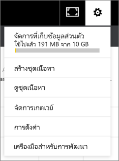

# จัดการ อัปเดต และลบชุดเนื้อหาองค์กรManage, update, and delete organizational content packs
> [!NOTE]
> คุณไม่สามารถสร้างชุดเนื้อหาขององค์กร หรือติดตั้งชุดเนื้อหาดังกล่าวในประสบการณ์ในพื้นที่ทำงานใหม่You can't create organizational content packs or install them in the new workspace experiences. ตอนนี้ คือเวลาดีที่จะอัปเกรดชุดเนื้อหาของคุณไปยังแอป ถ้าคุณยังไม่ได้เริ่มต้นNow is a good time to upgrade your content packs to apps, if you haven't started yet. เรียนรู้[เพิ่มเติมเกี่ยวกับการใช้งานพื้นที่ทำงานใหม่](service-create-the-new-workspaces.md)Learn [more about the new workspace experience](service-create-the-new-workspaces.md).
> 

อ่านเกี่ยวกับการรวมชุดแดชบอร์ด รายงาน เวิร์กบุ๊ก Excel และชุดข้อมูลของคุณลงใน[ชุดเนื้อหาองค์กร](service-organizational-content-pack-introduction.md)You can package up and share your dashboards, reports, Excel workbooks, and datasets with your colleagues as [organizational content packs](service-organizational-content-pack-introduction.md). เพื่อนร่วมงานของคุณสามารถใช้งานได้แบบเป็น หรือพวกเขาสามารถสร้างสำเนาของตนเองได้Your colleagues can use them as-is, or they can create their own copies.

กำลังสร้างชุดเนื้อหาที่จะแตกต่างจากการแชร์แดชบอร์ดหรือการทำงานร่วมกันบนชุดเนื้อหาเหล่านั้นในกลุ่มCreating content packs is different from sharing dashboards or collaborating on them in a group. อ่าน[ฉันควรทำงานร่วมกันและแชร์แดชบอร์ดและรายงานอย่างไร](service-how-to-collaborate-distribute-dashboards-reports.md) เพื่อตัดสินใจเลือกตัวเลือกที่ดีที่สุดสำหรับสถานการณ์ของคุณRead [How should I collaborate on and share dashboards and reports?](service-how-to-collaborate-distribute-dashboards-reports.md) to decide on the best option for your situation.

คุณสามารถทำงานแพ็คเนื้อหาขององค์กรบางอย่างเท่านั้น ถ้าคุณเป็นผู้สร้างชุดเนื้อหา:You can only do some organizational content pack tasks if you're the content pack creator:

* เผยแพร่อีกครั้งRepublish.
* จำกัดหรือขยายการเข้าถึงชุดเนื้อหาRestrict or expand access to the content pack.
* ตั้งค่าและเปลี่ยนแปลงการรีเฟรชตามกำหนดการSet and change scheduled refresh.
* ลบชุดเนื้อหาDelete the content pack.

## ปรับเปลี่ยน และเผยแพร่เป็นแพ็คเนื้อหาขององค์กรอีกครั้งModify and re-publish an organizational content pack
ถ้าคุณทำการเปลี่ยนไปยังแดชบอร์ดของชุดเนื้อหาต้นฉบับ รายงาน หรือสมุดงาน Excel, Power BI จะถามให้คุณทำการเผยแพร่อีกครั้งIf you make changes to the original content pack dashboard, report, or Excel workbook, Power BI prompts you to republish. นอกจากนี้ ในฐานะผู้สร้างชุดเนื้อหา คุณสามารถปรับปรุงตัวเลือกที่คุณเลือกในหน้าต่างการสร้างชุดเนื้อหาเมื่อคุณกำลังสร้างชุดเนื้อหาต้นฉบับAdditionally, as the content pack creator, you can update any of the options you selected in the Create Content Pack window when you were creating the original content pack. 

## เผยแพร่ด้วยเนื้อหาใหม่Republish with new content
เมื่อคุณทำบันทึกการเปลี่ยนแปลงไปยังแดชบอร์ดที่คุณรวมอยู่ในชุดเนื้อหา Power BI จะแจ้งเตือนคุณให้อัปเดตเพื่อให้ผู้อื่นสามารถเห็นการเปลี่ยนแปลงWhen you make and save a change to the dashboard that you included in a content pack, Power BI reminds you to update it so others can see the changes. ตัวอย่างเช่น ถ้าคุณปักหมุดไทล์ใหม่ หรือเพียงแค่เปลี่ยนชื่อของแดชบอร์ดFor example, if you pin a new tile or just change the name of the dashboard.

1. เลือก **ชุดเนื้อหามอง** ในข้อความSelect **View Content Packs** in the message.
   
   
2. หรือเลือกไอคอนฟันเฟืองที่มุมบนขวา Or select the cog icon in the upper-right corner  และเลือก **ดูชุดเนื้อหา**and select **View Content Pack**.
   
   
   
   โปรดสังเกตไอคอนคำเตือนNotice the warning icon ..  ซึ่งช่วยให้คุณทราบว่าคุณได้ปรับเปลี่ยนชุดเนื้อหาด้วยวิธีบางอย่างและไม่ตรงกับสิ่งที่คุณได้เผยแพร่ไปThis lets you know that you've modified the content pack in some way and it no longer matches what you published.
3. เลือก **แก้ไข**Select **Edit**.  
4. ทำการเปลี่ยนแปลงที่จำเป็นในการ **อัปเดตชุดเนื้อหา** และเลือก **อัปเดต**Make any necessary changes in the **Update Content Pack** window and select **Update**. ข้อความ **ประสบความสำเร็จ** ปรากฏขึ้นA **Success** message appears.
   
   * สำหรับสมาชิกกลุ่มที่ยังไม่ได้ปรับชุดเนื้อหา การอัพเดตจะเป็นโดยอัตโนมัติFor group members who haven't customized the content pack, the update is automatically applied.
   * สมาชิกของกลุ่มทีได้ปรับ่มีชุดเนื้อหา จะได้รับการแจ้งเตือนว่ามีเวอร์ชันใหม่Group members who have customized the content pack receive a notification that there is a new version.  พวกเขาสามารถไปที่ AppSource และอัปเดตชุดเนื้อหาโดยไม่สูญเสียเวอร์ชันส่วนบุคคลของเธอเองThey can go to AppSource and get the updated content pack without losing their personalized version.  พวกเขามี 2 เวอร์ชันด้วยกัน นั่นคือ ชุดเนื้อหาเวอร์ชันส่วนบุคคลของเธอเอง และเวอร์ชั่นที่อัปเดตแล้วThey'll now have 2 versions: the personalized version and the updated content pack.  ในเวอร์ชันส่วนบุคคล ไทล์ทั้งหมดจากชุดเนื้อหานี้เดิมจะหายไปIn the personalized version, all tiles from the original content pack will be gone.  แต่ไทล์ที่ปักจากรายงานอื่นๆ จะยังคงทำงานBut tiles pinned from other reports will still render. อย่างไรก็ตาม หากเจ้าของชุดเนื้อหาลบชุดข้อมูลที่ชุดเนื้อหาอิงข้อมูลมา รายงานทั้งหมดจะหายไปHowever, if the content pack owner deletes the dataset the content pack is based on, then the whole report will be gone.  

## อัพเดตผู้ชม ขยายหรือจำกัดการเข้าถึงUpdate the audience: expand or restrict access
การปรับเปลี่ยนอื่นที่่ผู้สร้างชุดเนื้อหาสามารถทำได้คือ ขยายและการจำกัดการเข้าถึงชุดเนื้อหาAnother modification available to content pack creators is expanding and restricting access to the content pack.  บางทีคุณเผยแพร่ชุดเนื้อหาให้กับผู้ชมที่กว้างขวาง และคุณตัดสินใจจำกัดการเข้าถึงให้เป็นกลุ่มขนาดเล็กลงPerhaps you published a content pack to a broad audience and you've decided to restrict access to a smaller group.  

1. เลือกไอคอนฟันเฟือง Select the cog icon  และเลือก **ดูชุดเนื้อหา**and choose **View Content Packs**.
2. เลือก **แก้ไข**Select **Edit**. 
3. ทำการเปลี่ยนแปลงที่จำเป็นในการ **อัปเดตชุดเนื้อหา** และเลือก **อัปเดต**Make any necessary changes in the **Update Content Pack** window and select **Update**. ตัวอย่างเช่น ลบกลุ่มการแจกจ่ายเดิมในเขตข้อมูล **กลุ่มที่เฉพาะเจาะจง** และแทนที่ ด้วยกลุ่มการแจกจ่ายอื่น (ที่มีสมาชิกที่น้อยกว่า)For example, delete the original distribution group in the **Specific Groups** field and replace it with a different distribution group (that has fewer members).
   
   ข้อความว่าประสบความสำเร็จปรากฏขึ้นA Success message appears.
   
   สำหรับเพื่อนร่วมงานใดๆ ที่ไม่ใช่ส่วนหนึ่งของนามแฝงใหม่For any coworker who isn't part of the new alias:
   
   * สำหรับสมาชิกกลุ่มที่ยังไม่ได้ทำเวอร์ชั่นส่วนตัวของชุดเนื้อหา แดชบอร์ดและรายงานที่เกี่ยวข้องกับชุดเนื้อหาจะใช้ไม่ได้อีกต่อไป และชุดเนื้อหาจะไม่ปรากฏในบานหน้าต่างนำทางFor group members who haven't customized the content pack, the dashboard and reports associated with that content pack are no longer available and the content pack doesn't appear in the nav pane.
   * สำหรับสมาชิกของกลุ่มที่มีชุดเนื้อหาทีทำเป็นเวอร์ชั่นส่วนตัว ในครั้งถัดไปที่พวกเขาเปิดแดชบอร์ดที่กำหนดเอง ไทล์ทั้งหมดจากชุดเนื้อหานี้เดิมจะไม่ปรากฏFor group members who have customized the content pack, the next time they open the customized dashboard, all tiles from the original content pack will be gone.  แต่ไทล์ที่ปักจากรายงานอื่นๆ จะยังคงทำงานBut tiles pinned from other reports will still render. รายงานชุดเนื้อหาต้นฉบับและชุดข้อมูลใช้งานไม่ได้อีกแล้ว และชุดเนื้อหาจะไม่ปรากฏในบานหน้าต่างนำทางThe original content pack reports and dataset are no longer available, and the content pack doesn't appear in the nav pane.   

## รีเฟรชข้อชุดเนื้อหาขององค์กรRefresh an organizational content pack
ในฐานะผู้สร้างชุดเนื้อหา คุณสามารถ[กำหนดเวลาการรีเฟรชของชุดข้อมูล](../connect-data/refresh-data.md)ได้As the content pack creator, you can [schedule refresh of the datasets](../connect-data/refresh-data.md).  เมื่อคุณสร้างและอัปโหลดชุดเนื้อหา การกำหนดเวลาการรีเฟรชนั้นก็ถูกอัปโหลดพร้อมกับชุดข้อมูลWhen you create and upload the content pack, that refresh schedule is uploaded with the datasets. ถ้าคุณเปลี่ยนการกำหนดเวลาการรีเฟรช คุณจำเป็นต้องเผยแพร่ชุดเนื้อหา (ดูด้านบน) อีกครั้งIf you change the refresh schedule, you need to re-publish the content pack (see above).

## ลบชุดเนื้อหาขององค์กรจาก AppSourceDelete an organizational content pack from AppSource
คุณสามารถลบชุดเนื้อหาจาก AppSource ได้ ถ้าคุณเป็นผู้สร้างชุดเนื้อหานั้นYou can only delete a content pack from AppSource if you created it. ถ้าคุณได้สร้างชุดเนื้อหาขององค์กรในพื้นที่ทำงาน แล้วตัดสินใจที่จะลบพื้นที่ทำงานนั้น ตรวจสอบให้แน่ใจว่าคุณลบชุดเนื้อหาก่อนแล้วIf you've created an organizational content pack in a workspace, and then decide to delete that workspace, be sure to delete the content pack first. ถ้าคุณลบพื้นที่ทำงานโดยไม่ได้ลบชุดเนื้อหาก่อน คุณสูญเสียการเข้าถึงชุดเนื้อหาเหล่านั้นทั้งหมด และจะต้องติดต่อฝ่ายสนับสนุนของ Microsoft สำหรับความช่วยเหลือIf you delete the workspace without deleting the content pack first, you lose all access to those content packs and will have to contact Microsoft Support for help. 

> [!TIP]
> คุณสามารถ[ลบการเชื่อมต่อไปยังชุดเนื้อหา](service-organizational-content-pack-disconnect.md)ที่คุณไม่ได้สร้างขึ้นได้You can [delete your connection to a content pack](service-organizational-content-pack-disconnect.md) you didn't create. สิ่งนั้นไม่ได้ลบชุดเนื้อหาจาก AppSourceThat doesn't delete the content pack from AppSource.
> 
> 

1. เมื่อต้องการลบชุดเนื้อหาจาก AppSource ให้ไปยังพื้นที่ทำงานที่คุณสร้างชุดเนื้อหา เลือกไอคอนฟันเฟือง To delete a content pack from AppSource, go to the workspace where you created the content pack, select the cog icon  และเลือก **ดูชุดเนื้อหา**and choose **View Content Packs**.
2. เลือก **ลบ\>ลบ**Select **Delete \> Delete**. 
   
   * สำหรับสมาชิกกลุ่มที่ยังไม่ไดทำเวอณืชั่นแบบกำหนดเองของชุดเนื้อหา แดชบอร์ดและรายงานที่เกี่ยวข้องกับชุดเนื้อหาที่จะถูกลบออกโดยอัตโนมัติFor group members who haven't customized the content pack, the dashboard and reports associated with that content pack are automatically removed. ใช้งานไม่ได้อีกแล้ว และชุดเนื้อหาจะไม่ปรากฏในบานหน้าต่างนำทางThey're no longer available, and the content pack doesn't appear in the nav pane.
   * สำหรับสมาชิกของกลุ่มที่มีชุดเนื้อหาทีทำเป็นเวอร์ชั่นส่วนตัว ในครั้งถัดไปที่พวกเขาเปิดแดชบอร์ดที่กำหนดเอง ไทล์ทั้งหมดจากชุดเนื้อหานี้เดิมจะไม่ปรากฏFor group members who have customized the content pack, the next time they open the customized dashboard, all tiles from the original content pack will be gone.  แต่ไทล์ที่ปักจากรายงานอื่นๆ จะยังคงทำงานBut tiles pinned from other reports will still render. รายงานชุดเนื้อหาต้นฉบับและชุดข้อมูลใช้งานไม่ได้อีกแล้ว และชุดเนื้อหาจะไม่ปรากฏในบานหน้าต่างนำทางThe original content pack reports and dataset are no longer available, and the content pack doesn't appear in the nav pane.   

## ขั้นตอนถัดไปNext steps
* [แนะนำชุดเนื้อหาองค์กรIntroduction to organizational content packs](service-organizational-content-pack-introduction.md)
* [สร้างและกระจายแอปฯใน Power BICreate and distribute an app in Power BI](service-create-distribute-apps.md) 
* มีคำถามเพิ่มเติมหรือไม่More questions? [ลองไปที่ชุมชน Power BITry the Power BI Community](https://community.powerbi.com/)

