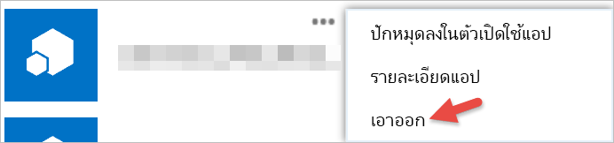

# เริ่มใช้งานแอปของบริษัทอื่นGet started with third-party apps

ด้วย Power BI คุณสามารถใช้แอปที่สร้างขึ้นโดยบริษัท หรือบุคคลอื่น นอกเหนือจาก MicrosoftWith Power BI, you can use an app built by a company or individual other than Microsoft. ตัวอย่างเช่น คุณอาจใช้แอปของบุคคลที่สาม ซึ่งเอารวมไทล์ Power BI ลงไปในเว็บแอปพลิเคชันที่สร้างขึ้นเองFor example, you might use a third-party app which integrates Power BI tiles into a custom-built web application. เมื่อคุณใช้แอปของบุคคลที่สาม คุณจะถูกร้องขอให้อนุญาตให้แอปพลิเคชันนั้น ได้สิทธิเกี่ยวกับบัญชี และแหล่งข้อมูล Power BI ของคุณWhen you use a third-party app, you will be asked to grant that application certain permissions to your Power BI account and resources. สิ่งสำคัญคื่อ คุณให้สิทธิ์แก่แอปพลิเคชันที่คุณรู้จักและเชื่อถือเท่านั้นIt is important that you only grant permissions to applications that you know and trust. คุณสามารถเพิกถอนสิทธิ์ที่อนุญาตให้แอปพลิเคชันสได้ทุกเมื่อPermissions to an application can be revoked at any time. ดู[เพิกถอนสิทธิ์แอปของบุคคลที่สาม](#revoke)See [Revoke third party app permissions](#revoke).

ต่อไปนี้คือ ชนิดของการเข้าถึง ที่แอปพลิเคชันสามารถร้องขอได้Here are the types of access an application can request.

## สิทธิ์ใน Power BI AppPower BI App permissions

* **ดูแดชบอร์ดทั้งหมด****View all Dashboards**
  
  * สิทธิ์นี้อนุญาตให้แอปพลิเคชันสามารถดูแดชบอร์ดทั้งหมดที่คุณสามารถเข้าถึงได้This permission gives an application the ability to view all dashboards you have access to. ซึ่งรวมถึงแดชบอร์ดที่คุณเป็นเจ้าของ ได้รับจากชุดเนื้อหา และมีการแชร์ให้กับคุณ และอยู่ในกลุ่มเดียวกันกับคุณThis includes dashboards that you own, have gotten from content packs, and have been shared to you and are in groups that you belong to. แอปพลิเคชันไม่สามารถทำการแก้ไขใด ๆ ลงไปยังแดชบอร์ดได้The application cannot make any modifications to the dashboard. สิทธิ์นี้สามารถใช้โดยแอปพลิเคชัน เพื่อฝังเนื้อหาแดชบอร์ดของคุณลงในการใช้งานของมันAmong other things, this permission can be used by an application to embed your dashboard content into its experiences.

* **ดูรายงานทั้งหมด****View all Reports**
  
  * สิทธิ์นี้อนุญาตให้แอปพลิเคชันสามารถดูรายงานทั้งหมดที่คุณสามารถเข้าถึงได้This permission gives an application the ability to view all reports you have access to. ซึ่งรวมถึงรายงานที่คุณเป็นเจ้าของ ได้รับจากชุดเนื้อหา และอยู่ในกลุ่มเดียวกันกับคุณThis includes reports that you own, have gotten from content packs, and are in groups that you belong to. การที่ดูรายงานได้แสดงว่า แอปพลิเคชันสามารถดูข้อมูลที่อยู่ในนั้นได้ด้วยPart of viewing the report, means that the application can also see the data within it. แอปพลิเคชันไม่สามารถทำการแก้ไขใด ๆ ลงไปยังรายงานด้วยตนเองThe application cannot make any modifications to the reports themselves. สิทธิ์นี้สามารถใช้โดยแอปพลิเคชัน เพื่อฝังเนื้อหารายงานของคุณลงในการใช้งานของมันAmong other things, this permission can be used by an application to embed your report content into its experiences.

* **ดูชุดข้อมูลทั้งหมด****View all Datasets**
  
  * สิทธิ์นี้อนุญาตให้แอปพลิเคชันสามารถดูชุดข้อมูลทั้งหมดที่คุณสามารถเข้าถึงได้This permission gives an application the ability to list all datasets that you have access to. ซึ่งรวมถึงชุดข้อมูลที่คุณเป็นเจ้าของ ได้รับจากชุดเนื้อหา และอยู่ในกลุ่มเดียวกันกับคุณThis includes datasets that you own, have gotten from content packs, and are in groups that you belong to. แอปพลิเคชันสามารถเห็นชื่อของชุดข้อมูลทั้งหมดของคุณ โครงสร้างของมันรวมไปถึงชื่อตารางและคอลัมน์An application can see the names of all your datasets as well as their structure including table and column names. สิทธิ์นี้ให้สิทธิ์ในการอ่านข้อมูลในชุดข้อมูลThis permission gives rights to read the data in a dataset. สิทธิ์นี้ไม่อนุญาตให้แอปพลิเคชันเพิ่ม หรือแก้ไขชุดข้อมูลThe permission does not give the application rights to add or make changes to a dataset.
* **อ่านและเขียนชุดข้อมูลทั้งหมด****Read and Write all Datasets**
  
  * สิทธิ์นี้อนุญาตให้แอปพลิเคชันสามารถดูชุดข้อมูลทั้งหมดที่คุณสามารถเข้าถึงได้This permission gives an application the ability to list all datasets that you have access to. ซึ่งรวมถึงชุดข้อมูลที่คุณเป็นเจ้าของ ได้รับจากชุดเนื้อหา และอยู่ในกลุ่มเดียวกันกับคุณThis includes datasets that you own, have gotten from content packs, and are in groups that you belong to. แอปพลิเคชันสามารถเห็นชื่อของชุดข้อมูลทั้งหมดของคุณ โครงสร้างของมันรวมไปถึงชื่อตารางและคอลัมน์An application can see the names of all your datasets as well as their structure including table and column names. สิทธิ์นี้ให้สิทธิ์ในการอ่านและเขียนข้อมูลในชุดข้อมูลThis permission gives rights to read and write the data in a dataset. แอปพลิเคชันยังสามารถสร้างชุดข้อมูลใหม่ หรือทำการแก้ไขชุดข้อมูลที่มีอยู่The application can also create new datasets, or make modifications to existing ones. สิทธิ์นี้มักใช้โดยแอปพลิเคชันที่ส่งข้อมูลไปยัง Power BI โดยตรงThis is commonly used by an application to send to data directly to Power BI.

* **ดูกลุ่มของผู้ใช้****View user's Groups**
  
  * สิทธิ์นี้อนุญาตให้แอปพลิเคชันสามารถเห็นรายการกลุ่มทั้งหมดที่คุณเป็นสมาชิกThis permission gives the application the ability to list all groups that you are a member of. ซึ่งสามารถใช้สิทธิ์นี้พร้อมกับบางสิทธิ์อื่น ๆ เพื่อดูหรือแก้ไขเนื้อหาของกลุ่มนั้น ๆIt can use this permission along with some of the other permissions listed to view or update content for that particular group. แอปพลิเคชันไม่สามารถทำการแก้ไขกลุ่มได้ด้วยตัวเองThe application cannot make modifications to the group itself.

<a name="revoke"/>

## เพิกถอนสิทธิ์ของแอปของบุคคลที่สามRevoke third-party app permissions

คุณยกเลิกสิทธิ์สำหรับแอปของบุคคลที่สาม โดยไปที่ไซต์ของ Office 365 My AppsYou revoke permissions for a third-party app by going to the Office 365 My Apps site.

บนไซต์ **Office 365 My Apps** นี่คือวิธีการยกเลิกสิทธิ์ของบุคคลที่สาม:On the **Office 365 My apps** site, here's how to revoke third-party permissions:

1. ไปยัง[ไซต์ Office 365 My Apps](https://portal.office.com/myapps)Go to [Office 365 My Apps site](https://portal.office.com/myapps).

2. บนหน้า **แอปของฉัน** ค้นหาแอปของบุคคลที่สามOn the **My apps** page, locate the third-party app.

3. โฮเวอร์เหนือไทล์ขอวแอป คลิกที่ปุ่ม **(...)**  แล้วคลิก **เอาออก**Hover over the app tile, click the **(...)** button, and click **Remove**.

   