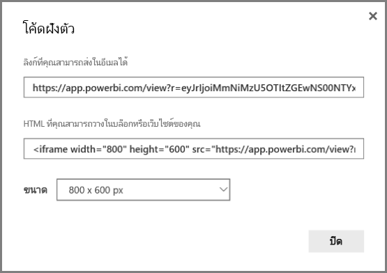
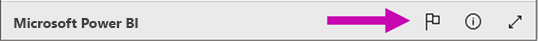

# เผยแพร่บนเว็บจาก Power BIPublish to web from Power BI

ด้วยตัวเลือก **เผยแพร่บนเว็บ** จาก Power BI คุณสามารถฝังเนื้อหา Power BI แบบโต้ตอบ เช่น โพสต์ในบล็อก เว็บไซต์ อีเมล หรือสื่อทางสังคมได้อย่างง่ายดายWith the Power BI **Publish to web** option, you can easily embed interactive Power BI content in blog posts, websites, emails, or social media. คุณสามารถแก้ไข อัปเดต รีเฟรช หรือหยุดการแชร์การแสดงภาพที่คุณเผยแพร่ได้อย่างง่ายดายYou can also easily edit, update, refresh, or stop sharing your published visuals.

> [!WARNING]
> เมื่อคุณใช้ **การเผยแพร่บนเว็บ** ทุกคนบนอินเทอร์เน็ตสามารถดูรายงานหรือรูปภาพที่คุณเผยแพร่When you use **Publish to web**, anyone on the Internet can view your published report or visual. การดูต้องไม่มีการตรวจสอบสิทธิ์Viewing requires no authentication. ซึ่งรวมถึงการดูข้อมูลระดับรายละเอียดที่รายงานของคุณรวมIt includes viewing detail-level data that your reports aggregate. ก่อนที่จะเผยแพร่รายงาน ให้ตรวจสอบให้แน่ใจว่าคุณยินดีที่จะแชร์ข้อมูลและการจัดรูปแบบการแสดงข้อมูลแบบสาธารณะBefore publishing a report, make sure it's okay for you to share the data and visualizations publicly. อย่าเผยแพร่ข้อมูลที่เป็นความลับหรือมีกรรมสิทธิ์Don't publish confidential or proprietary information. ถ้ามีข้อสงสัย ให้ตรวจสอบนโยบายขององค์กรของคุณก่อนเผยแพร่If in doubt, check your organization's policies before publishing.

>[!Note]
>คุณสามารถฝังเนื้อหาของคุณได้อย่างปลอดภัยในพอร์ทัลหรือเว็บไซต์ภายในYou can embed your content securely in an internal portal or website. ใช้ตัวเลือก [ฝังตัว](service-embed-secure.md) หรือ [ฝังใน SharePoint Online](service-embed-report-spo.md)Use the [Embed](service-embed-secure.md) or [Embed in SharePoint Online](service-embed-report-spo.md) options. ตัวเลือกเหล่านี้จะตรวจสอบให้แน่ใจว่ามีการบังคับใช้สิทธิ์และการรักษาความปลอดภัยของข้อมูลทั้งหมดเมื่อผู้ใช้ของคุณดูข้อมูลภายในของคุณThese options ensure that all permissions and data security are enforced when your users view your internal data.

## สร้างโค้ดฝังตัวที่มีการเผยแพร่บนเว็บCreate embed codes with Publish to web

**การเผยแพร่บนเว็บ** สามารถใช้งานได้สำหรับรายงานที่คุณแก้ไขในพื้นที่ทำงานส่วนตัวและกลุ่ม**Publish to web** is available for reports you can edit in your personal and group workspaces.  ไม่สามารถใช้งานได้สำหรับรายงานที่แชร์กับคุณ หรือรายงานที่ใช้การรักษาความปลอดภัยระดับแถวเพื่อรักษาความปลอดภัยข้อมูลIt isn't available for reports shared with you, or ones relying on row-level security to secure data. ดูหัวข้อ [**ข้อจำกัด**](#limitations)ด้านล่างสำหรับรายละเอียดกรณีทั้งห **มดที่ตัวเลือกการเผ** ยแพร่บนเว็บนั้นไม่รองรับSee the [**Limitations**](#limitations) section below for a complete list of cases where **Publish to web** isn't supported. ตรวจสอบ **คำเตือน** ก่อนหน้าในบทความนี้ก่อนใช้ **การเผยแพร่บนเว็บ**Review the **Warning** earlier in this article before using **Publish to web**.

ขั้นตอนต่อไปนี้อธิบายวิธีการใช้ **เผยแพร่ไปยังเว็บ**The following steps describe how to use **Publish to web**.

1. เปิดรายงานในพื้นที่ทำงานที่คุณสามารถแก้ไขได้และเลือก **ตัวเลือกเพิ่มเติม (...)**   > **ฝัง** > **เผยแพร่บนเว็บ (สาธารณะ)**Open a report in a workspace that you can edit, and select **More options (...)**  > **Embed** > **Publish to web (public)**.

   
   
2. ถ้าผู้ดูแลระบบ Power BI ของคุณไม่อนุญาตให้คุณสร้างโค้ดฝังตัว คุณอาจจำเป็นต้องติดต่อพวกเขาIf your Power BI admin hasn't allowed you to create embed codes, you may need to contact them.

   
   
   สำหรับความช่วยเหลือในการค้นหาบุคคลที่สามารถเปิดใช้งานเผยแพร่บนเว็บในองค์กรของคุณ โปรดดู [วิธีการค้นหาผู้ดูแลระบบ Power BI ของคุณ](#find-your-power-bi-administrator) ภายหลังในบทความนี้For help finding the person who can enable Publish to web in your organization, see [How to find your Power BI administrator](#find-your-power-bi-administrator) later in this article.

3. ตรวจสอบเนื้อหากล่องโต้ตอบและเลือก **สร้างโค้ดฝังตัว**Review the dialog content and select **Create embed code**.

   

4. ตรวจสอบคำเตือนที่แสดงในที่นี่ และยืนยันว่าข้อมูลสามารถฝังในเว็บไซต์สาธารณะได้Review the warning, as shown here, and confirm that the data is okay to embed in a public website. ถ้าเป็นเช่นนั้น เลือก **เผยแพร่**If it is, select **Publish**.

   

5. ในกล่องโต้ตอบ **ความสำเร็จ** คุณจะเห็นตัวอย่างว่ารายงานจะมีลักษณะอย่างไรIn the **Success** dialog, you see a preview of how the report will look. เลือก **ขนาด** และ **หน้าเริ่มต้น**Select the **Size** and **Default page**. 

    คุณยังสามารถเพิ่มรูป **ตัวแทนข้อความ** เพื่อทำให้หน้าเว็บโหลดได้รวดเร็วขึ้นYou can also add a **Placeholder** image, to make the web page load faster. ด้วยรูปตัวแทนข้อความ ผู้คนที่ดูรายงานของคุณบนเว็บจะเห็นปุ่ม **ดูเนื้อหาเชิงโต้ตอบ** ที่พวกเขาสามารถเลือกดูรายงานได้With a placeholder image, people viewing your report on the web see a **View interactive content** button they can select to view the report itself. 

    ทำการเปลี่ยนแปลงเหล่านั้นก่อนMake those changes first. จากนั้นคัดลอกลิงก์เพื่อส่งไปยังอีเมลหรือคัดลอก HTML ที่จะวางลงในเว็บไซต์Then copy the link to send it in email, or copy the HTML to paste into a website. คุณสามารถฝังลิงก์ในโค้ดเช่น iFrame หรือวางไว้ในเว็บเพจหรือบล็อกโดยตรงYou can embed it in code such as an iFrame, or paste it directly into a web page or blog.

   

6. ถ้าคุณเคยสร้างโค้ดฝังตัวสำหรับรายงาน และคุณเลือก **เผยแพร่บนเว็บ** มาก่อนแล้ว คุณจะไม่เห็นกล่องโต้ตอบในขั้นตอนที่ 2-4If you previously created an embed code for a report and you select **Publish to web**, you won't see the dialogs in steps 2-4. แต่คุณจะเห็นกล่องโต้ตอบ **ฝังโค้ด** แทนInstead, you see the **Embed code** dialog.

   

   คุณสามารถสร้างโค้ดฝังตัวหนึ่งโค้ดสำหรับแต่ละรายงานYou can only create one embed code for each report.

### เคล็ดลับสำหรับโหมดมุมมองTips for view modes

เมื่อคุณฝังเนื้อหาภายในโพสต์ในบล็อก โดยทั่วไปแล้วจำเป็นต้องพอดีภายในขนาดหน้าจอที่เฉพาะเจาะจงWhen you embed content within a blog post, you typically need to fit it within a specific screen size.  คุณสามารถปรับความสูงและความกว้างเป็นแท็ก iFrame ตามความจำเป็นYou can adjust the height and the width in the iFrame tag as needed. อย่างไรก็ตาม คุณจำเป็นต้องให้แน่ใจว่ารายงานของคุณพอดีกับพื้นที่ของ iFrame ที่กำหนดไว้ ดังนั้นให้ตั้งค่าเป็นโหมดมุมมองที่เหมาะสมเมื่อคุณแก้ไขรายงานHowever, you need to ensure your report fits within the given iFrame area, so set an appropriate View Mode when you're editing the report.

ตารางต่อไปนี้มีคำแนะนำเกี่ยวกับโหมดมุมมอง และวิธีจะปรากฏเมื่อถูกฝังตัวThe following table provides guidance about the View Mode, and how it will appear when embedded.

| โหมดมุมมองView Mode | มันจะเห็นอย่างไรเมื่อถูกฝังตัวHow it looks when embedded |
| --- | --- |
|  |**พอดีกับหน้า** ตามความสูงและความกว้างของหน้าในรายงานของคุณ**Fit to page** respects your report's page height and width. ถ้าคุณตั้งค่าหน้าของคุณเป็นอัตราส่วน *แบบไดนามิก* เช่น 16:9 หรือ 4:3 เนื้อหาของคุณจะปรับขนาดให้พอดีภายใน iFrameIf you set your page to *dynamic* ratios like 16:9 or 4:3, your content scales to fit within the iFrame. เมื่อฝังใน iFrame โดยใช้ **ให้พอดีกับหน้า** อาจก่อให้เกิด *letterboxing* ที่พื้นหลังสีเทาถูกแสดงในพื้นที่ของ iFrame หลังจากเนื้อหาถูกปรับขนาดให้พอดีกับภายใน iFrameWhen embedded in an iFrame, using **Fit to page** can result in *letterboxing*: a gray background is shown in iFrame areas after the content scales to fit within the iFrame. เมื่อต้องการย่อ letterboxing ให้เล็กที่สุด ให้ตั้งค่าความสูงและกว้างของ iFrame ของคุณให้เหมาะสมTo minimize letterboxing, set the height and width of the iFrame appropriately. |
|  |**ขนาดจริง** จะให้แน่ใจว่ารายงานรักษาขนาดตามที่ตั้งค่าหน้ารายงาน**Actual size** ensures the report preserves its size as set on the report page. ซึ่งอาจทำให้แถบเลื่อนปรากฎใน iFrame ของคุณThis can result in scrollbars appearing in your iFrame. ตั้งค่าความสูงและความกว้างของ iFrame เพื่อหลีกเลี่ยงแถบเลื่อนSet the iFrame height and width to avoid scrollbars. |
|  |**จัดพอดีกับความกว้าง** ตรวจสอบให้แน่ใจว่าเนื้อหาพอดีกับพื้นที่แนวนอนของ iFrame**Fit to width** ensures the content fills the horizontal area of the iFrame. เส้นขอบจะยังคงแสดงอยู่ แต่เนื้อหาจะปรับมาตราส่วนเพื่อใช้ช่องว่างแนวนอนที่มีทั้งหมดA border is still shown, but the content scales to use all the horizontal space available. |

### เคล็ดลับสำหรับความกว้างและความสูงของ iFrameTips for iFrame height and width

โค้ดฝังตัว **เผยแพร่บนเว็บ** มีลักษณะดังต่อไปนี้:A **Publish to web** embed code looks like the following example:

 
คุณสามารถแก้ไขความกว้างและความสูงด้วยตนเอง เพื่อให้แน่ใจอย่างแม่นยำว่าคุณต้องการให้พอดีกับหน้าที่คุณกำลังฝังYou can edit the width and height manually to ensure it's precisely how you want it to fit in the page where you're embedding it.

เพื่อให้ได้ขนาดที่พอดียิ่งขึ้น คุณสามารถลองเพิ่ม 56 พิกเซลไปที่ความสูงของ iFrame เพื่อให้สอดคล้องกับขนาดปัจจุบันของแถบด้านล่างTo achieve a more perfect fit, you can try adding 56 pixels to the height of the iFrame to accommodate the current size of the bottom bar. ถ้าหน้าของรายงานใช้ขนาดแบบไดนามิก ตารางด้านล่างแสดงขนาดบางอย่างคุณสามารถทำให้พอดีโดยไม่ต้องจัดแบบ letterboxIf your report page uses the dynamic size, the table below provides some sizes you can use to achieve a fit without letterboxing.

| อัตราส่วนRatio | ขนาดSize | มิติ (ความกว้าง x ความสูง)Dimension (width x height) |
| --- | --- | --- |
| 16:916:9 |ขนาดเล็กSmall |640 x 416 px640 x 416 px |
| 16:916:9 |ขนาดปานกลางMedium |800 x 506 px800 x 506 px |
| 16:916:9 |ขนาดใหญ่Large |960 x 596 px960 x 596 px |
| 4:34:3 |ขนาดเล็กSmall |640 x 536 px640 x 536 px |
| 4:34:3 |ขนาดปานกลางMedium |800 x 656 px800 x 656 px |
| 4:34:3 |ขนาดใหญ่Large |960 x 776 px960 x 776 px |

## จัดการโค้ดแบบฝังตัวManage embed codes

เมื่อคุณสร้างโค้ดฝังตัวของ **เผยแพร่บนเว็บ** คุณสามารถจัดการโค้ดจากเมนู **การตั้งค่า** ใน Power BIOnce you create a **Publish to web** embed code, you can manage your codes from the **Settings** menu in Power BI. การจัดการโค้ดฝังตัวมีความสามารถในการลบภาพปลายทางหรือรายงานสำหรับโค้ด (แสดงโค้ดฝังตัวที่ไม่สามารถใช้งาน) หรือได้รับโค้ดฝังตัวManaging embed codes includes the ability to remove the destination visual or report for a code (rendering the embed code unusable), or getting the embed code.

1. เพื่อจัดการฝังรหัส **เผยแพร่ไปยังเว็บ** ของคุณ เปิดเฟือง **การตั้งค่า** แล้วเลือก **จัดการโค้ดฝังตัว**To manage your **Publish to web** embed codes, open the **Settings** gear and select **Manage embed codes**.

   

2. โค้ดฝังตัวของคุณจะปรากฏขึ้นYour embed codes appear.

   

3. คุณสามารถเรียกใช้ หรือลบโค้ดฝังตัวYou can either retrieve or delete an embed code. การลบจะปิดใช้งานลิงก์ไปยังรายงานหรือรูปภาพDeleting it disables any links to that report or visual.

   

4. ถ้าคุณเลือก **ลบ** ระบบจะสอบถามการยืนยันจากคุณIf you select **Delete**, you're asked for a confirmation.

   

## อัปเดตรายงานและรีเฟรชข้อมูลUpdates to reports, and data refresh

หลังจากที่คุณสร้างโค้ดฝังตัวของ **การเผยแพร่ไปยังเว็บ** ของคุณและแชร์ไฟล์แล้ว รายงานจะอัปเดตพร้อมกับการเปลี่ยนแปลงที่คุณทำAfter you create your **Publish to web** embed code and share it, the report updates with any changes you make. การเชื่อมโยงโค้ดแบบฝังตัวจะใช้งานได้ทันทีThe embed code link is immediately active. ทุกคนที่เปิดลิงก์สามารถดูได้Anyone who opens the link can view it. ข้อมูลถูกแคชในหนึ่งชั่วโมงจากเวลาที่จะถูกเรียกใช้The data is cached for one hour from the time it is retrieved. เราไม่แนะนำให้ใช้การเผยแพร่ไปยังเว็บสำหรับข้อมูลที่จำเป็นต้องรีเฟรชบ่อยครั้งWe don’t recommend using Publish to web for data that needs to refresh frequently. เมื่อต้องการเรียนรู้เพิ่มเติม ให้ดูหัวข้อ [**วิธีการทำงาน**](#howitworks)ในภายหลังในบทความนี้To learn more, see the [**How it works**](#howitworks) section later in this article. 

### การรีเฟรชข้อมูลData refresh

รีเฟรชข้อมูลเป็นภาพสะท้อนในรายงานแบบฝังตัวหรือแบบรูปภาพอัตโนมัติของคุณData refreshes are automatically reflected in your embedded report or visual. เมื่อข้อมูลถูกรีเฟรชสำหรับแบบจำลองข้อมูลนำเข้าในบริการ Power BI บริการจะล้างแคชข้อมูล ทำให้อัปเดตข้อมูลได้อย่างรวดเร็วWhen data is refreshed for an import data model in the Power BI service, the service clears the data cache, making data update quickly. หากต้องการปิดการใช้งานรีเฟรชโดยอัตโนมัติ เลือก **อย่ารีเฟรช** ตามกำหนดการสำหรับชุดข้อมูลที่รายงานใช้To disable automatic refresh, select **don't refresh** on the schedule for the dataset the report uses.  

### การใช้งานหนักหน่วงHeavy usage

ประสบการณ์การใช้งานหนักหน่วงอาจเกิดขึ้นได้เมื่อรายงานได้รับคิวรีมากเกินไปในช่วงเวลาสั้น ๆA heavy usage experience can occur when a report receives too many queries in a short amount of time. เมื่อเกิดภาวะการใช้งานหนักหน่วง ผู้ใช้จะไม่สามารถดูหรือโต้ตอบกับรายงานได้จนกว่าจะผ่านพ้นช่วงเวลาของการใช้งานหนักหน่วงไปWhen heavy usage occurs, users can't view or interact with the report until the period of heavy usage passes. 

เราขอแนะนำให้ตั้งค่าภาพตัวแทนสำหรับรายงานของคุณWe recommend setting a placeholder image for your report. หากเกิดภาวะการใช้งานหนักหน่วง ผู้ใช้จะเห็นภาพตัวแทนIf heavy usage occurs, users see the placeholder image. 

เพื่อช่วยหลีกเลี่ยงประสบการณ์การใช้งานหนักหน่วง ให้จำกัดจำนวนคิวรีที่ไม่ซ้ำกันที่รายงานของคุณสามารถสร้างได้และความถี่ในการรีเฟรชข้อมูลTo help avoid the heavy usage experience, limit the number of distinct queries your report can generate and the frequency of data refresh. ดู[คำแนะนำการปรับให้เหมาะสมของ Power BI](../guidance/power-bi-optimization.md) สำหรับเคล็ดลับในการปรับปรุงรายงานให้มีประสิทธิภาพขึ้นSee the [Power BI optimization guide](../guidance/power-bi-optimization.md) for tips on streamlining your reports.

## วิชวล Power BIPower BI visuals

วิชวล Power BI รองรับ **การเผยแพร่ไปยังเว็บ**Power BI visuals are supported in **Publish to web**. เมื่อคุณใช้ **การเผยแพร่ไปยังเว็บ** ผู้ใช้ที่คุณแชร์ภาพที่เผยแพร่ของคุณไม่จำเป็นต้องเปิดใช้งานวิชวล Power BI เพื่อดูรายงานWhen you use **Publish to web**, users with whom you share your published visual don't need to enable Power BI visuals to view the report.

## ทำความเข้าใจเกี่ยวกับคอลัมน์สถานะโค้ดฝังตัวUnderstanding the embed code status column

>[!Note]
>ตรวจสอบโค้ดฝังตัวที่คุณเผยแพร่บ่อยครั้งReview the embed codes you've published often. ลบรายการใดๆ ที่ไม่จำเป็นต้องมีให้ใช้งานแบบสาธารณะอีกต่อไปRemove any that no longer need to be available publicly.

หน้า **จัดการโค้ดฝังตัว** ประกอบด้วยคอลัมน์สถานะThe **Manage embed codes** page includes a status column. ตามค่าเริ่มต้น โค้ดฝังตัวจะ **เปิดใช้งานอยู่** แต่อาจอยู่ในสถานะใดสถานะหนึ่งดังที่แสดงอยู่ด้านล่างBy default, embed codes are **Active**, but could also be one of the statuses listed below.

| สถานะStatus | คำอธิบายDescription |
| --- | --- |
| **ใช้งานอยู่****Active** |รายงานจะพร้อมใช้งานสำหรับผู้ใช้อินเทอร์เน็ตเพื่อดูและโต้ตอบThe report is available for Internet users to view and interact with. |
| **ถูกบล็อก****Blocked** |เนื้อหาของรายงานการละเมิด[ เงื่อนไขการใช้บริการ Power BI](https://powerbi.microsoft.com/terms-of-service)The report content violates the [Power BI Terms of Service](https://powerbi.microsoft.com/terms-of-service). Microsoft ได้บล็อกไว้Microsoft has blocked it. ติดต่อฝ่ายสนับสนุนหากคุณเชื่อว่าเนื้อหาที่ถูกบล็อกมาจากความผิดพลาดContact support if you believe the content was blocked in error. |
| **ไม่รองรับ****Not supported** |ชุดข้อมูลของรายงานใช้ความปลอดภัยระดับแถว หรือไม่รองรับการกำหนดค่าอื่นThe report's dataset is using row-level security, or another unsupported configuration. ดูหัวข้อ [**ข้อจำกัด**](#limitations)สำหรับรายการทั้งหมดSee the [**Limitations**](#limitations) section for a complete list. |
| **ถูกละเมิด****Infringed** |โค้ดฝังตัวอยู่นอกนโยบายที่กำหนดไว้โดยผู้เช่าThe embed code is outside the defined tenant policy. สถานะนี้มักเกิดขึ้นเมื่อสร้างโค้ดฝังตัว และการตั้งค่าผู้เช่าของ **การเผยแพร่ไปยังเว็บ** มีการเปลี่ยนแปลงเพื่อไม่รวมผู้ใช้ที่เป็นเจ้าของโค้ดฝังตัวThis status typically occurs when an embed code was created and then the **Publish to web** tenant setting was changed to exclude the user owning the embed code. ถ้าการตั้งค่าผู้เช่าถูกปิด หรือผู้ใช้ไม่ได้รับอนุญาตให้สร้างโค้ดฝังตัว โค้ดฝังตัวที่มีอยู่จะแสดงสถานะ **ถูกละเมิด**If the tenant setting is disabled, or the user is no longer allowed to create embed codes, existing embed codes show an **Infringed** status. ดูส่วน [ค้นหาผู้ดูแลระบบ Power BI ของคุณ](#find-your-power-bi-administrator) ในบทความนี้สำหรับรายละเอียดSee the [Find your Power BI administrator](#find-your-power-bi-administrator) section in this article for details. |

## รายงานข้อจำกัดเกี่ยวกับเนื้อหาการเผยแพร่ไปยังเว็บReport a concern with Publish to web content

เพื่อรายงานข้อจำกัดเกี่ยวกับเนื้อหา **เผยแพร่ไปยังเว็บ** แบบฝังหรือบล็อก เลือกไอคอน **ค่าสถานะ** ในแถบด้านล่างของรายงาน **เผยแพร่ไปยังเว็บ**To report a concern related to **Publish to web** content embedded in a website or blog, select the **Flag** icon in the bottom bar of the **Publish to web** report.

คุณจะต้องส่งอีเมลไปยัง Microsoft เพื่ออธิบายสิ่งที่คุณเป็นกังวลYou're asked to send an email to Microsoft explaining your concern. Microsoft จะประเมินเนื้อหาที่ยึดตาม [เงื่อนไขการใช้บริการ Power BI ](https://powerbi.microsoft.com/terms-of-service) และดำเนินการที่เหมาะสมMicrosoft evaluates the content based on the [Power BI Terms of Service](https://powerbi.microsoft.com/terms-of-service) and takes appropriate action.

## สิทธิ์การใช้งานLicensing

คุณจำเป็นต้องเป็นผู้ใช้ Microsoft Power BI เพื่อใช้ **เผยแพร่ไปยังเว็บ**You need to be a Microsoft Power BI user to use **Publish to web**. ผู้ชมของรายงานของคุณไม่จำเป็นต้องเป็นผู้ใช้ Power BIYour report viewers don't need to be Power BI users.

## ทำงานอย่างไร (รายละเอียดทางเทคนิค)How it works (technical details)

เมื่อคุณสร้างโค้ดฝังตัวโดยใช้ **การเผยแพร่บนเว็บ** ผู้ใช้บนอินเทอร์เน็ตจะมองเห็นรายงานได้When you create an embed code using **Publish to web**, the report is made visible to Internet users. ซึ่งสามารถใช้งานแบบสาธารณะได้ ดังนั้นคุณจึงสามารถคาดหวังให้ผู้ชมแชร์รายงานผ่านสื่อสังคมในอนาคตได้อย่างง่ายดายIt's publicly available, so you can expect viewers to easily share the report through social media in the future. ผู้ใช้ดูรายงานโดยการเปิด URL สาธารณะโดยตรงหรือดูรายงานที่ฝังอยู่ในหน้าเว็บหรือบล็อกUsers view the report either by opening the direct public URL or viewing it embedded in a web page or blog. เมื่อทำเช่นนั้น Power BI จะแคชข้อกำหนดของรายงานและผลลัพธ์ของคิวรีที่จำเป็นในการดูรายงานAs they do, Power BI caches the report definition and the results of the queries required to view the report. การแคชข้อมูลนี้ทำให้แน่ใจว่าผู้ใช้พร้อมกันหลายพันคนสามารถดูรายงานโดยไม่ส่งผลกระทบต่อประสิทธิภาพการทำงานThis caching ensures that thousands of concurrent users can view the report without impacting performance.

ข้อมูลถูกแคชในหนึ่งชั่วโมงจากเวลาที่จะถูกเรียกใช้The data is cached for one hour from the time it is retrieved. ถ้าคุณอัปเดตข้อกำหนดรายงาน (ตัวอย่างเช่น ถ้าคุณเปลี่ยนโหมดมุมมอง) หรือรีเฟรชข้อมูลรายงาน อาจใช้เวลาสักครู่ก่อนที่การเปลี่ยนแปลงจะปรากฏในเวอร์ชันของรายงานที่ผู้ใช้ของคุณดูIf you update the report definition (for example, if you change its View mode) or refresh the report data, it can take some time before changes are reflected in the version of the report that your users view. เมื่อเกิดการรีเฟรชข้อมูลสำหรับแบบจำลองข้อมูลนำเข้า บริการจะล้างข้อมูลที่แคชและดึงข้อมูลใหม่When a data refresh occurs for an import data model, the service clears the cached data and retrieves new data. ในกรณีส่วนใหญ่ ข้อมูลจะได้รับการอัปเดตเกือบพร้อมกันกับการนำเข้าข้อมูลIn most cases, the data is updated nearly simultaneous with the import of the data. อย่างไรก็ตามสำหรับรายงานที่มีคิวรีที่ไม่ซ้ำกันมากมาย อาจใช้เวลาในการอัปเดตสักครู่However, for reports with many distinct queries, it may take some time to update. เนื่องจากแต่ละองค์ประกอบและค่าข้อมูลถูกแคชไว้อย่างอิสระเมื่อการอัปเดตข้อมูลเกิดขึ้น ผู้ใช้สามารถมองเห็นการผสมของค่าปัจจุบันและก่อนหน้านี้ได้Since each element and data value is cached independently, when a data update occurs, a user may see a mix of current and previous values. ดังนั้นจึงแนะนำให้คุณจัดลำดับการทำงานของคุณล่วงหน้า และสร้างโค้ดฝังตัวสำหรับการ **เผยแพร่ไปยังเว็บ** เฉพาะเมื่อคุณพอใจกับการตั้งค่าแล้วเท่านั้นTherefore, we recommend staging your work ahead of time, and creating the **Publish to web** embed code only when you're satisfied with the settings. ถ้าข้อมูลของคุณจะรีเฟรช ให้ลดจำนวนรีเฟรชและดำเนินการรีเฟรชในเวลาที่ออกIf your data will refresh, minimize the number of refreshes and perform the refreshes at off hours. เราไม่แนะนำให้ใช้การเผยแพร่ไปยังเว็บสำหรับข้อมูลที่จำเป็นต้องรีเฟรชบ่อยครั้งWe don’t recommend using Publish to web for data that needs to refresh frequently.

## ค้นหาผู้ดูแลระบบ Power BI ของคุณFind your Power BI administrator

พอร์ทัลผู้ดูแลระบบ Power BI มีการตั้งค่าที่ควบคุมว่าใครใดสามารถเผยแพร่ไปยังเว็บได้The Power BI admin portal has settings that control who can publish to the web. ทำงานกับ [ผู้ดูแลระบบ Power BI](../admin/service-admin-role.md) ขององค์กรเพื่อเปลี่ยน [การตั้งค่าผู้เช่าสำหรับเผยแพร่ไปยังเว็บ](../admin/service-admin-portal.md#publish-to-web) ในพอร์ทัลผู้ดูแลระบบWork with your organization's [Power BI administrator](../admin/service-admin-role.md) to change the [Publish to web tenant settings](../admin/service-admin-portal.md#publish-to-web) in the admin portal.

สำหรับองค์กรที่มีขนาดเล็กกว่าหรือบุคคลที่ลงทะเบียนสำหรับ Power BI คุณอาจยังไม่มีผู้ดูแลระบบ Power BIFor smaller organizations or individuals who signed up for Power BI, you may not have a Power BI administrator yet. ทำตาม [กระบวนการสำหรับการเข้าครองผู้ดูแลระบบ](/azure/active-directory/users-groups-roles/domains-admin-takeover)ของเราFollow our [process for admin takeover](/azure/active-directory/users-groups-roles/domains-admin-takeover). เมื่อคุณมีผู้ดูแลระบบ Power BI แล้ว พวกเขาสามารถเปิดใช้งานการสร้างโค้ดฝังตัวให้คุณได้Once you have a Power BI administrator, they can enable creating embed codes for you.

องค์กรที่สร้างขึ้นมักจะมีผู้ดูแลระบบ Power BI อยู่แล้วEstablished organizations usually already have a Power BI administrator. บุคคลในบทบาทต่อไปนี้สามารถทำหน้าที่เป็นผู้ดูแลระบบ Power BI ได้:People in any of the following roles can act as a Power BI administrator:

- ผู้ดูแลระบบส่วนกลางGlobal administrators
- ผู้ใช้ที่มีบทบาทผู้ดูแลระบบบริการของ Power BI ใน Azure Active DirectoryUsers with the Power BI service admin role in Azure Active Directory

คุณจำเป็นต้อง [ค้นหาหนึ่งในบุคคลเหล่านี้](/office365/admin/admin-overview/admin-overview#who-has-admin-permissions-in-my-business) ในองค์กรของคุณและขอให้พวกเขาอัปเดต [การตั้งค่าผู้เช่าสำหรับเผยแพร่ไปยังเว็บ](../admin/service-admin-portal.md#publish-to-web) ในพอร์ทัลผู้ดูแลระบบYou need to [find one of these people](/office365/admin/admin-overview/admin-overview#who-has-admin-permissions-in-my-business) in your organization and ask them to update the [Publish to web tenant settings](../admin/service-admin-portal.md#publish-to-web) in the admin portal.

## ข้อจำกัดLimitations

**การเผยแพร่ไปยังเว็บ** ได้รับการรองรับสำหรับแหล่งข้อมูลส่วนใหญ่และรายงานในบริการของ Power BI**Publish to web** is supported for the vast majority of data sources and reports in the Power BI service. อย่างไรก็ตาม รายงานประเภทต่อไปนี้ยังไม่ได้รับการรองรับ หรือไม่พร้อมใช้งานสำหรับ **เผยแพร่ไปยังเว็บ** ในขณะนี้:However, the following kinds of reports aren't currently supported or available with **Publish to web**:

- รายงานที่ใช้การรักษาความปลอดภัยระดับแถวReports using row-level security.
- รายงานที่ใช้แหล่งข้อมูลแบบไลฟ์ใดๆ รวมถึง Analysis Services Tabular ที่โฮสต์ภายในองค์กร Analysis Services Multidimensional และ Azure Analysis ServicesReports using any Live Connection data source, including Analysis Services Tabular hosted on-premises, Analysis Services Multidimensional, and Azure Analysis Services.
- รายงานที่ใช้[ชุดข้อมูลที่ใช้ร่วมกัน](../connect-data/service-datasets-across-workspaces.md) ซึ่งจัดเก็บไว้ในพื้นที่ทำงานที่แตกต่างกันจากรายงานReports using a [shared dataset](../connect-data/service-datasets-across-workspaces.md) that is stored in a different workspace from the report.
- [ชุดข้อมูลที่ใช้ร่วมกันและได้รับการรับรอง](../connect-data/service-datasets-share.md)[Shared and certified datasets](../connect-data/service-datasets-share.md).
- รายงานทีแชร์กับคุณโดยตรง หรือผ่าแพ็คเนื้อหาขององค์กรReports shared to you directly or through an organizational content pack.
- รายงานในพื้นที่ทำงานที่คุณไม่ใช่สมาชิกที่มีสิทธิ์แก้ไขReports in a workspace in which you aren't an edit member.
- โดยในขณะนี้ ระบบยังไม่รองรับการใช้วิชวล "R" และ Python ในรายงานที่ **เผยแพร่ขึ้นบนเว็บ**"R" and Python visuals aren't currently supported in **Publish to web** reports.
- การส่งออกข้อมูลจากวิชวลในรายงานที่เผยแพร่ไปยังเว็บExporting data from visuals in a report that has been published to the web.
- ArcGIS Maps สำหรับภาพ Power BIArcGIS Maps for Power BI visuals.
- ถาม-ตอบ เกี่ยวกับ Power BI visualsQ&A for Power BI visuals.
- รายงานที่ประกอบด้วยหน่วยวัดของ DAX ระดับรายงานReports containing report-level DAX measures.
- การลงชื่อเข้าระบบแบบจำลองคิวรีข้อมูลเพียงครั้งเดียวSingle sign-on data query models.
- รักษาข้อมูลความลับหรือกรรมสิทธิ์Secure confidential or proprietary information.
- ความสามารถในการรับรองความถูกต้องโดยอัตโนมัติที่มาพร้อมกับการ **ฝัง** ตัวเลือกที่ไม่ทำงานกับ Power BI JavaScript APIThe automatic authentication capability provided with the **Embed** option doesn't work with the Power BI JavaScript API. สำหรับ Power BI JavaScript API ให้ใช้[ผู้ใช้เป็นเจ้าของข้อมูล](../developer/embedded/embed-sample-for-your-organization.md)ในการฝังFor the Power BI JavaScript API, use the [user owns data](../developer/embedded/embed-sample-for-your-organization.md) approach to embedding.
- ผู้ดูแลระบบสามารถบล็อกการเข้าถึงอินเทอร์เน็ตสาธารณะตามที่อธิบายไว้ใน[ลิงก์ส่วนตัวสำหรับการเข้าถึง Power BI](../admin/service-security-private-links.md)Admins can block public internet access, as described in [Private links for accessing Power BI](../admin/service-security-private-links.md). ในกรณีนั้น ตัวเลือก **เผยแพร่ไปยังเว็บ** จะเป็นสีเทาสำหรับผู้เช่าของคุณในพอร์ทัลผู้ดูแลระบบ Power BIIn that case, the **Publish to Web** option is grayed out for your tenant in the Power BI admin portal. 

## ขั้นตอนถัดไปNext steps

- [Web part สำหรับรายงาน SharePoint OnlineSharePoint Online report web part](service-embed-report-spo.md) 

- [ฝังรายงานในพอร์ทัลความปลอดภัยหรือเว็บไซต์Embed report in a secure portal or website](service-embed-secure.md)

มีคำถามเพิ่มเติมหรือไม่More questions? [ลองไปที่ชุมชน Power BITry the Power BI Community](https://community.powerbi.com/)
