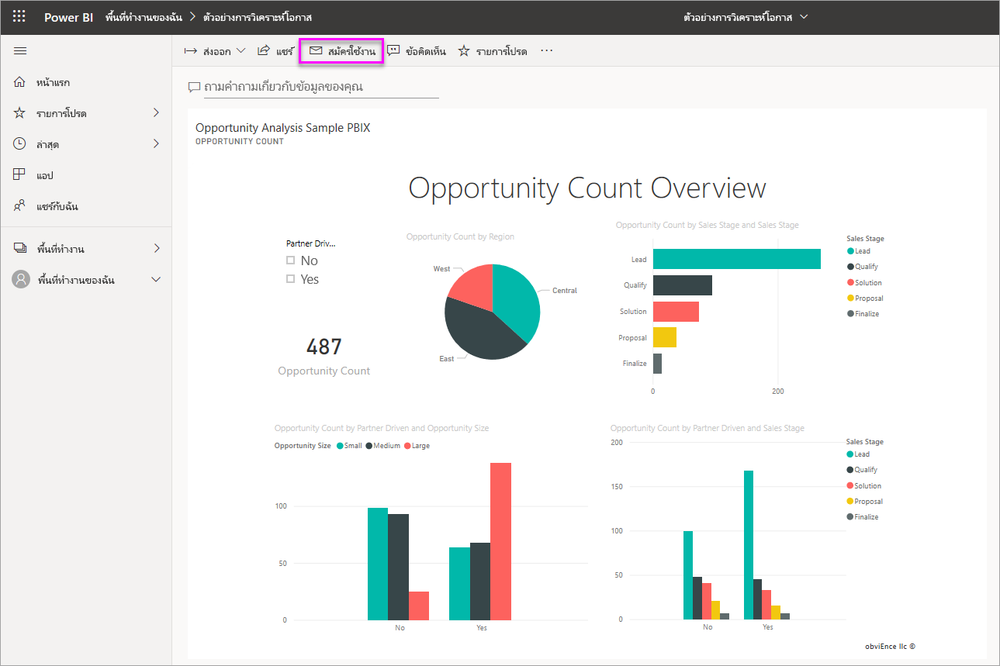

# สมัครใช้งานรายงานและแดชบอร์ดในบริการ Power BI สำหรับตัวคุณเองและผู้อื่นSubscribe yourself and others to reports and dashboards in the Power BI service

คุณสามารถสมัครใช้งานสำหรับคุณเองและเพื่อนร่วมงานในหน้ารายงาน แดชบอร์ด และรายงานที่มีการแบ่งหน้าที่สำคัญที่สุดสำหรับคุณYou can subscribe yourself and your colleagues to the report pages, dashboards, and paginated reports that matter most to you. การสมัครใช้งานอีเมลของ Power BI ช่วยให้คุณสามารถ:Power BI e-mail subscriptions allow you to:

- กำหนดความถี่ในการรับอีเมล: รายวัน รายสัปดาห์ รายชั่วโมง รายเดือน หรือวันละครั้งหลังจากรีเฟรชข้อมูลเริ่มต้นDecide how often you want to receive the emails: daily, weekly, hourly, monthly, or once a day after the initial data refresh.
- เลือกเวลาที่คุณต้องการรับอีเมล หากคุณเลือกรายวัน รายสัปดาห์ รายชั่วโมง หรือรายเดือนChoose the time you want to receive the email, if you choose daily, weekly, hourly, or monthly.
- ตั้งค่าการสมัครใช้งาน 24 ครั้งอื่นๆ ต่อแดชบอร์ดหรือรายงาน Power BISet up 24 different subscriptions per Power BI report or dashboard.  ไม่มีขีดจำกัดสำหรับจำนวนการสมัครใช้งาน คุณจะสามารถตั้งค่าสำหรับรายงานที่มีการแบ่งหน้าได้There is no limit to the number of subscriptions you can set up for paginated reports.
- มีอีเมลที่ส่งไปโดยมีรูปภาพของรายงาน และลิงก์ไปยังรายงานในบริการดังกล่าวHave a mail sent with an image of the report and link to the report in the service.  บนอุปกรณ์เคลื่อนท่ีที่่ติดตั้งแอป Power BI ให้เลือกลิงก์นี้เพื่อเปิดใช้ Power BI แทนการเปิดรายงานหรือแดชบอร์ดบนเว็บไซต์ Power BI)On mobile devices with Power BI apps installed, selecting this link launches the Power BI app, instead of opening the report or dashboard in the Power BI web site.
- รวมไฟล์แนบของรายงานฉบับเต็มInclude an attachment of the full report.
- ส่งอีเมลถึงผู้ใช้ภายนอกผู้เช่า หากเนื้อหาของ Power BI ของคุณโฮสต์อยู่ในความจุแบบพรีเมียมSend email to users outside your tenant, if your Power BI content is hosted in a Premium capacity.  ผู้ดูแลระบบสามารถควบคุมการเข้าถึงไปยังบุคคลที่สามารถส่งการสมัครใช้งานอีเมลถึงผู้ใช้ภายนอก โดยการใช้การตั้งค่าการควบคุมการแชร์ภายนอกที่มีอยู่ในศูนย์การจัดการของ Power BIAdministrators can control access to who can send email subscriptions to external users by leveraging the existing external sharing control settings in the Power BI admin center.

## ข้อกำหนดRequirements

**สร้าง** การสมัครใช้งานสามารถทำได้โดย:**Creating** a subscription can be done by:

- ผู้ใช้ต้องมีสิทธิ์การใช้งาน ProUsers with a Power BI Pro license
- ผู้ใช้ที่ดูเนื้อหาในพื้นที่ทำงาน Premium หรือแอปอาจยังเป็นสมาชิกที่ใช้งานอยู่แม้ว่าจะไม่มีสิทธิ์การใช้งาน Power BI ProUsers viewing content in a Premium workspace or app may also subscribe to content located there, even without a Power BI Pro license.

คุณไม่จำเป็นต้องแก้ไขการอนุญาตในเนื้อหา (แดชบอร์ดหรือรายงาน) เพื่อสร้างการสมัครใช้งานสำหรับตัวคุณเอง แต่คุณต้องมีสิทธิ์แก้ไขเพื่อสร้างการสมัครใช้งานสำหรับผู้อื่นYou don't need edit permissions to the content (dashboard or report) to create a subscription for yourself, but you must have edit permissions to create one for someone else.

## สมัครใช้งานในแดชบอร์ด หน้ารายงาน หรือรายงานที่มีการแบ่งหน้าSubscribe to a dashboard, report page, or paginated report

ไม่ว่าคุณจะสมัครใช้งานในแดชบอร์ด รายงาน หรือรายงานที่มีการแบ่งหน้า กระบวนการจะคล้ายกันWhether you're subscribing to a dashboard, report, or paginated report, the process is similar. ปุ่มเดียวกันนี้ช่วยให้คุณสามารถบอกรับแดชบอร์ดหรือรายงานของบริการ Power BIThe same button allows you to subscribe to Power BI service dashboards and reports.

การสมัครใช้งานในรายงานที่มีการแบ่งหน้าจะแตกต่างกันเล็กน้อยSubscribing to paginated reports is a little different. ดูที่ [สมัครใช้งานในรายงานที่มีการแบ่งหน้าสำหรับตัวคุณเองและผู้อื่นในบริการของ Power BI](../consumer/paginated-reports-subscriptions.md) สำหรับรายละเอียดSee [Subscribe yourself and others to a paginated report in the Power BI service](../consumer/paginated-reports-subscriptions.md) for details.

..

1. เปิดแดชบอร์ดหรือรายงานOpen the dashboard or report.
2. จากแถบเมนูด้านบนเลือก **สมัครใช้งาน** หรือเลือกไอคอนซองจดหมาย :::image type="icon" source="media/service-report-subscribe/power-bi-icon-envelope.png" border="false":::

    

1. ใช้แถบเลื่อนสีเหลืองเพื่อเปิดการสมัครใช้งานและปิดUse the yellow slider to turn the subscription on and off. ตั้งค่าแถบเลื่อนเป็น **ปิด** จะไม่ลบการสมัครใช้งานSetting the slider to  **Off**  doesn't delete the subscription. เมื่อต้องลบการสมัครใช้งาน เลือกไอคอนถังขยะTo delete the subscription, select the trashcan icon.

2. อีเมลของคุณพร้อมใช้งานแล้วในกล่อง **สมัครใช้งาน**Your email address is already in the  **Subscribe**  box. คุณสามารถเพิ่มที่อยู่อีเมลอื่นๆ ในโดเมนเดียวกันไปยังการสมัครใช้งานเช่นเดียวกันYou can add other email addresses in the same domain to the subscription as well. หากรายงานหรือแดชบอร์ดถูกโฮสต์อยู่ใน [ความจุพรีเมียม](../admin/service-premium-what-is.md) คุณจะสามารถสมัครใช้งานที่อยู่อีเมลของบุคคลอื่น และนามแฝงของกลุ่ม ไม่ว่าจะอยู่ในโดเมนของคุณหรือไม่ก็ตามIf the report or dashboard is hosted in a [Premium capacity](../admin/service-premium-what-is.md), you can subscribe other individual email addresses and group aliases, whether they're in your domain or not. หากรายงานหรือแดชบอร์ดไม่ได้รับการโฮสต์ในความจุพรีเมียม คุณจะสามารถสมัครใช้งานสำหรับบุคคลอื่นได้ แต่พวกเขาก็ต้องมีสิทธิ์การใช้งาน Power BI Pro ด้วยIf the report or dashboard isn't hosted in a Premium capacity, you can subscribe other individuals, but they too must have Power BI Pro licenses. โปรดดู [ข้อควรพิจารณาและการแก้ไขปัญหา](#considerations-and-troubleshooting) ด้านล่างสำหรับรายละเอียดเพิ่มเติมSee [Considerations and troubleshooting](#considerations-and-troubleshooting) below for details.

3. กรอกรายละเอียดอีเมล **หัวเรื่อง** และ **ข้อความ**Fill in the email  **Subject**  and  **Message**  details.

4. เลือก **ความถี่** สำหรับการสมัครใช้งาน:  **รายวัน**, **รายชั่วโมง**, **รายสัปดาห์**, **รายเดือน** หรือ **หลังจากรีเฟรชข้อมูล (รายวัน)**Select a  **Frequency**  for your subscription:  **Daily**,  **Hourly**,  **Weekly**,  **Monthly**, or **After Data Refresh (Daily)**. หากต้องการรับอีเมลการสมัครใช้งานเฉพาะในบางวัน ให้เลือก **รายวัน** หรือ **รายสัปดาห์** แล้วเลือกวันที่คุณต้องการรับTo receive the subscription email only on certain days, select  **Hourly**  or  **Weekly**  and select the days you'd like to receive it. ตัวอย่างเช่น หากคุณต้องการรับอีเมลการสมัครใช้งานในวันทำงานเท่านั้น ให้เลือก **รายสัปดาห์** และยกเลิกการเลือกช่องสำหรับ **เสาร์** และ **อาทิตย์**For example, if you'd like to receive the subscription email only on weekdays, select  **Weekly**  and clear the boxes for  **Sat**  and  **Sun**. หากคุณเลือก **รายเดือน** ให้ป้อนวันของเดือนที่คุณต้องการรับอีเมลที่สมัครใช้งานIf you select  **Monthly**, enter the day(s) of the month you wish to receive the subscription mail.

5. หากคุณเลือก  **รายวัน**  **รายชั่วโมง**  **รายเดือน** หรือ  **รายสัปดาห์** คุณยังจะสามารถเลือก  **เวลาตามกำหนดการ**  สำหรับการสมัครใช้งานได้If you choose  **Daily**,  **Hourly**,  **Monthly**, or  **Weekly**, you can also choose a  **Scheduled Time**  for the subscription. คุณใช้เวลาเป็นชั่วโมงหรือเมื่อ 15, 30 หรือ 45 นาทีที่ผ่านมาYou have it run on the hour, or at 15, 30, or 45 minutes past. เลือกเช้า (AM) หรือบ่าย/เย็น (PM)Select morning (AM) or afternoon/evening (PM). คุณยังสามารถระบุโซนเวลาได้อีกด้วยYou can also specify the time zone. หากคุณเลือก  **รายชั่วโมง** ให้เลือก  **เวลาตามกำหนดการ**  ที่คุณต้องการให้การสมัครใช้งานเริ่มต้น จากนั้นระบบจะเรียกใช้ทุกชั่วโมงหลังจากนั้นIf you choose  **Hourly**, select the  **Scheduled Time**  you want the subscription to start, and it will run every hour after that.

6. ตามค่าเริ่มต้น วันเริ่มต้นสำหรับการสมัครใช้งานคือ วันที่คุณสร้างBy default, the start date for your subscription is the date you create it. คุณมีตัวเลือกเพื่อเลือกวันที่สิ้นสุดYou have the option to select an end date. หากคุณไม่ได้กำหนดวันที่สิ้นสุด วันที่สิ้นสุดจะเป็นไปโดยอัตโนมัติหนึ่งปีหลังจากวันที่เริ่มต้นIf you don't set an end date, the end date is automatically one year after the start date. คุณสามารถเปลี่ยนเป็นวันใดก็ได้ในอนาคต (สูงสุด 9999 ปี) ได้ตลอดเวลาก่อนที่การสมัครใช้งานจะสิ้นสุดลงYou can change it to any date in the future (up to the year 9999) at any time before the subscription ends. เมื่อการสมัครใช้งานถึงวันที่สิ้นสุด การทำงานจะหยุดจนกว่าคุณจะเปิดใช้งานอีกครั้งWhen a subscription reaches an end date, it stops until you re-enable it. คุณจะได้รับการแจ้งเตือนก่อนวันที่สิ้นสุดตามกำหนดเพื่อถามว่าคุณต้องการที่จะขยายเวลาออกไปไหมYou'll receive notification(s) before the scheduled end date to ask if you'd like to extend it.

    ในภาพถ่ายหน้าจอด้านล่างนี้ โปรดสังเกตว่า เมื่อคุณสมัครใช้งานรายงานหนึ่ง จริง ๆ แล้วคุณกำลังสมัครใช้งานไปยัง _หน้า_ รายงานIn the screenshot below, notice that when you subscribe to a report, you're actually subscribing to a report _page_. เมื่อต้องการสมัครใช้งานมากกว่าหนึ่งหน้าในรายงานคุณ สามารถเลือก **ไฟล์แนบของรายงานแบบเต็มเป็น** หรือตั้งค่าการสมัครใช้งานใหม่ได้โดยการเลือก **เพิ่มการสมัครใช้งานอื่น**To subscribe to more than one page in a report, you can either select **Full report attachment as** or set up a new subscription by selecting  **Add another subscription**.

    

1. (ไม่บังคับ) เลือกว่าจะรวมลิงก์การเชื่อมโยงกลับไปยังเนื้อหาใน Power BI และกำหนดให้ผู้ใช้สามารถเข้าถึงเนื้อหาที่คุณกำลังใช้งานอยู่หรือไม่(Optional) Select whether to include a link back to the content in Power BI and whether to give users access to the content you're subscribing them to.  หากคุณเลือกที่จะรวมลิงก์ เพื่อประสบการณ์ที่ดีที่สุด โปรดตรวจสอบให้แน่ใจว่า ผู้ใช้ทั้งหมดสามารถเข้าถึงรายงานได้If you choose to include a link, for the best experience, ensure that all users have access to the report.

1. (ไม่บังคับ) เลือกว่าจะเพิ่ม _รายงานฉบับเต็ม_ เป็นไฟล์แนบแทนที่จะเป็นเพียงหน้ารายงานเดียว(Optional) Select whether to add the _full report_ as an attachment instead of only a single report page. เลือก PDF หรือ PowerPointChoose either PDF or PowerPoint. ขนาดของไฟล์แนบจะถูกจำกัดไว้ไม่เกิน 20 หน้าและน้อยกว่า 25 MBThe size of the attachment is limited to no more than 20 pages and less than 25MB. ไฟล์แนบเคารพป้ายกำกับความเป็นส่วนตัวทั้งหมดสำหรับรายงานThe attachment respects all privacy labels for the report.

1. เลือก  **บันทึกและปิด**Select  **Save and close**. ผู้สมัครใช้งานจะได้รับอีเมลและภาพรวมของหน้าแดชบอร์ดหรือหน้ารายงานสำหรับความถี่และเวลาที่คุณเลือกThose subscribed receive an email and snapshot of the dashboard or report page for the frequency and time you selected. โดยรวมคุณสามารถสร้างการสมัครใช้งานได้ถึง 24 รายการต่อรายงานหรือแดชบอร์ดและสามารถให้ผู้รับ เวลา และความถี่ที่ไม่ซ้ำสำหรับแต่ละการสมัครใช้งานได้In all, you may create up to 24 subscriptions per report or dashboard, and can provide unique recipients, times, and frequencies for each subscription. การสมัครใช้งานทั้งหมดตั้งค่าเป็น **หลังจากรีเฟรชข้อมูล** สำหรับแดชบอร์ดหรือรายงานของคุณจะยังคงส่งอีเมลหลังจากรีเฟรชตามกำหนดเวลาครั้งแรกเท่านั้นAll subscriptions set to  **After Data Refresh**  for your dashboard or report will still only send an email after the first scheduled refresh.

    > [!NOTE]
    > หากคุณแก้ไขการสมัครใช้งานหลังจากบันทึกและปิด การเลือกเพื่อให้ผู้ใช้สามารถเข้าถึงเนื้อหาที่คุณกำลังติดตามอยู่เปิดใช้งานอยู่หรือไม่ โดยไม่คำนึงถึงการเลือกก่อนหน้าของคุณIf you edit the subscription after saving and closing, the selection for giving users access to the content you're subscribing is enabled, regardless of your previous selections.
    >

    > [!TIP]
    > ต้องการส่งอีเมลจากการสมัครใช้งานทันทีหรือตามความต้องการได้ทุกเวลาหรือไม่Want to send the email from a subscription right away or on-demand at any time? เลือก **เรียกใช้ทันที** สำหรับการสมัครใช้งานสำหรับแดชบอร์ดหรือรายงานที่คุณต้องการส่งSelect  **Run Now**  for the subscriptions for the dashboard or report you want to send. คุณจะเห็นการแจ้งเตือนว่าอีเมลที่กำลังจะมาถึงทุกคนสำหรับการสมัครใช้งานเฉพาะYou'll see a notification that an e-mail is on its way to everyone for that particular subscription. การดำเนินการนี้จะไม่นับรวมขีดจำกัดของการเรียกใช้การสมัครใช้งานตามกำหนดการ 24 ต่อวันต่อรายงานหรือแดชบอร์ดTaking this action doesn't count against your limit of 24 scheduled subscription runs per day per report or dashboard. จะไม่ทริกเกอร์การรีเฟรชข้อมูลของชุดข้อมูลเบื้องต้นIt does NOT trigger a data refresh of the underlying dataset.
    >

## จัดการการสมัครใช้งานของคุณManage your subscriptions

เฉพาะบุคคลที่สร้างการสมัครใช้งานเท่านั้นที่สามารถจัดการได้Only the person who created the subscription can manage it. มีสองเส้นทางที่จะไปยังหน้าจอสำหรับการจัดการการสมัครใช้งานThere are two paths to the screen for managing your subscriptions. สิ่งแรกคือเลือก **จัดการการสมัครใช้งานทั้งหมด** จากกล่องโต้ตอบ **สมัครใช้งานอีเมล** (ดูขั้นตอนที่ 4 ด้านบน)The first is to select  **Manage all subscriptions**  from the  **Subscribe to emails**  dialog (see step 4 above). ขั้นตอนที่สองคือ เลือกไอคอนฟันเฟือง Power BI  จากแถบเมนูด้านบน และเลือก **การตั้งค่า**The second is to select the Power BI cog icon  from the top menu bar and choose **Settings**.

การสมัครใช้งานที่แสดง จะขึ้นอยู่กับพื้นที่ทำงานที่กำลังใช้งานอยู่ในปัจจุบันThe subscriptions displayed depend on which workspace is currently active. เมื่อต้องการดูการสมัครใช้งานทั้งหมดของคุณในครั้งเดียวสำหรับพื้นที่ทำงานทั้งหมด โปรดตรวจสอบให้แน่ใจว่า  **พื้นที่ทำงานของฉัน**  เปิดใช้งานอยู่To see all of your subscriptions at once for all workspaces, be sure that  **My Workspace**  is active. เพื่อทำความเข้าใจพื้นที่ทำงาน ให้ดู[พื้นที่ทำงานใน Power BI](service-create-workspaces.md)For help understanding workspaces, see  [Workspaces in Power BI](service-create-workspaces.md).

การสมัครใช้งานจะสิ้นสุดลงเนื่องจากกรณีใดกรณีหนึ่งต่อไปนี้:A subscription ends in any of these cases:

- สิทธิ์การใช้งาน Pro หมดอายุThe Pro license expires.
- เจ้าของลบแดชบอร์ดหรือรายงานดังกล่าวแล้วThe owner deletes the dashboard or report.
- บัญชีผู้ใช้ที่ใช้สำหรับสร้างการสมัครใช้งานนั้น ถูกลบแล้วThe user account used to create the subscription is deleted.

ผู้ดูแลระบบ Power BI สามารถใช้บันทึกการตรวจสอบ Power BI เพื่อดูรายละเอียดและการสมัครใช้งานPower BI administrators can use the Power BI audit logs to view details around subscriptions. รายละเอียดเหล่านี้ หมายรวมถึง:These details include:

- สร้างโดยCreated By
- วันที่สร้างCreation Date
- เนื้อหาที่สมัครใช้งานContent Subscribed to
- ผู้รับRecipients
- ความถี่Frequency
- ปรับเปลี่ยนโดยModified By
- วันที่ปรับเปลี่ยนModified Date

## ข้อควรพิจารณาและการแก้ไขปัญหาConsiderations and troubleshooting

### ทั่วไปGeneral

- เช่นเดียวกับผลิตภัณฑ์ BI อื่นๆ เวลาที่คุณตั้งไว้สำหรับการสมัครใช้งานของคุณ คือ เวลาเมื่อการสมัครใช้งานนั้นเริ่มต้นการประมวลผลLike other BI products, the time you set your subscription for is when the subscription begins processing.  เมื่อการประมวลผลรายงานเสร็จสมบูรณ์แล้ว การสมัครใช้งานจะอยู่ในคิวและส่งไปยังผู้รับอีเมลWhen the report processing is complete, the subscription is queued and sent to the e-mail recipients.  เรามุ่งมั่นที่จะดำเนินการและส่งการสมัครใช้งานทั้งหมดให้เร็วที่สุดเท่าที่เป็นไปได้We strive to process and deliver all subscriptions as quickly as possible. อย่างไรก็ตามในบางครั้งที่มีความต้องการสูงสุด คุณอาจเห็นการหน่วงเวลาต่อไปเนื่องจากจำนวนการสมัครใช้งานที่ Power BI สามารถส่งได้ในแต่ละครั้งHowever, sometimes at peak demand you may see a longer delay due to the number of subscriptions that Power BI can send at once. ลูกค้าส่วนใหญ่ไม่ควรเห็นการหน่วงเวลามากกว่า 15 นาที สำหรับการดำเนินการและส่งรายงานMost customers shouldn’t see a delay of more than 15 minutes to process and send reports. อาจใช้เวลาสูงสุด 30 นาที สำหรับบางครั้งและผู้เช่าที่มีการใช้งานอย่างมีนัยสำคัญIt may take up to 30 minutes for certain times and tenants that have significant usage.  ความล่าช้าในการส่งไม่ควรยาวนานเกินกว่า 60 นาที จากเวลาที่การสมัครใช้งานถูกกำหนดเวลาไว้We never expect any delay in delivery to be more than 60 minutes from the time the subscription is scheduled.  ถ้าคุณพบความล่าช้าตามระยะเวลาดังกล่าว ควรตรวจสอบให้แน่ใจว่าที่อยู่ `no-reply-powerbi@microsoft.com` อยู่ในรายชื่อผู้ส่งที่ปลอดภัยของคุณและไม่ถูกบล็อกโดยผู้ให้บริการอีเมลของคุณIf you experience a delay that long, first ensure that the address `no-reply-powerbi@microsoft.com` is on your safe sender list and isn't blocked by your e-mail provider.  ถ้าไม่มีการบล็อกอีเมล ควรติดต่อฝ่ายสนับสนุน Power BI เพื่อขอความช่วยเหลือIf the email isn't being blocked, contact Power BI support for assistance.
- ในปัจจุบัน การสมัครใช้งานผ่านอีเมลสำหรับรายงานและแดชบอร์ดโดยใช้ชุดข้อมูลที่เชื่อมต่อสดจะไม่ได้รับการสนับสนุนเมื่อสมัครใช้งานผู้ใช้อื่นนอกเหนือจากตัวคุณเอง ยกเว้นรายงานที่มีการแบ่งหน้าCurrently, email subscriptions for reports and dashboards using live connection datasets aren't supported when subscribing users other than yourself, except for paginated reports. คุณสามารถสมัครใช้งานให้ผู้อื่นไปยังรายงานที่มีการแบ่งหน้า โดยใช้บริบทความปลอดภัยของคุณYou can subscribe others to a paginated report, using your security context. เรียนรู้เพิ่มเติมเกี่ยวกับ [การสมัครใช้งานไปยังรายงานที่มีการแบ่งหน้า](../consumer/paginated-reports-subscriptions.md)Read more about [subscribing to paginated reports](../consumer/paginated-reports-subscriptions.md).
- Power BI หยุดรีเฟรชชั่วคราวบนชุดข้อมูลที่เกี่ยวข้องกับแดชบอร์ดและรายงานที่มีการเยี่ยมชมในมากกว่าสองเดือน โดยอัตโนมัติPower BI automatically pauses refresh on datasets associated with dashboards and reports that haven't been visited in more than two months. อย่างไรก็ตาม ถ้าคุณเพิ่มการสมัครใช้งานแดชบอร์ดหรือรายงาน จะไม่สามารถหยุดชั่วคราวถึงแม้ว่าจะไม่ได้เข้าเยี่ยมชมHowever, if you add a subscription to a dashboard or report, it doesn't pause even if it goes unvisited.
- หากคุณไม่ได้รับอีเมลการสมัครใช้งาน:If you aren't receiving the subscription emails:

    - ตรวจสอบให้แน่ใจว่าชื่อผู้ใช้หลัก (UPN) ของคุณสามารถรับอีเมลได้Make sure that your User Principal Name (UPN) can receive emails.
    - แม้ว่าคุณมีสิทธิการใช้งาน Power BI Pro คุณอาจไม่มีสิทธิการใช้งาน Microsoft ExchangeThough you have a Power BI Pro license, you may not have a Microsoft Exchange license. ถ้าไม่ใช ่บัญชี Azure Active Directory ของคุณอาจไม่มีอีเมลแอดเดรสหรืออีเมลแอดเดรสสำรองที่ระบุIf not, your Azure Active Directory account may not have an email or alternate email address specified. ในกรณีนี้ แม้ว่าการสมัครใช้งานจะปรากฏขึ้นมา แสดงว่าคุณไม่เคยรับสำเนาIn this case, though the subscription appears to go out, you never receive a copy.  ถ้าผู้ดูแลระบบ Power BI ของคุณกำหนดอีเมลแอดเดรส Power BI จะซิงโครไนซ์การอัปเดตในครั้งถัดไปที่คุณลงชื่อเข้าใช้ และนำอีเมลแอดเดรสนั้นมาสำหรับการสมัครใช้งานIf your Power BI admin assigns an email address, Power BI will synchronize the update the next time you sign in, and use that e-mail address for the subscription.

- ถ้าแดชบอร์ดหรือรายงานของคุณอยู่ในความจุพรีเมียม คุณสามารถใช้นามแฝงอีเมลของกลุ่มสำหรับการสมัครใช้งานแทนการสมัครใช้งานเพื่อนร่วมงานต่าง ๆ ด้วยหนึ่งที่อยู่อีเมลในแต่ละครั้งได้If your dashboard or report is in Premium capacity, you can use group email aliases for subscriptions, instead of subscribing colleagues one email address at a time. นามแฝงเป็นไปตามการไดเรกทอรีที่ใช้งานปัจจุบันThe aliases are based on the current active directory.
- ถ้าเนื้อหาของคุณไม่ได้อยู่ในความจุ Premium เฉพาะผู้ใช้ Power BI Pro เท่านั้นที่สามารถรับการสมัครใช้งานทางอีเมลได้If your content isn't in a Premium capacity, only Power BI Pro users can receive email subscriptions.
- การสมัครใช้งานไม่สนับสนุนบุ๊กมาร์กในขณะนี้Subscriptions don't currently support bookmarks.
- ตัวเลือกเพื่อให้การเข้าถึงรายงาน/แดชบอร์ดจะแสดงเป็นเปิดใช้งานเสมอเมื่อคุณแก้ไขการสมัครใช้งานที่มีอยู่The option to provide access to the report/dashboard always shows as enabled when you edit an existing subscription.  ถ้าคุณล้างตัวเลือกนี้และบันทึกการสมัครใช้งาน ระบบจะบันทึกสถานะดังกล่าวIf you clear this option and save the subscription, it saves that state. อย่างไรก็ตาม เมื่อคุณไปแก้ไขรายงานอีกครั้ง มันจะถูกเลือกตามค่าเริ่มต้นHowever, when you go to edit the report again it will be checked by default.
- ถ้าคุณมีอีเมลแอดเดรสสำรอง แต่ไม่มีอีเมลแอดเดรสหลัก Power BI จะใช้อีเมลแอดเดรสดังกล่าวเพื่อส่งข้อมูลการสมัครใช้งานIf you have an alternate email address but no primary, Power BI uses that to deliver the subscription.
- หากคุณสมัครใช้งานในฐานะผู้ใช้ภายนอกไปยังรายงานหรือแดชบอร์ด พวกเขาจะได้รับการแจ้งเตือนการแชร์ทันทีหลังจากที่คุณเลือก **บันทึกและปิด** ในบานหน้าต่างการสมัครใช้งานIf you subscribe external users to a report or dashboard, they will receive a share notification immediately after you select **Save and close** in the subscription pane. การแจ้งเตือนนี้ถุกส่งไปยังผู้ใช้ภายนอกเท่านั้น ไม่ใช่ผู้ใช้ภายในเนื่องจากพวกเขาจำเป็นต้องมีลิงก์คำเชิญเพื่อดูรายงานหรือแดชบอร์ดThis notification is sent only to external users, not internal users, because they require an invitation link to view the report or dashboard. 
- มีการจำกัดจำนวนผู้สมัครใช้งานสำหรับรายงานหรือแดชบอร์ดหนึ่งรายการThere is a limit to the number of subscribers for one report or dashboard. หลังจากที่คุณมีสมาชิกเกิน 200 คน คุณอาจพบปัญหาในการนำส่งAfter you pass 200 subscribers, you may encounter issues with delivery.

### แดชบอร์ดDashboards

- แดชบอร์ดที่มีไทล์ปักหมุดมากกว่า 25 หมุดหรือมี 4 หมุดปักที่หน้ารายงานสด อาจไม่แสดงข้อมูลอย่างสมบูรณ์ในอีเมลที่สมัครใช้งานที่ส่งถึงผู้ใช้Dashboards with over 25 pinned tiles, or 4 pinned live report pages, may not render fully in subscription e-mails sent to users. การสมัครใช้งานในแดชบอร์ดที่เกินจำนวนไทล์เหล่านี้จะไม่ถูกบล็อกSubscriptions to dashboards over these numbers of tiles aren't blocked. อย่างไรก็ตาม อาจไม่ได้รับการสนับสนุนถ้าคุณประสบกับปัญหาHowever, they're considered unsupported if you encounter issues. พิจารณาปรับเปลี่ยนให้เหมาะสมเพื่อให้อยู่ภายในการสนับสนุนConsider modifying them accordingly to fall within a supported range.
- ในบางโอกาส การสมัครใช้งานทางอีเมลอาจใช้เวลานานกว่าสิบห้านาทีในการส่งมอบให้กับผู้รับOn rare occasions, e-mail subscriptions may take longer than fifteen minutes to be delivered to their recipients. ในกรณีนี้ เราขอแนะนำให้ใช้งานการรีเฟรชข้อมูล และสมัครใช้งานทางอีเมลในเวลาอื่นเพื่อให้แน่ใจว่าจะสามารถส่งได้ทันเวลาIf this happens, we recommend running your data refresh and e-mail subscription at different times to ensure timely delivery. ถ้าปัญหายังคงอยู่ ติดต่อฝ่ายสนับสนุน Power BIIf the issue persists, contact Power BI support.
- สำหรับการสมัครใช้งานทางอีเมลของแดชบอร์ด ไทล์ใดก็ตามที่ใช้ความปลอดภัยระดับแถว (RLS) จะไม่แสดงขึ้นมาFor dashboard email subscriptions, if any tiles have row-level security (RLS) applied, those tiles don't display.
- สำหรับการสมัครใช้งานแดชบอร์ด ไทล์บางประเภทยังไม่ได้รับการสนับสนุนFor dashboard subscriptions, certain types of tiles aren't yet supported. ซึ่งรวมถึง: สตรีมไทล์ วิดีโอไทล์ และไทล์เนื้อหาเว็บแบบกำหนดเองThese include: streaming tiles, video tiles, and custom web content tiles.
- ถ้าคุณแชร์แดชบอร์ดกับเพื่อนร่วมงานภายนอกผู้เช่าของคุณ คุณจะไม่สามารถสร้างการสมัครใช้งานสำหรับเพื่อนร่วมงานรายนั้นได้ *ยกเว้นในกรณีที่* แดชบอร์ดอยู่ในพื้นที่ทำงานและแอป PremiumIf you share a dashboard with a colleague outside of your tenant, you can't also create a subscription for that colleague *unless* the dashboard sits in a Premium workspace or app. ดังนั้น ถ้าคุณคือ `aaron@contoso.com` คุณสามารถแชร์กับ`anyone@fabrikam.com` ได้ แต่คุณยังไม่สามารถสมัครใช้งานสำหรับ`anyone@fabrikam.com`ได้ และพวกเขาไม่สามารถสมัครใช้งานไปยังเนื้อหาที่ใช้ร่วมกันได้So if you are `aaron@contoso.com`, you can share with `anyone@fabrikam.com`, but you can't yet subscribe `anyone@fabrikam.com` and they can't subscribe to shared content.

### รายงานReports

- สำหรับการสมัครใช้งานทางอีเมลของรายงาน ถ้าชุดข้อมูลใช้ RLS คุณจะสามารถสร้างการสมัครใช้งานสำหรับตัวคุณเองFor report email subscriptions, if the dataset uses RLS, you can create a subscription for yourself. คุณไม่สามารถสมัครใช้งานสำหรับผู้อื่นในรายงานที่มีความปลอดภัยระดับแถว (RLS) ยกเว้นรายงานที่มีการแบ่งหน้าYou can't subscribe others to a report with row-level security (RLS) applied, except for paginated reports. คุณสามารถสมัครใช้งานให้ผู้อื่นไปยังรายงานที่มีการแบ่งหน้า โดยใช้บริบทความปลอดภัยของคุณYou can subscribe others to a paginated report, using your security context. เรียนรู้เพิ่มเติมเกี่ยวกับ [การสมัครใช้งานไปยังรายงานที่มีการแบ่งหน้า](../consumer/paginated-reports-subscriptions.md)Read more about [subscribing to paginated reports](../consumer/paginated-reports-subscriptions.md).
- การสมัครใช้งานหน้ารายงานจะถูกผูกกับชื่อของหน้ารายงานReport page subscriptions are tied to the name of the report page. ถ้าคุณสมัครใช้งานหน้ารายงาน และเปลี่ยนชื่อ หลังจากนั้นคุณจะต้องสร้างการสมัครใช้งานใหม่If you subscribe to a report page and then rename it, you have to re-create your subscription.
- องค์กรของคุณอาจกำหนดการตั้งค่าบางอย่างใน Azure Active Directory ซึ่งอาจจำกัดความสามารถในการใช้การบอกรับอีเมลใน Power BIYour organization may configure certain settings in Azure Active Directory that limit the ability to use email subscriptions in Power BI. ขีดจำกัดความสามารถเหล่านี้รวมถึงแต่ไม่จำกัดเพียง การรับรองความถูกต้องแบบหลายปัจจัยหรือข้อจำกัดช่วง IP เมื่อเข้าถึงแหล่งข้อมูลThese limitations include, but aren't limited to, having multi-factor authentication or IP range restrictions when accessing resources.
- การสมัครใช้งานด้วยอีเมลไม่รองรับ[รูปแบบกำหนดเอง](../developer/visuals/power-bi-custom-visuals.md)ส่วนใหญ่Email subscriptions don't support most [custom visuals](../developer/visuals/power-bi-custom-visuals.md). ข้อยกเว้นหนึ่งคือ รูปแบบกำหนดเองเหล่านั้น[ได้รับการรับรอง](../developer/visuals/power-bi-custom-visuals-certified.md)The one exception is those custom visuals that have been [certified](../developer/visuals/power-bi-custom-visuals-certified.md).
- การสมัครใช้งานด้วยอีเมลไม่รองรับรูปแบบ R วิชวลแบบกำหนดเองส่วนใหญ่Email subscriptions don't support R-powered custom visuals at this time.
- สมัครใช้งานด้วยอีเมล จะได้รับตัวกรองรายงานสถานะเริ่มต้นและตัวแบ่งส่วนข้อมูลEmail subscriptions are sent with the report's default filter and slicer states. การเปลี่ยนแปลงใด ๆ กับค่าเริ่มต้นที่คุณทำหลังการสมัครใช้งานจะไม่แสดงในอีเมลAny changes to the defaults that you make after subscribing don't show up in the email. รายงานที่มีการแบ่งหน้าจะสนับสนุนความสามารถนี้และอนุญาตให้คุณตั้งค่าพารามิเตอร์เฉพาะต่อการสมัครใช้งานได้Paginated reports do support this capability and allow you to set the specific parameter values per subscription.
- สมมติว่าคุณมีรายงานที่มีการเชื่อมต่อแบบสดไปยัง Analysis Services และคุณมีการตั้งค่าสมัครใช้งานที่จะทำงานหลังจากรีเฟรชข้อมูลSay you have a report with a live connection to Analysis Services, and you have the subscription set to run after data refresh. รายงานจะทำงานเป็นครั้งแรกที่บริการ Power BI ตรวจพบการเปลี่ยนแปลงในแบบจำลองในสถานที่ของคุณเมื่อโพลอินสแตนซ์ Analysis ServicesIt will run the first time the Power BI service detects a change in your on-premises model when it polls the Analysis Services instance.  Power BI จะตรวจสอบทุกชั่วโมงสำหรับการเปลี่ยนแปลงในแบบจำลองข้อมูล Analysis Services เพื่อกำหนดเวลาที่จะส่งการสมัครใช้งานPower BI checks every hour for a change in the Analysis Services data model, to determine when to send the subscription.
- คุณลักษณะไฟล์แนบรายงานแบบเต็มจะพร้อมใช้งานสำหรับรายงานที่เป็นไปตามเงื่อนไขสามข้อเหล่านี้:The full report attachment feature is available for reports that meet these three conditions:

    - รายงานเหล่านั้นอยู่ในพื้นที่ทำงานที่อัปเกรดด้วย [Power BI Premium หรือ Premium Per User](../admin/service-premium-what-is.md)They're in an upgraded workspace with [Power BI Premium or Premium Per User](../admin/service-premium-what-is.md). 
    - ไฟล์ที่แนบมามีขนาดน้อยกว่า 25 MBThe attachment file is under 25 MB in size.
    - รายงานมีจำนวนหน้าน้อยกว่า 20 หน้าThe report has fewer than 20 pages. 
    
    หากรายงานไม่เป็นไปตามเงื่อนไขทั้งสามนี้ คุณจะไม่สามารถสร้างการสมัครสมาชิกที่มีรายงานฉบับเต็มเป็นไฟล์แนบได้If the report doesn't meet these three conditions, then you can't create subscriptions with full reports as attachments. การสมัครสใช้งานที่มีอยู่พร้อมรายงานฉบับเต็มเป็นไฟล์แนบจะถูกปิดใช้งานและคุณจะได้รับอีเมลอธิบายข้อผิดพลาด:Any existing subscriptions with full reports as attachments are disabled, and you receive an email explaining the error.
    
## ขั้นตอนถัดไปNext steps

- [รายงานที่มีการแบ่งหน้าในบริการ Power BI: สมัครใช้งานตัวคุณเองและผู้อื่นPaginated reports in the Power BI service: Subscribe yourself and others](../consumer/paginated-reports-subscriptions.md)
- มีคำถามเพิ่มเติมหรือไม่More questions? [ลองถามชุมชน Power BITry asking the Power BI Community](https://community.powerbi.com/)
- อ่าน[บล็อกโพสต์ Power BI เกี่ยวกับการสมัครรับอีเมลสำหรับแดชบอร์ด](https://powerbi.microsoft.com/blog/introducing-dashboard-email-subscriptions-a-360-degree-view-of-your-business-in-your-inbox-every-day/)Read the [Power BI blog post about email subscriptions for dashboards](https://powerbi.microsoft.com/blog/introducing-dashboard-email-subscriptions-a-360-degree-view-of-your-business-in-your-inbox-every-day/)
