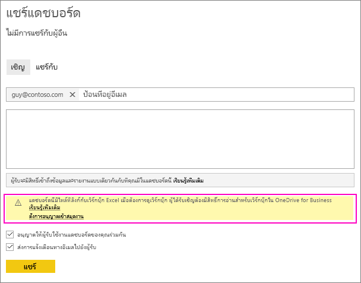
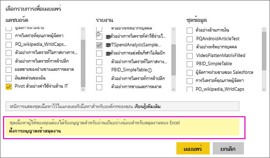
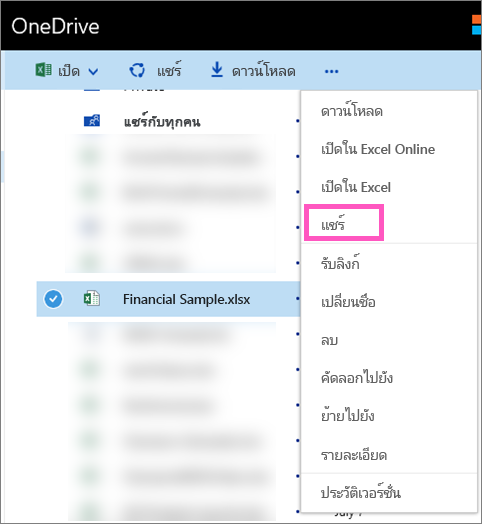

# แชร์แดชบอร์ด Power BI ที่เชื่อมโยงไปยังไฟล์ Excel ใน OneDriveShare a Power BI dashboard that links to an Excel file in OneDrive
ใน Power BI คุณสามารถ[เชื่อมต่อกับเวิร์กบุ๊ก Excel บน OneDrive for Business](../connect-data/service-excel-workbook-files.md)และปักหมุดไทล์ไปยังแดชบอร์ดจากเวิร์กบุ๊กนั้นได้In Power BI, you can [connect to Excel workbooks on OneDrive for Business](../connect-data/service-excel-workbook-files.md) and pin tiles to a dashboard from that workbook. เมื่อคุณแชร์แดชบอร์ดนั้น หรือสร้างชุดเนื้อหาที่ประกอบด้วยแดชบอร์ดนั้น:When you share that dashboard, or create a content pack that includes that dashboard:

* เพื่อนร่วมงานของคุณสามารถดูไทล์โดยไม่จำเป็นต้องมีสิทธิ์การใช้งานสำหรับเวิร์กบุ๊กนั้นได้Your colleagues can view the tiles without needing permissions for the workbook itself. ดังนั้นคุณสามารถสร้างชุดเนื้อหาได้ และโปรดทราบว่าเพื่อนร่วมงานของคุณสามารถดูมีไทล์ที่สร้างขึ้นจากเวิร์กบุ๊ก Excel บน OneDrive ได้So you can create a content pack and know that your colleagues can see the tiles created from the Excel workbook on OneDrive.
* การคลิกที่ไทล์จะเปิดเวิร์กบุ๊กภายใน Power BIClicking the tile opens the workbook inside of Power BI. เวิร์กบุ๊กจะเปิดขึ้นเฉพาะเมื่อผู้ร่วมงานของคุณมี[สิทธิ์การอ่าน](https://support.office.com/article/Share-documents-or-folders-in-Office-365-1fe37332-0f9a-4719-970e-d2578da4941c)สำหรับเวิร์กบุ๊กบน OneDrive for Business เป็นอย่างน้อยThe workbook will only open if your colleagues have at least [read permissions](https://support.office.com/article/Share-documents-or-folders-in-Office-365-1fe37332-0f9a-4719-970e-d2578da4941c) to the workbook on OneDrive for Business.

## แชร์แดชบอร์ดที่ประกอบด้วยไทล์เวิร์กบุ๊กShare a dashboard that contains workbook tiles
เมื่อต้องการแชร์แดชบอร์ดที่เชื่อมโยงกลับไปยังเวิร์กบุ๊ก Excel บน OneDrive for Business ดู[แชร์แดชบอร์ด](service-share-dashboards.md)To share a dashboard that links back to an Excel workbook on OneDrive for Business, see [Share a dashboard](service-share-dashboards.md). ความแตกต่างก็คือ คุณมีตัวเลือกในการปรับเปลี่ยนสิทธิ์การใช้งานสำหรับเวิร์กบุ๊ก Excel ที่เชื่อมโยงก่อนการแชร์The difference is that you have the option to modify the permissions for the linked Excel workbook before sharing.

  

1. ใส่อีเมลของผู้ร่วมงานของคุณEnter the email addresses for your colleagues.
2. เพื่อให้เพื่อนร่วมงานของคุณสามารถดูเวิร์กบุ๊ก Excel จาก Power BI ได้ เลือก **ไปยัง OneDrive for Business เพื่อตั้งค่าสิทธิ์การใช้งานเวิร์กบุ๊ก**To enable your colleagues to view the Excel workbook from Power BI, select **Go to OneDrive for Business to set workbook permissions**.
3. บน OneDrive [แก้ไขสิทธิ์การใช้งาน](https://support.office.com/article/Share-files-and-folders-and-change-permissions-9fcc2f7d-de0c-4cec-93b0-a82024800c07)ตามความจำเป็นOn OneDrive, [modify the permissions](https://support.office.com/article/Share-files-and-folders-and-change-permissions-9fcc2f7d-de0c-4cec-93b0-a82024800c07) as needed.
4. เลือก **แชร์**Select **Share**.

>[!NOTE]
>เพื่อนร่วมงานของคุณจะไม่สามารถปักหมุดไทล์เพิ่มเติมจากเวิร์กบุ๊กนั้น หรือทำการเปลี่ยนแปลงไปยังเวิร์กบุ๊ก Excel จาก Power BI ได้Your colleagues won't be able to pin additional tiles from that workbook, or make changes to the Excel workbook from Power BI.
> 
> 

## สร้างชุดเนื้อหาองค์กรด้วยแดชบอร์ดที่ประกอบด้วยไทล์เวิร์กบุ๊กCreate an organizational content pack with a dashboard that contains workbook tiles
เมื่อคุณ[เผยแพร่ชุดเนื้อหา](service-organizational-content-pack-create-and-publish.md) คุณให้การเข้าถึงกับเพื่อนร่วมงานแต่ละคนหรือแต่ละกลุ่มWhen you [publish a content pack](service-organizational-content-pack-create-and-publish.md) you give access to individual colleagues or groups. เมื่อคุณเผยแพร่ชุดเนื้อหาที่ประกอบด้วยลิงก์เวิร์กบุ๊ก คุณจะมีตัวเลือกในการปรับเปลี่ยนสิทธิ์การใช้งานสำหรับเวิร์กบุ๊ก Excel ที่เชืี่อมโยงก่อนการเผยแพร่When you publish a content pack that contains workbook links, you'll have the option to modify the permissions for the linked Excel workbook before publishing.

1. ที่หน้าจอ **สร้างชุดเนื้อหา** ใส่ที่อยู่อีเมล ใส่ชื่อเรื่องชุดเนื้อหาและคำอธิบาย จากนั้นอัปโหลดรูปIn the **Create content pack** screen, enter email addresses, give the content pack a title and description, and upload an image.
2. เลือกแดชบอร์ดและ/หรือรายงานที่เชื่อมโยงไปยังเวิร์กบุ๊ก Excel บน OneDrive for BusinessSelect the dashboard and/or report that is linked to the Excel workbook on OneDrive for Business.
   
    
3. เลือก **ไปยัง OneDrive for Business เพื่อตั้งค่าสิทธิ์เวิร์กบุ๊ก**Select **Go to OneDrive for Business to set workbook permissions**.
4. บน OneDrive [แก้ไขสิทธิ์การใช้งาน](https://support.office.com/article/Share-files-and-folders-and-change-permissions-9fcc2f7d-de0c-4cec-93b0-a82024800c07)ตามความจำเป็นOn OneDrive, [modify the permissions](https://support.office.com/article/Share-files-and-folders-and-change-permissions-9fcc2f7d-de0c-4cec-93b0-a82024800c07) as needed.
5. เลือก **เผยแพร่**Select **Publish**.

## แชร์แดชบอร์ดจากพื้นที่ทำงาน Power BIShare a dashboard from a Power BI workspace
การแชร์แดชบอร์ดจากพื้นที่ทำงาน Power BI จะคล้ายกับการแชร์แดชบอร์ดจากพื้นที่ทำงานของคุณเอง เว้นแต่ว่าไฟล์ต่างๆ จะอยู่ในไซต์พื้นที่ทำงาน Microsoft 365 แทนการอยู่ใน OneDrive for Business ส่วนตัวของคุณSharing a dashboard from a Power BI workspace is similar to sharing a dashboard from your own workspace, except that the files are located in a Microsoft 365 workspace site, instead of your private OneDrive for Business. ปรับเปลี่ยนสิทธิ์การใช้งานสำหรับเวิร์กบุ๊ก Excel ก่อนที่จะแชร์แดชบอร์ดกับบุคคลภายนอกพื้นที่ทำงานModify the permissions for the Excel workbook before sharing the dashboard with people outside the workspace.

## ขั้นตอนถัดไปNext steps
* [ปักหมุดไทล์ไปที่แดชบอร์ด Power BI จาก ExcelPin a tile to a Power BI dashboard from Excel](../create-reports/service-dashboard-pin-tile-from-excel.md)
* [แนวคิดพื้นฐานสำหรับนักออกแบบในบริการ Power BIBasic concepts for designers in the Power BI service](../fundamentals/service-basic-concepts.md)
* มีคำถามเพิ่มเติมหรือไม่More questions? [ลองไปที่ชุมชน Power BITry the Power BI Community](https://community.powerbi.com/)
