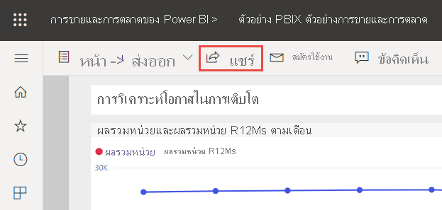
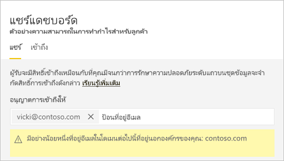
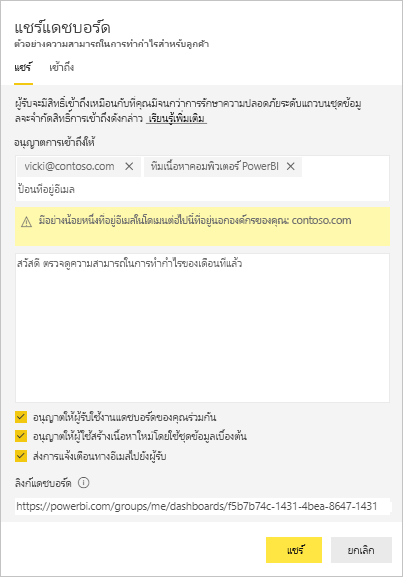
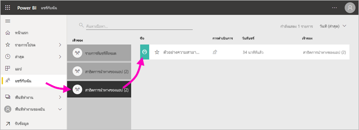
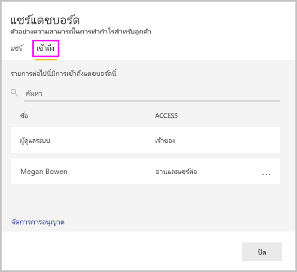
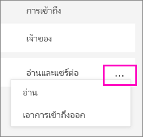
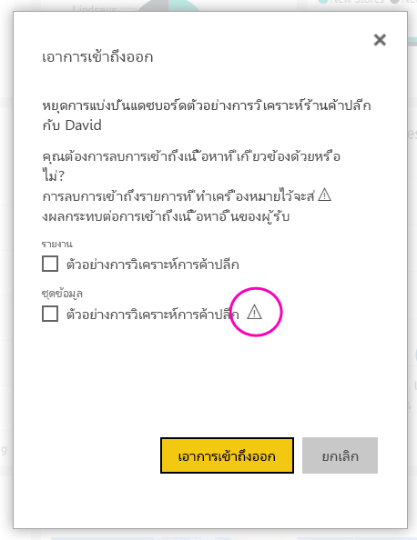

# แชร์แดชบอร์ด Power BI และรายงานกับเพื่อนร่วมงานและคนอื่นๆShare Power BI dashboards and reports with coworkers and others
*การแชร์* เป็นวิธีที่ง่ายที่สุดในการให้ผู้ใช้สามารถเข้าถึงแดชบอร์ดและรายงานของคุณในบริการของ Power BI ได้*Sharing* is the easiest way to give people access to your dashboards and reports in the Power BI service. คุณสามารถแชร์กับบุคคลภายในหรือภายนอกองค์กรของคุณได้You can share with people inside or outside your organization.

เมื่อคุณแชร์แดชบอร์ดหรือรายงาน คนที่คุณแชรให้จะสามารถดูและโต้ตอบกับรายการดังกล่าวได้ แต่ไม่สามารถแก้ไขได้When you share a dashboard or report, the people you share it with can view it and interact with it, but can't edit it. พวกเขาจะเห็นข้อมูลเดียวกันกับที่คุณเห็นในแดชบอร์ดและรายงานและรับการเข้าถึงชุดข้อมูลเบื้องต้นทั้งหมด นอกจากว่าจะมีความปลอดภัยระดับแถว (RLS) ใช้กับชุดข้อมูลพื้นฐานThey see the same data that you see in the dashboard and reports and get access to the entire underlying dataset unless row-level security (RLS) is applied to the underlying dataset.  เหล่าเพื่อนร่วมงานที่คุณแชร์กับสามารถใช้ร่วมกับเพื่อนร่วมงานของพวกเขา ถ้าคุณอนุญาตThe coworkers you share with can also share with their coworkers, if you allow them to. บุคคลภายนอกองค์กรสามารถดู และโต้ตอบกับแดชบอร์ดหรือรายงาน แต่ไม่สามารถแชร์ได้The people outside your organization can view and interact with the dashboard or report, but can't share it. 

คุณสามารถแชร์แดชบอร์ดและรายงานได้จากหลายตำแหน่งในบริการของ Power BI ดังนี้: รายการโปรด ล่าสุด พื้นที่ทำงานของฉันYou can share dashboards and reports from many places in the Power BI service: Favorites, Recent, My Workspace. คุณสามารถแชร์จากพื้นที่ทำงานอื่นได้เช่นกัน ถ้าคุณมี [บทบาทผู้ดูแลระบบ สมาชิกหรือผู้สนับสนุน](service-new-workspaces.md#roles-in-the-new-workspaces) ในพื้นที่ทำงานYou can share from other workspaces, too, if you have the [Admin, Member, or Contributor role](service-new-workspaces.md#roles-in-the-new-workspaces) in the workspace. และคุณสามารถแชร์แดชบอร์ดและรายงานในแชร์ร่วมกับฉันได้ถ้าเจ้าของอนุญาตAnd you can share dashboards and reports in Shared with me, if the owner allows it. 

บริการของ Power BI มีวิธีอื่นๆ ในการทำงานร่วมกันและเผยแพร่แดชบอร์ดและรายงานได้เช่นกันThe Power BI service offers other ways to collaborate and distribute dashboards and reports, too. อ่าน[วิธีการเพื่อทำงานร่วมกันและแชร์ใน Power BI](service-how-to-collaborate-distribute-dashboards-reports.md) เพื่อดูวิธีที่ดีที่สุดสำหรับสถานการณ์ของคุณRead [Ways to collaborate and share in Power BI](service-how-to-collaborate-distribute-dashboards-reports.md) to see which way works best for your circumstances. 

ด้วยการใช้งานร่วมกัน ไม่ว่าคุณแชร์เนื้อหาภายใน หรือภายนอกองค์กร คุณจำเป็นต้องมี[สิทธิ์การใช้งาน Power BI Pro](../fundamentals/service-features-license-type.md)With sharing, whether you share content inside or outside your organization, you need a [Power BI Pro license](../fundamentals/service-features-license-type.md). ผู้รับของคุณยังต้องมีสิทธิ์ใช้งาน Power BI Pro หรือเนื้อหาต้องอยู่ใน [ความจุแบบพรีเมียม](../admin/service-premium-what-is.md)Your recipients also need Power BI Pro licenses, unless the content is in a [Premium capacity](../admin/service-premium-what-is.md). 

คุณไม่สามารถ *แชร์* ได้โดยตรงจาก Power BI DesktopYou can't *share* directly from Power BI Desktop. คุณ[เผยแพร่รายงานจาก Power BI Desktop](../create-reports/desktop-upload-desktop-files.md) ไปยังบริการ Power BIYou [publish reports from Power BI Desktop](../create-reports/desktop-upload-desktop-files.md) to the Power BI service. อย่างไรก็ตาม คุณยังสามารถ[แชร์แดชบอร์ดจากแอป Power BI สำหรับอุปกรณ์เคลื่อนที่](../consumer/mobile/mobile-share-dashboard-from-the-mobile-apps.md)ได้ด้วยHowever, you can [share a dashboard from the Power BI mobile apps](../consumer/mobile/mobile-share-dashboard-from-the-mobile-apps.md).  

## แชร์แดชบอร์ดหรือรายงานShare a dashboard or report

1. ในรายการของแดชบอร์ดหรือรายงาน หรือในแดชบอร์ดหรือรายงานที่เปิด ให้เลือก **แชร์**:::image type="icon" source="../media/power-bi-share-icon.png" border="false":::

2. ในกล่องทางด้านบน ใส่อยู่อีเมลแบบเต็มสำหรับแต่ละบุคคล กลุ่มการแจกจ่ายหรือกลุ่มความปลอดภัยIn the top box, enter the full email addresses for individuals, distribution groups, or security groups. คุณไม่สามารถใช้ร่วมกับรายการการแจกแจงแบบไดนามิกYou can't share with dynamic distribution lists. 
   
   คุณสามารถใช้ร่วมกันกับบุคคลที่มีอยู่ภายนอกองค์กรของคุณ แต่คุณจะเห็นคำเตือนYou can share with people whose addresses are outside your organization, but you'll see a warning. อ่านเพิ่มเติมเกี่ยวกับ[การแชร์ออกนอกองค์กรของคุณ](#share-a-dashboard-or-report-outside-your-organization) ในบทความนี้Read more about [sharing outside your organization](#share-a-dashboard-or-report-outside-your-organization) in this article.
   
    
 
   >[!NOTE]
   >กล่องข้อมูลป้อนเข้ารองรับผู้ใช้หรือกลุ่มแยกกันได้สูงสุด 100 คน/กลุ่มThe input box supports, at most, 100 separate users or groups. โปรดดูหัวข้อ [แชร์กับผู้ใช้มากกว่า 100 ราย](#share-with-more-than-100-separate-users) ในบทความนี้สำหรับวิธีการแชร์กับคนอื่นมากขึ้นSee [Share with more than 100 users](#share-with-more-than-100-separate-users) in this article for ways to share with more people.

3. เพิ่มข้อความถ้าคุณต้องการAdd a message if you want. เลือกหรือไม่เลือกก็ได้It's optional.
4. เมื่อต้องการให้เพื่อนร่วมงานของคุณใช้เนื้อหาของคุณร่วมกันกับผู้อื่น ให้ตรวจสอบ **อนุญาตให้ผู้รับแชร์แดชบอร์ด (หรือรายงาน)**To let your coworkers share your content with others, check **Allow recipients to share your dashboard (or report)**.
   
   อนุญาตให้ผู้อื่นแชร์นั้นถูกเรียกว่า *resharing*Allowing others to share is called *resharing*. ถ้าคุณให้อนุญาตพวกเขา พวกเขาสามารถแชร์ต่อจาก Power BI service และแอปสำหรับอุปกรณ์เคลื่อน หรือส่งต่ออีเมลเชิญให้กับผู้อื่นในองค์กรของคุณIf you let them, they can reshare from the Power BI service and the mobile apps, or forward the email invitation to others in your organization. คำเชิญจะหมดอายุในอีกหนึ่งเดือนThe invitation expires after one month. บุคคลภายนอกองค์กรของคุณไม่สามารถแชร์ต่อได้People outside your organization can't reshare. ในฐานะเจ้าของเนื้อหา คุณสามารถปิดการแชร์ซ้ำ หรือเพิกถอนการแชร์ซ้ำบนแต่ละเซลล์As the owner of the content, you can turn off resharing, or revoke resharing on an individual basis. โปรดดูหัวข้อ [หยุดหรือเปลี่ยนแปลงการแชร์](#stop-or-change-sharing) ในบทความนี้See [Stop or change sharing](#stop-or-change-sharing) in this article.

5. ถ้าคุณเลือก **อนุญาตให้ผู้ใช้สร้างเนื้อหาใหม่โดยใช้ชุดข้อมูลพื้นฐาน** พวกเขาสามารถสร้างรายงานของตนเองในพื้นที่ทำงานอื่น ๆ โดยยึดตามชุดข้อมูลสำหรับแดชบอร์ดนี้ได้If you select **Allow users to build new content using the underlying datasets**, they can create their own reports in other workspaces based on the dataset for this dashboard. อ่านเพิ่มเติมเกี่ยวกับ [การสร้างรายงานที่ยึดตามชุดข้อมูลจากพื้นที่ทำงานที่ต่างกัน](../connect-data/service-datasets-discover-across-workspaces.md)Read more about [creating reports based on datasets from different workspaces](../connect-data/service-datasets-discover-across-workspaces.md).

1. เลือก **แชร์**Select **Share.**
   
     
   
   Power BI ส่งคำเชิญทางอีเมลของบุคคล แต่ไม่สามารถจัดกลุ่ม ที่มีลิงก์ไปยังเนื้อหาที่แชร์Power BI sends an email invitation to the individuals, but not to groups, with a link to the shared content. คุณดูแจ้งเตือนที่ **ประสบความสำเร็จ**You see a **Success** notification. 
   
   เมื่อผู้รับในองค์กรของคุณคลิกลิงก์ Power BI เพิ่มแดชบอร์ดหรือรายงานหน้ารายการ **แชร์กับฉัน** ของพวกเขาWhen recipients in your organization click the link, Power BI adds the dashboard or report to their **Shared with me** list page. พวกเขาสามารถเลือกชื่อของคุณเมื่อต้องการดูเนื้อหาทั้งหมดที่คุณได้่แชร์กับพวกเขาThey can select your name to see all the content you've shared with them. 
   
   
   
   เมื่อผู้รับภายนอกองค์กรของคุณคลิกลิงก์ พวกเขาจะเห็นแดชบอร์ดหรือรายงาน แต่ไม่ใช่ในพอร์ทัล Power BI ปกติWhen recipients outside your organization click the link, they see the dashboard or report, but not in the usual Power BI portal. อ่านเพิ่มเติมเกี่ยวกับ [การแชร์กับบุคคลภายนอกองค์กรของคุณ](#share-a-dashboard-or-report-outside-your-organization) ในบทความนี้Read more about [sharing with people outside your organization](#share-a-dashboard-or-report-outside-your-organization) in this article.

## ดูว่าใครสามารถเข้าถึงแดชบอร์ดหรือรายงานที่คุณแชร์ได้บ้างSee who has access to a dashboard or report
ในบางครั้งคุณจำเป็นต้องดูบุคคลที่คุณได้แชร์ และดูว่าพวกเขาได้แชร์กับใครบ้างSometimes you need to see the people you've shared with, and see who they've shared it with.

1. ในรายการของแดชบอร์ดและรายงาน หรือในแดชบอร์ดหรือรายงานเอง ให้เลือก **แชร์** :::image type="icon" source="../media/power-bi-share-icon.png" border="false"::: 
2. ในกล่องโต้ตอบ **แชร์แดชบอร์ด** หรือ **รายงาน** ให้เลือก **เข้าถึง**In the **Share dashboard** or **Share report** dialog box, select **Access**.
   
    

    บุคคลภายนอกองค์กรของคุณได้แสดงอยู่ในขณะ **ผู้เยี่ยมชม**People outside your organization are listed as **Guest**.

    ในมุมมองนี้ คุณสามารถ [หยุดหรือเปลี่ยนแปลงสิทธิ์การแชร์](#stop-or-change-sharing) ในบทความนี้In this view, you can [stop or change sharing permissions](#stop-or-change-sharing) in this article. 

## แชร์แดชบอร์ดหรือรายงานภายนอกองค์กรของคุณShare a dashboard or report outside your organization
เมื่อคุณแชร์กับบุคคลภายนอกองค์กรของคุณ พวกเขาได้รับอีเมลพร้อมลิงก์ไปยังแดชบอร์ดหรือรายงานที่แชร์When you share with people outside your organization, they receive an email with a link to the shared dashboard or report. พวกเขาต้องลงชื่อเข้าใช้ Power BI เพื่อดูสิ่งที่คุณแชร์They must sign in to Power BI to see what you shared. ถ้าพวกเขาไม่มีสิทธิ์การใช้งาน Power BI Pro พวกเขาสามารถลงทะเบียนขอสิทธิ์การใช้งานหลังจากพวกเขาคลิกลิงก์If they don't have a Power BI Pro license, they can sign up for a license when they click the link.

หลังจากที่พวกเขาลงชื่อเข้าใช้ พวกเขาจะเห็นแดชบอร์ดหรือรายงานที่แชร์ในหน้าต่างเบราว์เซอร์ของตนเอง ไม่ใช่ในพอร์ทัล Power BI ปกติของพวกเขาAfter they sign in, they see the shared dashboard or report in its own browser window, not in the usual Power BI portal. หากต้องการเข้าถึงแดชบอร์ดหรือรายงานในภายหลัง พวกเขาจะต้องบุ๊กมาร์กลิงก์เอาไว้To access this dashboard or report later, they must bookmark the link.

พวกเขาจะไม่สามารถแก้ไขเนื้อหาใดๆ ในแดชบอร์ดหรือรายงานนี้ได้They can't edit any content in this dashboard or report. พวกเขาสามารถโต้ตอบกับแผนภูมิ และเปลี่ยนตัวกรอง หรือตัวแบ่งส่วนข้อมูล แต่ไม่สามารถบันทึกการเปลี่ยนแปลงของพวกเขาได้They can interact with the charts and change filters or slicers, but can't save their changes. 

เฉพาะผู้รับโดยตรงของคุณเท่านั้นที่สามารถดูแดชบอร์ดหรือรายงานที่แชร์ได้Only your direct recipients see the shared dashboard or report. ตัวอย่างเช่น ถ้าคุณส่งอีเมลไปยัง Vicki@contoso.com ดังนั้นมีเพียง Vicki เท่านั้นที่สามารถมองเห็นแดชบอร์ดได้For example, if you sent the email to Vicki@contoso.com, only Vicki sees the dashboard. บุคคลอื่นไม่สามารถมองเห็นแดชบอร์ดได้ แม้ว่า Vicki จะส่งต่อลิงก์ไปให้ก็ตามNo one else can see the dashboard, even if Vicki forwards them the link. Vicki ต้องใช้ที่อยู่อีเมลเดียวกันในการเข้าถึง ถ้า Vicki ลงทะเบียนด้วยที่อยู่อีเมลอื่น Vicki จะไม่สามารถเข้าถึงแดชบอร์ดได้Vicki must use the same email address to access it; if Vicki signs in with any other email address, Vicki won't have access to the dashboard.

บุคคลภายนอกองค์กรของคุณไม่สามารถมองเห็นข้อมูลใดเลย ถ้าการรักษาความปลอดภัยระดับแถวหรือระดับบทบาทหรือระดับบทบาทถูกเปิดใช้ในแบบจำลองแบบตาราง Analysis Services ภายในองค์กรPeople outside your organization don't see any data at all if role- or row-level security is implemented on on-premises Analysis Services tabular models.

ใช้กลุ่มความปลอดภัย ไม่ใช่กลุ่มการแจกจ่ายเพื่อแชร์กับกลุ่มที่มีบุคคลที่มีที่อยู่อีเมลภายนอกUse a security group, not a distribution group, to share with a group that includes people with external email addresses. บุคคลที่มีอีเมลภายนอกในกลุ่มการแจกจ่ายไม่สามารถดูเนื้อหาที่คุณแชร์ เว้นแต่ว่าพวกเขาจะเป็นผู้ใช้ประเภทผู้เยี่ยมชมแบบ B2B สำหรับ Azure Active Directory (Azure AD)People with external emails in a distribution group can't see the content you share, unless they are Azure Active Directory (Azure AD) B2B guest users. เรียนรู้เพิ่มเติมเกี่ยวกับการ [ผู้ใช้ประเภทผู้เยี่ยมชมแบบ B2B สำหรับ Azure AD](../admin/service-admin-azure-ad-b2b.md)Learn more about [Azure AD B2B guest users](../admin/service-admin-azure-ad-b2b.md).

ถ้าคุณส่งลิงก์จากแอปสำหรับอุปกรณ์เคลื่อนที่ Power BI ไปยังบุคคลภายนอกองค์กร การคลิกลิงก์จะเปิดในเบราว์เซอร์ ไม่ใช่แอปสำหรับอุปกรณ์เคลื่อนที่ Power BIIf you send a link from a Power BI mobile app to people outside your organization, clicking the link opens the dashboard in a browser, not in the Power BI mobile app.

### อนุญาตให้ผู้ใช้ภายนอกแก้ไขเนื้อหาได้Allow external users to edit content

ผู้ดูแลระบบ Power BI ของคุณสามารถอนุญาตให้ผู้ใช้ที่เป็นผู้เยี่ยมชมทำการแก้ไขและจัดการเนื้อหาในองค์กรของคุณได้Your Power BI admin can allow external guest users to edit and manage content in your organization. ถ้าเป็นเช่นนั้น ผู้ใช้ภายนอกของคุณจะไม่ได้รับเพียงแค่ประสบการณ์การใช้งานเท่านั้นIf so, your external users won't have that consumption-only experience. แต่พวกเขาสามารถแก้ไขและจัดการเนื้อหาภายในองค์กรของคุณได้ด้วยThey can edit and manage content within your organization. เรียนรู้เพิ่มเติมเกี่ยวกับ [การกระจายเนื้อหา Power BI ไปยังผู้ใช้ที่เป็นผู้เยี่ยมชมจากภายนอกด้วย Azure AD B2B](../admin/service-admin-azure-ad-b2b.md)Learn more about [distributing Power BI content to external guest users with Azure AD B2B](../admin/service-admin-azure-ad-b2b.md).

## แชร์กับผู้ใช้แยกต่างหากมากกว่า 100 รายShare with more than 100 separate users

คุณสามารถแชร์กับผู้ใช้หรือกลุ่มได้มากที่สุด 100 คนต่อการดำเนินการแบ่งปันหนึ่งครั้งAt most, you can share with 100 users or groups in a single share action. อย่างไรก็ตาม คุณสามารถให้การเข้าถึงหน่วยข้อมูลแก่ผู้ใช้ได้มากกว่า 500 คนHowever, you can give more than 500 users access to an item. นี่คือคำแนะนำบางอย่าง:Here are some suggestions:

- แชร์หลายครั้งโดยการระบุผู้ใช้เป็นรายบุคคลShare multiple times by specifying the users individually.
- แชร์กับกลุ่มผู้ใช้ที่ประกอบด้วยผู้ใช้ทั้งหมดShare with a user group that contains all the users. 
- สร้างรายงานหรือแดชบอร์ดในพื้นที่ทำงาน จากนั้นสร้างแอปจากพื้นที่ทำงานCreate the report or dashboard in a workspace, then create an app from the workspace. คุณสามารถแชร์แอปกับบุคคลอื่นๆ อีกมากมายYou can share the app with many more people. อ่านเพิ่มเติมเกี่ยวกับ [การเผยแพร่แอปใน Power BI](service-create-distribute-apps.md)Read more about [publishing apps in Power BI](service-create-distribute-apps.md).

## หยุดหรือเปลี่ยนแปลงการแชร์Stop or change sharing
เฉพาะแดชบอร์ดหรือเจ้าของรายงานที่สามารถเปิดหรือปิดการแชร์ต่อได้Only the dashboard or report owner can turn resharing on and off.

### ถ้าคุณยังไม่ได้ส่งคำเชิญการแชร์If you haven't sent the sharing invitation yet
* ยกเลิกการทำเครื่องหมาย **อนุญาตให้ผู้รับแชร์แดชบอร์ด (หรือรายงาน)** ที่ด้านล่างของคำเชิญก่อนที่จะส่งClear the **Allow recipients to share your dashboard (or report)** check box at the bottom of the invitation before you send it.

### ถ้าคุณเคยแชร์แดชบอร์ดหรือรายงานIf you've already shared the dashboard or report
1. ในรายการของแดชบอร์ดและรายงาน หรือในแดชบอร์ดหรือรายงานเอง ให้เลือก **แชร์** :::image type="icon" source="../media/power-bi-share-icon.png" border="false"::: 
2. ในกล่องโต้ตอบ **แชร์แดชบอร์ด** หรือ **รายงาน** ให้เลือก **เข้าถึง**In the **Share dashboard** or **Share report** dialog box, select **Access**.
   
    
3. เลือกจุดไข่ปลา ( **...** ) ถัดจาก **อ่านและแชร์ต่อ** และเลือกSelect the ellipsis (**...**) next to **Read and reshare** and select:
   
   
   
   * **อ่าน** เพื่อป้องกันไม่ให้บุคคลที่ใช้ร่วมกันกับผู้อื่น**Read** to keep that person from sharing with anyone else.
   * **ลบการเข้าถึง** เพื่อป้องกันไม่ให้บุคคลที่มองเห็นเนื้อหาที่แชร์ทั้งหมด**Remove access** to keep that person from seeing the shared content at all.

4. ในกล่องโต้ตอบ **ลบการเข้าถึง** ให้ตัดสินใจว่าคุณต้องการลบการเข้าถึงเนื้อหาที่เกี่ยวข้องเช่น รายงาน และชุดข้อมูลหรือไม่In the **Remove access** dialog box, decide if you also want to remove access to related content, such as reports and datasets. ถ้าคุณลบรายการที่มีไอคอนคำเตือน  จะเป็นการดีที่สุดที่จะลบเนื้อหาที่เกี่ยวข้องด้วยIf you remove items with a warning icon , it's best to also remove related content. มิฉะนั้นระบบจะไม่แสดงได้อย่างถูกต้องOtherwise, it won't display properly.

    

## ข้อจำกัดและข้อควรพิจารณาLimitations and considerations
สิ่งที่ควรทราบเกี่ยวกับการแชร์แดชบอร์ดและรายงานThings to keep in mind about sharing dashboards and reports:

* เมื่อคุณแชร์แดชบอร์ดกับเพื่อนร่วมงาน หมายความว่าคุณกำลังแชร์ชุดข้อมูลเบื้องต้นด้วยWhen you share a dashboard with colleagues you are sharing the underlying dataset as well. เพื่อนร่วมงานของคุณสามารถเข้าถึงชุดข้อมูลทั้งหมด ยกเว้น [การรักษาความปลอดภัยระดับแถว (RLS)](../admin/service-admin-rls.md) จะจำกัดการเข้าถึงของพวกเขาYour colleagues get access to the entire dataset unless [row-level security (RLS)](../admin/service-admin-rls.md) limits their access. ผู้เขียนรายงานอาจใช้ความสามารถที่กำหนดประสบการณ์ผู้ใช้เมื่อดูหรือโต้ตอบกับรายงาน เช่น การซ่อนคอลัมน์ การจำกัดการดำเนินงานในวิชวล และอื่น ๆReport authors may use capabilities that  customize user experiences when viewing or interacting with reports, for example hiding columns, limiting the actions on visuals, and others. ประสบการณ์ผู้ใช้ที่กำหนดเองเหล่านี้ไม่จำกัดสิ่งที่ผู้ใช้สามารถเข้าถึงข้อมูลในชุดข้อมูลThese customized user experience do not restrict what data users can access in the dataset. ใช้ [การรักษาความปลอดภัยระดับแถว (RLS)](../admin/service-admin-rls.md) ในชุดข้อมูลเพื่อให้ข้อมูลประจำตัวของแต่ละบุคคลกำหนดว่าข้อมูลใดที่พวกเขาสามารถเข้าถึงได้Use [row-level security (RLS)](../admin/service-admin-rls.md) in the dataset so that each person's credentials determine which data they can access.
* ทุกคนที่คุณแชร์แดชบอร์ดของคุณ สามารถดูและโต้ตอบกับรายงานที่เกี่ยวข้องใน[มุมมองการอ่าน](../consumer/end-user-reading-view.md#reading-view)ได้Everyone you share your dashboard with can see it and interact with the related reports in [Reading view](../consumer/end-user-reading-view.md#reading-view). โดยทั่วไปแล้ว พวกเขาไม่สามารถสร้างรายงาน หรือบันทึกการเปลี่ยนแปลงรายงานที่มีอยู่ได้In general, they can't create reports or save changes to existing reports. อย่างไรก็ตาม ถ้าคุณเลือก **อนุญาตให้ผู้ใช้สร้างเนื้อหาใหม่โดยใช้ชุดข้อมูลพื้นฐาน** พวกเขาสามารถสร้างรายงานของตนเองในพื้นที่ทำงานอื่นโดยยึดตามชุดข้อมูลสำหรับแดชบอร์ดหรือรายงานนี้ได้However, if you select **Allow users to build new content using the underlying datasets**, they can create their own reports in other workspaces based on the dataset for this dashboard or report.
* แม้ว่าไม่มีผู้ใดสามารถดูหรือดาวน์โหลดชุดข้อมูลได้ แต่พวกเขาสามารถเข้าถึงชุดข้อมูลโดยตรงด้วยการใช้คุณลักษณะการวิเคราะห์ใน ExcelAlthough no one can see or download the dataset, they can access the dataset directly by using the Analyze in Excel feature. ผู้ดูแลระบบสามารถจำกัดความสามารถในการใช้การวิเคราะห์ใน Excel สำหรับทุกคนในกลุ่มAn admin can restrict the ability to use Analyze in Excel for everyone in a group. อย่างไรก็ตาม ข้อจำกัดสำนี้จะเป็นเพียงข้อจำกัดสำหรับทุกคนในกลุ่มนั้นและสำหรับทุกพื้นที่ทำงานที่อยู่ในกลุ่มHowever, the restriction is for everyone in that group and for every workspace the group belongs to.
* ทุกคนสามารถ[รีเฟรชข้อมูล](../connect-data/refresh-data.md)ได้ด้วยตนเองEveryone can manually [refresh the data](../connect-data/refresh-data.md).
* ถ้าคุณใช้ Microsoft 365 สำหรับอีเมล คุณสามารถแชร์กับสมาชิกของกลุ่มการแจกจ่าย โดยการใส่อยู่อีเมลที่เชื่อมโยงกับกลุ่มการแจกจ่ายIf you use Microsoft 365 for email, you can share with members of a distribution group by entering the email address associated with the distribution group.
* เพื่อนร่วมงานที่มีโดเมนอีเมลเดียวกันกับคุณ และเพื่อนร่วมงานที่มีโดเมนแตกต่างกัน แต่ลงทะเบียนภายในผู้เช่าเดียวกัน สามารถแชร์แดชบอร์ดระหว่างกันได้Coworkers who share your email domain, and coworkers whose domain is different but registered within the same tenant, can share the dashboard with others. ตัวอย่างเช่น โดเมน contoso.com และ contoso2.com มีการลงทะเบียนในผู้เช่ารายเดียวกันและที่อยู่อีเมลของคุณคือ konrads@contoso.comFor example, say the domains contoso.com and contoso2.com are registered in the same tenant and your email address is konrads@contoso.com. ทั้ง ravali@contoso.com และ gustav@contoso2.com สามารถแชร์แดชบอร์ดของคุณได้ตราบใดที่คุณให้สิทธิ์ในการแชร์แก่พวกเขาBoth ravali@contoso.com and gustav@contoso2.com can share your dashboard, as long as you give them permission to share.
* ถ้าเพื่อนร่วมงานของคุณมีสิทธิ์เข้าถึงแดชบอร์ดหรือรายงานที่เฉพาะเจาะจง คุณสามารถส่งลิงก์โดยตรง เพียงคัดลอก URL เมื่อคุณอยู่บนแดชบอร์ดหรือรายงานIf your coworkers already have access to a specific dashboard or report, you can send a direct link by copying the URL when you're on the dashboard or report. ตัวอย่างเช่น: `https://powerbi.com/dashboards/g12466b5-a452-4e55-8634-xxxxxxxxxxxx`For example: `https://powerbi.com/dashboards/g12466b5-a452-4e55-8634-xxxxxxxxxxxx`.
* ในทำนองเดียวกัน ถ้าผู้ร่วมงานของคุณมีสิทธิ์เข้าถึงแดชบอร์ดอันใดอันหนึ่ง คุณสามารถ[ส่งลิงก์โดยตรงไปยังรายงานด้านใน](service-share-reports.md)ได้Likewise, if your coworkers already have access to a specific dashboard, you can [send a direct link to the underlying report](service-share-reports.md). 

## ขั้นตอนถัดไปNext steps

- [ฉันควรทำงานร่วมกัน และแชร์แดชบอร์ดและรายงานได้อย่างไรHow should I collaborate on and share dashboards and reports?](service-how-to-collaborate-distribute-dashboards-reports.md)
- [แก้ไขปัญหาแดชบอร์ดและรายงานที่ใช้ร่วมกันTroubleshoot sharing dashboards and reports](service-troubleshoot-sharing.md)
- [ส่งคำขอหรือให้สิทธิ์การเข้าถึงแดชบอร์ดหรือรายงานที่ใช้ร่วมกันRequest or grant access to shared dashboards or reports](service-request-access.md)
- [แชร์รายงาน Power BI ที่ถูกกรองShare a filtered Power BI report](service-share-reports.md)
- มีคำถามหรือไม่Questions? [ลองไปที่ชุมชน Power BITry the Power BI Community](https://community.powerbi.com/)
