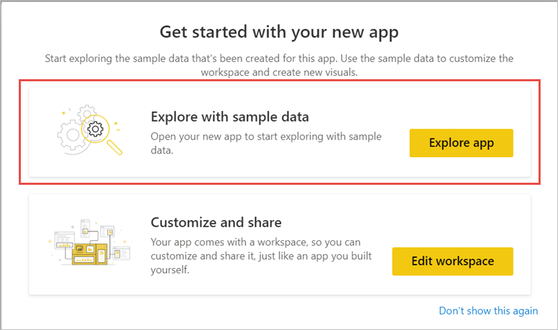

# กรองและแชร์รายงาน Power BIFilter and share a Power BI report
*แชร์* เป็นวิธีที่ดีเมื่อต้องให้บางคนสามารถเข้าถึงแดชบอร์ดและรายงานของคุณ*Sharing* is a good way to give a few people access to your dashboards and reports. จะเกิดอะไรขึ้นถ้าคุณต้องการแชร์รายงานที่ถูกกรองWhat if you want to share a filtered version of a report? คุณอาจต้องการให้รายงานแสดงเฉพาะข้อมูลสำหรับเมือง หรือพนักงานขาย หรือปีที่เฉพาะเจาะจงMaybe you want the report to show only data for a specific city or salesperson or year. บทความนี้อธิบายวิธีการกรองรายงานและการแชร์เวอร์ชันที่กรองแล้วของรายงานThis article explains how to filter a report and share the filtered version of the report. อีกวิธีหนึ่งในการแชร์รายงานที่กรองแล้วคือการ [เพิ่มพารามิเตอร์คิวรีไปยัง URL ของรายงาน](service-url-filters.md)Another way to share a filtered report is to [add query parameters to the report URL](service-url-filters.md). ในทั้งสองกรณี รายงานจะถูกกรองเมื่อผู้รับเปิดเป็นครั้งแรกIn both cases, the report is filtered when recipients first open it. พวกเขาสามารถล้างตัวเลือกตัวกรองในรายงานได้They can clear the filter selections in the report.

Power BI ยังนำเสนอ[วิธีอื่นๆ เพื่อที่จะทำงานร่วมกันและเผยแพร่แดชบอร์ดและรายงาน](service-how-to-collaborate-distribute-dashboards-reports.md)Power BI also offers [other ways to collaborate and distribute your reports](service-how-to-collaborate-distribute-dashboards-reports.md). ด้วยการแชร์ คุณและผู้รับของคุณต้องมี[สิทธิ์การใช้งาน Power BI Pro](../fundamentals/service-features-license-type.md)หรือเนื้อหาจำเป็นต้องเป็นแบบ[ความจุพรีเมียม](../admin/service-premium-what-is.md)With sharing, you and your recipients need a [Power BI Pro license](../fundamentals/service-features-license-type.md), or the content needs to be in a [Premium capacity](../admin/service-premium-what-is.md). 

## ติดตามพร้อมด้วยข้อมูลตัวอย่างFollow along with sample data

บทความนี้ใช้แอปแม่แบบตัวอย่างการตลาดและการขายThis article uses the Marketing and Sales sample template app. ต้องการลองใช้หรือไม่Want to try it? 

1. ติดตั้ง [แอปแม่แบบตัวอย่างการตลาดและการขาย](https://appsource.microsoft.com/product/power-bi/microsoft-retail-analysis-sample.salesandmarketingsample?tab=Overview)Install the [Marketing and Sales sample template app](https://appsource.microsoft.com/product/power-bi/microsoft-retail-analysis-sample.salesandmarketingsample?tab=Overview).
2. เลือกแอปและเลือก **สำรวจแอป**Select the app and select **Explore app**.

   

3. เลือกไอคอนรูปดินสอเพื่อเปิดพื้นที่ทำงานที่คุณติดตั้งด้วยแอปSelect the pencil icon to open the workspace that you installed with the app.

    

4. ในรายการเนื้อหาพื้นที่ทำงาน ให้เลือก **รายงาน** จากนั้นเลือกรายงาน **ตัวอย่าง PBIX การขายและการตลาด**In the workspace content list, select **Reports**, then select the report **Sales and Marketing Sample PBIX**.

    

    ในตอนนี้คุณก็พร้อมที่จะติดตามไปด้วยแล้วNow you're ready to follow along.

## ตั้งค่าตัวกรองในรายงานSet a filter in the report

เปิดรายงานใน[มุมมองการแก้ไข](../consumer/end-user-reading-view.md)และใช้ตัวกรองOpen a report in [Editing view](../consumer/end-user-reading-view.md) and apply a filter.

ในตัวอย่างนี้ เรากำลังกรองหน้าประเภท YTD ของแอปแม่แบบตัวอย่างการตลาดและการขายเพื่อแสดงเฉพาะค่าที่ **ภูมิภาค** นั้นคือ **ภาคกลาง**In this example, we're filtering the YTD Category page of the Marketing and Sales sample template app to show only values where **Region** equals **Central**. 
 

บันทึกรายงานSave the report.

## แชร์รายงานี่กรองแล้วShare the filtered report

1. เลือก **แชร์**Select **Share**.

   

2. ล้าง **ส่งการแจ้งเตือนทางอีเมลไปยังผู้รับ** เพื่อที่คุณจะสามารถส่งการเชื่อมโยงที่ถูกกรองแล้วไปแทน เลือก **แชร์รายงานด้วยตัวกรองและตัวแบ่งส่วนข้อมูลปัจจุบัน** จากนั้นเลือก **แชร์**Clear **Send email notification to recipients**, so you can send a filtered link instead, select **Share report with current filters and slicers**, then select **Share**.

    

4. เลือก **แชร์** อีกครั้งSelect **Share** again.

   

5. เลือกแท็บ **การเข้าถึง** จากนั้นเลือก **จัดการมุมมองรายงานที่แชร์**Select the **Access** tab, then select **Manage shared report views**.

    

6. คลิกขวาที่ URL ที่คุณต้องการ แล้วเลือก **คัดลอกลิงก์**Right-click the URL you want, and select **Copy link**.

    

7. เมื่อคุณแชร์ลิงก์นี้ ผู้รับจะเห็นรายงานที่กรองแล้วของคุณWhen you share this link, recipients will see your filtered report. 

## ข้อจำกัดและข้อควรพิจารณาLimitations and considerations
สิ่งที่ควรทราบเกี่ยวกับการแชร์รายงาน:Things to keep in mind about sharing reports:

* เมื่อคุณแชร์ชุดข้อมูลโดยการจัดการสิทธิ์โดยการแชร์รายงานหรือแดชบอร์ดหรือโดยการเผยแพร่แอป คุณจะอนุญาตให้เข้าถึงชุดข้อมูลทั้งหมดยกเว้น [การรักษาความปลอดภัยระดับแถว (RLS)](../admin/service-admin-rls.md) จำกัดการเข้าถึงของพวกเขาWhen you share a dataset by managing permissions, by sharing reports or dashboards, or by publishing an app, you're granting access access to the entire dataset unless [row-level security (RLS)](../admin/service-admin-rls.md) limits their access. ผู้เขียนรายงานอาจใช้ความสามารถที่กำหนดประสบการณ์ผู้ใช้เมื่อดูหรือโต้ตอบกับรายงาน เช่น การซ่อนคอลัมน์ การจำกัดการดำเนินงานในวิชวล และอื่น ๆReport authors may use capabilities that customize user experiences when viewing or interacting with reports, for example hiding columns, limiting the actions on visuals, and others. ประสบการณ์ผู้ใช้ที่กำหนดเองเหล่านี้ไม่จำกัดสิ่งที่ผู้ใช้สามารถเข้าถึงข้อมูลในชุดข้อมูลThese customized user experience do not restrict what data users can access in the dataset. ใช้ [การรักษาความปลอดภัยระดับแถว (RLS)](../admin/service-admin-rls.md) ในชุดข้อมูลเพื่อให้ข้อมูลประจำตัวของแต่ละบุคคลกำหนดว่าข้อมูลใดที่พวกเขาสามารถเข้าถึงได้Use [row-level security (RLS)](../admin/service-admin-rls.md) in the dataset so that each person's credentials determine which data they can access.

## ขั้นตอนถัดไปNext steps
* [วิธีการแชร์งานของคุณใน Power BIWays to share your work in Power BI](service-how-to-collaborate-distribute-dashboards-reports.md)
* [แชร์แดชบอร์ดShare a dashboard](service-share-dashboards.md)
* มีคำถามเพิ่มเติมหรือไม่More questions? [ลองไปที่ชุมชน Power BI](https://community.powerbi.com/)[Try the Power BI Community](https://community.powerbi.com/).
* มีคำติชมหรือไม่?Have feedback? ไปที่[ไซต์ชุมชน Power BI](https://community.powerbi.com/) พร้อมกับคำแนะนำของคุณGo to the [Power BI Community site](https://community.powerbi.com/) with your suggestions.
