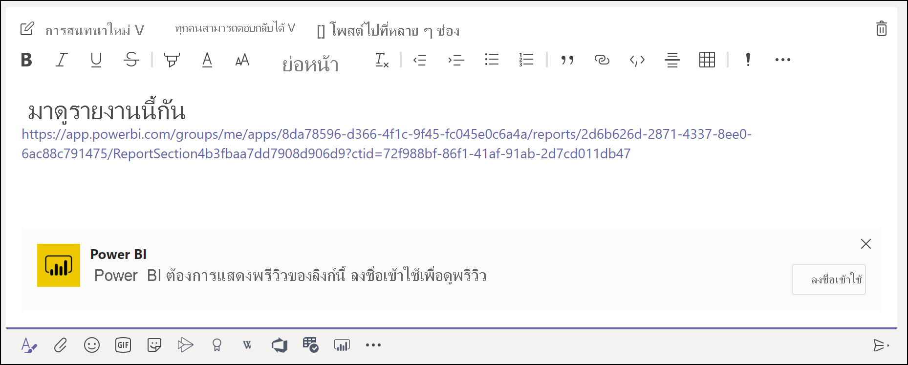
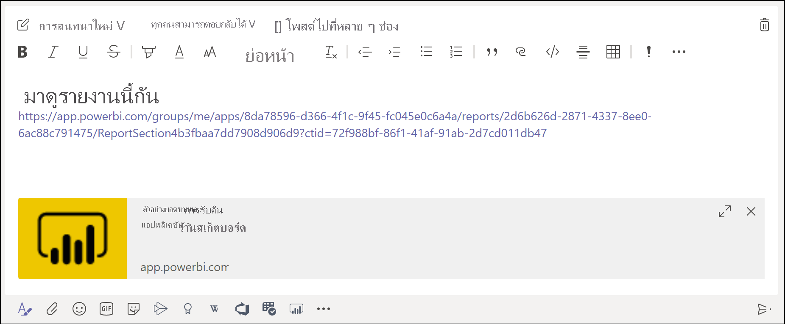
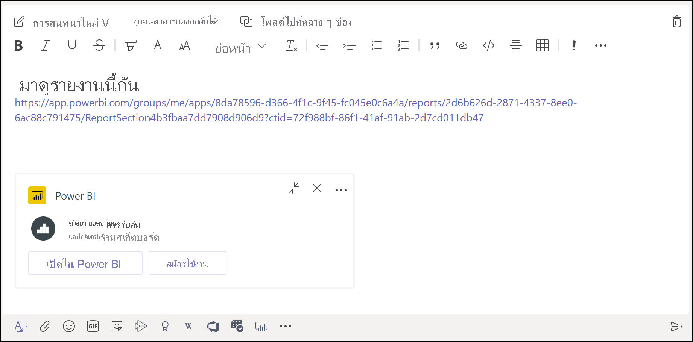

# รับตัวอย่างลิงก์ Power BI ใน Microsoft TeamsGet a Power BI link preview in Microsoft Teams

เมื่อคุณวางลิงก์ไปยังรายงาน แดชบอร์ด และแอปของคุณลงในกล่องข้อความ Microsoft Teams การแสดงตัวอย่างลิงก์จะแสดงข้อมูลเกี่ยวกับลิงก์ดังกล่าวWhen you paste a link to your reports, dashboards, and apps into the Microsoft Teams message box, the link preview shows information about the link. การแสดงตัวอย่างลิงก์มีไว้สำหรับรายการต่อไปนี้ใน Power BI:Link previews are provided for the following items in Power BI:

- รายงานReports
- แดชบอร์ดDashboards
- แอปApps

บริการการแสดงตัวอย่างลิงก์ต้องการให้ผู้ใช้ของคุณลงชื่อเข้าใช้The link preview service requires your users to sign in. หากต้องการออกจากระบบ ให้เลือกไอคอน **Power BI** ที่ด้านล่างของกล่องข้อความTo sign out, select the **Power BI** icon at the bottom of the message box. จากนั้นเลือก **ออกจากระบบ**Then select **Sign out**.

ดู [การทำงานร่วมกันใน Microsoft Teams ด้วย Power BI](service-collaborate-microsoft-teams.md) สำหรับเบื้องหลังเกี่ยวกับวิธีที่ระบบ Power BI และ Microsoft Teams ทำงานร่วมกัน รวมถึงข้อกำหนดต่าง ๆ ที่คุณต้องปฏิบัติตามSee [Collaborate in Microsoft Teams with Power BI](service-collaborate-microsoft-teams.md) for background on how Power BI and Microsoft Teams work together, including requirements you need to meet.

## รับตัวอย่างลิงก์Get a link preview

ทำตามขั้นตอนเหล่านี้เพื่อรับการแสดงตัวอย่างลิงก์สำหรับเนื้อหาในบริการของ Power BIFollow these steps to get a link preview for content in the Power BI service.

1. คัดลอกลิงก์ไปยังรายงาน แดชบอร์ด หรือแอปในบริการของ Power BICopy a link to a report, a dashboard, or an app in the Power BI service. ตัวอย่างเช่น คัดลอกลิงก์จากแถบที่อยู่เบราว์เซอร์For example, copy the link from the browser address bar.

1. วางลิงก์ในกล่องข้อความของ Microsoft TeamsPaste the link in the Microsoft Teams message box. ลงชื่อเข้าใช้บริการการแสดงตัวอย่างลิงก์ถ้าได้รับพร้อมท์Sign in to the link preview service if prompted. คุณอาจต้องรอสองสามวินาในการโหลดการแสดงตัวอย่างลิงก์You might need to wait a few seconds for the link preview to load.

    

1. การแสดงตัวอย่างลิงก์พื้นฐานจะปรากฏขึ้นหลังจากลงชื่อเข้าใช้เรียบร้อยแล้วThe basic link preview appears after successful sign-in.

    

1. เลือกไอคอน **ขยาย** เพื่อแสดงการ์ดแสดงตัวอย่างแบบผสมSelect the **Expand** icon to show the rich preview card.

    

1. การ์ดแสดงตัวอย่างลิงก์แบบผสมจะแสดงลิงก์และปุ่มการดำเนินการที่เกี่ยวข้องThe rich link preview card shows the link and relevant action buttons.

    

1. ส่งข้อความSend the message.

## ปัญหาและขีดจำกัดที่ทราบแล้วKnown issues and limitations

- การลงชื่อเข้าระบบครั้งเดียวไม่ได้รับการรองรับสำหรับบริการการแสดงตัวอย่างลิงก์Single sign-on isn't supported for the link preview service.
- การแสดงตัวอย่างลิงก์ไม่ทำงานในแชทการประชุมหรือแชนเนลส่วนตัวLink previews don't work in meeting chat or private channels.
- ดูปัญหาอื่น ๆ ที่หัวข้อ[ปัญหาที่ทราบแล้วและข้อจำกัดต่าง ๆ](service-collaborate-microsoft-teams.md#known-issues-and-limitations) ในบทความ “ทำงานร่วมกันใน Microsoft Teams"See the [Known issues and limitations](service-collaborate-microsoft-teams.md#known-issues-and-limitations) section of the "Collaborate in Microsoft Teams" article for other issues.

## ขั้นตอนถัดไปNext steps

- [ทำงานร่วมกันใน Microsoft Teams ด้วย Power BICollaborate in Microsoft Teams with Power BI](service-collaborate-microsoft-teams.md)

มีคำถามเพิ่มเติมหรือไม่More questions? [ลองถามชุมชน Power BI](https://community.powerbi.com/)[Try asking the Power BI Community](https://community.powerbi.com/).
