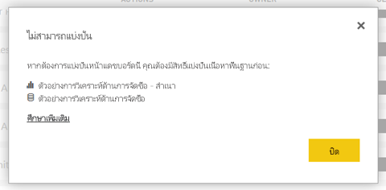

# แก้ไขปัญหาการแชร์แดชบอร์ดและรายงานTroubleshoot sharing dashboards and reports

ต่อไปนี้คือปัญหาทั่วไปบางอย่างที่อาจเกิดขึ้นเมื่อคุณแชร์แดชบอร์ดหรือรายงาน หรือเมื่อมีผู้อื่นแชร์กับคุณHere are some common issues that may come up when you're sharing a dashboard or report, or when someone else is sharing with you. 

## ผู้รับแดชบอร์ดจะเห็นไอคอนล็อกในไทล์Dashboard recipients see a lock icon in a tile

บุคคลที่คุณแชรให้อาจเห็นไทล์ในแดชบอร์ด หรือข้อความ "ต้องมีการให้อนุญาต" ถูกล็อก เมื่อพวกเขาพยายามดูรายงานThe people you share with may see a locked tile in a dashboard, or a "Permission required" message when they try to view a report.

ถ้าเป็นเช่นนั้น คุณจำเป็นต้องให้สิทธิ์ในชุดข้อมูลด้านในแก่พวกเขาIf so, you need to grant them permission to the underlying dataset.

1. ไปที่แท็บ **ชุดข้อมูล** ในรายการของคุณเนื้อหาGo to the **Datasets** tab in your content list.

1. เลือกจุดไข่ปลา ( **...** ) ถัดจากชุดข้อมูล > จากนั้นเลือก **จัดการการอนุญาต**Select the ellipsis (**...**) next to the dataset, then select **Manage permissions**.

    

1. เลือก **เพิ่มผู้ใช้**Select **Add user**.

    

1. ใส่อยู่อีเมลแบบเต็มของบุคคล กลุ่มการเผยแพร่หรือกลุ่มความปลอดภัยของคุณEnter the full email addresses for individuals, distribution groups, or security groups. คุณไม่สามารถใช้ร่วมกับรายการการแจกแจงแบบไดนามิกYou can't share with dynamic distribution lists.

    

1. เลือก **เพิ่ม**Select **Add**.

## ฉันไม่สามารถแชร์แดชบอร์ดหรือรายงานI can't share a dashboard or report

เมื่อต้องแชร์แดชบอร์ดหรือรายงาน คุณต้องได้รับอนุญาตแชร์เนื้อหาเบื้องต้นใด ๆ ที่เกี่ยวข้องกับรายงานและชุดข้อมูลTo share a dashboard or report, you need permission to reshare the underlying content; that is, any related reports and datasets. ถ้าคุณเห็นข้อความบอกว่า คุณไม่สามารถแชร์ได้ ขอให้ผู้เขียนรายงานให้แชร์สิทธิ์สำหรับรายงานและชุดข้อมูลเหล่านั้นแก่คุณอีกครั้งIf you see a message saying you can't share, ask the report author to give you reshare permission for those reports and datasets.

## ฉันไม่สามารถเข้าถึงแดชบอร์ดหรือรายงานได้I don't have access to a dashboard or report

ถ้าคุณเห็นข้อความ "ขอสิทธิ์การเข้าถึง" เมื่อคุณเลือกที่ลิงก์ไปยังรายงานหรือแดชบอร์ด แสดงว่าคุณไม่มีสิทธิ์ในการเข้าดูรายการIf you see a "Request access" message when you select the link to a report or dashboard, you don't have permission to view it. คุณจำเป็นต้อง [ขอสิทธิ์การเข้าถึง](service-request-access.md)You need to [request access to it](service-request-access.md).

## ขั้นตอนถัดไปNext steps

- [แชร์แดชบอร์ดและรายงาน Power BI กับเพื่อนร่วมงานและคนอื่นๆShare Power BI dashboards and reports with coworkers and others](service-share-dashboards.md)
- [ฉันควรทำงานร่วมกัน และแชร์แดชบอร์ดและรายงานได้อย่างไรHow should I collaborate on and share dashboards and reports?](service-how-to-collaborate-distribute-dashboards-reports.md)
-  [แชร์รายงาน Power BI ที่ถูกกรองShare a filtered Power BI report](service-share-reports.md)
- มีคำถามหรือไม่Questions? [ลองไปที่ชุมชน Power BITry the Power BI Community](https://community.powerbi.com/)
