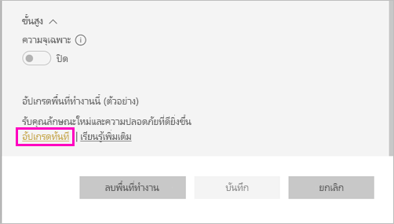
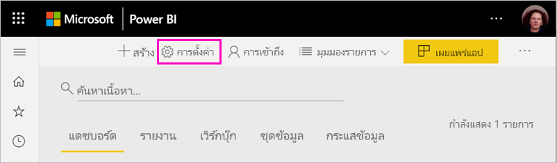
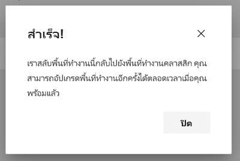

# อัปเกรดพื้นที่ทำงานแบบคลาสสิกเป็นพื้นที่งานใหม่ใน Power BIUpgrade classic workspaces to the new workspaces in Power BI

บทความนี้อธิบายวิธีการอัปเกรดหรือ *โยกย้าย* พื้นที่ทำงานแบบคลาสสิกเป็นการใช้งานพื้นที่ทำงานใหม่This article explains how to upgrade, or *migrate*, a classic workspace to the new workspace experience. คุณสามารถอัปเกรดพื้นที่ทำงานแบบคลาสสิกใดๆ ก็ได้You can upgrade any classic workspace. พื้นที่ทำงานใหม่มีบทบาทพื้นที่ทำงานที่ละเอียดมากขึ้นเพื่อให้คุณสามารถจัดการการเข้าถึงเนื้อหาได้ดีขึ้นThe new workspaces have more granular workspace roles so you can better manage access to content. คุณยังมีความยืดหยุ่นในการจัดการพื้นที่ทำงานที่อัปเกรดได้มากขึ้นเนื่องจากมีการเชื่อมต่อกับกลุ่ม Microfoft 365 เดิมได้อย่างอิสระมากขึ้นYou also have more flexibility managing upgraded workspaces because they're more loosely connected to their original Microsoft 365 group. ดูข้อมูลเกี่ยวกับ[การใช้งานพื้นที่ทำงานใหม่](service-new-workspaces.md)Learn about the [new workspace experience](service-new-workspaces.md).

>[!NOTE]
>การอัปเกรดพื้นที่ทำงานจะพร้อมใช้งานเป็นการแสดงตัวอย่างแบบสาธารณะWorkspace upgrade is available as a Public Preview. 

>[!NOTE]
>การอัปเกรดพื้นที่ทำงานสามารถเริ่มต้นได้โดยผู้ดูแลระบบ Power BI ผู้ดูแลระบบพื้นที่ทำงานจะได้รับอีเมลเมื่อพื้นที่ทำงานได้รับการอัปเกรดโดยผู้ดูแลระบบ Power BI [ศึกษาเพิ่มเติม](../admin/service-admin-portal.md#workspaces)Workspace upgrade can be initiated by a Power BI admin. Workspace admins receive an email when their workspace was upgraded by their Power BI admin. [Learn more](../admin/service-admin-portal.md#workspaces) 

แต่อาจมีการเปลี่ยนแปลงในพื้นที่ทำงานที่คุณจำเป็นต้องทราบและวางแผนHowever, there may be changes to your workspace that you need to be aware of and plan for. ตัวอย่างเช่น ชุดเนื้อหาไม่รองรับในพื้นที่ทำงานใหม่For example, content packs aren't supported in the new workspace experience. โปรดดูหัวข้อ [ข้อควรพิจารณาและข้อจำกัดของการอัปเกรด](#upgrade-considerations-and-limitations)ภายในบทความนี้See the [Upgrade considerations and limitations](#upgrade-considerations-and-limitations) section, later in this article.

## สิ่งที่ต้องวางแผนก่อนทำการอัปเกรดThings to plan before upgrading

คุณควรทำสิ่งต่างๆ หลายอย่าง *หลังจาก* อัปเกรดYou should do several things *after* you upgrade. วิธีที่ดีที่สุดคือการวางแผน *ก่อน* คุณอัปเกรด ดังนี้It's best to plan them *before* you upgrade:
- ตรวจสอบรายการการเข้าถึงและทำความเข้าใจ[สิทธิ์ หลังจากการอัปเกรด](#permissions-after-upgrade)Review the access list and understand the [permissions after upgrade](#permissions-after-upgrade).
- ตรวจสอบ[รายชื่อผู้ติดต่อ](#modify-the-contact-list)และตรวจสอบให้แน่ใจว่ามีการตั้งค่าตามที่คุณต้องการReview the [contact list](#modify-the-contact-list) and make sure it's set as you desire.
- หากคุณยังไม่ได้วางแผน โปรดดูข้อมูลเกี่ยวกับ[การใช้งานพื้นที่ทำงานใหม่](service-new-workspaces.md)If you've not already, learn about the [new workspace experience](service-new-workspaces.md).

## อัปเกรดพื้นที่ทำงานแบบคลาสสิกUpgrade a classic workspace

ผู้ดูแลพื้นที่ทำงานต่างๆ สามารถอัปเกรดพื้นที่ทำงานได้Any workspace admin can upgrade the workspace. สำหรับพื้นที่ทำงานแบบคลาสสิก ในการจะเป็นผู้ดูแลพื้นที่ทำงาน คุณจะต้องเป็นเจ้าของกลุ่ม Microsoft 365 พื้นฐานFor classic workspaces, to be a workspace admin you must be an Owner of the underlying Microsoft 365 group. หากต้องการอัปเกรดพื้นที่ทำงาน ให้ทำตามขั้นตอนต่อไปนี้To upgrade a workspace, follow these steps.

1. ในรายการเนื้อหาพื้นที่ทำงาน ให้เลือก **ตัวเลือกเพิ่มเติม** ( **...** ) > **แก้ไขพื้นที่ทำงานนี้**In the workspace content list, select **More options** (**...**) > **Edit this workspace**.

    

1. ขยาย **ขั้นสูง** และเลือก **อัปเกรดทันที**Expand **Advanced** and select **Upgrade now**.

    

1. ตรวจสอบข้อมูลของกล่องโต้ตอบReview the dialog box information. คุณจะเห็นคำเตือนหากเผยแพร่หรือติดตั้งชุดเนื้อหาในพื้นที่ทำงานแล้วYou see warnings if you've published or installed content packs in the workspace. เมื่อคุณพร้อมแล้ว ให้เลือก **ฉันพร้อมที่จะอัปเกรดพื้นที่ทำงานนี้** แล้วเลือก **อัปเกรด**When you're ready, check **I'm ready to upgrade this workspace**, then select **Upgrade**.

    

2. ในระหว่างการอัปเกรด คุณจะเห็นข้อความ **การอัปเกรด**During upgrade, you see the **Upgrading** message. โดยปกติแล้วจะใช้เวลาน้อยกว่า 1 นาทีในการอัปเกรดพื้นที่ทำงานของคุณIt usually takes less than a minute to upgrade your workspace.

1. หลังจากเสร็จสิ้นการอัปเกรด คุณจะเห็นกล่องโต้ตอบ **สำเร็จ**After upgrade finishes, you see the **Success** dialog box. คุณจะเห็นประสบการณ์การใช้งานพื้นที่ทำงานใหม่ที่มีชื่อและเนื้อหาเดียวกันYou see your new workspace experience, with the same name and contents. เราขอแนะนำให้อ่าน[จัดระเบียบการทำงานในพื้นที่ทำงานใหม่ใน Power BI](service-new-workspaces.md) เพื่อให้คุ้นเคยกับวิธีการใช้งานพื้นที่ทำงานใหม่ที่แตกต่างจากพื้นที่ทำการแบบคลาสสิกWe recommend reading [Organize work in the new workspaces in Power BI](service-new-workspaces.md) so you're familiar with how new workspaces differ from classic workspaces.

### ผลกระทบต่อผู้ใช้พื้นที่ทำงานรายอื่นImpact on other workspace users

เราขอแนะนำให้อัปเกรดในช่วงนอกเวลางานเมื่อจำนวนผู้ใช้ดูหรือแก้ไขรายการในพื้นที่ทำงานน้อยลงWe recommend upgrading during off-hours when few users are actively viewing or editing items in the workspace.

ผู้ใช้ที่กำลังใช้พื้นที่ทำงานจะถูกขอให้รีเฟรชเบราว์เซอร์Users who are actively using the workspace are asked to refresh their browser. ผู้ใช้ที่กำลังแก้ไขรายงานจะได้มีตัวเลือกในการบันทึกก่อนที่จะรีเฟรชUsers who are editing a report are given the option to save before they refresh.

## ข้อควรพิจารณาและข้อจำกัดของการอัปเกรดUpgrade considerations and limitations

- หลังจากการอัปเกรด เนื้อหาของพื้นที่ทำงานแบบคลาสสิกจะปรากฏในพื้นที่ทำงานใหม่After upgrade, the content of the classic workspace appears in the new workspace. นอกจากนี้ยังแสดงอยู่ใน **แชร์กับฉัน**It's also listed in **Shared with me**.
- URL และรหัส ของพื้นที่ทำงานของคุณ เนื้อหาที่มี และแอปที่เผยแพร่จากพื้นที่ทำงานจะไม่เปลี่ยนแปลงThe URLs and IDs of your workspace, the content it contains, and the app published from the workspace don't change. เนื้อหาจากชุดเนื้อหาที่ติดตั้งในพื้นที่ทำงานจะได้รับการจัดการแยกต่างหากContent from content packs installed in your workspace is handled separately. ดู[ชุดเนื้อหาระหว่างอัปเกรด](#content-packs-during-upgrade)ในบทความนี้สำหรับรายละเอียดSee [Content packs during upgrade](#content-packs-during-upgrade) in this article for details.
- ชุดเนื้อหาไม่รองรับในการใช้งานพื้นที่ทำงานใหม่Content packs aren't supported in the new workspace experience. อ่านหัวข้อเกี่ยวกับ[ชุดเนื้อหาที่เผยแพร่](#published-content-packs)หรือ[ชุดเนื้อหาที่ติดตั้ง](#installed-content-packs)เพื่อดูข้อมูลเกียวกับวิธีการจัดการระหว่างอัปเกรดRead the sections about [published content packs](#published-content-packs) or [installed content packs](#installed-content-packs) to learn about how they're handled during upgrade. เราขอแนะนำให้ลบชุดเนื้อหาที่ติดตั้งหรือเผยแพร่ในพื้นที่ทำงานของคุณก่อนที่คุณจะทำการอัปเกรดWe recommend deleting content packs installed or published in your workspace before you upgrade.
- กลุ่ม Microsoft 365 สำหรับพื้นที่ทำงานแบบคลาสสิกจะไม่ได้รับผลกระทบจากการอัปเกรดพื้นที่ทำงานใน Power BIThe Microsoft 365 group for your classic workspace isn't affected by the workspace upgrade in Power BI. Team เว็บไซต์  SharePoint กล่องจดหมาย หรือทรัพยากรใดๆ ก็ตามที่จัดการโดย Microsoft 365 จะไม่มีการเปลี่ยนแปลงAny Teams, SharePoint sites, mailboxes, or other resources managed by Microsoft 365 aren't changed. ทั้งหมดจะยังคงใช้งานได้เหมือนเดิมหลังจากอัปเกรดพื้นที่ทำงาน Power BIThey remain intact after you upgrade your Power BI workspace. กลุ่ม Microsoft 365 จะยังคงอยู่เหมือนก่อนหน้านี้The Microsoft 365 group continues to exist as before.
- มีการเปลี่ยนแปลงวิธีการรักษาความปลอดภัยพื้นที่ทำงานของคุณหลังจากการอัปเกรดThere are changes to how your workspace is secured after the upgrade. โปรดดูหัวข้อ[สิทธิ์พื้นที่ทำงานหลังอัปเกรด](#permissions-after-upgrade)สำหรับรายละเอียดเพิ่มเติมSee the [workspace permissions after upgrade](#permissions-after-upgrade) section for details.
- ตัวเลือกในการ **ย้อนกลับไปยังพื้นที่ทำงานแบบคลาสสิก** จะยังมีให้เลือกในกรณีที่คุณต้องการAn option to **go back to a classic workspace** is provided in case you need it. แต่จะไม่คืนค่าบางลักษณะของพื้นที่ทำงานก่อนที่จะอัปเกรดHowever, it doesn't fully restore some aspects of your workspace before it was upgraded. หากเริ่มใช้ฟีเจอร์ที่ทำงานเฉพาะในพื้นที่ทำงานใหม่เท่านั้น คุณจะไม่ย้อนกลับไปไม่ได้If you start using features that work only in the new workspace experience, you won't be able to go back. ตัวเลือกย้อนกลับจะใช้ได้เป็นเวลา 30 วันหลังจากอัปเกรดThe go back option is available for 30 days after you upgrade.
- ผู้ดูแลระบบ Power BI สามารถเริ่มต้นการอัปเกรดพื้นที่ทำงานได้Power BI admins can initate a workspace upgrade. ผู้ดูแลระบบพื้นที่ทำงานจะได้รับอีเมลเมื่อพื้นที่ทำงานได้รับการอัปเกรดโดยผู้ดูแลระบบ Power BIWorkspace admins will receive an email when their workspace was upgraded by the Power BI admin.

## สิทธิ์หลังจากอัปเกรดPermissions after upgrade

เลือก **สิทธิ์เข้าถึง** ในแถบเมนูที่ด้านบนของรายการเนื้อหาพื้นที่ทำงานเพื่อตรวจสอบสิทธิ์หลังจากอัปเกรดSelect **Access** in the menu bar at the top of the workspace content list to review permissions after upgrade.

ระบบจะเพิ่มเจ้าของกลุ่ม Microsoft 365 แต่ละรายไปยังบทบาทผู้ดูแลระบบสำหรับพื้นที่ทำงานที่อัปเกรดEach Microsoft 365 group Owner is added individually to the Admin role for the upgraded workspace. กลุ่ม Microsoft 365 นั้นจะถูกเพิ่มไปยังบทบาทพื้นที่ทำงานThe Microsoft 365 group itself is added to a workspace role. บทบาทที่เพิ่มจะขึ้นอยู่กับว่าพื้นที่ทำงานแบบคลาสสิกเป็นประเภท *อ่านอย่างเดียว* หรือ *อ่านและเขียน*The role it's added to depends on whether the classic workspace is *read-only* or *read-write*:

- เมื่อตั้งค่าพื้นที่ทำงานเป็น **สมาชิกสามารถแก้ไขเนื้อหา Power BI** หลังจากอัปเกรด กลุ่ม Microsoft 365 จะถูกเพิ่มไปยังรายการสิทธิ์เข้าถึงพื้นที่ทำงานด้วยบทบาท   **สมาชิก**When the workspace is set to **Members can edit Power BI content**, after upgrade the Microsoft 365 group is added to the workspace access list with the **Member** role.
- เมื่อตั้งค่าพื้นที่ทำงานเป็น **สมาชิกสามารถอ่านเนื้อหา Power BI ได้เท่านั้น** หลังจากอัปเกรด กลุ่ม Microsoft 365 จะถูกเพิ่มไปยังรายการสิทธิ์เข้าถึงพื้นที่ทำงานด้วยบทบาท   **ผู้ชม**When the workspace is set to **Members can only read Power BI content**, after upgrade the Microsoft 365 group is added to the workspace access list with the **Viewer** role.

เนื่องจากกลุ่ม Microsoft 365 ได้รับบทบาทในพื้นที่ทำงาน ทำให้ผู้ใช้ใดๆ ที่เพิ่มไปยังกลุ่ม Microsoft 365 หลังจากอัปเกรดจะมีบทบาทนั้นในพื้นที่ทำงานBecause the Microsoft 365 group is given a role in the workspace, any user added to the Microsoft 365 group after upgrade has that role in the workspace. อย่างไรก็ตาม หากคุณเพิ่มเจ้าของใหม่ไปยังกลุ่ม Microsoft 365 หลังจากอัปเกรด เจ้าของเหล่านั้นก็จะไม่มีบทบาทผู้ดูแลระบบสำหรับพื้นที่ทำงานHowever, if you add new Owners to the Microsoft 365 group after the upgrade, they don't have the Admin role for the workspace.

### ความแตกต่างระหว่างบทบาทก่อนและหลังอัปเกรดDifferences in roles before and after upgrade

บทบาทพื้นที่ทำงานจะแตกต่างในพื้นที่ทำงานแบบคลาสสิกและแบบใหม่Workspace roles are different in the classic and new workspaces. การใช้งานพื้นที่ทำงานใหม่ช่วยให้คุณสามารถกำหนดบทบาทพื้นที่ทำงานให้กับกลุ่ม Microsoft 365 กลุ่มความปลอดภัย หรือรายชื่อการแจกจ่ายได้The new workspace experience enables you to give workspace roles to Microsoft 365 groups, security groups, or distribution lists.

- **สมาชิก** สามารถแชร์แต่ละรายการและให้สิทธิ์เข้าถึงพื้นที่ทำงานทั้งหมดผ่านบทบาทสมาชิก ผู้สนับสนุน หรือผู้ชมได้**Members** can share individual items and give access to the entire workspace through the Member, Contributor, or Viewer roles
- **ผู้ชม** สามารถดูเนื้อหาได้เท่านั้นและไม่สามารถส่งออกข้อมูลเบื้องต้นหรือวิเคราะห์ใน Excel สำหรับชุดข้อมูลพื้นที่ทำงานใดๆ ได้เว้นแต่ว่าจะมีสิทธิ์ในการสร้าง**Viewers** can only view content and can't export underlying data or analyze in Excel for any workspace datasets, unless they have the Build permission.

ผู้ใช้ใดๆ ที่มีสิทธิ์เข้าถึงรายการในพื้นที่ทำงานผ่านสิทธิ์การแชร์หรือสิทธิ์ของแอปจะเข้าถึงรายการเหล่านั้นได้ต่อไปAny users who have access to items in the workspace through sharing or app permission continue to have access to those items. ทุกคนที่มีสิทธิ์เข้าถึงพื้นที่ทำงานจะมีสิทธิ์เข้าถึงแอปที่เผยแพร่จากพื้นที่ทำงานAnyone with access to the workspace also has access to the app published from the workspace. ผู้ใช้เหล่านี้ไม่ได้อยู่ในรายการสิทธิ์เข้าถึงแอปThese users aren't listed in the app access list.

เราขอแนะนำให้ประเมินว่าจะใช้บทบาทผู้สนับสนุนใหม่หรือไม่We recommend evaluating whether to use the new Contributor role. หลังจากอัปเกรด คุณสามารถเปลี่ยนกลุ่ม Microsoft 365 ให้มีบทบาทผู้สนับสนุนได้ในบานหน้าต่างสิทธิ์การเข้าถึงAfter upgrade, you can change the Microsoft 365 group to have the Contributor role in the Access pane.

หลังจากอัปเกรด คุณอาจพิจารณาการสร้างกลุ่มรักษาความปลอดภัยหรือกลุ่ม Microsoft 365 หรือรายชื่อการแจกจ่ายสำหรับผู้ดูแลพื้นที่ทำงาน แทนการจัดการสิทธิ์การเข้าถึงผ่านการมอบหมายบทบาทให้กับผู้ใช้แต่ละรายAfter upgrade, you may consider creating a security or Microsoft 365 group or distribution list for workspace admins, instead of managing access through role assignments to individual users.

อ่านเพิ่มเติมเกี่ยวกับ[บทบาทในพื้นที่ทำงานใหม่](service-new-workspaces.md#roles-in-the-new-workspaces)Read more about [roles in the new workspaces](service-new-workspaces.md#roles-in-the-new-workspaces).

## การออกใบอนุญาตหลังอัปเกรดLicensing after upgrade

ผู้ใช้ในบทบาทผู้ดูแลระบบ สมาชิก หรือผู้สนับสนุนของพื้นที่ทำงานจะต้องมีใบอนุญาต Power BI Pro เพื่อเข้าถึงพื้นที่ทำงานUsers in the Admin, Member, or Contributor workspace roles need a Power BI Pro license to access the workspace.

หากพื้นที่ทำงานอยู่ในความจุที่ใช้ร่วมกัน ผู้ใช้ในบทบาทพื้นที่งานของผู้ชมต้องมีใบอนุญาต Power BI Pro เพื่อเข้าถึงพื้นที่ใช้งานเช่นกันIf the workspace is in the shared capacity, users in the Viewer workspace role also need a Power BI Pro license to access the workspace. แต่หากพื้นที่ทำงานอยู่ในความจุแบบพรีเมียม ผู้ใช้ในบทบามผู้ชมก็ไม่จำเป็นต้องมีใบอนุญาต Pro เพื่อเข้าถึงพื้นที่ทำงานHowever, if the workspace is in a Premium capacity, users in the Viewer role don't need a Pro license to access the workspace.

## ฟีเจอร์พื้นที่ทำงานใหม่Other new workspace features

พื้นที่ทำงานใหม่มีฟีเจอร์ที่พื้นที่ทำงานแบบคลาสสิกไม่มีThe new workspace experience has features that the classic workspaces don't have. สิ่งที่แตกต่างกันคือความสามารถในการตั้งค่ารายชื่อผู้ติดต่อที่แตกต่างจากผู้ดูแลระบบหรือเจ้าของพื้นที่ทำงานOne difference is the ability to set a contact list that's different from the workspace admins or owners. สิ่งที่มีเหมือนกันคือรายชื่อผู้ติดต่อนั้นยังคงเชื่อมต่อกับไลบรารีเอกสาร SharePoint ของกลุ่ม Microsoft 365One similarity is that it's still connected to the Microsoft 365 group SharePoint document library.

### แก้ไขรายชื่อผู้ติดต่อModify the contact list

1. เลือก **การตั้งค่า** ในแถบเมนูที่ด้านบนของรายการเนื้อหาพื้นที่ทำงานเพื่อเข้าถึงการตั้งค่าพื้นที่ทำงานSelect **Settings** in the menu bar at the top of the workspace content list to access workspace settings.

    

2. ภายใต้ **ขั้นสูง** **รายชื่อผู้ติดต่อ** ของพื้นที่ทำงานจะถูกกำหนดค่าเป็นกลุ่ม Microsoft 365 ที่มีการอัปเกรดพื้นที่ทำงานUnder **Advanced**, the workspace **Contact list** is configured to be the Microsoft 365 group the workspace was upgraded from. คุณจะเพิ่มผู้ใช้หรือกลุ่มไปยังรายชื่อผู้ติดต่อหรือสลับไปยังผู้ดูแลระบบพื้นที่ทำงานได้You can add more users or groups to the contact list, or switch it to workspace admins.

    

### OneDrive ของพื้นที่ทำงานThe workspace OneDrive 

หลังจากอัปเกรด **OneDrive** ของพื้นที่ทำงานจะเชื่อมต่อกับไลบรารีเอกสาร SharePoint ของกลุ่ม Microsoft 365After upgrade, the workspace **OneDrive** is connected to the Microsoft 365 group SharePoint document library. ไลบรารีเอกสารจะแสดงเป็นตัวเลือก **OneDrive** ใน **รับข้อมูล > ไฟล์**This document library shows as the **OneDrive** option in the **Get Data > Files** experience. ผู้ใช้พื้นที่ทำงานบางรายอาจไม่ได้รับสิทธิ์การเข้าถึงไลบรารีเอกสารนั้น หากไม่ได้อยู่ในกลุ่ม Microsoft 365Not all workspace users may have permission to that document library, if they're not in the Microsoft 365 group.

## ชุดเนื้อหาระหว่างอัปเกรดContent packs during upgrade

พื้นที่งานใหม่ไม่รองรับชุดเนื้อหาThe new workspace experience doesn't support content packs. แต่ใช้แอปและชุดข้อมูลที่แชร์เพื่อเผยแพร่เนื้อหาในพื้นที่ทำงานได้Instead, use apps and shared datasets to distribute content in the workspace. เราขอแนะนำให้ลบชุดเนื้อหาที่เผยแพร่หรือติดตั้งออกจากพื้นที่ทำงานก่อนที่จะอัปเกรดWe recommend removing published or installed content packs from the workspace prior to upgrade. แต่หากมีการเผยแพร่หรือติดตั้งชุดเนื้อหาเมื่อคุณอัปเกรด กระบวนการอัปเกรดจะพยายามรักษาเนื้อหาตามที่อธิบายไว้ในบทความนี้ในภายหลังHowever, if there are published or installed content packs when you upgrade, the upgrade process attempts to preserve the content, as described later in this article.  ไม่มีวิธีการคืนค่าชุดเนื้อหาหรือความสัมพันธ์ของเนื้อหาไปยังชุดเนื้อหาหลังจากที่คุณอัปเกรดThere is no way to restore the content pack or the association of content to the content pack after you upgrade.

### ชุดเนื้อหาที่เผยแพร่Published content packs

ชุดเนื้อหาที่เผยแพร่จากพื้นที่ทำงานจะถูกลบออกในระหว่างอัปเกรดContent packs published from the workspace are removed during the upgrade. คุณจะไม่สามารถเผยแพร่หรืออัปเดตได้หลังจากอัปเกรด แม้ว่าคุณจะย้อนกลับไปยังพื้นที่ทำงานแบบคลาสสิกก็ตามYou won't be able to publish or update them after upgrade, even if you revert back to the classic workspace. หากผู้อื่นติดตั้งชุดเนื้อหาของคุณในพื้นที่ทำงานของตนเองหลังจากอัปเกรด พวกเขาจะเห็นสำเนาของเนื้อหาชุดเนื้อหาในพื้นที่ทำงานของตนเองIf others have installed your content pack in their own workspaces, after upgrade they see a copy of the content pack content in their workspaces. ดูหัวข้อ **ชุดเนื้อหาที่ติดตั้ง** สำหรับรายละเอียดเพิ่มเติมSee the **installed content packs** section for details.

### ชุดเนื้อหาที่ติดตั้งInstalled content packs

เมื่อคุณอัปเกรดพื้นที่ทำงานชหรือพื้นที่ทำงานที่อัปเกรดชุดเนื้อหาที่เผยแพร่ การเปลี่ยนแปลงสำคัญจะเกิดขึ้นกับชุดเนื้อหาที่ติดตั้งWhen you upgrade your workspace, or the workspace from which the content pack is published is upgraded, important changes happen to installed content packs. หลังจากอัปเกรด พื้นที่ทำงานของคุณจะมีสำเนาของเนื้อหาชุดเนื้อหาAfter the upgrade, your workspace contains a copy of the content pack content. ซึ่งเชื่อมต่อกับชุดข้อมูลต้นฉบับในพื้นที่ทำงานเดิมIt's connected to the original dataset in the original workspace.

แต่มีการเปลี่ยนแปลงที่สำคัญ ดังนี้However, there are important changes:

- ไม่มีการอัปเดตเนื้อหาเมื่อมีการอัปเดตใดๆThe content no longer updates if the content pack is updated.
- URL และตัวระบุรายการจะเปลี่ยนแปลงและต้องใช้บุ๊กมาร์กหรือลิงก์ที่คุณแชร์กับผู้อื่นเพื่ออัปเดตThe URLs and item identifiers change and require any bookmarks or links you've shared with others to be updated.
- การกำหนดค่าของผู้ใช้ ในชุดเนื้อหาต้นฉบับจากพื้นที่ทำงานของคุณจะสูญหายไปAny user customizations on the original content pack from your workspace are lost. การกำหนดค่า ได้แก่ การสมัครใช้งาน การแจ้งเตือน บุ๊กมาร์กส่วนตัว ตัวกรองแบบถาวร และรายการโปรดCustomizations include subscriptions, alerts, personal bookmarks, persistent filters, and favorites.
- ผู้ใช้ใหม่อาจไม่มีสิทธิ์ในการเข้าถึงชุดข้อมูลที่อยู่ในชุดเนื้อหาNew users may not have access to the datasets that were in the content pack. คุณจำเป็นต้องทำงานกับเจ้าของชุดข้อมูลเพื่อตรวจสอบว่าผู้ใช้พื้นที่ทำงานมีสิทธิ์เข้าถึงข้อมูลYou need work with the dataset owner to ensure workspace users have access to the data.

## ย้อนกลับไปยังพื้นที่ทำงานแบบคลาสสิกGo back to a classic workspace

ในฐานะที่เป็นส่วนหนึ่งของการอัปเกรด คุณมีตัวเลือกที่จะย้อนกลับไปยังพื้นที่ทำงานแบบคลาสสิกเป็นเวลา 30 วันหลังจากอัปเกรดAs part of the upgrade experience, you have the option to go back to a classic workspace for 30 days after the upgrade. ความสามารถนี้จะคืนค่าการเชื่อมโยงของเนื้อหาพื้นที่ทำงานด้วยกลุ่ม Microsoft 365 เดิมThis capability restores the association of workspace content with the original Microsoft 365 group. ซึ่งใช้ได้ในกรณีที่องค์กรของคุณพบปัญหาใหญ่ในการใช้งานพื้นที่ทำงานใหม่It's available in case your organization encounters major issues using the new workspace experience. แต่ก็มีข้อจำกัดเช่นกันHowever, there are limitations. โปรดอ่าน[ข้อควรพิจารณาสำหรับการเปลี่ยนกลับไปใช้แบบคลาสสิก](#considerations-for-switching-back-to-classic)ในบทความนี้ก่อนRead [Considerations for switching back to classic](#considerations-for-switching-back-to-classic) in this article first.

หากต้องการย้อนกลับ คุณต้องเป็นเจ้าของกลุ่ม Microsoft 365 ที่เชื่อมโยงกับพื้นที่ทำงานก่อนอัปเกรดTo go back, you need to be an Owner of the Microsoft 365 group the workspace was associated with before it was upgraded. ทำตามขั้นตอนเหล่านี้Follow these steps.

1. ในรายการเนื้อหาพื้นที่ทำงาน ให้เลือก **ตัวเลือกเพิ่มเติม** ( **…** )  > **การตั้งค่าพื้นที่ทำงาน**In the workspace content list, select **More options** (**…**)  > **Workspace settings**.

    

1. ขยาย **ขั้นสูง** และเลือก **เปลี่ยนกลับไปใช้แบบคลาสสิก**Expand **Advanced** and select **Switch back to classic**. หากตัวเลือกนี้ใช่ไม่ได้ โปรดดู[ข้อควรพิจารณาสำหรับการเปลี่ยนกลับไปใช้แบบคลาสสิก](#considerations-for-switching-back-to-classic)ในบทความนี้If this option isn't available to you, see [Considerations for switching back to classic](#considerations-for-switching-back-to-classic) in this article.

    

1. เมื่อคุณพร้อม ให้เลือกช่อง **ฉันพร้อมเปลี่ยนกลับไปใช้แบบคลาสสิก** และเลือก **เปลี่ยนไปใช้แบบคลาสสิก**When you're ready, check the **I'm ready to switch back to classic** box and select **Switch to classic**. คุณอาจเห็นคำเตือนหรือตัวบล็อกในกล่องโต้ตอบนี้You may see warnings or blockers in this dialog box. อ่าน[ข้อควรพิจารณาสำหรับการเปลี่ยนกลับ](#considerations-for-switching-back-to-classic)ในบทความนี้้หากคุณพบปัญหาเหล่านี้Read the [considerations for switching back](#considerations-for-switching-back-to-classic) in this article if you encounter these issues.

    

1. เมื่อเปลี่ยนกลับไปใช้สำเร็จ คุณจะเห็นกล่องโต้ตอบการยืนยันWhen the switch back is complete, you see a confirmation dialog box.

    

### อควรพิจารณาสำหรับการเปลี่ยนกลับไปใช้แบบคลาสสิกConsiderations for switching back to classic

คุณจะเปลี่ยนกลับไปใช้ไม่ได้หากรายการเกี่ยวกับพื้นที่ทำงานต่อไปนี้เป็นจริงYou can't switch back if any of the following statements about your workspace are true:

- กลุ่ม Microsoft 365 ถูกลบออกแล้วThe Microsoft 365 group was deleted.
- ระยะเวลามากว่า 30 วันตั้งแต่คุณอัปเกรดIt's been more than 30 days since you upgraded.
- ชุดข้อมูลในพื้นที่ทำงานมีการใช้งานในรายงานหรือแดชบอร์ดในพื้นที่งานอื่นๆDatasets in the workspace are used by reports or dashboards in other workspaces. เหตุการณ์นี้เกิดขึ้นได้อย่างไรHow does this happen? สมมติว่าคุณได้เผยแพร่ชุดเนื้อหาจากพื้นที่ทำงานก่อนที่จะอัปเกรดและมีคนติดตั้งชุดเนื้อหาในพื้นที่ทำงานอื่นSay you published a content pack from the workspace before upgrade, and someone installed the content pack in another workspace. ทันทีหลังจากการอัปเกรด ชุดข้อมูลจะถูกใช้โดยรายงานและแดชบอร์ดที่อยู่ในชุดเนื้อหานั้นImmediately after upgrade, the datasets are used by the reports and dashboards in that content pack.
- พื้นที่ทำงานเป็นส่วนหนึ่งของไปป์ไลน์การจัดการวงจรของแอปพลิเคชันThe workspace is part of an application life-cycle management pipeline.
- พื้นที่ทำงานใช้สำหรับแอปแบบแม่แบบThe workspace is used for template apps.
- พื้นที่ทำงานใช้ความสามารถของแบบจำลองขนาดใหญ่The workspace uses the large models capability.
- พื้นที่ทำงานใช้ฟีเจอร์เมตริกการใช้งานใหม่The workspace uses the new usage metrics feature.

เมื่อเปลี่ยนกลับไปใช้พื้นที่ทำงานแบบคลาสสิก ระบบจะไม่คืนค่าสำเนาพื้นที่ทำงานดั้งเดิมWhen you switch back to a classic workspace, you aren't restoring an exact copy of the original workspace. การเปลี่ยนแปลงมีดังต่อไปนี้The following changes occur:

- สิทธิ์สำหรับพื้นที่ทำงานได้รับการตั้งค่าโดยกลุ่ม Microsoft 365 ซึ่งเชื่อมต่อกับพื้นที่ทำงานที่อัปเกรดในตอนแรกPermissions for the workspace are set by the Microsoft 365 group the upgraded workspace was originally connected to.
  - ผู้ดูแลรายใดก็ตามของกลุ่ม Microsoft 365 จะเป็นผู้ดูแลระบบของพื้นที่ทำงานแบบคลาสสิกAny admins of the Microsoft 365 group become admins of the classic workspace.
  - สมาชิกรายใดก็ตามของกลุ่ม Microsoft 365 จะเป็นสมาชิกของพื้นที่ทำงานแบบคลาสสิกAny members of the Microsoft 365 group become members of the classic workspace. หากตั้งค่าพื้นที่ทำงานแบบคลาสสิกเป็น **สมาชิกอ่านเนื้อหา Power BI ได้เท่านั้น** ระบบจะคืนค่าการตั้งค่านี้If the classic workspace was set to **members can only read Power BI content**, this setting is restored.
  - ผู้ใช้หรือกลุ่มผู้ใช้ใดๆ ที่เพิ่มไปยังพื้นที่ทำงานหลังจากการอัปเกรดเสร็จสมบูรณ์ (นอกกลุ่ม Microsoft 365) จะสูญเสียสิทธิ์การเข้าถึงพื้นที่ทำงานAny users or user groups added to the workspace after upgrade completed (outside the Microsoft 365 group) lose access to the workspace. เพิ่มพวกเขาไปยังกลุ่ม Microsoft 365 เพื่อมอบสิทธิ์การถึงให้พวกเขาAdd them to the Microsoft 365 group to give them access. โปรดทราบว่ากลุ่ม Microsoft 365 ไม่อนุญาตให้มีการเป็นสมาชิกกลุ่มรักษาความปลอดภัยหรือกลุ่มการกระจายที่ทับซ้อนกันNote that Microsoft 365 groups don't allow nesting security or distribution groups in the membership.
  - ผู้ใช้ที่ได้รับสิทธิ์เข้าถึงแอปสำหรับพื้นที่ทำงานจะยังคงเข้าถึงแอปได้Users who received access to the app for the workspace continue to have access to the app.
  - ผู้ใช้ที่ได้รับสิทธิ์เข้าถึงรายการในพื้นที่ทำงานผ่านการแชร์จะยังคงเข้าถึงได้Users who received access to items in the workspace through sharing continue to have access to them.
- ชุดเนื้อหาที่เผยแพร่จากพื้นที่ทำงานแบบคลาสสิกก่อนอัปเกรดจะไม่คืนค่าContent packs published from the classic workspace before upgrade aren't restored.
- ชุดเนื้อหาที่ติดตั้งในพื้นที่ทำงานคลาสสิกก่อนอัปเกรดจะไม่คืนค่าContent packs installed in the classic workspace before upgrade aren't restored.
- การสมัครสมาชิกที่สร้างขึ้นโดยผู้ใช้ในพื้นที่ทำงานหลังจากอัปเกรดจะถูกลบออกSubscriptions created by users in the workspace after upgrade are removed. การสมัครใช้งานที่มีอยู่ก่อนอัปเกรดจะยังคงใช้งานได้ต่อไปSubscriptions that existed before upgrade continue to work as expected.
- การแจ้งเตือนข้อมูลจะไม่ถูกเก็บไว้Data alerts aren't preserved. ไฟล์เหล่านี้จะถูกลบออกThey're removed.
- หากคุณเปลี่ยนชื่อพื้นที่ทำงานหลังจากอัปเกรด ชื่อของพื้นที่ทำงานจะถูกคืนค่าให้ตรงกับชื่อของกลุ่ม Microsoft 365If you renamed the workspace after upgrade, the name of the workspace is restored to match the name of the Microsoft 365 group.
- การดำเนินการที่กำลังดำเนินอยู่ เช่น การรีเฟรชจะไม่ได้รับผลกระทบจากการอัปเกรดพื้นที่ทำงานIn-progress operations like refreshes aren't impacted by workspace upgrade.

## จัดการการย้ายข้อมูลไปยังพื้นที่ทำงานใหม่สำหรับผู้ที่เป็นเจ้าของManage migration to the new workspaces for your tenant 

องค์กรที่ต้องการโยกย้ายข้อมูลเชิงรุกไปยังประสบการณ์พื้นที่ทำงานใหม่สามารถทำได้ผ่านพอร์ทัลผู้ดูแลระบบ Power BIOrganizations that desire to proactively migrate to the new workspace experience can do so through the Power BI admin portal. ผู้ดูแลระบบ Power BI สามารถเลือกพื้นที่ทำงานอย่างน้อยหนึ่งรายการเพื่ออัปเกรดThe Power BI admin can select one or more workspaces to upgrade. การอัปเกรดพื้นที่ทำงานที่เริ่มต้นโดยผู้ดูแลระบบ Power BI จะแชร์ข้อควรพิจารณาและข้อจำกัดเดียวกันสำหรับการอัปเกรดพื้นที่ทำงานที่เริ่มโดยผู้ดูแลระบบของพื้นที่ทำงานPower BI admin-initiated workspace upgrades share the same considerations and limitations for workspace admin-initiated workspace upgrades. [เรียนรู้เพิ่มเติมLearn more](../admin/service-admin-portal.md#workspaces) 

เราขอแนะนำให้องค์กรที่ต้องการจัดการกระบวนการดังกล่าว ให้ดำเนินการตามขั้นตอนต่อไปนี้เพื่อให้แน่ใจว่ามีการสื่อสารที่ชัดเจนกับผู้ดูแลระบบพื้นที่ทำงานที่ได้รับผลกระทบWe recommend that organizations wanting to manage such a process, take the following steps to ensure clear communiation with impacted workspace admins.

1. รายการพื้นที่ทำงานในพอร์ทัลผู้ดูแลระบบ Power BI และ API ที่สอดคล้องกันจะแสดงรายการของพื้นที่ทำงานทั้งหมดใน Power BIThe workspaces list in the Power BI admin portal and the corresponding API provides a list of all workspaces in Power BI. พื้นที่ทำงานแบบคลาสสิกจะแสดงเป็นกลุ่มชนิดในรายการClassic workspaces are shown as type Group in the list.
2. ทำงานร่วมกับเจ้าของกลุ่มแต่ละคน หรือกับผู้ดูแลระบบของคุณใน Microsoft 365 เพื่อแจ้งให้พวกเขาทราบถึงแผนการอัปเกรดพื้นที่ทำงานแบบคลาสสิกWork with individual group owners or your admin in Microsoft 365, to inform them of your plans to upgrade their classic workspaces.

ความสามารถในการอัปเกรดพื้นที่ทำงานจะไม่มีเครื่องมือสำหรับการอัปเกรดทางโปรแกรมThe workspace upgrade capability doesn't provide tools for programmatic upgrade. นอกจากนี้กลุ่ม Microsoft 365 ใหม่ที่สร้างขึ้นในองค์กรของคุณจะยังคงปรากฏใน Power BIAdditionally, new Microsoft 365 groups created in your organization will continue to appear in Power BI.
   
   
## รับทราบปัญหาแล้วKnown issues

มีปัญหาที่ทราบหลายอย่างที่คุณอาจพบหลังจากการอัปเกรด:There are several known issues that you may encounter after upgrading:
- คุณอาจเห็นกล่องโต้ตอบคำเตือน "ความล้มเหลวในการโหลดแบบจำลอง"You may see a "Failure to load model" warning dialog. ข้อความนี้แสดงอย่างไม่ถูกต้องและสามารถละเว้นได้This message is shown erroneously and can be ignored. 
- ชื่อพื้นที่ทำงานบางชื่อจะแตกต่างจากรุ่นก่อนที่มีการอัปเกรดSome workspace names are different than before upgrade. ในกรณีนั้น ชื่อพื้นที่ทำงานจะเปลี่ยนกลับเป็นชื่อก่อนหน้าสำหรับพื้นที่ทำงาน หรือชื่อพื้นที่ทำงานจะเป็นค่าว่างIn that case, the workspace name has either reverted to a previous name for the workspace or the workspace name become blank. เมื่อต้องการแก้ไขปัญหานี้ ให้เปลี่ยนชื่อพื้นที่ทำงานเป็นชื่อที่ต้องการTo resolve this issue, rename the workspace to the desired name.
- ในพื้นที่ทำงานที่มีชุดเนื้อหาที่ติดตั้งไว้ คุณอาจเห็นแดชบอร์ดเพิ่มเติมที่ไม่สามารถมองเห็นได้ก่อนการอัปเกรดIn a workspace that had an installed content pack, you may see additional dashboards that weren't visible before the upgrade. ในกรณีนี้ อาจไม่มีการอัปเดตชุดเนื้อหาเมื่อไม่นานมานี้In this case, a content pack may not have been updated recently. คุณสามารถลบแดชบอร์ดเหล่านี้ได้อย่างปลอดภัยYou can safely remove these dashboards.

## ขั้นตอนถัดไปNext steps

* [จัดการงานในประสบการณ์พื้นที่ทำงานใหม่Organize work in the new workspace experiences](service-new-workspaces.md)
* [สร้างพื้นที่ทำงานใหม่Create the new workspaces](service-create-the-new-workspaces.md)
* [สร้างพื้นที่ทำงานแบบคลาสสิกCreate the classic workspaces](service-create-workspaces.md)
* [เริ่มการอัปเกรดพื้นที่ทำงานที่เริ่มโดยผู้ดูแลระบบ Power BIStart a Power BI admin initiated workspace upgrade](../admin/service-admin-portal.md#workspaces)
* มีคำถามหรือไม่Questions? [ลองถามชุมชน Power BITry asking the Power BI Community](https://community.powerbi.com/)
