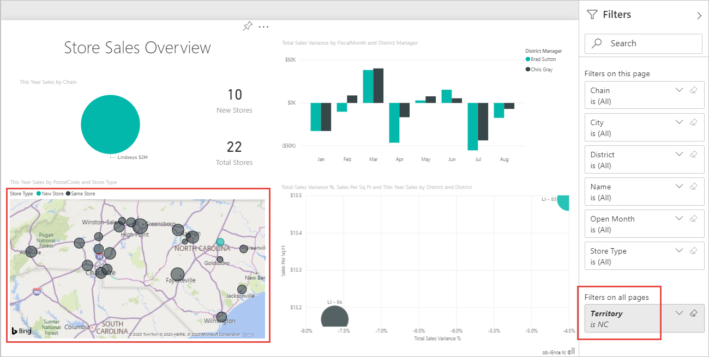
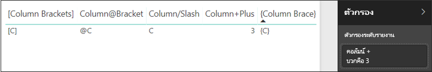

# <a name="filter-a-report-using-query-string-parameters-in-the-url"></a><span data-ttu-id="efdfa-103">กรองรายงานโดยใช้พารามิเตอร์สตริงของแบบสอบถามใน URL</span><span class="sxs-lookup"><span data-stu-id="efdfa-103">Filter a report using query string parameters in the URL</span></span>

<span data-ttu-id="efdfa-104">เมื่อคุณเปิดรายงานในบริการ Power BI แต่ละหน้าของรายงานมี URL ของตัวเองไม่ซ้ำกัน</span><span class="sxs-lookup"><span data-stu-id="efdfa-104">When you open a report in Power BI service, each page of the report has its own unique URL.</span></span> <span data-ttu-id="efdfa-105">เมื่อต้องกรองหน้ารายงานนั้น คุณสามารถใช้บานหน้าต่างตัวกรองบนพื้นที่รายงาน</span><span class="sxs-lookup"><span data-stu-id="efdfa-105">To filter that report page, you could use the Filters pane on the report canvas.</span></span>  <span data-ttu-id="efdfa-106">หรือคุณสามารถเพิ่มพารามิเตอร์สตริงของคิวรีไปยัง URL เพื่อกรองรายงานไว้ล่วงหน้า</span><span class="sxs-lookup"><span data-stu-id="efdfa-106">Or you could add query string parameters to the URL to pre-filter the report.</span></span> <span data-ttu-id="efdfa-107">บางครั้งคุณมีรายงานที่คุณต้องการแสดงให้แก่ผู้ร่วมงาน และคุณต้องการกรองไว้ล่วงหน้าสำหรับพวกเขา</span><span class="sxs-lookup"><span data-stu-id="efdfa-107">Perhaps you have a report you'd like to show colleagues and you want to pre-filter it for them.</span></span> <span data-ttu-id="efdfa-108">วิธีหนึ่งที่กรองได้ก็คือ การเริ่มต้นด้วย URL ที่เป็นค่าเริ่มต้นสำหรับรายงาน เพิ่มพารามิเตอร์ตัวกรองให้กับ URL และจากนั้น ส่ง URL ใหม่ทั้งหมดให้พวกเขาทางอีเมล</span><span class="sxs-lookup"><span data-stu-id="efdfa-108">One way to filter it is to start with the default URL for the report, add the filter parameters to the URL, and then email them the entire new URL.</span></span>

<span data-ttu-id="efdfa-109">บทความนี้ใช้รายงานตัวอย่างการวิเคราะห์การค้าปลีก</span><span class="sxs-lookup"><span data-stu-id="efdfa-109">This article uses the Retail Analysis Sample report.</span></span> <span data-ttu-id="efdfa-110">หากคุณต้องการติดตาม คุณสามารถ [ดาวน์โหลดรายงานตัวอย่าง](../create-reports/sample-retail-analysis.md#get-the-sample)</span><span class="sxs-lookup"><span data-stu-id="efdfa-110">If you want to follow along, you can [download the sample report](../create-reports/sample-retail-analysis.md#get-the-sample).</span></span>


## <a name="uses-for-query-string-parameters"></a><span data-ttu-id="efdfa-112">ใช้สำหรับพารามิเตอร์สตริงของคิวรี</span><span class="sxs-lookup"><span data-stu-id="efdfa-112">Uses for query string parameters</span></span>

<span data-ttu-id="efdfa-113">สมมติว่าคุณกำลังทำงานใน Power BI Desktop</span><span class="sxs-lookup"><span data-stu-id="efdfa-113">Say you're working in Power BI Desktop.</span></span> <span data-ttu-id="efdfa-114">และคุณต้องการสร้างรายงานที่มีลิงก์ไปยังรายงาน Power BI อื่น ๆ แต่คุณต้องการแสดงข้อมูลเพียงบางส่วนในรายงานอื่น ๆ</span><span class="sxs-lookup"><span data-stu-id="efdfa-114">You want to create a report that has links to other Power BI reports, but you want to show only some of the information in the other reports.</span></span> <span data-ttu-id="efdfa-115">ก่อนอื่น กรองรายงานโดยใช้พารามิเตอร์สตริงของคิวรี และบันทึก URL</span><span class="sxs-lookup"><span data-stu-id="efdfa-115">First, filter the reports using query string parameters and save the URLs.</span></span> <span data-ttu-id="efdfa-116">ถัดไป สร้างตารางใน Desktop โดยใช้ URL ของรายงานใหม่เหล่านี้</span><span class="sxs-lookup"><span data-stu-id="efdfa-116">Next, create a table in Desktop with these new report URLs.</span></span>  <span data-ttu-id="efdfa-117">จากนั้นเผยแพร่ และแชร์รายงาน</span><span class="sxs-lookup"><span data-stu-id="efdfa-117">Then publish and share the report.</span></span>

<span data-ttu-id="efdfa-118">สามารถใช้พารามิเตอร์สตริงของคิวรีในการสร้างโซลูชัน Power BI ขั้นสูงได้</span><span class="sxs-lookup"><span data-stu-id="efdfa-118">Another use for query string parameters is for someone creating an advanced Power BI solution.</span></span>  <span data-ttu-id="efdfa-119">ด้วยการใช้ DAX พวกเขาจะสร้างรายงานที่สร้าง URL ของรายงานที่กรองแล้วตามข้อมูลที่ลูกค้าของตนเองเลือกในรายงานปัจจุบัน</span><span class="sxs-lookup"><span data-stu-id="efdfa-119">Using DAX, they create a report that generates a filtered report URL dynamically based on the selection their customer makes in the current report.</span></span> <span data-ttu-id="efdfa-120">เมื่อลูกค้าเลือก URL พวกเขาเห็นเฉพาะข้อมูลที่กำหนดไว้</span><span class="sxs-lookup"><span data-stu-id="efdfa-120">When customers select the URL, they see only the intended information.</span></span> 

## <a name="query-string-parameter-syntax-for-filtering"></a><span data-ttu-id="efdfa-121">ไวยากรณ์พารามิเตอร์สตริงของแบบสอบถามสำหรับการกรอง</span><span class="sxs-lookup"><span data-stu-id="efdfa-121">Query string parameter syntax for filtering</span></span>

<span data-ttu-id="efdfa-122">ด้วยพารามิเตอร์ คุณสามารถกรองรายงานด้วยค่าอย่างน้อยหนึ่งค่าหรือมากกว่า แม้ว่าค่าเหล่านั้นประกอบด้วยเว้นวรรคหรืออักขระพิเศษ</span><span class="sxs-lookup"><span data-stu-id="efdfa-122">With parameters, you can filter the report for one or more values, even if those values contain spaces or special characters.</span></span> <span data-ttu-id="efdfa-123">ไวยากรณ์พื้นฐานจะค่อนข้างตรงไปตรงมา เริ่มต้นด้วย URL ของรายงาน เพิ่มเครื่องหมายคำถาม และจากนั้น เพิ่มไวยากรณ์ตัวกรองของคุณ</span><span class="sxs-lookup"><span data-stu-id="efdfa-123">The basic syntax is fairly straightforward; start with the report URL, add a question mark, and then add your filter syntax.</span></span>

<span data-ttu-id="efdfa-124">*URL*?filter=*Table*/*Field* eq '*value*'</span><span class="sxs-lookup"><span data-stu-id="efdfa-124">*URL*?filter=*Table*/*Field* eq '*value*'</span></span>


* <span data-ttu-id="efdfa-126">ชื่อ **ตาราง** และ **เขตข้อมูล** ต้องตรงตามตัวพิมพ์ใหญ่-เล็ก แต่ **ค่า** ไม่จำเป็น</span><span class="sxs-lookup"><span data-stu-id="efdfa-126">**Table** and **Field** names are case-sensitive, **value** isn't.</span></span>
* <span data-ttu-id="efdfa-127">ยังคงสามารถกรองข้อมูลของเขตข้อมูลที่ถูกซ่อนจากมุมมองรายงาน</span><span class="sxs-lookup"><span data-stu-id="efdfa-127">Fields that are hidden from report view can still be filtered.</span></span>

### <a name="field-types"></a><span data-ttu-id="efdfa-128">ชนิดเขตข้อมูล</span><span class="sxs-lookup"><span data-stu-id="efdfa-128">Field types</span></span>

<span data-ttu-id="efdfa-129">ชนิดเขตข้อมูลสามารถเป็นตัวเลข วันเวลาหรือสตริง และชนิดที่ใช้ต้องตรงกับชนิดที่กำหนดในชุดข้อมูล</span><span class="sxs-lookup"><span data-stu-id="efdfa-129">Field type can be a number, datetime, or string and the type used must match the type set in the dataset.</span></span>  <span data-ttu-id="efdfa-130">ตัวอย่างเช่น การระบุคอลัมน์ในตารางเป็นชนิด "สตริง" จะไม่ทำงานหากคุณกำลังค้นหาค่าที่เป็นวันที่เวลาหรือตัวเลขในคอลัมน์ชุดข้อมูลที่ตั้งค่าเป็นวันที่ เช่น ตาราง/StringColumn eq 1</span><span class="sxs-lookup"><span data-stu-id="efdfa-130">For example, specifying a table column of type "string" won't work if you're looking for a datetime or numeric value in a dataset column set as a date, such as Table/StringColumn eq 1.</span></span>

* <span data-ttu-id="efdfa-131">**สตริง** ต้องถูกล้อมรอบด้วยเครื่องหมายอัญประกาศเดี่ยวเหมือนใน 'ชื่อผู้จัดการ'</span><span class="sxs-lookup"><span data-stu-id="efdfa-131">**Strings** must be enclosed with single quotes, as in 'manager name'.</span></span>
* <span data-ttu-id="efdfa-132">**ตัวเลข** ไม่จำเป็นต้องมีการจัดรูปแบบพิเศษ</span><span class="sxs-lookup"><span data-stu-id="efdfa-132">**Numbers** require no special formatting.</span></span> <span data-ttu-id="efdfa-133">ดู[ชนิดข้อมูลตัวเลข](#numeric-data-types)ในบทความนี้สำหรับรายละเอียด</span><span class="sxs-lookup"><span data-stu-id="efdfa-133">See [Numeric data types](#numeric-data-types) in this article for details.</span></span>
* <span data-ttu-id="efdfa-134">**วันที่และเวลา** ดู [ชนิดข้อมูลวันที่](#date-data-types)ในบทความนี้</span><span class="sxs-lookup"><span data-stu-id="efdfa-134">**Dates and times** See [Date data types](#date-data-types) in this article.</span></span> 

<span data-ttu-id="efdfa-135">ถ้ายังคงสับสน ให้อ่านต่อไป เราจะอธิบายในรายละเอียด</span><span class="sxs-lookup"><span data-stu-id="efdfa-135">If it's still confusing, continue reading and we'll break it down.</span></span>  

## <a name="filter-on-a-field"></a><span data-ttu-id="efdfa-136">ตัวกรองบนเขตข้อมูล</span><span class="sxs-lookup"><span data-stu-id="efdfa-136">Filter on a field</span></span>

<span data-ttu-id="efdfa-137">สมมติว่า URL ในรายงานของเราเป็นดังนี้</span><span class="sxs-lookup"><span data-stu-id="efdfa-137">Let’s assume that the URL to our report is the following.</span></span>


<span data-ttu-id="efdfa-139">และเราเห็นในการแสดงแผนที่ของเราด้านบนว่าเรามีร้านค้าใน North Carolina</span><span class="sxs-lookup"><span data-stu-id="efdfa-139">And we see in our map visualization above that we have stores in North Carolina.</span></span> <span data-ttu-id="efdfa-140">*NC* คือค่าที่แสดงแทน North Carolina ในช่อง **Territory** ของตาราง **Store**</span><span class="sxs-lookup"><span data-stu-id="efdfa-140">*NC* is the value that represents North Carolina in the **Territory** field of the **Store** table.</span></span> <span data-ttu-id="efdfa-141">ดังนั้นในการกรองรายงานเพื่อแสดงข้อมูลเฉพาะร้านค้าใน "NC" เราจะต่อท้ายสตริงนี้เข้ากับ URL:</span><span class="sxs-lookup"><span data-stu-id="efdfa-141">So to filter the report to show data only for stores in "NC", we append this string to the URL:</span></span>

```
?filter=Store/Territory eq 'NC'
```


<span data-ttu-id="efdfa-143">ตอนนี้รายงานของเราได้รับการกรองสำหรับ North Carolina แล้ว การสร้างภาพข้อมูลทั้งหมดในรายงานจะแสดงข้อมูลเฉพาะ North Carolina</span><span class="sxs-lookup"><span data-stu-id="efdfa-143">Our report is now filtered for North Carolina; all the visualizations in the report show data for only North Carolina.</span></span>



## <a name="filter-on-more-than-one-value-in-a-field"></a><span data-ttu-id="efdfa-145">กรองมากกว่าหนึ่งค่าในเขตข้อมูลเดียว</span><span class="sxs-lookup"><span data-stu-id="efdfa-145">Filter on more than one value in a field</span></span>

<span data-ttu-id="efdfa-146">เมื่อต้องการกรองมากกว่าหนึ่งค่าในเขตข้อมูลเดียว คุณใช้ตัวดำเนินการ **ใน** แทนที่จะเป็นตัวดำเนินการ **และ**</span><span class="sxs-lookup"><span data-stu-id="efdfa-146">To filter on more than one value in a single field, you use the **in** operator instead of the **and** operator.</span></span> <span data-ttu-id="efdfa-147">ไวยากรณ์คือ:</span><span class="sxs-lookup"><span data-stu-id="efdfa-147">The syntax is:</span></span>

<span data-ttu-id="efdfa-148">*URL*?filter=*Table*/*Field* **in** ('*value1*', '*value2*')</span><span class="sxs-lookup"><span data-stu-id="efdfa-148">*URL*?filter=*Table*/*Field* **in** ('*value1*', '*value2*')</span></span>

<span data-ttu-id="efdfa-149">ใช้ตัวอย่างลักษณะเดียวกันเพื่อกรองรายงานสำหรับแสดงข้อมูลสำหรับร้านค้าใน "NC" (North Carolina) หรือ "TN" (Tennessee) เท่านั้น โดยให้เพิ่มข้อมูลต่อไปนี้ลงใน URL:</span><span class="sxs-lookup"><span data-stu-id="efdfa-149">Using the same example, to filter the report to show data only for stores in "NC" (North Carolina) or "TN" (Tennessee), append the URL with the following;</span></span>

```
?filter=Store/Territory in ('NC', 'TN')
```

<span data-ttu-id="efdfa-150">ดูตาราง [ตัวดำเนินการ](#operators) ในภายหลังในบทความสำหรับรายการของตัวดำเนินการอื่นๆที่มีประโยชน์</span><span class="sxs-lookup"><span data-stu-id="efdfa-150">See the [Operators](#operators) table later in the article for a list of other useful operators.</span></span>

## <a name="filter-on-multiple-fields"></a><span data-ttu-id="efdfa-151">ตัวกรองบนหลายเขตข้อมูล</span><span class="sxs-lookup"><span data-stu-id="efdfa-151">Filter on multiple fields</span></span>

<span data-ttu-id="efdfa-152">คุณยังสามารถกรองบนเขตข้อมูลหลายรายการได้โดยการเพิ่มพารามิเตอร์เพิ่มเติมไปยัง URL ของคุณ</span><span class="sxs-lookup"><span data-stu-id="efdfa-152">You can also filter on multiple fields by adding additional parameters to your URL.</span></span> <span data-ttu-id="efdfa-153">ลองย้อนกลับไปยังพารามิเตอร์ตัวกรองต้นฉบับของเรา</span><span class="sxs-lookup"><span data-stu-id="efdfa-153">Let's go back to our original filter parameter.</span></span>

```
?filter=Store/Territory eq 'NC'
```

<span data-ttu-id="efdfa-154">หากต้องการกรองบนเขตข้อมูลเพิ่มเติม ให้เพิ่ม '**and**' และเขตข้อมูลอีกเขตหนึ่งในรูปแบบเดียวกับด้านบน</span><span class="sxs-lookup"><span data-stu-id="efdfa-154">To filter on additional fields, add an '**and**' and another field in the same format as above.</span></span> <span data-ttu-id="efdfa-155">ต่อไปนี้เป็นตัวอย่างหนึ่ง:</span><span class="sxs-lookup"><span data-stu-id="efdfa-155">Here is an example.</span></span>

```
?filter=Store/Territory eq 'NC' and Store/Chain eq 'Fashions Direct'
```

## <a name="operators"></a><span data-ttu-id="efdfa-156">ตัวดำเนินการ</span><span class="sxs-lookup"><span data-stu-id="efdfa-156">Operators</span></span>

<span data-ttu-id="efdfa-157">Power BI รองรับตัวดำเนินการมากมายที่นอกเหนือจาก '**and**'</span><span class="sxs-lookup"><span data-stu-id="efdfa-157">Power BI supports many operators in addition to '**and**'.</span></span> <span data-ttu-id="efdfa-158">ตารางด้านล่างแสดงตัวดำเนินการเหล่านั้นพร้อมกับชนิดเนื้อหาที่สนับสนุน</span><span class="sxs-lookup"><span data-stu-id="efdfa-158">The table below lists those operators along with the content type they support.</span></span>

|<span data-ttu-id="efdfa-159">ตัวดำเนินการ</span><span class="sxs-lookup"><span data-stu-id="efdfa-159">operator</span></span>  | <span data-ttu-id="efdfa-160">ข้อกำหนด</span><span class="sxs-lookup"><span data-stu-id="efdfa-160">definition</span></span> | <span data-ttu-id="efdfa-161">สตริง</span><span class="sxs-lookup"><span data-stu-id="efdfa-161">string</span></span>  | <span data-ttu-id="efdfa-162">ตัวเลข</span><span class="sxs-lookup"><span data-stu-id="efdfa-162">number</span></span> | <span data-ttu-id="efdfa-163">วันที่</span><span class="sxs-lookup"><span data-stu-id="efdfa-163">Date</span></span> |  <span data-ttu-id="efdfa-164">ตัวอย่าง:</span><span class="sxs-lookup"><span data-stu-id="efdfa-164">Example</span></span>|
|---------|---------|---------|---------|---------|---------|
|<span data-ttu-id="efdfa-165">**and**</span><span class="sxs-lookup"><span data-stu-id="efdfa-165">**and**</span></span>     | <span data-ttu-id="efdfa-166">และ</span><span class="sxs-lookup"><span data-stu-id="efdfa-166">and</span></span> |  <span data-ttu-id="efdfa-167">ใช่</span><span class="sxs-lookup"><span data-stu-id="efdfa-167">yes</span></span>      | <span data-ttu-id="efdfa-168">ใช่</span><span class="sxs-lookup"><span data-stu-id="efdfa-168">yes</span></span> |  <span data-ttu-id="efdfa-169">ใช่</span><span class="sxs-lookup"><span data-stu-id="efdfa-169">yes</span></span>|  <span data-ttu-id="efdfa-170">ผลิตภัณฑ์/ราคา le 200 และราคา gt 3.5</span><span class="sxs-lookup"><span data-stu-id="efdfa-170">product/price le 200 and price gt 3.5</span></span> |
|<span data-ttu-id="efdfa-171">**eq**</span><span class="sxs-lookup"><span data-stu-id="efdfa-171">**eq**</span></span>     | <span data-ttu-id="efdfa-172">เท่ากับ</span><span class="sxs-lookup"><span data-stu-id="efdfa-172">equals</span></span> |  <span data-ttu-id="efdfa-173">ใช่</span><span class="sxs-lookup"><span data-stu-id="efdfa-173">yes</span></span>      | <span data-ttu-id="efdfa-174">ใช่</span><span class="sxs-lookup"><span data-stu-id="efdfa-174">yes</span></span>   |  <span data-ttu-id="efdfa-175">ใช่</span><span class="sxs-lookup"><span data-stu-id="efdfa-175">yes</span></span>       | <span data-ttu-id="efdfa-176">ที่อยู่/เมือง eq 'Redmond'</span><span class="sxs-lookup"><span data-stu-id="efdfa-176">Address/City eq 'Redmond'</span></span> |
|<span data-ttu-id="efdfa-177">**ne**</span><span class="sxs-lookup"><span data-stu-id="efdfa-177">**ne**</span></span>     | <span data-ttu-id="efdfa-178">ไม่เท่ากับ</span><span class="sxs-lookup"><span data-stu-id="efdfa-178">not equal</span></span> |   <span data-ttu-id="efdfa-179">ใช่</span><span class="sxs-lookup"><span data-stu-id="efdfa-179">yes</span></span>      | <span data-ttu-id="efdfa-180">ใช่</span><span class="sxs-lookup"><span data-stu-id="efdfa-180">yes</span></span>  | <span data-ttu-id="efdfa-181">ใช่</span><span class="sxs-lookup"><span data-stu-id="efdfa-181">yes</span></span>        |  <span data-ttu-id="efdfa-182">ที่อยู่/เมือง ne 'ลอนดอน'</span><span class="sxs-lookup"><span data-stu-id="efdfa-182">Address/City ne 'London'</span></span> |
|<span data-ttu-id="efdfa-183">**ge**</span><span class="sxs-lookup"><span data-stu-id="efdfa-183">**ge**</span></span>     |  <span data-ttu-id="efdfa-184">มากกว่าหรือเท่ากับ</span><span class="sxs-lookup"><span data-stu-id="efdfa-184">greater than or equal</span></span>       | <span data-ttu-id="efdfa-185">ไม่</span><span class="sxs-lookup"><span data-stu-id="efdfa-185">no</span></span> | <span data-ttu-id="efdfa-186">ใช่</span><span class="sxs-lookup"><span data-stu-id="efdfa-186">yes</span></span> |<span data-ttu-id="efdfa-187">ใช่</span><span class="sxs-lookup"><span data-stu-id="efdfa-187">yes</span></span> |  <span data-ttu-id="efdfa-188">ผลิตภัณฑ์/ราคา ge 10</span><span class="sxs-lookup"><span data-stu-id="efdfa-188">product/price ge 10</span></span>
|<span data-ttu-id="efdfa-189">**gt**</span><span class="sxs-lookup"><span data-stu-id="efdfa-189">**gt**</span></span>     | <span data-ttu-id="efdfa-190">มากกว่า</span><span class="sxs-lookup"><span data-stu-id="efdfa-190">greater than</span></span>        |<span data-ttu-id="efdfa-191">ไม่</span><span class="sxs-lookup"><span data-stu-id="efdfa-191">no</span></span> | <span data-ttu-id="efdfa-192">ใช่</span><span class="sxs-lookup"><span data-stu-id="efdfa-192">yes</span></span> | <span data-ttu-id="efdfa-193">ใช่</span><span class="sxs-lookup"><span data-stu-id="efdfa-193">yes</span></span>  | <span data-ttu-id="efdfa-194">ผลิตภัณฑ์/ราคา gt 20</span><span class="sxs-lookup"><span data-stu-id="efdfa-194">product/price gt 20</span></span>
|<span data-ttu-id="efdfa-195">**le**</span><span class="sxs-lookup"><span data-stu-id="efdfa-195">**le**</span></span>     |   <span data-ttu-id="efdfa-196">น้อยกว่าหรือเท่ากับ</span><span class="sxs-lookup"><span data-stu-id="efdfa-196">less than or equal</span></span>      | <span data-ttu-id="efdfa-197">ไม่</span><span class="sxs-lookup"><span data-stu-id="efdfa-197">no</span></span> | <span data-ttu-id="efdfa-198">ใช่</span><span class="sxs-lookup"><span data-stu-id="efdfa-198">yes</span></span> | <span data-ttu-id="efdfa-199">ใช่</span><span class="sxs-lookup"><span data-stu-id="efdfa-199">yes</span></span>  | <span data-ttu-id="efdfa-200">ผลิตภัณฑ์/ราคา le 100</span><span class="sxs-lookup"><span data-stu-id="efdfa-200">product/price le 100</span></span>
|<span data-ttu-id="efdfa-201">**lt**</span><span class="sxs-lookup"><span data-stu-id="efdfa-201">**lt**</span></span>     |  <span data-ttu-id="efdfa-202">น้อยกว่า</span><span class="sxs-lookup"><span data-stu-id="efdfa-202">less than</span></span>       | <span data-ttu-id="efdfa-203">ไม่</span><span class="sxs-lookup"><span data-stu-id="efdfa-203">no</span></span> | <span data-ttu-id="efdfa-204">ใช่</span><span class="sxs-lookup"><span data-stu-id="efdfa-204">yes</span></span> | <span data-ttu-id="efdfa-205">ใช่</span><span class="sxs-lookup"><span data-stu-id="efdfa-205">yes</span></span> |  <span data-ttu-id="efdfa-206">ผลิตภัณฑ์/ราคา lt 20</span><span class="sxs-lookup"><span data-stu-id="efdfa-206">product/price lt 20</span></span>
|<span data-ttu-id="efdfa-207">**ใน\*\***</span><span class="sxs-lookup"><span data-stu-id="efdfa-207">**in\*\***</span></span>     |  <span data-ttu-id="efdfa-208">รวมถึง</span><span class="sxs-lookup"><span data-stu-id="efdfa-208">including</span></span>       | <span data-ttu-id="efdfa-209">ใช่</span><span class="sxs-lookup"><span data-stu-id="efdfa-209">yes</span></span> | <span data-ttu-id="efdfa-210">ใช่</span><span class="sxs-lookup"><span data-stu-id="efdfa-210">yes</span></span> |  <span data-ttu-id="efdfa-211">ใช่</span><span class="sxs-lookup"><span data-stu-id="efdfa-211">yes</span></span> | <span data-ttu-id="efdfa-212">นักเรียน/อายุ in (27, 29)</span><span class="sxs-lookup"><span data-stu-id="efdfa-212">Student/Age in (27, 29)</span></span>


<span data-ttu-id="efdfa-213">\*\* เมื่อใช้ **ใน** ค่าทางด้านขวาของ **in** สามารถเป็นรายการที่คั่นด้วยจุลภาคที่ถูกล้อมรอบด้วยวงเล็บ หรือเป็นนิพจน์เดี่ยวที่ส่งค่ากลับเป็นคอลเลกชัน</span><span class="sxs-lookup"><span data-stu-id="efdfa-213">\*\* When using **in**, the values to the right of **in** can be a comma-separated list enclosed in parentheses, or a single expression that returns a collection.</span></span>

### <a name="numeric-data-types"></a><span data-ttu-id="efdfa-214">ชนิดข้อมูลตัวเลข</span><span class="sxs-lookup"><span data-stu-id="efdfa-214">Numeric data types</span></span>

<span data-ttu-id="efdfa-215">ตัวกรอง Power BI URL สามารถรวมตัวเลขในรูปแบบต่อไปนี้</span><span class="sxs-lookup"><span data-stu-id="efdfa-215">A Power BI URL filter can include numbers in the following formats.</span></span>

|<span data-ttu-id="efdfa-216">ชนิดตัวเลข</span><span class="sxs-lookup"><span data-stu-id="efdfa-216">Number type</span></span>  |<span data-ttu-id="efdfa-217">ตัวอย่าง:</span><span class="sxs-lookup"><span data-stu-id="efdfa-217">Example</span></span>  |
|---------|---------|
|<span data-ttu-id="efdfa-218">**จำนวนเต็ม**</span><span class="sxs-lookup"><span data-stu-id="efdfa-218">**integer**</span></span>     |   <span data-ttu-id="efdfa-219">5</span><span class="sxs-lookup"><span data-stu-id="efdfa-219">5</span></span>      |
|<span data-ttu-id="efdfa-220">**long**</span><span class="sxs-lookup"><span data-stu-id="efdfa-220">**long**</span></span>     |   <span data-ttu-id="efdfa-221">5 L หรือ 5 l</span><span class="sxs-lookup"><span data-stu-id="efdfa-221">5 L or 5 l</span></span>      |
|<span data-ttu-id="efdfa-222">**สองตัวเลข**</span><span class="sxs-lookup"><span data-stu-id="efdfa-222">**double**</span></span>     |   <span data-ttu-id="efdfa-223">5.5 หรือ 55e-1 หรือ 0.55e +1 หรือ 5D หรือ 5d หรือ 0.5e1D หรือ 0.5e1d หรือ 5.5D หรือ 5.5d หรือ 55e-1D หรือ 55e -1d</span><span class="sxs-lookup"><span data-stu-id="efdfa-223">5.5 or 55e-1 or 0.55e+1 or 5D or 5d or 0.5e1D or 0.5e1d or 5.5D or 5.5d or 55e-1D or 55e-1d</span></span>     |
|<span data-ttu-id="efdfa-224">**ทศนิยม**</span><span class="sxs-lookup"><span data-stu-id="efdfa-224">**decimal**</span></span>     |   <span data-ttu-id="efdfa-225">5 M หรือ 5 m หรือ 5.5 M หรือ 5.5 m</span><span class="sxs-lookup"><span data-stu-id="efdfa-225">5 M or 5 m or 5.5 M or 5.5 m</span></span>      |
|<span data-ttu-id="efdfa-226">**เลขหลังจุดทศนิยมไม่จำกัด**</span><span class="sxs-lookup"><span data-stu-id="efdfa-226">**float**</span></span>     | <span data-ttu-id="efdfa-227">5 F หรือ 5 f หรือ 0.5e1 F หรือ 0.5e-1 d</span><span class="sxs-lookup"><span data-stu-id="efdfa-227">5 F or 5 f or 0.5e1 F or 0.5e-1 d</span></span>        |

### <a name="date-data-types"></a><span data-ttu-id="efdfa-228">ชนิดข้อมูลวัน</span><span class="sxs-lookup"><span data-stu-id="efdfa-228">Date data types</span></span>

<span data-ttu-id="efdfa-229">Power BI สนับสนุน OData V3 และ V4 สำหรับชนิดข้อมูล **วัน** และ **DateTimeOffset**</span><span class="sxs-lookup"><span data-stu-id="efdfa-229">Power BI supports both OData V3 and V4 for **Date** and **DateTimeOffset** data types.</span></span> <span data-ttu-id="efdfa-230">สำหรับ OData V3 วันที่จะต้องถูกล้อมรอบด้วยเครื่องหมายอัญประกาศเดี่ยวและนำหน้าด้วยคำวันที่เวลา</span><span class="sxs-lookup"><span data-stu-id="efdfa-230">For OData V3, dates must be enclosed in single quotes and be preceded by the word datetime.</span></span> <span data-ttu-id="efdfa-231">เครื่องหมายอัญประกาศเดี่ยวและคำวันที่เวลาไม่จำเป็นสำหรับ OData V4</span><span class="sxs-lookup"><span data-stu-id="efdfa-231">Single quotes and the word datetime aren't needed in OData V4.</span></span> 
  
<span data-ttu-id="efdfa-232">วันที่จะถูกแสดงโดยใช้รูปแบบ EDM (2019-02-12T00:00:00): เมื่อคุณระบุวันที่ว่า 'YYYY-MM-DD' Power BI จะแปลออกมาว่า 'YYYY-MM-DDT00:00:00'</span><span class="sxs-lookup"><span data-stu-id="efdfa-232">Dates are represented using the EDM format (2019-02-12T00:00:00): When you specify a date as 'YYYY-MM-DD', Power BI interprets it as 'YYYY-MM-DDT00:00:00'.</span></span> <span data-ttu-id="efdfa-233">ให้แน่ใจว่าเดือนและวันเป็นสองหลัก MM และ DD</span><span class="sxs-lookup"><span data-stu-id="efdfa-233">Make sure month and day are two digits, MM and DD.</span></span>

<span data-ttu-id="efdfa-234">ทำไมความแตกต่างนี้จึงสำคัญ</span><span class="sxs-lookup"><span data-stu-id="efdfa-234">Why does this distinction matter?</span></span> <span data-ttu-id="efdfa-235">สมมติว่า คุณสร้างพารามิเตอร์สตริงของคิวรี **ตาราง/วัน gt ‘2018-08-03’**</span><span class="sxs-lookup"><span data-stu-id="efdfa-235">Let's say you create a query string parameter **Table/Date gt '2018-08-03'**.</span></span>  <span data-ttu-id="efdfa-236">ผลลัพธ์จะรวมวันที่ 3 สิงหาคม 2018 หรือเริ่มต้นด้วยวันที่ 4 สิงหาคม 2018 หรือไม่?</span><span class="sxs-lookup"><span data-stu-id="efdfa-236">Will the results include August 3, 2018 or start with August 4, 2018?</span></span> <span data-ttu-id="efdfa-237">Power BI แปลคิวรีของคุณเป็น **ตาราง/วันที่ gt '2018-08-03T00:00:00'**</span><span class="sxs-lookup"><span data-stu-id="efdfa-237">Power BI translates your query to **Table/Date gt '2018-08-03T00:00:00'**.</span></span> <span data-ttu-id="efdfa-238">ดังนั้น ผลลัพธ์ของคุณรวมวันที่ใดๆ ที่มีส่วนของเวลาที่ไม่เป็นศูนย์ เพราะวันที่เหล่านั้นจะมากกว่า **'2018-08-03T00:00:00'**</span><span class="sxs-lookup"><span data-stu-id="efdfa-238">So, your results include any dates that have a non-zero time part, because those dates would be greater than **'2018-08-03T00:00:00'**.</span></span>

<span data-ttu-id="efdfa-239">มีความแตกต่างกันอื่นๆ ระหว่าง  V3 และ  V4</span><span class="sxs-lookup"><span data-stu-id="efdfa-239">There are other differences between V3 and V4.</span></span> <span data-ttu-id="efdfa-240">OData V3 ไม่รองรับวันที่เวลาเท่านั้น</span><span class="sxs-lookup"><span data-stu-id="efdfa-240">OData V3 does not support Dates, only DateTime.</span></span> <span data-ttu-id="efdfa-241">ดังนั้นถ้าคุณใช้รูปแบบ V3 คุณจะต้องยืนยันคุณสมบัติตรงตามเต็มวันที่เวลา</span><span class="sxs-lookup"><span data-stu-id="efdfa-241">So if you use the V3 format, you must qualify it with the full date time.</span></span> <span data-ttu-id="efdfa-242">ตัวอักษรวันที่เช่น "วันที่เวลา ' 2019-20 '" ไม่ได้รับการรองรับในสัญกรณ์  V3</span><span class="sxs-lookup"><span data-stu-id="efdfa-242">Date literals like "datetime'2019-05-20'" aren't supported in V3 notation.</span></span> <span data-ttu-id="efdfa-243">แต่คุณสามารถเขียนเป็นเพียง "2019-05-20" ในสัญกรณ์  V4</span><span class="sxs-lookup"><span data-stu-id="efdfa-243">But you can just write it as "2019-05-20" in V4 notation.</span></span> <span data-ttu-id="efdfa-244">ต่อไปนี้คือคิวรีตัวกรองเทียบเท่าสองแบบใน  V3 และ  V4:</span><span class="sxs-lookup"><span data-stu-id="efdfa-244">Here are two equivalent filter queries in V3 and V4:</span></span>

- <span data-ttu-id="efdfa-245">รูปแบบ OData V4: ตัวกรอง = ตาราง/วันที่ gt 2019-05-20</span><span class="sxs-lookup"><span data-stu-id="efdfa-245">OData V4 format: filter=Table/Date gt 2019-05-20</span></span>
- <span data-ttu-id="efdfa-246">รูปแบบ OData V3: ตัวกรอง = ตาราง/วันที่ gt วันที่เวลา'2019-05-20T00:00:00'</span><span class="sxs-lookup"><span data-stu-id="efdfa-246">OData V3 format: filter=Table/Date gt datetime'2019-05-20T00:00:00'</span></span>


## <a name="special-characters-in-url-filters"></a><span data-ttu-id="efdfa-247">อักขระพิเศษในตัวกรอง URL</span><span class="sxs-lookup"><span data-stu-id="efdfa-247">Special characters in URL filters</span></span>

### <a name="special-characters-in-table-and-column-names"></a><span data-ttu-id="efdfa-248">อักขระพิเศษในชื่อตารางและคอลัมน์</span><span class="sxs-lookup"><span data-stu-id="efdfa-248">Special characters in table and column names</span></span>

<span data-ttu-id="efdfa-249">อักขระพิเศษและการเว้นวรรคในชื่อตารางและคอลัมน์จำเป็นต้องจัดรูปแบบบางอย่างเพิ่มเติม</span><span class="sxs-lookup"><span data-stu-id="efdfa-249">Special characters and spaces in table and column names require some additional formatting.</span></span> <span data-ttu-id="efdfa-250">เมื่อคิวรีของคุณประกอบด้วยช่องว่าง, เส้นประ หรืออักขระอื่น ๆ ที่ไม่ใช่ ASCII ให้ใส่คำหน้าอักขระพิเศษเหล่านั้นด้วย *escape code* ที่ขึ้นต้นด้วยขีดล่างและ X ( **_x**) แล้วใส่ **Unicode** 4 หลักตามด้วยขีดล่าง</span><span class="sxs-lookup"><span data-stu-id="efdfa-250">When your query contains spaces, dashes, or other non-ASCII characters, prefix those special characters with an *escape code* starting with an underscore and an X (**_x**), then the four-digit **Unicode**, then another underscore.</span></span> <span data-ttu-id="efdfa-251">หาก Unicode น้อยกว่าสี่อักขระ คุณจำเป็นต้องเติมศูนย์</span><span class="sxs-lookup"><span data-stu-id="efdfa-251">If the Unicode is fewer than four characters, you need to pad it with zeroes.</span></span> <span data-ttu-id="efdfa-252">นี่คือบางตัวอย่าง</span><span class="sxs-lookup"><span data-stu-id="efdfa-252">Here are some examples.</span></span>

|<span data-ttu-id="efdfa-253">ตัวระบุ</span><span class="sxs-lookup"><span data-stu-id="efdfa-253">Identifier</span></span>  |<span data-ttu-id="efdfa-254">Unicode</span><span class="sxs-lookup"><span data-stu-id="efdfa-254">Unicode</span></span>  | <span data-ttu-id="efdfa-255">การเขียนโคัดสำหรับ Power BI</span><span class="sxs-lookup"><span data-stu-id="efdfa-255">Coding for Power BI</span></span>  |
|---------|---------|---------|
|<span data-ttu-id="efdfa-256">**ชื่อตาราง**</span><span class="sxs-lookup"><span data-stu-id="efdfa-256">**Table Name**</span></span>     | <span data-ttu-id="efdfa-257">ช่องว่าง คือ 0x20</span><span class="sxs-lookup"><span data-stu-id="efdfa-257">Space is 0x20</span></span>        |  <span data-ttu-id="efdfa-258">Table_x0020_Name</span><span class="sxs-lookup"><span data-stu-id="efdfa-258">Table_x0020_Name</span></span>       |
|<span data-ttu-id="efdfa-259">**Column**@**Number**</span><span class="sxs-lookup"><span data-stu-id="efdfa-259">**Column**@**Number**</span></span>     |   <span data-ttu-id="efdfa-260">@ คือ 0x40</span><span class="sxs-lookup"><span data-stu-id="efdfa-260">@ is 0x40</span></span>     |  <span data-ttu-id="efdfa-261">Column_x0040_Number</span><span class="sxs-lookup"><span data-stu-id="efdfa-261">Column_x0040_Number</span></span>       |
|<span data-ttu-id="efdfa-262">**[Column]**</span><span class="sxs-lookup"><span data-stu-id="efdfa-262">**[Column]**</span></span>     |  <span data-ttu-id="efdfa-263">[ คือ 0x005B ] คือ 0x005D</span><span class="sxs-lookup"><span data-stu-id="efdfa-263">[ is 0x005B ] is 0x005D</span></span>       |  <span data-ttu-id="efdfa-264">_x005B_Column_x005D_</span><span class="sxs-lookup"><span data-stu-id="efdfa-264">_x005B_Column_x005D_</span></span>       |
|<span data-ttu-id="efdfa-265">**Column+Plus**</span><span class="sxs-lookup"><span data-stu-id="efdfa-265">**Column+Plus**</span></span>     | <span data-ttu-id="efdfa-266">+ คือ 0x2B</span><span class="sxs-lookup"><span data-stu-id="efdfa-266">+ is 0x2B</span></span>        |  <span data-ttu-id="efdfa-267">Column_x002B_Plus</span><span class="sxs-lookup"><span data-stu-id="efdfa-267">Column_x002B_Plus</span></span>       |

<span data-ttu-id="efdfa-268">Table_x0020_Name/Column_x002B_Plus eq 3 </span><span class="sxs-lookup"><span data-stu-id="efdfa-268">Table_x0020_Name/Column_x002B_Plus eq 3 </span></span>


<span data-ttu-id="efdfa-269">Table_x0020_Special/_x005B_Column_x0020_Brackets_x005D_ eq '[C]' </span><span class="sxs-lookup"><span data-stu-id="efdfa-269">Table_x0020_Special/_x005B_Column_x0020_Brackets_x005D_ eq '[C]' </span></span>

### <a name="special-characters-in-values"></a><span data-ttu-id="efdfa-270">อักขระพิเศษในค่าต่าง ๆ</span><span class="sxs-lookup"><span data-stu-id="efdfa-270">Special characters in values</span></span>

<span data-ttu-id="efdfa-271">ตัวกรอง URL สนับสนุนอักขระพิเศษทั้งหมดในค่าเขตข้อมูลต่าง ๆ ยกเว้นเครื่องหมายคำพูดเดี่ยว (')</span><span class="sxs-lookup"><span data-stu-id="efdfa-271">URL filters already support all special characters in field values, except the single quote (').</span></span> <span data-ttu-id="efdfa-272">ซึ่งเป็นอักขระเดียวที่คุณต้องการหลีกเลี่ยงการใช้งาน</span><span class="sxs-lookup"><span data-stu-id="efdfa-272">That's the only character you need to escape.</span></span> <span data-ttu-id="efdfa-273">เมื่อต้องการค้นหาอักขระเครื่องหมายคำพูดเดี่ยว ให้ใช้เครื่องหมายคำพูดสองอัน ('')</span><span class="sxs-lookup"><span data-stu-id="efdfa-273">To search for a single quote character, use two single quotes ('').</span></span> 

<span data-ttu-id="efdfa-274">ตัวอย่างเช่น:</span><span class="sxs-lookup"><span data-stu-id="efdfa-274">For example:</span></span>

- <span data-ttu-id="efdfa-275">`?filter=Table/Name eq 'O''Brien'` จะกลายเป็น:</span><span class="sxs-lookup"><span data-stu-id="efdfa-275">`?filter=Table/Name eq 'O''Brien'` becomes:</span></span> 

    :::image type="content" source="media/service-url-filters/power-bi-url-filter-obrien.png" alt-text="ชื่อ O'Brien":::

- <span data-ttu-id="efdfa-277">`?filter=Table/Name eq 'Lee''s Summit'` จะกลายเป็น:</span><span class="sxs-lookup"><span data-stu-id="efdfa-277">`?filter=Table/Name eq 'Lee''s Summit'` becomes:</span></span>

    :::image type="content" source="media/service-url-filters/power-bi-url-filter-lees.png" alt-text="Lee's Summit":::

- <span data-ttu-id="efdfa-279">`in`ตัวดำเนินการสนับสนุนการหลีกเลี่ยงการใช้งานนี้เช่นกัน: `?filter=Table/Name in ('Lee''s Summit', 'O''Brien')` จะกลายเป็น:</span><span class="sxs-lookup"><span data-stu-id="efdfa-279">The `in` operator supports this escaping as well: `?filter=Table/Name in ('Lee''s Summit', 'O''Brien')` becomes:</span></span>

    :::image type="content" source="media/service-url-filters/power-bi-url-filter-in.png" alt-text="Lee's Summit หรือ O'Brien":::

## <a name="use-dax-to-filter-on-multiple-values"></a><span data-ttu-id="efdfa-281">ใช้ DAX เพื่อกรองค่าหลายค่า</span><span class="sxs-lookup"><span data-stu-id="efdfa-281">Use DAX to filter on multiple values</span></span>

<span data-ttu-id="efdfa-282">อีกวิธีหนึ่งเพื่อกรองหลายเขตข้อมูลคือ การสร้างคอลัมน์จากการคำนวณที่รวมเขตข้อมูลสองเขตเป็นค่าเดียว</span><span class="sxs-lookup"><span data-stu-id="efdfa-282">Another way to filter on multiple fields is by creating a calculated column that concatenates two fields to a single value.</span></span> <span data-ttu-id="efdfa-283">จากนั้น คุณก็สามารถกรองค่านั้นได้</span><span class="sxs-lookup"><span data-stu-id="efdfa-283">Then you can filter on that value.</span></span>

<span data-ttu-id="efdfa-284">ตัวอย่างเช่น เรามีสองเขตข้อมูล: Territory และ Chain</span><span class="sxs-lookup"><span data-stu-id="efdfa-284">For example, we have two fields: Territory and Chain.</span></span> <span data-ttu-id="efdfa-285">ใน Power BI Desktop คุณสามารถ[สร้างคอลัมน์จากการคำนวณ](../transform-model/desktop-tutorial-create-calculated-columns.md) (เขตข้อมูล) ที่เรียกว่า TerritoryChain ได้</span><span class="sxs-lookup"><span data-stu-id="efdfa-285">In Power BI Desktop, [create a new Calculated column](../transform-model/desktop-tutorial-create-calculated-columns.md) (Field) called TerritoryChain.</span></span> <span data-ttu-id="efdfa-286">โปรดจำไว้ว่า ชื่อ **เขตข้อมูล** ต้องไม่มีช่องว่าง</span><span class="sxs-lookup"><span data-stu-id="efdfa-286">Remember that the **Field** name can't have any spaces.</span></span> <span data-ttu-id="efdfa-287">นี่คือสูตร DAX สำหรับคอลัมน์นั้น</span><span class="sxs-lookup"><span data-stu-id="efdfa-287">Here is the DAX formula for that column.</span></span>

<span data-ttu-id="efdfa-288">TerritoryChain = [Territory] & "-" & [Chain]</span><span class="sxs-lookup"><span data-stu-id="efdfa-288">TerritoryChain = [Territory] & " - " & [Chain]</span></span>

<span data-ttu-id="efdfa-289">เผยแพร่รายงานไปยังบริการ Power BI จากนั้นใช้สตริงแบบสอบถาม URL ในการกรองเพื่อแสดงข้อมูลสำหรับร้านค้า Lindseys ใน NC เท่านั้น</span><span class="sxs-lookup"><span data-stu-id="efdfa-289">Publish the report to Power BI service and then use the URL query string to filter to display data for only Lindseys stores in NC.</span></span>

```
https://app.powerbi.com/groups/me/reports/8d6e300b-696f-498e-b611-41ae03366851/ReportSection3?filter=Store/TerritoryChain eq 'NC – Lindseys'
```

## <a name="pin-a-tile-from-a-filtered-report"></a><span data-ttu-id="efdfa-290">ปักหมุดไทล์จากรายงานที่กรองแล้ว</span><span class="sxs-lookup"><span data-stu-id="efdfa-290">Pin a tile from a filtered report</span></span>

<span data-ttu-id="efdfa-291">เมื่อคุณได้กรองรายงานโดยใช้พารามิเตอร์สตริงของแบบสอบถาม คุณสามารถปักหมุดการจัดรูปแบบการแสดงข้อมูลจากรายงานไปยังแดชบอร์ดของคุณได้</span><span class="sxs-lookup"><span data-stu-id="efdfa-291">Once you've filtered the report using query string parameters, you can pin visualizations from that report to your dashboard.</span></span>  <span data-ttu-id="efdfa-292">ไทล์บนแดชบอร์ดแสดงข้อมูลกรองแล้ว และการเลือกไทล์แดชบอร์ดจะเปิดรายงานที่ใช้เพื่อสร้างไทล์แดชบอร์ดนั้น</span><span class="sxs-lookup"><span data-stu-id="efdfa-292">The tile on the dashboard displays the filtered data and selecting that dashboard tile opens the report that was used to create it.</span></span>  <span data-ttu-id="efdfa-293">อย่างไรก็ตาม การกรองที่คุณใช้ URL จะไม่ถูกบันทึกกับรายงาน</span><span class="sxs-lookup"><span data-stu-id="efdfa-293">However, the filtering you did using the URL isn't saved with the report.</span></span> <span data-ttu-id="efdfa-294">เมื่อคุณเลือกไทล์แดชบอร์ด รายงานจะเปิดขึ้นในสถานะที่ไม่ถูกกรอง</span><span class="sxs-lookup"><span data-stu-id="efdfa-294">When you select the dashboard tile, the report opens in its unfiltered state.</span></span>  <span data-ttu-id="efdfa-295">ดังนั้น ข้อมูลที่แสดงในไทล์แดชบอร์ดจะไม่ตรงกับข้อมูลที่แสดงในการแสดงภาพของรายงาน</span><span class="sxs-lookup"><span data-stu-id="efdfa-295">Thus, the data displayed in the dashboard tile doesn't match the data displayed in the report visualization.</span></span>

<span data-ttu-id="efdfa-296">ข้อแตกต่างนี้จะมีประโยชน์เมื่อคุณต้องการดูผลลัพธ์ที่แตกต่าง กล่าวคือ ผลลัพธ์ที่ถูกกรองบนแดชบอร์ด และผลลัพธ์ที่ยังไม่ได้กรองในรายงาน</span><span class="sxs-lookup"><span data-stu-id="efdfa-296">This discrepancy is helpful when you want to see different results; filtered on the dashboard and unfiltered in the report.</span></span>

## <a name="considerations-and-troubleshooting"></a><span data-ttu-id="efdfa-297">ข้อควรพิจารณาและการแก้ไขปัญหา</span><span class="sxs-lookup"><span data-stu-id="efdfa-297">Considerations and troubleshooting</span></span>

<span data-ttu-id="efdfa-298">มีบางสิ่งที่ควรระวังเมื่อใช้พารามิเตอร์สตริงของแบบสอบถาม</span><span class="sxs-lookup"><span data-stu-id="efdfa-298">There are a couple of things to be aware of when using the query string parameters.</span></span>

* <span data-ttu-id="efdfa-299">เมื่อใช้ตัวดำเนินการ *in* ค่าทางด้านขวาของ *in* ต้องเป็นรายการที่คั่นด้วยจุลภาคที่อยู่ในวงเล็บ</span><span class="sxs-lookup"><span data-stu-id="efdfa-299">When using the *in* operator, the values to the right of *in* must be a comma-separated list enclosed in parentheses.</span></span>    
* <span data-ttu-id="efdfa-300">เซิร์ฟเวอร์รายงาน Power BI ยังรองรับความสามารถในการระบุตัวกรองเพิ่มเติมโดยใช้พารามิเตอร์ URL "ตัวกรอง"</span><span class="sxs-lookup"><span data-stu-id="efdfa-300">Power BI Report Server also supports the ability to specify additional filters using the “filter” URL parameter.</span></span> <span data-ttu-id="efdfa-301">นี่คือตัวอย่างของ URL ที่แสดงในเซิร์ฟเวอร์รายงาน Power BI: `https://reportserver/reports/powerbi/Store Sales?rs:Embed=true&filter= Store/Territory eq 'NC' and Store/Chain eq 'Fashions Direct'`</span><span class="sxs-lookup"><span data-stu-id="efdfa-301">Here's an example of what the URL might look like in Power BI Report Server: `https://reportserver/reports/powerbi/Store Sales?rs:Embed=true&filter= Store/Territory eq 'NC' and Store/Chain eq 'Fashions Direct'`</span></span>
* <span data-ttu-id="efdfa-302">ตัวกรองรายงาน URL จำกัดที่ 10 นิพจน์ (AND เชื่อมต่อ 10 ตัวกรอง)</span><span class="sxs-lookup"><span data-stu-id="efdfa-302">Report URL filters have a 10-expression limit (10 filters connected by AND).</span></span>
* <span data-ttu-id="efdfa-303">ชนิดข้อมูล long คือ (2^53-1) เนื่องจากข้อจำกัดของ JavaScript</span><span class="sxs-lookup"><span data-stu-id="efdfa-303">The long data type is (2^53-1) due to JavaScript limitations.</span></span>
* <span data-ttu-id="efdfa-304">Power BI ไม่จำกัดจำนวนอักขระในสตริงคิวรี URL</span><span class="sxs-lookup"><span data-stu-id="efdfa-304">Power BI doesn't limit the number of characters in URL query strings.</span></span> <span data-ttu-id="efdfa-305">เบราว์เซอร์ที่แตกต่างกันมีข้อจำกัดความยาวที่แตกต่างกัน</span><span class="sxs-lookup"><span data-stu-id="efdfa-305">Different browsers have different length restrictions.</span></span>

<span data-ttu-id="efdfa-306">รองรับตัวกรอง URL ในสถานการณ์การฝังบางอย่างและไม่ได้อยู่ในสถานการณ์</span><span class="sxs-lookup"><span data-stu-id="efdfa-306">URL filters are supported in some embedding scenarios and not in others.</span></span>

- <span data-ttu-id="efdfa-307">[รองรับการฝังรายงานในพอร์ทัลความปลอดภัยหรือเว็บไซต์](service-embed-secure.md)</span><span class="sxs-lookup"><span data-stu-id="efdfa-307">[Embedding a report in a secure portal or website](service-embed-secure.md) is supported.</span></span>
- <span data-ttu-id="efdfa-308">รองรับตัวกรอง URL ใน Power BI Embedded</span><span class="sxs-lookup"><span data-stu-id="efdfa-308">URL filters are supported in Power BI Embedded.</span></span> <span data-ttu-id="efdfa-309">ดู [ขีดความสามารถในการกรอง URL ขั้นสูงของ Power BI Embedded](https://azure.microsoft.com/updates/power-bi-embedded-advanced-url-filtering-capabilities) สำหรับรายละเอียด</span><span class="sxs-lookup"><span data-stu-id="efdfa-309">See [Power BI Embedded advanced URL filtering capabilities](https://azure.microsoft.com/updates/power-bi-embedded-advanced-url-filtering-capabilities) for details.</span></span>
- <span data-ttu-id="efdfa-310">การกรองสตริงคิวรีไม่สามารถใช้ได้กับ [เผยแพร่บนเว็บ](service-publish-to-web.md)หรือ [ส่งออกเป็น PDF](../consumer/end-user-pdf.md)</span><span class="sxs-lookup"><span data-stu-id="efdfa-310">Query string filtering doesn't work with [Publish to web](service-publish-to-web.md) or [Export to PDF](../consumer/end-user-pdf.md).</span></span>
- <span data-ttu-id="efdfa-311">[ฝังด้วยส่วนเว็บรายงานใน SharePoint Online](service-embed-report-spo.md) จะไม่รองรับตัวกรอง URL</span><span class="sxs-lookup"><span data-stu-id="efdfa-311">[Embed with report web part in SharePoint Online](service-embed-report-spo.md) doesn't support URL filters.</span></span>
- <span data-ttu-id="efdfa-312">Teams ไม่อนุญาตให้ระบุ URL</span><span class="sxs-lookup"><span data-stu-id="efdfa-312">Teams doesn't allow specifying a URL.</span></span>

## <a name="next-steps"></a><span data-ttu-id="efdfa-313">ขั้นตอนถัดไป</span><span class="sxs-lookup"><span data-stu-id="efdfa-313">Next steps</span></span>

[<span data-ttu-id="efdfa-314">ปักหมุดการแสดงภาพไปยังแดชบอร์ด</span><span class="sxs-lookup"><span data-stu-id="efdfa-314">Pin a visualization to a dashboard</span></span>](../create-reports/service-dashboard-pin-tile-from-report.md)  
[<span data-ttu-id="efdfa-315">ลงทะเบียนเพื่อขอรับรุ่นทดลองใช้ฟรี</span><span class="sxs-lookup"><span data-stu-id="efdfa-315">Sign up for a free trial</span></span>](https://powerbi.microsoft.com/get-started/)

<span data-ttu-id="efdfa-316">มีคำถามเพิ่มเติมหรือไม่</span><span class="sxs-lookup"><span data-stu-id="efdfa-316">More questions?</span></span> [<span data-ttu-id="efdfa-317">ลองถามชุมชน Power BI</span><span class="sxs-lookup"><span data-stu-id="efdfa-317">Try asking the Power BI Community</span></span>](https://community.powerbi.com/)


