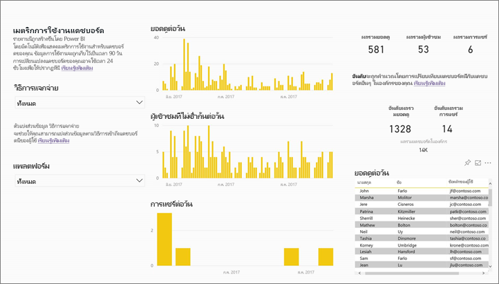
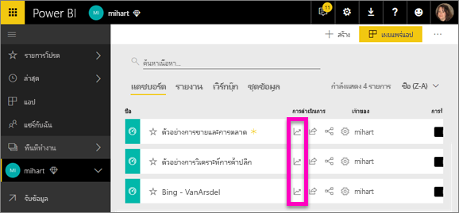
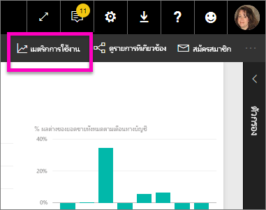
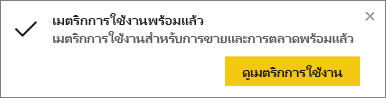
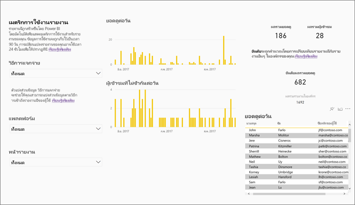
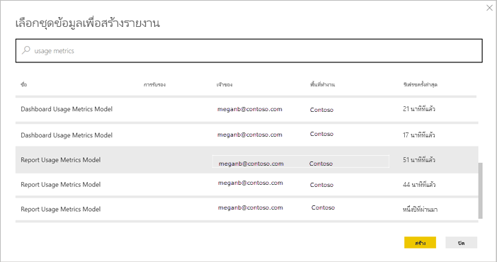
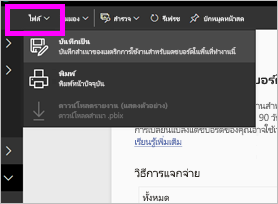
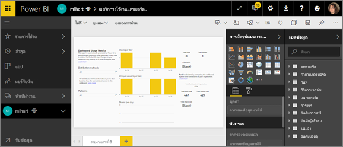
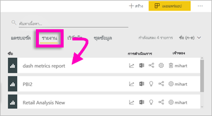
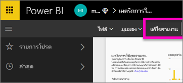

# ตรวจสอบเมตริกการใช้งานในพื้นที่ทำงานแบบคลาสสิกMonitor usage metrics in classic workspaces

เมตริกการใช้งานช่วยให้คุณเข้าใจเกี่ยวกับผลกระทบของแดชบอร์ดและรายงานของคุณUsage metrics help you understand the impact of your dashboards and reports. เมื่อคุณเรียกใช้เมตริกการใช้งานแดชบอร์ดหรือเมตริกการใช้งานรายงาน คุณพบว่ามีการใช้แดชบอร์ดและรายงานเหล่านั้นทั่วทั้งองค์กรของคุณอย่างไร ใครบ้างที่ใช้ และเพื่อวัตถุประสงค์ใดWhen you run either dashboard usage metrics or report usage metrics, you discover how those dashboards and reports are being used throughout your organization, who's using them, and for what purpose. บทความนี้สรุปรายงานเมตริกการใช้งานสำหรับ[พื้นที่ทำงานแบบคลาสสิก](service-create-workspaces.md)This article outlines usage metrics reports for [classic workspaces](service-create-workspaces.md). หากรายงานของคุณอยู่ในพื้นที่ทํางานใหม่ ให้ดูบทความ [ตรวจสอบเมตริกการใช้งานในประสบการณ์ใช้งานพื้นที่ทํางานใหม่](service-modern-usage-metrics.md)If your reports are in on of the new workspaces, see the article [Monitor usage metrics in the new workspace experience](service-modern-usage-metrics.md)  

รายงานเมตริกการใช้งานเป็นแบบอ่านอย่างเดียวUsage metrics reports are read-only. อย่างไรก็ตาม คุณสามารถคัดลอกรายงานเมตริกการใช้งานHowever, you can copy a usage metrics report. การคัดลอกสร้างรายงาน Power BI มาตรฐานที่คุณสามารถแก้ไขCopying creates a standard Power BI report that you can edit. นอกจากนี้ คุณยังสามารถสร้างรายงานของคุณเองใน Power BI Desktop ที่ยึดตามชุดข้อมูลพื้นฐาน ซึ่งประกอบด้วยเมตริกการใช้งานสำหรับแดชบอร์ดทั้งหมดหรือรายงานทั้งหมดในพื้นที่ทำงานYou can also build your own reports in Power BI Desktop based on the underlying dataset, which contains usage metrics for all dashboards or all reports in a workspace. ในการเริ่มต้น รายงานที่คัดลอกจะแสดงเมตริกเฉพาะสำหรับแดชบอร์ดหรือรายงานที่เลือกเท่านั้นTo begin with, the copied report shows metrics just for the selected dashboard or report. คุณสามารถลบตัวกรองเริ่มต้นและมีสิทธิเข้าถึงชุดข้อมูลพื้นฐานพร้อมกับเมตริกการใช้งานทั้งหมดของพื้นที่ทำงานที่เลือกYou can remove the default filter and have access to the underlying dataset, with all the usage metrics of the selected workspace. คุณอาจเห็นชื่อของผู้ใช้ที่ระบุ ถ้าผู้ดูแลระบบของคุณได้รับอนุญาตYou may even see the names of specific users, if your admin has allowed that.

> [!NOTE]
> เมตริกการใช้งานติดตามการใช้งานของรายงานที่ฝังอยู่ใน SharePoint OnlineUsage metrics track usage of reports that are embedded in SharePoint Online. อย่างไรก็ตาม เมตริกการใช้งานจะไม่ติดตามแดชบอร์ดและรายงานที่ฝังผ่านกระแส "ผู้ใช้ที่เป็นเจ้าของข้อมูลประจำตัว" หรือ "แอปที่เป็นเจ้าของข้อมูลประจำตัว"However, usage metrics don't track dashboards and reports embedded via the “user owns credentials” or “app owns credentials” flow. นอกจากนี้ เมตริกการใช้งานยังจะไม่ติดตามการใช้งานของรายงานที่ฝังผ่าน[เผยแพร่ไปยังเว็บ](service-publish-to-web.md)Usage metrics also don't track usage of reports embedded via [publish to web](service-publish-to-web.md).

## ทำไมเมตริกการใช้งานจึงมีความสำคัญWhy usage metrics are important

การทราบว่ามีการใช้เนื้อหาของคุณอย่างไรช่วยคุณในการแสดงผลกระทบและจัดลำดับความสำคัญความพยายามของคุณKnowing how your content is being used helps you demonstrate your impact and prioritize your efforts. เมตริกการใช้งานของคุณอาจแสดงว่าหนึ่งในรายงานของคุณมีการใช้เป็นประจำทุกวันโดยส่วนใหญ่ขององค์กร และอาจแสดงว่าไม่มีการดูแดชบอร์ดที่คุณสร้างขึ้นเลยก็เป็นได้Your usage metrics may show that one of your reports is used daily by a huge segment of the organization and it may show that a dashboard you created isn't being viewed at all. คำติชมประเภทนี้มีประโยชน์มากสำหรับเป็นแนวทางในการทำงานของคุณThis type of feedback is invaluable in guiding your work efforts.

คุณสามารถเรียกใช้รายงานเมตริกการใช้งานในบริการของ Power BI เท่านั้นYou can only run usage metrics reports in the Power BI service. อย่างไรก็ตาม หากคุณบันทึกการใช้เมตริกรายงานหรือปักหมุดไปยังแดชบอร์ด คุณสามารถเปิดและโต้ตอบกับรายงานนั้นบนอุปกรณ์เคลื่อนที่ได้However, if you save a usage metrics report or pin it to a dashboard, you can open and interact with that report on mobile devices.

## ข้อกำหนดเบื้องต้นPrerequisites

- คุณต้องมีสิทธิการใช้งาน Power BI Pro เพื่อเรียกใช้และเข้าถึงข้อมูลเมตริกการใช้งานYou need a Power BI Pro license to run and access the usage metrics data. อย่างไรก็ตาม คุณลักษณะเมตริกการใช้งานรวบรวมข้อมูลการใช้งานจากผู้ใช้ทั้งหมด ไม่ว่าผู้ใช้งานนั้นมีสิทธิการใช้งานเป็นแบบใดHowever, the usage metrics feature captures usage information from all users, regardless of the license they're assigned.
- เมื่อต้องการเข้าถึงเมตริกการใช้งานสำหรับแดชบอร์ดเฉพาะหรือรายงาน คุณต้องมีสิทธิการเข้าถึงการแก้ไขในแดชบอร์ดหรือรายงานนั้นTo access usage metrics for a particular dashboard or report, you must have edit access to that dashboard or report.
- ผู้ดูแลระบบ Power BI ของคุณจะต้องมีเมตริกการใช้งานที่เปิดใช้งานสำหรับผู้สร้างเนื้อหาYour Power BI admin has to have enabled usage metrics for content creators. ผู้ดูแลระบบ Power BI ของคุณยังอาจเก็บรวบรวมข้อมูลต่อผู้ใช้ในเมตริกการใช้งานYou Power BI admin may have also enabled collecting per-user data in usage metrics. อ่านเกี่ยวกับวิธีการ[เปิดใช้งานตัวเลือกเหล่านี้ในพอร์ทัลผู้ดูแลระบบ](../admin/service-admin-portal.md#control-usage-metrics)Read about how to [enable these options in the admin portal](../admin/service-admin-portal.md#control-usage-metrics). 

## ดูรายงานเมตริกการใช้งานView a Usage Metrics report

1. เริ่มต้นในพื้นที่ทำงานที่ประกอบด้วยแดชบอร์ดหรือรายงานStart in the workspace that contains the dashboard or report.
2. จากรายการเนื้อหาพื้นที่ทำงานหรือจากแดชบอร์ดหรือตัวรายงานเองรายการใดรายการหนึ่ง ให้เลือกไอคอนสำหรับ **เมตริกการใช้งาน**  From either the workspace content list or from the dashboard or report itself, select the icon for **Usage metrics**  .

    

    
3. ในครั้งแรกที่คุณทำเช่นนี้ Power BI จะสร้างรายงานเมตริกการใช้งานและแจ้งให้คุณทราบเมื่อพร้อมThe first time you do this, Power BI creates the usage metrics report and lets you know when it's ready.

    
4. เมื่อต้องการดูผลลัพธ์ เลือก **ดูเมตริกการใช้งาน**To see the results, select **View usage metrics**.

    เมตริกการใช้งานเป็นการรวมกันที่ทรงพลังขณะที่คุณใช้และคงแดชบอร์ด Power BI และรายงานไว้Usage metrics are a powerful ally as you work to deploy and maintain Power BI dashboards and reports. สงสัยหรือไม่ว่าหน้าใดของรายงานของคุณมีประโยชน์สูงสุด และหน้าใดคุณควรนำออกไป?Wondering which pages of your report are most useful, and which ones you should phase out? การแบ่งส่วนแยกตาม **หน้ารายงาน** เพื่อหาคำตอบ สงสัยหรือไม่ว่าคุณควรสร้างเค้าโครงอุปกรณ์มือถือสำหรับแดชบอร์ดของคุณหรือไม่?Slice by **Report page** to find out. Wondering if you should build a mobile layout for your dashboard? การแบ่งส่วน **แพลตฟอร์ม** เพื่อดูจำนวนผู้ใช้ที่เข้าถึงเนื้อหาของคุณผ่านทางแอปฯมือถือเทียบกับการเข้าถึงผ่านทางเว็บเบราว์เซอร์Slice by **Platforms** to discover how many users are accessing your content via the mobile apps vs. via web browser.

5. อีกทางหนึ่งคือ เลื่อนไปเหนือภาพแล้วเลือกไอคอนหมุดเพื่อเพิ่มการแสดงภาพไปยังแดชบอร์ดOptionally, hover over a visualization and select the pin icon to add the visualization to a dashboard. หรือจากแถบเมนูด้านบน เลือก **หน้า Pin Live** เพื่อเพิ่มทั้งหน้าไปยังแดชบอร์ดหนึ่งOr, from the top menu bar, select **Pin Live Page** to add the entire page to a dashboard. จากแดชบอร์ด คุณสามารถตรวจสอบเมตริกการใช้งานได้ง่ายขึ้นหรือแชร์เมตริกการใช้งานกับผู้อื่นได้From the dashboard, you can monitor the usage metrics more easily or share them with others.

    > [!NOTE]
    > ถ้าคุณปักหมุดไทล์จากรายงานเมตริกการใช้งานไปยังแดชบอร์ด จะไม่สามารถเพิ่มแดชบอร์ดลงในแอปได้If you pin a tile from a usage metrics report to a dashboard, you can't add that dashboard to an app.

### รายงานเมตริกการใช้งานแดชบอร์ดDashboard Usage Metrics report

### รายงานเมตริกการใช้งานแดชบอร์ดReport Usage Metrics report

## เกีึ่ยวกับรายงานเมตริกการใช้งานAbout the Usage Metrics report

เมื่อคุณเลือก **เมตริกการใช้งาน** หรือไอคอน ถัดจากแดชบอร์ดหรือรายงาน Power BI จะสร้างรายงานที่สร้างไว้ล่วงหน้าด้วยเมตริกการใช้งานสำหรับเนื้อหานั้นของ 90 วันที่ผ่านมาWhen you select **Usage metrics** or the icon  next to a dashboard or report, Power BI generates a pre-built report with usage metrics for that content for the last 90 days.  รายงานมีลักษณะคล้ายกับรายงาน Power BI ที่คุณคุ้นเคยอยู่แล้วThe report looks similar to the Power BI reports you're already familiar with. คุณสามารถแบ่งส่วนข้อมูลได้โดยยึดตามวิธีการที่ผู้ใช้ของคุณได้รับสิทธิ์การเข้าถึง ไม่ว่าพวกเขาเข้าถึงผ่านทางเว็บหรือแอปมือถือ หรืออื่น ๆYou can slice based on how your end users received access, whether they accessed via the web or mobile app, and so on. ขณะที่แดชบอร์ดและรายงานของคุณพัฒนาขึ้น รายงานเมตริกการใช้งานจะพัฒนาขึ้นด้วย ซึ่งจะอัปเดตด้วยข้อมูลใหม่ทุกวันAs your dashboards and reports evolve, so too will the usage metrics report, which updates every day with new data.  

รายงานเมตริกการใช้งานจะไม่แสดงขึ้นใน **ล่าสุด** **พื้นที่ทำงาน** **รายการโปรด** หรือรายการเนื้อหาอื่นUsage metrics reports don't show up in **Recent**, **Workspaces**, **Favorites**, or other content lists. ไม่สามารถเพิ่มรายงานเมตริกการใช้งานลงในแอปได้They can't be added to an app. ถ้าคุณปักหมุดไทล์จากรายงานเมตริกการใช้งานไปยังแดชบอร์ด จะไม่สามารถเพิ่มแดชบอร์ดลงในแอปได้If you pin a tile from a usage metrics report to a dashboard, you can't add that dashboard to an app.

หากต้องการเจาะลึกข้อมูลรายงาน หรือหากต้องการสร้างรายงานของคุณเองกับชุดข้อมูลพื้นฐาน คุณมีสองตัวเลือก:To dig into the report data, or to build your own reports against the underlying dataset, you have two options: 

- สร้างรายงานนี้ในบริการของ Power BIMake a copy of the report in the Power BI service. ดู[บันทึกสำเนาของรายงานเมตริกการใช้งาน](#save-a-copy-of-the-usage-metrics-report)ภายหลังในบทความนี้สำหรับรายละเอียดSee [Save a copy of the Usage Metrics report](#save-a-copy-of-the-usage-metrics-report) later in this article for details.
- เชื่อมต่อกับชุดข้อมูลจาก Power BI DesktopConnect to the dataset from Power BI Desktop. สำหรับทุกพื้นที่ทำงาน ชุดข้อมูลมีชื่อ "แบบจำลองเมตริกการใช้งานรายงาน"For every workspace, the dataset has the name "Report Usage Metrics Model." ดู[สร้างการเชื่อมต่อไปยังชุดข้อมูลที่เผยแพร่](../connect-data/desktop-report-lifecycle-datasets.md#establish-a-power-bi-service-live-connection-to-the-published-dataset)สำหรับรายละเอียดSee [Establish a connection to a published dataset](../connect-data/desktop-report-lifecycle-datasets.md#establish-a-power-bi-service-live-connection-to-the-published-dataset) for details.

    

## มีการรายงานเมตริกใด?Which metrics are reported?

| เมตริกMetric | แดชบอร์ดDashboard | รายงานReport | คำอธิบายDescription |
| --- | --- | --- | --- |
| ตัวแบ่งส่วนข้อมูลวิธีการแจกจ่ายDistribution method slicer |ใช่yes |ใช่yes |วิธีการที่ผู้ใช้เข้าถึงเนื้อหาHow users got access to the content. มี 3 วิธีด้วยกัน: ผู้ใช้สามารถเข้าถึงแดชบอร์ดหรือรายงานโดยการเป็นสมาชิกของ[พื้นที่ทำงาน](../consumer/end-user-experience.md) โดยการแชร์เนื้อหา[กับสมาชิก ](service-share-dashboards.md)หรือโดยการติดตั้งชุดเนื้อหา/แอปThere are 3 possible methods: users can access the dashboard or report by being members of a [workspace](../consumer/end-user-experience.md), by having the content [shared with them](service-share-dashboards.md), or by installing a content pack/app.  โปรดทราบว่ามุมมองผ่านแอปฯจะนับเป็น "ชุดเนื้อหา"Note that views through an app are counted as "content pack." |
| ตัวแบ่งส่วนข้อมูลแพลตฟอร์มPlatforms slicer |ใช่yes |ใช่yes |มีการเข้าถึงแดชบอร์ดหรือรายงานผ่านทางบริการ Power BI (powerbi.com) หรืออุปกรณ์เคลื่อนที่หรือไม่?Was the dashboard or report accessed via the Power BI service (powerbi.com) or a mobile device? อุปกรณ์เคลื่อนที่รวมแอปฯ iOS, Android และ Windows ทั้งหมดของเราMobile includes all our iOS, Android, and Windows apps. |
| ตัวแบ่งส่วนข้อมูลหน้ารายงานReport page slicer |ไม่no |ใช่yes |ถ้ารายงานมีมากกว่า 1 หน้า แบ่งส่วนรายงานแยกตามหน้าที่มีการดูIf the report has more than 1 page, slice the report by the page(s) that was viewed. "Blank" หมายความว่ามีการเพิ่มหน้ารายงานเมื่อเร็ว ๆ นี้ (ชื่อที่แท้จริงของหน้าใหม่จะปรากฏในรายการตัวแบ่งส่วนข้อมูลภายใน 24 ชั่วโมง) หรือมีการลบหน้ารายงานออกแล้ว"Blank" means a report page was recently added (within 24 hours the actual name of the new page appears in the slicer list) or report pages have been deleted. "Blank" จับประเภทของสถานการณ์เหล่านี้"Blank" captures these types of situations. |
| ยอดดูต่อวันViews per day |ใช่yes |ใช่yes |จำนวนรวมของมุมมองแต่ละวัน - มุมมองหมายถึงหน้ารายงานหรือแดชบอร์ดที่ผู้ใช้ทำการโหลดTotal number of views per day - a view is defined as a user loading a report page or dashboard. |
| ผู้เข้าชมที่ไม่ซ้ำกันต่อวันUnique viewers per day |ใช่yes |ใช่yes |จำนวนที่ *แตกต่างกัน* ของผู้ใช้ที่ดูแดชบอร์ดหรือรายงาน (โดยยึดตามบัญชีผู้ใช้ AAD)Number of *different* users who viewed the dashboard or report (based on the AAD user account). |
| ยอดดูต่อวันViews per user |ใช่yes |ใช่yes |จำนวนของมุมมองใน 90 วันที่ผ่านมา แบ่งตามผู้ใช้แต่ละรายNumber of views in the past 90 days, broken down by individual users. |
| การแชร์ต่อวันShares per day |ใช่yes |ไม่no |จำนวนครั้งที่มีการแชร์แดชบอร์ดกับผู้ใช้หรือกลุ่มอื่นNumber of times the dashboard was shared with another user or group. |
| ผลรวมยอดดูTotal views |ใช่yes |ใช่yes |จำนวนของมุมมองใน 90 วันที่ผ่านมาNumber of views in the past 90 days. |
| ผลรวมผู้เข้าชมTotal viewers |ใช่yes |ใช่yes |จำนวนผู้ชมที่ไม่ซ้ำกันใน 90 วันที่ผ่านมาNumber of unique viewers in the past 90 days. |
| ผลรวมการแชร์Total shares |ใช่yes |ไม่no |จำนวนครั้งที่มีการแชร์แดชบอร์ดหรือรายงานใน 90 วันที่ผ่านมาNumber of times the dashboard or report was shared in the past 90 days. |
| ผลรวมทั้งหมดในองค์กรTotal in organization |ใช่yes |ใช่yes |จำนวนแดชบอร์ดหรือรายงานทั้งหมดของทั้งองค์กรที่มียอดดูอย่างน้อยหนึ่งครั้งในช่วง 90 วันที่ผ่านมาCount of all dashboards or reports in the entire organization that had at least one view in the past 90 days.  ใช้ในการคำนวณอันดับUsed to calculate rank. |
| อันดับ: ผลรวมยอดดูRank: Total views |ใช่yes |ใช่yes |สำหรับยอดดูรวมของแดชบอร์ดหรือรายงานทั้งหมดในองค์กรในช่วง 90 วันที่ผ่านมาที่มีการจัดอันดับแดชบอร์ดหรือรายงานนี้For total views of all dashboards or reports in the organization over the past 90 days, where does this dashboard or report rank. |
| อันดับ: ผลรวมการแชร์Rank: Total shares |ใช่yes |ไม่no |สำหรับการแชร์รวมของแดชบอร์ดหรือรายงานทั้งหมดในองค์กรในช่วง 90 วันที่ผ่านมาที่มีการจัดอันดับแดชบอร์ดหรือรายงานนี้For total shares of all dashboards in the organization over the past 90 days, where does this dashboard or report rank. |

## บันทึกสำเนาของรายงานเมตริกการใช้งานSave a copy of the Usage Metrics report

ใช้ **บันทึกเป็น** เพื่อแปลงรายงานเมตริการใช้งานเป็นรายงาน Power BI ทั่วไปที่คุณสามารถกำหนดเองตามความต้องการเฉพาะของคุณUse **Save as** to convert the usage metrics report to a regular Power BI report that you can customize to meet your specific needs. คุณยังสามารถใช้ Power BI Desktop เพื่อสร้างรายงานเมตริกการใช้งานแบบกำหนดเองที่ยึดตามชุดข้อมูลพื้นฐานYou can also use Power BI Desktop to build custom usage metrics reports based on the underlying dataset. ดู[สร้างการเชื่อมต่อไปยังชุดข้อมูลที่เผยแพร่](../connect-data/desktop-report-lifecycle-datasets.md#establish-a-power-bi-service-live-connection-to-the-published-dataset)สำหรับรายละเอียดSee [Establish a connection to a published dataset](../connect-data/desktop-report-lifecycle-datasets.md#establish-a-power-bi-service-live-connection-to-the-published-dataset) for details.

ยิ่งไปกว่านั้น ชุดข้อมูลพื้นฐานมีรายละเอียดเกี่ยวกับการใช้งานทั้งหมดของแดชบอร์ดและรายงานในพื้นที่ทำงานBetter yet, the underlying dataset includes the usage details for all dashboards or reports in the workspace. ซึ่งจะมีความเป็นไปได้มากขึ้นThis opens up more possibilities. ตัวอย่างเช่น คุณสามารถสร้างรายงานที่เปรียบเทียบแดชบอร์ดต่าง ๆ ในพื้นที่ทำงานของคุณได้โดยยึดตามการใช้งานYou could, for example, create a report that compares the dashboards in your workspace, based on usage. หรือ คุณสามารถสร้างแดชบอร์ดเมตริกการใช้งานสำหรับแอป Power BI ของคุณได้โดยการรวมการใช้งานเนื้อหาทั้งหมดที่กระจายอยู่ภายในแอปนั้นOr you could create a usage metrics dashboard for your Power BI app by aggregating usage across all the content distributed within that app.  ดูวิธีการลบตัวกรองและ[ดูเมตริกการใช้งานทั้งหมดสำหรับพื้นที่ทำงาน](#see-all-workspace-usage-metrics)ในภายหลังในบทความนี้See how to remove the filter and [see all usage metrics for the workspace](#see-all-workspace-usage-metrics) later in this article.

### สร้างสำเนาของรายงานการใช้งานCreate a copy of the usage report

เมื่อคุณสร้างสำเนาของรายงานการใช้งานแบบอ่านอย่างเดียวที่สร้างไว้ล่วงหน้า Power BI จะสร้างสำเนาของรายงานที่แก้ไขได้When you create a copy of the read-only, pre-built usage report, Power BI creates an editable copy of the report. ในการมองครั้งแรก จะเห็นว่ามีลักษณะเหมือนกันAt first glance, it looks the same. อย่างไรก็ตาม ตอนนี้คุณสามารถเปิดรายงานในมุมมองการแก้ไข เพิ่มภาพ ตัวกรอง และหน้าปรับเปลี่ยนใหม่ หรือลบแสดงภาพที่มีอยู่ และอื่น ๆ อีกมากHowever, you can now open the report in Editing view, add new visualizations, filters, and pages, modify or delete existing visualizations, and so on. Power BI จะบันทึกรายงานใหม่ในพื้นที่ทำงานปัจจุบันPower BI saves the new report in the current workspace.

1. จากรายงานเมตริกการใช้งานที่สร้างไว้ล่วงหน้า เลือก **ไฟล์ > บันทึกเป็น**From the pre-built usage metrics report, select **File > Save As**. Power BI สร้างรายงาน Power BI ที่สามารถแก้ไขได้ ซึ่งบันทึกไว้ในพื้นที่ทำงานปัจจุบันPower BI creates an editable Power BI report, saved in the current workspace.

    
2. เปิดรายงานในมุมมองการแก้ไข และ[โต้ตอบกับข้อมูลเช่นเดียวกับรายงาน Power BI อื่น ๆ](../create-reports/service-interact-with-a-report-in-editing-view.md)Open the report in Editing view and [interact with it as you would with any other Power BI report](../create-reports/service-interact-with-a-report-in-editing-view.md). ตัวอย่างเช่น เพิ่มหน้าใหม่และสร้างการแสดงภาพแบบใหม่ เพิ่มตัวกรอง จัดรูปแบบตัวอักษร สี และอื่น ๆFor example, add new pages and build new visualizations, add filters, format the fonts and colors, and so on.

    
3. รายงานใหม่จะถูกบันทึกในแท็บ **รายงาน** ในพื้นที่ทำงานปัจจุบัน และเพิ่มลงในรายการเนื้อหา **ล่าสุด**The new report is saved to the **Reports** tab in the current workspace, and added to the **Recent** content list.

    

## ดูเมตริกการใช้พื้นที่ทำงาน *ทั้งหมด*See *all* workspace usage metrics

เมื่อต้องการดูเมตริกสำหรับแดชบอร์ดทั้งหมดหรือสำหรับรายงานทั้งหมดในพื้นที่ทำงาน คุณจะต้องลบตัวกรองออกTo see the metrics for all the dashboards or for all the reports in the workspace, you have to remove a filter. ตามค่าเริ่มต้น รายงานจะถูกกรองให้แสดงเฉพาะเมตริกสำหรับแดชบอร์ดหรือรายงานที่ใช้เพื่อสร้างเท่านั้นBy default, the report is filtered to display metrics for only the dashboard or report that you used to create it.

1. เลือก **แก้ไขรายงาน** เพื่อเปิดรายงานที่สามารถแก้ไขได้ใน มุมมองการแก้ไขSelect **Edit report** to open the new editable report in Editing view.

    
2. ในพื้นที่ตัวกรอง ค้นหาแหล่งชุด **ตัวกรองระดับรายงาน** และลบตัวกรองโดยการเลือกยางลบที่อยู่ถัดจาก **ReportGuid**In the Filters pane, locate the **Report level filters** bucket and remove the filter by selecting the eraser next to **ReportGuid**.

    

    ขณะนี้รายงานของคุณแสดงเมตริกสำหรับทั้งพื้นที่ทำงานNow your report displays metrics for the entire workspace.

## ตัวควบคุมผู้ดูแลระบบสำหรับเมตริกการใช้งานPower BI admin controls for usage metrics

รายงานเมตริกการใช้งานเป็นคุณลักษณะที่ผู้ดูแลระบบส่วนกลางหรือ Power BI สามารถเปิดหรือปิดได้Usage metrics reports are a feature that the global administrator or Power BI administrator can turn on or off. ผู้ดูแลระบบสามารถควบคุมระดับแยกย่อยที่ผู้ใช้มีสิทธิ์เข้าถึงเมตริกการใช้งาน ซึ่งจะ **เปิดอยู่** โดยเป็นค่าเริ่มต้นสำหรับผู้ใช้ทั้งหมดในองค์กรAdministrators have granular control over which users have access to usage metrics; they are **On** by default for all users in the organization.

> [!NOTE]
> เฉพาะผู้ดูแลระบบสำหรับผู้เช่า Power BI เท่านั้นที่สามารถดูพอร์ทัลผู้ดูแลระบบ และแก้ไขการตั้งค่าOnly admins for the Power BI tenant can see the Admin portal and edit settings. 

ด้วยค่าเริ่มต้น ข้อมูลต่อผู้ใช้จะถูกเปิดใช้งานสำหรับเมตริกการใช้งาน และข้อมูลบัญชีผู้ใช้เนื้อหาจะถูกรวมอยู่ในรายงานเมตริกBy default, per-user data is enabled for usage metrics, and content consumer account information is included in the metrics report. ถ้าผู้ดูแลระบบไม่ต้องการเปิดเผยข้อมูลนี้สำหรับผู้ใช้บางคนหรือทั้งหมด พวกเขาสามารถปิดใช้งานคุณลักษณะสำหรับกลุ่มความปลอดภัยที่ระบุ หรือ คุณลักษณะสำหรับทั้งองค์กรIf admins don’t want to expose this information for some or all users, they can disable the feature for specified security groups or for an entire organization. จากนั้นข้อมูลบัญชีแสดงในรายงานว่า *ไม่มีชื่อ*Account information then shows in the report as *Unnamed*.

เมื่อปิดใช้งานเมตริกการใช้งานสำหรับทั้งองค์กร ผู้ดูแลระบบสามารถใช้ตัวเลือก **ลบเนื้อหาเมตริกการใช้งานที่มีอยู่ทั้งหมด** เพื่อลบรายงานและไทล์แดชบอร์ดที่มีอยู่ทั้งหมดที่สร้างขึ้นโดยใช้รายงานเมตริกการใช้งานWhen disabling usage metrics for their entire organization, admins can use the **delete all existing usage metrics content** option to delete all existing reports and dashboard tiles that were built using the usage metrics reports. ตัวเลือกนี้จะลบการเข้าถึงข้อมูลเมตริกการใช้งานสำหรับผู้ใช้ในองค์กรที่อาจใช้งานอยู่แล้วThis option removes access to usage metrics data for users in the organization who may already be using it. การลบเนื้อหาเมตริกการใช้งานที่มีอยู่เป็นการกระทำที่ไม่สามารถเรียกกลับคืนได้Deleting existing usage metrics content is irreversible.

ดู[ควบคุมเมตริกการใช้งาน](../admin/service-admin-portal.md#control-usage-metrics)ในบทความพอร์ทัลของผู้ดูแลระบบสำหรับรายละเอียดเกี่ยวกับการตั้งค่าเหล่านี้See [Control usage metrics](../admin/service-admin-portal.md#control-usage-metrics) in the Admin portal article for details on these settings. 

## เมตริกการใช้งานในระบบคลาวด์ของชาติUsage metrics in national clouds

Power BI มีอยู่ในระบบคลาวด์ของชาติแยกต่างหากPower BI is available in separate national clouds. ระบบคลาวด์เหล่านี้มีการรักษาความปลอดภัย ความเป็นส่วนตัว การปฏิบัติตามข้อกำหนด และความโปร่งใสระดับเดียวกับ Power BI เวอร์ชันสากล รวมกับรูปแบบเฉพาะสำหรับข้อบังคับท้องถิ่นเกี่ยวกับการให้บริการ ที่เก็บข้อมูล การเข้าถึง และการควบคุมThese clouds offer the same levels of security, privacy, compliance, and transparency as the global version of Power BI, combined with a unique model for local regulations on service delivery, data residency, access, and control. เนื่องจากรูปแบบเฉพาะสำหรับข้อบังคับในท้องถิ่น เมตริกการใช้งานจึงไม่สามารถใช้ได้ในระบบคลาวด์ระดับประเทศBecause of this unique model for local regulations, usage metrics aren't available in national clouds. สำหรับข้อมูลเพิ่มเติม ให้ดู [ระบบคลาวด์ของชาติ](https://powerbi.microsoft.com/clouds/)For more information, see [national clouds](https://powerbi.microsoft.com/clouds/).

## ข้อควรพิจารณาและข้อจำกัดConsiderations and limitations

### ความขัดแย้งระหว่างบันทึกการตรวจสอบและเมตริกการใช้งานDiscrepancies between audit logs and usage metrics

เป็นสิ่งสำคัญที่ต้องทำความเข้าใจที่มีผลต่างที่อาจเกิดขึ้น เมื่อเปรียบเทียบบันทึกเมตริกและตรวจสอบการใช้งาน และเพราะอะไรIt's important to understand that differences can occur when comparing usage metrics and audit logs, and why. *บันทึกการตรวจสอบ* ถูกรวบรวมโดยใช้ข้อมูลจากบริการของ Power BI และ *เมตริกการใช้งาน* จะถูกรวบรวมไว้บนไคลเอ็นต์*Audit logs* are collected using data from the Power BI service, and *usage metrics* are collected on the client. จํานวนรวมของกิจกรรมในบันทึกการตรวจสอบอาจไม่ตรงกับเมตริกการใช้งานเสมอไป เนื่องจากความแตกต่างต่อไปนี้:Aggregate counts of activities in audit logs may not always match usage metrics, because of the following differences:

* การใช้งานเมตริกในบางครั้งอาจนับจำนวนต่ำกว่ากิจกรรม เนื่องจากการเชื่อมต่อเครือข่ายไม่สอดคล้องกัน ตัวบล็อกโฆษณา หรือปัญหาอื่น ๆ ที่สามารถขัดขวางการส่งเหตุการณ์จากไคลเอนต์Usage metrics may sometimes undercount activities because of inconsistent network connections, ad blockers, or other issues that can disrupt sending the events from the client.
* มุมมองบางชนิดไม่รวมอยู่ในเมตริกการใช้งาน ตามที่อธิบายไว้ก่อนหน้าในบทความนี้Certain types of views aren't included in usage metrics, as described earlier in this article.
* เมตริกการใช้งานในบางครั้งอาจนับจำนวนเกินกว่ากิจกรรม ในสถานการณ์ที่ไคลเอ็นต์ รีเฟรชโดยไม่จำเป็นต้องมีคำขอที่ถูกส่งกลับไปยังบริการ Power BIUsage metrics may sometimes overcount activities, in situations where the client refreshes without the need for a request being sent back to the Power BI service.
* การแชร์ถูกปิดใช้งานสำหรับรายงานเมตริกการใช้งานSharing is disabled for the usage metrics report. เพื่อให้ผู้ใช้สามารถอ่านรายงานก่อนอื่นคุณต้องให้สิทธิ์การเข้าถึงพื้นที่ทำงานแก่พวกเขาTo give people read access to the report, you first need to give them access to the workspace.

### ความขัดแย้งระหว่าง REST API และเมตริกการใช้งานDiscrepancies between REST APIs and usage metrics

Power BI [Reports REST API](https://docs.microsoft.com/rest/api/power-bi/reports) และ [Admin REST API](https://docs.microsoft.com/rest/api/power-bi/admin) ใช้ข้อมูลบริการของ Power BI ด้วยเช่นกันThe Power BI [Reports REST APIs](https://docs.microsoft.com/rest/api/power-bi/reports) and [Admin REST APIs](https://docs.microsoft.com/rest/api/power-bi/admin) also use Power BI service data. สำหรับเหตุผลที่อธิบายไว้ในส่วนก่อนหน้านี้ การนับจำนวนรายงาน (จำนวนของรายงาน) จาก API อาจแตกต่างจากการนับจำนวนรายงานในเมตริกการใช้งานFor the reasons described in the previous section, report counts (the number of reports) from the APIs can differ from report counts in usage metrics. จํานวนรายงานที่ได้จาก API จะไม่ได้รับผลกระทบจากปัญหาของไคลเอ็นต์และควรพิจารณาว่าถูกต้องReport counts derived from the APIs are unaffected by client issues and should be considered accurate.

### ข้อควรพิจารณาอื่น ๆOther considerations

คุณจำเป็นต้องดูเนื้อหาในพื้นที่ทำงานของคุณจากภายในพื้นที่ทำงานนั้นอย่างน้อยหนึ่งครั้งYou need to view the content in your workspace, from within that workspace, at least once. ถ้าไม่มีมุมมองของเนื้อหาจากพื้นที่ทำงานตัวเองอย่างน้อยหนึ่งครั้ง ข้อมูลจะไม่สัมพันธ์กับมุมมองของแอปพลิเคชันในรายงานเมตริกการใช้งานIf there are no views of the content from the workspace itself at least once, data isn't correlated from the application views in the Usage Metrics Report. ในการยกเลิกการบล็อกการประมวลผลข้อมูลสำหรับรายงานนี้ เพียงแค่ดูเนื้อหาจากพื้นที่ทำงานของคุณอย่างน้อยหนึ่งครั้งTo unblock the processing of data for this report, just view the content from your workspace at least once.

## คำถามที่ถามบ่อยFrequently asked questions

นอกเหนือจากความแตกต่างที่อาจเกิดขึ้นระหว่างการบันทึกเมตริกและตรวจสอบการใช้งาน คำถามและคำตอบเกี่ยวกับเมตริกการใช้งานต่อไปนี้อาจเป็นประโยชน์สำหรับผู้ใช้และผู้ดูแลระบบ:In addition to potential differences between usage metrics and audit logs, the following questions and answers about usage metrics may be helpful for users and administrators:

**คำถาม:**    ฉันไม่สามารถเรียกใช้เมตริกการใช้งานบนแดชบอร์ดหรือรายงานได้**Q:**    I can't run usage metrics on a dashboard or report

**คำตอบ:**    คำตอบ: คุณสามารถดูเมตริกการใช้งานสำหรับเนื้อหาที่คุณเป็นเจ้าของหรือมีสิทธิ์ในการแก้ไขเท่านั้น**A:**    You can only see usage metrics for content you own or have permissions to edit.

**คำถาม:**    เมตริกการใช้งานจะจับภาพมุมมองจากแดชบอร์ดแบบฝังตัวและรายงานหรือไม่?**Q:**    Do usage metrics capture views from embedded dashboards and reports?

**คำตอบ:**    เมตริกการใช้งานในปัจจุบันไม่สนับสนุนการบันทึกการใช้งานสำหรับแดชบอร์ดแบบฝังตัว รายงาน และกระแส [เผยแพร่ไปยังเว็บ](service-publish-to-web.md)**A:**    Usage metrics currently don't support capturing usage for embedded dashboards, reports, and the [publish to web](service-publish-to-web.md) flow. ในกรณีเหล่านั้น เราแนะนำให้ใช้แพลตฟอร์มการวิเคราะห์เว็บที่มีอยู่เพื่อติดตามการใช้งานสำหรับการโฮสต์แอปฯหรือเว็บไซต์In those cases, we recommend using existing web analytics platforms to track usage for the hosting app or portal.

**คำถาม:**    ฉันไม่สามารถเรียกใช้เมตริกการใช้งานบนเนื้อหาใด ๆ เลย**Q:**    I can't run usage metrics on any content at all.

**คำตอบที่ 1:**    ผู้ดูแลระบบสามารถปิดใช้งานคุณลักษณะนี้สำหรับองค์กรของพวกเขา**A1:**    Admins can turn off this feature for their organization.  ให้ติดต่อผู้ดูแลระบบของคุณเพื่อดูว่าเป็นในกรณีนี้หรือไม่Contact your admin to see if this is the case.

**คำตอบที่ 2:**    เมตริกการใช้งานเป็นคุณลักษณะ Power BI Pro**A2:**    Usage metrics is a Power BI Pro feature.

**คำถาม:**    ข้อมูลเหมือนไม่อัปเดต**Q:**    The data doesn't seem up to date. ตัวอย่างเช่น วิธีการแจกจ่ายไม่ปรากฏขึ้น หน้ารายงานหายไป และอื่น ๆFor example, distribution methods don't show up, report pages are missing, and so on.

**คำตอบ:**    อาจใช้เวลาถึง 24 ชั่วโมงเพื่อทำการอัปเดตข้อมูล**A:**    It can take up to 24 hours for data to update.

**คำถาม:**    มีสี่รายงานในพื้นที่ทำงาน แต่รายงานเมตริกการใช้งานแสดงเพียงสามรายงานเท่านั้น**Q:**    There are four reports in the workspace but the usage metrics report only displays three.

**คำตอบ:**    การใช้เมตริกรายงานรวมเฉพาะรายงาน (หรือแดชบอร์ด) ที่มีการเข้าถึงใน 90 วันที่ผ่านมา**A:**    The usage metrics report only includes reports (or dashboards) that have been accessed in the past 90 days.  ถ้ารายงาน (หรือแดชบอร์ด) ไม่แสดงขึ้น เป็นไปได้ว่าอาจไม่ได้ใช้ในนานกว่า 90 วันIf a report (or dashboard) doesn't show up, likely it hasn't been used in more than 90 days.

## ขั้นตอนถัดไปNext steps

[การดูแล Power BI ในพอร์ทัลผู้ดูแลระบบAdministering Power BI in the admin portal](../admin/service-admin-portal.md)

มีคำถามเพิ่มเติมหรือไม่More questions? [ลองไปที่ชุมชน Power BITry the Power BI Community](https://community.powerbi.com/)
