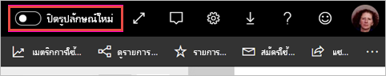
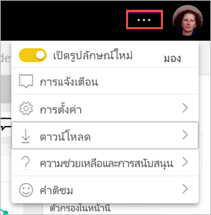

# เลือกใช้รูปลักษณ์พื้นที่ทำงาน “รูปลักษณ์ใหม่” (พรีวิว)Opt in to the workspace 'new look' (preview)

พื้นที่ทำงานมีรูปลักษณ์ใหม่ที่สอดคล้องกับ[รูปลักษณ์ใหม่](../consumer/service-new-look.md)ของบริการ Power BIWorkspaces have a new look that coincides with the [new look](../consumer/service-new-look.md) of the Power BI service. ทุกคนที่ใช้บริการ Power BI (app.powerbi.com) สามารถเลือกใช้งานได้Anyone using the Power BI service (app.powerbi.com) can opt in. เมื่อคุณเปิดการ **ลักษณะใหม่** ในแถบส่วนหัวสีดำคุณเลือกที่จะค้นหารายงานและพื้นที่ทำงานใหม่When you turn on the **New look** in the black header bar, you opt in to the new look for reports and workspaces. ทุกพื้นที่ทำงาน ทั้งคลาสสิกและแบบใหม่สามารถได้ประโยชน์จากรูปลักษณ์ใหม่ได้All workspaces, both classic and new, can benefit from the new look.

ต้องการเกี่ยวกับรูปลักษณ์ใหม่ใน **Power BI Desktop** อย่างนั้นหรือLooking for information about the new look in **Power BI Desktop**? คุณสามารถอ่านได้ที่ใช้ [ชุดแถบเครื่องมือที่อัปเดตแล้วใน Power BI Desktop](../create-reports/desktop-ribbon.md)See [Use the updated ribbon in Power BI Desktop](../create-reports/desktop-ribbon.md).

## คุณลักษณะของรูปลักษณ์ใหม่่Features of the new look

:::image type="content" source="media/service-workspaces-new-look/power-bi-workspace-new-look-numbered.png" alt-text="รูปลักษณ์ใหม่ของพื้นที่ทำงานที่มีตัวเลขแจ้งเพื่อคำบรรยาย":::

|ตัวเลขNumber  |วิธีการทำงานHow it works |
|---------|---------|
|    | **รับข้อมูล**: เพิ่มเนื้อหาไปยังพื้นที่ทำงานของคุณได้ง่ายขึ้น**Get Data**: It's easier to add content to your workspace. เลือกปุ่ม **+ ใหม่** เพื่อเชื่อมต่อกับข้อมูล เปิดไฟล์ และสร้างรายงาน แดชบอร์ด และอื่น ๆSelect the **+ New** button to connect to data, open files, and create reports, dashboards, and more.  |
|   | **ตัวสลับมุมมอง**: ดูการเชื่อมต่อระหว่างกระแสข้อมูล ชุดข้อมูล รายงาน และแดชบอร์ดของคุณและการเชื่อมต่อกับแหล่งข้อมูลอื่น ๆ สลับระหว่างมุมมอง **รายการ** กับมุมมอง **สายข้อมูล****View switcher**: To see the connections between dataflows, datasets, reports, and dashboards, and their connections to other data sources, switch between **List** view and **Lineage** view. |
|  | **การค้นหาภายในพื้นที่ทำงาน**: ค้นหาเนื้อหาทั้งหมดในพื้นที่ทำงานในกล่องค้นหาแบบใหม่**Search within workspace**: Search all the content in a workspace in the new search box.  |
|   | **รายการและแท็บ**: เนื้อหาทั้งหมดในพื้นที่ทำงานอยู่ในรายการของแดชบอร์ด รายงาน ชุดข้อมูล ฯลฯ แบบราบ เช่น SharePoint**List and tabs**: All the content in a workspace is in a flat list of dashboards, reports, datasets, etc., like SharePoint. คุณไม่ต้องเปิดพื้นที่ทำงานไปยังแท็บ **แดชบอร์ด** ที่อาจว่างเปล่าแล้วสงสัยว่าเนื้อหาของคุณอยู่ที่ใดอีกต่อไปYou no longer open a workspace to a potentially empty **Dashboards** tab, and wonder where your content is. นี่คือลำดับแท็บใหม่:Here's the new tab order:  **ทั้งหมด**: แสดงเนื้อหาทั้งหมด (แดชบอร์ด รายงาน เวิร์กบุ๊ก รายงานที่มีการแบ่งหน้า ชุดข้อมูล และกระแสข้อมูล) ในพื้นที่ทำงาน**All**: Shows all content (dashboards, reports, workbooks, paginated reports, datasets, and dataflows) in the workspace.  **เนื้อหา**: รวบรวมเนื้อหาทั้งหมดที่สร้างขึ้นเพื่อการใช้งาน (แดชบอร์ด รายงาน เวิร์กบุ๊ก และรายงานที่มีการแบ่งหน้า) ภายในพื้นที่ทำงาน**Content**: Gathers all content created for consumption (dashboards, reports, workbooks, and paginated reports) within the workspace.  **ชุดข้อมูล + กระแสข้อมูล**: รวบรวมชุดข้อมูลและกระแสข้อมูลทั้งหมดในพื้นที่ทำงาน เพื่อให้ง่ายต่อการจัดการข้อมูล**Datasets + dataflows**: Gathers all the datasets and dataflows in the workspace, for easy data management. |
|  | **ตัวกรอง**: สำหรับพื้นที่ทำงานที่มีวัตถุหลายร้อยรายการ คุณสามารถกรองเนื้อหาในแผงตัวกรองได้**Filters**: For workspaces with hundreds of artifacts, you can filter the content in the Filters pane. หลังจากการใช้ตัวกรอง คุณจะเห็นตัวกรองอยู่ที่ด้านบนของรายการเนื้อหาOnce a filter is applied, you see the filter on top of the content list. |

**การดำเนินการด่วน**: เมื่อคุณชี้เมาส์เหนือเนื้อหาในรายการ คุณจะเห็นการดำเนินการที่ใช้บ่อยที่สุดสำหรับรายการนั้น รวมถึงรายการอื่น ๆ ที่มีอยู่ในเมนู **ตัวเลือกเพิ่มเติม** (...)**Quick actions**: When you hover over content in the list, you see the most common actions for that item, plus others available on the **More options** (...) menu.

:::image type="content" source="media/service-workspaces-new-look/power-bi-workspace-new-look-quick-actions.png" alt-text="การดำเนินการด่วนในพื้นที่ทำงานใหม่":::

## เลือกรับสำหรับรูปลักษณ์ใหม่Opt in to the new look

ผู้ใช้บริการของ Power BI สามารถเลือกรับสำหรับรูปลักษณ์ใหม่ได้Any Power BI service user can opt in to the new look. เพียงแค่เลื่อนจาก **ปิดรูปลักษณ์ใหม่** เป็น **เปิดรูปลักษณ์ใหม่**Just slide **New look off** to **New look on**.

หากคุณต้องการย้อนกลับไปใช้รูปลักษณ์เก่า เพียงแค่เลื่อนกลับเพื่อ **ปิด**If you need to return to the old look, just slide it back to **off** . หากคุณไม่เห็นรายการดังกล่าว ให้เลือกเมนูจุดไข่ปลาที่มุมขวาบนIf you don't see it, select the ellipsis menu in the upper-right corner.

## ขั้นตอนถัดไปNext steps

- [ใช้ชุดแถบเครื่องมือที่อัปเดตแล้วใน Power BI DesktopUse the updated ribbon in Power BI Desktop](../create-reports/desktop-ribbon.md)
- ["รูปลักษณ์ใหม่" ของบริการของ Power BIThe 'new look' of the Power BI service](../consumer/service-new-look.md)
- มีคำถามหรือไม่Questions? [ลองไปที่ชุมชน Power BITry the Power BI Community](https://community.powerbi.com/)
