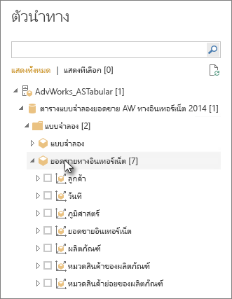

# เชื่อมต่อกับข้อมูลแบบตารางของ Analysis Services ใน Power BI DesktopConnect to Analysis Services tabular data in Power BI Desktop
ด้วย Power BI Desktop คุณสามารถเชื่อมต่อ และรับข้อมูลจากแบบจำลองตารางของ SQL Server Analysis Services ได้สองวิธีคือ: สำรวจโดยใช้การเชื่อมต่อแบบสดหรือเลือกรายการและนำเข้าสู่ Power BI DesktopWith Power BI Desktop, there are two ways you can connect to and get data from your SQL Server Analysis Services tabular models: Explore by using a live connection or select items and import them into Power BI Desktop.

ลองมาดูรายละเอียดกันLet’s take a closer look.

**สำรวจโดยใช้การเชื่อมต่อแบบสด**: เมื่อใช้การเชื่อมต่อแบบสด รายการในแบบจำลองตาราง หรือมุมมองของคุณ เช่น ตาราง คอลัมน์ และหน่วยวัด จะปรากฏในรายการบานหน้าต่าง **เขตข้อมูล** Power BI Desktop ของคุณ**Explore by using a live connection**: When using a live connection, items in your tabular model or perspective, like tables, columns, and measures appear in your Power BI Desktop **Fields** pane list. คุณสามารถใช้การแสดงวิชวลขั้นสูงและ เครื่องมือรายงานของ Power BI Desktop เพื่อสำรวจแบบจำลองตารางของคุณ ด้วยวิธีการใหม่ที่สามารถโต้ตอบได้สูงYou can use Power BI Desktop’s advanced visualization and report tools to explore your tabular model in new, highly interactive ways.

เมื่อมีการเชื่อมต่อโดยตรง จะไม่มีการนำเข้าข้อมูลจากแบบจำลองตารางลงใน Power BI DesktopWhen connecting live, no data from the tabular model is imported into Power BI Desktop. ในแต่ละครั้งที่คุณโต้ตอบกับการแสดงวิชวล Power BI Desktop จะคิวรีแบบจำลองตาราง และคำนวณผลลัพธ์ที่คุณเห็นEach time you interact with a visualization, Power BI Desktop queries the tabular model and calculates the results you see. คุณจะเห็นข้อมูลล่าสุดที่พร้อมใช้งานในแบบจำลองตาราง จากเวลาประมวลผลครั้งล่าสุด หรือจากตารางคิวรีโดยตรงที่พร้อมใช้งานในแบบจำลองตารางYou’re always looking at the latest data that is available in the tabular model, either from the last processing time, or from DirectQuery tables available in the tabular model. 

โปรดทราบว่าแบบจำลองตารางนั้นมีความปลอดภัยสูงKeep in mind that tabular models are highly secure. รายการที่ปรากฏใน Power BI Desktop ขึ้นอยู่กับสิทธิ์ของคุณสำหรับแบบจำลองตารางที่คุณได้เชื่อมต่ออยู่Items that appear in Power BI Desktop depend on your permissions for the tabular model you’re connected to.

เมื่อคุณสร้างรายงานแบบไดนามิกใน Power BI Desktop คุณสามารถแบ่งปันเอกสารโดยการเผยแพร่ไปยังไซต์ Power BI ของคุณWhen you’ve created dynamic reports in Power BI Desktop, you can share them by publishing to your Power BI site. เมื่อคุณเผยแพร่ไฟล์ Power BI Desktop ด้วยการเชื่อมต่อแบบสดไปยังแบบจำลองตาราง ไปสู่ไซต์ Power BI ของคุณ เกตเวย์ข้อมูลภายในองค์กรต้องได้รับการติดตั้ง และกำหนดค่าโดยผู้ดูแลระบบWhen you publish a Power BI Desktop file with a live connection to a tabular model to your Power BI site, an on-premises data gateway must be installed and configured by an administrator. ดูที่ [เกตเวย์ข้อมูลภายในองค์กร](service-gateway-onprem.md) เพื่อเรียนรู้เพิ่มเติมTo learn more, see [On-premises data gateway](service-gateway-onprem.md).

**เลือกรายการและนำเข้าไปยัง Power BI Desktop**: เมื่อคุณเชื่อมต่อกับตัวเลือกนี้ คุณสามารถเลือกรายการ เช่น ตาราง คอลัมน์ และหน่วยวัดในแบบจำลองตาราง หรือมุมมองของคุณ และโหลดรายการเหล่านั้นลงในแบบจำลอง Power BI Desktop**Select items and import into Power BI Desktop**: When you connect with this option, you can select items like tables, columns, and measures in your tabular model or perspective and load them into a Power BI Desktop model. ใช้ตัวแก้ไข Power Query ของ Power BI Desktop เพื่อกำหนดรูปร่างสิ่งที่คุณต้องการเพิ่มเติมและคุณลักษณะการสร้างแบบจำลองเพื่อสร้างแบบจำลองข้อมูลเพิ่มเติมUse Power BI Desktop’s Power Query Editor to further shape what you want and its modeling features to further model the data. เนื่องจากไม่มีการเชื่อมต่อแบบสดระหว่าง Power BI Desktop และแบบจำลองตาราง คุณสามารถสำรวจแบบจำลอง Power BI Desktop ของคุณแบบออฟไลน์หรือเผยแพร่ไปยังไซต์ Power BI ของคุณได้Because no live connection between Power BI Desktop and the tabular model is maintained, you can then explore your Power BI Desktop model offline or publish to your Power BI site.

## เพื่อเชื่อมต่อกับแบบจำลองตารางTo connect to a tabular model
1. ใน Power BI Desktop บนแท็บ **หน้าแรก** เลือก **รับข้อมูล** > **เพิ่มเติม** > **ฐานข้อมูล**In Power BI Desktop, on the **Home** tab, select **Get Data** > **More** > **Database**.
   
1. เลือก **ฐานข้อมูล SQL Server Analysis Services** จากนั้นเลือก **เชื่อมต่อ**Select **SQL Server Analysis Services database**, and then select **Connect**.
   
   
3. ในหน้าต่าง **ฐานข้อมูล SQL Server Analysis Services** ให้ใส่ชื่อ **เซิร์ฟเวอร์** เลือกโหมดการเชื่อมต่อ แล้วเลือก **ตกลง**In the **SQL Server Analysis Services database** window, enter the **Server** name, choose a connection mode, and then select **OK**.
   
   
4. ขั้นตอนนี้ในหน้าต่าง **ตัวนำทาง** ขึ้นอยู่กับโหมดการเชื่อมต่อที่คุณเลือก:This step in the **Navigator** window depends on the connection mode you selected:

   - ถ้าคุณกำลังเชื่อมต่อแบบสด ให้เลือกแบบจำลองตาราง หรือมุมมองIf you’re connecting live, select a tabular model or perspective.
  
      
   - ถ้าคุณเลือก เลือกรายการและรับข้อมูล ให้เลือกแบบจำลองตาราง หรือมุมมอง จากนั้นเลือกตารางหรือคอลัมน์เฉพาะที่จะโหลดIf you chose to select items and get data, select a tabular model or perspective, and then select a particular table or column to load. เมื่อต้องการจัดรูปร่างข้อมูลของคุณก่อนการโหลด ให้เลือก **แก้ไขคิวรี** เพื่อเปิดตัวแก้ไข Power QueryTo shape your data before loading, select **Edit Queries** to open Power Query Editor. เมื่อคุณพร้อมแล้ว ให้เลือก **โหลด** เพื่อนำเข้าข้อมูลลงใน Power BI DesktopWhen you’re ready, select **Load** to import the data into Power BI Desktop.

      

## คำถามที่ถามบ่อยFrequently asked questions
**คำถาม:** ฉันจำเป็นต้องมีเกตเวย์ข้อมูลภายในองค์กรหรือไม่**Question:** Do I need an on-premises data gateway?

**คำตอบ:** ขึ้นอยู่กับปัจจัยหลายๆ อย่าง**Answer:** It depends. ถ้าคุณใช้ Power BI Desktop เพื่อเชื่อมต่อแบบสดกับแบบจำลองตาราง แต่ไม่ต้องการเผยแพร่ไปยังไซต์ Power BI ของคุณ คุณไม่จำเป็นต้องมีเกตเวย์If you use Power BI Desktop to connect live to a tabular model, but have no intention to publish to your Power BI site, you don't need a gateway. ในทางกลับกัน ถ้าคุณต้องการเผยแพร่ไปยังไซต์ Power BI ของคุณ คุณจำเป็นต้องมีเกตเวย์ข้อมูลเพื่อให้แน่ใจว่าการสื่อสารจะปลอดภัยระหว่างบริการ Power BI และเซิร์ฟเวอร์ Analysis Services ภายในองค์กรของคุณOn the other hand, if you do intend on publishing to your Power BI site, a data gateway is necessary to ensure secure communication between the Power BI service and your on-premises Analysis Services server. อย่าลืมพูดกับผู้ดูแลเซิร์ฟเวอร์ Analysis Services ของคุณก่อนติดตั้งเกตเวย์ข้อมูลBe sure to talk to your Analysis Services server administrator before installing a data gateway.

ถ้าคุณเลือก เลือกรายการและรับข้อมูลแล้ว คุณจะต้องนำเข้าข้อมูลแบบจำลองตารางโดยตรงไปยังไฟล์ Power BI Desktop ของคุณทันที ดังนั้นจึงไม่จำเป็นต้องมีเกตเวย์If you choose to select items and get data, you import tabular model data directly into your Power BI Desktop file, so no gateway is necessary.

**คำถาม:** การเชื่อมต่อกันโดยตรงกับแบบจำลองตาราง จากบริการ Power BI และการเชื่อมต่อโดยตรงจาก Power BI Desktop แตกต่างกันอย่างไร**Question:** What’s the difference between connecting live to a tabular model from the Power BI service versus connecting live from Power BI Desktop?

**คำตอบ:** เมื่อเชื่อมต่อแบบสดไปยังแบบจำลองตาราง จากไซต์ของคุณในบริการ Power BI ไปยังฐานข้อมูล Analysis Services ภายในองค์กรของคุณ เกตเวย์ข้อมูลภายในองค์กรต้องมีการติดต่อสื่อสารที่ปลอดภัยระหว่างกัน**Answer:** When connecting live to a tabular model from your site in the Power BI service to an Analysis Services database on-premises in your organization, an on-premises data gateway is required to secure communications between them. เมื่อเชื่อมต่อแบบสดไปยังแบบจำลองตาราง จาก Power BI Desktop คุณไม่จำเป็นต้องใช้เกตเวย์ เนื่องจากทั้ง Power BI Desktop และเซิร์ฟเวอร์ Analysis Services ที่คุณกำลังเชื่อมต่อนั้นกำลังทำงานอยู่ภายในองค์กรของคุณWhen connecting live to a tabular model from Power BI Desktop, a gateway isn't required because the Power BI Desktop and the Analysis Services server you’re connecting to are both running on-premises in your organization. อย่างไรก็ตามคุณจำเป็นต้องมีเกตเวย์ ถ้าคุณเผยแพร่ไฟล์ Power BI Desktop ของคุณไปยังไซต์ Power BI ของคุณHowever, if you publish your Power BI Desktop file to your Power BI site, a gateway is required.

**คำถาม:** ถ้าฉันได้สร้างการเชื่อมต่อโดยตรง ฉันสามารถเชื่อมต่อกับแหล่งข้อมูลอื่น ๆ ในไฟล์ Power BI Desktop เดียวกันได้หรือไม่**Question:** If I created a live connection, can I connect to another data source in the same Power BI Desktop file?

**คำตอบ:** หมายเลข**Answer:** No. คุณไม่สามารถสำรวจข้อมูลแบบสด และเชื่อมต่อกับแหล่งข้อมูลชนิดอื่นในไฟล์เดียวกันได้You can't explore live data and connect to another type of data source in the same file. ถ้าคุณนำเข้าข้อมูล หรือเชื่อมต่อกับแหล่งข้อมูลที่แตกต่างในไฟล์ Power BI Desktop แล้ว คุณจะต้องสร้างไฟล์ใหม่เพื่อสำรวจแบบสดIf you’ve already imported data or connected to a different data source in a Power BI Desktop file, you need to create a new file to explore live.

**คำถาม:** ถ้าฉันสร้างการเชื่อมต่อโดยตรง ฉันสามารถแก้ไขแบบจำลองหรือคิวรีใน Power BI Desktop ได้หรือไม่**Question:** If I created a live connection, can I edit the model or query in Power BI Desktop?

**คำตอบ:** คุณสามารถสร้างหน่วยวัดระดับรายงานใน Power BI Desktop แต่คิวรีอื่นทั้งหมดและคุณลักษณะการสร้างแบบจำลองจะปิดใช้งานเมื่อมีการสำรวจข้อมูลแบบไลฟ์**Answer:** You can create report level measures in the Power BI Desktop, but all other query and modeling features are disabled when exploring live data.

**คำถาม:** ถ้าฉันสร้างการเชื่อมต่อกันโดยตรง การเชื่อมต่อนั้นจะปลอดภัยหรือไม่**Question:** If I created a live connection, is it secure?

**คำตอบ:** ใช่**Answer:** Yes. ข้อมูลประจำตัว Windows ปัจจุบันของคุณใช้เพื่อเชื่อมต่อไปยังเซิร์ฟเวอร์ Analysis ServicesYour current Windows credentials are used to connect to the Analysis Services server. คุณไม่สามารถใช้ข้อมูลประจำตัวพื้นฐานหรือข้อมูลประจำตัวที่เก็บไว้ในบริการ Power BI หรือ Power BI Desktop เมื่อมีการสำรวจแบบสดYou can't use basic or stored credentials in either the Power BI service or Power BI Desktop when exploring live.

**คำถาม:** ใน “ตัวนำทาง” ฉันเห็นทั้งแบบจำลองและเปอร์สเปคทีฟ**Question:** In Navigator, I see a model and a perspective. อะไรคือความแตกต่าง?What’s the difference?

**คำตอบ:** เปอร์สเปคทีฟเป็นมุมมองเฉพาะของแบบจำลองตาราง**Answer:** A perspective is a particular view of a tabular model. ซึ่งอาจรวมถึงตาราง คอลัมน์ หรือหน่วยวัดบางอย่าง โดยขึ้นอยู่กับความต้องการวิเคราะห์ข้อมูลที่ไม่ซ้ำกันIt might include only particular tables, columns, or measures depending on a unique data analysis need. แบบจำลองตารางจะประกอบด้วยหนึ่งเปอร์สเปคทีฟเป็นอย่างต่ำเสมอ ซึ่งอาจรวมถึงทุกสิ่งที่อยู่ในแบบจำลองA tabular model always contains at least one perspective, which could include everything in the model. หากคุณไม่แน่ใจว่าควรเลือกมุมมองใด ให้ตรวจสอบกับผู้ดูแลระบบของคุณIf you’re unsure which perspective you should select, check with your administrator.

**คำถาม:** มีฟีเจอร์ใด ๆ ของบริการวิเคราะห์ที่เปลี่ยนวิธีการทำงานของ Power BI**Question:** Are there any features of Analysis Services that change the way Power BI behaves?

**คำตอบ:** ใช่**Answer:** Yes. ประสบการณ์ใน Power BI Desktop อาจเปลี่ยนแปลงได้โดยขึ้นอยู่กับลักษณะการทำงานแบบตารางของคุณDepending on the features your Tabular model uses, the experience in Power BI Desktop might change. ตัวอย่างเช่น:Some examples include:
* คุณอาจเห็นหน่วยวัดในแบบจำลองที่จัดกลุ่มไว้ด้วยกันที่ด้านบนของรายการบานหน้าต่าง **เขตข้อมูล** แทนที่จะอยู่ในตารางควบคู่ไปกับคอลัมน์You may see measures in the model grouped together at the top of the **Fields** pane list rather than in tables alongside columns. ไม่ต้องกังวล คุณสามารถใช้ได้ตามปกติ เป็นเพียงวิธีที่ง่ายกว่าในการดำเนินการเช่นนี้Don't worry, you can still use them as normal, it's just easier to find them this way.

* หากแบบจำลองตารางมีกลุ่มการคำนวณที่กำหนด คุณจะสามารถใช้งานร่วมกับหน่วยวัดแบบจำลองและไม่ได้รวมกับหน่วยวัดโดยนัยที่คุณสร้างขึ้นโดยการเพิ่มส่วนตัวเลขในการแสดงผลIf the tabular model has calculation groups defined, you can use them only in conjunction with model measures and not with implicit measures you create by adding numeric fields to a visual. นอกจากนี้แบบจำลองอาจมีสถานะ **DiscourageImplicitMeasures** ที่กำหนดเอง ซึ่งมีผลเหมือนกันThe model might also have had the **DiscourageImplicitMeasures** flag set manually, which has the same effect. สำหรับการเรียนรู้เพิ่มเติม โปรดดู [กลุ่มการคำนวณใน Analysis Services](/analysis-services/tabular-models/calculation-groups#benefits)To learn more, see [Calculation groups in Analysis Services](/analysis-services/tabular-models/calculation-groups#benefits).

## เพื่อเปลี่ยนชื่อของเซิร์ฟเวอร์หลังจากการเชื่อมต่อเริ่มต้นTo change the server name after initial connection
หลังจากคุณสร้างไฟล์ Power BI Desktop พร้อมกับการเชื่อมต่อแบบสดของการสำรวจ อาจมีบางกรณีที่คุณต้องการสลับการเชื่อมต่อไปยังเซิร์ฟเวอร์อื่นAfter you create a Power BI Desktop file with an explore live connection, there might be some cases where you want to switch the connection to a different server. ตัวอย่างเช่น ถ้าคุณสร้างไฟล์ Power BI Desktop ของคุณ เมื่อเชื่อมต่อไปยังเซิร์ฟเวอร์พัฒนา และก่อนเผยแพร่ไปยังบริการ Power BI คุณต้องการสลับการเชื่อมต่อไปยังเซิร์ฟเวอร์การผลิตFor example, if you created your Power BI Desktop file when connecting to a development server, and before publishing to the Power BI service, you want to switch the connection to production server.

เมื่อต้องการเปลี่ยนชื่อเซิร์ฟเวอร์:To change the server name:

1. เลือก **แก้ไขคิวรี** จากแท็บ **หน้าแรก**Select **Edit Queries** from the **Home** tab.

2. ในหน้าต่าง **ฐานข้อมูล SQL Server Analysis Services** ให้ใส่ชื่อ **เซิร์ฟเวอร์** ใหม่ แล้วเลือก **ตกลง**In the **SQL Server Analysis Services database** window, enter the new **Server** name, and then select **OK**.

   
## การแก้ไขปัญหาTroubleshooting 
รายการต่อไปนี้อธิบายปัญหาที่ทราบแล้วทั้งหมด เมื่อเชื่อมต่อกับ SQL Server Analysis Services (SSAS) หรือ Azure Analysis Services:The following list describes all known issues when connecting to SQL Server Analysis Services (SSAS) or Azure Analysis Services: 

* **ข้อผิดพลาด: ไม่สามารถโหลดสคีมาสำหรับแบบจำลอง**: ข้อผิดพลาดนี้มักจะเกิดขึ้นเมื่อผู้ใช้ที่เชื่อมต่อกับ Analysis Services ไม่สามารถเข้าถึงฐานข้อมูล/แบบจำลองได้**Error: Couldn't load model schema**: This error usually occurs when the user connecting to Analysis Services doesn't have access to the database/model.