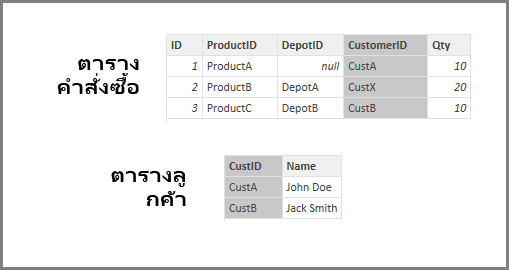

# ใช้ประมาณการตั้งค่า Referential Integrity ใน Power BI DesktopApply the Assume Referential Integrity setting in Power BI Desktop
เมื่อเชื่อมต่อกับแหล่งข้อมูลโดยใช้ **DirectQuery** คุณสามารถใช้การเลือก **ประมาณ Referential Integrity** เพื่อเปิดใช้งานการเรียกใช้แบบสอบถามที่มีปะสิทธิภาพมากยิ่งขึ้นกับแหล่งข้อมูลของคุณได้When connecting to a data source using **DirectQuery**, you can use the **Assume Referential Integrity** selection to enable running more efficient queries against your data source. คุณลักษณะนี้มีข้อกำหนดบางอย่างเกี่ยวกับข้อมูลต้นแบบ และจะพร้อมใช้งานเมื่อใช้ **DirectQuery**This feature has a few requirements of the underlying data, and it is only available when using **DirectQuery**.

การตั้งค่า **ประมาณ referential integrity** จะเปิดใช้งานแบบสอบถามบนแหล่งข้อมูลเพื่อใช้คำสั่ง **INNER JOIN** ่ แทน **OUTER JOIN** ซึ่งช่วยปรับปรุงประสิทธิภาพแบบสอบถามSetting **Assume referential integrity** enables queries on the data source to use **INNER JOIN** statements rather than **OUTER JOIN**, which improves query efficiency.

## ข้อกำหนดสำหรับการใช้การประมาณ referential integrityRequirements for using Assume referential integrity
เป็นการตั้งค่าขั้นสูงและจะเปิดใช้งานเมื่อเชื่อมต่อกับข้อมูลโดยใช้ **DirectQuery** เท่านั้นThis is an advanced setting, and is only enabled when connecting to data using **DirectQuery**. ข้อกำหนดดังต่อไปนี้เป็นสิ่งจำเป็นสำหรับ **ประมาณ referential integrity** เพื่อให้ทำงานอย่างถูกต้อง:The following requirements are necessary for **Assume referential integrity** to work properly:

* ข้อมูลในคอลัมน์ **From** ในความสัมพันธ์ไม่เป็น *Null* หรือ *ว่างเปล่า*Data in the **From** column in the relationship is never *Null* or *blank*
* สำหรับแต่ละค่าในคอลัมน์ **From** ไม่มีค่าที่สอดคล้องกันในคอลัมน์ **To**For each value in the **From** column, there is a corresponding value in the **To** column

ในบริบทนี้ คอลัมน์ **From** จะเป็นแบบ *กลุ่ม* ในความสัมพันธ์แบบ *หนึ่งต่อกลุ่ม* หรือเป็นคอลัมน์ในตารางแรกในความสัมพันธ์แบบ *หนึ่งต่อหนึ่ง*In this context, the **From** column is the *Many* in a *One-to-Many* relationship, or it is the column in the first table in a *One-to-One* relationship.

## ข้อกำหนดสำหรับการใช้การประมาณ referential integrityExample of using Assume referential integrity
ตัวอย่างต่อไปนี้จะสาธิตลักษณะการทำงาน **ประมาณ referential integrity** เมื่อใช้ในการเชื่อมต่อข้อมูลThe following example demonstrates how **Assume referential integrity** behaves when used in data connections. ตัวอย่างการเชื่อมต่อกับแหล่งข้อมูลรวมถึงตาราง **Orders** ตาราง **Products** และตาราง **Depots**The example connects to a data source that includes an **Orders** table, a **Products** table, and a **Depots** table.

1. ในรูปต่อไปนี้ที่แสดงในตาราง **Orders** และตาราง **Products** โปรดสังเกตว่า referential integrity จะเกิดขึ้นระหว่าง **Orders[ProductID]** กับ **Products[ProductID]**In the following image that shows the **Orders** table and the **Products** table, note that referential integrity exists between **Orders[ProductID]** and **Products[ProductID]**. คอลัมน์ **[ProductID]** ในตาราง **Orders** จะไม่เป็น *Null* และทุกค่ายังปรากฏในตาราง **Products** ด้วยThe **[ProductID]** column in the **Orders** table is never *Null*, and every value also appears in the **Products** table. ดังนั้น **ประมาณ Referential Integrity** จึงควรถูกตั้งค่าเพื่อรับแบบสอบถามมีประสิทธิภาพมากขึ้น (การใช้การตั้งค่านี้จะไม่เปลี่ยนแปลงค่าที่แสดงในการแสดงผลด้วยภาพ)As such, **Assume Referential Integrity** should be set to get more efficient queries (using this setting does not change the values shown in visuals).
   
   
2. ในภาพถัดไป จะสังเกตเห็นได้ว่า ไม่มี referential integrity เกิดขึ้นระหว่าง **Orders[DepotID]** กับ **Depots[DepotID]** เพราะ **DepotID** เป็น *Null* สำหรับบาง *Orders*In the next image, notice that no referential integrity exists between **Orders[DepotID]** and **Depots[DepotID]**, because the **DepotID** is *Null* for some *Orders*. ดังนั้น **ประมาณ Referential Integrity** จึงไม่ควร *ถูก* ตั้งค่าAs such, **Assume Referential Integrity** should *not* be set.
   
   
3. ในตอนท้าย ไม่มีของ referential integrity เกิดขึ้นระหว่าง **Orders[CustomerID]** กับ **Customers[CustID]** ในตารางดังต่อไปนี้ กล่าวคือ **CustomerID** จะมีบางค่า (ในกรณีนี้ ได้แก่ *CustX*) ซึ่งไม่เกิดขึ้นในตาราง *Customers*Finally, no referential integrity exists between **Orders[CustomerID]** and **Customers[CustID]** in the following tables; the **CustomerID** contains some values (in this case, *CustX*) that do not exist in the *Customers* table. ดังนั้น **ประมาณ Referential Integrity** จึงไม่ควร *ถูก* ตั้งค่าAs such, **Assume Referential Integrity** should *not* be set.
   
   

## การตั้งค่าการประมาณ Referential IntegritySetting Assume referential integrity
เมื่อต้องการเปิดใช้งานคุณลักษณะนี้ เลือกกล่องกาเครื่องหมายถัดจาก **ประมาณ Referential Integrity** ดังที่แสดงในภาพต่อไปนี้To enable this feature, select the checkbox next to **Assume Referential Integrity** as shown in the following image.

เมื่อเลือกแล้ว การตั้งค่าก็จะถูกตรวจสอบกับข้อมูลเพื่อให้แน่ใจว่า ไม่มี *Null* หรือแถวที่ไม่ตรงกันWhen selected, the setting is validated against the data to ensure there are no *Null* or mismatched rows. *อย่างไรก็ตาม* สำหรับกรณีที่มีจำนวนค่ามาก การตรวจสอบจะไม่สามารถรับประกันได้ว่า ไม่มีปัญหาใด ๆ เกี่ยวกับ referential integrity*However*, for cases with a very large number of values, the validation is not a guarantee that there are no referential integrity issues.

นอกจากนี้ การตรวจสอบจะเกิดขึ้นในเวลาที่มีการแก้ไขความสัมพันธ์ และจะ *ไม่* แสดงการเปลี่ยนแปลงใด ๆ กับข้อมูลในภายหลังIn addition, the validation occurs at the time of editing the relationship, and does *not* reflect any subsequent changes to the data.

## จะเกิดอะไรขึ้นถ้าคุณตั้งค่าการประมาณ referential integrity ไม่ถูกต้องWhat happens if you incorrectly set Assume referential integrity?
ถ้าคุณตั้งค่า **ประมาณ Referential Integrity** เมื่อไม่มีปัญหา referential integrity ในข้อมูล สิ่งนี้จะไม่ส่งผลให้เกิดข้อผิดพลาดIf you set **Assume Referential Integrity** when there are referential integrity issues in the data, this will not result in errors. อย่างไรก็ตาม จะส่งผลให้เกิดความไม่สอดคล้องกันของข้อมูลHowever, it will result in apparent inconsistencies in the data. ตัวอย่างเช่น ในกรณีของความสัมพันธ์กับตาราง **Depots** ที่อธิบายไว้ข้างต้น อาจส่งผลดังต่อไปนี้:For example, in the case of the relationship to the **Depots** table described above, it would result in the following:

* การแสดงผลด้วยภาพซึ่งแสดง *Order Qty* รวมจะแสดงค่า 40A visual showing the total *Order Qty* would show a value of 40
* การแสดงผลด้วยภาพซึ่งแสดง *Order Qty by Depot City* รวมจะแสดงค่าผลรวมเฉพาะ *30* เนื่องจากนั้นไม่รวม Order ID 1 ซึ่ง **DepotID** เป็น *Null*A visual showing the total *Order Qty by Depot City* would show a total value of only *30*, because it would not include Order ID 1, where **DepotID** is *Null*.

## ขั้นตอนถัดไปNext steps
เรียนรู้เพิ่มเติมเกี่ยวกับ [DirectQuery](desktop-use-directquery.md)Learn more about [DirectQuery](desktop-use-directquery.md)

รับข้อมูลเพิ่มเติมเกี่ยวกับ [ความสัมพันธ์ใน Power BI](../transform-model/desktop-create-and-manage-relationships.md)Get more information about [Relationships in Power BI](../transform-model/desktop-create-and-manage-relationships.md)

เมื่อต้องการเรียนรู้เพิ่มเติม ดู [มุมมองความสัมพันธ์ใน Power BI Desktop](../transform-model/desktop-relationship-view.md)Learn more about [Relationship View in Power BI Desktop](../transform-model/desktop-relationship-view.md).
