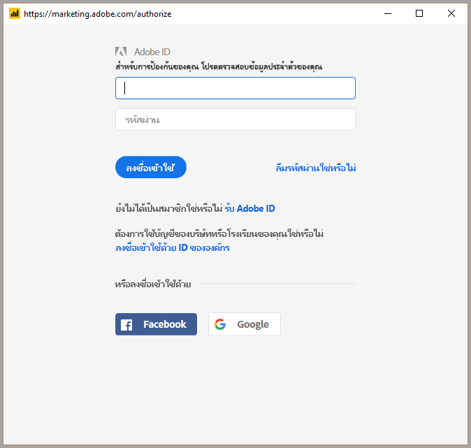

# เชื่อมต่อกับ Adobe Analytics ใน Power BI Desktop 
ใน **Power BI Desktop** คุณสามารถเชื่อมต่อกับ **Adobe Analytics** และใช้ข้อมูลเบื้องต้นเช่นเดียวกับแหล่งข้อมูลอื่นใน Power BI Desktop ได้ 

## เชื่อมต่อกับข้อมูล Adobe Analytics
เพื่อเชื่อมต่อกับข้อมูล **Adobe Analytics** เลือก **รับข้อมูล** จาก ribbon **หน้าแรก** ใน Power BI Desktop เลือก **บริการออนไลน์** จากประเภททางด้านซ้าย แล้วคุณจะเห็น **ตัวเชื่อมต่อ Adobe Analytics**

ในหน้าต่าง **Adobe Analytics** ที่ปรากฎขึ้น เลือกปุ่ม **ลงชื่อเข้าใช้** และระบุข้อมูลประจำตัวของคุณเพื่อลงชื่อเข้าใช้บัญชี Adobe Analytics ของคุณ หน้าต่างลงชื่อเข้าใช้ Adobe จะปรากฏขึ้น ดังที่แสดงในรูปต่อไปนี้

เมื่อได้รับการถาม ให้ใส่ชื่อผู้ใช้และรหัสผ่านของคุณ ทันทีที่การเชื่อมต่อสำเร็จ คุณสามารถดูตัวอย่างและเลือกมิติและหน่วยวัดต่าง ๆ ภายในกล่องโต้ตอบ **ตัวนำทาง** Power BI เพื่อสร้างผลลัพธ์หนึ่งตาราง คุณยังสามารถใส่ค่าพารามิเตอร์ใด ๆ ที่จำเป็นสำหรับรายการที่เลือกไว้ 

คุณสามารถ **โหลด** ตารางที่เลือก ซึ่งจะรวมทั้งตารางลง ใน **Power BI Desktop** หรือคุณสามารถ **แก้ไข** คิวรี ซึ่งจะเปิด **ตัวแก้ไขคิวรี** เพื่อให้คุณสามารถกรองและปรับปรุงชุดข้อมูลที่ต้องการใช้ จากนั้นโหลดชุดข้อมูลที่ปรับปรุงแล้วลงใน **Power BI Desktop**

## ขั้นตอนถัดไป
มีข้อมูลหลากหลายประเภทที่คุณสามารถเชื่อมต่อโดยใช้ Power BI Desktop สำหรับข้อมูลเพิ่มเติมเกี่ยวกับแหล่งข้อมูล โปรดดูทรัพยากรต่อไปนี้:

* [Power BI Desktop คืออะไร](../fundamentals/desktop-what-is-desktop.md)
* [แหล่งข้อมูลใน Power BI Desktop](desktop-data-sources.md)
* [จัดรูปทรง และรวมข้อมูลด้วย Power BI Desktop](desktop-shape-and-combine-data.md)
* [เชื่อมต่อกับเวิร์กบุ๊ก Excel ใน Power BI Desktop](desktop-connect-excel.md)   
* [ใส่ข้อมูลลงใน Power BI Desktop โดยตรง](desktop-enter-data-directly-into-desktop.md)   
