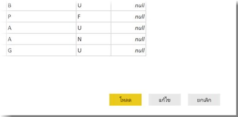

# เชื่อมต่อกับ Adobe Analytics ใน Power BI DesktopConnect to Adobe Analytics in Power BI Desktop 
ใน **Power BI Desktop** คุณสามารถเชื่อมต่อกับ **Adobe Analytics** และใช้ข้อมูลเบื้องต้นเช่นเดียวกับแหล่งข้อมูลอื่นใน Power BI Desktop ได้In **Power BI Desktop**, you can connect to **Adobe Analytics** and use the underlying data just like any other data source in Power BI Desktop. 

## เชื่อมต่อกับข้อมูล Adobe AnalyticsConnect to Adobe Analytics data
เพื่อเชื่อมต่อกับข้อมูล **Adobe Analytics** เลือก **รับข้อมูล** จาก ribbon **หน้าแรก** ใน Power BI DesktopTo connect to **Adobe Analytics** data, select **Get Data** from the **Home** ribbon in Power BI Desktop. เลือก **บริการออนไลน์** จากประเภททางด้านซ้าย แล้วคุณจะเห็น **ตัวเชื่อมต่อ Adobe Analytics**Select **Online Services** from the categories on the left, and you see **Adobe Analytics connector**.

ในหน้าต่าง **Adobe Analytics** ที่ปรากฎขึ้น เลือกปุ่ม **ลงชื่อเข้าใช้** และระบุข้อมูลประจำตัวของคุณเพื่อลงชื่อเข้าใช้บัญชี Adobe Analytics ของคุณIn the **Adobe Analytics** window that appears, select the **Sign in** button, and provide your credentials to sign in to your Adobe Analytics account. หน้าต่างลงชื่อเข้าใช้ Adobe จะปรากฏขึ้น ดังที่แสดงในรูปต่อไปนี้The Adobe sign in window appears, as shown in the following image.

เมื่อได้รับการถาม ให้ใส่ชื่อผู้ใช้และรหัสผ่านของคุณWhen prompted, put in your username and password. ทันทีที่การเชื่อมต่อสำเร็จ คุณสามารถดูตัวอย่างและเลือกมิติและหน่วยวัดต่าง ๆ ภายในกล่องโต้ตอบ **ตัวนำทาง** Power BI เพื่อสร้างผลลัพธ์หนึ่งตารางOnce the connection is established, you can preview and select multiple dimensions and measures within the Power BI **Navigator** dialog to create a single tabular output. คุณยังสามารถใส่ค่าพารามิเตอร์ใด ๆ ที่จำเป็นสำหรับรายการที่เลือกไว้You can also provide any necessary input parameters required for the selected items. 

คุณสามารถ **โหลด** ตารางที่เลือก ซึ่งจะรวมทั้งตารางลง ใน **Power BI Desktop** หรือคุณสามารถ **แก้ไข** คิวรี ซึ่งจะเปิด **ตัวแก้ไขคิวรี** เพื่อให้คุณสามารถกรองและปรับปรุงชุดข้อมูลที่ต้องการใช้ จากนั้นโหลดชุดข้อมูลที่ปรับปรุงแล้วลงใน **Power BI Desktop**You can **Load** the selected table, which brings the entire table into **Power BI Desktop**, or you can **Edit** the query, which opens **Query Editor** so you can filter and refine the set of data you want to use, and then load that refined set of data into **Power BI Desktop**.

## ขั้นตอนถัดไปNext steps
มีข้อมูลหลากหลายประเภทที่คุณสามารถเชื่อมต่อโดยใช้ Power BI DesktopThere are all sorts of data you can connect to using Power BI Desktop. สำหรับข้อมูลเพิ่มเติมเกี่ยวกับแหล่งข้อมูล โปรดดูทรัพยากรต่อไปนี้:For more information on data sources, check out the following resources:

* [Power BI Desktop คืออะไรWhat is Power BI Desktop?](../fundamentals/desktop-what-is-desktop.md)
* [แหล่งข้อมูลใน Power BI DesktopData Sources in Power BI Desktop](desktop-data-sources.md)
* [จัดรูปทรง และรวมข้อมูลด้วย Power BI DesktopShape and Combine Data with Power BI Desktop](desktop-shape-and-combine-data.md)
* [เชื่อมต่อกับเวิร์กบุ๊ก Excel ใน Power BI DesktopConnect to Excel workbooks in Power BI Desktop](desktop-connect-excel.md)   
* [ใส่ข้อมูลลงใน Power BI Desktop โดยตรงEnter data directly into Power BI Desktop](desktop-enter-data-directly-into-desktop.md)   
