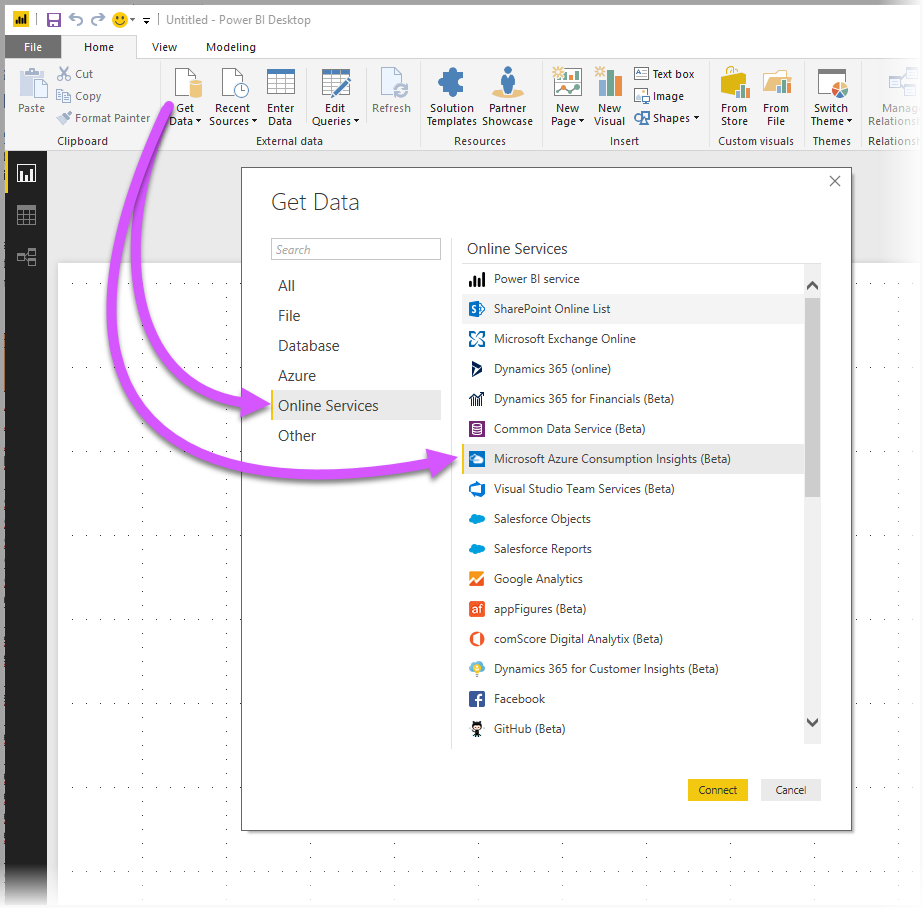
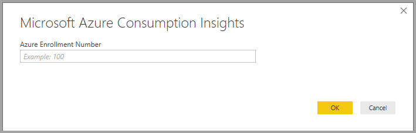
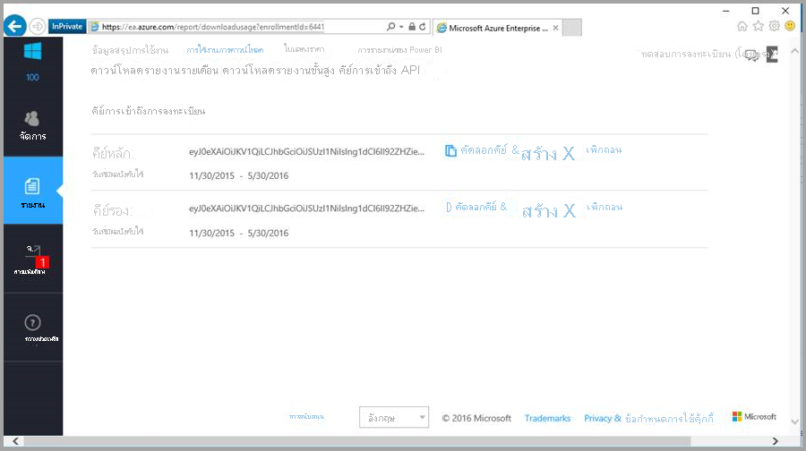
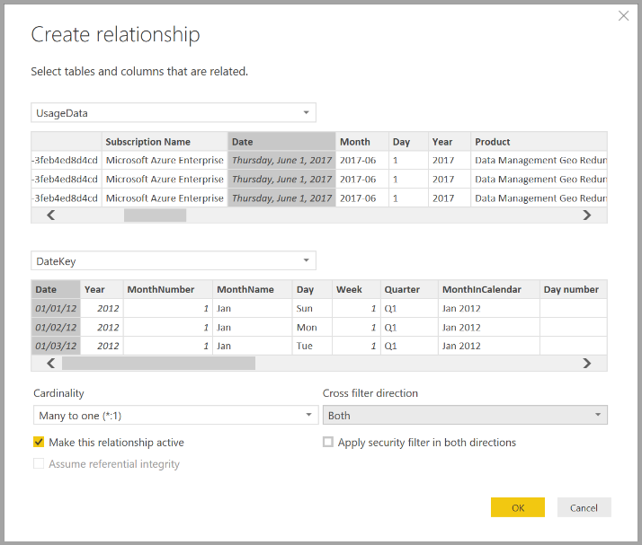

# <a name="connect-to-azure-consumption-insights-data-in-power-bi-desktop"></a><span data-ttu-id="85815-103">เชื่อมต่อกับ Microsoft Azure Consumption Insights ใน Power BI desktop</span><span class="sxs-lookup"><span data-stu-id="85815-103">Connect to Azure Consumption Insights data in Power BI Desktop</span></span>

<span data-ttu-id="85815-104">คุณสามารถใช้ Power BI Desktop เพื่อเชื่อมต่อกับ Azure และรับข้อมูลเชิงลึกเกี่ยวกับการใช้บริการ Azure ขององค์กรของคุณ</span><span class="sxs-lookup"><span data-stu-id="85815-104">You can use Power BI desktop to connect to Azure and get in-depth data about your organization's Azure service usage.</span></span> <span data-ttu-id="85815-105">ด้วยสิ่งนี้ คุณสามารถสร้างรายงานแบบกำหนดเองและหน่วยวัดที่ทำให้เข้าใจมากขึ้นและวิเคราะห์การใช้จ่ายของ Azure ของคุณ</span><span class="sxs-lookup"><span data-stu-id="85815-105">With this data, you can create custom reports and measures to better understand and analyze your Azure spend.</span></span>

> [!NOTE]
> <span data-ttu-id="85815-106">มีการจำกัดการสนับสนุนสำหรับข้อมูลรายจ่ายเชิงลึกของ Microsoft Azure (รุ่นเบต้า)</span><span class="sxs-lookup"><span data-stu-id="85815-106">There is limited support for the Microsoft Azure Consumption Insights (Beta).</span></span> <span data-ttu-id="85815-107">ในฟังก์ชั่นใหม่ ให้ใช้[การจัดการค่าใช้จ่ายของ Azure สำหรับ Power BI](desktop-connect-azure-cost-management.md)</span><span class="sxs-lookup"><span data-stu-id="85815-107">For new functionality, use the [Azure Cost Management connector for Power BI](desktop-connect-azure-cost-management.md).</span></span>

## <a name="connect-with-azure-consumption-insights"></a><span data-ttu-id="85815-108">เชื่อมต่อกับ Azure Consumption Insights</span><span class="sxs-lookup"><span data-stu-id="85815-108">Connect with Azure Consumption Insights</span></span>

<span data-ttu-id="85815-109">Azure Consumption Insights ช่วยให้คุณสามารถเชื่อมต่อกับt บัญชีการเรียกเก็บเงินของ Azure Enterprise Agreement</span><span class="sxs-lookup"><span data-stu-id="85815-109">Azure Consumption Insights allows you to connect to Azure Enterprise Agreement billing accounts.</span></span>

<span data-ttu-id="85815-110">ในส่วนนี้ คุณจะได้เรียนรู้วิธีการรับข้อมูลที่คุณต้องการให้ถ่ายโอนโดยใช้ตัวเชื่อมต่อ Azure Enterprise</span><span class="sxs-lookup"><span data-stu-id="85815-110">In this section, you learn how to get the data you need migrate using the Azure Enterprise Connector.</span></span> <span data-ttu-id="85815-111">คุณยังจะได้พบการแมป *คอลัมน์รายละเอียดการใช้งาน* ที่พร้อมใช้งานใน **ACI** API (ข้อมูลรายจ่ายเชิงลึกของ Azure)</span><span class="sxs-lookup"><span data-stu-id="85815-111">You'll also find a *usage details columns* mapping available in the **ACI** (Azure Consumption Insights) API.</span></span>

<span data-ttu-id="85815-112">เพื่อใช้ตัวเชื่อมต่อ **ข้อมูลรายจ่ายเชิงลึกของ Azure** ให้ประสบความสำเร็จ คุณจำเป็นต้องมีสิทธิเข้าถึงคุณลักษณะ Azure Portal Enterprise</span><span class="sxs-lookup"><span data-stu-id="85815-112">To successfully use the **Azure Consumption Insights** connector, you need access to the Azure portal Enterprise features.</span></span>

<span data-ttu-id="85815-113">ในการใช้ตัวเชื่อมต่อ **ข้อมูลรายจ่ายเชิงลึกของ Azure** ใน **Power BI Desktop**:</span><span class="sxs-lookup"><span data-stu-id="85815-113">To use the **Azure Consumption Insights** connector in **Power BI Desktop**:</span></span> 

1. <span data-ttu-id="85815-114">จากริบบอน **หน้าแรก** เลือก **รับข้อมูล**</span><span class="sxs-lookup"><span data-stu-id="85815-114">From the **Home** ribbon, select **Get Data**.</span></span>

1. <span data-ttu-id="85815-115">จากหมวดหมู่ทางด้านซ้าย เลือก **บริการออนไลน์**</span><span class="sxs-lookup"><span data-stu-id="85815-115">From the categories on the left, select **Online Services**.</span></span>  

1. <span data-ttu-id="85815-116">เลือก **ข้อมูลรายจ่ายเชิงลึกของ Microsoft Azure (เบต้า)**</span><span class="sxs-lookup"><span data-stu-id="85815-116">Select **Microsoft Azure Consumption Insights (Beta)**.</span></span> 

1. <span data-ttu-id="85815-117">เลือก **เชื่อมต่อ**</span><span class="sxs-lookup"><span data-stu-id="85815-117">Select **Connect**.</span></span>

   

   <span data-ttu-id="85815-120">ในกล่องโต้ตอบที่ปรากฏขึ้น .shxhvo **หมายเลขการลงทะเบียน Azure** ของคุณ</span><span class="sxs-lookup"><span data-stu-id="85815-120">In the dialog that appears, enter your **Azure Enrollment Number**.</span></span>

   

   * <span data-ttu-id="85815-122">คุณสามารถรับหมายเลขการลงทะเบียนของคุณจาก[Azure Enterprise Portal](https://ea.azure.com) ในตำแหน่งที่ตั้งที่แสดงในรูปต่อไปนี้</span><span class="sxs-lookup"><span data-stu-id="85815-122">You can get your enrollment number from the [Azure Enterprise Portal](https://ea.azure.com), in the location shown in the following image:</span></span>

  

   <span data-ttu-id="85815-124">เวอร์ชันนี้ของตัวเชื่อมต่อนี้รองรับเฉพาะการลงทะเบียนแบบองค์กรจาก https://ea.azure.com</span><span class="sxs-lookup"><span data-stu-id="85815-124">This connector version only supports enterprise enrollments from https://ea.azure.com.</span></span> <span data-ttu-id="85815-125">การลงทะเบียนในประเทศจีนยังใช้ไม่ได้ในขณะนี้</span><span class="sxs-lookup"><span data-stu-id="85815-125">China enrollments aren't currently supported.</span></span>

   <span data-ttu-id="85815-126">ถัดไป แสดง *Access key* เพื่อเชื่อมต่อของคุณ</span><span class="sxs-lookup"><span data-stu-id="85815-126">Next, provide your *Access key* to connect.</span></span>

   

   * <span data-ttu-id="85815-128">Access key สำหรับการลงทะเบียนของคุณ สามารถพบได้ใน[Azure Enterprise Portal](https://ea.azure.com)</span><span class="sxs-lookup"><span data-stu-id="85815-128">Your Access key for enrollment can be found on the [Azure Enterprise Portal](https://ea.azure.com).</span></span>

  

<span data-ttu-id="85815-130">เมื่อคุณใส *คีย์การเข้าถึง* ของคุณและเลือก **เชื่อมต่อ** บานหน้าต่าง **ตัวนำทาง** จะปรากฏขึ้นและแสดงตารางเก้าตารางที่พร้อมใช้งานสำหรับคุณ:</span><span class="sxs-lookup"><span data-stu-id="85815-130">Once you provide your *Access key* and select **Connect**, a **Navigator** window appears and shows nine available tables:</span></span>

| <span data-ttu-id="85815-131">ตาราง</span><span class="sxs-lookup"><span data-stu-id="85815-131">Table</span></span>        | <span data-ttu-id="85815-132">คำอธิบาย</span><span class="sxs-lookup"><span data-stu-id="85815-132">Description</span></span> |
|------------- | -------------------------------------------------------------|
| <span data-ttu-id="85815-133">**งบประมาณ**</span><span class="sxs-lookup"><span data-stu-id="85815-133">**Budgets**</span></span> | <span data-ttu-id="85815-134">รายละเอียดงบประมาณเพื่อดูค่าใช้จ่ายจริงหรือการใช้งานกับเป้าหมายงบประมาณที่มีอยู่</span><span class="sxs-lookup"><span data-stu-id="85815-134">Budget details to view actual costs or usage against existing budget targets.</span></span> |
| <span data-ttu-id="85815-135">**MarketPlace**</span><span class="sxs-lookup"><span data-stu-id="85815-135">**MarketPlace**</span></span> | <span data-ttu-id="85815-136">ค่าธรรมเนียม Azure Marketplace ยึดตามการใช้งานจริง</span><span class="sxs-lookup"><span data-stu-id="85815-136">Usage-based Azure Marketplace charges.</span></span> |
| <span data-ttu-id="85815-137">**PriceSheets**</span><span class="sxs-lookup"><span data-stu-id="85815-137">**PriceSheets**</span></span> | <span data-ttu-id="85815-138">อัตราการใช้โดยตัววัดสำหรับการลงทะเบียน</span><span class="sxs-lookup"><span data-stu-id="85815-138">Applicable rates by meter for an enrollment.</span></span> |
| <span data-ttu-id="85815-139">**RICharges**</span><span class="sxs-lookup"><span data-stu-id="85815-139">**RICharges**</span></span> | <span data-ttu-id="85815-140">ค่าใช้จ่ายที่เชื่อมโยงกับอินสแตนซ์ที่สงวนไว้ของคุณมากกว่า 24 เดือนที่ผ่านมา</span><span class="sxs-lookup"><span data-stu-id="85815-140">Charges associated to your Reserved Instances over the last 24 months.</span></span> |
| <span data-ttu-id="85815-141">**RIRecommendations_Single**</span><span class="sxs-lookup"><span data-stu-id="85815-141">**RIRecommendations_Single**</span></span> | <span data-ttu-id="85815-142">คำแนะนำในการซื้อมีอินสแตนซ์ที่สงวนไว้ยึดตามแนวโน้มการใช้งานของคุณในการสมัครใช้งานครั้งเดียวในช่วง 7, 30 หรือ 60 วัน</span><span class="sxs-lookup"><span data-stu-id="85815-142">Reserved Instance purchase recommendations based on your single subscription usage trends over the last 7, 30, or 60 days.</span></span> |
| <span data-ttu-id="85815-143">**RIRecommendations_Single**</span><span class="sxs-lookup"><span data-stu-id="85815-143">**RIRecommendations_Shared**</span></span> | <span data-ttu-id="85815-144">คำแนะนำในการซื้อมีอินสแตนซ์ที่สงวนไว้ตามแนวโน้มการใช้งานของคุณในการสมัครใช้งานทั้งหมดของคุณในช่วง 7, 30 หรือ 60 วัน</span><span class="sxs-lookup"><span data-stu-id="85815-144">Reserved Instance purchase recommendations based on your usage trends across all your subscriptions over the last 7, 30 or 60 days.</span></span> |
| <span data-ttu-id="85815-145">**RIUsage**</span><span class="sxs-lookup"><span data-stu-id="85815-145">**RIUsage**</span></span> | <span data-ttu-id="85815-146">รายละเอียดของปริมาณการใช้สำหรับอินสแตนซ์ที่สงวนไว้ของคุณที่มีอยู่ในช่วงเดือนที่ผ่านมา</span><span class="sxs-lookup"><span data-stu-id="85815-146">Consumption details for your existing Reserved Instances over the last month.</span></span> |
| <span data-ttu-id="85815-147">**สรุป**</span><span class="sxs-lookup"><span data-stu-id="85815-147">**Summaries**</span></span> | <span data-ttu-id="85815-148">ข้อมูลสรุปรายเดือนผ่านยอดดุล การซื้อใหม่ ค่าธรรมเนียมการใช้บริการ Azure Marketplace ค่าบริการปรับปรุง และค่าใช้จ่ายเกิน</span><span class="sxs-lookup"><span data-stu-id="85815-148">A monthly summary for balances, new purchases, Azure Marketplace service charges, adjustments, and overage charges.</span></span> |
| <span data-ttu-id="85815-149">**UsageDetails**:</span><span class="sxs-lookup"><span data-stu-id="85815-149">**UsageDetails**</span></span> | <span data-ttu-id="85815-150">การแบ่งย่อยปริมาณที่ใช้และค่าธรรมเนียมการลงทะเบียนโดยประมาณ</span><span class="sxs-lookup"><span data-stu-id="85815-150">A consumed quantities breakdown and estimated enrollment charges.</span></span> |

<span data-ttu-id="85815-151">คุณสามารถเลือกกล่องกาเครื่องหมายข้างตารางใดๆ เพื่อดูตัวอย่าง</span><span class="sxs-lookup"><span data-stu-id="85815-151">You can select a checkbox beside any table to see a preview.</span></span> <span data-ttu-id="85815-152">คุณสามารถเลือกโดยการติ๊กกล่องด้านข้างชื่อของพวกเขาอย่างน้อยหนึ่งตาราง จาก นั้นเลือก **การโหลด**</span><span class="sxs-lookup"><span data-stu-id="85815-152">You can select one or more tables by checking the box beside their name, then select **Load**.</span></span>


> [!NOTE]
> <span data-ttu-id="85815-154">ตาราง *Summary* และ *PriceSheet* มีเฉพาะ API Key ในระดับลงทะเบียน</span><span class="sxs-lookup"><span data-stu-id="85815-154">The *Summary* and *PriceSheet* tables are only available for the enrollment-level API Key.</span></span> <span data-ttu-id="85815-155">นอกจากนี้ ตามค่าเริ่มต้นข้อมูลในตารางเหล่านี้มีข้อมูลของเดือนปัจจุบันสำหรับ *การใช้งาน* และ *PriceSheet*</span><span class="sxs-lookup"><span data-stu-id="85815-155">Also, the data in these tables has, by default, the current month's data for *Usage* and *PriceSheet*.</span></span> <span data-ttu-id="85815-156">ตาราง *Summary* และ *MarketPlace* จะไม่จำกัดเฉพาะเดือนปัจจุบัน</span><span class="sxs-lookup"><span data-stu-id="85815-156">The *Summary* and *MarketPlace* tables are not constrained to the current month.</span></span>
>
>

<span data-ttu-id="85815-157">เมื่อคุณเลือก **โหลด** ข้อมูลจะถูกโหลดลงใน **Power BI Desktop**</span><span class="sxs-lookup"><span data-stu-id="85815-157">When you select **Load**, the data is loaded into **Power BI Desktop**.</span></span>


<span data-ttu-id="85815-159">เมื่อข้อมูลที่คุณเลือกถูกโหลด ตารางและเขตข้อมูลที่คุณเลือก สามารถเห็นได้ในบานหน้าต่าง **เขตข้อมูล**</span><span class="sxs-lookup"><span data-stu-id="85815-159">Once the data you selected is loaded, the tables and fields you selected can be seen in the **Fields** pane.</span></span>


## <a name="using-azure-consumption-insights"></a><span data-ttu-id="85815-161">ใช้ Azure Consumption Insights</span><span class="sxs-lookup"><span data-stu-id="85815-161">Using Azure Consumption Insights</span></span>
<span data-ttu-id="85815-162">เพื่อใช้ตัวเชื่อมต่อ **ข้อมูลรายจ่ายเชิงลึกของ Azure** คุณจำเป็นต้องมีสิทธิเข้าถึงคุณลักษณะของ Azure Portal Enterprise</span><span class="sxs-lookup"><span data-stu-id="85815-162">To use the **Azure Consumption Insights** connector, you access to the Azure portal Enterprise features.</span></span>

<span data-ttu-id="85815-163">เมื่อคุณโหลดข้อมูลโดยใช้ตัวเชื่อมต่อ **ข้อมูลรายจ่ายเชิงลึกของ Azure** ประสบความสำเร็จ คุณสามารถสร้างหน่วยวัดและคอลัมน์แบบกำหนดเองของคุณเองโดยใช้ **ตัวแก้ไขคิวรี**</span><span class="sxs-lookup"><span data-stu-id="85815-163">Once you successfully load data using the **Azure Consumption Insights** connector, you can create your own custom measures and columns using **Query Editor**.</span></span> <span data-ttu-id="85815-164">คุณยังสามารถสร้างวิชวล รายงาน และแดชบอร์ดที่คุณสามารถใช้ร่วมกันใน **บริการ Power BI**</span><span class="sxs-lookup"><span data-stu-id="85815-164">You can also create visuals, reports, and dashboards for sharing in the **Power BI service**.</span></span>

<span data-ttu-id="85815-165">กับคิวรีที่ว่างเปล่า คุณสามารถค้นคืนคอลเลกชันคิวรีแบบกำหนดเองของ Azure ตัวอย่างได้</span><span class="sxs-lookup"><span data-stu-id="85815-165">With a blank query, you can retrieve a sample Azure custom queries collection.</span></span> <span data-ttu-id="85815-166">มีอยู่สองวิธีที่คุณสามารถทำการค้นคืนนี้ได้:</span><span class="sxs-lookup"><span data-stu-id="85815-166">There are two ways you can do this retrieval:</span></span> 

<span data-ttu-id="85815-167">ใน **Power BI Desktop**:</span><span class="sxs-lookup"><span data-stu-id="85815-167">In **Power BI Desktop**:</span></span> 

1. <span data-ttu-id="85815-168">เลือกริบบอน **หน้าแรก**</span><span class="sxs-lookup"><span data-stu-id="85815-168">Select the **Home** ribbon</span></span> 
2. <span data-ttu-id="85815-169">เลือก **รับข้อมูล** > **คิวรีว่างเปล่า**</span><span class="sxs-lookup"><span data-stu-id="85815-169">Select **Get Data** > **Blank Query**</span></span> 

<span data-ttu-id="85815-170">หรือใน **ตัวแก้ไขคิวรี**:</span><span class="sxs-lookup"><span data-stu-id="85815-170">Or, in **Query Editor**:</span></span> 

1. <span data-ttu-id="85815-171">คลิกขวาในบานหน้าต่าง **คิวรี** ด้านซ้าย</span><span class="sxs-lookup"><span data-stu-id="85815-171">Right-click in the left **Queries** pane</span></span> 
2. <span data-ttu-id="85815-172">เลือก **คิวรีใหม่ > คิวรีว่างเปล่า** จากเมนูที่ปรากฏขึ้น</span><span class="sxs-lookup"><span data-stu-id="85815-172">Select **New Query > Blank Query** from the menu that appears</span></span>

<span data-ttu-id="85815-173">ใน **แถบสูตร** ให้พิมพ์: *= MicrosoftAzureConsumptionInsights.Contents*</span><span class="sxs-lookup"><span data-stu-id="85815-173">In the **Formula bar**, type: *= MicrosoftAzureConsumptionInsights.Contents*.</span></span>

<span data-ttu-id="85815-174">รูปภาพต่อไปนี้แสดงตัวอย่างคอลเลกชันที่ปรากฏขึ้น</span><span class="sxs-lookup"><span data-stu-id="85815-174">The following image shows a samples collection that appears.</span></span>


<span data-ttu-id="85815-176">เมื่อทำงานกับรายงานและสร้างคิวรี คุณสามารถ:</span><span class="sxs-lookup"><span data-stu-id="85815-176">When working with reports and creating queries, you can:</span></span>

* <span data-ttu-id="85815-177">เมื่อต้องกำหนดจำนวนเดือนที่เริ่มต้นจากวันที่ปัจจุบัน ให้ใช้ *numberOfMonth*</span><span class="sxs-lookup"><span data-stu-id="85815-177">To define the number of months starting from the current date, use *numberOfMonth*</span></span>
  * <span data-ttu-id="85815-178">ใช้ค่าระหว่างหนึ่งและ 36</span><span class="sxs-lookup"><span data-stu-id="85815-178">Use a value between one and 36.</span></span> <span data-ttu-id="85815-179">แสดงจำนวนเดือนที่คุณต้องการนำเข้าจากวันปัจจุบัน</span><span class="sxs-lookup"><span data-stu-id="85815-179">Represent the number of months, from the current date, you want to import.</span></span> <span data-ttu-id="85815-180">เราขอแนะนำให้ทำการรับข้อมูลเป็นระยะเวลามากกว่า 12 เดือน</span><span class="sxs-lookup"><span data-stu-id="85815-180">We recommend getting no more than 12 months of data.</span></span> <span data-ttu-id="85815-181">ระยะเวลาที่จำกัดนี้ช่วยหลีกเลี่ยงข้อจำกัดของการนำเข้าคิวรีของ Power BI และค่าเกณฑ์ปริมาณข้อมูล</span><span class="sxs-lookup"><span data-stu-id="85815-181">This limit avoids Power BI query import constraints and data volume thresholds.</span></span>
* <span data-ttu-id="85815-182">เพ่อกำหนดระยะเวลาของเดือนในหน้าต่างเวลาในอดีต ให้ใช้ *startBillingDataWindow* และ *endBillingDataWindow*</span><span class="sxs-lookup"><span data-stu-id="85815-182">To define a period of months in a historical time window, use *startBillingDataWindow* and *endBillingDataWindow*</span></span>
* <span data-ttu-id="85815-183">อย่าใช้ *numberOfMonth* ร่วมกับ *startBillingDataWindow* หรือ *endBillingDataWindow*</span><span class="sxs-lookup"><span data-stu-id="85815-183">Don't use *numberOfMonth* together with *startBillingDataWindow* or *endBillingDataWindow*</span></span>

## <a name="migrate-from-the-azure-enterprise-connector"></a><span data-ttu-id="85815-184">โอนย้ายมาจากตัวเชื่อมต่อ Azure Enterprise</span><span class="sxs-lookup"><span data-stu-id="85815-184">Migrate from the Azure Enterprise Connector</span></span>

<span data-ttu-id="85815-185">ลูกค้าบางรายสร้างวิชวลโดยใช้ *ตัวเชื่อมต่อ Azure Enterprise (รุ่นเบต้า)*</span><span class="sxs-lookup"><span data-stu-id="85815-185">Some customers created visuals using the *Azure Enterprise Connector (Beta)*.</span></span> <span data-ttu-id="85815-186">ในท้ายที่สุดจะถูกแทนที่ด้วยตัวเชื่อมต่อ **ข้อมูลรายจ่ายเชิงลึกของ Azure**</span><span class="sxs-lookup"><span data-stu-id="85815-186">Eventually, it will be replaced with the **Azure Consumption Insights** connector.</span></span> <span data-ttu-id="85815-187">ตัวเชื่อมต่อใหม่มีคุณลักษณะและการปรับปรุงที่รวมถึง:</span><span class="sxs-lookup"><span data-stu-id="85815-187">The new connector has features and enhancements that include:</span></span>

* <span data-ttu-id="85815-188">แหล่งข้อมูลเพิ่มเติมที่พร้อมใช้งานสำหรับ *สรุปยอดดุล* และ *การซื้อของ Marketplace*</span><span class="sxs-lookup"><span data-stu-id="85815-188">Additional data sources available for *Balance Summary* and *Marketplace Purchases*</span></span>
* <span data-ttu-id="85815-189">พารามิเตอร์ใหม่และขั้นสูง เช่น *startBillingDataWindow* และ *endBillingDataWindow*</span><span class="sxs-lookup"><span data-stu-id="85815-189">New and advanced parameters, such as *startBillingDataWindow* and *endBillingDataWindow*</span></span>
* <span data-ttu-id="85815-190">ประสิทธิภาพการทำงานและตอบสนองได้ดียิ่งขึ้น</span><span class="sxs-lookup"><span data-stu-id="85815-190">Better performance and responsiveness</span></span>

<span data-ttu-id="85815-191">ขั้นตอนถัดไปแสดงถึงวิธีการเปลี่ยนไปยังตัวเชื่อมต่อ **ข้อมูลรายจ่ายเชิงลึกของ Azure**</span><span class="sxs-lookup"><span data-stu-id="85815-191">The next steps show how to transition to the **Azure Consumption Insights** connector.</span></span> <span data-ttu-id="85815-192">ขั้นตอนเหล่านี้จะสงวนการทำงานที่คุณได้ทำเรียบร้อยแล้วในการสร้างแดชบอร์ดหรือรายงานแบบกำหนดเอง</span><span class="sxs-lookup"><span data-stu-id="85815-192">These steps preserve the work you've already done in creating custom dashboards or reports.</span></span>

### <a name="step-1-connect-to-azure-using-the-new-connector"></a><span data-ttu-id="85815-193">ขั้นตอนที่ 1: เชื่อมต่อกับ Azure โดยใช้ตัวเชื่อมต่อใหม่</span><span class="sxs-lookup"><span data-stu-id="85815-193">Step 1: Connect to Azure using the new connector</span></span>
<span data-ttu-id="85815-194">ขั้นตอนแรกคือ การใช้ตัวเชื่อมต่อ **ข้อมูลรายจ่ายเชิงลึกของ Azure** ซึ่งได้มีการอธิบายไว้ก่อนหน้าในบทความนี้โดยละเอียดแล้ว</span><span class="sxs-lookup"><span data-stu-id="85815-194">The first step is use the **Azure Consumption Insights** connector described in detail earlier in this article.</span></span> <span data-ttu-id="85815-195">ในขั้นตอนนี้ เลือก **รับข้อมูล > คิวรีว่าง** จากริบบอน **หน้าแรก** ใน **Power BI Desktop**</span><span class="sxs-lookup"><span data-stu-id="85815-195">In this step, select **Get Data > Blank Query** from the **Home** ribbon in **Power BI Desktop**.</span></span>

### <a name="step-2-create-a-query-in-advanced-editor"></a><span data-ttu-id="85815-196">ขั้นตอนที่ 2: สร้างคิวรีในตัวแก้ไขขั้นสูง</span><span class="sxs-lookup"><span data-stu-id="85815-196">Step 2: Create a query in Advanced Editor</span></span>
<span data-ttu-id="85815-197">ใน **ตัวแก้ไขคิวรี** เลือก **ตัวแก้ไขขั้นสูง** จากส่วน **คิวรี** ของริบบอน **หน้าแรก**</span><span class="sxs-lookup"><span data-stu-id="85815-197">In **Query Editor**, select **Advanced Editor** from the **Home** ribbon's **Query** section.</span></span> <span data-ttu-id="85815-198">ในหน้าต่าง **ตัวแก้ไขขั้นสูง** ที่ปรากฎขึ้น ให้ป้อนคิวรีนี้:</span><span class="sxs-lookup"><span data-stu-id="85815-198">In the **Advanced Editor** window that appears, enter this query:</span></span>

```console
let    
    enrollmentNumber = "100",
    optionalParameters = [ numberOfMonth = 6, dataType="DetailCharges" ],
    data = MicrosoftAzureConsumptionInsights.Contents(enrollmentNumber, optionalParameters)   
in     
    data
```


<span data-ttu-id="85815-200">คุณจะต้องแทนที่ค่า *enrollmentNumber* ด้วยหมายเลขการลงทะเบียนของคุณ</span><span class="sxs-lookup"><span data-stu-id="85815-200">You'll need to replace the *enrollmentNumber* value with your enrollment number.</span></span> <span data-ttu-id="85815-201">คุณสามารถรับหมายเลขของคุณจาก [Azure Enterprise Portal](https://ea.azure.com) ได้</span><span class="sxs-lookup"><span data-stu-id="85815-201">You can get your number from the [Azure Enterprise Portal](https://ea.azure.com).</span></span> <span data-ttu-id="85815-202">พารามิเตอร์ *numberOfMonth* คือ จำนวนเดือนของข้อมูลที่คุณต้องการย้อนกลับจากวันที่ปัจจุบัน</span><span class="sxs-lookup"><span data-stu-id="85815-202">The *numberOfMonth* parameter is how many months of data you want going back, from the current dat.</span></span> <span data-ttu-id="85815-203">ให้ใช้ศูนย์ (0) สำหรับเดือนปัจจุบัน</span><span class="sxs-lookup"><span data-stu-id="85815-203">Use zero (0) for the current month.</span></span>

<span data-ttu-id="85815-204">เมื่อคุณเลือก **เสร็จสิ้น** ในหน้าต่าง **ตัวแก้ไขขั้นสูง** การแสดงตัวอย่างจะรีเฟรชและข้อมูลจากช่วงเดือนที่ระบุจะปรากฎขึ้นในตาราง</span><span class="sxs-lookup"><span data-stu-id="85815-204">Once you select **Done** in the **Advanced Editor** window, the preview refreshes and data from the specified month range appears in the table.</span></span> <span data-ttu-id="85815-205">เลือก **ปิดและใช้** และย้อนกลับ</span><span class="sxs-lookup"><span data-stu-id="85815-205">Select **Close & Apply** and return.</span></span>

### <a name="step-3-move-measures-and-custom-columns-to-the-new-report"></a><span data-ttu-id="85815-206">ขั้นตอนที่ 3: ย้ายหน่วยวัดและคอลัมน์แบบกำหนดเองลงในรายงานใหม่</span><span class="sxs-lookup"><span data-stu-id="85815-206">Step 3: Move measures and custom columns to the new report</span></span>
<span data-ttu-id="85815-207">ถัดไป คุณจะต้องย้ายคอลัมน์แบบกำหนดเองหรือหน่วยวัดที่คุณสร้างลงในตารางรายละเอียดใหม่</span><span class="sxs-lookup"><span data-stu-id="85815-207">Next, you'll need to move any custom columns or measures you created into the new details table.</span></span> <span data-ttu-id="85815-208">นี้เป็นขั้นตอน</span><span class="sxs-lookup"><span data-stu-id="85815-208">Here are the steps.</span></span>

1. <span data-ttu-id="85815-209">เปิด Notepad (หรือตัวแก้ไขข้อความอื่น)</span><span class="sxs-lookup"><span data-stu-id="85815-209">Open Notepad (or another text editor).</span></span>
2. <span data-ttu-id="85815-210">เลือกการวัดที่คุณต้องการย้าย คัดลอกข้อความจากฟิลด์ *สูตร* และวางใน Notepad</span><span class="sxs-lookup"><span data-stu-id="85815-210">Select the measure you want to move, copy the text from the *Formula* field, and place it in Notepad.</span></span>

   
3. <span data-ttu-id="85815-212">เปลี่ยนชื่อ *Query1* เป็นชื่อตารางรายละเอียดต้นฉบับ</span><span class="sxs-lookup"><span data-stu-id="85815-212">Rename *Query1* to the original details table name.</span></span>
4. <span data-ttu-id="85815-213">หากต้องการสร้างหน่วยวัดตารางใหม่และคอลัมน์แบบกำหนดเอง ให้คลิกขวาบนตารางของคุณแล้วเลือก **หน่วยวัดใหม่**</span><span class="sxs-lookup"><span data-stu-id="85815-213">To create new table measures and custom columns, right-click on your table, and choose **New Measure**.</span></span> <span data-ttu-id="85815-214">จากนั้น ให้ตัดและวางหน่วยวัดและคอลัมน์ที่จัดเก็บไว้ของคุณจนกว่าจะเสร็จสิ้นทั้งหมด</span><span class="sxs-lookup"><span data-stu-id="85815-214">Then, cut and paste your stored measures and columns until they're all done.</span></span>

### <a name="step-4-relink-tables-that-had-relationships"></a><span data-ttu-id="85815-215">ขั้นตอนที่ 4: เชื่อมโยงตารางที่มีความสัมพันธ์ใหม่</span><span class="sxs-lookup"><span data-stu-id="85815-215">Step 4: Relink tables that had relationships</span></span>
<span data-ttu-id="85815-216">แดชบอร์ดหลายตัวมีตารางเพิ่มเติมที่ถูกใชเพื่อการค้นหาหรือการกรอง เช่นตารางวันหรือตารางที่ใช้สำหรับโครงการแบบกำหนดเอง</span><span class="sxs-lookup"><span data-stu-id="85815-216">Many dashboards have additional tables that are used for lookup or filtering, such as date tables or tables used for custom projects.</span></span> <span data-ttu-id="85815-217">เมื่อมีการปรับความสัมพันธ์ดังกล่าว จะช่วยแก้ปัญหาส่วนใหญ่</span><span class="sxs-lookup"><span data-stu-id="85815-217">Reestablishing those relationships resolves most remaining issues.</span></span> <span data-ttu-id="85815-218">นี่คือวิธีการทำ</span><span class="sxs-lookup"><span data-stu-id="85815-218">Here's how to do it.</span></span>

- <span data-ttu-id="85815-219">ในการแท็บ **การสร้างแบบจำลอง** ใน **Power BI Desktop** ให้เลือก **จัดการความสัมพันธ์** เพื่อแสดงหน้าต่างที่ช่วยให้คุณจัดการความสัมพันธ์ภายในแบบจำลอง</span><span class="sxs-lookup"><span data-stu-id="85815-219">In the **Modeling** tab in **Power BI Desktop**, select **Manage Relationships** to bring up a window that lets you manage relationships within the model.</span></span> <span data-ttu-id="85815-220">เชื่อมโยงตารางของคุณใหม่ ตามที่คุณต้องการ</span><span class="sxs-lookup"><span data-stu-id="85815-220">Relink your tables, as needed.</span></span>

    

### <a name="step-5-verify-your-visuals-and-adjust-field-formatting-as-needed"></a><span data-ttu-id="85815-223">ขั้นตอนที่ 5: ตรวจสอบรูปภาพของคุณ และการปรับเปลี่ยนเขตข้อมูลการจัดรูปแบบตามที่ต้องการ</span><span class="sxs-lookup"><span data-stu-id="85815-223">Step 5: Verify your visuals, and adjust field formatting as needed</span></span>
<span data-ttu-id="85815-224">ณ จุดนี้ วิชวล ตาราง และการค้นหาความหมายที่ลึกดั้งเดิมของคุณควรทำงานตามที่คาดไว้</span><span class="sxs-lookup"><span data-stu-id="85815-224">At this point, most of your original visuals, tables, and drill-downs should be working as expected.</span></span> <span data-ttu-id="85815-225">อย่างไรก็ตาม การปรับแต่งเล็กน้อยบางประการอาจจำเป็น เพื่อจัดรูปแบบลักษณะและความรู้สึกได้อย่างแม่นยำ</span><span class="sxs-lookup"><span data-stu-id="85815-225">Some minor tweaks may be necessary, however, to precisely format the look and feel.</span></span> <span data-ttu-id="85815-226">ใช้เวลาของเวลาในการดูแต่ละแดชบอร์ดและวิชวลของคุณเพื่อให้แน่ใจว่าเป็นไปตามลักษณะที่คุณต้องการให้เป็น</span><span class="sxs-lookup"><span data-stu-id="85815-226">Take a bit of time to look over each of your dashboards and visuals to ensure they look how you want them.</span></span>

## <a name="using-the-azure-consumption-and-insights-aci-api-to-get-consumption-data"></a><span data-ttu-id="85815-227">โดยใช้ Azure Consumption and Insights (ACI) API เพื่อรับข้อมูลปริมาณการใช้</span><span class="sxs-lookup"><span data-stu-id="85815-227">Using the Azure Consumption and Insights (ACI) API to get consumption data</span></span>
<span data-ttu-id="85815-228">Azure ยังบริการ [**Azure Consumption and Insights (ACI) API**](https://azure.microsoft.com/blog/announcing-general-availability-of-consumption-and-charge-apis-for-enterprise-azure-customers/)</span><span class="sxs-lookup"><span data-stu-id="85815-228">Azure also provides the [**Azure Consumption and Insights (ACI) API**](https://azure.microsoft.com/blog/announcing-general-availability-of-consumption-and-charge-apis-for-enterprise-azure-customers/).</span></span> <span data-ttu-id="85815-229">คุณสามารถสร้างโซลูชันแบบกำหนดเองของคุณเองเพื่อรวบรวม รายงาน และแสดงข้อมูลปริมาณการใช้ Azure โดยใช้ ACI API</span><span class="sxs-lookup"><span data-stu-id="85815-229">You can create your own custom solutions to gathering, reporting, and visualizing Azure consumption information using the ACI API.</span></span>

### <a name="mapping-names-and-usage-details-between-the-portal-the-connector-and-the-api"></a><span data-ttu-id="85815-230">การแมปชื่อและรายละเอียดการใช้งานระหว่างพอร์ทัล ตัวเชื่อมต่อ และ API</span><span class="sxs-lookup"><span data-stu-id="85815-230">Mapping names and usage details between the portal, the connector, and the API</span></span>
<span data-ttu-id="85815-231">คอลัมน์และชื่อของรายละเอียดในพอร์ทัล Azure จะคล้ายกันใน API และตัวเชื่อมต่อ แต่อาจไม่เหมือนกันเสมอไป</span><span class="sxs-lookup"><span data-stu-id="85815-231">The Azure portal columns and details names are similar in the API and the connector, though not always identical.</span></span> <span data-ttu-id="85815-232">เพื่อช่วยให้เข้าใจง่ายยิ่งขึ้น ตารางต่อไปนี้จะเสนอการแมป</span><span class="sxs-lookup"><span data-stu-id="85815-232">To help clarify, the following table provides a mapping.</span></span> <span data-ttu-id="85815-233">นอกจากนี้ยัง มีระบุเป็นว่าคอลัมนที่เก่า</span><span class="sxs-lookup"><span data-stu-id="85815-233">Also indicated is whether the column is obsolete.</span></span> <span data-ttu-id="85815-234">สำหรับข้อมูลเพิ่มเติม และนิยามคำศัพท์เหล่านี้ ให้ดู[พจนานุกรมข้อมูลการเรียกเก็บเงินของ Azure](/azure/billing/billing-enterprise-api-usage-detail)</span><span class="sxs-lookup"><span data-stu-id="85815-234">For more information, and term definitions, see the [Azure billing data dictionary](/azure/billing/billing-enterprise-api-usage-detail).</span></span>

| <span data-ttu-id="85815-235">ACI Connector / ContentPack ColumnName</span><span class="sxs-lookup"><span data-stu-id="85815-235">ACI Connector / ContentPack ColumnName</span></span> | <span data-ttu-id="85815-236">ชื่อคอลัมน์ API ACI</span><span class="sxs-lookup"><span data-stu-id="85815-236">ACI API Column Name</span></span> | <span data-ttu-id="85815-237">ชื่อคอลัมน์ EA</span><span class="sxs-lookup"><span data-stu-id="85815-237">EA Column Name</span></span> | <span data-ttu-id="85815-238">ล้าสมัย / ปัจจุบันสำหรับความเข้ากันได้กับรุ่นก่อนหน้า</span><span class="sxs-lookup"><span data-stu-id="85815-238">Obsolete / Present for backward compatibility</span></span> |
| --- | --- | --- | --- |
| <span data-ttu-id="85815-239">AccountName</span><span class="sxs-lookup"><span data-stu-id="85815-239">AccountName</span></span> |<span data-ttu-id="85815-240">accountName</span><span class="sxs-lookup"><span data-stu-id="85815-240">accountName</span></span> |<span data-ttu-id="85815-241">ชื่อบัญชี</span><span class="sxs-lookup"><span data-stu-id="85815-241">Account Name</span></span> |<span data-ttu-id="85815-242">ไม่ใช่</span><span class="sxs-lookup"><span data-stu-id="85815-242">No</span></span> |
| <span data-ttu-id="85815-243">AccountId</span><span class="sxs-lookup"><span data-stu-id="85815-243">AccountId</span></span> |<span data-ttu-id="85815-244">accountId</span><span class="sxs-lookup"><span data-stu-id="85815-244">accountId</span></span> | |<span data-ttu-id="85815-245">ใช่</span><span class="sxs-lookup"><span data-stu-id="85815-245">Yes</span></span> |
| <span data-ttu-id="85815-246">AccountOwnerId</span><span class="sxs-lookup"><span data-stu-id="85815-246">AccountOwnerId</span></span> |<span data-ttu-id="85815-247">accountOwnerEmail</span><span class="sxs-lookup"><span data-stu-id="85815-247">accountOwnerEmail</span></span> |<span data-ttu-id="85815-248">AccountOwnerId</span><span class="sxs-lookup"><span data-stu-id="85815-248">AccountOwnerId</span></span> |<span data-ttu-id="85815-249">ไม่ใช่</span><span class="sxs-lookup"><span data-stu-id="85815-249">No</span></span> |
| <span data-ttu-id="85815-250">AdditionalInfo</span><span class="sxs-lookup"><span data-stu-id="85815-250">AdditionalInfo</span></span> |<span data-ttu-id="85815-251">additionalInfo</span><span class="sxs-lookup"><span data-stu-id="85815-251">additionalInfo</span></span> |<span data-ttu-id="85815-252">AdditionalInfo</span><span class="sxs-lookup"><span data-stu-id="85815-252">AdditionalInfo</span></span> |<span data-ttu-id="85815-253">ไม่ใช่</span><span class="sxs-lookup"><span data-stu-id="85815-253">No</span></span> |
| <span data-ttu-id="85815-254">AdditionalInfold</span><span class="sxs-lookup"><span data-stu-id="85815-254">AdditionalInfold</span></span> | | |<span data-ttu-id="85815-255">ใช่</span><span class="sxs-lookup"><span data-stu-id="85815-255">Yes</span></span> |
| <span data-ttu-id="85815-256">ปริมาณการใช้</span><span class="sxs-lookup"><span data-stu-id="85815-256">Consumed Quantity</span></span> |<span data-ttu-id="85815-257">consumedQuantity</span><span class="sxs-lookup"><span data-stu-id="85815-257">consumedQuantity</span></span> |<span data-ttu-id="85815-258">ปริมาณการใช้</span><span class="sxs-lookup"><span data-stu-id="85815-258">Consumed Quantity</span></span> |<span data-ttu-id="85815-259">ไม่ใช่</span><span class="sxs-lookup"><span data-stu-id="85815-259">No</span></span> |
| <span data-ttu-id="85815-260">บริการที่ใช้ไป</span><span class="sxs-lookup"><span data-stu-id="85815-260">Consumed Service</span></span> |<span data-ttu-id="85815-261">consumedService</span><span class="sxs-lookup"><span data-stu-id="85815-261">consumedService</span></span> |<span data-ttu-id="85815-262">บริการที่ใช้ไป</span><span class="sxs-lookup"><span data-stu-id="85815-262">Consumed Service</span></span> |<span data-ttu-id="85815-263">ไม่ใช่</span><span class="sxs-lookup"><span data-stu-id="85815-263">No</span></span> |
| <span data-ttu-id="85815-264">ConsumedServiceId</span><span class="sxs-lookup"><span data-stu-id="85815-264">ConsumedServiceId</span></span> |<span data-ttu-id="85815-265">ConsumedServiceId</span><span class="sxs-lookup"><span data-stu-id="85815-265">consumedServiceId</span></span> | |<span data-ttu-id="85815-266">ใช่</span><span class="sxs-lookup"><span data-stu-id="85815-266">Yes</span></span> |
| <span data-ttu-id="85815-267">ค่าใช้จ่าย</span><span class="sxs-lookup"><span data-stu-id="85815-267">Cost</span></span> |<span data-ttu-id="85815-268">ค่าใช้จ่าย</span><span class="sxs-lookup"><span data-stu-id="85815-268">cost</span></span> |<span data-ttu-id="85815-269">ExtendedCost</span><span class="sxs-lookup"><span data-stu-id="85815-269">ExtendedCost</span></span> |<span data-ttu-id="85815-270">ไม่ใช่</span><span class="sxs-lookup"><span data-stu-id="85815-270">No</span></span> |
| <span data-ttu-id="85815-271">ศูนย์ต้นทุน</span><span class="sxs-lookup"><span data-stu-id="85815-271">Cost Center</span></span> |<span data-ttu-id="85815-272">costCenter</span><span class="sxs-lookup"><span data-stu-id="85815-272">costCenter</span></span> |<span data-ttu-id="85815-273">ศูนย์ต้นทุน</span><span class="sxs-lookup"><span data-stu-id="85815-273">Cost Center</span></span> |<span data-ttu-id="85815-274">ไม่ใช่</span><span class="sxs-lookup"><span data-stu-id="85815-274">No</span></span> |
| <span data-ttu-id="85815-275">วันที่</span><span class="sxs-lookup"><span data-stu-id="85815-275">Date</span></span> |<span data-ttu-id="85815-276">วันที่</span><span class="sxs-lookup"><span data-stu-id="85815-276">date</span></span> |<span data-ttu-id="85815-277">วันที่</span><span class="sxs-lookup"><span data-stu-id="85815-277">Date</span></span> |<span data-ttu-id="85815-278">ไม่ใช่</span><span class="sxs-lookup"><span data-stu-id="85815-278">No</span></span> |
| <span data-ttu-id="85815-279">วัน</span><span class="sxs-lookup"><span data-stu-id="85815-279">Day</span></span> | |<span data-ttu-id="85815-280">วัน</span><span class="sxs-lookup"><span data-stu-id="85815-280">Day</span></span> |<span data-ttu-id="85815-281">ไม่ใช่</span><span class="sxs-lookup"><span data-stu-id="85815-281">No</span></span> |
| <span data-ttu-id="85815-282">DepartmentName</span><span class="sxs-lookup"><span data-stu-id="85815-282">DepartmentName</span></span> |<span data-ttu-id="85815-283">departmentName</span><span class="sxs-lookup"><span data-stu-id="85815-283">departmentName</span></span> |<span data-ttu-id="85815-284">ชื่อแผนก</span><span class="sxs-lookup"><span data-stu-id="85815-284">Department Name</span></span> |<span data-ttu-id="85815-285">ไม่ใช่</span><span class="sxs-lookup"><span data-stu-id="85815-285">No</span></span> |
| <span data-ttu-id="85815-286">DepartmentID</span><span class="sxs-lookup"><span data-stu-id="85815-286">DepartmentID</span></span> |<span data-ttu-id="85815-287">departmentId</span><span class="sxs-lookup"><span data-stu-id="85815-287">departmentId</span></span> | |<span data-ttu-id="85815-288">ใช่</span><span class="sxs-lookup"><span data-stu-id="85815-288">Yes</span></span> |
| <span data-ttu-id="85815-289">ID อินสแตนซ์</span><span class="sxs-lookup"><span data-stu-id="85815-289">Instance ID</span></span> | | |<span data-ttu-id="85815-290">ใช่</span><span class="sxs-lookup"><span data-stu-id="85815-290">Yes</span></span> |
| <span data-ttu-id="85815-291">InstanceId</span><span class="sxs-lookup"><span data-stu-id="85815-291">InstanceId</span></span> |<span data-ttu-id="85815-292">instanceId</span><span class="sxs-lookup"><span data-stu-id="85815-292">instanceId</span></span> |<span data-ttu-id="85815-293">ID อินสแตนซ์</span><span class="sxs-lookup"><span data-stu-id="85815-293">Instance ID</span></span> |<span data-ttu-id="85815-294">ไม่ใช่</span><span class="sxs-lookup"><span data-stu-id="85815-294">No</span></span> |
| <span data-ttu-id="85815-295">ตำแหน่งที่ตั้ง</span><span class="sxs-lookup"><span data-stu-id="85815-295">Location</span></span> | | |<span data-ttu-id="85815-296">ใช่</span><span class="sxs-lookup"><span data-stu-id="85815-296">Yes</span></span> |
| <span data-ttu-id="85815-297">ประเภทตัววัด</span><span class="sxs-lookup"><span data-stu-id="85815-297">Meter Category</span></span> |<span data-ttu-id="85815-298">meterCategory</span><span class="sxs-lookup"><span data-stu-id="85815-298">meterCategory</span></span> |<span data-ttu-id="85815-299">ประเภทตัววัด</span><span class="sxs-lookup"><span data-stu-id="85815-299">Meter Category</span></span> |<span data-ttu-id="85815-300">ไม่ใช่</span><span class="sxs-lookup"><span data-stu-id="85815-300">No</span></span> |
| <span data-ttu-id="85815-301">ID ตัววัด</span><span class="sxs-lookup"><span data-stu-id="85815-301">Meter ID</span></span> | | |<span data-ttu-id="85815-302">ใช่</span><span class="sxs-lookup"><span data-stu-id="85815-302">Yes</span></span> |
| <span data-ttu-id="85815-303">ชื่อตัววัด</span><span class="sxs-lookup"><span data-stu-id="85815-303">Meter Name</span></span> |<span data-ttu-id="85815-304">meterName</span><span class="sxs-lookup"><span data-stu-id="85815-304">meterName</span></span> |<span data-ttu-id="85815-305">ชื่อตัววัด</span><span class="sxs-lookup"><span data-stu-id="85815-305">Meter Name</span></span> |<span data-ttu-id="85815-306">ไม่ใช่</span><span class="sxs-lookup"><span data-stu-id="85815-306">No</span></span> |
| <span data-ttu-id="85815-307">ขอบเขตตัววัด</span><span class="sxs-lookup"><span data-stu-id="85815-307">Meter Region</span></span> |<span data-ttu-id="85815-308">meterRegion</span><span class="sxs-lookup"><span data-stu-id="85815-308">meterRegion</span></span> |<span data-ttu-id="85815-309">ขอบเขตตัววัด</span><span class="sxs-lookup"><span data-stu-id="85815-309">Meter Region</span></span> |<span data-ttu-id="85815-310">ไม่ใช่</span><span class="sxs-lookup"><span data-stu-id="85815-310">No</span></span> |
| <span data-ttu-id="85815-311">ประเภทย่อยของตัววัด</span><span class="sxs-lookup"><span data-stu-id="85815-311">Meter Sub-Category</span></span> |<span data-ttu-id="85815-312">meterSubCategory</span><span class="sxs-lookup"><span data-stu-id="85815-312">meterSubCategory</span></span> |<span data-ttu-id="85815-313">ประเภทย่อยของตัววัด</span><span class="sxs-lookup"><span data-stu-id="85815-313">Meter Sub-Category</span></span> |<span data-ttu-id="85815-314">ไม่ใช่</span><span class="sxs-lookup"><span data-stu-id="85815-314">No</span></span> |
| <span data-ttu-id="85815-315">MeterId</span><span class="sxs-lookup"><span data-stu-id="85815-315">MeterId</span></span> |<span data-ttu-id="85815-316">MeterId</span><span class="sxs-lookup"><span data-stu-id="85815-316">meterId</span></span> |<span data-ttu-id="85815-317">ID ตัววัด</span><span class="sxs-lookup"><span data-stu-id="85815-317">Meter ID</span></span> |<span data-ttu-id="85815-318">ไม่ใช่</span><span class="sxs-lookup"><span data-stu-id="85815-318">No</span></span> |
| <span data-ttu-id="85815-319">เดือน</span><span class="sxs-lookup"><span data-stu-id="85815-319">Month</span></span> | |<span data-ttu-id="85815-320">เดือน</span><span class="sxs-lookup"><span data-stu-id="85815-320">Month</span></span> |<span data-ttu-id="85815-321">ไม่ใช่</span><span class="sxs-lookup"><span data-stu-id="85815-321">No</span></span> |
| <span data-ttu-id="85815-322">ผลิตภัณฑ์</span><span class="sxs-lookup"><span data-stu-id="85815-322">Product</span></span> |<span data-ttu-id="85815-323">ผลิตภัณฑ์</span><span class="sxs-lookup"><span data-stu-id="85815-323">product</span></span> |<span data-ttu-id="85815-324">ผลิตภัณฑ์</span><span class="sxs-lookup"><span data-stu-id="85815-324">Product</span></span> |<span data-ttu-id="85815-325">ไม่ใช่</span><span class="sxs-lookup"><span data-stu-id="85815-325">No</span></span> |
| <span data-ttu-id="85815-326">ProductID</span><span class="sxs-lookup"><span data-stu-id="85815-326">ProductId</span></span> |<span data-ttu-id="85815-327">ProductID</span><span class="sxs-lookup"><span data-stu-id="85815-327">productId</span></span> | |<span data-ttu-id="85815-328">ใช่</span><span class="sxs-lookup"><span data-stu-id="85815-328">Yes</span></span> |
| <span data-ttu-id="85815-329">กลุ่มทรัพยากร</span><span class="sxs-lookup"><span data-stu-id="85815-329">Resource Group</span></span> |<span data-ttu-id="85815-330">resourceGroup</span><span class="sxs-lookup"><span data-stu-id="85815-330">resourceGroup</span></span> |<span data-ttu-id="85815-331">กลุ่มทรัพยากร</span><span class="sxs-lookup"><span data-stu-id="85815-331">Resource Group</span></span> |<span data-ttu-id="85815-332">ไม่ใช่</span><span class="sxs-lookup"><span data-stu-id="85815-332">No</span></span> |
| <span data-ttu-id="85815-333">ตำแหน่งที่ตั้งของทรัพยากร</span><span class="sxs-lookup"><span data-stu-id="85815-333">Resource Location</span></span> |<span data-ttu-id="85815-334">resourceLocation</span><span class="sxs-lookup"><span data-stu-id="85815-334">resourceLocation</span></span> |<span data-ttu-id="85815-335">ตำแหน่งที่ตั้งของทรัพยากร</span><span class="sxs-lookup"><span data-stu-id="85815-335">Resource Location</span></span> |<span data-ttu-id="85815-336">ไม่ใช่</span><span class="sxs-lookup"><span data-stu-id="85815-336">No</span></span> |
| <span data-ttu-id="85815-337">ResourceGroupId</span><span class="sxs-lookup"><span data-stu-id="85815-337">ResourceGroupId</span></span> | | |<span data-ttu-id="85815-338">ใช่</span><span class="sxs-lookup"><span data-stu-id="85815-338">Yes</span></span> |
| <span data-ttu-id="85815-339">ResourceLocationId</span><span class="sxs-lookup"><span data-stu-id="85815-339">ResourceLocationId</span></span> |<span data-ttu-id="85815-340">ResourceLocationId</span><span class="sxs-lookup"><span data-stu-id="85815-340">resourceLocationId</span></span> | |<span data-ttu-id="85815-341">ใช่</span><span class="sxs-lookup"><span data-stu-id="85815-341">Yes</span></span> |
| <span data-ttu-id="85815-342">ResourceRate</span><span class="sxs-lookup"><span data-stu-id="85815-342">ResourceRate</span></span> |<span data-ttu-id="85815-343">ResourceRate</span><span class="sxs-lookup"><span data-stu-id="85815-343">resourceRate</span></span> |<span data-ttu-id="85815-344">ResourceRate</span><span class="sxs-lookup"><span data-stu-id="85815-344">ResourceRate</span></span> |<span data-ttu-id="85815-345">ไม่ใช่</span><span class="sxs-lookup"><span data-stu-id="85815-345">No</span></span> |
| <span data-ttu-id="85815-346">ServiceAdministratorId</span><span class="sxs-lookup"><span data-stu-id="85815-346">ServiceAdministratorId</span></span> |<span data-ttu-id="85815-347">ServiceAdministratorId</span><span class="sxs-lookup"><span data-stu-id="85815-347">serviceAdministratorId</span></span> |<span data-ttu-id="85815-348">ServiceAdministratorId</span><span class="sxs-lookup"><span data-stu-id="85815-348">ServiceAdministratorId</span></span> |<span data-ttu-id="85815-349">ไม่ใช่</span><span class="sxs-lookup"><span data-stu-id="85815-349">No</span></span> |
| <span data-ttu-id="85815-350">ServiceInfo1</span><span class="sxs-lookup"><span data-stu-id="85815-350">ServiceInfo1</span></span> |<span data-ttu-id="85815-351">ServiceInfo1</span><span class="sxs-lookup"><span data-stu-id="85815-351">serviceInfo1</span></span> |<span data-ttu-id="85815-352">ServiceInfo1</span><span class="sxs-lookup"><span data-stu-id="85815-352">ServiceInfo1</span></span> |<span data-ttu-id="85815-353">ไม่ใช่</span><span class="sxs-lookup"><span data-stu-id="85815-353">No</span></span> |
| <span data-ttu-id="85815-354">ServiceInfo1Id</span><span class="sxs-lookup"><span data-stu-id="85815-354">ServiceInfo1Id</span></span> | | |<span data-ttu-id="85815-355">ใช่</span><span class="sxs-lookup"><span data-stu-id="85815-355">Yes</span></span> |
| <span data-ttu-id="85815-356">ServiceInfo2</span><span class="sxs-lookup"><span data-stu-id="85815-356">ServiceInfo2</span></span> |<span data-ttu-id="85815-357">ServiceInfo2</span><span class="sxs-lookup"><span data-stu-id="85815-357">serviceInfo2</span></span> |<span data-ttu-id="85815-358">ServiceInfo2</span><span class="sxs-lookup"><span data-stu-id="85815-358">ServiceInfo2</span></span> |<span data-ttu-id="85815-359">ไม่ใช่</span><span class="sxs-lookup"><span data-stu-id="85815-359">No</span></span> |
| <span data-ttu-id="85815-360">ServiceInfo2Id</span><span class="sxs-lookup"><span data-stu-id="85815-360">ServiceInfo2Id</span></span> | | |<span data-ttu-id="85815-361">ใช่</span><span class="sxs-lookup"><span data-stu-id="85815-361">Yes</span></span> |
| <span data-ttu-id="85815-362">ตัวระบุบริการของร้านค้า</span><span class="sxs-lookup"><span data-stu-id="85815-362">Store Service Identifier</span></span> |<span data-ttu-id="85815-363">storeServiceIdentifier</span><span class="sxs-lookup"><span data-stu-id="85815-363">storeServiceIdentifier</span></span> |<span data-ttu-id="85815-364">ตัวระบุบริการของร้านค้า</span><span class="sxs-lookup"><span data-stu-id="85815-364">Store Service Identifier</span></span> |<span data-ttu-id="85815-365">ไม่ใช่</span><span class="sxs-lookup"><span data-stu-id="85815-365">No</span></span> |
| <span data-ttu-id="85815-366">StoreServiceIdentifierId</span><span class="sxs-lookup"><span data-stu-id="85815-366">StoreServiceIdentifierId</span></span> | | |<span data-ttu-id="85815-367">ใช่</span><span class="sxs-lookup"><span data-stu-id="85815-367">Yes</span></span> |
| <span data-ttu-id="85815-368">ชื่อการสมัครใช้งาน</span><span class="sxs-lookup"><span data-stu-id="85815-368">Subscription Name</span></span> |<span data-ttu-id="85815-369">subscriptionName</span><span class="sxs-lookup"><span data-stu-id="85815-369">subscriptionName</span></span> |<span data-ttu-id="85815-370">ชื่อการสมัครใช้งาน</span><span class="sxs-lookup"><span data-stu-id="85815-370">Subscription Name</span></span> |<span data-ttu-id="85815-371">ไม่ใช่</span><span class="sxs-lookup"><span data-stu-id="85815-371">No</span></span> |
| <span data-ttu-id="85815-372">แท็ก</span><span class="sxs-lookup"><span data-stu-id="85815-372">Tags</span></span> |<span data-ttu-id="85815-373">แท็ก</span><span class="sxs-lookup"><span data-stu-id="85815-373">tags</span></span> |<span data-ttu-id="85815-374">แท็ก</span><span class="sxs-lookup"><span data-stu-id="85815-374">Tags</span></span> |<span data-ttu-id="85815-375">ไม่ใช่</span><span class="sxs-lookup"><span data-stu-id="85815-375">No</span></span> |
| <span data-ttu-id="85815-376">TagsId</span><span class="sxs-lookup"><span data-stu-id="85815-376">TagsId</span></span> | | |<span data-ttu-id="85815-377">ใช่</span><span class="sxs-lookup"><span data-stu-id="85815-377">Yes</span></span> |
| <span data-ttu-id="85815-378">หน่วยวัด</span><span class="sxs-lookup"><span data-stu-id="85815-378">Unit Of Measure</span></span> |<span data-ttu-id="85815-379">unitOfMeasure</span><span class="sxs-lookup"><span data-stu-id="85815-379">unitOfMeasure</span></span> |<span data-ttu-id="85815-380">หน่วยวัด</span><span class="sxs-lookup"><span data-stu-id="85815-380">Unit Of Measure</span></span> |<span data-ttu-id="85815-381">ไม่ใช่</span><span class="sxs-lookup"><span data-stu-id="85815-381">No</span></span> |
| <span data-ttu-id="85815-382">ปี</span><span class="sxs-lookup"><span data-stu-id="85815-382">Year</span></span> | |<span data-ttu-id="85815-383">ปี</span><span class="sxs-lookup"><span data-stu-id="85815-383">Year</span></span> |<span data-ttu-id="85815-384">ไม่ใช่</span><span class="sxs-lookup"><span data-stu-id="85815-384">No</span></span> |
| <span data-ttu-id="85815-385">SubscriptionId</span><span class="sxs-lookup"><span data-stu-id="85815-385">SubscriptionId</span></span> |<span data-ttu-id="85815-386">SubscriptionId</span><span class="sxs-lookup"><span data-stu-id="85815-386">subscriptionId</span></span> |<span data-ttu-id="85815-387">SubscriptionId</span><span class="sxs-lookup"><span data-stu-id="85815-387">SubscriptionId</span></span> |<span data-ttu-id="85815-388">ใช่</span><span class="sxs-lookup"><span data-stu-id="85815-388">Yes</span></span> |
| <span data-ttu-id="85815-389">SubscriptionGuid</span><span class="sxs-lookup"><span data-stu-id="85815-389">SubscriptionGuid</span></span> |<span data-ttu-id="85815-390">SubscriptionGuid</span><span class="sxs-lookup"><span data-stu-id="85815-390">subscriptionGuid</span></span> |<span data-ttu-id="85815-391">SubscriptionGuid</span><span class="sxs-lookup"><span data-stu-id="85815-391">SubscriptionGuid</span></span> |<span data-ttu-id="85815-392">ไม่ใช่</span><span class="sxs-lookup"><span data-stu-id="85815-392">No</span></span> |


## <a name="next-steps"></a><span data-ttu-id="85815-393">ขั้นตอนถัดไป</span><span class="sxs-lookup"><span data-stu-id="85815-393">Next steps</span></span>

<span data-ttu-id="85815-394">คุณสามารถเชื่อมต่อไปยังแหล่งข้อมูลต่าง ๆ มากมายโดยใช้ Power BI Desktop</span><span class="sxs-lookup"><span data-stu-id="85815-394">You can connect to many different data sources using Power BI Desktop.</span></span> <span data-ttu-id="85815-395">สำหรับข้อมูลเพิ่มเติม ให้ดูบทความต่อไปนี้:</span><span class="sxs-lookup"><span data-stu-id="85815-395">For more information, see the following articles:</span></span>

* [<span data-ttu-id="85815-396">เชื่อมต่อไปยังข้อมูล Azure Cost Management ใน Power BI Desktop</span><span class="sxs-lookup"><span data-stu-id="85815-396">Connect to Azure cost management data in Power BI desktop</span></span>](desktop-connect-azure-cost-management.md)
* [<span data-ttu-id="85815-397">Power BI Desktop คืออะไร</span><span class="sxs-lookup"><span data-stu-id="85815-397">What is Power BI Desktop?</span></span>](../fundamentals/desktop-what-is-desktop.md)
* [<span data-ttu-id="85815-398">แหล่งข้อมูลใน Power BI Desktop</span><span class="sxs-lookup"><span data-stu-id="85815-398">Data Sources in Power BI Desktop</span></span>](desktop-data-sources.md)
* [<span data-ttu-id="85815-399">จัดรูปทรงและรวมข้อมูลด้วย Power BI Desktop</span><span class="sxs-lookup"><span data-stu-id="85815-399">Shape and Combine Data with Power BI Desktop</span></span>](desktop-shape-and-combine-data.md)
* [<span data-ttu-id="85815-400">เชื่อมต่อกับเวิร์กบุ๊ก Excel ใน Power BI Desktop</span><span class="sxs-lookup"><span data-stu-id="85815-400">Connect to Excel workbooks in Power BI Desktop</span></span>](desktop-connect-excel.md)   
* [<span data-ttu-id="85815-401">ป้อนข้อมูลลงใน Power BI Desktop โดยตรง</span><span class="sxs-lookup"><span data-stu-id="85815-401">Enter data directly into Power BI Desktop</span></span>](desktop-enter-data-directly-into-desktop.md)