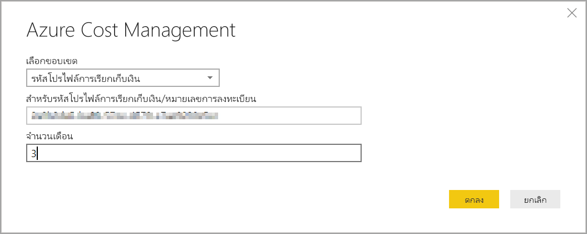
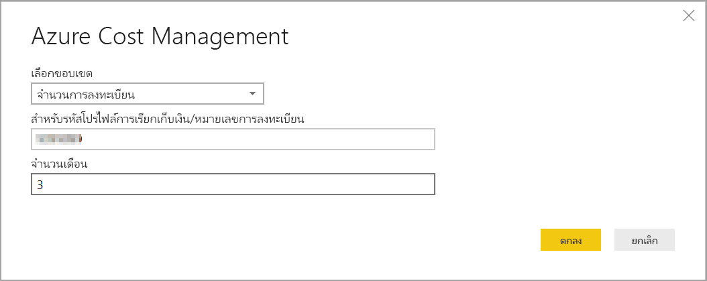

# สร้างวิชวลและรายงานด้วยตัวเชื่อมต่อ Azure Cost Management ใน Power BI DesktopCreate visuals and reports with the Azure Cost Management connector in Power BI Desktop

คุณสามารถใช้ตัวเชื่อมต่อการจัดการค่าใช้จ่ายของ Azure สำหรับ Power BI Desktop เพื่อสร้างการแสดงภาพและรายงานแบบกำหนดเองที่ทรงพลังซึ่งช่วยให้คุณเข้าใจการใช้งาน Azure ของคุณได้ดียิ่งขึ้นYou can use the Azure Cost Management connector for Power BI Desktop to make powerful, customized visualizations and reports that help you better understand your Azure spend. ตัวเชื่อมต่อ Azure Cost Management ในขณะนี้สนับสนุนลูกค้าด้วย[Microsoft Customer Agreement](https://azure.microsoft.com/pricing/purchase-options/microsoft-customer-agreement/) หรือ [Enterprise Agreement (EA)](https://azure.microsoft.com/pricing/enterprise-agreement/)The Azure Cost Management connector currently supports customers with a [Microsoft Customer Agreement](https://azure.microsoft.com/pricing/purchase-options/microsoft-customer-agreement/) or an [Enterprise Agreement (EA)](https://azure.microsoft.com/pricing/enterprise-agreement/).  

ตัวเชื่อมต่อ Azure Cost Management ใช้ OAuth 2.0 สำหรับการรับรองความถูกต้องกับ Azure และระบุตัวตนผู้ใช้ที่กำลังจะใช้ตัวเชื่อมต่อThe Azure Cost Management connector uses OAuth 2.0 for authentication with Azure and identifies users who are going to use the connector. โทเค็นที่สร้างขึ้นในกระบวนการนี้จะใช้ได้สำหรับช่วงเวลาที่ระบุTokens generated in this process are valid for a specific period. Power BI เก็บรักษาโทเค็นสำหรับการเข้าสู่ระบบครั้งถัดไปPower BI preserves the token for the next login. OAuth 2.0 เป็นมาตรฐานสำหรับกระบวนการที่อยู่เบื้องหลังเพื่อให้แน่ใจว่าการจัดการสิทธิ์เหล่านี้มีความปลอดภัยOAuth 2.0, is a standard for the process that goes on behind the scenes to ensure the secure handling of these permissions. หากต้องการเชื่อมต่อคุณต้องใช้บัญชี[ผู้ดูแล Enterprise](/azure/billing/billing-understand-ea-roles) สำหรับข้อตกลงขององค์กรหรือ[เจ้าของบัญชีเรียกเก็บเงิน](/azure/billing/billing-understand-mca-roles) สำหรับข้อตกลงลูกค้าของ MicrosoftTo connect, you must use an [Enterprise Administrator](/azure/billing/billing-understand-ea-roles) account for Enterprise Agreements, or a [Billing account owner](/azure/billing/billing-understand-mca-roles) for Microsoft Customer Agreements. 

> [!NOTE]
> ตัวเชื่อมต่อนี้จะแทนที่ตัวเชื่อมต่อ [Azure Consumption Insights และ Azure Cost Management (Beta)](desktop-connect-azure-consumption-insights.md) ที่มีอยู่ก่อนหน้านี้This connector replaces the previously available [Azure Consumption Insights and Azure Cost Management (Beta)](desktop-connect-azure-consumption-insights.md) connectors. รายงานใดๆ ที่สร้างขึ้นด้วยตัวเชื่อมต่อก่อนหน้านี้จะต้องได้รับการจัดรูปแบบใหม่โดยใช้การเชื่อมต่อนี้Any reports created with the previous connector must be recreated using this connector.

> [!NOTE]
> ตัวเชื่อมต่อ Azure Cost Management สำหรับ Power BI Desktop ไม่รองรับการเชื่อมต่อกับคลาวด์ของรัฐบาลThe Azure Cost Management connector for Power BI Desktop does not support connecting to government clouds. 

## เชื่อมต่อโดยใช้ยังการจัดการค่าใช้จ่ายของ AzureConnect using Azure Cost Management

ในการใช้ตัวเชื่อมต่อ **การจัดการค่าใช้จ่ายของ Azure** ใน Power BI Desktop ให้ทำตามขั้นตอนต่อไปนี้To use the **Azure Cost Management connector** in Power BI Desktop, take the following steps:

1.  ใน Ribbon **หน้าแรก** ให้เลือก **รับข้อมูล**In the **Home** ribbon, select **Get Data**.
2.  เลือก **Azure** จากรายการของประเภทข้อมูลSelect **Azure** from the list of data categories.
3.  เลือก **Azure Cost Management**Select **Azure Cost Management**.

    

4. ในกล่องโต้ตอบที่ปรากฏขึ้นให้ใส่ **ID โปรไฟล์การชำระเงินของคุณ\*\*\*\*ข้อตกลงของลูกค้า Microsoft** หรือ **หมาขเลขการสมัครเข้า** ของคุณสำหรับ **ข้อตกลงองค์กร (EA)**In the dialog that appears, enter either your **Billing Profile ID** for **Microsoft Customer Agreements**, or your **Enrollment Number** for **Enterprise Agreements (EA)**. 

## เชื่อมต่อกับบัญชีข้อตกลงลูกค้าของ MicrosoftConnect to a Microsoft Customer Agreement account 

หากต้องการเชื่อมต่อกับบัญชี **ข้อตกลงลูกค้าของ Microsoft** คุณสามารถรับ **ID โปรไฟล์การชำระเงินของคุณ** จากพอร์ทัล Azure:To connect with a **Microsoft Customer Agreement** account, you can get your **Billing profile ID** from the Azure portal:

1.  ใน [Azure portal](https://portal.azure.com/) นำทางไปยัง **การจัดการค่าใช้จ่าย + การเรียกเก็บเงิน**In the [Azure portal](https://portal.azure.com/), navigate to **Cost Management + Billing**.
2.  เลือกโปรไฟลการ์เรียกเก็บเงินของคุณSelect your Billing profile. 
3.   ในเมนู **การตั้งค่า** ให้เลือก **คุณสมบัติ** ในแถบด้านข้างUnder **Settings** in the menu, select **Properties** in the sidebar.
4.  ในเมนู **โปรไฟล์การเรียกเก็บเงิน** ให้คัดลอก **ID**Under **Billing profile**, copy the **ID**. 
5.  สำหรับ **ขอบเขตการเลือก** ให้เลือก **ID โปรไฟล์การเรียกเก็บเงิน** และวาง ID โปรไฟล์การเรียกเก็บเงินจากขั้นตอนก่อนหน้าFor **Choose Scope**, select **Billing Profile ID** and paste the billing profile ID from the previous step. 
6.  ใส่จำนวนเดือนและเลือก **ตกลง**Enter the number of months and select **OK**.

    

7.  เมื่อได้รับพร้อมท์ให้ลงชื่อเข้าใช้ด้วยบัญชีผู้ใช้และรหัสผ่าน Azure ของคุณWhen prompted, sign in with your Azure user account and password. คุณต้องใช้เจ้าของบัญชีการเรียกเก็บเงินเพื่อการเข้าถึงที่ประสบความสำเร็จYou must use a Billing account owner for successful access. 

## เชื่อมต่อไปยังบัญชีข้อตกลงองค์กรConnect to an Enterprise Agreement account

หากต้องการเชื่อมต่อกับบัญชี ข้อตกลงองค์กร (EA) คุณจะได้รับ ID การลงทะเบียนของคุณจากพอร์ทัล Azure:To connect with an Enterprise Agreement (EA) account, you can get your enrollment ID from the Azure portal:

1.  ใน [Azure portal](https://portal.azure.com/) นำทางไปยัง **การจัดการค่าใช้จ่าย + การเรียกเก็บเงิน**In the [Azure portal](https://portal.azure.com/), navigate to **Cost Management + Billing**.
2.  เลือกบัญชีสำหรับการเรียกเก็บเงินของคุณSelect your billing account.
3.  ในเมนู **ภาพรวม** คัดลอก **ID บัญชีการเรียกเก็บเงิน**On the **Overview** menu, copy the **Billing account ID**.
4.  สำหรับ **ขอบเขตการเลือก** ให้เลือก **หมายเลขการสมัครเข้า** และวาง ID บัญชีการเรียกเก็บเงินจากขั้นตอนก่อนหน้าFor **Choose Scope**, select **Enrollment Number** and paste the billing account ID from the previous step. 
5.  ใส่จำนวนเดือนและจากนั้นเลือก **ตกลง**Enter the number of months and then select **OK**.

    

6.  เมื่อได้รับพร้อมท์ให้ลงชื่อเข้าใช้ด้วยบัญชีผู้ใช้และรหัสผ่าน Azure ของคุณWhen prompted, sign in with your Azure user account and password. คุณต้องใช้บัญชีผู้ดูแลระบบองค์กรสําหรับข้อตกลงขององค์กรYou must use an Enterprise Administrator account for Enterprise Agreements.

## ข้อมูลที่พร้อมใช้งานผ่านตัวเชื่อมต่อData available through the connector

เมื่อคุณรับรองความถูกต้องเรียบร้อยแล้ว หน้าต่าง **ตัวนำทาง** จะปรากฏขึ้นพร้อมกับตารางข้อมูลที่พร้อมใช้งานดังต่อไปนี้:Once you successfully authenticate, a **Navigator** window appears with the following available data tables:

| **ตาราง****Table** | **คำอธิบาย****Description** |
| --- | --- |
| **สรุปยอดดุล****Balance summary** | สรุปยอดดุลสำหรับข้อตกลงองค์กร (EA)Summary of the balance for Enterprise Agreements (EA). |
| **กิจกรรมในการเรียกเก็บเงิน****Billing events** | แฟ้มบันทึกเหตุการณ์ของใบแจ้งหนี้ใหม่ ซื้อเครดิต และอื่น ๆ ข้อตกลงลูกค้าของ Microsoft เท่านั้นEvent log of new invoices, credit purchases, etc. Microsoft Customer Agreement only. |
| **งบประมาณ****Budgets** | รายละเอียดงบประมาณเพื่อดูค่าใช้จ่ายจริงหรือการใช้งานกับเป้าหมายงบประมาณที่มีอยู่Budget details to view actual costs or usage against existing budget targets. |
| **ค่าธรรมเนียม****Charges** | สรุปการใช้งาน Azure ระดับเดือน ค่าธรรมเนียม Market Place และค่าธรรมเนียมที่เรียกเก็บเงินแยกต่างหากA month-level summary of Azure usage, Marketplace charges, and charges billed separately. ข้อตกลงลูกค้าของ Microsoft เท่านั้นMicrosoft Customer Agreement only. |
| **เครดิตทั้งหมด****Credit lots** | รายละเอียดการสั่งซื้อเครดิต Azure ทั้งหมดสำหรับโปรไฟล์การเรียกเก็บเงินที่ระบุAzure credit lot purchase details for the provided billing profile. ข้อตกลงลูกค้าของ Microsoft เท่านั้นMicrosoft Customer Agreement only. |
| **ใบราคา****Pricesheets** | อัตราการใช้โดยตัววัดสำหรับโปรไฟล์การเรียกเก็บเงินที่ระบุหรือการสมัครเข้า EAApplicable meter rates for the provided billing profile or EA enrollment. |
| **ค่าใช้จ่าย RI****RI charges** | ค่าใช้จ่ายที่เชื่อมโยงกับอินสแตนซ์ที่สงวนไว้ของคุณมากกว่า 24 เดือนที่ผ่านมาCharges associated to your Reserved Instances over the last 24 months. |
| **คำแนะนำ RI (ใช้ร่วมกัน)****RI recommendations (shared)** | คำแนะนำในการซื้อมีอินสแตนซ์ที่สงวนไว้ยึดตามแนวโน้มการใช้งานของคุณในการสมัครใช้งานทั้งหมดในช่วง 7, 30 หรือ 60 วันReserved Instance purchase recommendations based on all your subscription usage trends for the last 7, 30 or 60 days. |
| **คำแนะนำ RI (เดียว)****RI recommendations (single)** | คำแนะนำในการซื้อมีอินสแตนซ์ที่สงวนไว้ยึดตามแนวโน้มการใช้งานของคุณในการสมัครใช้งานครั้งเดียวในช่วง 7, 30 หรือ 60 วันReserved Instance purchase recommendations based on your single subscription usage trends for the last 7, 30 or 60 days. |
| **รายละเอียดการใช้งาน RI****RI usage details** | รายละเอียดของปริมาณการใช้สำหรับอินสแตนซ์ที่สงวนไว้ของคุณที่มีอยู่ในช่วงเดือนที่ผ่านมาConsumption details for your existing Reserved Instances over the last month. |
| **ข้อมูลสรุปการใช้งาน RI****RI usage summary** | เปอร์เซ็นต์การใช้งานการของ Azure รายวันDaily Azure reservation usage percentage. |
| **รายละเอียดการใช้งาน****Usage details** | การแบ่งรายละเอียดของปริมาณการใช้และค่าธรรมเนียมโดยประมาณสำหรับโปรไฟล์การเรียกเก็บเงินที่ให้ไว้ในการสมัครเข้า EAA breakdown of consumed quantities and estimated charges for the given billing profile on EA enrollment. |
| **รายละเอียดการใช้งานที่คืนทุน****Usage details amortized** | การแบ่งรายละเอียดของปริมาณการใช้และค่าธรรมเนียมโดยประมาณสำหรับโปรไฟล์การเรียกเก็บเงินที่คืนทุนที่ให้ไว้ในการสมัครเข้า EAA breakdown of consumed quantities and estimated amortized charges for the given billing profile on EA enrollment. |

คุณสามารถเลือกตารางเพื่อดูตัวอย่างบทสนทนาYou can select a table to see a preview dialog. คุณสามารถเลือกโดยการติ๊กกล่องด้านข้างชื่อของพวกเขาอย่างน้อยหนึ่งตาราง จาก นั้นเลือก **การโหลด**You can select one or more tables by selecting the boxes beside their name and then select **Load**.

เมื่อคุณเลือก **โหลด** ข้อมูลจะถูกโหลดลงใน Power BI DesktopWhen you select **Load**, the data is loaded into Power BI Desktop. 

เมื่อข้อมูลที่คุณเลือกถูกโหลด ตารางและเขตข้อมูลที่ปรากฏสามารถเห็นได้ในบานหน้าต่าง **เขตข้อมูล**When the data you selected is loaded, the data tables and fields are shown in the **Fields** pane.

## ขั้นตอนถัดไปNext steps

คุณสามารถเชื่อมต่อไปยังแหล่งข้อมูลต่าง ๆ มากมายโดยใช้ Power BI DesktopYou can connect to many different data sources using Power BI Desktop. สำหรับข้อมูลเพิ่มเติม ให้ดูบทความต่อไปนี้:For more information, see the following articles:

* [Power BI Desktop คืออะไรWhat is Power BI Desktop?](../fundamentals/desktop-what-is-desktop.md)
* [แหล่งข้อมูลใน Power BI DesktopData Sources in Power BI Desktop](desktop-data-sources.md)
* [จัดรูปทรงและรวมข้อมูลด้วย Power BI DesktopShape and Combine Data with Power BI Desktop](desktop-shape-and-combine-data.md)
* [เชื่อมต่อกับเวิร์กบุ๊ก Excel ใน Power BI DesktopConnect to Excel workbooks in Power BI Desktop](desktop-connect-excel.md)   
* [ใส่ข้อมูลลงใน Power BI Desktop โดยตรงEnter data directly into Power BI Desktop](desktop-enter-data-directly-into-desktop.md)