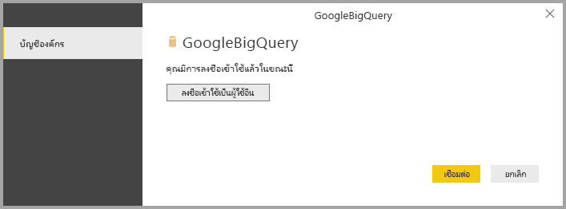
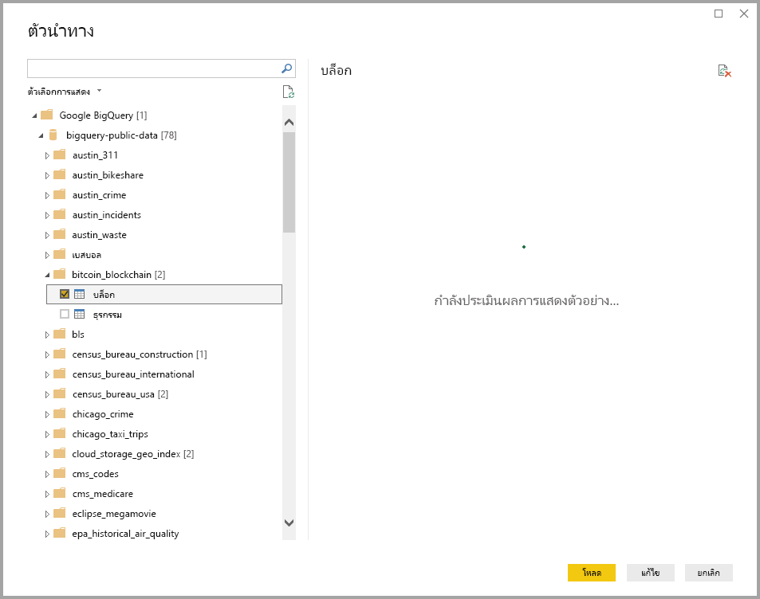

# <a name="connect-to-a-google-bigquery-database-in-power-bi-desktop"></a><span data-ttu-id="c9dfa-103">เชื่อมต่อกับฐานข้อมูล Google BigQuery ใน Power BI Desktop</span><span class="sxs-lookup"><span data-stu-id="c9dfa-103">Connect to a Google BigQuery database in Power BI Desktop</span></span>
<span data-ttu-id="c9dfa-104">ใน Power BI Desktop คุณสามารถเชื่อมต่อกับฐานข้อมูล Google **BigQuery** และใช้ข้อมูลพื้นฐานได้เช่นเดียวกับแหล่งข้อมูลอื่น ๆ ใน Power BI Desktop</span><span class="sxs-lookup"><span data-stu-id="c9dfa-104">In Power BI Desktop, you can connect to a Google **BigQuery** database and use the underlying data just like any other data source in Power BI Desktop.</span></span>

## <a name="connect-to-google-bigquery"></a><span data-ttu-id="c9dfa-105">เชื่อมต่อกับ Google BigQuery</span><span class="sxs-lookup"><span data-stu-id="c9dfa-105">Connect to Google BigQuery</span></span>
<span data-ttu-id="c9dfa-106">การเชื่อมต่อกับฐานข้อมูล Google **BigQuery** เลือก **รับข้อมูล** จากริบบิ้น **หน้าแรก** ใน Power BI Desktop</span><span class="sxs-lookup"><span data-stu-id="c9dfa-106">To connect to a Google **BigQuery** database select **Get Data** from the **Home** ribbon in Power BI Desktop.</span></span> <span data-ttu-id="c9dfa-107">เลือก **ฐานข้อมูล** จากหมวดทางด้านซ้าย แล้วคุณจะเห็น **Google BigQuery**</span><span class="sxs-lookup"><span data-stu-id="c9dfa-107">Select **Database** from the categories on the left, and you see **Google BigQuery**.</span></span>


<span data-ttu-id="c9dfa-109">ในหน้าต่าง **Google BigQuery** ที่ปรากฏขึ้น ให้ลงชื่อเข้าใช้บัญชีผู้ใช้ Google BigQuery แล้วเลือก **เชื่อมต่อ**</span><span class="sxs-lookup"><span data-stu-id="c9dfa-109">In the **Google BigQuery** window that appears, sign in to your Google BigQuery account and select **Connect**.</span></span>


<span data-ttu-id="c9dfa-111">เมื่อคุณลงชื่อเข้าใช้แล้ว คุณจะเห็นหน้าต่างต่อไปนี้ที่ระบุว่าคุณได้รับการตรวจสอบสิทธิ์แล้ว</span><span class="sxs-lookup"><span data-stu-id="c9dfa-111">When you're signed in, you see the following window indicated you've been authenticated.</span></span> 



<span data-ttu-id="c9dfa-113">เมื่อเชื่อมต่อเสร็จเรียบร้อยแล้ว หน้าต่าง **ตัวนำทาง** จะปรากฏขึ้น และแสดงข้อมูลที่พร้อมใช้งานบนเซิร์ฟเวอร์ ซึ่งคุณสามารถเลือกองค์ประกอบหนึ่งรายการหรือหลายรายการเพื่อนำเข้าและใช้ใน **Power BI Desktop** ได้</span><span class="sxs-lookup"><span data-stu-id="c9dfa-113">Once you successfully connect, a **Navigator** window appears and displays the data available on the server, from which you can select one or multiple elements to import and use in **Power BI Desktop**.</span></span>



## <a name="considerations-and-limitations"></a><span data-ttu-id="c9dfa-115">ข้อควรพิจารณาและข้อจำกัด</span><span class="sxs-lookup"><span data-stu-id="c9dfa-115">Considerations and Limitations</span></span>
<span data-ttu-id="c9dfa-116">มีข้อจำกัดและข้อควรพิจารณาบางอย่างเกี่ยวกับตัวเชื่อมต่อ Google **BigQuery**:</span><span class="sxs-lookup"><span data-stu-id="c9dfa-116">There are a few limits and considerations to keep in mind with the Google **BigQuery** connector:</span></span>

* <span data-ttu-id="c9dfa-117">ตัวเชื่อมต่อ Google BigQuery มีให้บริการใน Power BI Desktop และบริการของ Power BI</span><span class="sxs-lookup"><span data-stu-id="c9dfa-117">The Google BigQuery connector is available in Power BI Desktop and in the Power BI service.</span></span> <span data-ttu-id="c9dfa-118">ในบริการ Power BI สามารถเข้าถึงตัวเชื่อมต่อได้โดยใช้การเชื่อมต่อแบบคลาวด์กับคลาวด์จาก Power BI ไปยัง Google BigQuery</span><span class="sxs-lookup"><span data-stu-id="c9dfa-118">In the Power BI service, the connector can be accessed using the Cloud-to-Cloud connection from Power BI to Google BigQuery.</span></span>

* <span data-ttu-id="c9dfa-119">คุณสามารถใช้ Power BI กับ **โครงการการเรียกเก็บเงิน** ของ Google BigQuery ได้</span><span class="sxs-lookup"><span data-stu-id="c9dfa-119">You can use Power BI with the Google BigQuery **Billing Project**.</span></span> <span data-ttu-id="c9dfa-120">ตามค่าเริ่มต้น Power BI จะใช้โครงการแรกจากรายการที่ส่งคืนให้สำหรับผู้ใช้</span><span class="sxs-lookup"><span data-stu-id="c9dfa-120">By default, Power BI uses the first project from the list returned for the user.</span></span> 

  <span data-ttu-id="c9dfa-121">เมื่อต้องการกำหนดลักษณะการทำงานของโครงการการเรียกเก็บเงินเมื่อใช้กับ Power BI ให้ระบุตัวเลือกต่อไปนี้ใน M พื้นฐานในขั้นตอนแหล่งข้อมูล ซึ่งสามารถกำหนดเองโดยใช้ **Power Query Editor** ใน Power BI Desktop:</span><span class="sxs-lookup"><span data-stu-id="c9dfa-121">To customize the behavior of the Billing Project when you use it with Power BI, specify the following option in the underlying M in the Source step, which can be customized by using **Power Query Editor** in Power BI Desktop:</span></span>

  ```
  Source = GoogleBigQuery.Database([BillingProject="Include-Billing-Project-Id-Here"])
  ```

  <span data-ttu-id="c9dfa-122">เริ่มต้นในการเผยแพร่วเมื่อเดือนกันยายน 2020 เราได้เปิดใช้งานการสนับสนุนสำหรับ [ที่เก็บข้อมูล API Google BigQuery](https://cloud.google.com/bigquery/docs/reference/storage)</span><span class="sxs-lookup"><span data-stu-id="c9dfa-122">Beginning in the September 2020 release, we enabled support for the [Google BigQuery Storage API](https://cloud.google.com/bigquery/docs/reference/storage).</span></span> <span data-ttu-id="c9dfa-123">คุณลักษณะนี้ถูกเปิดใช้งานโดยค่าเริ่มต้นและถูกควบคุมโดยค่าอาร์กิวเมนต์บูลีนที่เลือกได้ซึ่งเรียกว่า "UseStorageApi"</span><span class="sxs-lookup"><span data-stu-id="c9dfa-123">This feature is enabled by default and is controlled by the optional boolean argument called "UseStorageApi".</span></span> <span data-ttu-id="c9dfa-124">ลูกค้าบางรายอาจพบปัญหาเกี่ยวกับคุณลักษณะนี้ถ้าพวกเขาใช้สิทธิ์ของประเภทแยกย่อย</span><span class="sxs-lookup"><span data-stu-id="c9dfa-124">Some customers might encounter issues with this feature if they use granular permissions.</span></span> <span data-ttu-id="c9dfa-125">ในสถานการณ์นี้ คุณอาจเห็นข้อความข้อผิดพลาดต่อไปนี้:</span><span class="sxs-lookup"><span data-stu-id="c9dfa-125">In this scenario, you might see the following error message:</span></span>

  `ERROR [HY000] [Microsoft][BigQuery] (131) Unable to authenticate with Google BigQuery Storage API. Check your account permissions`

  <span data-ttu-id="c9dfa-126">คุณสามารถแก้ไขปัญหานี้ได้โดยการปรับสิทธิ์ของผู้ใช้สำหรับที่เก็บข้อมูล API</span><span class="sxs-lookup"><span data-stu-id="c9dfa-126">You can resolve this issue by adjusting the user permissions for Storage API.</span></span> <span data-ttu-id="c9dfa-127">กำหนดสิทธิ์ API ที่เก็บข้อมูลเหล่านี้:</span><span class="sxs-lookup"><span data-stu-id="c9dfa-127">Assign these Storage API permissions:</span></span>

  - <span data-ttu-id="c9dfa-128">`bigquery.readsessions.create` - สร้างเซสชันการอ่านใหม่ผ่านที่เก็บข้อมูล API BigQuery</span><span class="sxs-lookup"><span data-stu-id="c9dfa-128">`bigquery.readsessions.create` - Creates a new read session via the BigQuery Storage API.</span></span>
  - <span data-ttu-id="c9dfa-129">`bigquery.readsessions.getData` - อ่านข้อมูลจากเซสชันการอ่านใหม่ผ่านที่เก็บข้อมูล API BigQuery</span><span class="sxs-lookup"><span data-stu-id="c9dfa-129">`bigquery.readsessions.getData` - Reads data from a read session via the BigQuery Storage API.</span></span>
  - <span data-ttu-id="c9dfa-130">`bigquery.readsessions.update` - อัปเดตเซสชันการอ่านใหม่ผ่านที่เก็บข้อมูล API BigQuery</span><span class="sxs-lookup"><span data-stu-id="c9dfa-130">`bigquery.readsessions.update` - Updates a read session via the BigQuery Storage API.</span></span>

  <span data-ttu-id="c9dfa-131">โดยทั่วไปแล้วสิทธิ์เหล่านี้จะระบุไว้ในบทบาทผู้ใช้ BigQuery</span><span class="sxs-lookup"><span data-stu-id="c9dfa-131">These permissions typically are provided in the BigQuery.User role.</span></span> <span data-ttu-id="c9dfa-132">สำหรับข้อมูลเพิ่มเติม โปรดดู [บทบาทและสิทธิ์ที่กำหนดไว้ล่วงหน้าของ Google BigQuery](https://cloud.google.com/bigquery/docs/access-control)</span><span class="sxs-lookup"><span data-stu-id="c9dfa-132">For more information, see [Google BigQuery Predefined roles and permissions](https://cloud.google.com/bigquery/docs/access-control).</span></span>
  
  <span data-ttu-id="c9dfa-133">ถ้าขั้นตอนข้างต้นไม่สามารถแก้ไขปัญหาหรือถ้าคุณต้องการปิดใช้งานการสนับสนุนที่เก็บข้อมูล API ให้เปลี่ยนคิวรีของคุณดังต่อไปนี้:</span><span class="sxs-lookup"><span data-stu-id="c9dfa-133">If the above steps do not resolve the problem or if you want to disable the support for Storage API, change your query to the following:</span></span>
  ```
  Source = GoogleBigQuery.Database([UseStorageApi=false])
  ```
  <span data-ttu-id="c9dfa-134">หรือถ้าคุณกำลังใช้โครงการเรียกเก็บเงิน ให้เปลี่ยนคิวรีเป็นรายการต่อไปนี้:</span><span class="sxs-lookup"><span data-stu-id="c9dfa-134">Or if you are already using a billing project, change the query to the following:</span></span>
  ```
  Source = GoogleBigQuery.Database([BillingProject="Include-Billing-Project-Id-Here", UseStorageApi=false])
  ```

## <a name="next-steps"></a><span data-ttu-id="c9dfa-135">ขั้นตอนถัดไป</span><span class="sxs-lookup"><span data-stu-id="c9dfa-135">Next steps</span></span>
<span data-ttu-id="c9dfa-136">มีข้อมูลหลากหลายประเภทที่คุณสามารถเชื่อมต่อโดยใช้ Power BI Desktop</span><span class="sxs-lookup"><span data-stu-id="c9dfa-136">There are all sorts of data you can connect to using Power BI Desktop.</span></span> <span data-ttu-id="c9dfa-137">สำหรับข้อมูลเพิ่มเติมเกี่ยวกับแหล่งข้อมูล โปรดดูทรัพยากรต่อไปนี้:</span><span class="sxs-lookup"><span data-stu-id="c9dfa-137">For more information on data sources, check out the following resources:</span></span>

* [<span data-ttu-id="c9dfa-138">Power BI Desktop คืออะไร</span><span class="sxs-lookup"><span data-stu-id="c9dfa-138">What is Power BI Desktop?</span></span>](../fundamentals/desktop-what-is-desktop.md)
* [<span data-ttu-id="c9dfa-139">แหล่งข้อมูลใน Power BI Desktop</span><span class="sxs-lookup"><span data-stu-id="c9dfa-139">Data Sources in Power BI Desktop</span></span>](desktop-data-sources.md)
* [<span data-ttu-id="c9dfa-140">จัดรูปทรงและรวมข้อมูลด้วย Power BI Desktop</span><span class="sxs-lookup"><span data-stu-id="c9dfa-140">Shape and Combine Data with Power BI Desktop</span></span>](desktop-shape-and-combine-data.md)
* [<span data-ttu-id="c9dfa-141">เชื่อมต่อกับเวิร์กบุ๊ก Excel ใน Power BI Desktop</span><span class="sxs-lookup"><span data-stu-id="c9dfa-141">Connect to Excel workbooks in Power BI Desktop</span></span>](desktop-connect-excel.md)   
* [<span data-ttu-id="c9dfa-142">ใส่ข้อมูลลงใน Power BI Desktop โดยตรง</span><span class="sxs-lookup"><span data-stu-id="c9dfa-142">Enter data directly into Power BI Desktop</span></span>](desktop-enter-data-directly-into-desktop.md)   
