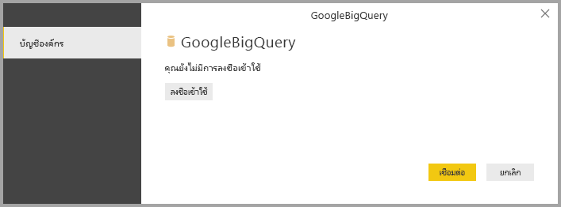

# <a name="connect-to-a-google-bigquery-database-in-power-bi-desktop"></a>เชื่อมต่อกับฐานข้อมูล Google BigQuery ใน Power BI Desktop
ใน Power BI Desktop คุณสามารถเชื่อมต่อกับฐานข้อมูล Google **BigQuery** และใช้ข้อมูลพื้นฐานได้เช่นเดียวกับแหล่งข้อมูลอื่น ๆ ใน Power BI Desktop

## <a name="connect-to-google-bigquery"></a>เชื่อมต่อกับ Google BigQuery
การเชื่อมต่อกับฐานข้อมูล Google **BigQuery** เลือก **รับข้อมูล** จากริบบิ้น **หน้าแรก** ใน Power BI Desktop เลือก **ฐานข้อมูล** จากหมวดทางด้านซ้าย แล้วคุณจะเห็น **Google BigQuery**


ในหน้าต่าง **Google BigQuery** ที่ปรากฏขึ้น ให้ลงชื่อเข้าใช้บัญชีผู้ใช้ Google BigQuery แล้วเลือก **เชื่อมต่อ**



เมื่อคุณลงชื่อเข้าใช้แล้ว คุณจะเห็นหน้าต่างต่อไปนี้ที่ระบุว่าคุณได้รับการตรวจสอบสิทธิ์แล้ว 


เมื่อเชื่อมต่อเสร็จเรียบร้อยแล้ว หน้าต่าง **ตัวนำทาง** จะปรากฏขึ้น และแสดงข้อมูลที่พร้อมใช้งานบนเซิร์ฟเวอร์ ซึ่งคุณสามารถเลือกองค์ประกอบหนึ่งรายการหรือหลายรายการเพื่อนำเข้าและใช้ใน **Power BI Desktop** ได้


## <a name="considerations-and-limitations"></a>ข้อควรพิจารณาและข้อจำกัด
มีข้อจำกัดและข้อควรพิจารณาบางอย่างเกี่ยวกับตัวเชื่อมต่อ Google **BigQuery**:

* ตัวเชื่อมต่อ Google BigQuery มีให้บริการใน Power BI Desktop และบริการของ Power BI ในบริการ Power BI สามารถเข้าถึงตัวเชื่อมต่อได้โดยใช้การเชื่อมต่อแบบคลาวด์กับคลาวด์จาก Power BI ไปยัง Google BigQuery

* คุณสามารถใช้ Power BI กับ **โครงการการเรียกเก็บเงิน** ของ Google BigQuery ได้ ตามค่าเริ่มต้น Power BI จะใช้โครงการแรกจากรายการที่ส่งคืนให้สำหรับผู้ใช้ 

  เมื่อต้องการกำหนดลักษณะการทำงานของโครงการการเรียกเก็บเงินเมื่อใช้กับ Power BI ให้ระบุตัวเลือกต่อไปนี้ใน M พื้นฐานในขั้นตอนแหล่งข้อมูล ซึ่งสามารถกำหนดเองโดยใช้ **Power Query Editor** ใน Power BI Desktop:

  ```
  Source = GoogleBigQuery.Database([BillingProject="Include-Billing-Project-Id-Here"])
  ```

  เริ่มต้นในการเผยแพร่วเมื่อเดือนกันยายน 2020 เราได้เปิดใช้งานการสนับสนุนสำหรับ [ที่เก็บข้อมูล API Google BigQuery](https://cloud.google.com/bigquery/docs/reference/storage) คุณลักษณะนี้ถูกเปิดใช้งานโดยค่าเริ่มต้นและถูกควบคุมโดยค่าอาร์กิวเมนต์บูลีนที่เลือกได้ซึ่งเรียกว่า "UseStorageApi" ลูกค้าบางรายอาจพบปัญหาเกี่ยวกับคุณลักษณะนี้ถ้าพวกเขาใช้สิทธิ์ของประเภทแยกย่อย ในสถานการณ์นี้ คุณอาจเห็นข้อความข้อผิดพลาดต่อไปนี้:

  `ERROR [HY000] [Microsoft][BigQuery] (131) Unable to authenticate with Google BigQuery Storage API. Check your account permissions`

  คุณสามารถแก้ไขปัญหานี้ได้โดยการปรับสิทธิ์ของผู้ใช้สำหรับที่เก็บข้อมูล API กำหนดสิทธิ์ API ที่เก็บข้อมูลเหล่านี้:

  - `bigquery.readsessions.create` - สร้างเซสชันการอ่านใหม่ผ่านที่เก็บข้อมูล API BigQuery
  - `bigquery.readsessions.getData` - อ่านข้อมูลจากเซสชันการอ่านใหม่ผ่านที่เก็บข้อมูล API BigQuery
  - `bigquery.readsessions.update` - อัปเดตเซสชันการอ่านใหม่ผ่านที่เก็บข้อมูล API BigQuery

  โดยทั่วไปแล้วสิทธิ์เหล่านี้จะระบุไว้ในบทบาทผู้ใช้ BigQuery สำหรับข้อมูลเพิ่มเติม โปรดดู [บทบาทและสิทธิ์ที่กำหนดไว้ล่วงหน้าของ Google BigQuery](https://cloud.google.com/bigquery/docs/access-control)
  
  ถ้าขั้นตอนข้างต้นไม่สามารถแก้ไขปัญหาหรือถ้าคุณต้องการปิดใช้งานการสนับสนุนที่เก็บข้อมูล API ให้เปลี่ยนคิวรีของคุณดังต่อไปนี้:
  ```
  Source = GoogleBigQuery.Database([UseStorageApi=false])
  ```
  หรือถ้าคุณกำลังใช้โครงการเรียกเก็บเงิน ให้เปลี่ยนคิวรีเป็นรายการต่อไปนี้:
  ```
  Source = GoogleBigQuery.Database([BillingProject="Include-Billing-Project-Id-Here", UseStorageApi=false])
  ```

## <a name="next-steps"></a>ขั้นตอนถัดไป
มีข้อมูลหลากหลายประเภทที่คุณสามารถเชื่อมต่อโดยใช้ Power BI Desktop สำหรับข้อมูลเพิ่มเติมเกี่ยวกับแหล่งข้อมูล โปรดดูทรัพยากรต่อไปนี้:

* [Power BI Desktop คืออะไร](../fundamentals/desktop-what-is-desktop.md)
* [แหล่งข้อมูลใน Power BI Desktop](desktop-data-sources.md)
* [จัดรูปทรงและรวมข้อมูลด้วย Power BI Desktop](desktop-shape-and-combine-data.md)
* [เชื่อมต่อกับเวิร์กบุ๊ก Excel ใน Power BI Desktop](desktop-connect-excel.md)   
* [ใส่ข้อมูลลงใน Power BI Desktop โดยตรง](desktop-enter-data-directly-into-desktop.md)   
