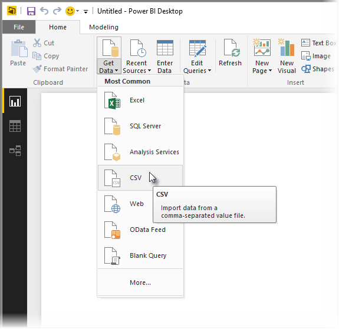
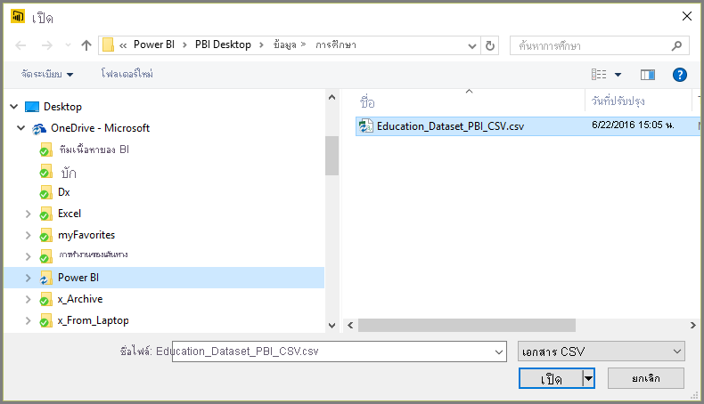
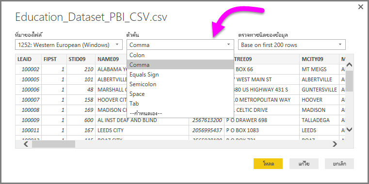
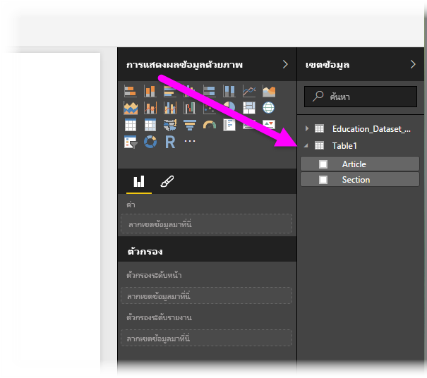

# เชื่อมต่อกับไฟล์ CSV ใน Power BI DesktopConnect to CSV files in Power BI Desktop
การเชื่อมต่อกับแฟ้มที่ใช้จุลภาคเป็นตัวคั่น (*CSV*) จาก Power BI Desktop เหมือนการเชื่อมต่อกับเวิร์กบุ๊ก Excel มากConnecting to a comma-separated value (*CSV*) file from Power BI Desktop is a lot like connecting to an Excel workbook. ทั้งสองเป็นเรื่องง่าย และบทความนี้จะพาคุณไปตามขั้นตอน วิธีการเชื่อมต่อกับไฟล์ CSV ใด ๆ ที่คุณสามารถเข้าถึงได้Both are easy, and this article steps you through how to connect to any CSV file to which you have access.

เริ่มต้นจากใน Power BI Desktop เลือก **รับข้อมูล > CSV** จาก ribbon **หน้าแรก**To start with, from Power BI Desktop select **Get Data > CSV** from the **Home** ribbon.

เลือกไฟล์ CSV ของคุณจากกล่องโต้ตอบ **เปิด** ที่ปรากฏขึ้นSelect your CSV file from the **Open** dialog that appears.

เมื่อคุณเลือก **เปิด** Power BI Desktop จะเข้าถึงไฟล์ และพิจารณาไฟล์แอตทริบิวต์บางตัว เช่นที่มาของไฟล์ ชนิดตัวคั่น และจำนวนแถวที่ควรใช้เพื่อตรวจสอบชนิดข้อมูลในไฟล์When you select **Open**, Power BI Desktop accesses the file and determines certain file attributes, such as the file origin, delimiter type, and how many rows should be used to detect the data types in the file.

แอตทริบิวต์และตัวเลือกของไฟล์เหล่านี้ จะแสดงในรายการดรอปดาวน์ด้านบนของหน้าต่างกล่องโต้ตอบ **การนำเข้า CSV** ดังแสดงด้านล่างนี้These file attributes and options are shown in the drop-down selections at the top of the **CSV import** dialog window, shown below. คุณสามารถเปลี่ยนการตั้งค่าที่ตรวจพบเหล่านี้ด้วยตนเอง โดยการเลือกตัวเลือกอื่นจากรายการดรอปดาวน์ได้You can change any of these detected settings manually, by choosing another option from any of the drop-down selectors.

เมื่อคุณพอใจกับการเลือก คุณสามารถเลือก **โหลด** เพื่อการนำเข้าไฟล์ไปยัง Power BI Desktop หรือคุณสามารถเลือก **แก้ไข** เพื่อเปิด **ตัวแก้ไขคิวรี** และจัดรูปทรงหรือแปลงข้อมูลเพิ่มเติม ก่อนที่จะนำเข้าWhen you’re satisfied with the selections, you can select **Load** to import the file into Power BI Desktop, or you can select **Edit** to open **Query Editor** and further shape or transform the data before importing it.

เมื่อคุณโหลดข้อมูลลงใน Power BI Desktop แล้ว คุณจะเห็นตารางและคอลัมน์ (ซึ่งจะแสดงเป็นเขตข้อมูลใน Power BI Desktop) ในบานหน้าต่าง **เขตข้อมูล** ทางด้านขวาของมุมมองรายงานใน Power BI DesktopOnce you load the data into Power BI Desktop, you see the table and its columns (which are presented as Fields in Power BI Desktop) in the **Fields** pane, along the right of the Report view in Power BI Desktop.

นั่นคือทั้งหมดที่คุณต้องทำ – ข้อมูลจากไฟล์ CSV ของคุณในขณะนี้ อยู่ใน Power BI Desktop เรียบร้อยแล้วThat’s all you have to do – the data from your CSV file is now in Power BI Desktop.

คุณสามารถใช้ข้อมูลดังกล่าวใน Power BI Desktop เพื่อสร้างวิชวล รายงาน หรือโต้ตอบกับข้อมูลอื่น ๆ ที่คุณอาจต้องการเชื่อมต่อและนำเข้า เช่น เวิร์กบุ๊ก Excel, ฐานข้อมูล หรือแหล่งข้อมูลอื่นYou can use that data in Power BI Desktop to create visuals, reports, or interact with any other data you might want to connect with and import, such as Excel workbooks, databases, or any other data source.

> [!IMPORTANT]
> เมื่อคุณนำเข้าไฟล์ CSV, Power BI Desktop จะสร้าง *คอลัมน์ = x* (โดยที่ *x* คือจำนวนคอลัมน์ในไฟล์ CSV ในระหว่างการนำเข้าเริ่มต้น) เป็นขั้นตอนในตัวแก้ไข Power QueryWhen you import a CSV file, Power BI Desktop generates a *columns=x* (where *x* is the number of columns in the CSV file during initial import) as a step in Power Query Editor. หากคุณเพิ่มคอลัมน์เพิ่มเติมในภายหลังและแหล่งข้อมูลถูกตั้งค่าให้รีเฟรช คอลัมน์ใด ๆ ที่เกินจำนวนคอลัมน์ *x* เริ่มต้น จะไม่รีเฟรชIf you subsequently add more columns and the data source is set to refresh, any columns beyond the initial *x* count of columns are not refreshed. 

## ขั้นตอนถัดไปNext steps
มีข้อมูลหลากหลายประเภทที่คุณสามารถเชื่อมต่อโดยใช้ Power BI DesktopThere are all sorts of data you can connect to using Power BI Desktop. สำหรับข้อมูลเพิ่มเติมเกี่ยวกับแหล่งข้อมูล โปรดดูทรัพยากรต่อไปนี้:For more information on data sources, check out the following resources:

* [Power BI Desktop คืออะไรWhat is Power BI Desktop?](../fundamentals/desktop-what-is-desktop.md)
* [แหล่งข้อมูลใน Power BI DesktopData Sources in Power BI Desktop](desktop-data-sources.md)
* [จัดรูปทรงและรวมข้อมูลด้วย Power BI DesktopShape and Combine Data with Power BI Desktop](desktop-shape-and-combine-data.md)
* [เชื่อมต่อกับเวิร์กบุ๊ก Excel ใน Power BI DesktopConnect to Excel workbooks in Power BI Desktop](desktop-connect-excel.md)   
* [ป้อนข้อมูลลงใน Power BI Desktop โดยตรงEnter data directly into Power BI Desktop](desktop-enter-data-directly-into-desktop.md)   
